# Create Flow

Create a new workflow flow that can be executed to automate business processes.

## Endpoint

<api-endpoint>
  <method>POST</method>
  <url>/api/v1/flows</url>
</api-endpoint>

## Request Body

<ParamField body="name" type="string" required>
  The name of the flow
  
  <expandable title="Requirements">
    - Must be unique within the organization
    - 3-100 characters long
    - Can contain letters, numbers, spaces, hyphens, and underscores
  </expandable>
</ParamField>

<ParamField body="description" type="string">
  Optional description of what the flow does
  
  Maximum 500 characters
</ParamField>

<ParamField body="steps" type="array" required>
  Array of flow steps that define the workflow logic
  
  <expandable title="Step Object">
    <ParamField body="steps[].name" type="string" required>
      Unique name for this step within the flow
    </ParamField>
    
    <ParamField body="steps[].actionId" type="string" required>
      ID of the action to execute in this step
    </ParamField>
    
    <ParamField body="steps[].input" type="object">
      Input data to pass to the action. Supports template variables.
    </ParamField>
    
    <ParamField body="steps[].executeIf" type="string">
      Conditional expression - step only executes if this evaluates to true
    </ParamField>
    
    <ParamField body="steps[].parallel" type="boolean">
      Whether this step can run in parallel with the next step
      
      **Default**: `false`
    </ParamField>
    
    <ParamField body="steps[].retryConfig" type="object">
      Retry configuration for this step
      
      <expandable title="Retry Config">
        <ParamField body="maxAttempts" type="number">
          Maximum number of retry attempts (1-10)
          
          **Default**: `3`
        </ParamField>
        
        <ParamField body="backoffMultiplier" type="number">
          Exponential backoff multiplier
          
          **Default**: `2`
        </ParamField>
      </expandable>
    </ParamField>
  </expandable>
</ParamField>

<ParamField body="inputSchema" type="object">
  JSON Schema defining the expected input format for flow executions
  
  <expandable title="Input Schema Format">
    Standard JSON Schema v7 format. Defines the structure and validation rules for flow input data.
    
    Example:
    ```json
    {
      "type": "object",
      "properties": {
        "customerId": {
          "type": "string",
          "description": "Customer ID"
        },
        "amount": {
          "type": "number",
          "minimum": 0
        }
      },
      "required": ["customerId"]
    }
    ```
  </expandable>
</ParamField>

<ParamField body="outputSchema" type="object">
  JSON Schema defining the expected output format from flow executions
</ParamField>

<ParamField body="tags" type="array">
  Array of tags to categorize and organize the flow
  
  Each tag must be a string, 1-50 characters
</ParamField>

<ParamField body="status" type="string">
  Initial status of the flow
  
  **Options**: `active`, `paused`  
  **Default**: `active`
</ParamField>

## Response

<ResponseField name="id" type="string">
  Unique identifier for the created flow
</ResponseField>

<ResponseField name="name" type="string">
  Name of the flow
</ResponseField>

<ResponseField name="description" type="string">
  Description of the flow
</ResponseField>

<ResponseField name="steps" type="array">
  Array of flow steps with resolved action references
</ResponseField>

<ResponseField name="inputSchema" type="object">
  Input validation schema
</ResponseField>

<ResponseField name="outputSchema" type="object">
  Output schema definition
</ResponseField>

<ResponseField name="status" type="string">
  Current status of the flow
</ResponseField>

<ResponseField name="tags" type="array">
  Associated tags
</ResponseField>

<ResponseField name="organizationId" type="string">
  Organization that owns this flow
</ResponseField>

<ResponseField name="createdAt" type="string">
  ISO 8601 timestamp of when the flow was created
</ResponseField>

<ResponseField name="updatedAt" type="string">
  ISO 8601 timestamp of when the flow was last updated
</ResponseField>

<ResponseField name="createdBy" type="object">
  Information about who created the flow
  
  <expandable title="Created By Object">
    <ResponseField name="userId" type="string">
      ID of the user who created the flow
    </ResponseField>
    
    <ResponseField name="email" type="string">
      Email of the user who created the flow
    </ResponseField>
  </expandable>
</ResponseField>

## Flow Structure Diagram

```mermaid
graph TD
    A["🚀 Flow Start"] --> B["📝 Step 1: Validate Input"]
    B --> C{"✅ Validation Passed?"}
    C -->|Yes| D["⚙️ Step 2: Process Data"]
    C -->|No| E["❌ Return Error"]
    D --> F["📤 Step 3: Send Notification"]
    F --> G["📊 Step 4: Log Results"]
    G --> H["✨ Flow Complete"]
    
    style A fill:#e1f5fe
    style H fill:#e8f5e8
    style E fill:#ffebee
    style C fill:#fff3e0
```



## Examples

<CodeGroup>
```bash cURL
curl -X POST https://api.tolstoy.getpullse.com/api/v1/flows \
  -H "Authorization: Bearer YOUR_API_KEY" \
  -H "Content-Type: application/json" \
  -d '{
    "name": "Customer Onboarding",
    "description": "Automated customer onboarding workflow",
    "steps": [
      {
        "name": "send_welcome_email",
        "actionId": "act_email_welcome",
        "input": {
          "to": "{{customer.email}}",
          "name": "{{customer.name}}"
        }
      },
      {
        "name": "create_account",
        "actionId": "act_create_account",
        "input": {
          "customer": "{{customer}}"
        }
      },
      {
        "name": "setup_trial",
        "actionId": "act_setup_trial",
        "input": {
          "accountId": "{{steps.create_account.accountId}}",
          "trialDays": 14
        }
      }
    ],
    "inputSchema": {
      "type": "object",
      "properties": {
        "customer": {
          "type": "object",
          "properties": {
            "email": {"type": "string", "format": "email"},
            "name": {"type": "string"}
          },
          "required": ["email", "name"]
        }
      },
      "required": ["customer"]
    },
    "tags": ["onboarding", "customer"],
    "status": "active"
  }'
```

```javascript JavaScript
const response = await fetch('https://api.tolstoy.getpullse.com/api/v1/flows', {
  method: 'POST',
  headers: {
    'Authorization': 'Bearer YOUR_API_KEY',
    'Content-Type': 'application/json'
  },
  body: JSON.stringify({
    name: 'Payment Processing',
    description: 'Handle payment processing with retries and notifications',
    steps: [
      {
        name: 'validate_payment',
        actionId: 'act_stripe_validate',
        input: {
          amount: '{{input.amount}}',
          currency: '{{input.currency}}',
          paymentMethod: '{{input.paymentMethod}}'
        }
      },
      {
        name: 'process_payment',
        actionId: 'act_stripe_charge',
        input: {
          amount: '{{input.amount}}',
          currency: '{{input.currency}}',
          paymentMethod: '{{input.paymentMethod}}'
        },
        retryConfig: {
          maxAttempts: 3,
          backoffMultiplier: 2
        }
      },
      {
        name: 'send_confirmation',
        actionId: 'act_email_receipt',
        input: {
          to: '{{input.customerEmail}}',
          paymentId: '{{steps.process_payment.id}}'
        },
        executeIf: '{{steps.process_payment.status == "succeeded"}}'
      }
    ],
    inputSchema: {
      type: 'object',
      properties: {
        amount: { type: 'number', minimum: 1 },
        currency: { type: 'string', enum: ['usd', 'eur', 'gbp'] },
        paymentMethod: { type: 'string' },
        customerEmail: { type: 'string', format: 'email' }
      },
      required: ['amount', 'currency', 'paymentMethod', 'customerEmail']
    },
    tags: ['payment', 'stripe'],
    status: 'active'
  })
});

const flow = await response.json();
console.log('Created flow:', flow.id);
```

```python Python
import requests
import json

url = 'https://api.tolstoy.getpullse.com/api/v1/flows'
headers = {
    'Authorization': 'Bearer YOUR_API_KEY',
    'Content-Type': 'application/json'
}

flow_data = {
    'name': 'Data Synchronization',
    'description': 'Sync customer data between CRM and marketing platform',
    'steps': [
        {
            'name': 'extract_customers',
            'actionId': 'act_crm_query',
            'input': {
                'query': 'SELECT * FROM customers WHERE updated_at > {{lastSync}}',
                'limit': 1000
            }
        },
        {
            'name': 'transform_data',
            'actionId': 'act_transform_schema',
            'input': {
                'data': '{{steps.extract_customers.results}}',
                'mapping': 'crm_to_marketing'
            }
        },
        {
            'name': 'load_to_marketing',
            'actionId': 'act_hubspot_upsert',
            'input': {
                'contacts': '{{steps.transform_data.transformed}}'
            },
            'parallel': True
        }
    ],
    'inputSchema': {
        'type': 'object',
        'properties': {
            'lastSync': {
                'type': 'string',
                'format': 'date-time',
                'description': 'Timestamp of last successful sync'
            }
        },
        'required': ['lastSync']
    },
    'tags': ['sync', 'crm', 'marketing'],
    'status': 'active'
}

response = requests.post(url, headers=headers, json=flow_data)
flow = response.json()

print(f'Created flow: {flow["id"]}')
print(f'Flow name: {flow["name"]}')
```

```go Go SDK
package main

import (
    "context"
    "fmt"
    "log"

    "github.com/tolstoy/go-sdk/tolstoy"
)

func main() {
    client, err := tolstoy.NewClient(&tolstoy.Config{
        APIKey:         "your-api-key",
        OrganizationID: "org_abc123def456",
        UserID:         "user_xyz789abc",
    })
    if err != nil {
        log.Fatalf("Failed to create client: %v", err)
    }
    defer client.Close()

    ctx := context.Background()
    
    flow, err := client.Flows.Create(ctx, &tolstoy.CreateFlowRequest{
        Name:        "Data Synchronization",
        Description: "Sync customer data between CRM and marketing platform",
        Steps: []tolstoy.FlowStep{
            {
                Name:     "extract_customers",
                ActionID: "act_crm_query",
                Input: map[string]interface{}{
                    "query": "SELECT * FROM customers WHERE updated_at > {{lastSync}}",
                    "limit": 1000,
                },
            },
            {
                Name:     "transform_data",
                ActionID: "act_transform_schema",
                Input: map[string]interface{}{
                    "data":    "{{steps.extract_customers.results}}",
                    "mapping": "crm_to_marketing",
                },
            },
            {
                Name:     "load_to_marketing",
                ActionID: "act_hubspot_upsert",
                Input: map[string]interface{}{
                    "contacts": "{{steps.transform_data.transformed}}",
                },
                Parallel: true,
            },
        },
        InputSchema: &tolstoy.JSONSchema{
            Type: "object",
            Properties: map[string]tolstoy.JSONSchemaProperty{
                "lastSync": {
                    Type:        "string",
                    Format:      "date-time",
                    Description: "Timestamp of last successful sync",
                },
            },
            Required: []string{"lastSync"},
        },
        Tags:   []string{"sync", "crm", "marketing"},
        Status: "active",
    })
    if err != nil {
        log.Fatalf("Failed to create flow: %v", err)
    }

    fmt.Printf("Created flow: %s\n", flow.ID)
    fmt.Printf("Flow name: %s\n", flow.Name)
}
```
</CodeGroup>

## Response Examples

<Tabs>
  <Tab title="201 Created">
    ```json
    {
      "id": "flow_abc123def456",
      "name": "Customer Onboarding",
      "description": "Automated customer onboarding workflow",
      "steps": [
        {
          "id": "step_001",
          "name": "send_welcome_email",
          "actionId": "act_email_welcome",
          "input": {
            "to": "{{customer.email}}",
            "name": "{{customer.name}}"
          },
          "executeIf": null,
          "parallel": false,
          "retryConfig": {
            "maxAttempts": 3,
            "backoffMultiplier": 2
          }
        },
        {
          "id": "step_002",
          "name": "create_account",
          "actionId": "act_create_account",
          "input": {
            "customer": "{{customer}}"
          },
          "executeIf": null,
          "parallel": false,
          "retryConfig": {
            "maxAttempts": 3,
            "backoffMultiplier": 2
          }
        }
      ],
      "inputSchema": {
        "type": "object",
        "properties": {
          "customer": {
            "type": "object",
            "properties": {
              "email": {"type": "string", "format": "email"},
              "name": {"type": "string"}
            },
            "required": ["email", "name"]
          }
        },
        "required": ["customer"]
      },
      "outputSchema": null,
      "status": "active",
      "tags": ["onboarding", "customer"],
      "organizationId": "org_123456789",
      "createdAt": "2023-12-01T10:30:00Z",
      "updatedAt": "2023-12-01T10:30:00Z",
      "createdBy": {
        "userId": "user_789012345",
        "email": "developer@company.com"
      }
    }
    ```
  </Tab>
  
  <Tab title="400 Bad Request">
    ```json
    {
      "error": {
        "code": "VALIDATION_ERROR",
        "message": "Request validation failed",
        "details": [
          {
            "field": "name",
            "message": "Flow name must be unique within organization"
          },
          {
            "field": "steps[0].actionId",
            "message": "Action 'act_invalid_action' not found"
          }
        ]
      },
      "requestId": "req_abc123"
    }
    ```
  </Tab>
  
  <Tab title="401 Unauthorized">
    ```json
    {
      "error": {
        "code": "UNAUTHORIZED",
        "message": "Invalid or missing API key"
      },
      "requestId": "req_def456"
    }
    ```
  </Tab>
</Tabs>

## Template Variables

Flow steps support template variables for dynamic content:

### Input Variables

- `{{input.fieldName}}` - Access fields from flow execution input
- `{{steps.stepName.fieldName}}` - Access output from previous steps
- `{{env.VARIABLE_NAME}}` - Access environment variables

### Built-in Variables

- `{{now}}` - Current timestamp (ISO 8601)
- `{{uuid}}` - Generate a random UUID
- `{{orgId}}` - Current organization ID
- `{{userId}}` - Current user ID

### Helper Functions

- `{{field | default("fallback")}}` - Provide default value
- `{{text | upper}}` - Convert to uppercase
- `{{text | lower}}` - Convert to lowercase
- `{{number | round(2)}}` - Round to 2 decimal places

## Best Practices

<CardGroup cols={2}>
  <Card title="Step Naming" icon="tag">
    **Clear Names**
    - Use descriptive, action-oriented names
    - Follow snake_case convention
    - Keep names concise but meaningful
  </Card>
  <Card title="Error Handling" icon="shield-exclamation">
    **Robust Flows**
    - Add conditional steps for error handling
    - Configure appropriate retry settings
    - Include validation steps
  </Card>
  <Card title="Input Validation" icon="check-circle">
    **Schema Design**
    - Define comprehensive input schemas
    - Use appropriate data types and formats
    - Include helpful descriptions
  </Card>
  <Card title="Template Usage" icon="code">
    **Dynamic Content**
    - Use template variables for reusability
    - Provide fallback values
    - Test with sample data
  </Card>
</CardGroup>

## Related Endpoints

- [Execute Flow](/api/endpoints/flows/execute-flow) - Execute a created flow
- [List Flows](/api/endpoints/flows/list-flows) - Get all flows
- [Get Flow](/api/endpoints/flows/get-flow) - Get flow details
- [Update Flow](/api/endpoints/flows/update-flow) - Modify an existing flow
- [Delete Flow](/api/endpoints/flows/delete-flow) - Remove a flow

---

<Snippet file="api-footer.mdx" />