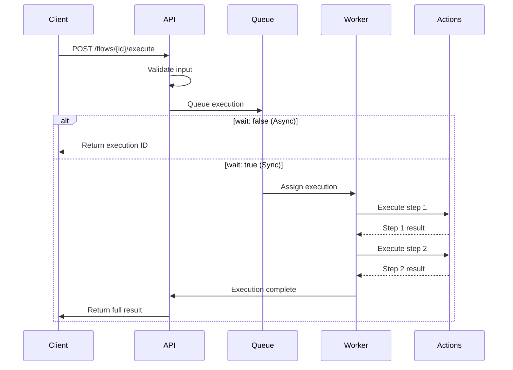

# Execute Flow

Trigger execution of a workflow flow with custom input data and monitor the execution process.

## Endpoint

<api-endpoint>
  <method>POST</method>
  <url>/api/v1/flows/{flowId}/execute</url>
</api-endpoint>

## Path Parameters

<ParamField path="flowId" type="string" required>
  Unique identifier of the flow to execute
  
  Example: `flow_abc123def456`
</ParamField>

## Request Body

<ParamField body="input" type="object">
  Input data for the flow execution. Must match the flow's input schema if defined.
  
  <expandable title="Input Structure">
    The input object structure depends on the flow's `inputSchema`. All required fields defined in the schema must be provided.
    
    Example for a customer onboarding flow:
    ```json
    {
      "customer": {
        "email": "john@example.com",
        "name": "John Doe",
        "company": "Acme Corp"
      },
      "plan": "professional"
    }
    ```
  </expandable>
</ParamField>

<ParamField body="wait" type="boolean">
  Whether to wait for the execution to complete before responding
  
  **Default**: `false`
  
  - `true`: Response includes final execution result
  - `false`: Response includes execution ID for async monitoring
</ParamField>

<ParamField body="timeout" type="number">
  Maximum time to wait for execution completion (in seconds)
  
  **Range**: 1-3600 seconds  
  **Default**: `300`  
  **Note**: Only applies when `wait: true`
</ParamField>

<ParamField body="priority" type="string">
  Execution priority level
  
  **Options**: `low`, `normal`, `high`, `urgent`  
  **Default**: `normal`
  
  Higher priority executions are processed first in the queue.
</ParamField>

<ParamField body="tags" type="array">
  Optional tags to associate with this execution for tracking and filtering
  
  Each tag must be a string, 1-50 characters
  
  Example: `["manual", "test", "v2.1"]`
</ParamField>

<ParamField body="idempotencyKey" type="string">
  Optional idempotency key to prevent duplicate executions
  
  Maximum 255 characters. If provided, subsequent requests with the same key within 24 hours will return the original execution result.
</ParamField>

## Response (Async Mode - wait: false)

<ResponseField name="executionId" type="string">
  Unique identifier for the execution
</ResponseField>

<ResponseField name="flowId" type="string">
  ID of the flow being executed
</ResponseField>

<ResponseField name="status" type="string">
  Current execution status
  
  **Values**: `queued`, `running`
</ResponseField>

<ResponseField name="queuePosition" type="number">
  Position in the execution queue (only when status is "queued")
</ResponseField>

<ResponseField name="estimatedStartTime" type="string">
  Estimated start time (ISO 8601) based on current queue load
</ResponseField>

<ResponseField name="createdAt" type="string">
  ISO 8601 timestamp when the execution was created
</ResponseField>

## Response (Sync Mode - wait: true)

<ResponseField name="executionId" type="string">
  Unique identifier for the execution
</ResponseField>

<ResponseField name="flowId" type="string">
  ID of the flow that was executed
</ResponseField>

<ResponseField name="status" type="string">
  Final execution status
  
  **Values**: `completed`, `failed`, `timeout`
</ResponseField>

<ResponseField name="result" type="object">
  Output data from the flow execution (only when status is "completed")
</ResponseField>

<ResponseField name="error" type="object">
  Error information (only when status is "failed")
  
  <expandable title="Error Object">
    <ResponseField name="code" type="string">
      Error code indicating the type of failure
    </ResponseField>
    
    <ResponseField name="message" type="string">
      Human-readable error description
    </ResponseField>
    
    <ResponseField name="step" type="string">
      Name of the step where the error occurred
    </ResponseField>
    
    <ResponseField name="details" type="object">
      Additional error context and details
    </ResponseField>
  </expandable>
</ResponseField>

<ResponseField name="steps" type="array">
  Execution details for each step
  
  <expandable title="Step Execution">
    <ResponseField name="name" type="string">
      Name of the step
    </ResponseField>
    
    <ResponseField name="status" type="string">
      Step execution status: `completed`, `failed`, `skipped`
    </ResponseField>
    
    <ResponseField name="startedAt" type="string">
      ISO 8601 timestamp when step execution started
    </ResponseField>
    
    <ResponseField name="completedAt" type="string">
      ISO 8601 timestamp when step execution completed
    </ResponseField>
    
    <ResponseField name="duration" type="number">
      Step execution duration in milliseconds
    </ResponseField>
    
    <ResponseField name="output" type="object">
      Output data from the step (when successful)
    </ResponseField>
    
    <ResponseField name="error" type="object">
      Error information (when failed)
    </ResponseField>
  </expandable>
</ResponseField>

<ResponseField name="startedAt" type="string">
  ISO 8601 timestamp when execution started
</ResponseField>

<ResponseField name="completedAt" type="string">
  ISO 8601 timestamp when execution completed
</ResponseField>

<ResponseField name="duration" type="number">
  Total execution duration in milliseconds
</ResponseField>

<ResponseField name="metadata" type="object">
  Additional execution metadata
  
  <expandable title="Metadata Fields">
    <ResponseField name="priority" type="string">
      Execution priority level
    </ResponseField>
    
    <ResponseField name="tags" type="array">
      Tags associated with the execution
    </ResponseField>
    
    <ResponseField name="triggeredBy" type="string">
      How the execution was triggered: `api`, `webhook`, `schedule`, `manual`
    </ResponseField>
    
    <ResponseField name="executionNode" type="string">
      ID of the worker node that processed the execution
    </ResponseField>
  </expandable>
</ResponseField>

## Execution Flow Diagram



## Examples

<CodeGroup>
```bash cURL (Async)
curl -X POST https://api.tolstoy.getpullse.com/api/v1/flows/flow_abc123/execute \
  -H "Authorization: Bearer YOUR_API_KEY" \
  -H "Content-Type: application/json" \
  -d '{
    "input": {
      "customerId": "cust_456789",
      "amount": 99.99,
      "currency": "usd",
      "paymentMethod": "pm_card_visa"
    },
    "priority": "high",
    "tags": ["payment", "production"],
    "idempotencyKey": "payment_456789_20231201"
  }'
```

```bash cURL (Sync)
curl -X POST https://api.tolstoy.getpullse.com/api/v1/flows/flow_abc123/execute \
  -H "Authorization: Bearer YOUR_API_KEY" \
  -H "Content-Type: application/json" \
  -d '{
    "input": {
      "customer": {
        "email": "john@example.com",
        "name": "John Doe"
      }
    },
    "wait": true,
    "timeout": 600
  }'
```

```javascript JavaScript
// Async execution
const asyncExecution = await fetch(`https://api.tolstoy.getpullse.com/api/v1/flows/${flowId}/execute`, {
  method: 'POST',
  headers: {
    'Authorization': 'Bearer YOUR_API_KEY',
    'Content-Type': 'application/json'
  },
  body: JSON.stringify({
    input: {
      orderId: 'ord_123456',
      items: [
        { sku: 'PROD-001', quantity: 2 },
        { sku: 'PROD-002', quantity: 1 }
      ],
      customerEmail: 'customer@example.com'
    },
    priority: 'normal',
    tags: ['order-processing', 'ecommerce']
  })
});

const execution = await asyncExecution.json();
console.log('Execution queued:', execution.executionId);

// Sync execution with timeout
const syncExecution = await fetch(`https://api.tolstoy.getpullse.com/api/v1/flows/${flowId}/execute`, {
  method: 'POST',
  headers: {
    'Authorization': 'Bearer YOUR_API_KEY',
    'Content-Type': 'application/json'
  },
  body: JSON.stringify({
    input: {
      userId: 'user_789',
      action: 'update_profile',
      data: { name: 'Updated Name', preferences: { notifications: true } }
    },
    wait: true,
    timeout: 300
  })
});

const result = await syncExecution.json();
if (result.status === 'completed') {
  console.log('Flow completed successfully:', result.result);
} else {
  console.error('Flow failed:', result.error);
}
```

```python Python
import requests
import time

# Async execution
def execute_flow_async(flow_id, input_data):
    url = f'https://api.tolstoy.getpullse.com/api/v1/flows/{flow_id}/execute'
    headers = {
        'Authorization': 'Bearer YOUR_API_KEY',
        'Content-Type': 'application/json'
    }
    
    payload = {
        'input': input_data,
        'priority': 'normal',
        'tags': ['python-sdk', 'automated']
    }
    
    response = requests.post(url, headers=headers, json=payload)
    execution = response.json()
    
    return execution['executionId']

# Sync execution
def execute_flow_sync(flow_id, input_data, timeout=300):
    url = f'https://api.tolstoy.getpullse.com/api/v1/flows/{flow_id}/execute'
    headers = {
        'Authorization': 'Bearer YOUR_API_KEY',
        'Content-Type': 'application/json'
    }
    
    payload = {
        'input': input_data,
        'wait': True,
        'timeout': timeout
    }
    
    response = requests.post(url, headers=headers, json=payload)
    result = response.json()
    
    if result['status'] == 'completed':
        return result['result']
    else:
        raise Exception(f'Flow execution failed: {result["error"]["message"]}')

# Usage examples
execution_id = execute_flow_async('flow_customer_sync', {
    'syncType': 'incremental',
    'lastSync': '2023-12-01T00:00:00Z',
    'batchSize': 100
})

result = execute_flow_sync('flow_send_notification', {
    'recipient': 'user@example.com',
    'message': 'Your order has been shipped!',
    'channel': 'email'
})

print('Notification sent:', result)
```

```go Go SDK
package main

import (
    "context"
    "fmt"
    "log"
    "time"

    "github.com/tolstoy/go-sdk/tolstoy"
)

func main() {
    client, err := tolstoy.NewClient(&tolstoy.Config{
        APIKey:         "your-api-key",
        OrganizationID: "org_abc123def456",
        UserID:         "user_xyz789abc",
    })
    if err != nil {
        log.Fatalf("Failed to create client: %v", err)
    }
    defer client.Close()

    ctx := context.Background()
    
    // Async execution
    asyncExecution, err := client.Flows.Execute(ctx, "flow_customer_sync", &tolstoy.ExecuteFlowRequest{
        Input: map[string]interface{}{
            "syncType":  "incremental",
            "lastSync":  "2023-12-01T00:00:00Z",
            "batchSize": 100,
        },
        Priority: "normal",
        Tags:     []string{"go-sdk", "automated"},
    })
    if err != nil {
        log.Fatalf("Failed to execute flow: %v", err)
    }
    
    fmt.Printf("Execution queued: %s\n", asyncExecution.ExecutionID)
    
    // Sync execution with timeout
    ctx, cancel := context.WithTimeout(ctx, 5*time.Minute)
    defer cancel()
    
    syncResult, err := client.Flows.ExecuteSync(ctx, "flow_send_notification", &tolstoy.ExecuteFlowRequest{
        Input: map[string]interface{}{
            "recipient": "user@example.com",
            "message":   "Your order has been shipped!",
            "channel":   "email",
        },
        Wait:    true,
        Timeout: 300,
    })
    if err != nil {
        log.Fatalf("Failed to execute flow synchronously: %v", err)
    }
    
    if syncResult.Status == "completed" {
        fmt.Printf("Notification sent: %+v\n", syncResult.Result)
    } else {
        log.Printf("Flow failed: %+v\n", syncResult.Error)
    }
}
```
</CodeGroup>

## Response Examples

<Tabs>
  <Tab title="202 Accepted (Async)">
    ```json
    {
      "executionId": "exec_xyz789abc123",
      "flowId": "flow_abc123def456",
      "status": "queued",
      "queuePosition": 3,
      "estimatedStartTime": "2023-12-01T10:32:15Z",
      "createdAt": "2023-12-01T10:30:00Z"
    }
    ```
  </Tab>
  
  <Tab title="200 OK (Sync Success)">
    ```json
    {
      "executionId": "exec_xyz789abc123",
      "flowId": "flow_abc123def456",
      "status": "completed",
      "result": {
        "success": true,
        "customerId": "cust_456789",
        "accountId": "acc_789012",
        "trialEndsAt": "2023-12-15T10:30:00Z",
        "welcomeEmailSent": true
      },
      "steps": [
        {
          "name": "send_welcome_email",
          "status": "completed",
          "startedAt": "2023-12-01T10:30:05Z",
          "completedAt": "2023-12-01T10:30:08Z",
          "duration": 3000,
          "output": {
            "messageId": "msg_abc123",
            "sent": true
          }
        },
        {
          "name": "create_account",
          "status": "completed",
          "startedAt": "2023-12-01T10:30:08Z",
          "completedAt": "2023-12-01T10:30:12Z",
          "duration": 4000,
          "output": {
            "accountId": "acc_789012",
            "status": "active"
          }
        },
        {
          "name": "setup_trial",
          "status": "completed",
          "startedAt": "2023-12-01T10:30:12Z",
          "completedAt": "2023-12-01T10:30:15Z",
          "duration": 3000,
          "output": {
            "trialEndsAt": "2023-12-15T10:30:00Z",
            "features": ["basic", "trial"]
          }
        }
      ],
      "startedAt": "2023-12-01T10:30:05Z",
      "completedAt": "2023-12-01T10:30:15Z",
      "duration": 10000,
      "metadata": {
        "priority": "normal",
        "tags": ["onboarding", "customer"],
        "triggeredBy": "api",
        "executionNode": "worker-03"
      }
    }
    ```
  </Tab>
  
  <Tab title="200 OK (Sync Failure)">
    ```json
    {
      "executionId": "exec_xyz789abc123",
      "flowId": "flow_abc123def456",
      "status": "failed",
      "error": {
        "code": "ACTION_EXECUTION_FAILED",
        "message": "Failed to send welcome email: Invalid email address",
        "step": "send_welcome_email",
        "details": {
          "actionId": "act_email_welcome",
          "httpStatus": 400,
          "providerError": "Invalid email format"
        }
      },
      "steps": [
        {
          "name": "send_welcome_email",
          "status": "failed",
          "startedAt": "2023-12-01T10:30:05Z",
          "completedAt": "2023-12-01T10:30:08Z",
          "duration": 3000,
          "error": {
            "code": "INVALID_EMAIL",
            "message": "Email address format is invalid"
          }
        }
      ],
      "startedAt": "2023-12-01T10:30:05Z",
      "completedAt": "2023-12-01T10:30:08Z",
      "duration": 3000,
      "metadata": {
        "priority": "normal",
        "tags": ["onboarding", "customer"],
        "triggeredBy": "api",
        "executionNode": "worker-01"
      }
    }
    ```
  </Tab>
  
  <Tab title="400 Bad Request">
    ```json
    {
      "error": {
        "code": "VALIDATION_ERROR",
        "message": "Input validation failed",
        "details": [
          {
            "field": "input.customer.email",
            "message": "Email is required"
          },
          {
            "field": "timeout",
            "message": "Timeout must be between 1 and 3600 seconds"
          }
        ]
      },
      "requestId": "req_abc123"
    }
    ```
  </Tab>
  
  <Tab title="404 Not Found">
    ```json
    {
      "error": {
        "code": "FLOW_NOT_FOUND",
        "message": "Flow with ID 'flow_invalid123' not found"
      },
      "requestId": "req_def456"
    }
    ```
  </Tab>
  
  <Tab title="409 Conflict">
    ```json
    {
      "error": {
        "code": "FLOW_PAUSED",
        "message": "Cannot execute paused flow. Set status to 'active' first."
      },
      "requestId": "req_ghi789"
    }
    ```
  </Tab>
</Tabs>

## Idempotency

Use the `idempotencyKey` parameter to prevent duplicate executions:

```json
{
  "input": { ... },
  "idempotencyKey": "order_processing_12345_20231201"
}
```

If you make the same request with the same idempotency key within 24 hours:
- You'll receive the original execution result
- No new execution will be created
- The response will include an additional `idempotent: true` field

## Monitoring Executions

For async executions, use these endpoints to monitor progress:

1. **[Get Execution](/api/endpoints/executions/get-execution)** - Check status and results
2. **[Stream Execution](/api/endpoints/executions/stream-execution)** - Real-time progress updates
3. **[List Executions](/api/endpoints/executions/list-executions)** - View execution history

## Best Practices

<CardGroup cols={2}>
  <Card title="Input Validation" icon="check-circle">
    **Validate Early**
    - Validate input data before sending
    - Use flow input schemas as validation guide
    - Handle validation errors gracefully
  </Card>
  <Card title="Async vs Sync" icon="clock">
    **Choose Wisely**
    - Use async for long-running flows (&gt;30s)
    - Use sync for quick operations (&lt;30s)
    - Set appropriate timeouts for sync mode
  </Card>
  <Card title="Error Handling" icon="shield-exclamation">
    **Robust Integration**
    - Always check execution status
    - Implement retry logic for transient failures
    - Log execution IDs for debugging
  </Card>
  <Card title="Idempotency" icon="repeat">
    **Prevent Duplicates**
    - Use idempotency keys for critical operations
    - Include unique identifiers in keys
    - Handle idempotent responses appropriately
  </Card>
</CardGroup>

## Rate Limits

- **Standard**: 100 requests per minute per API key
- **Enterprise**: 1000 requests per minute per API key
- **Burst**: Up to 10 requests per second

Execution priority affects queue processing order but not API rate limits.

## Related Endpoints

- [Get Execution](/api/endpoints/executions/get-execution) - Get execution details
- [Cancel Execution](/api/endpoints/executions/cancel-execution) - Cancel running execution
- [Retry Execution](/api/endpoints/executions/retry-execution) - Retry failed execution
- [Stream Execution](/api/endpoints/executions/stream-execution) - Real-time updates

---

<Snippet file="api-footer.mdx" />