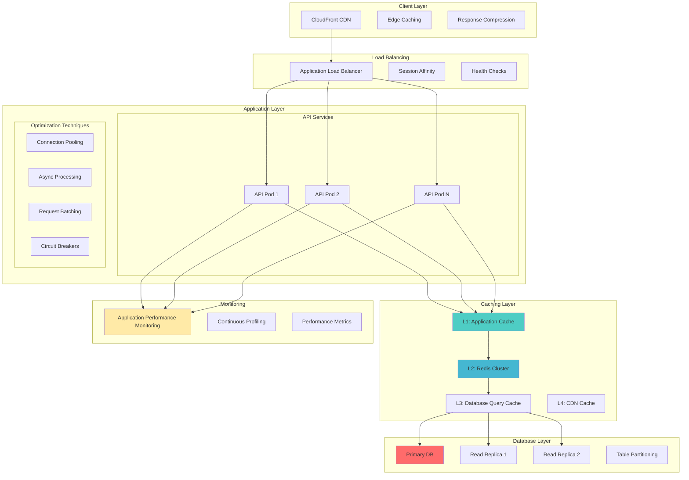

# Performance Optimization Guide

## Overview

This guide provides advanced performance optimization strategies for the Tolstoy platform, covering application-level optimizations, database performance tuning, caching strategies, and system-level optimizations for maximum throughput and minimal latency.

## Performance Architecture



## Application Performance Optimization

### 1. Node.js Performance Tuning

<Tabs>
  <Tab title="V8 Engine Optimization">
    ```javascript
    // performance/v8-optimization.js
    
    // V8 flags for production optimization
    const v8OptimizationFlags = [
      '--max-old-space-size=4096',           // Increase heap size to 4GB
      '--max-semi-space-size=256',           // Increase new space size
      '--optimize-for-size',                 // Optimize for memory usage
      '--gc-interval=100',                   // Garbage collection frequency
      '--expose-gc',                         // Allow manual GC triggering
      '--trace-gc',                          // GC tracing (development only)
      '--prof',                             // Enable profiling (development only)
      '--log-ic',                           // Log inline cache state changes
      '--trace-opt',                        // Trace optimizations
      '--trace-deopt',                      // Trace deoptimizations
      '--use-idle-notification',            // Use idle notifications
      '--max-inlined-source-size=600',      // Increase inlining threshold
      '--max-inlined-nodes-cumulative=5000' // Increase inlining budget
    ];
    
    // Memory optimization utilities
    class MemoryManager {
      private static instance: MemoryManager;
      private heapUsageHistory: HeapUsage[] = [];
      private readonly maxHistorySize = 100;
      private gcTimer?: NodeJS.Timeout;
      
      static getInstance(): MemoryManager {
        if (!MemoryManager.instance) {
          MemoryManager.instance = new MemoryManager();
        }
        return MemoryManager.instance;
      }
      
      startMonitoring(): void {
        // Monitor memory usage every 30 seconds
        this.gcTimer = setInterval(() => {
          this.recordHeapUsage();
          this.checkMemoryPressure();
        }, 30000);
        
        // Handle process warnings
        process.on('warning', this.handleWarning.bind(this));
      }
      
      stopMonitoring(): void {
        if (this.gcTimer) {
          clearInterval(this.gcTimer);
          this.gcTimer = undefined;
        }
      }
      
      private recordHeapUsage(): void {
        const usage = process.memoryUsage();
        const heapUsage: HeapUsage = {
          timestamp: Date.now(),
          heapUsed: usage.heapUsed,
          heapTotal: usage.heapTotal,
          external: usage.external,
          rss: usage.rss,
          buffers: usage.buffers || 0
        };
        
        this.heapUsageHistory.push(heapUsage);
        
        // Keep only recent history
        if (this.heapUsageHistory.length > this.maxHistorySize) {
          this.heapUsageHistory.shift();
        }
      }
      
      private checkMemoryPressure(): void {
        const usage = process.memoryUsage();
        const heapUtilization = usage.heapUsed / usage.heapTotal;
        const memoryPressureThreshold = 0.85; // 85%
        
        if (heapUtilization > memoryPressureThreshold) {
          console.warn('High memory pressure detected', {
            heapUtilization: Math.round(heapUtilization * 100) + '%',
            heapUsed: Math.round(usage.heapUsed / 1024 / 1024) + 'MB',
            heapTotal: Math.round(usage.heapTotal / 1024 / 1024) + 'MB'
          });
          
          // Trigger garbage collection if available
          if (global.gc) {
            global.gc();
            console.info('Manual garbage collection triggered');
          }
          
          // Alert monitoring system
          this.alertHighMemoryUsage(heapUtilization);
        }
      }
      
      private handleWarning(warning: Error): void {
        if (warning.name === 'MaxListenersExceededWarning') {
          console.warn('Memory leak potential detected', {
            warning: warning.message,
            stack: warning.stack
          });
        }
      }
      
      private async alertHighMemoryUsage(utilization: number): Promise<void> {
        // Implementation for alerting high memory usage
        const alert = {
          type: 'HIGH_MEMORY_USAGE',
          severity: utilization > 0.95 ? 'critical' : 'warning',
          utilization: Math.round(utilization * 100),
          timestamp: new Date().toISOString(),
          processId: process.pid,
          nodeVersion: process.version
        };
        
        console.error('Memory usage alert', alert);
      }
      
      getMemoryStats(): MemoryStats {
        const current = process.memoryUsage();
        const history = this.heapUsageHistory.slice(-10); // Last 10 measurements
        
        const avgHeapUsed = history.length > 0 
          ? history.reduce((sum, h) => sum + h.heapUsed, 0) / history.length
          : current.heapUsed;
          
        return {
          current: {
            heapUsed: Math.round(current.heapUsed / 1024 / 1024), // MB
            heapTotal: Math.round(current.heapTotal / 1024 / 1024), // MB
            rss: Math.round(current.rss / 1024 / 1024), // MB
            external: Math.round(current.external / 1024 / 1024) // MB
          },
          average: {
            heapUsed: Math.round(avgHeapUsed / 1024 / 1024) // MB
          },
          utilization: Math.round((current.heapUsed / current.heapTotal) * 100),
          historySize: history.length
        };
      }
    }
    
    // CPU optimization utilities
    class CPUOptimizer {
      private static cpuIntensiveTasks = new Set<string>();
      private static taskQueue: Array<() => Promise<void>> = [];
      private static processing = false;
      
      static async executeWithBackpressure<T>(
        taskId: string,
        task: () => Promise<T>,
        options: { 
          priority?: 'high' | 'normal' | 'low';
          timeout?: number;
        } = {}
      ): Promise<T> {
        return new Promise((resolve, reject) => {
          const wrappedTask = async () => {
            this.cpuIntensiveTasks.add(taskId);
            
            try {
              const timeoutId = options.timeout 
                ? setTimeout(() => reject(new Error(`Task ${taskId} timed out`)), options.timeout)
                : null;
                
              const result = await task();
              
              if (timeoutId) clearTimeout(timeoutId);
              resolve(result);
            } catch (error) {
              reject(error);
            } finally {
              this.cpuIntensiveTasks.delete(taskId);
            }
          };
          
          // Add to queue based on priority
          if (options.priority === 'high') {
            this.taskQueue.unshift(wrappedTask);
          } else {
            this.taskQueue.push(wrappedTask);
          }
          
          this.processQueue();
        });
      }
      
      private static async processQueue(): Promise<void> {
        if (this.processing || this.taskQueue.length === 0) {
          return;
        }
        
        this.processing = true;
        
        try {
          // Process tasks with concurrency limit based on CPU cores
          const concurrency = Math.min(require('os').cpus().length, 4);
          const activeTasks: Array<Promise<void>> = [];
          
          while (this.taskQueue.length > 0 && activeTasks.length < concurrency) {
            const task = this.taskQueue.shift();
            if (task) {
              const taskPromise = task().finally(() => {
                const index = activeTasks.indexOf(taskPromise);
                if (index > -1) activeTasks.splice(index, 1);
              });
              
              activeTasks.push(taskPromise);
            }
          }
          
          if (activeTasks.length > 0) {
            await Promise.all(activeTasks);
            // Continue processing if more tasks were added
            setImmediate(() => this.processQueue());
          }
        } finally {
          this.processing = false;
        }
      }
      
      static getCPUStats(): CPUStats {
        const loadAvg = require('os').loadavg();
        const cpuCount = require('os').cpus().length;
        
        return {
          activeTasks: this.cpuIntensiveTasks.size,
          queuedTasks: this.taskQueue.length,
          loadAverage: {
            '1min': Number(loadAvg[0].toFixed(2)),
            '5min': Number(loadAvg[1].toFixed(2)),
            '15min': Number(loadAvg[2].toFixed(2))
          },
          cpuCount,
          utilization: Math.round((loadAvg[0] / cpuCount) * 100)
        };
      }
    }
    
    // Event loop optimization
    class EventLoopMonitor {
      private static lagHistory: number[] = [];
      private static readonly maxHistory = 50;
      private static monitoringInterval?: NodeJS.Timeout;
      
      static startMonitoring(): void {
        this.monitoringInterval = setInterval(() => {
          const start = process.hrtime.bigint();
          
          setImmediate(() => {
            const lag = Number(process.hrtime.bigint() - start) / 1e6; // Convert to ms
            this.recordLag(lag);
          });
        }, 1000); // Check every second
      }
      
      static stopMonitoring(): void {
        if (this.monitoringInterval) {
          clearInterval(this.monitoringInterval);
          this.monitoringInterval = undefined;
        }
      }
      
      private static recordLag(lag: number): void {
        this.lagHistory.push(lag);
        
        if (this.lagHistory.length > this.maxHistory) {
          this.lagHistory.shift();
        }
        
        // Alert on high event loop lag
        if (lag > 100) { // 100ms threshold
          console.warn('High event loop lag detected', {
            currentLag: Math.round(lag),
            averageLag: this.getAverageLag()
          });
        }
      }
      
      private static getAverageLag(): number {
        if (this.lagHistory.length === 0) return 0;
        const sum = this.lagHistory.reduce((acc, lag) => acc + lag, 0);
        return Math.round(sum / this.lagHistory.length);
      }
      
      static getEventLoopStats(): EventLoopStats {
        return {
          currentLag: this.lagHistory[this.lagHistory.length - 1] || 0,
          averageLag: this.getAverageLag(),
          maxLag: this.lagHistory.length > 0 ? Math.max(...this.lagHistory) : 0,
          samples: this.lagHistory.length
        };
      }
    }
    
    // Initialize performance monitoring
    export function initializePerformanceMonitoring(): void {
      const memoryManager = MemoryManager.getInstance();
      memoryManager.startMonitoring();
      
      EventLoopMonitor.startMonitoring();
      
      // Graceful shutdown
      process.on('SIGTERM', () => {
        memoryManager.stopMonitoring();
        EventLoopMonitor.stopMonitoring();
      });
    }
    
    // Type definitions
    interface HeapUsage {
      timestamp: number;
      heapUsed: number;
      heapTotal: number;
      external: number;
      rss: number;
      buffers: number;
    }
    
    interface MemoryStats {
      current: {
        heapUsed: number;
        heapTotal: number;
        rss: number;
        external: number;
      };
      average: {
        heapUsed: number;
      };
      utilization: number;
      historySize: number;
    }
    
    interface CPUStats {
      activeTasks: number;
      queuedTasks: number;
      loadAverage: {
        '1min': number;
        '5min': number;
        '15min': number;
      };
      cpuCount: number;
      utilization: number;
    }
    
    interface EventLoopStats {
      currentLag: number;
      averageLag: number;
      maxLag: number;
      samples: number;
    }
    
    export {
      MemoryManager,
      CPUOptimizer,
      EventLoopMonitor
    };
    ```
  </Tab>
  
  <Tab title="Connection Pooling">
    ```typescript
    // performance/connection-pooling.ts
    import { Pool, PoolClient } from 'pg';
    import { createCluster, RedisCluster } from 'redis';
    import { promisify } from 'util';
    
    // Advanced PostgreSQL connection pool
    export class AdvancedDatabasePool {
      private pool: Pool;
      private connectionMetrics = {
        totalConnections: 0,
        activeConnections: 0,
        idleConnections: 0,
        waitingClients: 0,
        totalQueries: 0,
        totalQueryTime: 0,
        slowQueries: 0,
        connectionErrors: 0
      };
      
      constructor(config: DatabasePoolConfig) {
        this.pool = new Pool({
          host: config.host,
          port: config.port,
          database: config.database,
          user: config.user,
          password: config.password,
          
          // Connection pool settings
          min: config.minConnections || 5,
          max: config.maxConnections || 25,
          idleTimeoutMillis: config.idleTimeout || 30000,
          connectionTimeoutMillis: config.connectionTimeout || 5000,
          
          // Performance settings
          keepAlive: true,
          keepAliveInitialDelayMillis: 10000,
          
          // SSL configuration
          ssl: config.ssl ? {
            rejectUnauthorized: false
          } : false,
          
          // Query timeout
          query_timeout: config.queryTimeout || 30000,
          
          // Application name for monitoring
          application_name: config.applicationName || 'tolstoy-api'
        });
        
        this.setupEventHandlers();
        this.startMetricsCollection();
      }
      
      private setupEventHandlers(): void {
        this.pool.on('connect', (client: PoolClient) => {
          this.connectionMetrics.totalConnections++;
          console.debug('New database client connected', {
            totalConnections: this.connectionMetrics.totalConnections
          });
        });
        
        this.pool.on('acquire', (client: PoolClient) => {
          this.connectionMetrics.activeConnections++;
          this.connectionMetrics.idleConnections--;
        });
        
        this.pool.on('release', (client: PoolClient) => {
          this.connectionMetrics.activeConnections--;
          this.connectionMetrics.idleConnections++;
        });
        
        this.pool.on('remove', (client: PoolClient) => {
          this.connectionMetrics.totalConnections--;
          console.debug('Database client removed', {
            totalConnections: this.connectionMetrics.totalConnections
          });
        });
        
        this.pool.on('error', (err: Error) => {
          this.connectionMetrics.connectionErrors++;
          console.error('Database pool error', err);
        });
      }
      
      async query<T = any>(
        text: string,
        params?: any[],
        options: QueryOptions = {}
      ): Promise<QueryResult<T>> {
        const startTime = Date.now();
        const client = await this.pool.connect();
        
        try {
          // Set query timeout if specified
          if (options.timeout) {
            await client.query(`SET statement_timeout = ${options.timeout}`);
          }
          
          const result = await client.query<T>(text, params);
          const queryTime = Date.now() - startTime;
          
          // Update metrics
          this.connectionMetrics.totalQueries++;
          this.connectionMetrics.totalQueryTime += queryTime;
          
          // Log slow queries
          const slowQueryThreshold = options.slowQueryThreshold || 1000; // 1 second
          if (queryTime > slowQueryThreshold) {
            this.connectionMetrics.slowQueries++;
            console.warn('Slow query detected', {
              queryTime,
              query: text.substring(0, 100) + '...',
              params: params?.map(p => typeof p === 'string' && p.length > 50 ? p.substring(0, 50) + '...' : p)
            });
          }
          
          return {
            rows: result.rows,
            rowCount: result.rowCount || 0,
            queryTime,
            fields: result.fields
          };
          
        } finally {
          client.release();
          
          // Reset query timeout
          if (options.timeout) {
            try {
              await client.query('SET statement_timeout = DEFAULT');
            } catch (err) {
              // Ignore timeout reset errors
            }
          }
        }
      }
      
      async transaction<T>(
        callback: (client: PoolClient) => Promise<T>,
        options: TransactionOptions = {}
      ): Promise<T> {
        const client = await this.pool.connect();
        
        try {
          await client.query('BEGIN');
          
          // Set transaction isolation level if specified
          if (options.isolationLevel) {
            await client.query(`SET TRANSACTION ISOLATION LEVEL ${options.isolationLevel}`);
          }
          
          const result = await callback(client);
          await client.query('COMMIT');
          return result;
          
        } catch (error) {
          await client.query('ROLLBACK');
          throw error;
        } finally {
          client.release();
        }
      }
      
      private startMetricsCollection(): void {
        setInterval(() => {
          const poolInfo = {
            totalCount: this.pool.totalCount,
            idleCount: this.pool.idleCount,
            waitingCount: this.pool.waitingCount,
            metrics: {
              ...this.connectionMetrics,
              avgQueryTime: this.connectionMetrics.totalQueries > 0
                ? Math.round(this.connectionMetrics.totalQueryTime / this.connectionMetrics.totalQueries)
                : 0
            }
          };
          
          // Emit metrics for monitoring
          process.emit('databaseMetrics', poolInfo);
          
          // Alert on connection pool exhaustion
          if (this.pool.waitingCount > 5) {
            console.warn('Database connection pool under pressure', {
              waitingClients: this.pool.waitingCount,
              totalConnections: this.pool.totalCount,
              idleConnections: this.pool.idleCount
            });
          }
        }, 30000); // Every 30 seconds
      }
      
      getMetrics(): DatabasePoolMetrics {
        return {
          pool: {
            totalConnections: this.pool.totalCount,
            activeConnections: this.pool.totalCount - this.pool.idleCount,
            idleConnections: this.pool.idleCount,
            waitingClients: this.pool.waitingCount
          },
          queries: {
            total: this.connectionMetrics.totalQueries,
            totalTime: this.connectionMetrics.totalQueryTime,
            averageTime: this.connectionMetrics.totalQueries > 0
              ? Math.round(this.connectionMetrics.totalQueryTime / this.connectionMetrics.totalQueries)
              : 0,
            slowQueries: this.connectionMetrics.slowQueries
          },
          errors: {
            connectionErrors: this.connectionMetrics.connectionErrors
          }
        };
      }
      
      async healthCheck(): Promise<HealthCheckResult> {
        try {
          const start = Date.now();
          await this.query('SELECT 1 as health_check');
          const responseTime = Date.now() - start;
          
          return {
            healthy: true,
            responseTime,
            connections: {
              total: this.pool.totalCount,
              idle: this.pool.idleCount,
              active: this.pool.totalCount - this.pool.idleCount
            }
          };
        } catch (error) {
          return {
            healthy: false,
            error: error instanceof Error ? error.message : 'Unknown error',
            connections: {
              total: this.pool.totalCount,
              idle: this.pool.idleCount,
              active: this.pool.totalCount - this.pool.idleCount
            }
          };
        }
      }
      
      async close(): Promise<void> {
        await this.pool.end();
      }
    }
    
    // Redis cluster connection pool
    export class RedisClusterManager {
      private cluster: RedisCluster;
      private metrics = {
        totalCommands: 0,
        totalCommandTime: 0,
        slowCommands: 0,
        connectionErrors: 0,
        reconnections: 0
      };
      
      constructor(config: RedisClusterConfig) {
        this.cluster = createCluster({
          rootNodes: config.nodes,
          defaults: {
            host: config.host,
            port: config.port,
            password: config.password,
            
            // Connection settings
            connectTimeout: config.connectTimeout || 5000,
            commandTimeout: config.commandTimeout || 3000,
            lazyConnect: true,
            
            // Retry configuration
            retryDelayOnFailover: 100,
            maxRetriesPerRequest: 3,
            
            // Keep alive
            keepAlive: true,
            
            // Performance settings
            enableReadyCheck: true,
            enableOfflineQueue: false,
            
            // TLS if configured
            tls: config.tls ? {} : undefined
          }
        });
        
        this.setupEventHandlers();
      }
      
      private setupEventHandlers(): void {
        this.cluster.on('connect', () => {
          console.info('Redis cluster connected');
        });
        
        this.cluster.on('ready', () => {
          console.info('Redis cluster ready');
        });
        
        this.cluster.on('error', (err: Error) => {
          this.metrics.connectionErrors++;
          console.error('Redis cluster error', err);
        });
        
        this.cluster.on('reconnecting', () => {
          this.metrics.reconnections++;
          console.warn('Redis cluster reconnecting');
        });
        
        this.cluster.on('end', () => {
          console.info('Redis cluster connection ended');
        });
      }
      
      async execute<T = any>(
        command: string,
        args: any[] = [],
        options: RedisCommandOptions = {}
      ): Promise<T> {
        const startTime = Date.now();
        
        try {
          const result = await this.cluster.sendCommand([command, ...args]);
          const commandTime = Date.now() - startTime;
          
          // Update metrics
          this.metrics.totalCommands++;
          this.metrics.totalCommandTime += commandTime;
          
          // Log slow commands
          const slowCommandThreshold = options.slowCommandThreshold || 100; // 100ms
          if (commandTime > slowCommandThreshold) {
            this.metrics.slowCommands++;
            console.warn('Slow Redis command detected', {
              command,
              commandTime,
              args: args.map(arg => 
                typeof arg === 'string' && arg.length > 50 
                  ? arg.substring(0, 50) + '...' 
                  : arg
              )
            });
          }
          
          return result as T;
        } catch (error) {
          console.error('Redis command failed', {
            command,
            args: args.slice(0, 3), // Log first 3 args only
            error: error instanceof Error ? error.message : error
          });
          throw error;
        }
      }
      
      // High-level cache operations with performance optimizations
      async get(key: string): Promise<string | null> {
        return this.execute('GET', [key]);
      }
      
      async set(
        key: string, 
        value: string, 
        ttl?: number
      ): Promise<void> {
        const args = [key, value];
        if (ttl) {
          args.push('EX', ttl.toString());
        }
        await this.execute('SET', args);
      }
      
      async mget(keys: string[]): Promise<(string | null)[]> {
        if (keys.length === 0) return [];
        return this.execute('MGET', keys);
      }
      
      async mset(keyValues: Record<string, string>): Promise<void> {
        const args = Object.entries(keyValues).flat();
        await this.execute('MSET', args);
      }
      
      async pipeline(commands: Array<[string, ...any[]]>): Promise<any[]> {
        const pipeline = this.cluster.pipeline();
        
        commands.forEach(([command, ...args]) => {
          pipeline.sendCommand([command, ...args]);
        });
        
        const results = await pipeline.exec();
        return results?.map(([err, result]) => {
          if (err) throw err;
          return result;
        }) || [];
      }
      
      getMetrics(): RedisClusterMetrics {
        return {
          commands: {
            total: this.metrics.totalCommands,
            totalTime: this.metrics.totalCommandTime,
            averageTime: this.metrics.totalCommands > 0
              ? Math.round(this.metrics.totalCommandTime / this.metrics.totalCommands)
              : 0,
            slowCommands: this.metrics.slowCommands
          },
          connections: {
            errors: this.metrics.connectionErrors,
            reconnections: this.metrics.reconnections
          },
          cluster: {
            status: this.cluster.status,
            nodes: Object.keys(this.cluster.nodes).length
          }
        };
      }
      
      async healthCheck(): Promise<HealthCheckResult> {
        try {
          const start = Date.now();
          await this.cluster.ping();
          const responseTime = Date.now() - start;
          
          return {
            healthy: true,
            responseTime,
            cluster: {
              status: this.cluster.status,
              nodes: Object.keys(this.cluster.nodes).length
            }
          };
        } catch (error) {
          return {
            healthy: false,
            error: error instanceof Error ? error.message : 'Unknown error',
            cluster: {
              status: this.cluster.status,
              nodes: Object.keys(this.cluster.nodes).length
            }
          };
        }
      }
      
      async disconnect(): Promise<void> {
        await this.cluster.disconnect();
      }
    }
    
    // Type definitions
    interface DatabasePoolConfig {
      host: string;
      port: number;
      database: string;
      user: string;
      password: string;
      minConnections?: number;
      maxConnections?: number;
      idleTimeout?: number;
      connectionTimeout?: number;
      queryTimeout?: number;
      ssl?: boolean;
      applicationName?: string;
    }
    
    interface QueryOptions {
      timeout?: number;
      slowQueryThreshold?: number;
    }
    
    interface TransactionOptions {
      isolationLevel?: 'READ UNCOMMITTED' | 'READ COMMITTED' | 'REPEATABLE READ' | 'SERIALIZABLE';
    }
    
    interface QueryResult<T> {
      rows: T[];
      rowCount: number;
      queryTime: number;
      fields?: any[];
    }
    
    interface DatabasePoolMetrics {
      pool: {
        totalConnections: number;
        activeConnections: number;
        idleConnections: number;
        waitingClients: number;
      };
      queries: {
        total: number;
        totalTime: number;
        averageTime: number;
        slowQueries: number;
      };
      errors: {
        connectionErrors: number;
      };
    }
    
    interface RedisClusterConfig {
      nodes: Array<{ host: string; port: number }>;
      host?: string;
      port?: number;
      password?: string;
      connectTimeout?: number;
      commandTimeout?: number;
      tls?: boolean;
    }
    
    interface RedisCommandOptions {
      slowCommandThreshold?: number;
    }
    
    interface RedisClusterMetrics {
      commands: {
        total: number;
        totalTime: number;
        averageTime: number;
        slowCommands: number;
      };
      connections: {
        errors: number;
        reconnections: number;
      };
      cluster: {
        status: string;
        nodes: number;
      };
    }
    
    interface HealthCheckResult {
      healthy: boolean;
      responseTime?: number;
      error?: string;
      connections?: any;
      cluster?: any;
    }
    ```
  </Tab>
  
  <Tab title="Caching Strategies">
    ```typescript
    // performance/caching-strategies.ts
    
    // Multi-tier caching implementation
    export class MultiTierCache {
      private l1Cache: Map<string, CacheEntry>; // In-memory
      private l2Cache: RedisClusterManager;     // Redis
      private l3Cache?: any;                    // Optional third tier (e.g., DynamoDB)
      
      private readonly maxL1Size: number;
      private readonly l1TTL: number;
      private readonly l2TTL: number;
      private metrics: CacheMetrics;
      
      constructor(config: MultiTierCacheConfig) {
        this.l1Cache = new Map();
        this.l2Cache = config.redisManager;
        this.l3Cache = config.l3Cache;
        
        this.maxL1Size = config.maxL1Size || 1000;
        this.l1TTL = config.l1TTL || 300; // 5 minutes
        this.l2TTL = config.l2TTL || 3600; // 1 hour
        
        this.metrics = {
          l1: { hits: 0, misses: 0, sets: 0, deletes: 0, evictions: 0 },
          l2: { hits: 0, misses: 0, sets: 0, deletes: 0, evictions: 0 },
          l3: { hits: 0, misses: 0, sets: 0, deletes: 0, evictions: 0 },
          totalRequests: 0,
          totalHits: 0,
          totalMisses: 0
        };
        
        this.startCleanupProcess();
      }
      
      async get<T>(key: string, options: CacheGetOptions = {}): Promise<T | null> {
        this.metrics.totalRequests++;
        const startTime = Date.now();
        
        try {
          // L1 Cache check
          const l1Result = this.getFromL1<T>(key);
          if (l1Result !== null) {
            this.metrics.l1.hits++;
            this.metrics.totalHits++;
            return l1Result;
          }
          this.metrics.l1.misses++;
          
          // L2 Cache check (Redis)
          const l2Result = await this.getFromL2<T>(key);
          if (l2Result !== null) {
            this.metrics.l2.hits++;
            this.metrics.totalHits++;
            
            // Populate L1 cache
            if (options.populateL1 !== false) {
              this.setInL1(key, l2Result, this.l1TTL);
            }
            
            return l2Result;
          }
          this.metrics.l2.misses++;
          
          // L3 Cache check (if configured)
          if (this.l3Cache && options.checkL3 !== false) {
            const l3Result = await this.getFromL3<T>(key);
            if (l3Result !== null) {
              this.metrics.l3.hits++;
              this.metrics.totalHits++;
              
              // Populate higher tiers
              if (options.populateL2 !== false) {
                await this.setInL2(key, l3Result, this.l2TTL);
              }
              if (options.populateL1 !== false) {
                this.setInL1(key, l3Result, this.l1TTL);
              }
              
              return l3Result;
            }
            this.metrics.l3.misses++;
          }
          
          this.metrics.totalMisses++;
          return null;
          
        } finally {
          const duration = Date.now() - startTime;
          if (duration > 50) { // Log slow cache operations
            console.warn('Slow cache get operation', { key, duration });
          }
        }
      }
      
      async set<T>(
        key: string, 
        value: T, 
        options: CacheSetOptions = {}
      ): Promise<void> {
        const l1TTL = options.l1TTL || this.l1TTL;
        const l2TTL = options.l2TTL || this.l2TTL;
        const l3TTL = options.l3TTL;
        
        // Set in all configured tiers
        if (options.skipL1 !== true) {
          this.setInL1(key, value, l1TTL);
          this.metrics.l1.sets++;
        }
        
        if (options.skipL2 !== true) {
          await this.setInL2(key, value, l2TTL);
          this.metrics.l2.sets++;
        }
        
        if (this.l3Cache && options.skipL3 !== true && l3TTL) {
          await this.setInL3(key, value, l3TTL);
          this.metrics.l3.sets++;
        }
      }
      
      async delete(key: string): Promise<void> {
        // Delete from all tiers
        this.l1Cache.delete(key);
        this.metrics.l1.deletes++;
        
        await this.l2Cache.execute('DEL', [key]);
        this.metrics.l2.deletes++;
        
        if (this.l3Cache) {
          await this.deleteFromL3(key);
          this.metrics.l3.deletes++;
        }
      }
      
      async mget<T>(keys: string[]): Promise<Map<string, T>> {
        const results = new Map<string, T>();
        const l2Keys: string[] = [];
        const l3Keys: string[] = [];
        
        // Check L1 cache first
        for (const key of keys) {
          const l1Result = this.getFromL1<T>(key);
          if (l1Result !== null) {
            results.set(key, l1Result);
            this.metrics.l1.hits++;
          } else {
            l2Keys.push(key);
            this.metrics.l1.misses++;
          }
        }
        
        // Batch get from L2 cache
        if (l2Keys.length > 0) {
          const l2Results = await this.l2Cache.mget(l2Keys);
          
          for (let i = 0; i < l2Keys.length; i++) {
            const key = l2Keys[i];
            const value = l2Results[i];
            
            if (value !== null) {
              const parsed = JSON.parse(value) as T;
              results.set(key, parsed);
              this.setInL1(key, parsed, this.l1TTL); // Populate L1
              this.metrics.l2.hits++;
            } else {
              l3Keys.push(key);
              this.metrics.l2.misses++;
            }
          }
        }
        
        // Check L3 cache for remaining keys
        if (this.l3Cache && l3Keys.length > 0) {
          const l3Results = await this.mgetFromL3<T>(l3Keys);
          
          for (const [key, value] of l3Results) {
            results.set(key, value);
            
            // Populate higher tiers
            this.setInL1(key, value, this.l1TTL);
            await this.setInL2(key, value, this.l2TTL);
            this.metrics.l3.hits++;
          }
        }
        
        this.metrics.totalRequests += keys.length;
        this.metrics.totalHits += results.size;
        this.metrics.totalMisses += keys.length - results.size;
        
        return results;
      }
      
      private getFromL1<T>(key: string): T | null {
        const entry = this.l1Cache.get(key);
        
        if (!entry) return null;
        
        if (entry.expiresAt < Date.now()) {
          this.l1Cache.delete(key);
          return null;
        }
        
        // Update access time for LRU
        entry.lastAccessed = Date.now();
        return entry.value as T;
      }
      
      private setInL1<T>(key: string, value: T, ttl: number): void {
        // Implement LRU eviction if cache is full
        if (this.l1Cache.size >= this.maxL1Size) {
          this.evictLRU();
        }
        
        const expiresAt = Date.now() + (ttl * 1000);
        this.l1Cache.set(key, {
          value,
          expiresAt,
          lastAccessed: Date.now()
        });
      }
      
      private evictLRU(): void {
        let oldestKey: string | null = null;
        let oldestTime = Date.now();
        
        for (const [key, entry] of this.l1Cache) {
          if (entry.lastAccessed < oldestTime) {
            oldestTime = entry.lastAccessed;
            oldestKey = key;
          }
        }
        
        if (oldestKey) {
          this.l1Cache.delete(oldestKey);
          this.metrics.l1.evictions++;
        }
      }
      
      private async getFromL2<T>(key: string): Promise<T | null> {
        try {
          const value = await this.l2Cache.get(key);
          return value ? JSON.parse(value) as T : null;
        } catch (error) {
          console.error('L2 cache get error', { key, error });
          return null;
        }
      }
      
      private async setInL2<T>(key: string, value: T, ttl: number): Promise<void> {
        try {
          const serialized = JSON.stringify(value);
          await this.l2Cache.set(key, serialized, ttl);
        } catch (error) {
          console.error('L2 cache set error', { key, error });
        }
      }
      
      private async getFromL3<T>(key: string): Promise<T | null> {
        // Implementation depends on L3 cache provider (e.g., DynamoDB)
        if (!this.l3Cache) return null;
        
        try {
          return await this.l3Cache.get(key);
        } catch (error) {
          console.error('L3 cache get error', { key, error });
          return null;
        }
      }
      
      private async setInL3<T>(key: string, value: T, ttl: number): Promise<void> {
        if (!this.l3Cache) return;
        
        try {
          await this.l3Cache.set(key, value, { ttl });
        } catch (error) {
          console.error('L3 cache set error', { key, error });
        }
      }
      
      private async deleteFromL3(key: string): Promise<void> {
        if (!this.l3Cache) return;
        
        try {
          await this.l3Cache.delete(key);
        } catch (error) {
          console.error('L3 cache delete error', { key, error });
        }
      }
      
      private async mgetFromL3<T>(keys: string[]): Promise<Map<string, T>> {
        if (!this.l3Cache) return new Map();
        
        try {
          return await this.l3Cache.mget(keys);
        } catch (error) {
          console.error('L3 cache mget error', { keys, error });
          return new Map();
        }
      }
      
      private startCleanupProcess(): void {
        // Clean expired L1 entries every minute
        setInterval(() => {
          const now = Date.now();
          let evicted = 0;
          
          for (const [key, entry] of this.l1Cache) {
            if (entry.expiresAt < now) {
              this.l1Cache.delete(key);
              evicted++;
            }
          }
          
          if (evicted > 0) {
            console.debug('L1 cache cleanup', { evictedKeys: evicted });
            this.metrics.l1.evictions += evicted;
          }
        }, 60000);
      }
      
      getMetrics(): CacheMetrics {
        const hitRate = this.metrics.totalRequests > 0
          ? (this.metrics.totalHits / this.metrics.totalRequests) * 100
          : 0;
        
        return {
          ...this.metrics,
          hitRate: Number(hitRate.toFixed(2)),
          l1Size: this.l1Cache.size
        };
      }
      
      clearMetrics(): void {
        this.metrics = {
          l1: { hits: 0, misses: 0, sets: 0, deletes: 0, evictions: 0 },
          l2: { hits: 0, misses: 0, sets: 0, deletes: 0, evictions: 0 },
          l3: { hits: 0, misses: 0, sets: 0, deletes: 0, evictions: 0 },
          totalRequests: 0,
          totalHits: 0,
          totalMisses: 0
        };
      }
    }
    
    // Intelligent cache warming
    export class CacheWarmer {
      constructor(
        private cache: MultiTierCache,
        private dataLoader: DataLoader
      ) {}
      
      async warmCache(strategy: WarmingStrategy): Promise<WarmingResult> {
        const startTime = Date.now();
        let warmed = 0;
        let errors = 0;
        
        try {
          switch (strategy.type) {
            case 'popular':
              ({ warmed, errors } = await this.warmPopularData(strategy.options));
              break;
            case 'predictive':
              ({ warmed, errors } = await this.warmPredictiveData(strategy.options));
              break;
            case 'scheduled':
              ({ warmed, errors } = await this.warmScheduledData(strategy.options));
              break;
            default:
              throw new Error(`Unknown warming strategy: ${strategy.type}`);
          }
          
          const duration = Date.now() - startTime;
          
          return {
            success: true,
            warmed,
            errors,
            duration,
            strategy: strategy.type
          };
          
        } catch (error) {
          return {
            success: false,
            error: error instanceof Error ? error.message : 'Unknown error',
            warmed,
            errors,
            duration: Date.now() - startTime,
            strategy: strategy.type
          };
        }
      }
      
      private async warmPopularData(options: PopularDataOptions): Promise<{ warmed: number; errors: number }> {
        // Get popular keys from analytics or access logs
        const popularKeys = await this.dataLoader.getPopularKeys(options.limit || 100);
        let warmed = 0;
        let errors = 0;
        
        // Warm cache in batches
        const batchSize = options.batchSize || 10;
        for (let i = 0; i < popularKeys.length; i += batchSize) {
          const batch = popularKeys.slice(i, i + batchSize);
          
          const results = await Promise.allSettled(
            batch.map(async (key) => {
              const data = await this.dataLoader.load(key);
              await this.cache.set(key, data, {
                l1TTL: options.l1TTL,
                l2TTL: options.l2TTL
              });
            })
          );
          
          results.forEach(result => {
            if (result.status === 'fulfilled') {
              warmed++;
            } else {
              errors++;
              console.error('Cache warming error', result.reason);
            }
          });
          
          // Small delay between batches
          if (i + batchSize < popularKeys.length) {
            await new Promise(resolve => setTimeout(resolve, 100));
          }
        }
        
        return { warmed, errors };
      }
      
      private async warmPredictiveData(options: PredictiveDataOptions): Promise<{ warmed: number; errors: number }> {
        // Use ML or heuristics to predict what data will be needed
        const predictions = await this.dataLoader.getPredictedKeys(options);
        let warmed = 0;
        let errors = 0;
        
        for (const prediction of predictions) {
          try {
            if (prediction.confidence >= (options.confidenceThreshold || 0.7)) {
              const data = await this.dataLoader.load(prediction.key);
              await this.cache.set(prediction.key, data, {
                l1TTL: Math.round(options.baseTTL * prediction.confidence),
                l2TTL: Math.round(options.baseTTL * 2 * prediction.confidence)
              });
              warmed++;
            }
          } catch (error) {
            errors++;
            console.error('Predictive cache warming error', { key: prediction.key, error });
          }
        }
        
        return { warmed, errors };
      }
      
      private async warmScheduledData(options: ScheduledDataOptions): Promise<{ warmed: number; errors: number }> {
        // Warm data based on scheduled access patterns
        const scheduledKeys = await this.dataLoader.getScheduledKeys(options.schedule);
        let warmed = 0;
        let errors = 0;
        
        for (const item of scheduledKeys) {
          try {
            const data = await this.dataLoader.load(item.key);
            await this.cache.set(item.key, data, {
              l1TTL: item.ttl,
              l2TTL: item.ttl * 2
            });
            warmed++;
          } catch (error) {
            errors++;
            console.error('Scheduled cache warming error', { key: item.key, error });
          }
        }
        
        return { warmed, errors };
      }
    }
    
    // Type definitions
    interface CacheEntry {
      value: any;
      expiresAt: number;
      lastAccessed: number;
    }
    
    interface MultiTierCacheConfig {
      redisManager: RedisClusterManager;
      l3Cache?: any;
      maxL1Size?: number;
      l1TTL?: number;
      l2TTL?: number;
    }
    
    interface CacheGetOptions {
      populateL1?: boolean;
      populateL2?: boolean;
      checkL3?: boolean;
    }
    
    interface CacheSetOptions {
      l1TTL?: number;
      l2TTL?: number;
      l3TTL?: number;
      skipL1?: boolean;
      skipL2?: boolean;
      skipL3?: boolean;
    }
    
    interface CacheMetrics {
      l1: {
        hits: number;
        misses: number;
        sets: number;
        deletes: number;
        evictions: number;
      };
      l2: {
        hits: number;
        misses: number;
        sets: number;
        deletes: number;
        evictions: number;
      };
      l3: {
        hits: number;
        misses: number;
        sets: number;
        deletes: number;
        evictions: number;
      };
      totalRequests: number;
      totalHits: number;
      totalMisses: number;
      hitRate?: number;
      l1Size?: number;
    }
    
    interface WarmingStrategy {
      type: 'popular' | 'predictive' | 'scheduled';
      options: any;
    }
    
    interface WarmingResult {
      success: boolean;
      warmed: number;
      errors: number;
      duration: number;
      strategy: string;
      error?: string;
    }
    
    interface PopularDataOptions {
      limit?: number;
      batchSize?: number;
      l1TTL?: number;
      l2TTL?: number;
    }
    
    interface PredictiveDataOptions {
      confidenceThreshold?: number;
      baseTTL: number;
    }
    
    interface ScheduledDataOptions {
      schedule: string;
    }
    
    interface DataLoader {
      getPopularKeys(limit: number): Promise<string[]>;
      getPredictedKeys(options: any): Promise<Array<{ key: string; confidence: number }>>;
      getScheduledKeys(schedule: string): Promise<Array<{ key: string; ttl: number }>>;
      load(key: string): Promise<any>;
    }
    ```
  </Tab>
</Tabs>

### 2. Database Performance Optimization

<Tabs>
  <Tab title="Query Optimization">
    ```sql
    -- Advanced query optimization techniques
    
    -- 1. Efficient pagination with cursor-based approach
    -- Instead of OFFSET/LIMIT which gets slower with large offsets
    CREATE OR REPLACE FUNCTION get_workflows_cursor(
        p_organization_id UUID,
        p_cursor TIMESTAMP DEFAULT NULL,
        p_limit INTEGER DEFAULT 20
    )
    RETURNS TABLE (
        id UUID,
        name VARCHAR,
        created_at TIMESTAMP,
        updated_at TIMESTAMP,
        next_cursor TIMESTAMP
    ) AS $$
    BEGIN
        RETURN QUERY
        WITH paginated_data AS (
            SELECT w.id, w.name, w.created_at, w.updated_at
            FROM workflows w
            WHERE w.organization_id = p_organization_id
              AND w.deleted_at IS NULL
              AND (p_cursor IS NULL OR w.created_at < p_cursor)
            ORDER BY w.created_at DESC
            LIMIT p_limit + 1
        ),
        result_data AS (
            SELECT pd.id, pd.name, pd.created_at, pd.updated_at,
                   ROW_NUMBER() OVER (ORDER BY pd.created_at DESC) as rn
            FROM paginated_data pd
        )
        SELECT r.id, r.name, r.created_at, r.updated_at,
               CASE WHEN r.rn = p_limit + 1 THEN r.created_at ELSE NULL END as next_cursor
        FROM result_data r
        WHERE r.rn <= p_limit;
    END;
    $$ LANGUAGE plpgsql;
    
    -- 2. Efficient batch operations with UPSERT
    CREATE OR REPLACE FUNCTION upsert_workflow_metrics(
        p_metrics workflow_metric[]
    )
    RETURNS INTEGER AS $$
    DECLARE
        affected_rows INTEGER;
    BEGIN
        INSERT INTO workflow_metrics (
            workflow_id, 
            metric_name, 
            metric_value, 
            recorded_at
        )
        SELECT 
            m.workflow_id,
            m.metric_name,
            m.metric_value,
            m.recorded_at
        FROM unnest(p_metrics) m
        ON CONFLICT (workflow_id, metric_name, date_trunc('hour', recorded_at))
        DO UPDATE SET
            metric_value = EXCLUDED.metric_value,
            recorded_at = EXCLUDED.recorded_at,
            updated_at = NOW();
        
        GET DIAGNOSTICS affected_rows = ROW_COUNT;
        RETURN affected_rows;
    END;
    $$ LANGUAGE plpgsql;
    
    -- 3. Optimized search with full-text search and ranking
    CREATE OR REPLACE FUNCTION search_workflows(
        p_organization_id UUID,
        p_search_term TEXT,
        p_limit INTEGER DEFAULT 20,
        p_offset INTEGER DEFAULT 0
    )
    RETURNS TABLE (
        id UUID,
        name VARCHAR,
        description TEXT,
        rank REAL,
        created_at TIMESTAMP
    ) AS $$
    BEGIN
        RETURN QUERY
        WITH search_results AS (
            SELECT 
                w.id,
                w.name,
                w.description,
                w.created_at,
                ts_rank(
                    setweight(to_tsvector('english', COALESCE(w.name, '')), 'A') ||
                    setweight(to_tsvector('english', COALESCE(w.description, '')), 'B') ||
                    setweight(to_tsvector('english', COALESCE(w.tags::text, '')), 'C'),
                    plainto_tsquery('english', p_search_term)
                ) AS rank
            FROM workflows w
            WHERE w.organization_id = p_organization_id
              AND w.deleted_at IS NULL
              AND (
                  to_tsvector('english', COALESCE(w.name, '')) ||
                  to_tsvector('english', COALESCE(w.description, '')) ||
                  to_tsvector('english', COALESCE(w.tags::text, ''))
              ) @@ plainto_tsquery('english', p_search_term)
        )
        SELECT sr.id, sr.name, sr.description, sr.rank, sr.created_at
        FROM search_results sr
        ORDER BY sr.rank DESC, sr.created_at DESC
        LIMIT p_limit
        OFFSET p_offset;
    END;
    $$ LANGUAGE plpgsql;
    
    -- 4. Efficient aggregation with materialized views
    CREATE MATERIALIZED VIEW workflow_usage_stats AS
    WITH execution_stats AS (
        SELECT 
            e.workflow_id,
            COUNT(*) as total_executions,
            COUNT(*) FILTER (WHERE e.status = 'completed') as successful_executions,
            COUNT(*) FILTER (WHERE e.status = 'failed') as failed_executions,
            AVG(EXTRACT(EPOCH FROM (e.completed_at - e.started_at))) as avg_duration,
            MAX(e.completed_at) as last_execution
        FROM executions e
        WHERE e.created_at >= NOW() - INTERVAL '30 days'
        GROUP BY e.workflow_id
    ),
    workflow_info AS (
        SELECT 
            w.id,
            w.organization_id,
            w.name,
            w.created_at,
            w.created_by
        FROM workflows w
        WHERE w.deleted_at IS NULL
    )
    SELECT 
        wi.id,
        wi.organization_id,
        wi.name,
        wi.created_at,
        wi.created_by,
        COALESCE(es.total_executions, 0) as total_executions,
        COALESCE(es.successful_executions, 0) as successful_executions,
        COALESCE(es.failed_executions, 0) as failed_executions,
        COALESCE(es.avg_duration, 0) as avg_duration,
        es.last_execution,
        CASE 
            WHEN es.total_executions > 0 
            THEN ROUND((es.successful_executions::DECIMAL / es.total_executions) * 100, 2)
            ELSE 0 
        END as success_rate
    FROM workflow_info wi
    LEFT JOIN execution_stats es ON wi.id = es.workflow_id;
    
    -- Create unique index for fast refreshes
    CREATE UNIQUE INDEX idx_workflow_usage_stats_id ON workflow_usage_stats(id);
    
    -- Refresh schedule (run via cron or scheduler)
    REFRESH MATERIALIZED VIEW CONCURRENTLY workflow_usage_stats;
    
    -- 5. Efficient time-series data handling with partitioning
    CREATE TABLE executions_partitioned (
        id UUID DEFAULT gen_random_uuid(),
        workflow_id UUID NOT NULL,
        organization_id UUID NOT NULL,
        status execution_status NOT NULL DEFAULT 'pending',
        input JSONB,
        output JSONB,
        error_message TEXT,
        started_at TIMESTAMP WITH TIME ZONE DEFAULT NOW(),
        completed_at TIMESTAMP WITH TIME ZONE,
        created_at TIMESTAMP WITH TIME ZONE DEFAULT NOW() NOT NULL
    ) PARTITION BY RANGE (created_at);
    
    -- Create monthly partitions
    CREATE TABLE executions_2024_01 PARTITION OF executions_partitioned
        FOR VALUES FROM ('2024-01-01') TO ('2024-02-01');
    
    CREATE TABLE executions_2024_02 PARTITION OF executions_partitioned
        FOR VALUES FROM ('2024-02-01') TO ('2024-03-01');
    
    -- Function to create new partitions automatically
    CREATE OR REPLACE FUNCTION create_monthly_partition(table_name TEXT, start_date DATE)
    RETURNS VOID AS $$
    DECLARE
        partition_name TEXT;
        end_date DATE;
    BEGIN
        partition_name := table_name || '_' || to_char(start_date, 'YYYY_MM');
        end_date := start_date + INTERVAL '1 month';
        
        EXECUTE format('CREATE TABLE IF NOT EXISTS %I PARTITION OF %I
                       FOR VALUES FROM (%L) TO (%L)',
                       partition_name, table_name, start_date, end_date);
        
        -- Create indexes on the partition
        EXECUTE format('CREATE INDEX IF NOT EXISTS %I ON %I (workflow_id, created_at)',
                       partition_name || '_workflow_created_idx', partition_name);
        
        EXECUTE format('CREATE INDEX IF NOT EXISTS %I ON %I (organization_id, status, created_at)',
                       partition_name || '_org_status_created_idx', partition_name);
    END;
    $$ LANGUAGE plpgsql;
    
    -- 6. Optimized JSON operations
    CREATE OR REPLACE FUNCTION update_workflow_step(
        p_workflow_id UUID,
        p_step_id TEXT,
        p_step_config JSONB
    )
    RETURNS BOOLEAN AS $$
    DECLARE
        step_exists BOOLEAN;
    BEGIN
        -- Check if step exists and update it
        SELECT EXISTS(
            SELECT 1 FROM workflows 
            WHERE id = p_workflow_id 
            AND definition -> 'steps' @> jsonb_build_array(jsonb_build_object('id', p_step_id))
        ) INTO step_exists;
        
        IF step_exists THEN
            UPDATE workflows 
            SET definition = jsonb_set(
                definition,
                '{steps}',
                (
                    SELECT jsonb_agg(
                        CASE 
                            WHEN step->>'id' = p_step_id 
                            THEN step || p_step_config
                            ELSE step
                        END
                    )
                    FROM jsonb_array_elements(definition->'steps') step
                ),
                true
            ),
            updated_at = NOW()
            WHERE id = p_workflow_id;
            
            RETURN TRUE;
        ELSE
            RETURN FALSE;
        END IF;
    END;
    $$ LANGUAGE plpgsql;
    
    -- 7. Efficient bulk deletion with archiving
    CREATE OR REPLACE FUNCTION archive_old_executions(
        p_older_than_days INTEGER DEFAULT 90,
        p_batch_size INTEGER DEFAULT 1000
    )
    RETURNS INTEGER AS $$
    DECLARE
        archived_count INTEGER := 0;
        batch_count INTEGER;
        cutoff_date TIMESTAMP;
    BEGIN
        cutoff_date := NOW() - (p_older_than_days || ' days')::INTERVAL;
        
        LOOP
            -- Archive a batch to cold storage table
            WITH batch_to_archive AS (
                SELECT id FROM executions
                WHERE created_at < cutoff_date
                  AND status IN ('completed', 'failed')
                LIMIT p_batch_size
            ),
            moved_rows AS (
                INSERT INTO executions_archive
                SELECT e.* FROM executions e
                JOIN batch_to_archive b ON e.id = b.id
                RETURNING id
            )
            DELETE FROM executions
            WHERE id IN (SELECT id FROM moved_rows);
            
            GET DIAGNOSTICS batch_count = ROW_COUNT;
            archived_count := archived_count + batch_count;
            
            -- Exit if no more rows to archive
            EXIT WHEN batch_count = 0;
            
            -- Small delay to avoid overwhelming the system
            PERFORM pg_sleep(0.1);
        END LOOP;
        
        RETURN archived_count;
    END;
    $$ LANGUAGE plpgsql;
    
    -- 8. Performance monitoring queries
    -- Find slow queries
    SELECT 
        query,
        calls,
        total_time,
        rows,
        100.0 * shared_blks_hit / nullif(shared_blks_hit + shared_blks_read, 0) AS hit_percent,
        mean_time
    FROM pg_stat_statements 
    WHERE query NOT LIKE '%pg_stat_statements%'
    ORDER BY mean_time DESC 
    LIMIT 10;
    
    -- Find tables with high sequential scan ratio
    SELECT 
        schemaname,
        tablename,
        seq_scan,
        seq_tup_read,
        idx_scan,
        idx_tup_fetch,
        seq_tup_read / seq_scan as avg_seq_tup_read
    FROM pg_stat_user_tables 
    WHERE seq_scan > 0
    ORDER BY seq_tup_read DESC 
    LIMIT 10;
    
    -- Find unused indexes
    SELECT 
        schemaname,
        tablename,
        indexname,
        idx_tup_read,
        idx_tup_fetch,
        pg_size_pretty(pg_relation_size(indexrelid)) AS index_size
    FROM pg_stat_user_indexes 
    WHERE idx_tup_read = 0 
    AND idx_tup_fetch = 0
    ORDER BY pg_relation_size(indexrelid) DESC;
    
    -- Monitor index bloat
    WITH table_stats AS (
        SELECT 
            schemaname,
            tablename,
            n_dead_tup,
            n_live_tup,
            ROUND(100 * n_dead_tup / (n_dead_tup + n_live_tup), 2) AS dead_ratio
        FROM pg_stat_user_tables
        WHERE n_dead_tup > 0
    )
    SELECT * FROM table_stats
    WHERE dead_ratio > 20
    ORDER BY dead_ratio DESC;
    ```
  </Tab>
  
  <Tab title="Database Monitoring">
    ```typescript
    // database/performance-monitor.ts
    import { Pool } from 'pg';
    
    export class DatabasePerformanceMonitor {
      private pool: Pool;
      private metrics: DatabaseMetrics = {
        connections: { active: 0, idle: 0, waiting: 0 },
        queries: { total: 0, slow: 0, failed: 0 },
        performance: { avgQueryTime: 0, cacheHitRatio: 0 },
        bloat: { tables: [], indexes: [] },
        locks: { active: 0, waiting: 0 }
      };
      
      constructor(pool: Pool) {
        this.pool = pool;
        this.startMonitoring();
      }
      
      private startMonitoring(): void {
        // Monitor every 30 seconds
        setInterval(async () => {
          await Promise.all([
            this.collectConnectionMetrics(),
            this.collectQueryMetrics(),
            this.collectPerformanceMetrics(),
            this.collectLockMetrics(),
            this.detectSlowQueries(),
            this.checkTableBloat()
          ]);
        }, 30000);
        
        // Heavy monitoring every 5 minutes
        setInterval(async () => {
          await Promise.all([
            this.analyzeIndexUsage(),
            this.checkReplicationLag(),
            this.monitorDiskUsage()
          ]);
        }, 300000);
      }
      
      private async collectConnectionMetrics(): Promise<void> {
        try {
          const result = await this.pool.query(`
            SELECT 
              COUNT(*) FILTER (WHERE state = 'active') as active,
              COUNT(*) FILTER (WHERE state = 'idle') as idle,
              COUNT(*) FILTER (WHERE wait_event IS NOT NULL) as waiting
            FROM pg_stat_activity
            WHERE pid != pg_backend_pid()
          `);
          
          this.metrics.connections = result.rows[0];
        } catch (error) {
          console.error('Error collecting connection metrics:', error);
        }
      }
      
      private async collectQueryMetrics(): Promise<void> {
        try {
          const result = await this.pool.query(`
            SELECT 
              SUM(calls) as total,
              SUM(CASE WHEN mean_time > 1000 THEN calls ELSE 0 END) as slow,
              AVG(mean_time) as avg_time
            FROM pg_stat_statements
            WHERE query NOT LIKE '%pg_stat%'
          `);
          
          const row = result.rows[0];
          this.metrics.queries.total = parseInt(row.total) || 0;
          this.metrics.queries.slow = parseInt(row.slow) || 0;
          this.metrics.performance.avgQueryTime = parseFloat(row.avg_time) || 0;
        } catch (error) {
          console.error('Error collecting query metrics:', error);
        }
      }
      
      private async collectPerformanceMetrics(): Promise<void> {
        try {
          const result = await this.pool.query(`
            SELECT 
              ROUND(
                100.0 * sum(blks_hit) / (sum(blks_hit) + sum(blks_read)), 2
              ) as cache_hit_ratio
            FROM pg_stat_database
            WHERE datname = current_database()
          `);
          
          this.metrics.performance.cacheHitRatio = parseFloat(result.rows[0].cache_hit_ratio) || 0;
        } catch (error) {
          console.error('Error collecting performance metrics:', error);
        }
      }
      
      private async collectLockMetrics(): Promise<void> {
        try {
          const result = await this.pool.query(`
            SELECT 
              COUNT(*) FILTER (WHERE granted = true) as active,
              COUNT(*) FILTER (WHERE granted = false) as waiting
            FROM pg_locks
            WHERE pid != pg_backend_pid()
          `);
          
          this.metrics.locks = result.rows[0];
        } catch (error) {
          console.error('Error collecting lock metrics:', error);
        }
      }
      
      private async detectSlowQueries(): Promise<void> {
        try {
          const result = await this.pool.query(`
            SELECT 
              pid,
              usename,
              application_name,
              state,
              query,
              query_start,
              now() - query_start as duration
            FROM pg_stat_activity
            WHERE state = 'active'
              AND now() - query_start > interval '30 seconds'
              AND query NOT LIKE '%pg_stat%'
            ORDER BY duration DESC
            LIMIT 5
          `);
          
          if (result.rows.length > 0) {
            console.warn('Slow queries detected:', {
              count: result.rows.length,
              queries: result.rows.map(row => ({
                pid: row.pid,
                user: row.usename,
                duration: row.duration,
                query: row.query.substring(0, 100) + '...'
              }))
            });
            
            // Alert if queries are running for more than 5 minutes
            const criticalQueries = result.rows.filter(
              row => row.duration && row.duration.includes('00:0') && parseInt(row.duration.split(':')[1]) >= 5
            );
            
            if (criticalQueries.length > 0) {
              await this.alertSlowQueries(criticalQueries);
            }
          }
        } catch (error) {
          console.error('Error detecting slow queries:', error);
        }
      }
      
      private async checkTableBloat(): Promise<void> {
        try {
          const result = await this.pool.query(`
            SELECT 
              schemaname,
              tablename,
              n_dead_tup,
              n_live_tup,
              CASE 
                WHEN n_live_tup > 0 
                THEN ROUND(100 * n_dead_tup / (n_dead_tup + n_live_tup), 2)
                ELSE 0 
              END as bloat_ratio
            FROM pg_stat_user_tables
            WHERE n_dead_tup > 1000
            ORDER BY bloat_ratio DESC
            LIMIT 10
          `);
          
          this.metrics.bloat.tables = result.rows.filter(row => row.bloat_ratio > 20);
          
          if (this.metrics.bloat.tables.length > 0) {
            console.warn('Table bloat detected:', this.metrics.bloat.tables);
            
            // Auto-vacuum heavily bloated tables
            const criticalBloat = this.metrics.bloat.tables.filter(table => table.bloat_ratio > 50);
            for (const table of criticalBloat) {
              await this.runVacuum(table.schemaname, table.tablename);
            }
          }
        } catch (error) {
          console.error('Error checking table bloat:', error);
        }
      }
      
      private async analyzeIndexUsage(): Promise<void> {
        try {
          const unusedIndexes = await this.pool.query(`
            SELECT 
              schemaname,
              tablename,
              indexname,
              idx_tup_read,
              idx_tup_fetch,
              pg_size_pretty(pg_relation_size(indexrelid)) as size
            FROM pg_stat_user_indexes
            WHERE idx_tup_read = 0 
              AND idx_tup_fetch = 0
              AND pg_relation_size(indexrelid) > 1048576  -- > 1MB
            ORDER BY pg_relation_size(indexrelid) DESC
          `);
          
          if (unusedIndexes.rows.length > 0) {
            console.warn('Unused indexes detected:', {
              count: unusedIndexes.rows.length,
              totalSize: unusedIndexes.rows.reduce((acc, row) => acc + row.size, 0),
              indexes: unusedIndexes.rows.map(row => ({
                table: `${row.schemaname}.${row.tablename}`,
                index: row.indexname,
                size: row.size
              }))
            });
          }
          
          // Check for duplicate indexes
          const duplicateIndexes = await this.findDuplicateIndexes();
          if (duplicateIndexes.length > 0) {
            console.warn('Duplicate indexes detected:', duplicateIndexes);
          }
        } catch (error) {
          console.error('Error analyzing index usage:', error);
        }
      }
      
      private async checkReplicationLag(): Promise<void> {
        try {
          const result = await this.pool.query(`
            SELECT 
              client_addr,
              state,
              pg_wal_lsn_diff(pg_current_wal_lsn(), sent_lsn) / 1024 as send_lag_kb,
              pg_wal_lsn_diff(sent_lsn, flush_lsn) / 1024 as flush_lag_kb,
              pg_wal_lsn_diff(flush_lsn, replay_lsn) / 1024 as replay_lag_kb
            FROM pg_stat_replication
          `);
          
          for (const replica of result.rows) {
            const totalLag = (replica.send_lag_kb || 0) + (replica.flush_lag_kb || 0) + (replica.replay_lag_kb || 0);
            
            if (totalLag > 1024) { // More than 1MB lag
              console.warn('High replication lag detected:', {
                replica: replica.client_addr,
                state: replica.state,
                totalLagKB: totalLag
              });
              
              if (totalLag > 10240) { // More than 10MB lag
                await this.alertReplicationLag(replica.client_addr, totalLag);
              }
            }
          }
        } catch (error) {
          console.error('Error checking replication lag:', error);
        }
      }
      
      private async monitorDiskUsage(): Promise<void> {
        try {
          const result = await this.pool.query(`
            SELECT 
              pg_database_size(current_database()) as db_size,
              pg_size_pretty(pg_database_size(current_database())) as db_size_pretty
          `);
          
          const dbSizeBytes = parseInt(result.rows[0].db_size);
          const dbSizeGB = dbSizeBytes / (1024 * 1024 * 1024);
          
          // Alert if database is growing too fast
          if (dbSizeGB > 100) { // More than 100GB
            console.warn('Large database size detected:', {
              size: result.rows[0].db_size_pretty,
              sizeGB: Math.round(dbSizeGB * 100) / 100
            });
          }
        } catch (error) {
          console.error('Error monitoring disk usage:', error);
        }
      }
      
      private async findDuplicateIndexes(): Promise<any[]> {
        const result = await this.pool.query(`
          WITH index_info AS (
            SELECT 
              n.nspname as schema_name,
              t.relname as table_name,
              i.relname as index_name,
              array_to_string(array_agg(a.attname ORDER BY a.attnum), ',') as columns,
              pg_relation_size(i.oid) as index_size
            FROM pg_class t
            JOIN pg_index ix ON t.oid = ix.indrelid
            JOIN pg_class i ON i.oid = ix.indexrelid
            JOIN pg_namespace n ON n.oid = t.relnamespace
            JOIN pg_attribute a ON a.attrelid = t.oid AND a.attnum = ANY(ix.indkey)
            WHERE t.relkind = 'r'
              AND n.nspname = 'public'
            GROUP BY n.nspname, t.relname, i.relname, i.oid
          )
          SELECT 
            schema_name,
            table_name,
            columns,
            array_agg(index_name) as duplicate_indexes,
            array_agg(pg_size_pretty(index_size)) as sizes
          FROM index_info
          GROUP BY schema_name, table_name, columns
          HAVING count(*) > 1
        `);
        
        return result.rows;
      }
      
      private async runVacuum(schema: string, table: string): Promise<void> {
        try {
          console.info(`Running VACUUM on ${schema}.${table}`);
          await this.pool.query(`VACUUM ANALYZE ${schema}.${table}`);
        } catch (error) {
          console.error(`Error running VACUUM on ${schema}.${table}:`, error);
        }
      }
      
      private async alertSlowQueries(queries: any[]): Promise<void> {
        // Implementation for alerting slow queries
        const alert = {
          type: 'SLOW_QUERIES_DETECTED',
          severity: 'warning',
          count: queries.length,
          queries: queries.map(q => ({
            pid: q.pid,
            duration: q.duration,
            user: q.usename,
            query: q.query.substring(0, 200)
          }))
        };
        
        console.error('Critical slow queries detected:', alert);
      }
      
      private async alertReplicationLag(replica: string, lagKB: number): Promise<void> {
        // Implementation for alerting replication lag
        const alert = {
          type: 'HIGH_REPLICATION_LAG',
          severity: 'critical',
          replica,
          lagKB,
          lagMB: Math.round(lagKB / 1024 * 100) / 100
        };
        
        console.error('High replication lag alert:', alert);
      }
      
      getMetrics(): DatabaseMetrics {
        return { ...this.metrics };
      }
      
      async getDetailedStats(): Promise<DetailedDatabaseStats> {
        const [
          connectionStats,
          queryStats,
          lockStats,
          tableStats,
          indexStats
        ] = await Promise.all([
          this.getConnectionStats(),
          this.getQueryStats(),
          this.getLockStats(),
          this.getTableStats(),
          this.getIndexStats()
        ]);
        
        return {
          connections: connectionStats,
          queries: queryStats,
          locks: lockStats,
          tables: tableStats,
          indexes: indexStats,
          timestamp: new Date()
        };
      }
      
      private async getConnectionStats(): Promise<any> {
        const result = await this.pool.query(`
          SELECT 
            datname,
            usename,
            application_name,
            client_addr,
            state,
            query_start,
            state_change,
            wait_event_type,
            wait_event
          FROM pg_stat_activity
          WHERE pid != pg_backend_pid()
          ORDER BY query_start DESC NULLS LAST
        `);
        
        return result.rows;
      }
      
      private async getQueryStats(): Promise<any> {
        const result = await this.pool.query(`
          SELECT 
            query,
            calls,
            total_time,
            rows,
            100.0 * shared_blks_hit / nullif(shared_blks_hit + shared_blks_read, 0) AS hit_percent,
            mean_time,
            stddev_time
          FROM pg_stat_statements
          WHERE query NOT LIKE '%pg_stat%'
          ORDER BY total_time DESC
          LIMIT 20
        `);
        
        return result.rows;
      }
      
      private async getLockStats(): Promise<any> {
        const result = await this.pool.query(`
          SELECT 
            l.locktype,
            l.mode,
            l.granted,
            a.usename,
            a.query,
            a.query_start
          FROM pg_locks l
          LEFT JOIN pg_stat_activity a ON l.pid = a.pid
          WHERE l.pid != pg_backend_pid()
          ORDER BY l.granted ASC, a.query_start ASC
        `);
        
        return result.rows;
      }
      
      private async getTableStats(): Promise<any> {
        const result = await this.pool.query(`
          SELECT 
            schemaname,
            tablename,
            n_tup_ins,
            n_tup_upd,
            n_tup_del,
            n_live_tup,
            n_dead_tup,
            last_vacuum,
            last_autovacuum,
            last_analyze,
            last_autoanalyze
          FROM pg_stat_user_tables
          ORDER BY n_live_tup DESC
        `);
        
        return result.rows;
      }
      
      private async getIndexStats(): Promise<any> {
        const result = await this.pool.query(`
          SELECT 
            schemaname,
            tablename,
            indexname,
            idx_tup_read,
            idx_tup_fetch,
            pg_size_pretty(pg_relation_size(indexrelid)) as size
          FROM pg_stat_user_indexes
          ORDER BY pg_relation_size(indexrelid) DESC
          LIMIT 20
        `);
        
        return result.rows;
      }
    }
    
    // Type definitions
    interface DatabaseMetrics {
      connections: {
        active: number;
        idle: number;
        waiting: number;
      };
      queries: {
        total: number;
        slow: number;
        failed: number;
      };
      performance: {
        avgQueryTime: number;
        cacheHitRatio: number;
      };
      bloat: {
        tables: any[];
        indexes: any[];
      };
      locks: {
        active: number;
        waiting: number;
      };
    }
    
    interface DetailedDatabaseStats {
      connections: any[];
      queries: any[];
      locks: any[];
      tables: any[];
      indexes: any[];
      timestamp: Date;
    }
    
    export { DatabasePerformanceMonitor };
    ```
  </Tab>
</Tabs>

---

<Note>
This performance optimization guide provides comprehensive strategies for maximizing the performance of the Tolstoy platform. Regular performance testing, profiling, and optimization based on real-world usage patterns is essential for maintaining optimal system performance.
</Note>