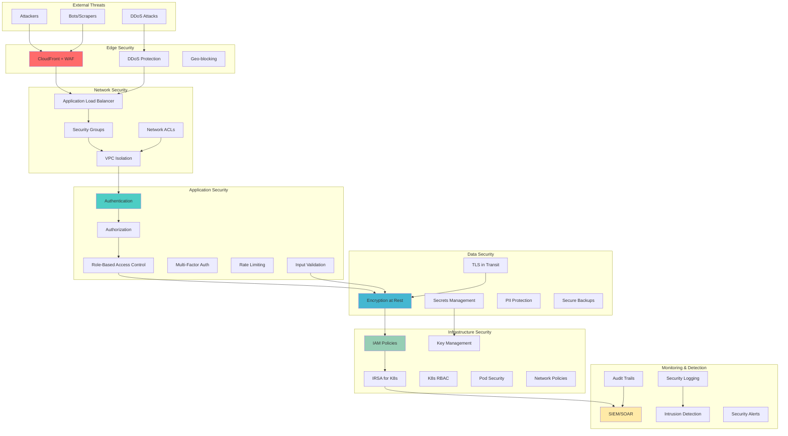

# Security Hardening Guide

## Overview

This document provides comprehensive security hardening procedures, threat modeling frameworks, and advanced security practices for the Tolstoy platform. It covers infrastructure security, application security, data protection, and compliance requirements.

## Security Architecture



## Threat Modeling

### 1. STRIDE Analysis

<Tabs>
  <Tab title="Spoofing Threats">
    | **Threat** | **Impact** | **Likelihood** | **Mitigation** | **Status** |
    |------------|------------|----------------|----------------|------------|
    | API Key Spoofing | High | Medium | JWT with short expiry, API key rotation | ✅ Implemented |
    | User Identity Spoofing | High | Medium | MFA, device fingerprinting, behavioral analysis | ✅ Implemented |
    | Service Identity Spoofing | Medium | Low | mTLS between services, service mesh | 🚧 In Progress |
    | DNS Spoofing | Medium | Low | DNSSEC, DNS over HTTPS | ✅ Implemented |
    | IP Spoofing | Medium | Low | AWS Shield, source IP validation | ✅ Implemented |
    
    **Spoofing Controls:**
    ```yaml
    # Service-to-service authentication
    apiVersion: security.istio.io/v1beta1
    kind: PeerAuthentication
    metadata:
      name: tolstoy-peer-auth
      namespace: tolstoy-prod
    spec:
      mtls:
        mode: STRICT  # Require mTLS for all traffic
    
    ---
    # Authorization policy
    apiVersion: security.istio.io/v1beta1
    kind: AuthorizationPolicy
    metadata:
      name: tolstoy-authz
      namespace: tolstoy-prod
    spec:
      selector:
        matchLabels:
          app: tolstoy-api
      rules:
      - from:
        - source:
            principals: ["cluster.local/ns/tolstoy-prod/sa/tolstoy-workflow"]
        - source:
            principals: ["cluster.local/ns/tolstoy-prod/sa/tolstoy-background"]
        to:
        - operation:
            methods: ["GET", "POST"]
            paths: ["/internal/*"]
    ```
  </Tab>
  
  <Tab title="Tampering Threats">
    | **Threat** | **Impact** | **Likelihood** | **Mitigation** | **Status** |
    |------------|------------|----------------|----------------|------------|
    | Database Tampering | Critical | Low | Encryption at rest, audit logging, backups | ✅ Implemented |
    | Configuration Tampering | High | Medium | K8s RBAC, GitOps, signed containers | ✅ Implemented |
    | Message Queue Tampering | Medium | Low | SQS server-side encryption, IAM policies | ✅ Implemented |
    | Log Tampering | Medium | Medium | Immutable logging, log forwarding | ✅ Implemented |
    | Code Tampering | High | Low | Signed commits, container image signing | 🚧 In Progress |
    
    **Tampering Controls:**
    ```typescript
    // Database integrity checks
    class DatabaseIntegrityChecker {
      constructor(private db: Database, private logger: Logger) {}
      
      async verifyWorkflowIntegrity(workflowId: string): Promise<boolean> {
        const workflow = await this.db.query(`
          SELECT id, definition, checksum, updated_at
          FROM workflows 
          WHERE id = $1
        `, [workflowId]);
        
        if (!workflow.rows.length) {
          this.logger.error('Workflow not found', { workflowId });
          return false;
        }
        
        const { definition, checksum } = workflow.rows[0];
        const computedChecksum = this.computeChecksum(definition);
        
        if (computedChecksum !== checksum) {
          this.logger.error('Workflow integrity violation detected', {
            workflowId,
            expectedChecksum: checksum,
            computedChecksum
          });
          
          // Alert security team
          await this.alertSecurityTeam('WORKFLOW_INTEGRITY_VIOLATION', { workflowId });
          return false;
        }
        
        return true;
      }
      
      private computeChecksum(data: any): string {
        const crypto = require('crypto');
        return crypto.createHash('sha256')
          .update(JSON.stringify(data))
          .digest('hex');
      }
      
      private async alertSecurityTeam(alertType: string, context: any) {
        // Implementation for security alerting
        await this.publishToSecurityTopic(alertType, context);
      }
    }
    ```
  </Tab>
  
  <Tab title="Information Disclosure">
    | **Threat** | **Impact** | **Likelihood** | **Mitigation** | **Status** |
    |------------|------------|----------------|----------------|------------|
    | API Data Leakage | High | Medium | Field-level permissions, data masking | ✅ Implemented |
    | Log Information Leakage | Medium | High | Log sanitization, structured logging | ✅ Implemented |
    | Error Information Leakage | Medium | High | Generic error messages, error handling | ✅ Implemented |
    | Metadata Leakage | Low | Medium | Minimal response headers, security headers | ✅ Implemented |
    | Database Information Disclosure | High | Low | Row-level security, query parameterization | ✅ Implemented |
    
    **Information Disclosure Controls:**
    ```typescript
    // Data sanitization middleware
    export class DataSanitizationMiddleware {
      static sanitizeResponse(req: Request, res: Response, next: NextFunction) {
        const originalJson = res.json;
        
        res.json = function(data: any) {
          const sanitizedData = DataSanitizationMiddleware.sanitizeData(data, req.user);
          return originalJson.call(this, sanitizedData);
        };
        
        next();
      }
      
      private static sanitizeData(data: any, user: User): any {
        if (!data) return data;
        
        // Remove sensitive fields based on user permissions
        const sensitiveFields = ['password', 'secret', 'token', 'key'];
        const userPermissions = user?.permissions || [];
        
        return this.recursiveSanitize(data, sensitiveFields, userPermissions);
      }
      
      private static recursiveSanitize(
        obj: any, 
        sensitiveFields: string[], 
        userPermissions: string[]
      ): any {
        if (typeof obj !== 'object' || obj === null) return obj;
        
        if (Array.isArray(obj)) {
          return obj.map(item => this.recursiveSanitize(item, sensitiveFields, userPermissions));
        }
        
        const sanitized: any = {};
        
        for (const [key, value] of Object.entries(obj)) {
          // Check if field requires special permissions
          if (this.requiresPermission(key, userPermissions)) {
            continue; // Skip field if user doesn't have permission
          }
          
          // Mask sensitive fields
          if (sensitiveFields.includes(key.toLowerCase())) {
            sanitized[key] = '[REDACTED]';
          } else {
            sanitized[key] = this.recursiveSanitize(value, sensitiveFields, userPermissions);
          }
        }
        
        return sanitized;
      }
      
      private static requiresPermission(fieldName: string, permissions: string[]): boolean {
        const fieldPermissionMap: Record<string, string> = {
          'email': 'users:read:email',
          'phone': 'users:read:phone',
          'ssn': 'users:read:pii',
          'creditCard': 'users:read:payment'
        };
        
        const requiredPermission = fieldPermissionMap[fieldName];
        return requiredPermission && !permissions.includes(requiredPermission);
      }
    }
    ```
  </Tab>
  
  <Tab title="Denial of Service">
    | **Threat** | **Impact** | **Likelihood** | **Mitigation** | **Status** |
    |------------|------------|----------------|----------------|------------|
    | Network DDoS | High | Medium | AWS Shield Advanced, CloudFront | ✅ Implemented |
    | Application DDoS | High | Medium | Rate limiting, auto-scaling | ✅ Implemented |
    | Resource Exhaustion | Medium | High | Resource limits, circuit breakers | ✅ Implemented |
    | Database Connection Exhaustion | High | Medium | Connection pooling, query timeouts | ✅ Implemented |
    | Memory Exhaustion | Medium | High | Memory limits, garbage collection tuning | ✅ Implemented |
    
    **DoS Protection:**
    ```typescript
    // Advanced rate limiting with Redis
    export class AdvancedRateLimiter {
      constructor(
        private redis: Redis,
        private config: RateLimitConfig
      ) {}
      
      async checkRateLimit(
        identifier: string,
        action: string,
        userTier: 'free' | 'pro' | 'enterprise' = 'free'
      ): Promise<RateLimitResult> {
        const key = `ratelimit:${action}:${identifier}`;
        const limits = this.config.limits[userTier][action];
        
        if (!limits) {
          throw new Error(`No rate limit configured for action: ${action}`);
        }
        
        // Multiple window rate limiting (burst + sustained)
        const results = await Promise.all([
          this.checkWindow(key, limits.burst.window, limits.burst.max),
          this.checkWindow(key, limits.sustained.window, limits.sustained.max)
        ]);
        
        const [burstResult, sustainedResult] = results;
        
        if (!burstResult.allowed || !sustainedResult.allowed) {
          // Log potential abuse
          if (burstResult.current > limits.burst.max * 1.5) {
            await this.logPotentialAbuse(identifier, action, burstResult.current);
          }
          
          return {
            allowed: false,
            current: Math.max(burstResult.current, sustainedResult.current),
            resetTime: Math.min(burstResult.resetTime, sustainedResult.resetTime),
            retryAfter: Math.min(burstResult.retryAfter, sustainedResult.retryAfter)
          };
        }
        
        return {
          allowed: true,
          current: Math.max(burstResult.current, sustainedResult.current),
          resetTime: 0,
          retryAfter: 0
        };
      }
      
      private async checkWindow(
        key: string, 
        windowSeconds: number, 
        maxRequests: number
      ): Promise<WindowResult> {
        const pipeline = this.redis.pipeline();
        const now = Date.now();
        const windowStart = now - (windowSeconds * 1000);
        
        pipeline.zremrangebyscore(key, '-inf', windowStart);
        pipeline.zadd(key, now, `${now}-${Math.random()}`);
        pipeline.zcard(key);
        pipeline.expire(key, windowSeconds);
        
        const results = await pipeline.exec();
        const current = results![2][1] as number;
        
        return {
          allowed: current <= maxRequests,
          current,
          resetTime: windowStart + (windowSeconds * 1000),
          retryAfter: current > maxRequests ? Math.ceil((windowStart + (windowSeconds * 1000) - now) / 1000) : 0
        };
      }
      
      private async logPotentialAbuse(identifier: string, action: string, requestCount: number) {
        const abusivePattern = {
          identifier,
          action,
          requestCount,
          timestamp: new Date(),
          severity: requestCount > 1000 ? 'critical' : 'warning'
        };
        
        // Log to security monitoring system
        console.error('Potential abuse detected', abusivePattern);
        
        // Add to temporary block list if severe
        if (abusivePattern.severity === 'critical') {
          await this.redis.setex(`block:${identifier}`, 3600, 'abuse'); // 1 hour block
        }
      }
    }
    
    interface RateLimitConfig {
      limits: {
        [tier: string]: {
          [action: string]: {
            burst: { window: number; max: number };
            sustained: { window: number; max: number };
          };
        };
      };
    }
    ```
  </Tab>
</Tabs>

### 2. Attack Surface Analysis

<Tabs>
  <Tab title="External Attack Surface">
    ```yaml
    # External attack surface mapping
    external_endpoints:
      public_api:
        - endpoint: "https://api.tolstoy.dev/v1/*"
          authentication: "Bearer Token"
          rate_limiting: "Implemented"
          waf_protection: "Enabled"
          exposure_level: "Public"
          
        - endpoint: "https://api.tolstoy.dev/webhooks/*"
          authentication: "HMAC Signature"
          rate_limiting: "Implemented"
          waf_protection: "Enabled"
          exposure_level: "Public"
          
      web_application:
        - endpoint: "https://app.tolstoy.dev/*"
          authentication: "Session + CSRF"
          rate_limiting: "Implemented"
          waf_protection: "Enabled"
          exposure_level: "Public"
          
      admin_interfaces:
        - endpoint: "https://admin.tolstoy.dev/*"
          authentication: "MFA Required"
          rate_limiting: "Strict"
          waf_protection: "Enabled"
          ip_whitelist: "Enabled"
          exposure_level: "Restricted"
    
    # Risk assessment
    risk_matrix:
      high_risk:
        - "Admin interface compromise"
        - "API authentication bypass"
        - "Database injection attacks"
        
      medium_risk:
        - "Session hijacking"
        - "CSRF attacks"
        - "Rate limit bypass"
        
      low_risk:
        - "Information disclosure via headers"
        - "Directory enumeration"
        - "Minor configuration exposure"
    ```
  </Tab>
  
  <Tab title="Internal Attack Surface">
    ```typescript
    // Internal service security assessment
    interface InternalService {
      name: string;
      ports: number[];
      authentication: string;
      authorization: string;
      encryption: string;
      networkPolicy: boolean;
      serviceAccount: string;
      riskLevel: 'low' | 'medium' | 'high';
    }
    
    const internalServices: InternalService[] = [
      {
        name: 'tolstoy-api',
        ports: [3000, 9090],
        authentication: 'JWT + Service Account',
        authorization: 'RBAC',
        encryption: 'TLS 1.3',
        networkPolicy: true,
        serviceAccount: 'tolstoy-api',
        riskLevel: 'high' // High value target
      },
      {
        name: 'tolstoy-workflow-engine',
        ports: [3001, 9091],
        authentication: 'Service Account',
        authorization: 'RBAC',
        encryption: 'TLS 1.3',
        networkPolicy: true,
        serviceAccount: 'tolstoy-workflow',
        riskLevel: 'high' // Executes arbitrary workflows
      },
      {
        name: 'postgresql-primary',
        ports: [5432],
        authentication: 'Username/Password + IRSA',
        authorization: 'Database Roles',
        encryption: 'TLS 1.3 + Encryption at Rest',
        networkPolicy: true,
        serviceAccount: 'postgres',
        riskLevel: 'high' // Contains all data
      },
      {
        name: 'redis-cluster',
        ports: [6379],
        authentication: 'AUTH Token',
        authorization: 'None',
        encryption: 'TLS 1.3 + Encryption at Rest',
        networkPolicy: true,
        serviceAccount: 'redis',
        riskLevel: 'medium' // Session data and caching
      },
      {
        name: 'prometheus',
        ports: [9090],
        authentication: 'Basic Auth',
        authorization: 'None',
        encryption: 'TLS 1.3',
        networkPolicy: true,
        serviceAccount: 'prometheus',
        riskLevel: 'medium' // Metrics could reveal system info
      }
    ];
    
    // Generate security assessment
    function generateSecurityAssessment(): SecurityAssessment {
      const highRiskServices = internalServices.filter(s => s.riskLevel === 'high');
      const recommendedActions: string[] = [];
      
      // Check for services without proper network policies
      const servicesWithoutNetPol = internalServices.filter(s => !s.networkPolicy);
      if (servicesWithoutNetPol.length > 0) {
        recommendedActions.push(`Implement network policies for: ${servicesWithoutNetPol.map(s => s.name).join(', ')}`);
      }
      
      // Check for services with weak authorization
      const servicesWithWeakAuthz = internalServices.filter(s => s.authorization === 'None');
      if (servicesWithWeakAuthz.length > 0) {
        recommendedActions.push(`Implement proper authorization for: ${servicesWithWeakAuthz.map(s => s.name).join(', ')}`);
      }
      
      return {
        totalServices: internalServices.length,
        highRiskServices: highRiskServices.length,
        mediumRiskServices: internalServices.filter(s => s.riskLevel === 'medium').length,
        lowRiskServices: internalServices.filter(s => s.riskLevel === 'low').length,
        recommendedActions,
        complianceScore: this.calculateComplianceScore(internalServices)
      };
    }
    
    interface SecurityAssessment {
      totalServices: number;
      highRiskServices: number;
      mediumRiskServices: number;
      lowRiskServices: number;
      recommendedActions: string[];
      complianceScore: number;
    }
    ```
  </Tab>
</Tabs>

## Access Control & Authentication

### 1. Advanced Authentication

<Tabs>
  <Tab title="Multi-Factor Authentication">
    ```typescript
    // Advanced MFA implementation
    import { authenticator } from 'otplib';
    import { generateSecret, QRCodeURI } from 'speakeasy';
    import { WebAuthnCredential } from '@webauthn/server';
    
    export class AdvancedMFAService {
      constructor(
        private userService: UserService,
        private auditLogger: AuditLogger
      ) {}
      
      async setupTOTP(userId: string): Promise<TOTPSetupResponse> {
        const user = await this.userService.findById(userId);
        if (!user) {
          throw new Error('User not found');
        }
        
        // Generate secret
        const secret = authenticator.generateSecret();
        const qrCodeUri = authenticator.keyuri(
          user.email,
          'Tolstoy',
          secret
        );
        
        // Store secret temporarily (user must verify before it's permanent)
        await this.userService.updateUser(userId, {
          tempTotpSecret: secret,
          totpSetupAt: new Date()
        });
        
        await this.auditLogger.log({
          userId,
          action: 'TOTP_SETUP_INITIATED',
          metadata: { email: user.email }
        });
        
        return {
          secret,
          qrCodeUri,
          backupCodes: this.generateBackupCodes()
        };
      }
      
      async verifyTOTP(userId: string, token: string, setupMode = false): Promise<boolean> {
        const user = await this.userService.findById(userId);
        if (!user) return false;
        
        const secret = setupMode ? user.tempTotpSecret : user.totpSecret;
        if (!secret) return false;
        
        const isValid = authenticator.verify({
          token,
          secret,
          window: 1 // Allow 1 step tolerance for clock skew
        });
        
        if (isValid && setupMode) {
          // Confirm TOTP setup
          await this.userService.updateUser(userId, {
            totpSecret: user.tempTotpSecret,
            tempTotpSecret: null,
            mfaEnabled: true,
            mfaSetupAt: new Date()
          });
          
          await this.auditLogger.log({
            userId,
            action: 'TOTP_SETUP_COMPLETED',
            metadata: { method: 'TOTP' }
          });
        }
        
        if (isValid && !setupMode) {
          await this.auditLogger.log({
            userId,
            action: 'MFA_VERIFICATION_SUCCESS',
            metadata: { method: 'TOTP' }
          });
        } else if (!isValid) {
          await this.auditLogger.log({
            userId,
            action: 'MFA_VERIFICATION_FAILED',
            metadata: { method: 'TOTP', token: token.substring(0, 2) + '****' }
          });
        }
        
        return isValid;
      }
      
      async setupWebAuthn(userId: string, userAgent: string): Promise<WebAuthnSetupResponse> {
        const user = await this.userService.findById(userId);
        if (!user) {
          throw new Error('User not found');
        }
        
        const challengeOptions = await this.generateWebAuthnChallenge(user, userAgent);
        
        // Store challenge temporarily
        await this.userService.updateUser(userId, {
          webauthnChallenge: challengeOptions.challenge,
          webauthnChallengeExpiry: new Date(Date.now() + 5 * 60 * 1000) // 5 minutes
        });
        
        await this.auditLogger.log({
          userId,
          action: 'WEBAUTHN_SETUP_INITIATED',
          metadata: { userAgent }
        });
        
        return challengeOptions;
      }
      
      async verifyWebAuthn(
        userId: string,
        credentialResponse: WebAuthnCredential
      ): Promise<boolean> {
        const user = await this.userService.findById(userId);
        if (!user || !user.webauthnChallenge) return false;
        
        // Check challenge expiry
        if (new Date() > user.webauthnChallengeExpiry) {
          await this.auditLogger.log({
            userId,
            action: 'WEBAUTHN_CHALLENGE_EXPIRED',
            metadata: { credentialId: credentialResponse.id }
          });
          return false;
        }
        
        try {
          const verification = await this.verifyWebAuthnCredential(
            credentialResponse,
            user.webauthnChallenge
          );
          
          if (verification.verified) {
            // Store credential for future use
            await this.userService.addWebAuthnCredential(userId, {
              credentialId: credentialResponse.id,
              publicKey: verification.credentialPublicKey,
              counter: verification.authenticationCounter,
              createdAt: new Date()
            });
            
            // Clear challenge
            await this.userService.updateUser(userId, {
              webauthnChallenge: null,
              webauthnChallengeExpiry: null,
              mfaEnabled: true
            });
            
            await this.auditLogger.log({
              userId,
              action: 'WEBAUTHN_SETUP_COMPLETED',
              metadata: { credentialId: credentialResponse.id }
            });
            
            return true;
          }
        } catch (error) {
          await this.auditLogger.log({
            userId,
            action: 'WEBAUTHN_VERIFICATION_ERROR',
            metadata: { error: error.message }
          });
        }
        
        return false;
      }
      
      // Backup codes for MFA recovery
      private generateBackupCodes(count = 10): string[] {
        const codes: string[] = [];
        for (let i = 0; i < count; i++) {
          codes.push(this.generateSecureCode(8));
        }
        return codes;
      }
      
      private generateSecureCode(length: number): string {
        const characters = '0123456789ABCDEFGHIJKLMNOPQRSTUVWXYZ';
        let result = '';
        for (let i = 0; i < length; i++) {
          result += characters.charAt(Math.floor(Math.random() * characters.length));
        }
        return result;
      }
      
      async verifyBackupCode(userId: string, code: string): Promise<boolean> {
        const user = await this.userService.findById(userId);
        if (!user || !user.backupCodes) return false;
        
        const codeIndex = user.backupCodes.findIndex(bc => bc.code === code && !bc.used);
        if (codeIndex === -1) return false;
        
        // Mark backup code as used
        user.backupCodes[codeIndex].used = true;
        user.backupCodes[codeIndex].usedAt = new Date();
        
        await this.userService.updateUser(userId, {
          backupCodes: user.backupCodes
        });
        
        await this.auditLogger.log({
          userId,
          action: 'BACKUP_CODE_USED',
          metadata: { codeIndex }
        });
        
        // Alert user if only few codes left
        const unusedCodes = user.backupCodes.filter(bc => !bc.used).length;
        if (unusedCodes <= 2) {
          await this.sendLowBackupCodesAlert(userId, unusedCodes);
        }
        
        return true;
      }
      
      private async sendLowBackupCodesAlert(userId: string, remainingCodes: number) {
        // Implementation for sending low backup codes alert
        const user = await this.userService.findById(userId);
        if (user) {
          await this.notificationService.send({
            to: user.email,
            template: 'low-backup-codes',
            data: { remainingCodes }
          });
        }
      }
    }
    
    interface TOTPSetupResponse {
      secret: string;
      qrCodeUri: string;
      backupCodes: string[];
    }
    
    interface WebAuthnSetupResponse {
      challenge: string;
      rp: { name: string; id: string };
      user: { id: string; name: string; displayName: string };
      pubKeyCredParams: any[];
      timeout: number;
      attestation: string;
    }
    ```
  </Tab>
  
  <Tab title="Advanced Authorization">
    ```typescript
    // Attribute-Based Access Control (ABAC)
    export class ABACAuthorizationService {
      constructor(
        private policyEngine: PolicyEngine,
        private contextProvider: ContextProvider
      ) {}
      
      async authorize(request: AuthorizationRequest): Promise<AuthorizationResult> {
        try {
          // Gather all relevant attributes
          const context = await this.buildAuthorizationContext(request);
          
          // Evaluate policies
          const decision = await this.policyEngine.evaluate(context);
          
          // Log authorization decision
          await this.logAuthorizationDecision(request, context, decision);
          
          return decision;
        } catch (error) {
          console.error('Authorization error:', error);
          return {
            decision: 'DENY',
            reason: 'Authorization system error',
            obligations: []
          };
        }
      }
      
      private async buildAuthorizationContext(
        request: AuthorizationRequest
      ): Promise<AuthorizationContext> {
        const [subject, resource, environment] = await Promise.all([
          this.getSubjectAttributes(request.subject),
          this.getResourceAttributes(request.resource),
          this.getEnvironmentAttributes(request)
        ]);
        
        return {
          subject,
          resource,
          action: request.action,
          environment,
          timestamp: new Date()
        };
      }
      
      private async getSubjectAttributes(subject: Subject): Promise<SubjectAttributes> {
        const user = await this.userService.findById(subject.userId);
        const organization = await this.organizationService.findById(subject.organizationId);
        const roles = await this.roleService.getUserRoles(subject.userId);
        
        return {
          userId: subject.userId,
          email: user.email,
          organizationId: subject.organizationId,
          organizationTier: organization.tier,
          roles: roles.map(r => r.name),
          permissions: roles.flatMap(r => r.permissions),
          mfaEnabled: user.mfaEnabled,
          accountStatus: user.status,
          lastLoginAt: user.lastLoginAt,
          createdAt: user.createdAt
        };
      }
      
      private async getResourceAttributes(resource: Resource): Promise<ResourceAttributes> {
        switch (resource.type) {
          case 'workflow':
            return await this.getWorkflowAttributes(resource.id);
          case 'organization':
            return await this.getOrganizationAttributes(resource.id);
          case 'user':
            return await this.getUserResourceAttributes(resource.id);
          default:
            return {
              id: resource.id,
              type: resource.type,
              sensitivity: 'public'
            };
        }
      }
      
      private async getWorkflowAttributes(workflowId: string): Promise<ResourceAttributes> {
        const workflow = await this.workflowService.findById(workflowId);
        
        return {
          id: workflowId,
          type: 'workflow',
          ownerId: workflow.createdBy,
          organizationId: workflow.organizationId,
          sensitivity: workflow.containsPII ? 'confidential' : 'internal',
          tags: workflow.tags,
          createdAt: workflow.createdAt,
          isPublic: workflow.isPublic
        };
      }
      
      private async getEnvironmentAttributes(
        request: AuthorizationRequest
      ): Promise<EnvironmentAttributes> {
        const ipInfo = await this.ipInfoService.getInfo(request.clientIP);
        
        return {
          currentTime: new Date(),
          clientIP: request.clientIP,
          userAgent: request.userAgent,
          country: ipInfo.country,
          isVPN: ipInfo.isVPN,
          isTor: ipInfo.isTor,
          riskScore: await this.calculateRiskScore(request)
        };
      }
      
      private async calculateRiskScore(request: AuthorizationRequest): Promise<number> {
        let riskScore = 0;
        
        // IP-based risk factors
        const ipInfo = await this.ipInfoService.getInfo(request.clientIP);
        if (ipInfo.isVPN) riskScore += 2;
        if (ipInfo.isTor) riskScore += 5;
        if (ipInfo.isKnownMalicious) riskScore += 10;
        
        // Time-based risk factors
        const hour = new Date().getHours();
        if (hour < 6 || hour > 22) riskScore += 1; // Outside business hours
        
        // Frequency-based risk factors
        const recentRequests = await this.getRecentRequestCount(
          request.subject.userId, 
          request.clientIP
        );
        if (recentRequests > 100) riskScore += 3; // High frequency
        
        // Geolocation risk factors
        const usualLocations = await this.getUserUsualLocations(request.subject.userId);
        if (!usualLocations.includes(ipInfo.country)) {
          riskScore += 4; // Unusual location
        }
        
        return Math.min(riskScore, 10); // Cap at 10
      }
      
      private async logAuthorizationDecision(
        request: AuthorizationRequest,
        context: AuthorizationContext,
        decision: AuthorizationResult
      ) {
        await this.auditLogger.log({
          type: 'AUTHORIZATION_DECISION',
          userId: request.subject.userId,
          action: request.action,
          resource: `${request.resource.type}:${request.resource.id}`,
          decision: decision.decision,
          reason: decision.reason,
          riskScore: context.environment.riskScore,
          timestamp: new Date(),
          clientIP: context.environment.clientIP,
          userAgent: context.environment.userAgent
        });
        
        // Alert on high-risk denied requests
        if (decision.decision === 'DENY' && context.environment.riskScore >= 7) {
          await this.securityAlertService.sendAlert({
            type: 'HIGH_RISK_ACCESS_DENIED',
            severity: 'medium',
            details: {
              userId: request.subject.userId,
              resource: request.resource,
              riskScore: context.environment.riskScore,
              clientIP: context.environment.clientIP
            }
          });
        }
      }
    }
    
    // Policy definitions
    const policyDefinitions = {
      workflowAccess: {
        id: 'workflow-access-policy',
        version: '1.0',
        rules: [
          {
            id: 'owner-full-access',
            effect: 'ALLOW',
            condition: 'subject.userId == resource.ownerId',
            actions: ['*']
          },
          {
            id: 'organization-member-read',
            effect: 'ALLOW',
            condition: 'subject.organizationId == resource.organizationId AND "member" IN subject.roles',
            actions: ['read', 'execute']
          },
          {
            id: 'high-risk-deny',
            effect: 'DENY',
            condition: 'environment.riskScore >= 8',
            actions: ['*'],
            obligations: ['REQUIRE_MFA']
          },
          {
            id: 'pii-workflow-protection',
            effect: 'DENY',
            condition: 'resource.sensitivity == "confidential" AND NOT ("pii-access" IN subject.permissions)',
            actions: ['read', 'update', 'delete']
          }
        ]
      }
    };
    ```
  </Tab>
</Tabs>

### 2. Secrets Management

<Tabs>
  <Tab title="AWS Secrets Manager Integration">
    ```typescript
    // Advanced secrets management
    import { SecretsManagerClient, GetSecretValueCommand } from '@aws-sdk/client-secrets-manager';
    
    export class AdvancedSecretsManager {
      private client: SecretsManagerClient;
      private cache: Map<string, CachedSecret> = new Map();
      private readonly maxCacheAge = 300000; // 5 minutes
      
      constructor(region = 'us-west-2') {
        this.client = new SecretsManagerClient({ region });
      }
      
      async getSecret(secretName: string, version?: string): Promise<string> {
        const cacheKey = `${secretName}:${version || 'AWSCURRENT'}`;
        
        // Check cache first
        const cached = this.cache.get(cacheKey);
        if (cached && this.isCacheValid(cached)) {
          await this.auditSecretAccess(secretName, 'cache_hit');
          return cached.value;
        }
        
        try {
          const command = new GetSecretValueCommand({
            SecretId: secretName,
            VersionStage: version || 'AWSCURRENT'
          });
          
          const response = await this.client.send(command);
          
          if (!response.SecretString) {
            throw new Error(`Secret ${secretName} has no string value`);
          }
          
          // Cache the secret
          this.cache.set(cacheKey, {
            value: response.SecretString,
            retrievedAt: Date.now(),
            arn: response.ARN
          });
          
          await this.auditSecretAccess(secretName, 'retrieved');
          return response.SecretString;
          
        } catch (error) {
          await this.auditSecretAccess(secretName, 'error', error.message);
          throw new Error(`Failed to retrieve secret ${secretName}: ${error.message}`);
        }
      }
      
      async getSecretObject<T = any>(secretName: string, version?: string): Promise<T> {
        const secretString = await this.getSecret(secretName, version);
        
        try {
          return JSON.parse(secretString) as T;
        } catch (error) {
          throw new Error(`Secret ${secretName} is not valid JSON`);
        }
      }
      
      // Rotate secrets automatically
      async rotateSecret(secretName: string, newValue: string): Promise<void> {
        try {
          // Create new version
          await this.client.send(new PutSecretValueCommand({
            SecretId: secretName,
            SecretString: newValue,
            VersionStage: 'AWSPENDING'
          }));
          
          // Test new secret
          const testResult = await this.testSecret(secretName, 'AWSPENDING');
          
          if (testResult.success) {
            // Promote to current
            await this.client.send(new UpdateSecretVersionStageCommand({
              SecretId: secretName,
              VersionStage: 'AWSCURRENT',
              MoveToVersionId: testResult.versionId
            }));
            
            // Clear cache
            this.clearSecretFromCache(secretName);
            
            await this.auditSecretAccess(secretName, 'rotated');
          } else {
            throw new Error(`Secret rotation test failed: ${testResult.error}`);
          }
        } catch (error) {
          await this.auditSecretAccess(secretName, 'rotation_failed', error.message);
          throw error;
        }
      }
      
      private isCacheValid(cached: CachedSecret): boolean {
        return (Date.now() - cached.retrievedAt) < this.maxCacheAge;
      }
      
      private clearSecretFromCache(secretName: string): void {
        const keysToDelete = Array.from(this.cache.keys())
          .filter(key => key.startsWith(`${secretName}:`));
        
        keysToDelete.forEach(key => this.cache.delete(key));
      }
      
      private async testSecret(secretName: string, version: string): Promise<TestResult> {
        // Implementation depends on secret type
        // This is a simplified example
        try {
          const secret = await this.getSecret(secretName, version);
          
          if (secretName.includes('database')) {
            return await this.testDatabaseSecret(secret);
          } else if (secretName.includes('api-key')) {
            return await this.testApiKeySecret(secret);
          }
          
          return { success: true, versionId: version };
        } catch (error) {
          return { success: false, error: error.message, versionId: version };
        }
      }
      
      private async testDatabaseSecret(secretString: string): Promise<TestResult> {
        try {
          const dbConfig = JSON.parse(secretString);
          
          // Test database connection
          const testConnection = new Client({
            host: dbConfig.host,
            port: dbConfig.port,
            user: dbConfig.username,
            password: dbConfig.password,
            database: dbConfig.database,
            connectTimeout: 5000
          });
          
          await testConnection.connect();
          await testConnection.query('SELECT 1');
          await testConnection.end();
          
          return { success: true };
        } catch (error) {
          return { success: false, error: error.message };
        }
      }
      
      private async testApiKeySecret(secretString: string): Promise<TestResult> {
        try {
          const apiConfig = JSON.parse(secretString);
          
          // Test API key by making a test request
          const response = await fetch(`${apiConfig.baseUrl}/test`, {
            headers: {
              'Authorization': `Bearer ${apiConfig.apiKey}`
            },
            timeout: 5000
          });
          
          if (response.ok) {
            return { success: true };
          } else {
            return { success: false, error: `API test failed with status ${response.status}` };
          }
        } catch (error) {
          return { success: false, error: error.message };
        }
      }
      
      private async auditSecretAccess(
        secretName: string, 
        action: string, 
        details?: string
      ): Promise<void> {
        const auditEvent = {
          timestamp: new Date(),
          service: 'secrets-manager',
          action,
          resource: secretName,
          details,
          source: {
            service: process.env.SERVICE_NAME,
            version: process.env.SERVICE_VERSION,
            instanceId: process.env.HOSTNAME
          }
        };
        
        // Send to audit logging system
        console.log('Secret audit:', auditEvent);
        
        // For high-value secrets, send immediate alerts
        if (this.isHighValueSecret(secretName)) {
          await this.sendSecretAccessAlert(auditEvent);
        }
      }
      
      private isHighValueSecret(secretName: string): boolean {
        const highValuePatterns = [
          'database',
          'master-key',
          'signing-key',
          'root',
          'admin'
        ];
        
        return highValuePatterns.some(pattern => 
          secretName.toLowerCase().includes(pattern)
        );
      }
      
      private async sendSecretAccessAlert(auditEvent: any): Promise<void> {
        // Implementation for sending alerts for high-value secret access
        // This could integrate with your alerting system
        if (auditEvent.action === 'error' || auditEvent.action === 'rotation_failed') {
          await this.alertingService.sendAlert({
            type: 'SECRET_ACCESS_FAILURE',
            severity: 'high',
            details: auditEvent
          });
        }
      }
    }
    
    interface CachedSecret {
      value: string;
      retrievedAt: number;
      arn?: string;
    }
    
    interface TestResult {
      success: boolean;
      error?: string;
      versionId?: string;
    }
    ```
  </Tab>
  
  <Tab title="Kubernetes Secrets Security">
    ```yaml
    # Secure secrets management in Kubernetes
    apiVersion: v1
    kind: Secret
    metadata:
      name: tolstoy-database-credentials
      namespace: tolstoy-prod
      annotations:
        # External Secrets Operator annotation
        external-secrets.io/managed-by: "external-secrets"
        # Rotation schedule
        secrets.tolstoy.dev/rotation-schedule: "0 2 * * 0"  # Weekly on Sunday 2 AM
        # Classification
        security.tolstoy.dev/classification: "confidential"
        # Owner
        security.tolstoy.dev/owner: "platform-team"
    type: Opaque
    # Data will be populated by External Secrets Operator
    
    ---
    # External Secret definition
    apiVersion: external-secrets.io/v1beta1
    kind: ExternalSecret
    metadata:
      name: tolstoy-database-secret
      namespace: tolstoy-prod
    spec:
      refreshInterval: 5m
      secretStoreRef:
        name: aws-secrets-manager
        kind: SecretStore
      target:
        name: tolstoy-database-credentials
        creationPolicy: Owner
        template:
          type: Opaque
          metadata:
            annotations:
              security.tolstoy.dev/classification: "confidential"
          data:
            POSTGRES_HOST: "{{ .host }}"
            POSTGRES_PORT: "{{ .port }}"
            POSTGRES_DB: "{{ .database }}"
            POSTGRES_USER: "{{ .username }}"
            POSTGRES_PASSWORD: "{{ .password }}"
            # Connection URL template
            DATABASE_URL: "postgresql://{{ .username }}:{{ .password }}@{{ .host }}:{{ .port }}/{{ .database }}?sslmode=require"
      dataFrom:
      - extract:
          key: tolstoy/database/primary
          version: AWSCURRENT
    
    ---
    # SecretStore configuration
    apiVersion: external-secrets.io/v1beta1
    kind: SecretStore
    metadata:
      name: aws-secrets-manager
      namespace: tolstoy-prod
    spec:
      provider:
        aws:
          service: SecretsManager
          region: us-west-2
          auth:
            jwt:
              serviceAccountRef:
                name: external-secrets
    
    ---
    # RBAC for External Secrets
    apiVersion: v1
    kind: ServiceAccount
    metadata:
      name: external-secrets
      namespace: tolstoy-prod
      annotations:
        eks.amazonaws.com/role-arn: arn:aws:iam::123456789012:role/tolstoy-external-secrets
    
    ---
    # Pod Security Policy for secrets access
    apiVersion: v1
    kind: Pod
    metadata:
      name: secure-pod-example
      namespace: tolstoy-prod
    spec:
      securityContext:
        runAsNonRoot: true
        runAsUser: 1000
        fsGroup: 2000
        seccompProfile:
          type: RuntimeDefault
      
      containers:
      - name: app
        image: tolstoy/api:latest
        securityContext:
          allowPrivilegeEscalation: false
          readOnlyRootFilesystem: true
          capabilities:
            drop:
            - ALL
        
        env:
        # Use secrets as environment variables (not recommended for sensitive data)
        - name: DATABASE_URL
          valueFrom:
            secretKeyRef:
              name: tolstoy-database-credentials
              key: DATABASE_URL
        
        # Preferred: Mount secrets as files
        volumeMounts:
        - name: database-credentials
          mountPath: "/etc/secrets/database"
          readOnly: true
        - name: api-keys
          mountPath: "/etc/secrets/api"
          readOnly: true
        - name: tmp
          mountPath: /tmp
      
      volumes:
      - name: database-credentials
        secret:
          secretName: tolstoy-database-credentials
          defaultMode: 0400  # Read-only by owner
      - name: api-keys
        secret:
          secretName: tolstoy-api-keys
          defaultMode: 0400
      - name: tmp
        emptyDir:
          sizeLimit: 1Gi
    
    ---
    # Network Policy to restrict secrets access
    apiVersion: networking.k8s.io/v1
    kind: NetworkPolicy
    metadata:
      name: external-secrets-policy
      namespace: tolstoy-prod
    spec:
      podSelector:
        matchLabels:
          app.kubernetes.io/name: external-secrets
      policyTypes:
      - Egress
      egress:
      # Allow access to AWS Secrets Manager
      - to: []
        ports:
        - protocol: TCP
          port: 443
      # Allow DNS resolution
      - to:
        - namespaceSelector:
            matchLabels:
              name: kube-system
        ports:
        - protocol: UDP
          port: 53
    
    ---
    # Secret scanning with Falco rule
    apiVersion: v1
    kind: ConfigMap
    metadata:
      name: falco-secrets-rules
      namespace: falco-system
    data:
      secrets_rules.yaml: |
        - rule: Sensitive Environment Variable Access
          desc: Detect access to sensitive environment variables
          condition: >
            spawned_process and
            (proc.env contains "PASSWORD" or
             proc.env contains "SECRET" or
             proc.env contains "TOKEN" or
             proc.env contains "KEY") and
            not container.image.repository in (allowed_images)
          output: >
            Sensitive environment variable accessed (user=%user.name
            command=%proc.cmdline image=%container.image.repository
            env=%proc.env)
          priority: WARNING
          tags: [secrets, environment]
        
        - rule: Secret File Access
          desc: Detect access to mounted secret files
          condition: >
            open_read and
            fd.name pmatch (/etc/secrets/* or /var/secrets/* or /run/secrets/*) and
            not proc.name in (allowed_processes)
          output: >
            Secret file accessed (user=%user.name command=%proc.cmdline
            file=%fd.name image=%container.image.repository)
          priority: INFO
          tags: [secrets, file-access]
    ```
  </Tab>
</Tabs>

---

<Note>
This security hardening guide provides comprehensive protection strategies for the Tolstoy platform. Regular security assessments, penetration testing, and compliance audits should be conducted to ensure ongoing effectiveness of these security measures.
</Note>