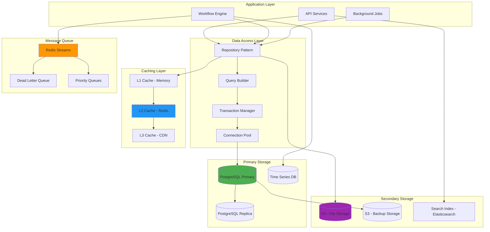

# Data Layer Architecture

This document provides an in-depth analysis of Tolstoy's data layer architecture, covering database design, caching strategies, data flow, and optimization techniques.

## Data Layer Overview



## Database Design

### 1. Core Schema Design

<Tabs>
  <Tab title="Entity Relationship">
    ```sql
    -- Organizations and Users
    CREATE SCHEMA tolstoy;
    SET search_path TO tolstoy;
    
    CREATE TABLE organizations (
        id UUID PRIMARY KEY DEFAULT gen_random_uuid(),
        name VARCHAR(255) NOT NULL,
        slug VARCHAR(255) UNIQUE NOT NULL,
        settings JSONB DEFAULT '{}' NOT NULL,
        subscription_tier subscription_tier_enum DEFAULT 'free',
        billing_info JSONB DEFAULT '{}',
        limits JSONB DEFAULT '{}',
        metadata JSONB DEFAULT '{}',
        created_at TIMESTAMP WITH TIME ZONE DEFAULT NOW(),
        updated_at TIMESTAMP WITH TIME ZONE DEFAULT NOW(),
        
        CONSTRAINT valid_slug CHECK (slug ~ '^[a-z0-9-]+$'),
        CONSTRAINT valid_settings CHECK (jsonb_typeof(settings) = 'object')
    );
    
    CREATE TABLE users (
        id UUID PRIMARY KEY DEFAULT gen_random_uuid(),
        organization_id UUID REFERENCES organizations(id) ON DELETE CASCADE,
        email VARCHAR(255) UNIQUE NOT NULL,
        name VARCHAR(255),
        avatar_url VARCHAR(500),
        role user_role_enum DEFAULT 'member',
        permissions JSONB DEFAULT '[]',
        settings JSONB DEFAULT '{}',
        auth_provider VARCHAR(50) DEFAULT 'local',
        auth_provider_id VARCHAR(255),
        email_verified BOOLEAN DEFAULT FALSE,
        last_login TIMESTAMP WITH TIME ZONE,
        login_count INTEGER DEFAULT 0,
        created_at TIMESTAMP WITH TIME ZONE DEFAULT NOW(),
        updated_at TIMESTAMP WITH TIME ZONE DEFAULT NOW(),
        
        CONSTRAINT valid_email CHECK (email ~ '^[^@]+@[^@]+\.[^@]+$'),
        CONSTRAINT valid_permissions CHECK (jsonb_typeof(permissions) = 'array')
    );
    
    -- Tools and Actions
    CREATE TABLE tools (
        id UUID PRIMARY KEY DEFAULT gen_random_uuid(),
        organization_id UUID REFERENCES organizations(id) ON DELETE CASCADE,
        name VARCHAR(255) NOT NULL,
        key VARCHAR(255) NOT NULL,
        description TEXT,
        category VARCHAR(50),
        base_url VARCHAR(500),
        auth_type auth_type_enum DEFAULT 'none',
        auth_config JSONB DEFAULT '{}',
        headers JSONB DEFAULT '{}',
        settings JSONB DEFAULT '{}',
        rate_limit JSONB DEFAULT '{}',
        health_check JSONB DEFAULT '{}',
        status tool_status_enum DEFAULT 'active',
        version INTEGER DEFAULT 1,
        icon_url VARCHAR(500),
        documentation_url VARCHAR(500),
        created_by UUID REFERENCES users(id),
        created_at TIMESTAMP WITH TIME ZONE DEFAULT NOW(),
        updated_at TIMESTAMP WITH TIME ZONE DEFAULT NOW(),
        
        UNIQUE(organization_id, key),
        CONSTRAINT valid_key CHECK (key ~ '^[a-z0-9-_]+$'),
        CONSTRAINT valid_base_url CHECK (base_url ~ '^https?://'),
        CONSTRAINT valid_auth_config CHECK (jsonb_typeof(auth_config) = 'object')
    );
    
    CREATE TABLE actions (
        id UUID PRIMARY KEY DEFAULT gen_random_uuid(),
        organization_id UUID REFERENCES organizations(id) ON DELETE CASCADE,
        tool_id UUID REFERENCES tools(id) ON DELETE CASCADE,
        name VARCHAR(255) NOT NULL,
        key VARCHAR(255) NOT NULL,
        description TEXT,
        method http_method_enum NOT NULL,
        endpoint VARCHAR(500) NOT NULL,
        request_schema JSONB,
        response_schema JSONB,
        headers JSONB DEFAULT '{}',
        query_params JSONB DEFAULT '{}',
        request_transform JSONB,
        response_transform JSONB,
        timeout INTEGER DEFAULT 30000,
        retry_config JSONB DEFAULT '{}',
        cache_config JSONB DEFAULT '{}',
        validation_rules JSONB DEFAULT '{}',
        status action_status_enum DEFAULT 'active',
        version INTEGER DEFAULT 1,
        tags TEXT[] DEFAULT '{}',
        created_by UUID REFERENCES users(id),
        created_at TIMESTAMP WITH TIME ZONE DEFAULT NOW(),
        updated_at TIMESTAMP WITH TIME ZONE DEFAULT NOW(),
        
        UNIQUE(organization_id, key),
        CONSTRAINT valid_timeout CHECK (timeout > 0 AND timeout <= 300000),
        CONSTRAINT valid_schemas CHECK (
            (request_schema IS NULL OR jsonb_typeof(request_schema) = 'object') AND
            (response_schema IS NULL OR jsonb_typeof(response_schema) = 'object')
        )
    );
    
    -- Workflows
    CREATE TABLE workflows (
        id UUID PRIMARY KEY DEFAULT gen_random_uuid(),
        organization_id UUID REFERENCES organizations(id) ON DELETE CASCADE,
        name VARCHAR(255) NOT NULL,
        key VARCHAR(255) NOT NULL,
        description TEXT,
        input_schema JSONB,
        output_schema JSONB,
        steps JSONB NOT NULL,
        error_handling JSONB DEFAULT '{}',
        settings JSONB DEFAULT '{}',
        triggers JSONB DEFAULT '{}',
        schedule JSONB,
        status workflow_status_enum DEFAULT 'active',
        version INTEGER DEFAULT 1,
        tags TEXT[] DEFAULT '{}',
        folder_id UUID REFERENCES workflow_folders(id),
        created_by UUID REFERENCES users(id),
        created_at TIMESTAMP WITH TIME ZONE DEFAULT NOW(),
        updated_at TIMESTAMP WITH TIME ZONE DEFAULT NOW(),
        
        UNIQUE(organization_id, key),
        CONSTRAINT valid_steps CHECK (jsonb_typeof(steps) = 'array' AND jsonb_array_length(steps) > 0),
        CONSTRAINT valid_schemas CHECK (
            (input_schema IS NULL OR jsonb_typeof(input_schema) = 'object') AND
            (output_schema IS NULL OR jsonb_typeof(output_schema) = 'object')
        )
    );
    
    CREATE TABLE workflow_folders (
        id UUID PRIMARY KEY DEFAULT gen_random_uuid(),
        organization_id UUID REFERENCES organizations(id) ON DELETE CASCADE,
        name VARCHAR(255) NOT NULL,
        parent_id UUID REFERENCES workflow_folders(id),
        path TEXT GENERATED ALWAYS AS (
            CASE 
                WHEN parent_id IS NULL THEN name
                ELSE (SELECT path FROM workflow_folders WHERE id = workflow_folders.parent_id) || '/' || name
            END
        ) STORED,
        created_by UUID REFERENCES users(id),
        created_at TIMESTAMP WITH TIME ZONE DEFAULT NOW(),
        
        UNIQUE(organization_id, parent_id, name)
    );
    ```
  </Tab>
  
  <Tab title="Execution Tables">
    ```sql
    -- Execution tracking
    CREATE TABLE executions (
        id UUID PRIMARY KEY DEFAULT gen_random_uuid(),
        organization_id UUID REFERENCES organizations(id) ON DELETE CASCADE,
        workflow_id UUID REFERENCES workflows(id) ON DELETE CASCADE,
        workflow_version INTEGER NOT NULL,
        execution_number BIGSERIAL,
        parent_execution_id UUID REFERENCES executions(id),
        
        -- Input/Output
        input JSONB,
        output JSONB,
        
        -- Status and timing
        status execution_status_enum NOT NULL,
        priority execution_priority_enum DEFAULT 'normal',
        
        -- Timestamps
        queued_at TIMESTAMP WITH TIME ZONE DEFAULT NOW(),
        started_at TIMESTAMP WITH TIME ZONE,
        completed_at TIMESTAMP WITH TIME ZONE,
        
        -- Duration tracking
        queue_duration_ms INTEGER GENERATED ALWAYS AS (
            CASE 
                WHEN started_at IS NOT NULL THEN 
                    EXTRACT(EPOCH FROM (started_at - queued_at)) * 1000
                ELSE NULL
            END
        ) STORED,
        execution_duration_ms INTEGER GENERATED ALWAYS AS (
            CASE 
                WHEN completed_at IS NOT NULL AND started_at IS NOT NULL THEN 
                    EXTRACT(EPOCH FROM (completed_at - started_at)) * 1000
                ELSE NULL
            END
        ) STORED,
        total_duration_ms INTEGER GENERATED ALWAYS AS (
            CASE 
                WHEN completed_at IS NOT NULL THEN 
                    EXTRACT(EPOCH FROM (completed_at - queued_at)) * 1000
                ELSE NULL
            END
        ) STORED,
        
        -- Error handling
        error JSONB,
        retry_count INTEGER DEFAULT 0,
        
        -- Execution context
        triggered_by execution_trigger_enum DEFAULT 'manual',
        trigger_data JSONB DEFAULT '{}',
        execution_context JSONB DEFAULT '{}',
        
        -- Resource tracking
        worker_id VARCHAR(255),
        resource_usage JSONB DEFAULT '{}',
        
        -- Metadata
        tags TEXT[] DEFAULT '{}',
        metadata JSONB DEFAULT '{}',
        
        created_by UUID REFERENCES users(id),
        created_at TIMESTAMP WITH TIME ZONE DEFAULT NOW(),
        
        CONSTRAINT valid_duration_order CHECK (
            queued_at <= COALESCE(started_at, NOW()) AND
            COALESCE(started_at, NOW()) <= COALESCE(completed_at, NOW())
        ),
        CONSTRAINT valid_status_timestamps CHECK (
            (status = 'queued' AND started_at IS NULL) OR
            (status IN ('running', 'completed', 'failed', 'cancelled') AND started_at IS NOT NULL) OR
            (status IN ('completed', 'failed', 'cancelled') AND completed_at IS NOT NULL)
        )
    );
    
    -- Partition by month for better performance
    CREATE TABLE executions_y2024m01 PARTITION OF executions
        FOR VALUES FROM ('2024-01-01') TO ('2024-02-01');
    CREATE TABLE executions_y2024m02 PARTITION OF executions
        FOR VALUES FROM ('2024-02-01') TO ('2024-03-01');
    -- Continue partitioning...
    
    -- Step execution tracking
    CREATE TABLE execution_steps (
        id UUID PRIMARY KEY DEFAULT gen_random_uuid(),
        execution_id UUID REFERENCES executions(id) ON DELETE CASCADE,
        step_id VARCHAR(255) NOT NULL,
        step_name VARCHAR(255),
        step_type step_type_enum NOT NULL,
        action_id UUID REFERENCES actions(id),
        
        -- Step hierarchy
        parent_step_id UUID REFERENCES execution_steps(id),
        step_order INTEGER NOT NULL,
        depth INTEGER DEFAULT 0,
        
        -- Input/Output
        input JSONB,
        output JSONB,
        
        -- Status and timing
        status execution_step_status_enum NOT NULL,
        started_at TIMESTAMP WITH TIME ZONE,
        completed_at TIMESTAMP WITH TIME ZONE,
        duration_ms INTEGER GENERATED ALWAYS AS (
            CASE 
                WHEN completed_at IS NOT NULL AND started_at IS NOT NULL THEN 
                    EXTRACT(EPOCH FROM (completed_at - started_at)) * 1000
                ELSE NULL
            END
        ) STORED,
        
        -- Error handling
        error JSONB,
        retry_count INTEGER DEFAULT 0,
        retry_config JSONB DEFAULT '{}',
        
        -- Resource tracking
        resource_usage JSONB DEFAULT '{}',
        
        -- Metadata
        metadata JSONB DEFAULT '{}',
        
        UNIQUE(execution_id, step_id),
        CONSTRAINT valid_step_duration CHECK (
            started_at IS NULL OR completed_at IS NULL OR started_at <= completed_at
        )
    );
    
    -- Execution state checkpoints
    CREATE TABLE execution_checkpoints (
        id UUID PRIMARY KEY DEFAULT gen_random_uuid(),
        execution_id UUID REFERENCES executions(id) ON DELETE CASCADE,
        checkpoint_number INTEGER NOT NULL,
        state_snapshot JSONB NOT NULL,
        step_states JSONB NOT NULL,
        variables JSONB DEFAULT '{}',
        checkpoint_metadata JSONB DEFAULT '{}',
        compressed_size INTEGER,
        checksum VARCHAR(64),
        created_at TIMESTAMP WITH TIME ZONE DEFAULT NOW(),
        
        UNIQUE(execution_id, checkpoint_number),
        CONSTRAINT valid_checkpoint_data CHECK (
            jsonb_typeof(state_snapshot) = 'object' AND
            jsonb_typeof(step_states) = 'object'
        )
    );
    ```
  </Tab>
  
  <Tab title="Analytics Tables">
    ```sql
    -- Analytics and metrics
    CREATE TABLE workflow_analytics (
        id UUID PRIMARY KEY DEFAULT gen_random_uuid(),
        organization_id UUID REFERENCES organizations(id) ON DELETE CASCADE,
        workflow_id UUID REFERENCES workflows(id) ON DELETE CASCADE,
        
        -- Time dimension
        date DATE NOT NULL,
        hour INTEGER CHECK (hour >= 0 AND hour <= 23),
        
        -- Execution metrics
        total_executions INTEGER DEFAULT 0,
        successful_executions INTEGER DEFAULT 0,
        failed_executions INTEGER DEFAULT 0,
        cancelled_executions INTEGER DEFAULT 0,
        
        -- Timing metrics
        avg_duration_ms BIGINT,
        min_duration_ms BIGINT,
        max_duration_ms BIGINT,
        p50_duration_ms BIGINT,
        p95_duration_ms BIGINT,
        p99_duration_ms BIGINT,
        
        -- Queue metrics
        avg_queue_time_ms BIGINT,
        max_queue_time_ms BIGINT,
        
        -- Resource metrics
        avg_cpu_usage DECIMAL(5,2),
        avg_memory_usage_mb BIGINT,
        total_network_bytes BIGINT,
        
        -- Error analysis
        error_distribution JSONB DEFAULT '{}',
        top_errors JSONB DEFAULT '{}',
        
        -- Performance insights
        bottleneck_steps JSONB DEFAULT '{}',
        optimization_suggestions JSONB DEFAULT '{}',
        
        created_at TIMESTAMP WITH TIME ZONE DEFAULT NOW(),
        updated_at TIMESTAMP WITH TIME ZONE DEFAULT NOW(),
        
        UNIQUE(organization_id, workflow_id, date, hour),
        CONSTRAINT valid_percentiles CHECK (
            p50_duration_ms <= p95_duration_ms AND
            p95_duration_ms <= p99_duration_ms
        )
    );
    
    -- Partition by date range
    CREATE TABLE workflow_analytics_2024 PARTITION OF workflow_analytics
        FOR VALUES FROM ('2024-01-01') TO ('2025-01-01');
    
    -- Action usage analytics
    CREATE TABLE action_analytics (
        id UUID PRIMARY KEY DEFAULT gen_random_uuid(),
        organization_id UUID REFERENCES organizations(id) ON DELETE CASCADE,
        action_id UUID REFERENCES actions(id) ON DELETE CASCADE,
        tool_id UUID REFERENCES tools(id) ON DELETE CASCADE,
        
        -- Time dimension
        date DATE NOT NULL,
        hour INTEGER CHECK (hour >= 0 AND hour <= 23),
        
        -- Usage metrics
        total_calls INTEGER DEFAULT 0,
        successful_calls INTEGER DEFAULT 0,
        failed_calls INTEGER DEFAULT 0,
        timeout_calls INTEGER DEFAULT 0,
        
        -- Performance metrics
        avg_response_time_ms BIGINT,
        min_response_time_ms BIGINT,
        max_response_time_ms BIGINT,
        p95_response_time_ms BIGINT,
        
        -- Error analysis
        error_rate DECIMAL(5,4),
        common_errors JSONB DEFAULT '{}',
        
        -- Data transfer
        total_bytes_sent BIGINT DEFAULT 0,
        total_bytes_received BIGINT DEFAULT 0,
        
        created_at TIMESTAMP WITH TIME ZONE DEFAULT NOW(),
        
        UNIQUE(organization_id, action_id, date, hour)
    );
    
    -- User activity tracking
    CREATE TABLE user_activity_log (
        id UUID PRIMARY KEY DEFAULT gen_random_uuid(),
        user_id UUID REFERENCES users(id) ON DELETE CASCADE,
        organization_id UUID REFERENCES organizations(id) ON DELETE CASCADE,
        
        -- Activity details
        activity_type user_activity_enum NOT NULL,
        resource_type VARCHAR(50),
        resource_id UUID,
        
        -- Request context
        ip_address INET,
        user_agent TEXT,
        request_id UUID,
        session_id UUID,
        
        -- Activity data
        activity_data JSONB DEFAULT '{}',
        changes JSONB DEFAULT '{}',
        
        -- Timing
        occurred_at TIMESTAMP WITH TIME ZONE DEFAULT NOW(),
        
        -- Indexing
        CONSTRAINT valid_activity_data CHECK (jsonb_typeof(activity_data) = 'object')
    );
    
    -- Partition by month
    CREATE TABLE user_activity_log_2024_01 PARTITION OF user_activity_log
        FOR VALUES FROM ('2024-01-01') TO ('2024-02-01');
    ```
  </Tab>
  
  <Tab title="Enums and Types">
    ```sql
    -- Custom types and enums
    CREATE TYPE subscription_tier_enum AS ENUM (
        'free', 'starter', 'professional', 'enterprise', 'custom'
    );
    
    CREATE TYPE user_role_enum AS ENUM (
        'super_admin', 'admin', 'developer', 'operator', 'viewer', 'member'
    );
    
    CREATE TYPE auth_type_enum AS ENUM (
        'none', 'api_key', 'bearer_token', 'basic_auth', 'oauth2', 'custom'
    );
    
    CREATE TYPE http_method_enum AS ENUM (
        'GET', 'POST', 'PUT', 'PATCH', 'DELETE', 'HEAD', 'OPTIONS'
    );
    
    CREATE TYPE tool_status_enum AS ENUM (
        'active', 'inactive', 'maintenance', 'deprecated'
    );
    
    CREATE TYPE action_status_enum AS ENUM (
        'active', 'inactive', 'draft', 'deprecated'
    );
    
    CREATE TYPE workflow_status_enum AS ENUM (
        'active', 'inactive', 'draft', 'archived'
    );
    
    CREATE TYPE execution_status_enum AS ENUM (
        'queued', 'running', 'completed', 'failed', 'cancelled', 'timeout'
    );
    
    CREATE TYPE execution_priority_enum AS ENUM (
        'low', 'normal', 'high', 'urgent'
    );
    
    CREATE TYPE execution_trigger_enum AS ENUM (
        'manual', 'api', 'webhook', 'schedule', 'event', 'retry'
    );
    
    CREATE TYPE step_type_enum AS ENUM (
        'action', 'condition', 'loop', 'parallel', 'transform', 'delay', 'manual'
    );
    
    CREATE TYPE execution_step_status_enum AS ENUM (
        'pending', 'running', 'completed', 'failed', 'skipped', 'cancelled'
    );
    
    CREATE TYPE user_activity_enum AS ENUM (
        'login', 'logout', 'create', 'update', 'delete', 'execute', 'view', 'export'
    );
    ```
  </Tab>
</Tabs>

### 2. Indexing Strategy

<Tabs>
  <Tab title="Primary Indexes">
    ```sql
    -- Performance-critical indexes
    
    -- Organizations
    CREATE INDEX idx_organizations_slug ON organizations(slug);
    CREATE INDEX idx_organizations_tier ON organizations(subscription_tier);
    
    -- Users
    CREATE INDEX idx_users_organization_id ON users(organization_id);
    CREATE INDEX idx_users_email ON users(email);
    CREATE INDEX idx_users_role ON users(organization_id, role);
    CREATE INDEX idx_users_last_login ON users(last_login DESC);
    
    -- Tools
    CREATE INDEX idx_tools_organization_key ON tools(organization_id, key);
    CREATE INDEX idx_tools_category ON tools(organization_id, category);
    CREATE INDEX idx_tools_status ON tools(organization_id, status);
    CREATE INDEX idx_tools_created_by ON tools(created_by);
    
    -- Actions
    CREATE INDEX idx_actions_organization_key ON actions(organization_id, key);
    CREATE INDEX idx_actions_tool_id ON actions(tool_id);
    CREATE INDEX idx_actions_status ON actions(organization_id, status);
    CREATE INDEX idx_actions_method ON actions(method);
    CREATE INDEX idx_actions_tags ON actions USING gin(tags);
    
    -- Workflows
    CREATE INDEX idx_workflows_organization_key ON workflows(organization_id, key);
    CREATE INDEX idx_workflows_status ON workflows(organization_id, status);
    CREATE INDEX idx_workflows_folder ON workflows(folder_id);
    CREATE INDEX idx_workflows_tags ON workflows USING gin(tags);
    CREATE INDEX idx_workflows_created_by ON workflows(created_by);
    
    -- Executions (most critical for performance)
    CREATE INDEX idx_executions_organization ON executions(organization_id);
    CREATE INDEX idx_executions_workflow ON executions(workflow_id);
    CREATE INDEX idx_executions_status ON executions(organization_id, status);
    CREATE INDEX idx_executions_queued_at ON executions(queued_at DESC);
    CREATE INDEX idx_executions_started_at ON executions(started_at DESC) WHERE started_at IS NOT NULL;
    CREATE INDEX idx_executions_completed_at ON executions(completed_at DESC) WHERE completed_at IS NOT NULL;
    CREATE INDEX idx_executions_duration ON executions(execution_duration_ms DESC) WHERE execution_duration_ms IS NOT NULL;
    CREATE INDEX idx_executions_priority ON executions(organization_id, priority, queued_at);
    CREATE INDEX idx_executions_worker ON executions(worker_id) WHERE worker_id IS NOT NULL;
    CREATE INDEX idx_executions_triggered_by ON executions(organization_id, triggered_by);
    CREATE INDEX idx_executions_tags ON executions USING gin(tags);
    ```
  </Tab>
  
  <Tab title="Composite Indexes">
    ```sql
    -- Complex query optimization indexes
    
    -- Workflow execution history queries
    CREATE INDEX idx_executions_workflow_status_time ON executions(
        workflow_id, status, completed_at DESC
    ) WHERE completed_at IS NOT NULL;
    
    -- Dashboard queries - recent executions by status
    CREATE INDEX idx_executions_recent_status ON executions(
        organization_id, status, queued_at DESC
    ) WHERE queued_at > NOW() - INTERVAL '7 days';
    
    -- Performance monitoring queries
    CREATE INDEX idx_executions_performance ON executions(
        organization_id, completed_at DESC, execution_duration_ms
    ) WHERE status = 'completed' AND completed_at > NOW() - INTERVAL '30 days';
    
    -- Error analysis queries
    CREATE INDEX idx_executions_errors ON executions(
        organization_id, status, completed_at DESC
    ) WHERE status IN ('failed', 'timeout') AND completed_at > NOW() - INTERVAL '7 days';
    
    -- Execution step queries
    CREATE INDEX idx_execution_steps_execution_status ON execution_steps(
        execution_id, status, step_order
    );
    
    CREATE INDEX idx_execution_steps_action_performance ON execution_steps(
        action_id, status, completed_at DESC, duration_ms
    ) WHERE status = 'completed' AND completed_at IS NOT NULL;
    
    -- Analytics queries
    CREATE INDEX idx_workflow_analytics_time ON workflow_analytics(
        organization_id, workflow_id, date DESC, hour
    );
    
    CREATE INDEX idx_action_analytics_time ON action_analytics(
        organization_id, action_id, date DESC, hour
    );
    
    -- User activity queries
    CREATE INDEX idx_user_activity_user_time ON user_activity_log(
        user_id, occurred_at DESC
    );
    
    CREATE INDEX idx_user_activity_resource ON user_activity_log(
        organization_id, resource_type, resource_id, occurred_at DESC
    ) WHERE resource_id IS NOT NULL;
    ```
  </Tab>
  
  <Tab title="Specialized Indexes">
    ```sql
    -- Full-text search indexes
    CREATE INDEX idx_workflows_search ON workflows 
    USING gin(to_tsvector('english', name || ' ' || COALESCE(description, '')));
    
    CREATE INDEX idx_actions_search ON actions 
    USING gin(to_tsvector('english', name || ' ' || COALESCE(description, '')));
    
    CREATE INDEX idx_tools_search ON tools 
    USING gin(to_tsvector('english', name || ' ' || COALESCE(description, '')));
    
    -- JSON/JSONB indexes for complex queries
    CREATE INDEX idx_executions_metadata ON executions 
    USING gin(metadata) WHERE metadata != '{}';
    
    CREATE INDEX idx_workflows_settings ON workflows 
    USING gin(settings) WHERE settings != '{}';
    
    CREATE INDEX idx_actions_retry_config ON actions 
    USING gin(retry_config) WHERE retry_config != '{}';
    
    -- Partial indexes for common filter conditions
    CREATE INDEX idx_executions_running ON executions(organization_id, queued_at) 
    WHERE status = 'running';
    
    CREATE INDEX idx_executions_failed_recent ON executions(
        organization_id, completed_at DESC
    ) WHERE status = 'failed' AND completed_at > NOW() - INTERVAL '24 hours';
    
    CREATE INDEX idx_workflows_active ON workflows(organization_id, name) 
    WHERE status = 'active';
    
    -- Expression indexes for calculated values
    CREATE INDEX idx_executions_success_rate ON executions(
        workflow_id, 
        date_trunc('day', completed_at),
        (CASE WHEN status = 'completed' THEN 1 ELSE 0 END)
    ) WHERE completed_at IS NOT NULL;
    
    -- Covering indexes for read-heavy queries
    CREATE INDEX idx_executions_dashboard_covering ON executions(
        organization_id, status, queued_at DESC
    ) INCLUDE (workflow_id, execution_duration_ms, created_by);
    
    CREATE INDEX idx_workflows_list_covering ON workflows(
        organization_id, status, updated_at DESC
    ) INCLUDE (name, key, created_by, tags);
    ```
  </Tab>
</Tabs>

### 3. Data Partitioning Strategy

<Tabs>
  <Tab title="Time-based Partitioning">
    ```sql
    -- Automatic partition management for executions
    CREATE OR REPLACE FUNCTION create_monthly_partition(
        table_name TEXT,
        start_date DATE
    ) RETURNS VOID AS $$
    DECLARE
        partition_name TEXT;
        end_date DATE;
    BEGIN
        partition_name := table_name || '_' || to_char(start_date, 'YYYY_MM');
        end_date := start_date + INTERVAL '1 month';
        
        EXECUTE format('
            CREATE TABLE IF NOT EXISTS %I PARTITION OF %I
            FOR VALUES FROM (%L) TO (%L)',
            partition_name, table_name, start_date, end_date
        );
        
        -- Create indexes on partition
        EXECUTE format('
            CREATE INDEX IF NOT EXISTS %I ON %I (organization_id, status, queued_at DESC)',
            'idx_' || partition_name || '_org_status', partition_name
        );
    END;
    $$ LANGUAGE plpgsql;
    
    -- Create partitions for the next 12 months
    DO $$
    DECLARE
        current_date DATE := date_trunc('month', NOW());
        i INTEGER;
    BEGIN
        FOR i IN 0..11 LOOP
            PERFORM create_monthly_partition('executions', current_date + i * INTERVAL '1 month');
            PERFORM create_monthly_partition('user_activity_log', current_date + i * INTERVAL '1 month');
        END LOOP;
    END;
    $$;
    
    -- Automated partition maintenance
    CREATE OR REPLACE FUNCTION maintain_partitions()
    RETURNS VOID AS $$
    DECLARE
        cutoff_date DATE := NOW() - INTERVAL '6 months';
        partition_record RECORD;
    BEGIN
        -- Drop old partitions
        FOR partition_record IN 
            SELECT schemaname, tablename 
            FROM pg_tables 
            WHERE tablename LIKE 'executions_%' 
            AND tablename < 'executions_' || to_char(cutoff_date, 'YYYY_MM')
        LOOP
            EXECUTE 'DROP TABLE IF EXISTS ' || quote_ident(partition_record.tablename);
        END LOOP;
        
        -- Create future partitions
        PERFORM create_monthly_partition('executions', date_trunc('month', NOW() + INTERVAL '1 year'));
        PERFORM create_monthly_partition('user_activity_log', date_trunc('month', NOW() + INTERVAL '1 year'));
    END;
    $$ LANGUAGE plpgsql;
    
    -- Schedule partition maintenance
    SELECT cron.schedule('maintain-partitions', '0 2 1 * *', 'SELECT maintain_partitions();');
    ```
  </Tab>
  
  <Tab title="Hash Partitioning">
    ```sql
    -- Hash partitioning for high-volume tables
    CREATE TABLE execution_logs (
        id UUID DEFAULT gen_random_uuid(),
        execution_id UUID NOT NULL,
        level log_level_enum NOT NULL,
        message TEXT NOT NULL,
        data JSONB DEFAULT '{}',
        timestamp TIMESTAMP WITH TIME ZONE DEFAULT NOW(),
        
        PRIMARY KEY (id, execution_id)
    ) PARTITION BY HASH (execution_id);
    
    -- Create hash partitions
    DO $$
    BEGIN
        FOR i IN 0..15 LOOP
            EXECUTE format('
                CREATE TABLE execution_logs_%s PARTITION OF execution_logs
                FOR VALUES WITH (MODULUS 16, REMAINDER %s)',
                i, i
            );
        END LOOP;
    END;
    $$;
    
    -- Combined partitioning strategy for metrics
    CREATE TABLE execution_metrics (
        id UUID DEFAULT gen_random_uuid(),
        execution_id UUID NOT NULL,
        metric_name VARCHAR(100) NOT NULL,
        metric_value DECIMAL(15,4),
        metadata JSONB DEFAULT '{}',
        recorded_at TIMESTAMP WITH TIME ZONE DEFAULT NOW(),
        
        PRIMARY KEY (id, recorded_at, execution_id)
    ) PARTITION BY RANGE (recorded_at);
    
    -- Sub-partition by hash
    CREATE TABLE execution_metrics_2024_01 PARTITION OF execution_metrics
        FOR VALUES FROM ('2024-01-01') TO ('2024-02-01')
        PARTITION BY HASH (execution_id);
    
    -- Create sub-partitions
    DO $$
    BEGIN
        FOR i IN 0..7 LOOP
            EXECUTE format('
                CREATE TABLE execution_metrics_2024_01_%s PARTITION OF execution_metrics_2024_01
                FOR VALUES WITH (MODULUS 8, REMAINDER %s)',
                i, i
            );
        END LOOP;
    END;
    $$;
    ```
  </Tab>
</Tabs>

## Caching Architecture

### 1. Multi-Level Caching

<Tabs>
  <Tab title="Cache Hierarchy">
    ```typescript
    // Cache hierarchy implementation
    class CacheHierarchy {
      private l1: InMemoryCache;      // Application cache
      private l2: RedisCache;         // Distributed cache
      private l3: CloudFrontCache;    // CDN cache
      
      constructor(config: CacheConfig) {
        this.l1 = new InMemoryCache({
          maxSize: config.l1.maxSize || 100_000,
          ttl: config.l1.ttl || 60_000,
          evictionPolicy: 'lru'
        });
        
        this.l2 = new RedisCache({
          cluster: config.redis.cluster,
          nodes: config.redis.nodes,
          ttl: config.l2.ttl || 300_000
        });
        
        this.l3 = new CloudFrontCache({
          distributionId: config.cloudfront.distributionId,
          ttl: config.l3.ttl || 3600_000
        });
      }
      
      async get(key: string): Promise<CacheResult> {
        const startTime = Date.now();
        
        // Try L1 cache first
        let result = await this.l1.get(key);
        if (result.hit) {
          this.recordMetric('cache.l1.hit', Date.now() - startTime);
          return result;
        }
        
        // Try L2 cache
        result = await this.l2.get(key);
        if (result.hit) {
          this.recordMetric('cache.l2.hit', Date.now() - startTime);
          // Promote to L1
          await this.l1.set(key, result.value, { ttl: 60_000 });
          return result;
        }
        
        // Try L3 cache
        result = await this.l3.get(key);
        if (result.hit) {
          this.recordMetric('cache.l3.hit', Date.now() - startTime);
          // Promote to L1 and L2
          await Promise.all([
            this.l1.set(key, result.value, { ttl: 60_000 }),
            this.l2.set(key, result.value, { ttl: 300_000 })
          ]);
          return result;
        }
        
        this.recordMetric('cache.miss', Date.now() - startTime);
        return { hit: false, value: null };
      }
      
      async set(key: string, value: any, options: CacheSetOptions = {}): Promise<void> {
        const promises: Promise<void>[] = [];
        
        // Write to L1 if specified
        if (options.l1 !== false) {
          promises.push(this.l1.set(key, value, {
            ttl: options.l1Ttl || 60_000
          }));
        }
        
        // Write to L2 if specified
        if (options.l2 !== false) {
          promises.push(this.l2.set(key, value, {
            ttl: options.l2Ttl || 300_000
          }));
        }
        
        // Write to L3 if specified and cacheable
        if (options.l3 !== false && this.isL3Cacheable(key, value)) {
          promises.push(this.l3.set(key, value, {
            ttl: options.l3Ttl || 3600_000
          }));
        }
        
        await Promise.all(promises);
      }
      
      async invalidate(pattern: string): Promise<void> {
        await Promise.all([
          this.l1.invalidate(pattern),
          this.l2.invalidate(pattern),
          this.l3.invalidate(pattern)
        ]);
      }
      
      private isL3Cacheable(key: string, value: any): boolean {
        // Only cache public, static data at CDN level
        return (
          key.startsWith('public:') &&
          typeof value === 'string' &&
          value.length < 100_000
        );
      }
    }
    ```
  </Tab>
  
  <Tab title="Redis Configuration">
    ```typescript
    // Redis cluster configuration
    class RedisClusterManager {
      private cluster: Redis.Cluster;
      private pubsub: Redis;
      
      constructor(config: RedisClusterConfig) {
        this.cluster = new Redis.Cluster(config.nodes, {
          redisOptions: {
            password: config.password,
            db: config.database || 0,
            keyPrefix: config.keyPrefix || 'tolstoy:',
            lazyConnect: true,
            maxRetriesPerRequest: 3,
            retryDelayOnFailover: 100,
            connectTimeout: 10000,
            commandTimeout: 5000
          },
          scaleReads: 'slave',
          maxRedirections: 3,
          retryDelayOnClusterDown: 300,
          slotsRefreshTimeout: 10000,
          slotsRefreshInterval: 5000,
          enableOfflineQueue: false
        });
        
        // Separate connection for pub/sub
        this.pubsub = new Redis(config.pubsubNode, {
          password: config.password,
          lazyConnect: true
        });
        
        this.setupEventHandlers();
        this.startHealthMonitoring();
      }
      
      async get(key: string): Promise<CacheResult> {
        try {
          const value = await this.cluster.get(key);
          if (value === null) {
            return { hit: false, value: null };
          }
          
          const deserialized = this.deserialize(value);
          return { hit: true, value: deserialized };
          
        } catch (error) {
          this.handleRedisError(error);
          return { hit: false, value: null };
        }
      }
      
      async set(
        key: string, 
        value: any, 
        options: { ttl?: number } = {}
      ): Promise<void> {
        try {
          const serialized = this.serialize(value);
          
          if (options.ttl) {
            await this.cluster.setex(key, Math.ceil(options.ttl / 1000), serialized);
          } else {
            await this.cluster.set(key, serialized);
          }
          
        } catch (error) {
          this.handleRedisError(error);
          throw new CacheWriteError('Failed to write to Redis cache', error);
        }
      }
      
      async invalidate(pattern: string): Promise<number> {
        try {
          // Use SCAN for pattern matching across cluster
          let cursor = '0';
          let totalDeleted = 0;
          
          do {
            const [newCursor, keys] = await this.cluster.scan(
              cursor, 
              'MATCH', 
              pattern, 
              'COUNT', 
              100
            );
            cursor = newCursor;
            
            if (keys.length > 0) {
              const deleted = await this.cluster.del(...keys);
              totalDeleted += deleted;
            }
          } while (cursor !== '0');
          
          return totalDeleted;
          
        } catch (error) {
          this.handleRedisError(error);
          throw new CacheInvalidationError('Failed to invalidate Redis cache', error);
        }
      }
      
      async mget(keys: string[]): Promise<Map<string, any>> {
        try {
          const values = await this.cluster.mget(...keys);
          const result = new Map<string, any>();
          
          for (let i = 0; i < keys.length; i++) {
            if (values[i] !== null) {
              result.set(keys[i], this.deserialize(values[i]));
            }
          }
          
          return result;
          
        } catch (error) {
          this.handleRedisError(error);
          return new Map();
        }
      }
      
      async mset(entries: Array<[string, any, number?]>): Promise<void> {
        try {
          const pipeline = this.cluster.pipeline();
          
          for (const [key, value, ttl] of entries) {
            const serialized = this.serialize(value);
            
            if (ttl) {
              pipeline.setex(key, Math.ceil(ttl / 1000), serialized);
            } else {
              pipeline.set(key, serialized);
            }
          }
          
          await pipeline.exec();
          
        } catch (error) {
          this.handleRedisError(error);
          throw new CacheWriteError('Failed to write multiple keys to Redis', error);
        }
      }
      
      // Pub/Sub for cache invalidation
      async subscribe(channel: string, handler: (message: any) => void): Promise<void> {
        await this.pubsub.subscribe(channel);
        this.pubsub.on('message', (receivedChannel, message) => {
          if (receivedChannel === channel) {
            try {
              const parsed = JSON.parse(message);
              handler(parsed);
            } catch (error) {
              console.error('Failed to parse pub/sub message:', error);
            }
          }
        });
      }
      
      async publish(channel: string, message: any): Promise<void> {
        await this.pubsub.publish(channel, JSON.stringify(message));
      }
      
      private serialize(value: any): string {
        return JSON.stringify({
          type: typeof value,
          data: value,
          timestamp: Date.now()
        });
      }
      
      private deserialize(value: string): any {
        try {
          const parsed = JSON.parse(value);
          return parsed.data;
        } catch {
          return value; // Fallback for non-JSON values
        }
      }
      
      private setupEventHandlers(): void {
        this.cluster.on('ready', () => {
          console.log('Redis cluster ready');
        });
        
        this.cluster.on('error', (error) => {
          console.error('Redis cluster error:', error);
        });
        
        this.cluster.on('node error', (error, address) => {
          console.error(`Redis node error at ${address}:`, error);
        });
      }
      
      private startHealthMonitoring(): void {
        setInterval(async () => {
          try {
            await this.cluster.ping();
            this.recordMetric('redis.cluster.health', 1);
          } catch (error) {
            this.recordMetric('redis.cluster.health', 0);
          }
        }, 30000);
      }
    }
    ```
  </Tab>
  
  <Tab title="Cache Warming Strategy">
    ```typescript
    // Intelligent cache warming
    class CacheWarmingManager {
      private cacheHierarchy: CacheHierarchy;
      private analyticsService: AnalyticsService;
      private scheduler: CronJobScheduler;
      
      constructor(
        cacheHierarchy: CacheHierarchy,
        analyticsService: AnalyticsService
      ) {
        this.cacheHierarchy = cacheHierarchy;
        this.analyticsService = analyticsService;
        this.scheduler = new CronJobScheduler();
        
        this.setupWarmingSchedules();
      }
      
      async warmCriticalData(): Promise<void> {
        // Identify critical data to warm
        const criticalKeys = await this.identifyCriticalKeys();
        
        // Batch warm critical data
        await this.batchWarmKeys(criticalKeys, { priority: 'high' });
      }
      
      async warmPopularWorkflows(): Promise<void> {
        // Get most popular workflows from analytics
        const popularWorkflows = await this.analyticsService.getPopularWorkflows({
          timeRange: '24h',
          limit: 100
        });
        
        for (const workflow of popularWorkflows) {
          await this.warmWorkflowData(workflow.id);
        }
      }
      
      private async identifyCriticalKeys(): Promise<CriticalKey[]> {
        const keys: CriticalKey[] = [];
        
        // Organization settings (accessed on every request)
        const orgs = await this.getActiveOrganizations();
        for (const org of orgs) {
          keys.push({
            key: `org:${org.id}:settings`,
            priority: 'critical',
            estimatedSize: 1024,
            ttl: 3600000
          });
        }
        
        // User permissions (accessed frequently)
        const activeUsers = await this.getActiveUsers();
        for (const user of activeUsers) {
          keys.push({
            key: `user:${user.id}:permissions`,
            priority: 'high',
            estimatedSize: 512,
            ttl: 1800000
          });
        }
        
        // Popular tool configurations
        const popularTools = await this.analyticsService.getPopularTools({
          timeRange: '7d',
          limit: 50
        });
        
        for (const tool of popularTools) {
          keys.push({
            key: `tool:${tool.id}:config`,
            priority: 'normal',
            estimatedSize: 2048,
            ttl: 7200000
          });
        }
        
        return keys;
      }
      
      private async batchWarmKeys(
        keys: CriticalKey[], 
        options: { priority: string }
      ): Promise<void> {
        const batchSize = 50;
        const batches = this.chunkArray(keys, batchSize);
        
        for (const batch of batches) {
          const warmingPromises = batch.map(key => this.warmSingleKey(key));
          
          try {
            await Promise.allSettled(warmingPromises);
          } catch (error) {
            console.error('Batch warming failed:', error);
          }
          
          // Rate limiting between batches
          await this.sleep(100);
        }
      }
      
      private async warmSingleKey(keyInfo: CriticalKey): Promise<void> {
        try {
          // Check if already cached
          const cached = await this.cacheHierarchy.get(keyInfo.key);
          if (cached.hit) {
            return; // Already warm
          }
          
          // Load from database
          const data = await this.loadFromDatabase(keyInfo.key);
          if (data) {
            // Cache with appropriate TTL
            await this.cacheHierarchy.set(keyInfo.key, data, {
              ttl: keyInfo.ttl,
              priority: keyInfo.priority
            });
          }
          
        } catch (error) {
          console.error(`Failed to warm key ${keyInfo.key}:`, error);
        }
      }
      
      private async warmWorkflowData(workflowId: string): Promise<void> {
        const warmingTasks = [
          // Workflow definition
          this.warmKey(`workflow:${workflowId}:definition`),
          
          // Workflow analytics
          this.warmKey(`workflow:${workflowId}:analytics:24h`),
          
          // Associated actions
          this.warmWorkflowActions(workflowId),
          
          // Recent executions
          this.warmKey(`workflow:${workflowId}:executions:recent`)
        ];
        
        await Promise.allSettled(warmingTasks);
      }
      
      private async warmWorkflowActions(workflowId: string): Promise<void> {
        const workflow = await this.loadWorkflowFromDatabase(workflowId);
        if (!workflow) return;
        
        // Extract action IDs from workflow steps
        const actionIds = this.extractActionIds(workflow.steps);
        
        // Warm action configurations
        const warmingPromises = actionIds.map(actionId => 
          this.warmKey(`action:${actionId}:config`)
        );
        
        await Promise.allSettled(warmingPromises);
      }
      
      private setupWarmingSchedules(): void {
        // Warm critical data every 5 minutes
        this.scheduler.schedule('0 */5 * * * *', () => {
          this.warmCriticalData();
        });
        
        // Warm popular workflows every hour
        this.scheduler.schedule('0 0 * * * *', () => {
          this.warmPopularWorkflows();
        });
        
        // Warm user data at business hours start
        this.scheduler.schedule('0 0 9 * * MON-FRI', () => {
          this.warmUserData();
        });
        
        // Predictive warming based on historical patterns
        this.scheduler.schedule('0 */15 * * * *', () => {
          this.predictiveWarmCache();
        });
      }
      
      private async predictiveWarmCache(): Promise<void> {
        // Use ML model to predict what will be accessed soon
        const predictions = await this.analyticsService.predictCacheAccess({
          lookAhead: '1h',
          confidence: 0.7
        });
        
        for (const prediction of predictions) {
          if (prediction.confidence > 0.8) {
            await this.warmKey(prediction.key);
          }
        }
      }
    }
    ```
  </Tab>
</Tabs>

### 2. Query Optimization

<Tabs>
  <Tab title="Query Analysis">
    ```sql
    -- Query performance analysis functions
    
    CREATE OR REPLACE FUNCTION analyze_slow_queries()
    RETURNS TABLE (
        query TEXT,
        calls BIGINT,
        total_time DOUBLE PRECISION,
        avg_time DOUBLE PRECISION,
        max_time DOUBLE PRECISION
    ) AS $$
    BEGIN
        RETURN QUERY
        SELECT 
            pg_stat_statements.query,
            pg_stat_statements.calls,
            pg_stat_statements.total_time,
            pg_stat_statements.mean_time as avg_time,
            pg_stat_statements.max_time
        FROM pg_stat_statements
        WHERE pg_stat_statements.mean_time > 100 -- queries taking > 100ms on average
        ORDER BY pg_stat_statements.mean_time DESC
        LIMIT 20;
    END;
    $$ LANGUAGE plpgsql;
    
    -- Index usage analysis
    CREATE OR REPLACE FUNCTION analyze_index_usage()
    RETURNS TABLE (
        schemaname TEXT,
        tablename TEXT,
        indexname TEXT,
        idx_tup_read BIGINT,
        idx_tup_fetch BIGINT,
        usage_ratio DECIMAL
    ) AS $$
    BEGIN
        RETURN QUERY
        SELECT 
            pg_stat_user_indexes.schemaname::TEXT,
            pg_stat_user_indexes.relname::TEXT,
            pg_stat_user_indexes.indexrelname::TEXT,
            pg_stat_user_indexes.idx_tup_read,
            pg_stat_user_indexes.idx_tup_fetch,
            CASE 
                WHEN pg_stat_user_indexes.idx_tup_read = 0 THEN 0
                ELSE ROUND((pg_stat_user_indexes.idx_tup_fetch::DECIMAL / pg_stat_user_indexes.idx_tup_read) * 100, 2)
            END as usage_ratio
        FROM pg_stat_user_indexes
        ORDER BY pg_stat_user_indexes.idx_tup_read DESC;
    END;
    $$ LANGUAGE plpgsql;
    
    -- Table bloat analysis
    CREATE OR REPLACE FUNCTION analyze_table_bloat()
    RETURNS TABLE (
        schemaname TEXT,
        tablename TEXT,
        live_tuples BIGINT,
        dead_tuples BIGINT,
        bloat_ratio DECIMAL
    ) AS $$
    BEGIN
        RETURN QUERY
        SELECT 
            pg_stat_user_tables.schemaname::TEXT,
            pg_stat_user_tables.relname::TEXT,
            pg_stat_user_tables.n_live_tup,
            pg_stat_user_tables.n_dead_tup,
            CASE 
                WHEN pg_stat_user_tables.n_live_tup = 0 THEN 0
                ELSE ROUND((pg_stat_user_tables.n_dead_tup::DECIMAL / 
                           (pg_stat_user_tables.n_live_tup + pg_stat_user_tables.n_dead_tup)) * 100, 2)
            END as bloat_ratio
        FROM pg_stat_user_tables
        WHERE pg_stat_user_tables.n_dead_tup > 0
        ORDER BY bloat_ratio DESC;
    END;
    $$ LANGUAGE plpgsql;
    ```
  </Tab>
  
  <Tab title="Optimized Queries">
    ```sql
    -- High-performance queries for common operations
    
    -- Workflow execution dashboard query
    CREATE OR REPLACE FUNCTION get_execution_dashboard(
        p_org_id UUID,
        p_limit INTEGER DEFAULT 50,
        p_offset INTEGER DEFAULT 0
    )
    RETURNS TABLE (
        execution_id UUID,
        workflow_id UUID,
        workflow_name VARCHAR(255),
        status execution_status_enum,
        queued_at TIMESTAMP WITH TIME ZONE,
        started_at TIMESTAMP WITH TIME ZONE,
        completed_at TIMESTAMP WITH TIME ZONE,
        duration_ms INTEGER,
        created_by_name VARCHAR(255)
    ) AS $$
    BEGIN
        RETURN QUERY
        WITH recent_executions AS (
            SELECT 
                e.id,
                e.workflow_id,
                e.status,
                e.queued_at,
                e.started_at,
                e.completed_at,
                e.execution_duration_ms,
                e.created_by
            FROM executions e
            WHERE e.organization_id = p_org_id
            AND e.queued_at >= NOW() - INTERVAL '7 days'
            ORDER BY e.queued_at DESC
            LIMIT p_limit OFFSET p_offset
        )
        SELECT 
            re.id,
            re.workflow_id,
            w.name,
            re.status,
            re.queued_at,
            re.started_at,
            re.completed_at,
            re.execution_duration_ms,
            u.name
        FROM recent_executions re
        JOIN workflows w ON re.workflow_id = w.id
        LEFT JOIN users u ON re.created_by = u.id
        ORDER BY re.queued_at DESC;
    END;
    $$ LANGUAGE plpgsql;
    
    -- Workflow performance metrics
    CREATE OR REPLACE FUNCTION get_workflow_metrics(
        p_workflow_id UUID,
        p_days INTEGER DEFAULT 30
    )
    RETURNS TABLE (
        total_executions BIGINT,
        successful_executions BIGINT,
        failed_executions BIGINT,
        avg_duration_ms NUMERIC,
        p95_duration_ms NUMERIC,
        success_rate NUMERIC
    ) AS $$
    BEGIN
        RETURN QUERY
        WITH execution_stats AS (
            SELECT 
                COUNT(*) as total,
                COUNT(*) FILTER (WHERE status = 'completed') as successful,
                COUNT(*) FILTER (WHERE status = 'failed') as failed,
                AVG(execution_duration_ms) FILTER (WHERE execution_duration_ms IS NOT NULL) as avg_duration,
                PERCENTILE_CONT(0.95) WITHIN GROUP (ORDER BY execution_duration_ms) 
                    FILTER (WHERE execution_duration_ms IS NOT NULL) as p95_duration
            FROM executions
            WHERE workflow_id = p_workflow_id
            AND completed_at >= NOW() - (p_days || ' days')::INTERVAL
        )
        SELECT 
            es.total,
            es.successful,
            es.failed,
            ROUND(es.avg_duration, 2),
            ROUND(es.p95_duration, 2),
            CASE 
                WHEN es.total > 0 THEN ROUND((es.successful::NUMERIC / es.total) * 100, 2)
                ELSE 0
            END
        FROM execution_stats es;
    END;
    $$ LANGUAGE plpgsql;
    
    -- Action performance analysis
    CREATE OR REPLACE FUNCTION get_action_performance(
        p_action_id UUID,
        p_days INTEGER DEFAULT 7
    )
    RETURNS TABLE (
        total_calls BIGINT,
        avg_duration_ms NUMERIC,
        error_rate NUMERIC,
        timeout_rate NUMERIC,
        most_common_errors JSONB
    ) AS $$
    BEGIN
        RETURN QUERY
        WITH action_stats AS (
            SELECT 
                COUNT(*) as total,
                AVG(duration_ms) as avg_duration,
                COUNT(*) FILTER (WHERE status = 'failed') as errors,
                COUNT(*) FILTER (WHERE error->>'code' = 'TIMEOUT') as timeouts
            FROM execution_steps
            WHERE action_id = p_action_id
            AND completed_at >= NOW() - (p_days || ' days')::INTERVAL
        ),
        error_analysis AS (
            SELECT 
                jsonb_object_agg(
                    error->>'code',
                    error_count
                ) as error_breakdown
            FROM (
                SELECT 
                    error->>'code' as error_code,
                    COUNT(*) as error_count
                FROM execution_steps
                WHERE action_id = p_action_id
                AND status = 'failed'
                AND completed_at >= NOW() - (p_days || ' days')::INTERVAL
                GROUP BY error->>'code'
                ORDER BY COUNT(*) DESC
                LIMIT 5
            ) t
        )
        SELECT 
            as1.total,
            ROUND(as1.avg_duration, 2),
            CASE 
                WHEN as1.total > 0 THEN ROUND((as1.errors::NUMERIC / as1.total) * 100, 2)
                ELSE 0
            END,
            CASE 
                WHEN as1.total > 0 THEN ROUND((as1.timeouts::NUMERIC / as1.total) * 100, 2)
                ELSE 0
            END,
            COALESCE(ea.error_breakdown, '{}'::jsonb)
        FROM action_stats as1
        CROSS JOIN error_analysis ea;
    END;
    $$ LANGUAGE plpgsql;
    ```
  </Tab>
  
  <Tab title="Query Optimization">
    ```typescript
    // TypeScript query builder with optimization
    class OptimizedQueryBuilder {
      private db: Database;
      private queryCache: QueryCache;
      
      constructor(db: Database, queryCache: QueryCache) {
        this.db = db;
        this.queryCache = queryCache;
      }
      
      // Optimized execution listing with smart caching
      async getExecutions(filters: ExecutionFilters): Promise<ExecutionList> {
        const cacheKey = this.buildCacheKey('executions', filters);
        
        // Try cache first
        const cached = await this.queryCache.get(cacheKey);
        if (cached) {
          return cached;
        }
        
        // Build optimized query
        const query = this.buildExecutionsQuery(filters);
        
        // Execute with connection pooling
        const result = await this.executeQuery(query, filters);
        
        // Cache results with appropriate TTL
        const ttl = this.calculateCacheTTL(filters);
        await this.queryCache.set(cacheKey, result, ttl);
        
        return result;
      }
      
      private buildExecutionsQuery(filters: ExecutionFilters): OptimizedQuery {
        const query = new OptimizedQuery();
        
        // Base query with covering index
        query.select(`
          e.id,
          e.workflow_id,
          e.status,
          e.queued_at,
          e.started_at,
          e.completed_at,
          e.execution_duration_ms,
          w.name as workflow_name,
          u.name as created_by_name
        `);
        
        query.from('executions e');
        
        // Join optimization - only join what's needed
        if (filters.includeWorkflowName || filters.sortBy?.includes('workflow_name')) {
          query.join('workflows w ON e.workflow_id = w.id');
        }
        
        if (filters.includeCreatedBy || filters.sortBy?.includes('created_by_name')) {
          query.leftJoin('users u ON e.created_by = u.id');
        }
        
        // Where clause optimization
        query.where('e.organization_id = ?', filters.organizationId);
        
        // Use partial index for recent data
        if (filters.timeRange && filters.timeRange <= 7) {
          query.where('e.queued_at >= NOW() - INTERVAL ? DAY', filters.timeRange);
        }
        
        // Status filtering with index usage
        if (filters.status && filters.status.length > 0) {
          query.whereIn('e.status', filters.status);
        }
        
        // Workflow filtering
        if (filters.workflowIds && filters.workflowIds.length > 0) {
          query.whereIn('e.workflow_id', filters.workflowIds);
        }
        
        // Optimize sorting for index usage
        if (filters.sortBy === 'queued_at') {
          query.orderBy('e.queued_at', filters.sortOrder || 'DESC');
        } else if (filters.sortBy === 'duration') {
          query.orderBy('e.execution_duration_ms', filters.sortOrder || 'DESC');
          query.where('e.execution_duration_ms IS NOT NULL');
        }
        
        // Pagination with LIMIT/OFFSET
        query.limit(filters.limit || 50);
        query.offset(filters.offset || 0);
        
        return query;
      }
      
      // Batch operations for better performance
      async batchUpdateExecutionStatus(
        updates: Array<{ id: string; status: string; completedAt?: Date }>
      ): Promise<void> {
        const batchSize = 100;
        const batches = this.chunkArray(updates, batchSize);
        
        for (const batch of batches) {
          await this.db.transaction(async (trx) => {
            // Use batch UPDATE with VALUES clause for efficiency
            const values = batch.map(u => `('${u.id}', '${u.status}', ${u.completedAt ? `'${u.completedAt.toISOString()}'` : 'NULL'})`).join(',');
            
            await trx.raw(`
              UPDATE executions 
              SET 
                status = updates.status::execution_status_enum,
                completed_at = updates.completed_at::timestamp with time zone,
                updated_at = NOW()
              FROM (VALUES ${values}) AS updates(id, status, completed_at)
              WHERE executions.id = updates.id::uuid
            `);
          });
        }
        
        // Invalidate related cache entries
        await this.invalidateExecutionCaches(updates.map(u => u.id));
      }
      
      // Materialized view for analytics
      async refreshAnalyticsMaterializedViews(): Promise<void> {
        const views = [
          'mv_workflow_performance_daily',
          'mv_action_usage_hourly',
          'mv_error_trends_weekly'
        ];
        
        // Refresh concurrently where possible
        await Promise.all(
          views.map(view => 
            this.db.raw(`REFRESH MATERIALIZED VIEW CONCURRENTLY ${view}`)
          )
        );
      }
      
      // Query plan analysis for optimization
      async analyzeQueryPerformance(query: string): Promise<QueryAnalysis> {
        const explainResult = await this.db.raw(`EXPLAIN (ANALYZE, BUFFERS, FORMAT JSON) ${query}`);
        
        const plan = explainResult.rows[0]['QUERY PLAN'][0];
        
        return {
          totalTime: plan['Execution Time'],
          planningTime: plan['Planning Time'],
          bufferHits: plan['Shared Hit Blocks'] || 0,
          bufferReads: plan['Shared Read Blocks'] || 0,
          indexScans: this.countIndexScans(plan),
          sequentialScans: this.countSequentialScans(plan),
          suggestions: this.generateOptimizationSuggestions(plan)
        };
      }
      
      private calculateCacheTTL(filters: ExecutionFilters): number {
        // Recent data - shorter TTL
        if (filters.timeRange && filters.timeRange <= 1) {
          return 30; // 30 seconds for very recent data
        }
        
        // Historical data - longer TTL
        if (filters.timeRange && filters.timeRange > 7) {
          return 3600; // 1 hour for historical data
        }
        
        // Default TTL
        return 300; // 5 minutes
      }
      
      private async executeQuery(query: OptimizedQuery, params: any): Promise<any> {
        const startTime = Date.now();
        
        try {
          const result = await this.db.raw(query.toString(), query.getBindings());
          
          const duration = Date.now() - startTime;
          this.recordQueryMetric(query.toString(), duration, true);
          
          return result.rows;
          
        } catch (error) {
          const duration = Date.now() - startTime;
          this.recordQueryMetric(query.toString(), duration, false);
          throw error;
        }
      }
    }
    ```
  </Tab>
</Tabs>

## Data Migration and Versioning

### Schema Migration System

<Tabs>
  <Tab title="Migration Framework">
    ```typescript
    // Database migration framework
    class DatabaseMigrator {
      private db: Database;
      private migrations: Migration[];
      
      constructor(db: Database) {
        this.db = db;
        this.migrations = this.loadMigrations();
      }
      
      async migrate(): Promise<MigrationResult> {
        await this.ensureMigrationTable();
        
        const appliedMigrations = await this.getAppliedMigrations();
        const pendingMigrations = this.migrations.filter(
          m => !appliedMigrations.has(m.version)
        );
        
        if (pendingMigrations.length === 0) {
          return { success: true, message: 'No pending migrations' };
        }
        
        const results: MigrationStepResult[] = [];
        
        for (const migration of pendingMigrations) {
          try {
            const result = await this.applyMigration(migration);
            results.push(result);
          } catch (error) {
            // Rollback if possible
            await this.rollbackMigration(migration);
            throw new MigrationError(`Migration ${migration.version} failed: ${error.message}`);
          }
        }
        
        return {
          success: true,
          message: `Applied ${results.length} migrations`,
          results
        };
      }
      
      private async applyMigration(migration: Migration): Promise<MigrationStepResult> {
        const startTime = Date.now();
        
        await this.db.transaction(async (trx) => {
          // Execute migration
          await migration.up(trx);
          
          // Record migration
          await trx('schema_migrations').insert({
            version: migration.version,
            name: migration.name,
            applied_at: new Date(),
            execution_time_ms: Date.now() - startTime
          });
        });
        
        return {
          version: migration.version,
          name: migration.name,
          executionTime: Date.now() - startTime,
          success: true
        };
      }
      
      async generateMigration(name: string, options: MigrationOptions): Promise<string> {
        const version = this.generateVersion();
        const filename = `${version}_${name}.ts`;
        
        const template = this.getMigrationTemplate(name, options);
        
        // Write migration file
        await fs.writeFile(`migrations/${filename}`, template);
        
        return filename;
      }
      
      private getMigrationTemplate(name: string, options: MigrationOptions): string {
        return `
import { Knex } from 'knex';

export async function up(knex: Knex): Promise<void> {
  ${this.generateUpScript(options)}
}

export async function down(knex: Knex): Promise<void> {
  ${this.generateDownScript(options)}
}
        `.trim();
      }
      
      private generateUpScript(options: MigrationOptions): string {
        if (options.type === 'create_table') {
          return this.generateCreateTableScript(options);
        } else if (options.type === 'add_column') {
          return this.generateAddColumnScript(options);
        } else if (options.type === 'add_index') {
          return this.generateAddIndexScript(options);
        }
        
        return '// Add your migration code here';
      }
      
      private generateCreateTableScript(options: MigrationOptions): string {
        const { tableName, columns } = options;
        
        let script = `await knex.schema.createTable('${tableName}', (table) => {\n`;
        script += `    table.uuid('id').primary().defaultTo(knex.raw('gen_random_uuid()'));\n`;
        
        for (const column of columns || []) {
          script += `    ${this.generateColumnDefinition(column)}\n`;
        }
        
        script += `    table.timestamps(true, true);\n`;
        script += `  });`;
        
        return script;
      }
      
      private generateColumnDefinition(column: ColumnDefinition): string {
        let definition = `table.${column.type}('${column.name}')`;
        
        if (column.nullable === false) {
          definition += '.notNullable()';
        }
        
        if (column.defaultValue !== undefined) {
          definition += `.defaultTo(${JSON.stringify(column.defaultValue)})`;
        }
        
        if (column.references) {
          definition += `.references('${column.references.column}').inTable('${column.references.table}')`;
        }
        
        return definition + ';';
      }
    }
    ```
  </Tab>
  
  <Tab title="Data Versioning">
    ```sql
    -- Data versioning system
    CREATE TABLE data_versions (
        id UUID PRIMARY KEY DEFAULT gen_random_uuid(),
        entity_type VARCHAR(50) NOT NULL,
        entity_id UUID NOT NULL,
        version INTEGER NOT NULL,
        data JSONB NOT NULL,
        metadata JSONB DEFAULT '{}',
        created_by UUID REFERENCES users(id),
        created_at TIMESTAMP WITH TIME ZONE DEFAULT NOW(),
        
        UNIQUE(entity_type, entity_id, version)
    );
    
    CREATE INDEX idx_data_versions_entity ON data_versions(entity_type, entity_id, version DESC);
    CREATE INDEX idx_data_versions_created_at ON data_versions(created_at DESC);
    
    -- Trigger function for automatic versioning
    CREATE OR REPLACE FUNCTION create_data_version()
    RETURNS TRIGGER AS $$
    DECLARE
        current_version INTEGER;
        entity_data JSONB;
    BEGIN
        -- Get current version
        SELECT COALESCE(MAX(version), 0) + 1 
        INTO current_version
        FROM data_versions 
        WHERE entity_type = TG_TABLE_NAME::TEXT 
        AND entity_id = NEW.id;
        
        -- Serialize entity data
        entity_data := to_jsonb(NEW);
        
        -- Insert version record
        INSERT INTO data_versions (
            entity_type,
            entity_id,
            version,
            data,
            metadata,
            created_by
        ) VALUES (
            TG_TABLE_NAME::TEXT,
            NEW.id,
            current_version,
            entity_data,
            jsonb_build_object(
                'operation', TG_OP,
                'table', TG_TABLE_NAME,
                'timestamp', NOW()
            ),
            COALESCE(NEW.updated_by, NEW.created_by)
        );
        
        RETURN NEW;
    END;
    $$ LANGUAGE plpgsql;
    
    -- Apply versioning to critical tables
    CREATE TRIGGER workflows_versioning
        AFTER INSERT OR UPDATE ON workflows
        FOR EACH ROW EXECUTE FUNCTION create_data_version();
    
    CREATE TRIGGER actions_versioning
        AFTER INSERT OR UPDATE ON actions
        FOR EACH ROW EXECUTE FUNCTION create_data_version();
    
    -- Version comparison function
    CREATE OR REPLACE FUNCTION compare_versions(
        p_entity_type TEXT,
        p_entity_id UUID,
        p_version1 INTEGER,
        p_version2 INTEGER
    )
    RETURNS TABLE (
        field_name TEXT,
        old_value TEXT,
        new_value TEXT,
        change_type TEXT
    ) AS $$
    DECLARE
        v1_data JSONB;
        v2_data JSONB;
        key TEXT;
        value1 JSONB;
        value2 JSONB;
    BEGIN
        -- Get version data
        SELECT data INTO v1_data FROM data_versions 
        WHERE entity_type = p_entity_type 
        AND entity_id = p_entity_id 
        AND version = p_version1;
        
        SELECT data INTO v2_data FROM data_versions 
        WHERE entity_type = p_entity_type 
        AND entity_id = p_entity_id 
        AND version = p_version2;
        
        -- Compare all keys
        FOR key IN SELECT jsonb_object_keys(v1_data UNION v2_data)
        LOOP
            value1 := v1_data->key;
            value2 := v2_data->key;
            
            IF value1 IS NULL AND value2 IS NOT NULL THEN
                field_name := key;
                old_value := NULL;
                new_value := value2::TEXT;
                change_type := 'added';
                RETURN NEXT;
            ELSIF value1 IS NOT NULL AND value2 IS NULL THEN
                field_name := key;
                old_value := value1::TEXT;
                new_value := NULL;
                change_type := 'removed';
                RETURN NEXT;
            ELSIF value1 != value2 THEN
                field_name := key;
                old_value := value1::TEXT;
                new_value := value2::TEXT;
                change_type := 'modified';
                RETURN NEXT;
            END IF;
        END LOOP;
        
        RETURN;
    END;
    $$ LANGUAGE plpgsql;
    ```
  </Tab>
  
  <Tab title="Backup Strategy">
    ```bash
    #!/bin/bash
    # Comprehensive backup strategy
    
    set -e
    
    # Configuration
    DB_HOST="${DB_HOST:-localhost}"
    DB_PORT="${DB_PORT:-5432}"
    DB_NAME="${DB_NAME:-tolstoy}"
    DB_USER="${DB_USER:-tolstoy}"
    BACKUP_RETENTION_DAYS=30
    S3_BUCKET="tolstoy-backups"
    
    # Backup types
    BACKUP_TYPES=("full" "incremental" "logical")
    
    # Full backup function
    backup_full() {
        local timestamp=$(date +%Y%m%d_%H%M%S)
        local backup_file="full_backup_${timestamp}.dump"
        
        echo "Starting full backup..."
        
        # Create full backup
        pg_dump \
            -h $DB_HOST \
            -p $DB_PORT \
            -U $DB_USER \
            -d $DB_NAME \
            -F custom \
            -b \
            -v \
            -f "/tmp/${backup_file}"
        
        # Compress backup
        gzip "/tmp/${backup_file}"
        
        # Upload to S3
        aws s3 cp "/tmp/${backup_file}.gz" "s3://${S3_BUCKET}/full/${backup_file}.gz"
        
        # Cleanup local file
        rm "/tmp/${backup_file}.gz"
        
        echo "Full backup completed: ${backup_file}.gz"
    }
    
    # Incremental backup function
    backup_incremental() {
        local timestamp=$(date +%Y%m%d_%H%M%S)
        local backup_file="incremental_backup_${timestamp}.sql"
        
        echo "Starting incremental backup..."
        
        # Get last backup time
        local last_backup=$(aws s3 ls "s3://${S3_BUCKET}/incremental/" | tail -1 | awk '{print $1" "$2}')
        local since_timestamp=$(date -d "$last_backup" +%Y-%m-%d\ %H:%M:%S)
        
        # Backup only changed data
        psql -h $DB_HOST -p $DB_PORT -U $DB_USER -d $DB_NAME -c "
            COPY (
                SELECT * FROM executions 
                WHERE created_at > '${since_timestamp}'
            ) TO '/tmp/executions_inc.csv' WITH CSV HEADER;
            
            COPY (
                SELECT * FROM execution_steps 
                WHERE id IN (
                    SELECT id FROM execution_steps es
                    JOIN executions e ON es.execution_id = e.id
                    WHERE e.created_at > '${since_timestamp}'
                )
            ) TO '/tmp/execution_steps_inc.csv' WITH CSV HEADER;
        "
        
        # Create archive
        tar -czf "/tmp/${backup_file}.tar.gz" /tmp/*_inc.csv
        
        # Upload to S3
        aws s3 cp "/tmp/${backup_file}.tar.gz" "s3://${S3_BUCKET}/incremental/${backup_file}.tar.gz"
        
        # Cleanup
        rm /tmp/*_inc.csv "/tmp/${backup_file}.tar.gz"
        
        echo "Incremental backup completed: ${backup_file}.tar.gz"
    }
    
    # Logical backup function
    backup_logical() {
        local timestamp=$(date +%Y%m%d_%H%M%S)
        local backup_file="logical_backup_${timestamp}"
        
        echo "Starting logical backup..."
        
        # Backup schema only
        pg_dump \
            -h $DB_HOST \
            -p $DB_PORT \
            -U $DB_USER \
            -d $DB_NAME \
            -s \
            -f "/tmp/${backup_file}_schema.sql"
        
        # Backup critical data
        pg_dump \
            -h $DB_HOST \
            -p $DB_PORT \
            -U $DB_USER \
            -d $DB_NAME \
            -a \
            -t organizations \
            -t users \
            -t tools \
            -t actions \
            -t workflows \
            -f "/tmp/${backup_file}_data.sql"
        
        # Create archive
        tar -czf "/tmp/${backup_file}.tar.gz" "/tmp/${backup_file}"_*.sql
        
        # Upload to S3
        aws s3 cp "/tmp/${backup_file}.tar.gz" "s3://${S3_BUCKET}/logical/${backup_file}.tar.gz"
        
        # Cleanup
        rm "/tmp/${backup_file}"_*.sql "/tmp/${backup_file}.tar.gz"
        
        echo "Logical backup completed: ${backup_file}.tar.gz"
    }
    
    # Point-in-time recovery setup
    setup_pitr() {
        echo "Setting up Point-in-Time Recovery..."
        
        # Configure PostgreSQL for PITR
        psql -h $DB_HOST -p $DB_PORT -U $DB_USER -d $DB_NAME -c "
            ALTER SYSTEM SET wal_level = replica;
            ALTER SYSTEM SET archive_mode = on;
            ALTER SYSTEM SET archive_command = 'aws s3 cp %p s3://${S3_BUCKET}/wal/%f';
            ALTER SYSTEM SET max_wal_senders = 3;
            ALTER SYSTEM SET wal_keep_segments = 64;
        "
        
        # Restart required for changes to take effect
        echo "PostgreSQL configuration updated. Restart required."
    }
    
    # Backup verification
    verify_backup() {
        local backup_file=$1
        local backup_type=$2
        
        echo "Verifying backup: ${backup_file}"
        
        case $backup_type in
            "full")
                # Test restore to temporary database
                createdb -h $DB_HOST -p $DB_PORT -U $DB_USER test_restore_$$
                pg_restore \
                    -h $DB_HOST \
                    -p $DB_PORT \
                    -U $DB_USER \
                    -d test_restore_$$ \
                    -v \
                    --exit-on-error \
                    $backup_file
                
                # Verify data integrity
                local count=$(psql -h $DB_HOST -p $DB_PORT -U $DB_USER -d test_restore_$$ -t -c "SELECT COUNT(*) FROM organizations")
                
                if [ "$count" -gt 0 ]; then
                    echo "Backup verification successful"
                    dropdb -h $DB_HOST -p $DB_PORT -U $DB_USER test_restore_$$
                    return 0
                else
                    echo "Backup verification failed"
                    dropdb -h $DB_HOST -p $DB_PORT -U $DB_USER test_restore_$$
                    return 1
                fi
                ;;
            *)
                echo "Verification not implemented for backup type: $backup_type"
                return 0
                ;;
        esac
    }
    
    # Cleanup old backups
    cleanup_old_backups() {
        echo "Cleaning up old backups..."
        
        for backup_type in full incremental logical; do
            aws s3 ls "s3://${S3_BUCKET}/${backup_type}/" | while read -r line; do
                file_date=$(echo $line | awk '{print $1}')
                file_name=$(echo $line | awk '{print $4}')
                
                if [ -n "$file_date" ] && [ -n "$file_name" ]; then
                    days_old=$(( ($(date +%s) - $(date -d "$file_date" +%s)) / 86400 ))
                    
                    if [ $days_old -gt $BACKUP_RETENTION_DAYS ]; then
                        echo "Deleting old backup: $file_name ($days_old days old)"
                        aws s3 rm "s3://${S3_BUCKET}/${backup_type}/${file_name}"
                    fi
                fi
            done
        done
    }
    
    # Main backup routine
    main() {
        local backup_type=${1:-"full"}
        
        case $backup_type in
            "full")
                backup_full
                ;;
            "incremental")
                backup_incremental
                ;;
            "logical")
                backup_logical
                ;;
            "all")
                backup_full
                backup_incremental
                backup_logical
                ;;
            *)
                echo "Usage: $0 {full|incremental|logical|all}"
                exit 1
                ;;
        esac
        
        cleanup_old_backups
    }
    
    # Execute main function
    main "$@"
    ```
  </Tab>
</Tabs>

---

This comprehensive data layer architecture documentation provides the foundation for understanding and maintaining Tolstoy's data management systems. It covers database design, caching strategies, query optimization, and data migration patterns that ensure scalable and reliable data operations.