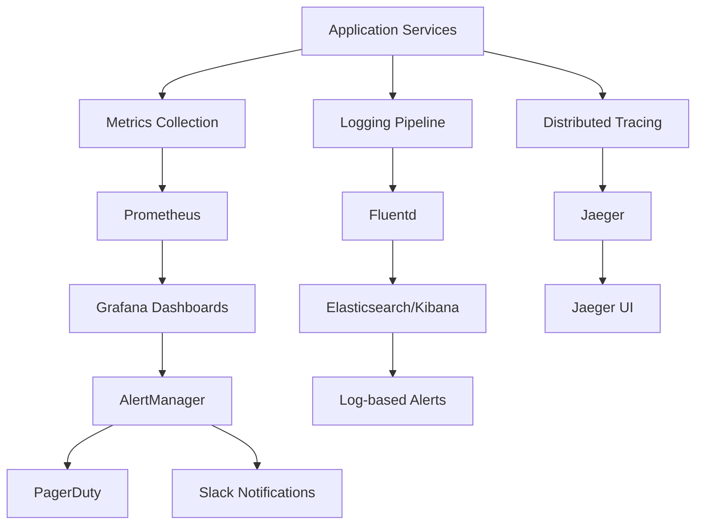

# Monitoring & Observability Architecture

## Architecture Overview

Tolstoy's monitoring and observability architecture provides comprehensive visibility into system health, performance, and user behavior through a multi-layered approach.



## Metrics Collection Architecture

### Prometheus Configuration

```yaml
# prometheus.yml
global:
  scrape_interval: 15s
  evaluation_interval: 15s
  external_labels:
    cluster: 'tolstoy-production'
    region: 'us-west-2'

rule_files:
  - "alerts/*.yml"
  - "recording_rules/*.yml"

scrape_configs:
  - job_name: 'tolstoy-api'
    kubernetes_sd_configs:
      - role: pod
        namespaces:
          names: ['tolstoy-production']
    relabel_configs:
      - source_labels: [__meta_kubernetes_pod_annotation_prometheus_io_scrape]
        action: keep
        regex: true
      - source_labels: [__meta_kubernetes_pod_annotation_prometheus_io_path]
        action: replace
        target_label: __metrics_path__
        regex: (.+)

  - job_name: 'workflow-engine'
    static_configs:
      - targets: ['workflow-engine:8080']
    metrics_path: '/metrics'
    scrape_interval: 5s

  - job_name: 'action-executor'
    kubernetes_sd_configs:
      - role: service
        namespaces:
          names: ['tolstoy-production']
    relabel_configs:
      - source_labels: [__meta_kubernetes_service_name]
        action: keep
        regex: action-executor.*
```

### Custom Metrics Implementation

```typescript
// metrics/collector.ts
import { register, Counter, Histogram, Gauge, Summary } from 'prom-client';

export class MetricsCollector {
  private workflowExecutions = new Counter({
    name: 'tolstoy_workflow_executions_total',
    help: 'Total number of workflow executions',
    labelNames: ['status', 'workflow_type', 'organization_id'],
    registers: [register]
  });

  private executionDuration = new Histogram({
    name: 'tolstoy_workflow_execution_duration_seconds',
    help: 'Workflow execution duration in seconds',
    labelNames: ['workflow_type', 'status'],
    buckets: [0.1, 0.5, 1, 5, 10, 30, 60, 120, 300],
    registers: [register]
  });

  private activeExecutions = new Gauge({
    name: 'tolstoy_active_executions',
    help: 'Number of currently active workflow executions',
    labelNames: ['workflow_type'],
    registers: [register]
  });

  private actionLatency = new Summary({
    name: 'tolstoy_action_latency_seconds',
    help: 'Action execution latency summary',
    labelNames: ['action_type', 'connection_type'],
    percentiles: [0.5, 0.9, 0.95, 0.99],
    registers: [register]
  });

  recordWorkflowExecution(
    status: 'success' | 'failed' | 'timeout',
    workflowType: string,
    organizationId: string,
    duration: number
  ) {
    this.workflowExecutions.inc({
      status,
      workflow_type: workflowType,
      organization_id: organizationId
    });

    this.executionDuration.observe({
      workflow_type: workflowType,
      status
    }, duration);
  }

  recordActionLatency(
    actionType: string,
    connectionType: string,
    latency: number
  ) {
    this.actionLatency.observe({
      action_type: actionType,
      connection_type: connectionType
    }, latency);
  }

  updateActiveExecutions(workflowType: string, delta: number) {
    this.activeExecutions.inc({ workflow_type: workflowType }, delta);
  }
}
```

## Distributed Tracing

### Jaeger Integration

```typescript
// tracing/tracer.ts
import { NodeSDK } from '@opentelemetry/sdk-node';
import { JaegerExporter } from '@opentelemetry/exporter-jaeger';
import { Resource } from '@opentelemetry/resources';
import { SemanticResourceAttributes } from '@opentelemetry/semantic-conventions';
import { trace, SpanKind, SpanStatusCode } from '@opentelemetry/api';

export class TracingService {
  private tracer = trace.getTracer('tolstoy-workflow-engine');

  async traceWorkflowExecution<T>(
    workflowId: string,
    operationName: string,
    operation: () => Promise<T>
  ): Promise<T> {
    const span = this.tracer.startSpan(`workflow.${operationName}`, {
      kind: SpanKind.SERVER,
      attributes: {
        'workflow.id': workflowId,
        'workflow.operation': operationName,
        'service.name': 'workflow-engine'
      }
    });

    try {
      span.addEvent('workflow.execution.started');
      const result = await operation();
      
      span.setStatus({ code: SpanStatusCode.OK });
      span.addEvent('workflow.execution.completed');
      
      return result;
    } catch (error) {
      span.setStatus({
        code: SpanStatusCode.ERROR,
        message: error.message
      });
      
      span.recordException(error);
      span.addEvent('workflow.execution.failed', {
        'error.message': error.message,
        'error.stack': error.stack
      });
      
      throw error;
    } finally {
      span.end();
    }
  }

  async traceActionExecution<T>(
    actionId: string,
    actionType: string,
    parentSpan: any,
    operation: () => Promise<T>
  ): Promise<T> {
    const span = this.tracer.startSpan(`action.${actionType}`, {
      kind: SpanKind.INTERNAL,
      parent: parentSpan,
      attributes: {
        'action.id': actionId,
        'action.type': actionType,
        'service.name': 'action-executor'
      }
    });

    try {
      const result = await operation();
      span.setStatus({ code: SpanStatusCode.OK });
      return result;
    } catch (error) {
      span.setStatus({
        code: SpanStatusCode.ERROR,
        message: error.message
      });
      span.recordException(error);
      throw error;
    } finally {
      span.end();
    }
  }
}
```

### Trace Context Propagation

```typescript
// tracing/context.ts
import { trace, context, propagation } from '@opentelemetry/api';

export class TraceContext {
  static inject(carrier: Record<string, string>): void {
    propagation.inject(context.active(), carrier);
  }

  static extract(carrier: Record<string, string>): void {
    const extractedContext = propagation.extract(context.active(), carrier);
    context.with(extractedContext, () => {
      // Extracted context is now active
    });
  }

  static withSpan<T>(name: string, fn: () => T): T {
    const span = trace.getActiveSpan();
    return trace.getTracer('tolstoy').startActiveSpan(name, (span) => {
      try {
        return fn();
      } finally {
        span.end();
      }
    });
  }
}
```

## Structured Logging

### Log Configuration

```typescript
// logging/logger.ts
import winston from 'winston';
import { ElasticsearchTransport } from 'winston-elasticsearch';

const esTransportOpts = {
  level: 'info',
  clientOpts: {
    node: process.env.ELASTICSEARCH_URL,
    auth: {
      username: process.env.ES_USERNAME,
      password: process.env.ES_PASSWORD
    }
  },
  index: 'tolstoy-logs',
  indexTemplate: {
    name: 'tolstoy-logs-template',
    pattern: 'tolstoy-logs-*',
    settings: {
      number_of_shards: 3,
      number_of_replicas: 1
    },
    mappings: {
      properties: {
        '@timestamp': { type: 'date' },
        level: { type: 'keyword' },
        message: { type: 'text' },
        service: { type: 'keyword' },
        workflow_id: { type: 'keyword' },
        execution_id: { type: 'keyword' },
        organization_id: { type: 'keyword' },
        trace_id: { type: 'keyword' },
        span_id: { type: 'keyword' }
      }
    }
  }
};

export const logger = winston.createLogger({
  level: process.env.LOG_LEVEL || 'info',
  format: winston.format.combine(
    winston.format.timestamp(),
    winston.format.errors({ stack: true }),
    winston.format.json(),
    winston.format.printf(({ timestamp, level, message, service, ...meta }) => {
      const traceInfo = trace.getActiveSpan()?.spanContext();
      return JSON.stringify({
        timestamp,
        level,
        message,
        service: service || 'tolstoy',
        trace_id: traceInfo?.traceId,
        span_id: traceInfo?.spanId,
        ...meta
      });
    })
  ),
  transports: [
    new winston.transports.Console(),
    new ElasticsearchTransport(esTransportOpts)
  ]
});

export class StructuredLogger {
  static workflowExecution(
    level: string,
    message: string,
    workflowId: string,
    executionId: string,
    organizationId: string,
    metadata?: Record<string, any>
  ) {
    logger.log(level, message, {
      service: 'workflow-engine',
      workflow_id: workflowId,
      execution_id: executionId,
      organization_id: organizationId,
      ...metadata
    });
  }

  static actionExecution(
    level: string,
    message: string,
    actionId: string,
    actionType: string,
    metadata?: Record<string, any>
  ) {
    logger.log(level, message, {
      service: 'action-executor',
      action_id: actionId,
      action_type: actionType,
      ...metadata
    });
  }

  static apiRequest(
    level: string,
    message: string,
    method: string,
    path: string,
    statusCode: number,
    responseTime: number,
    userId?: string
  ) {
    logger.log(level, message, {
      service: 'api-gateway',
      http_method: method,
      http_path: path,
      http_status_code: statusCode,
      response_time_ms: responseTime,
      user_id: userId
    });
  }
}
```

## Alerting System

### Alert Rules Configuration

```yaml
# alerts/workflow-alerts.yml
groups:
  - name: workflow-health
    rules:
      - alert: WorkflowExecutionFailureRate
        expr: |
          (
            rate(tolstoy_workflow_executions_total{status="failed"}[5m]) /
            rate(tolstoy_workflow_executions_total[5m])
          ) * 100 > 5
        for: 2m
        labels:
          severity: warning
          service: workflow-engine
        annotations:
          summary: "High workflow execution failure rate"
          description: "Workflow execution failure rate is {{ $value }}% over the last 5 minutes"

      - alert: WorkflowExecutionLatency
        expr: |
          histogram_quantile(0.95,
            rate(tolstoy_workflow_execution_duration_seconds_bucket[5m])
          ) > 30
        for: 5m
        labels:
          severity: critical
          service: workflow-engine
        annotations:
          summary: "High workflow execution latency"
          description: "95th percentile workflow execution time is {{ $value }}s"

      - alert: WorkflowEngineDown
        expr: up{job="workflow-engine"} == 0
        for: 1m
        labels:
          severity: critical
          service: workflow-engine
        annotations:
          summary: "Workflow engine is down"
          description: "Workflow engine has been down for more than 1 minute"

  - name: action-executor-health
    rules:
      - alert: ActionExecutorHighErrorRate
        expr: |
          (
            rate(tolstoy_action_executions_total{status="error"}[10m]) /
            rate(tolstoy_action_executions_total[10m])
          ) * 100 > 10
        for: 5m
        labels:
          severity: warning
          service: action-executor
        annotations:
          summary: "High action execution error rate"
          description: "Action execution error rate is {{ $value }}% for {{ $labels.action_type }}"

      - alert: ConnectionPoolExhaustion
        expr: |
          tolstoy_connection_pool_active_connections /
          tolstoy_connection_pool_max_connections > 0.9
        for: 3m
        labels:
          severity: warning
          service: action-executor
        annotations:
          summary: "Connection pool near exhaustion"
          description: "Connection pool for {{ $labels.connection_type }} is {{ $value | humanizePercentage }} full"
```

### AlertManager Configuration

```yaml
# alertmanager.yml
global:
  smtp_smarthost: 'smtp.gmail.com:587'
  smtp_from: 'alerts@tolstoy.io'

route:
  group_by: ['alertname', 'service']
  group_wait: 10s
  group_interval: 10s
  repeat_interval: 12h
  receiver: 'web.hook'
  routes:
    - match:
        severity: critical
      receiver: 'critical-alerts'
      group_wait: 0s
      repeat_interval: 5m
    - match:
        severity: warning
      receiver: 'warning-alerts'
      repeat_interval: 1h

receivers:
  - name: 'critical-alerts'
    pagerduty_configs:
      - service_key: 'YOUR_PAGERDUTY_SERVICE_KEY'
        description: '{{ range .Alerts }}{{ .Annotations.summary }}{{ end }}'
    slack_configs:
      - api_url: 'YOUR_SLACK_WEBHOOK_URL'
        channel: '#critical-alerts'
        title: 'Critical Alert: {{ .GroupLabels.alertname }}'
        text: '{{ range .Alerts }}{{ .Annotations.description }}{{ end }}'

  - name: 'warning-alerts'
    slack_configs:
      - api_url: 'YOUR_SLACK_WEBHOOK_URL'
        channel: '#alerts'
        title: 'Warning: {{ .GroupLabels.alertname }}'
        text: '{{ range .Alerts }}{{ .Annotations.description }}{{ end }}'

  - name: 'web.hook'
    webhook_configs:
      - url: 'http://tolstoy-alert-processor:8080/webhook'
```

## Dashboard Configuration

### Grafana Dashboard JSON

```json
{
  "dashboard": {
    "title": "Tolstoy Workflow Engine",
    "panels": [
      {
        "title": "Workflow Execution Rate",
        "type": "graph",
        "targets": [
          {
            "expr": "rate(tolstoy_workflow_executions_total[5m])",
            "legendFormat": "{{ status }} - {{ workflow_type }}"
          }
        ],
        "yAxes": [
          {
            "label": "Executions/sec"
          }
        ]
      },
      {
        "title": "Execution Duration Percentiles",
        "type": "graph",
        "targets": [
          {
            "expr": "histogram_quantile(0.50, rate(tolstoy_workflow_execution_duration_seconds_bucket[5m]))",
            "legendFormat": "50th percentile"
          },
          {
            "expr": "histogram_quantile(0.95, rate(tolstoy_workflow_execution_duration_seconds_bucket[5m]))",
            "legendFormat": "95th percentile"
          },
          {
            "expr": "histogram_quantile(0.99, rate(tolstoy_workflow_execution_duration_seconds_bucket[5m]))",
            "legendFormat": "99th percentile"
          }
        ]
      },
      {
        "title": "Active Executions",
        "type": "singlestat",
        "targets": [
          {
            "expr": "sum(tolstoy_active_executions)",
            "legendFormat": "Active Executions"
          }
        ]
      },
      {
        "title": "Action Latency Heatmap",
        "type": "heatmap",
        "targets": [
          {
            "expr": "rate(tolstoy_action_latency_seconds_bucket[5m])",
            "format": "heatmap"
          }
        ]
      }
    ]
  }
}
```

## Health Check Implementation

```typescript
// health/health-check.ts
import { Express } from 'express';

interface HealthCheckResult {
  status: 'healthy' | 'unhealthy' | 'degraded';
  timestamp: string;
  uptime: number;
  dependencies: {
    [key: string]: {
      status: 'healthy' | 'unhealthy';
      responseTime?: number;
      error?: string;
    };
  };
}

export class HealthCheckService {
  private dependencies = new Map<string, () => Promise<boolean>>();

  constructor() {
    this.registerDependency('database', this.checkDatabase);
    this.registerDependency('redis', this.checkRedis);
    this.registerDependency('workflow-engine', this.checkWorkflowEngine);
  }

  registerDependency(name: string, checker: () => Promise<boolean>) {
    this.dependencies.set(name, checker);
  }

  async performHealthCheck(): Promise<HealthCheckResult> {
    const timestamp = new Date().toISOString();
    const uptime = process.uptime();
    const dependencies: HealthCheckResult['dependencies'] = {};

    let overallStatus: 'healthy' | 'unhealthy' | 'degraded' = 'healthy';
    let unhealthyCount = 0;

    for (const [name, checker] of this.dependencies) {
      const startTime = Date.now();
      try {
        const isHealthy = await Promise.race([
          checker(),
          new Promise<boolean>((_, reject) => 
            setTimeout(() => reject(new Error('Timeout')), 5000)
          )
        ]);

        dependencies[name] = {
          status: isHealthy ? 'healthy' : 'unhealthy',
          responseTime: Date.now() - startTime
        };

        if (!isHealthy) unhealthyCount++;
      } catch (error) {
        dependencies[name] = {
          status: 'unhealthy',
          responseTime: Date.now() - startTime,
          error: error.message
        };
        unhealthyCount++;
      }
    }

    if (unhealthyCount === 0) {
      overallStatus = 'healthy';
    } else if (unhealthyCount < this.dependencies.size) {
      overallStatus = 'degraded';
    } else {
      overallStatus = 'unhealthy';
    }

    return {
      status: overallStatus,
      timestamp,
      uptime,
      dependencies
    };
  }

  private async checkDatabase(): Promise<boolean> {
    // Database health check implementation
    return true;
  }

  private async checkRedis(): Promise<boolean> {
    // Redis health check implementation
    return true;
  }

  private async checkWorkflowEngine(): Promise<boolean> {
    // Workflow engine health check implementation
    return true;
  }

  setupHealthEndpoints(app: Express) {
    app.get('/health', async (req, res) => {
      const result = await this.performHealthCheck();
      const statusCode = result.status === 'healthy' ? 200 : 503;
      res.status(statusCode).json(result);
    });

    app.get('/ready', async (req, res) => {
      const result = await this.performHealthCheck();
      const isReady = result.status !== 'unhealthy';
      res.status(isReady ? 200 : 503).json({ ready: isReady });
    });
  }
}
```

## Performance Monitoring

### Database Query Monitoring

```typescript
// monitoring/database-monitor.ts
import { performance } from 'perf_hooks';

export class DatabaseMonitor {
  private queryMetrics = new Map<string, {
    count: number;
    totalTime: number;
    maxTime: number;
    minTime: number;
  }>();

  monitorQuery<T>(
    queryName: string,
    query: () => Promise<T>
  ): Promise<T> {
    const startTime = performance.now();
    
    return query().finally(() => {
      const duration = performance.now() - startTime;
      this.recordQueryMetric(queryName, duration);
    });
  }

  private recordQueryMetric(queryName: string, duration: number) {
    const existing = this.queryMetrics.get(queryName) || {
      count: 0,
      totalTime: 0,
      maxTime: 0,
      minTime: Infinity
    };

    existing.count++;
    existing.totalTime += duration;
    existing.maxTime = Math.max(existing.maxTime, duration);
    existing.minTime = Math.min(existing.minTime, duration);

    this.queryMetrics.set(queryName, existing);

    // Log slow queries
    if (duration > 1000) {
      logger.warn('Slow database query detected', {
        query_name: queryName,
        duration_ms: duration,
        service: 'database-monitor'
      });
    }
  }

  getQueryMetrics() {
    const metrics: Record<string, any> = {};
    
    for (const [queryName, stats] of this.queryMetrics) {
      metrics[queryName] = {
        ...stats,
        avgTime: stats.totalTime / stats.count
      };
    }
    
    return metrics;
  }
}
```

This monitoring and observability architecture provides comprehensive visibility into system health, performance bottlenecks, and operational insights across all components of the Tolstoy platform.