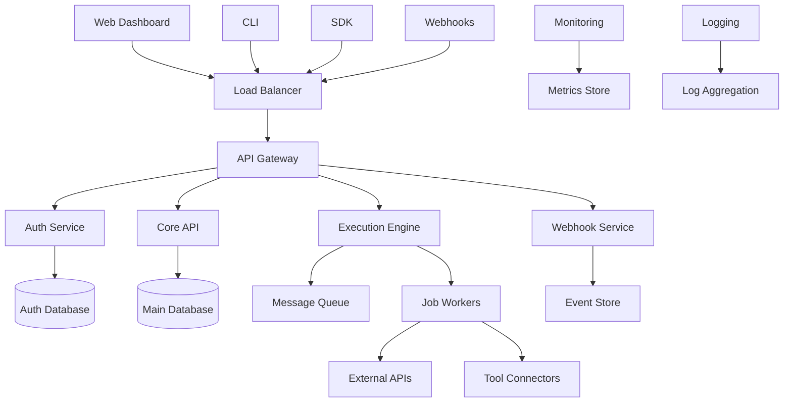

# Tolstoy Architecture Overview

This document provides a comprehensive overview of the Tolstoy platform architecture, including system components, data flow, and key design decisions.

<Warning>
This is internal documentation intended for the development team. Do not share outside the organization.
</Warning>

## System Architecture

The Tolstoy platform follows a microservices architecture with clear separation of concerns:



## Core Components

### 1. API Gateway

**Technology:** Kong / AWS API Gateway  
**Responsibility:** Request routing, rate limiting, authentication

```yaml
# Kong Configuration
services:
  - name: tolstoy-api
    url: http://core-api:3000
    
plugins:
  - name: rate-limiting
    config:
      minute: 100
      hour: 1000
  - name: cors
  - name: request-transformer
```

**Key Features:**
- Rate limiting per organization/user
- Request/response transformation
- SSL termination
- CORS handling
- Request logging and metrics

### 2. Authentication Service

**Technology:** Node.js + Passport.js  
**Database:** PostgreSQL  
**Caching:** Redis

```typescript
// Auth Service Structure
interface AuthService {
  login(credentials: LoginRequest): Promise<AuthToken>;
  validateToken(token: string): Promise<User>;
  refreshToken(refreshToken: string): Promise<AuthToken>;
  revokeToken(token: string): Promise<void>;
}

// Token Structure
interface AuthToken {
  accessToken: string;
  refreshToken: string;
  expiresIn: number;
  tokenType: 'Bearer';
  scope: string[];
}
```

**Authentication Flow:**
1. User provides credentials
2. Service validates against database
3. JWT token generated with organization context
4. Token cached in Redis for quick validation
5. Client includes token in subsequent requests

### 3. Core API

**Technology:** Node.js + Express.js + TypeScript  
**Database:** PostgreSQL  
**ORM:** Prisma

```typescript
// Core API Structure
interface CoreAPI {
  organizations: OrganizationController;
  users: UserController;
  tools: ToolController;
  actions: ActionController;
  flows: FlowController;
  webhooks: WebhookController;
}

// Database Schema (Prisma)
model Organization {
  id        String   @id @default(cuid())
  name      String
  domain    String?
  createdAt DateTime @default(now())
  updatedAt DateTime @updatedAt
  
  users     User[]
  tools     Tool[]
  actions   Action[]
  flows     Flow[]
}

model Tool {
  id           String  @id @default(cuid())
  name         String
  baseUrl      String
  authType     String
  authConfig   Json
  organization Organization @relation(fields: [orgId], references: [id])
  orgId        String
  
  actions      Action[]
  secrets      ToolSecret[]
}
```

### 4. Execution Engine

**Technology:** Node.js + Bull Queue  
**Message Queue:** Redis  
**Worker Scaling:** Kubernetes HPA

```typescript
// Execution Engine Components
interface ExecutionEngine {
  jobQueue: JobQueue;
  workers: WorkerManager;
  scheduler: JobScheduler;
  monitor: ExecutionMonitor;
}

// Job Types
type JobType = 
  | 'execute_action'
  | 'execute_flow' 
  | 'webhook_delivery'
  | 'scheduled_execution';

// Job Structure
interface ExecutionJob {
  id: string;
  type: JobType;
  organizationId: string;
  userId: string;
  payload: Record<string, any>;
  priority: number;
  delay?: number;
  attempts: number;
  backoff: BackoffStrategy;
}
```

**Execution Flow:**
1. Client requests execution via API
2. Core API validates request and permissions
3. Job created in message queue
4. Worker picks up job
5. Worker makes external API calls
6. Results stored and notifications sent
7. Cleanup and logging

### 5. Data Layer

**Primary Database:** PostgreSQL 14+  
**Caching:** Redis 6+  
**File Storage:** AWS S3 / MinIO

```sql
-- Key Database Tables
CREATE TABLE organizations (
  id UUID PRIMARY KEY DEFAULT gen_random_uuid(),
  name VARCHAR(255) NOT NULL,
  domain VARCHAR(255),
  settings JSONB DEFAULT '{}',
  created_at TIMESTAMP DEFAULT NOW(),
  updated_at TIMESTAMP DEFAULT NOW()
);

CREATE TABLE tools (
  id UUID PRIMARY KEY DEFAULT gen_random_uuid(),
  org_id UUID REFERENCES organizations(id),
  name VARCHAR(255) NOT NULL,
  base_url TEXT NOT NULL,
  auth_type VARCHAR(50) NOT NULL,
  auth_config JSONB DEFAULT '{}',
  status VARCHAR(20) DEFAULT 'active',
  created_at TIMESTAMP DEFAULT NOW()
);

CREATE TABLE actions (
  id UUID PRIMARY KEY DEFAULT gen_random_uuid(),
  org_id UUID REFERENCES organizations(id),
  tool_id UUID REFERENCES tools(id),
  name VARCHAR(255) NOT NULL,
  key VARCHAR(255) NOT NULL,
  method VARCHAR(10) NOT NULL,
  endpoint TEXT NOT NULL,
  input_schema JSONB DEFAULT '[]',
  execute_if JSONB,
  version INTEGER DEFAULT 1,
  status VARCHAR(20) DEFAULT 'active',
  created_at TIMESTAMP DEFAULT NOW()
);
```

**Data Partitioning:**
- Organizations are isolated at the application level
- Execution logs partitioned by date (monthly)
- Large JSON payloads stored in object storage

## Security Architecture

### 1. Authentication & Authorization

```typescript
// Role-Based Access Control
interface Permission {
  resource: string;  // 'actions', 'tools', 'flows'
  action: string;    // 'create', 'read', 'update', 'delete'
  scope?: string;    // Optional resource-specific scope
}

interface Role {
  name: string;
  permissions: Permission[];
}

const roles: Record<string, Role> = {
  admin: {
    name: 'Administrator',
    permissions: [
      { resource: '*', action: '*' }  // Full access
    ]
  },
  member: {
    name: 'Member', 
    permissions: [
      { resource: 'actions', action: '*' },
      { resource: 'tools', action: 'read' },
      { resource: 'flows', action: '*' }
    ]
  },
  viewer: {
    name: 'Viewer',
    permissions: [
      { resource: '*', action: 'read' }
    ]
  }
};
```

### 2. Secret Management

```typescript
// Secret Encryption
interface SecretManager {
  encryptSecret(value: string, orgId: string): Promise<string>;
  decryptSecret(encryptedValue: string, orgId: string): Promise<string>;
  rotateKey(orgId: string): Promise<void>;
}

// Implementation
class KMSSecretManager implements SecretManager {
  async encryptSecret(value: string, orgId: string): Promise<string> {
    const key = await this.getOrgEncryptionKey(orgId);
    return encrypt(value, key);
  }
  
  private async getOrgEncryptionKey(orgId: string): Promise<string> {
    // Each organization has its own encryption key
    return await kms.getKey(`tolstoy-org-${orgId}`);
  }
}
```

### 3. Network Security

```yaml
# Network Policies
apiVersion: networking.k8s.io/v1
kind: NetworkPolicy
metadata:
  name: tolstoy-api-policy
spec:
  podSelector:
    matchLabels:
      app: tolstoy-api
  policyTypes:
  - Ingress
  - Egress
  ingress:
  - from:
    - podSelector:
        matchLabels:
          app: api-gateway
    ports:
    - protocol: TCP
      port: 3000
  egress:
  - to:
    - podSelector:
        matchLabels:
          app: postgresql
    ports:
    - protocol: TCP
      port: 5432
```

## Scalability & Performance

### 1. Horizontal Scaling

```yaml
# Kubernetes Deployment
apiVersion: apps/v1
kind: Deployment
metadata:
  name: tolstoy-api
spec:
  replicas: 3
  selector:
    matchLabels:
      app: tolstoy-api
  template:
    spec:
      containers:
      - name: api
        image: tolstoy/api:latest
        resources:
          requests:
            memory: "256Mi"
            cpu: "250m"
          limits:
            memory: "512Mi"
            cpu: "500m"

---
apiVersion: autoscaling/v2
kind: HorizontalPodAutoscaler
metadata:
  name: tolstoy-api-hpa
spec:
  scaleTargetRef:
    apiVersion: apps/v1
    kind: Deployment
    name: tolstoy-api
  minReplicas: 3
  maxReplicas: 20
  metrics:
  - type: Resource
    resource:
      name: cpu
      target:
        type: Utilization
        averageUtilization: 70
```

### 2. Caching Strategy

```typescript
// Multi-layer Caching
interface CacheManager {
  // L1: In-memory cache (per instance)
  memoryCache: LRUCache;
  
  // L2: Shared cache (Redis)
  redisCache: RedisClient;
  
  // L3: Database
  database: DatabaseClient;
}

class CachedService {
  async getAction(id: string): Promise<Action> {
    // Try memory cache first
    let action = this.memoryCache.get(`action:${id}`);
    if (action) return action;
    
    // Try Redis cache
    action = await this.redisCache.get(`action:${id}`);
    if (action) {
      this.memoryCache.set(`action:${id}`, action);
      return action;
    }
    
    // Fallback to database
    action = await this.database.actions.findUnique({ where: { id } });
    if (action) {
      this.redisCache.setex(`action:${id}`, 300, action);
      this.memoryCache.set(`action:${id}`, action);
    }
    
    return action;
  }
}
```

### 3. Database Optimization

```sql
-- Performance Indexes
CREATE INDEX CONCURRENTLY idx_actions_org_status 
ON actions (org_id, status) 
WHERE status = 'active';

CREATE INDEX CONCURRENTLY idx_executions_timestamp 
ON executions (created_at DESC) 
WHERE created_at > NOW() - INTERVAL '30 days';

-- Partitioning for execution logs
CREATE TABLE executions (
  id UUID NOT NULL,
  action_id UUID NOT NULL,
  org_id UUID NOT NULL,
  status VARCHAR(20) NOT NULL,
  created_at TIMESTAMP NOT NULL,
  -- Other columns...
) PARTITION BY RANGE (created_at);

-- Monthly partitions
CREATE TABLE executions_2024_01 PARTITION OF executions
FOR VALUES FROM ('2024-01-01') TO ('2024-02-01');

CREATE TABLE executions_2024_02 PARTITION OF executions  
FOR VALUES FROM ('2024-02-01') TO ('2024-03-01');
```

## Monitoring & Observability

### 1. Metrics Collection

```typescript
// Prometheus Metrics
import { register, Counter, Histogram, Gauge } from 'prom-client';

const httpRequestDuration = new Histogram({
  name: 'http_request_duration_seconds',
  help: 'HTTP request duration in seconds',
  labelNames: ['method', 'route', 'status'],
  buckets: [0.1, 0.3, 0.5, 0.7, 1, 3, 5, 7, 10]
});

const actionExecutions = new Counter({
  name: 'action_executions_total',
  help: 'Total number of action executions',
  labelNames: ['org_id', 'action_id', 'status']
});

const queueSize = new Gauge({
  name: 'job_queue_size',
  help: 'Current number of jobs in queue',
  labelNames: ['queue_name']
});
```

### 2. Distributed Tracing

```typescript
// OpenTelemetry Setup
import { NodeTracerProvider } from '@opentelemetry/sdk-node';
import { Resource } from '@opentelemetry/resources';
import { SemanticResourceAttributes } from '@opentelemetry/semantic-conventions';

const tracerProvider = new NodeTracerProvider({
  resource: new Resource({
    [SemanticResourceAttributes.SERVICE_NAME]: 'tolstoy-api',
    [SemanticResourceAttributes.SERVICE_VERSION]: process.env.APP_VERSION,
  }),
});

// Trace execution flows
const tracer = tracerProvider.getTracer('tolstoy-execution');

async function executeAction(actionId: string, input: any): Promise<any> {
  const span = tracer.startSpan('execute_action', {
    attributes: {
      'action.id': actionId,
      'action.input_size': JSON.stringify(input).length
    }
  });
  
  try {
    const result = await performExecution(actionId, input);
    span.setAttributes({
      'action.status': result.status,
      'action.duration_ms': result.duration
    });
    return result;
  } catch (error) {
    span.recordException(error);
    span.setStatus({ code: SpanStatusCode.ERROR });
    throw error;
  } finally {
    span.end();
  }
}
```

### 3. Health Checks

```typescript
// Health Check Endpoints
interface HealthCheck {
  name: string;
  status: 'healthy' | 'degraded' | 'unhealthy';
  latency?: number;
  details?: any;
}

class HealthService {
  async getHealthStatus(): Promise<HealthCheck[]> {
    return await Promise.all([
      this.checkDatabase(),
      this.checkRedis(),
      this.checkQueue(),
      this.checkExternalAPIs()
    ]);
  }
  
  private async checkDatabase(): Promise<HealthCheck> {
    const start = Date.now();
    try {
      await this.db.$queryRaw`SELECT 1`;
      return {
        name: 'database',
        status: 'healthy',
        latency: Date.now() - start
      };
    } catch (error) {
      return {
        name: 'database',
        status: 'unhealthy',
        details: error.message
      };
    }
  }
}
```

## Deployment Architecture

### 1. Kubernetes Cluster

```yaml
# Cluster Structure
namespaces:
  - tolstoy-prod
  - tolstoy-staging
  - tolstoy-dev

services:
  api-gateway:
    replicas: 3
    resources:
      cpu: 500m
      memory: 1Gi
      
  core-api:
    replicas: 5
    resources:
      cpu: 1000m
      memory: 2Gi
      
  execution-workers:
    replicas: 10
    resources:
      cpu: 500m
      memory: 1Gi
      
  webhook-service:
    replicas: 2
    resources:
      cpu: 250m
      memory: 512Mi
```

### 2. CI/CD Pipeline

```yaml
# GitHub Actions Workflow
name: Deploy to Production
on:
  push:
    branches: [main]
    
jobs:
  test:
    runs-on: ubuntu-latest
    steps:
      - uses: actions/checkout@v2
      - name: Run Tests
        run: |
          npm test
          npm run test:integration
          
  build:
    needs: test
    runs-on: ubuntu-latest
    steps:
      - name: Build Docker Image
        run: |
          docker build -t tolstoy/api:${{ github.sha }} .
          docker push tolstoy/api:${{ github.sha }}
          
  deploy:
    needs: build
    runs-on: ubuntu-latest
    steps:
      - name: Deploy to Kubernetes
        run: |
          kubectl set image deployment/tolstoy-api \
            api=tolstoy/api:${{ github.sha }} \
            --namespace tolstoy-prod
          kubectl rollout status deployment/tolstoy-api
```

## Next Steps

<CardGroup cols={2}>
  <Card title="Development Guidelines" icon="code" href="/internal/development/guidelines/coding-standards">
    Development standards and guidelines
  </Card>
  <Card title="System Design" icon="server" href="/internal/architecture/system-design">
    Detailed system architecture guide
  </Card>
  <Card title="Data Layer" icon="database" href="/internal/architecture/data-layer">
    Database schema and data access patterns
  </Card>
  <Card title="Production Deployment" icon="rocket" href="/internal/infrastructure/deployment/production-deployment">
    Production deployment procedures
  </Card>
</CardGroup>

---

<Note>
This architecture overview is a living document. Update it as the system evolves and new components are added.
</Note>