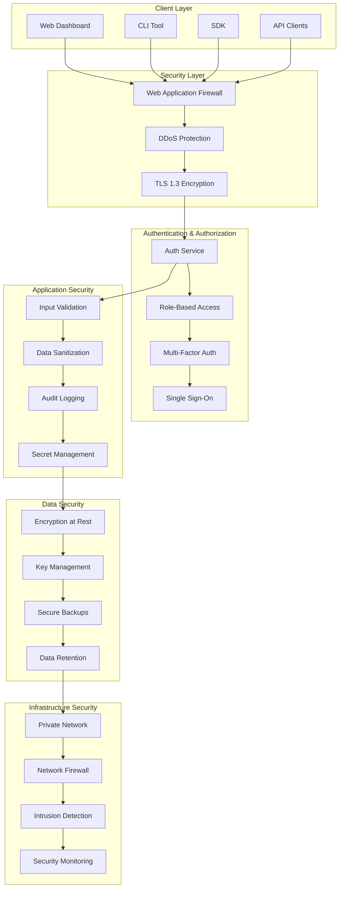
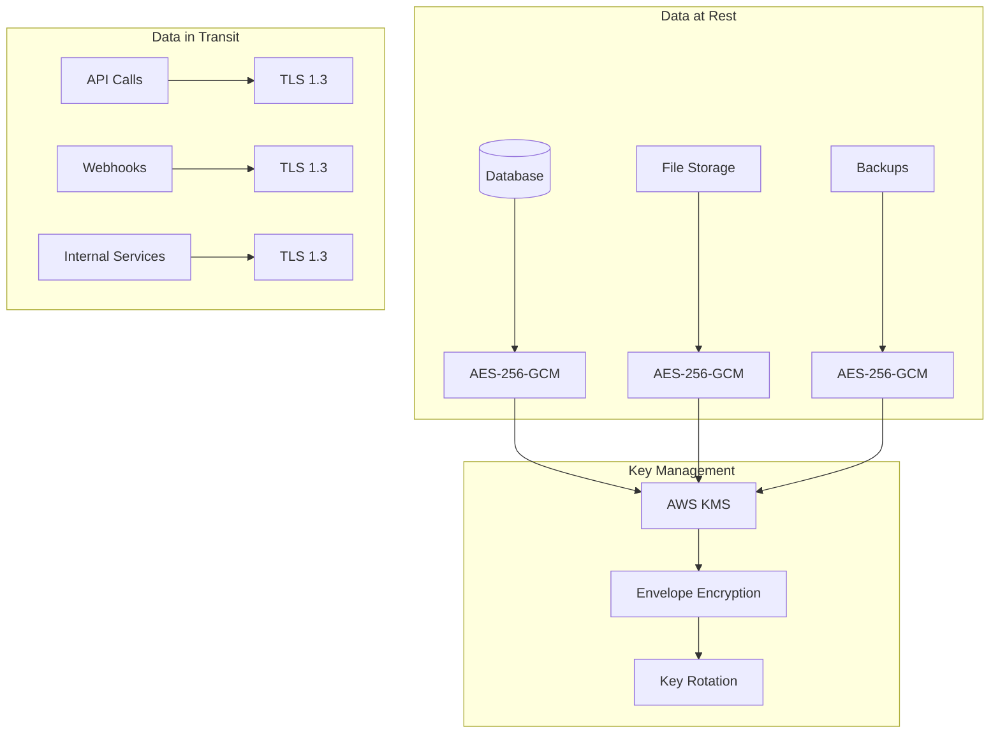

# Security Architecture

Tolstoy implements enterprise-grade security measures to protect your data, workflows, and integrations. This document outlines our security architecture, compliance standards, and best practices.

## Security Overview



## Compliance Standards

<CardGroup cols={2}>
  <Card title="SOC 2 Type II" icon="shield-check">
    Annual compliance audit for security controls
  </Card>
  <Card title="GDPR Compliant" icon="gavel">
    European data protection regulation compliance
  </Card>
  <Card title="CCPA Compliant" icon="scale-balanced">
    California consumer privacy act compliance
  </Card>
  <Card title="ISO 27001" icon="certificate">
    Information security management standard
  </Card>
</CardGroup>

## Authentication & Authorization

### Multi-Layered Authentication

<Tabs>
  <Tab title="API Key Authentication">
    **Implementation:**
    ```typescript
    interface APIKey {
      id: string;
      organizationId: string;
      keyHash: string;  // SHA-256 hashed
      permissions: string[];
      ipWhitelist?: string[];
      expiresAt?: Date;
      lastUsed: Date;
      revokedAt?: Date;
    }
    
    class APIKeyManager {
      async validateKey(key: string, request: Request): Promise<AuthContext> {
        // Hash the provided key
        const keyHash = crypto.createHash('sha256').update(key).digest('hex');
        
        // Look up key in database
        const apiKey = await this.db.apiKeys.findByHash(keyHash);
        if (!apiKey || apiKey.revokedAt) {
          throw new UnauthorizedError('Invalid API key');
        }
        
        // Check expiration
        if (apiKey.expiresAt && apiKey.expiresAt < new Date()) {
          throw new UnauthorizedError('API key expired');
        }
        
        // Check IP whitelist
        if (apiKey.ipWhitelist && !this.isIPAllowed(request.ip, apiKey.ipWhitelist)) {
          throw new ForbiddenError('IP not whitelisted');
        }
        
        // Update last used timestamp
        await this.updateLastUsed(apiKey.id);
        
        return {
          organizationId: apiKey.organizationId,
          permissions: apiKey.permissions,
          keyId: apiKey.id
        };
      }
    }
    ```
    
    **Security Features:**
    - SHA-256 hashed storage (keys never stored in plaintext)
    - IP address whitelisting
    - Expiration dates
    - Usage tracking
    - Instant revocation
  </Tab>
  
  <Tab title="OAuth 2.0 + OIDC">
    **Implementation:**
    ```typescript
    class OAuthProvider {
      async handleAuthorizationCode(code: string, redirectUri: string): Promise<TokenSet> {
        // Validate authorization code
        const authGrant = await this.validateAuthCode(code, redirectUri);
        
        // Generate tokens
        const accessToken = await this.generateAccessToken({
          organizationId: authGrant.organizationId,
          userId: authGrant.userId,
          scopes: authGrant.scopes,
          expiresIn: 3600  // 1 hour
        });
        
        const refreshToken = await this.generateRefreshToken({
          organizationId: authGrant.organizationId,
          userId: authGrant.userId,
          expiresIn: 86400 * 30  // 30 days
        });
        
        const idToken = await this.generateIDToken({
          userId: authGrant.userId,
          organizationId: authGrant.organizationId,
          audience: authGrant.clientId
        });
        
        return {
          accessToken,
          refreshToken,
          idToken,
          tokenType: 'Bearer',
          expiresIn: 3600
        };
      }
      
      async generateAccessToken(payload: TokenPayload): Promise<string> {
        return jwt.sign(payload, this.getSigningKey(), {
          algorithm: 'RS256',
          issuer: 'https://api.tolstoy.com',
          audience: 'tolstoy-api',
          expiresIn: payload.expiresIn
        });
      }
    }
    ```
    
    **Security Features:**
    - PKCE (Proof Key for Code Exchange) support
    - Short-lived access tokens (1 hour)
    - Secure refresh token rotation
    - Scoped permissions
    - OpenID Connect identity verification
  </Tab>
  
  <Tab title="Multi-Factor Authentication">
    **Implementation:**
    ```typescript
    class MFAManager {
      async enableMFA(userId: string, method: 'totp' | 'sms'): Promise<MFASetup> {
        switch (method) {
          case 'totp':
            return this.setupTOTP(userId);
          case 'sms':
            return this.setupSMS(userId);
          default:
            throw new Error('Unsupported MFA method');
        }
      }
      
      async setupTOTP(userId: string): Promise<TOTPSetup> {
        const secret = speakeasy.generateSecret({
          name: `Tolstoy (${userId})`,
          issuer: 'Tolstoy',
          length: 32
        });
        
        // Store encrypted secret
        await this.storeMFASecret(userId, 'totp', {
          secret: await this.encrypt(secret.base32),
          backupCodes: await this.generateBackupCodes()
        });
        
        return {
          qrCode: secret.otpauth_url,
          manualEntryKey: secret.base32,
          backupCodes: secret.backupCodes
        };
      }
      
      async verifyMFA(userId: string, token: string): Promise<boolean> {
        const mfaConfig = await this.getMFAConfig(userId);
        
        switch (mfaConfig.method) {
          case 'totp':
            return this.verifyTOTP(mfaConfig.secret, token);
          case 'sms':
            return this.verifySMS(userId, token);
          default:
            return false;
        }
      }
    }
    ```
    
    **Supported Methods:**
    - TOTP (Google Authenticator, Authy)
    - SMS verification
    - Hardware security keys (FIDO2/WebAuthn)
    - Backup codes
  </Tab>
  
  <Tab title="Single Sign-On">
    **SAML 2.0 Implementation:**
    ```typescript
    class SAMLProvider {
      async handleSAMLResponse(response: string, relayState?: string): Promise<AuthResult> {
        // Parse and validate SAML response
        const samlResponse = await this.parseSAMLResponse(response);
        
        // Verify signature
        if (!this.verifySignature(samlResponse)) {
          throw new SecurityError('Invalid SAML signature');
        }
        
        // Check assertion validity
        if (this.isExpired(samlResponse.assertion)) {
          throw new SecurityError('SAML assertion expired');
        }
        
        // Extract user attributes
        const userAttributes = this.extractAttributes(samlResponse.assertion);
        
        // Find or create user
        const user = await this.findOrCreateUser({
          email: userAttributes.email,
          name: userAttributes.displayName,
          organizationId: this.getOrgFromDomain(userAttributes.email)
        });
        
        // Generate session
        const session = await this.createSession(user.id);
        
        return {
          user,
          session,
          redirectUrl: relayState || '/dashboard'
        };
      }
    }
    ```
    
    **Supported Providers:**
    - Active Directory Federation Services (ADFS)
    - Azure AD
    - Okta
    - OneLogin
    - Google Workspace
    - Custom SAML 2.0 providers
  </Tab>
</Tabs>

### Role-Based Access Control

```typescript
// Permission System
interface Permission {
  resource: string;     // 'flows', 'actions', 'tools', 'users'
  action: string;       // 'create', 'read', 'update', 'delete', 'execute'
  scope?: string;       // Optional resource-specific scope
  conditions?: Record<string, any>;  // Conditional access
}

interface Role {
  id: string;
  name: string;
  description: string;
  permissions: Permission[];
  organizationId: string;
}

// Built-in Roles
const BUILT_IN_ROLES: Record<string, Role> = {
  'org_admin': {
    id: 'org_admin',
    name: 'Organization Administrator',
    description: 'Full access to all organization resources',
    permissions: [{ resource: '*', action: '*' }],
    organizationId: '*'
  },
  
  'developer': {
    id: 'developer',
    name: 'Developer',
    description: 'Can create and manage workflows and integrations',
    permissions: [
      { resource: 'flows', action: '*' },
      { resource: 'actions', action: '*' },
      { resource: 'tools', action: 'read' },
      { resource: 'tools', action: 'connect' },
      { resource: 'executions', action: 'read' }
    ],
    organizationId: '*'
  },
  
  'operator': {
    id: 'operator',
    name: 'Operator',
    description: 'Can execute workflows and view results',
    permissions: [
      { resource: 'flows', action: 'read' },
      { resource: 'flows', action: 'execute' },
      { resource: 'actions', action: 'read' },
      { resource: 'actions', action: 'execute' },
      { resource: 'executions', action: 'read' }
    ],
    organizationId: '*'
  },
  
  'viewer': {
    id: 'viewer',
    name: 'Viewer',
    description: 'Read-only access to workflows and results',
    permissions: [
      { resource: 'flows', action: 'read' },
      { resource: 'actions', action: 'read' },
      { resource: 'executions', action: 'read' }
    ],
    organizationId: '*'
  }
};

// Permission Checker
class PermissionManager {
  async checkPermission(
    userId: string,
    organizationId: string,
    resource: string,
    action: string,
    resourceId?: string
  ): Promise<boolean> {
    const userRoles = await this.getUserRoles(userId, organizationId);
    const permissions = this.aggregatePermissions(userRoles);
    
    return permissions.some(permission => 
      this.matchesPermission(permission, resource, action, resourceId)
    );
  }
  
  private matchesPermission(
    permission: Permission,
    resource: string,
    action: string,
    resourceId?: string
  ): boolean {
    // Check resource match
    if (permission.resource !== '*' && permission.resource !== resource) {
      return false;
    }
    
    // Check action match
    if (permission.action !== '*' && permission.action !== action) {
      return false;
    }
    
    // Check conditions (if any)
    if (permission.conditions) {
      return this.evaluateConditions(permission.conditions, {
        resource,
        action,
        resourceId
      });
    }
    
    return true;
  }
}
```

## Data Security

### Encryption Architecture



### Encryption Implementation

```typescript
class EncryptionService {
  private kmsClient: AWS.KMS;
  
  constructor() {
    this.kmsClient = new AWS.KMS({
      region: process.env.AWS_REGION
    });
  }
  
  // Encrypt sensitive data using envelope encryption
  async encryptData(plaintext: string, context: EncryptionContext): Promise<EncryptedData> {
    // Generate data encryption key (DEK)
    const { Plaintext: dek, CiphertextBlob: encryptedDek } = 
      await this.kmsClient.generateDataKey({
        KeyId: this.getCustomerMasterKey(context.organizationId),
        KeySpec: 'AES_256',
        EncryptionContext: {
          organizationId: context.organizationId,
          dataType: context.dataType
        }
      }).promise();
    
    // Encrypt data with DEK
    const cipher = crypto.createCipher('aes-256-gcm', dek);
    const iv = crypto.randomBytes(16);
    cipher.setAAD(Buffer.from(JSON.stringify(context)));
    
    let encryptedData = cipher.update(plaintext, 'utf8', 'base64');
    encryptedData += cipher.final('base64');
    const authTag = cipher.getAuthTag();
    
    // Clear DEK from memory
    dek?.fill(0);
    
    return {
      encryptedData,
      encryptedKey: encryptedDek.toString('base64'),
      iv: iv.toString('base64'),
      authTag: authTag.toString('base64'),
      algorithm: 'aes-256-gcm',
      context
    };
  }
  
  // Decrypt data
  async decryptData(encryptedData: EncryptedData): Promise<string> {
    // Decrypt DEK using KMS
    const { Plaintext: dek } = await this.kmsClient.decrypt({
      CiphertextBlob: Buffer.from(encryptedData.encryptedKey, 'base64'),
      EncryptionContext: {
        organizationId: encryptedData.context.organizationId,
        dataType: encryptedData.context.dataType
      }
    }).promise();
    
    // Decrypt data with DEK
    const decipher = crypto.createDecipher('aes-256-gcm', dek);
    decipher.setAAD(Buffer.from(JSON.stringify(encryptedData.context)));
    decipher.setAuthTag(Buffer.from(encryptedData.authTag, 'base64'));
    
    let decryptedData = decipher.update(encryptedData.encryptedData, 'base64', 'utf8');
    decryptedData += decipher.final('utf8');
    
    // Clear DEK from memory
    dek?.fill(0);
    
    return decryptedData;
  }
}
```

### Secret Management

```typescript
// Secure secret storage for API keys and credentials
class SecretManager {
  async storeSecret(
    organizationId: string,
    secretType: string,
    secretValue: any,
    metadata?: Record<string, any>
  ): Promise<string> {
    const secretId = this.generateSecretId();
    
    // Encrypt the secret
    const encryptedSecret = await this.encryptionService.encryptData(
      JSON.stringify(secretValue),
      {
        organizationId,
        dataType: 'secret',
        secretType
      }
    );
    
    // Store in secure vault
    await this.vault.store(secretId, {
      encryptedData: encryptedSecret,
      organizationId,
      secretType,
      metadata: metadata || {},
      createdAt: new Date(),
      accessCount: 0,
      lastAccessed: null
    });
    
    // Audit log
    await this.auditLogger.log({
      action: 'SECRET_STORED',
      organizationId,
      secretId,
      secretType,
      userId: this.getCurrentUserId()
    });
    
    return secretId;
  }
  
  async retrieveSecret(secretId: string, context: AccessContext): Promise<any> {
    // Verify access permissions
    await this.verifySecretAccess(secretId, context);
    
    const storedSecret = await this.vault.retrieve(secretId);
    
    // Decrypt the secret
    const decryptedValue = await this.encryptionService.decryptData(
      storedSecret.encryptedData
    );
    
    // Update access tracking
    await this.updateAccessTracking(secretId);
    
    // Audit log
    await this.auditLogger.log({
      action: 'SECRET_ACCESSED',
      organizationId: context.organizationId,
      secretId,
      userId: context.userId
    });
    
    return JSON.parse(decryptedValue);
  }
  
  // Automatic secret rotation
  async rotateSecret(secretId: string): Promise<void> {
    const secret = await this.vault.retrieve(secretId);
    
    switch (secret.secretType) {
      case 'api_key':
        await this.rotateAPIKey(secretId, secret);
        break;
      case 'oauth_token':
        await this.rotateOAuthToken(secretId, secret);
        break;
      case 'database_password':
        await this.rotateDatabasePassword(secretId, secret);
        break;
      default:
        throw new Error(`Unsupported secret type for rotation: ${secret.secretType}`);
    }
  }
}
```

## Network Security

### Infrastructure Protection

```yaml
# VPC Configuration
VPC:
  CIDR: 10.0.0.0/16
  
Subnets:
  Public:
    - 10.0.1.0/24  # Load balancers
    - 10.0.2.0/24  # NAT gateways
  
  Private:
    - 10.0.10.0/24 # Application servers
    - 10.0.11.0/24 # Worker nodes
  
  Database:
    - 10.0.20.0/24 # Database servers
    - 10.0.21.0/24 # Cache servers

Security_Groups:
  LoadBalancer:
    Ingress:
      - Port: 443, Protocol: HTTPS, Source: 0.0.0.0/0
      - Port: 80, Protocol: HTTP, Source: 0.0.0.0/0 (redirect to HTTPS)
    Egress:
      - Port: 3000, Protocol: HTTP, Destination: ApplicationServers
  
  ApplicationServers:
    Ingress:
      - Port: 3000, Protocol: HTTP, Source: LoadBalancer
    Egress:
      - Port: 5432, Protocol: TCP, Destination: DatabaseServers
      - Port: 6379, Protocol: TCP, Destination: CacheServers
      - Port: 443, Protocol: HTTPS, Destination: 0.0.0.0/0
  
  DatabaseServers:
    Ingress:
      - Port: 5432, Protocol: TCP, Source: ApplicationServers
    Egress: []
```

### Web Application Firewall

```typescript
// WAF Rules Implementation
class WAFManager {
  private rules: WAFRule[] = [
    {
      name: 'Block SQL Injection',
      priority: 1,
      condition: {
        type: 'sql_injection_match',
        field: ['BODY', 'QUERY_STRING', 'HEADER'],
        patterns: [
          "UNION.*SELECT",
          "SELECT.*FROM",
          "INSERT.*INTO",
          "UPDATE.*SET",
          "DELETE.*FROM"
        ]
      },
      action: 'BLOCK'
    },
    {
      name: 'Block XSS Attempts',
      priority: 2,
      condition: {
        type: 'xss_match',
        field: ['BODY', 'QUERY_STRING'],
        patterns: [
          "<script",
          "javascript:",
          "onload=",
          "onerror=",
          "eval\\("
        ]
      },
      action: 'BLOCK'
    },
    {
      name: 'Rate Limiting',
      priority: 3,
      condition: {
        type: 'rate_limit',
        key: 'IP',
        limit: 1000,
        window: 300  // 5 minutes
      },
      action: 'RATE_LIMIT'
    },
    {
      name: 'Geo Blocking',
      priority: 4,
      condition: {
        type: 'geo_match',
        countries: ['CN', 'RU', 'KP']  // Example blocked countries
      },
      action: 'BLOCK'
    }
  ];
  
  async evaluateRequest(request: HTTPRequest): Promise<WAFDecision> {
    for (const rule of this.rules.sort((a, b) => a.priority - b.priority)) {
      const matches = await this.evaluateRule(rule, request);
      
      if (matches) {
        // Log the match
        await this.logRuleMatch(rule, request);
        
        switch (rule.action) {
          case 'BLOCK':
            return {
              action: 'BLOCK',
              rule: rule.name,
              statusCode: 403,
              message: 'Request blocked by security policy'
            };
            
          case 'RATE_LIMIT':
            return {
              action: 'RATE_LIMIT',
              rule: rule.name,
              statusCode: 429,
              message: 'Rate limit exceeded',
              retryAfter: rule.condition.window
            };
            
          case 'LOG':
            // Continue processing but log the event
            continue;
        }
      }
    }
    
    return { action: 'ALLOW' };
  }
}
```

### DDoS Protection

```typescript
// Advanced DDoS protection system
class DDoSProtection {
  private rateLimiters = new Map<string, RateLimiter>();
  private suspiciousIPs = new Set<string>();
  private challengeCache = new Map<string, Challenge>();
  
  async analyzeTraffic(request: HTTPRequest): Promise<TrafficAnalysis> {
    const analysis: TrafficAnalysis = {
      riskLevel: 'LOW',
      patterns: [],
      recommendation: 'ALLOW'
    };
    
    // Check request rate from IP
    const ipRateLimit = await this.checkIPRateLimit(request.ip);
    if (ipRateLimit.exceeded) {
      analysis.riskLevel = 'HIGH';
      analysis.patterns.push('RAPID_REQUESTS');
      analysis.recommendation = 'RATE_LIMIT';
    }
    
    // Check for bot-like patterns
    const botSignatures = await this.detectBotSignatures(request);
    if (botSignatures.length > 0) {
      analysis.riskLevel = 'MEDIUM';
      analysis.patterns.push(...botSignatures);
      analysis.recommendation = 'CHALLENGE';
    }
    
    // Check for volumetric attacks
    const volumetricThreats = await this.detectVolumetricThreats(request);
    if (volumetricThreats.detected) {
      analysis.riskLevel = 'CRITICAL';
      analysis.patterns.push('VOLUMETRIC_ATTACK');
      analysis.recommendation = 'BLOCK';
    }
    
    return analysis;
  }
  
  async handleSuspiciousTraffic(request: HTTPRequest): Promise<DDoSResponse> {
    const analysis = await this.analyzeTraffic(request);
    
    switch (analysis.recommendation) {
      case 'BLOCK':
        await this.addToBlacklist(request.ip, '1h');
        return {
          action: 'BLOCK',
          statusCode: 429,
          message: 'Too many requests'
        };
        
      case 'CHALLENGE':
        const challenge = await this.generateChallenge(request.ip);
        return {
          action: 'CHALLENGE',
          statusCode: 202,
          challenge: challenge.token,
          message: 'Please complete verification'
        };
        
      case 'RATE_LIMIT':
        const delay = this.calculateBackoffDelay(request.ip);
        return {
          action: 'RATE_LIMIT',
          statusCode: 429,
          retryAfter: delay,
          message: 'Rate limit exceeded'
        };
        
      default:
        return { action: 'ALLOW' };
    }
  }
}
```

## Audit & Compliance

### Comprehensive Audit Logging

```typescript
// Audit logging system
interface AuditEvent {
  id: string;
  timestamp: Date;
  organizationId: string;
  userId?: string;
  sessionId?: string;
  action: string;
  resource: string;
  resourceId?: string;
  details: Record<string, any>;
  ipAddress: string;
  userAgent: string;
  result: 'SUCCESS' | 'FAILURE' | 'PARTIAL';
  riskLevel: 'LOW' | 'MEDIUM' | 'HIGH' | 'CRITICAL';
}

class AuditLogger {
  async logEvent(event: Partial<AuditEvent>): Promise<void> {
    const auditEvent: AuditEvent = {
      id: this.generateEventId(),
      timestamp: new Date(),
      organizationId: event.organizationId || 'system',
      action: event.action || 'UNKNOWN',
      resource: event.resource || 'UNKNOWN',
      details: event.details || {},
      ipAddress: event.ipAddress || 'unknown',
      userAgent: event.userAgent || 'unknown',
      result: event.result || 'SUCCESS',
      riskLevel: event.riskLevel || 'LOW',
      ...event
    };
    
    // Store in multiple locations for redundancy
    await Promise.all([
      this.storeInDatabase(auditEvent),
      this.storeInSecureLog(auditEvent),
      this.sendToSIEM(auditEvent)
    ]);
    
    // Alert on high-risk events
    if (auditEvent.riskLevel === 'HIGH' || auditEvent.riskLevel === 'CRITICAL') {
      await this.sendSecurityAlert(auditEvent);
    }
  }
  
  // Security-relevant events that must be logged
  async logSecurityEvent(type: SecurityEventType, details: any): Promise<void> {
    const securityEvents = {
      AUTHENTICATION_SUCCESS: {
        action: 'USER_LOGIN',
        riskLevel: 'LOW' as const
      },
      AUTHENTICATION_FAILURE: {
        action: 'FAILED_LOGIN',
        riskLevel: 'MEDIUM' as const
      },
      PERMISSION_DENIED: {
        action: 'ACCESS_DENIED',
        riskLevel: 'MEDIUM' as const
      },
      PRIVILEGE_ESCALATION: {
        action: 'PRIVILEGE_CHANGE',
        riskLevel: 'HIGH' as const
      },
      DATA_EXPORT: {
        action: 'DATA_EXPORT',
        riskLevel: 'MEDIUM' as const
      },
      SECRET_ACCESS: {
        action: 'SECRET_ACCESS',
        riskLevel: 'HIGH' as const
      },
      CONFIGURATION_CHANGE: {
        action: 'CONFIG_CHANGE',
        riskLevel: 'MEDIUM' as const
      }
    };
    
    const eventConfig = securityEvents[type];
    await this.logEvent({
      ...eventConfig,
      details,
      resource: 'security'
    });
  }
}

// Usage examples
const auditLogger = new AuditLogger();

// Log user authentication
app.post('/auth/login', async (req, res) => {
  try {
    const user = await authenticateUser(req.body);
    
    await auditLogger.logSecurityEvent('AUTHENTICATION_SUCCESS', {
      userId: user.id,
      organizationId: user.organizationId,
      method: 'password',
      ipAddress: req.ip,
      userAgent: req.get('User-Agent')
    });
    
    res.json({ success: true, user });
  } catch (error) {
    await auditLogger.logSecurityEvent('AUTHENTICATION_FAILURE', {
      email: req.body.email,
      error: error.message,
      ipAddress: req.ip,
      userAgent: req.get('User-Agent')
    });
    
    res.status(401).json({ error: 'Authentication failed' });
  }
});
```

### Compliance Reporting

```typescript
// Automated compliance reporting
class ComplianceReporter {
  async generateSOC2Report(period: DateRange): Promise<SOC2Report> {
    const report: SOC2Report = {
      period,
      controls: await this.evaluateSOC2Controls(period),
      evidence: await this.collectSOC2Evidence(period),
      exceptions: await this.identifyExceptions(period),
      remediation: await this.getRemediationPlans(period)
    };
    
    return report;
  }
  
  async evaluateSOC2Controls(period: DateRange): Promise<ControlEvaluation[]> {
    const controls = [
      {
        id: 'CC6.1',
        description: 'Logical and physical access controls',
        evaluation: await this.evaluateAccessControls(period)
      },
      {
        id: 'CC6.2',
        description: 'Authentication and authorization',
        evaluation: await this.evaluateAuthentication(period)
      },
      {
        id: 'CC6.3',
        description: 'System access is removed when no longer required',
        evaluation: await this.evaluateAccessRemoval(period)
      },
      {
        id: 'CC7.1',
        description: 'Data is protected during transmission and storage',
        evaluation: await this.evaluateDataProtection(period)
      },
      {
        id: 'CC8.1',
        description: 'Unauthorized changes to software are prevented',
        evaluation: await this.evaluateChangeManagement(period)
      }
    ];
    
    return controls;
  }
  
  async generateGDPRReport(period: DateRange): Promise<GDPRReport> {
    return {
      period,
      dataProcessingActivities: await this.getDataProcessingActivities(period),
      dataSubjectRights: await this.getDataSubjectRights(period),
      breachNotifications: await this.getBreachNotifications(period),
      privacyImpactAssessments: await this.getPrivacyImpactAssessments(period),
      dataProtectionMeasures: await this.getDataProtectionMeasures(period)
    };
  }
}
```

## Security Monitoring

### Real-time Security Analytics

```typescript
// Security monitoring and alerting system
class SecurityMonitor {
  private alertRules: AlertRule[] = [
    {
      name: 'Multiple Failed Logins',
      condition: 'failed_logins > 5 in 5m from same IP',
      severity: 'HIGH',
      action: 'BLOCK_IP'
    },
    {
      name: 'Unusual Data Access Pattern',
      condition: 'data_access > 100 records in 1m by same user',
      severity: 'MEDIUM',
      action: 'REQUIRE_MFA'
    },
    {
      name: 'Privilege Escalation Attempt',
      condition: 'permission_denied AND action = admin_function',
      severity: 'CRITICAL',
      action: 'IMMEDIATE_ALERT'
    },
    {
      name: 'Off-hours Access',
      condition: 'access_time outside business_hours AND user_role = external',
      severity: 'MEDIUM',
      action: 'LOG_AND_ALERT'
    }
  ];
  
  async analyzeSecurityEvents(): Promise<void> {
    const recentEvents = await this.getRecentAuditEvents();
    
    for (const rule of this.alertRules) {
      const matches = await this.evaluateRule(rule, recentEvents);
      
      for (const match of matches) {
        await this.handleSecurityAlert({
          rule: rule.name,
          severity: rule.severity,
          match,
          timestamp: new Date(),
          action: rule.action
        });
      }
    }
  }
  
  async handleSecurityAlert(alert: SecurityAlert): Promise<void> {
    // Log the alert
    await this.auditLogger.logEvent({
      action: 'SECURITY_ALERT',
      resource: 'security',
      details: alert,
      riskLevel: alert.severity === 'CRITICAL' ? 'CRITICAL' : 'HIGH'
    });
    
    // Take automated action
    switch (alert.action) {
      case 'BLOCK_IP':
        await this.blockIPAddress(alert.match.ipAddress, '1h');
        break;
        
      case 'REQUIRE_MFA':
        await this.requireMFAForUser(alert.match.userId);
        break;
        
      case 'IMMEDIATE_ALERT':
        await this.sendImmediateAlert(alert);
        break;
    }
    
    // Notify security team
    await this.notifySecurityTeam(alert);
  }
}
```

## Security Best Practices

### Development Security

<AccordionGroup>
  <Accordion title="Secure Coding Practices">
    **Input Validation:**
    ```typescript
    // Always validate and sanitize input
    const validateInput = (schema: Joi.Schema) => {
      return (req: Request, res: Response, next: NextFunction) => {
        const { error, value } = schema.validate(req.body);
        if (error) {
          return res.status(400).json({
            error: 'VALIDATION_ERROR',
            details: error.details
          });
        }
        req.body = value;
        next();
      };
    };
    
    // Example schema
    const createActionSchema = Joi.object({
      name: Joi.string().min(1).max(100).required(),
      description: Joi.string().max(500),
      toolId: Joi.string().uuid().required(),
      method: Joi.string().valid('GET', 'POST', 'PUT', 'DELETE').required(),
      endpoint: Joi.string().uri({ relativeOnly: true }).required()
    });
    ```
    
    **SQL Injection Prevention:**
    ```typescript
    // Use parameterized queries
    const getUserById = async (userId: string): Promise<User> => {
      // ✅ Safe - uses parameterized query
      const result = await db.query(
        'SELECT * FROM users WHERE id = $1',
        [userId]
      );
      
      // ❌ Vulnerable - string concatenation
      // const result = await db.query(`SELECT * FROM users WHERE id = '${userId}'`);
      
      return result.rows[0];
    };
    ```
    
    **XSS Prevention:**
    ```typescript
    // Sanitize output
    import DOMPurify from 'isomorphic-dompurify';
    
    const sanitizeHTML = (input: string): string => {
      return DOMPurify.sanitize(input, {
        ALLOWED_TAGS: ['b', 'i', 'em', 'strong', 'p', 'br'],
        ALLOWED_ATTR: []
      });
    };
    
    // Use Content Security Policy
    app.use((req, res, next) => {
      res.setHeader(
        'Content-Security-Policy',
        "default-src 'self'; script-src 'self' 'unsafe-inline'; style-src 'self' 'unsafe-inline'"
      );
      next();
    });
    ```
  </Accordion>
  
  <Accordion title="API Security">
    **Rate Limiting:**
    ```typescript
    import rateLimit from 'express-rate-limit';
    
    const apiLimiter = rateLimit({
      windowMs: 15 * 60 * 1000, // 15 minutes
      max: 100, // limit each IP to 100 requests per windowMs
      message: 'Too many requests from this IP',
      standardHeaders: true,
      legacyHeaders: false,
      // Custom key generator for organization-based limiting
      keyGenerator: (req) => {
        return req.user?.organizationId || req.ip;
      }
    });
    
    app.use('/api', apiLimiter);
    ```
    
    **Request Validation:**
    ```typescript
    // Validate API requests comprehensively
    const validateApiRequest = async (req: Request): Promise<void> => {
      // Check Content-Type
      if (req.method === 'POST' || req.method === 'PUT') {
        if (!req.is('application/json')) {
          throw new Error('Content-Type must be application/json');
        }
      }
      
      // Check request size
      if (req.get('content-length') && parseInt(req.get('content-length')!) > 1024 * 1024) {
        throw new Error('Request too large');
      }
      
      // Validate headers
      const requiredHeaders = ['authorization', 'x-org-id'];
      for (const header of requiredHeaders) {
        if (!req.get(header)) {
          throw new Error(`Missing required header: ${header}`);
        }
      }
    };
    ```
  </Accordion>
  
  <Accordion title="Infrastructure Security">
    **Container Security:**
    ```dockerfile
    # Use specific, non-root user
    FROM node:18-alpine
    RUN addgroup -g 1001 -S nodejs
    RUN adduser -S nextjs -u 1001
    
    # Don't run as root
    USER nextjs
    
    # Use read-only filesystem
    VOLUME ["/app/tmp"]
    
    # Health check
    HEALTHCHECK --interval=30s --timeout=3s --start-period=5s --retries=3 \
      CMD node healthcheck.js
    ```
    
    **Kubernetes Security:**
    ```yaml
    apiVersion: v1
    kind: Pod
    spec:
      securityContext:
        runAsNonRoot: true
        runAsUser: 1001
        fsGroup: 1001
      containers:
      - name: app
        securityContext:
          allowPrivilegeEscalation: false
          readOnlyRootFilesystem: true
          capabilities:
            drop:
            - ALL
    ```
  </Accordion>
</AccordionGroup>

## Incident Response

### Security Incident Playbook

```typescript
// Automated incident response system
class IncidentResponse {
  async handleSecurityIncident(incident: SecurityIncident): Promise<IncidentResponse> {
    const response = {
      incidentId: this.generateIncidentId(),
      timestamp: new Date(),
      severity: incident.severity,
      status: 'ACTIVE' as const,
      actions: [] as string[]
    };
    
    // Immediate containment
    switch (incident.type) {
      case 'DATA_BREACH':
        await this.handleDataBreach(incident);
        response.actions.push('DATA_BREACH_CONTAINMENT');
        break;
        
      case 'UNAUTHORIZED_ACCESS':
        await this.handleUnauthorizedAccess(incident);
        response.actions.push('ACCESS_REVOCATION');
        break;
        
      case 'MALWARE_DETECTION':
        await this.handleMalwareDetection(incident);
        response.actions.push('SYSTEM_ISOLATION');
        break;
    }
    
    // Notify stakeholders
    await this.notifyStakeholders(incident, response);
    
    // Start investigation
    await this.initiateInvestigation(incident);
    
    return response;
  }
  
  async handleDataBreach(incident: SecurityIncident): Promise<void> {
    // Immediate actions
    await this.isolateAffectedSystems(incident.affectedSystems);
    await this.preserveEvidence(incident);
    await this.assessImpact(incident);
    
    // Legal/compliance requirements
    if (this.requiresBreachNotification(incident)) {
      await this.initiateBreachNotification(incident);
    }
  }
}
```

This comprehensive security documentation covers all major aspects of Tolstoy's security architecture, from authentication and authorization to compliance and incident response.