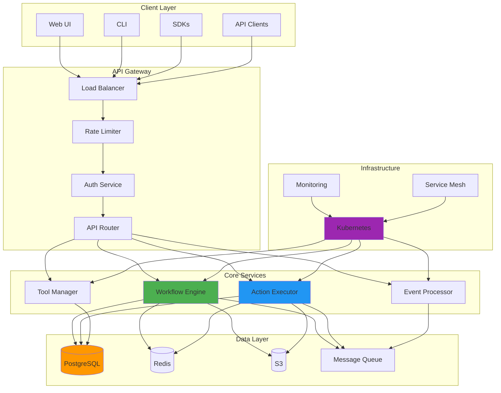

# System Architecture

This document provides a comprehensive overview of Tolstoy's internal architecture, design decisions, and technical implementation details.

## High-Level Architecture



## Core Components

### 1. API Gateway

The API Gateway serves as the single entry point for all client requests, providing:

<Tabs>
  <Tab title="Architecture">
    ```yaml
    api_gateway:
      components:
        load_balancer:
          type: AWS ALB
          strategy: round_robin
          health_checks:
            interval: 30s
            timeout: 5s
            threshold: 2
        
        rate_limiter:
          implementation: Redis-based
          algorithms:
            - token_bucket
            - sliding_window
          configuration:
            default_limit: 1000 req/min
            burst_allowance: 100
        
        auth_service:
          providers:
            - jwt
            - api_key
            - oauth2
          session_store: Redis
          token_expiry: 24h
        
        router:
          framework: Express.js
          middleware:
            - cors
            - compression
            - request_id
            - logging
            - metrics
    ```
  </Tab>
  
  <Tab title="Request Flow">
    ```typescript
    // API Gateway Request Processing Pipeline
    
    interface RequestPipeline {
      stages: [
        'load_balancing',
        'ddos_protection',
        'rate_limiting',
        'authentication',
        'authorization',
        'request_validation',
        'routing',
        'response_processing',
        'logging'
      ];
    }
    
    class APIGateway {
      private pipeline: RequestPipeline;
      private middlewares: Middleware[];
      
      async processRequest(req: Request): Promise<Response> {
        const context = new RequestContext(req);
        
        try {
          // Load balancing
          const target = await this.loadBalancer.selectTarget();
          context.setTarget(target);
          
          // DDoS protection
          if (await this.ddosProtection.isAttack(req)) {
            throw new DDOSError('Request blocked');
          }
          
          // Rate limiting
          const rateLimitResult = await this.rateLimiter.check(req);
          if (!rateLimitResult.allowed) {
            throw new RateLimitError(rateLimitResult);
          }
          
          // Authentication
          const authResult = await this.authenticator.authenticate(req);
          context.setUser(authResult.user);
          
          // Authorization
          const authzResult = await this.authorizer.authorize(
            authResult.user,
            req.resource,
            req.action
          );
          if (!authzResult.allowed) {
            throw new AuthorizationError('Access denied');
          }
          
          // Request validation
          await this.validator.validate(req);
          
          // Route to service
          const response = await this.router.route(context);
          
          // Process response
          return await this.responseProcessor.process(response);
          
        } catch (error) {
          return this.errorHandler.handle(error, context);
        } finally {
          // Logging
          await this.logger.log(context);
        }
      }
    }
    ```
  </Tab>
  
  <Tab title="Security Features">
    ```typescript
    // Security implementation details
    
    class SecurityLayer {
      // DDoS Protection
      private ddosProtection = {
        enabled: true,
        strategies: [
          'rate_limiting',
          'ip_blacklisting',
          'challenge_response',
          'geo_blocking'
        ],
        thresholds: {
          requests_per_second: 100,
          connections_per_ip: 50,
          payload_size_mb: 10
        }
      };
      
      // Request Signing
      private requestSigning = {
        algorithm: 'HMAC-SHA256',
        header: 'X-Signature',
        timestamp_tolerance: 300, // seconds
        
        verify(request: Request): boolean {
          const signature = request.headers['x-signature'];
          const timestamp = request.headers['x-timestamp'];
          
          // Verify timestamp is within tolerance
          if (!this.isTimestampValid(timestamp)) {
            return false;
          }
          
          // Compute expected signature
          const payload = this.canonicalizeRequest(request);
          const expected = this.computeSignature(payload, timestamp);
          
          // Constant-time comparison
          return crypto.timingSafeEqual(
            Buffer.from(signature),
            Buffer.from(expected)
          );
        }
      };
      
      // Input Sanitization
      private sanitization = {
        strategies: [
          'sql_injection_prevention',
          'xss_prevention',
          'command_injection_prevention',
          'path_traversal_prevention'
        ],
        
        sanitize(input: any): any {
          if (typeof input === 'string') {
            return this.sanitizeString(input);
          } else if (Array.isArray(input)) {
            return input.map(item => this.sanitize(item));
          } else if (typeof input === 'object' && input !== null) {
            const sanitized: any = {};
            for (const [key, value] of Object.entries(input)) {
              sanitized[this.sanitizeKey(key)] = this.sanitize(value);
            }
            return sanitized;
          }
          return input;
        }
      };
    }
    ```
  </Tab>
</Tabs>

### 2. Workflow Engine

The Workflow Engine is the heart of Tolstoy, orchestrating complex workflow executions:

<Tabs>
  <Tab title="Core Engine">
    ```typescript
    // Workflow Engine Architecture
    
    class WorkflowEngine {
      private executor: WorkflowExecutor;
      private scheduler: WorkflowScheduler;
      private stateManager: StateManager;
      private eventBus: EventBus;
      
      async executeWorkflow(
        workflowId: string,
        input: any,
        options: ExecutionOptions
      ): Promise<ExecutionResult> {
        // Create execution context
        const context = new ExecutionContext({
          workflowId,
          executionId: generateId(),
          input,
          options,
          startTime: Date.now()
        });
        
        try {
          // Load workflow definition
          const workflow = await this.loadWorkflow(workflowId);
          
          // Validate input against schema
          await this.validateInput(workflow, input);
          
          // Initialize state
          await this.stateManager.initializeState(context);
          
          // Create execution plan
          const plan = await this.createExecutionPlan(workflow, context);
          
          // Execute workflow
          const result = await this.executor.execute(plan, context);
          
          // Persist final state
          await this.stateManager.persistState(context);
          
          // Emit completion event
          await this.eventBus.emit('workflow.completed', {
            executionId: context.executionId,
            result
          });
          
          return result;
          
        } catch (error) {
          // Handle workflow failure
          await this.handleFailure(context, error);
          throw error;
        }
      }
      
      private async createExecutionPlan(
        workflow: Workflow,
        context: ExecutionContext
      ): Promise<ExecutionPlan> {
        const plan = new ExecutionPlan();
        
        // Build dependency graph
        const graph = this.buildDependencyGraph(workflow.steps);
        
        // Topological sort for execution order
        const executionOrder = this.topologicalSort(graph);
        
        // Identify parallelizable steps
        const parallelGroups = this.identifyParallelGroups(
          executionOrder,
          graph
        );
        
        // Optimize execution plan
        plan.stages = this.optimizeExecution(parallelGroups, context);
        
        return plan;
      }
    }
    ```
  </Tab>
  
  <Tab title="State Management">
    ```typescript
    // Distributed State Management
    
    class StateManager {
      private storage: StateStorage;
      private cache: StateCache;
      private serializer: StateSerializer;
      
      async initializeState(context: ExecutionContext): Promise<void> {
        const state = new WorkflowState({
          executionId: context.executionId,
          workflowId: context.workflowId,
          status: 'initializing',
          input: context.input,
          variables: {},
          stepStates: {},
          checkpoints: [],
          createdAt: Date.now()
        });
        
        // Persist to durable storage
        await this.storage.save(state);
        
        // Cache for fast access
        await this.cache.set(context.executionId, state);
      }
      
      async updateStepState(
        executionId: string,
        stepId: string,
        stepState: StepState
      ): Promise<void> {
        const state = await this.getState(executionId);
        
        // Update step state
        state.stepStates[stepId] = {
          ...stepState,
          updatedAt: Date.now()
        };
        
        // Create checkpoint if needed
        if (this.shouldCheckpoint(state)) {
          await this.createCheckpoint(state);
        }
        
        // Update storage and cache
        await Promise.all([
          this.storage.update(state),
          this.cache.set(executionId, state)
        ]);
      }
      
      async recoverFromCheckpoint(
        executionId: string,
        checkpointId: string
      ): Promise<WorkflowState> {
        // Load checkpoint
        const checkpoint = await this.storage.loadCheckpoint(
          executionId,
          checkpointId
        );
        
        // Restore state
        const state = this.serializer.deserialize(checkpoint.data);
        
        // Validate state integrity
        if (!this.validateStateIntegrity(state)) {
          throw new StateCorruptionError('Invalid checkpoint state');
        }
        
        // Update current state
        await this.storage.save(state);
        await this.cache.set(executionId, state);
        
        return state;
      }
      
      private shouldCheckpoint(state: WorkflowState): boolean {
        // Checkpoint strategies
        const strategies = {
          time_based: () => {
            const lastCheckpoint = state.checkpoints[state.checkpoints.length - 1];
            return !lastCheckpoint || 
                   Date.now() - lastCheckpoint.createdAt > 60000; // 1 minute
          },
          
          step_based: () => {
            const completedSteps = Object.values(state.stepStates)
              .filter(s => s.status === 'completed').length;
            return completedSteps % 5 === 0; // Every 5 steps
          },
          
          state_size_based: () => {
            const stateSize = this.serializer.getSize(state);
            return stateSize > 1024 * 1024; // 1MB
          }
        };
        
        return Object.values(strategies).some(strategy => strategy());
      }
    }
    ```
  </Tab>
  
  <Tab title="Execution Strategies">
    ```typescript
    // Advanced Execution Strategies
    
    class ExecutionStrategies {
      // Parallel Execution
      async executeParallel(
        steps: Step[],
        context: ExecutionContext
      ): Promise<StepResult[]> {
        const semaphore = new Semaphore(context.options.maxConcurrency || 10);
        
        const promises = steps.map(async (step) => {
          await semaphore.acquire();
          try {
            return await this.executeStep(step, context);
          } finally {
            semaphore.release();
          }
        });
        
        return Promise.all(promises);
      }
      
      // Conditional Execution
      async executeConditional(
        step: ConditionalStep,
        context: ExecutionContext
      ): Promise<StepResult> {
        // Evaluate condition
        const conditionResult = await this.evaluateCondition(
          step.condition,
          context
        );
        
        // Execute appropriate branch
        if (conditionResult) {
          return await this.executeStep(step.onTrue, context);
        } else if (step.onFalse) {
          return await this.executeStep(step.onFalse, context);
        }
        
        return { skipped: true };
      }
      
      // Loop Execution
      async executeLoop(
        step: LoopStep,
        context: ExecutionContext
      ): Promise<StepResult[]> {
        const results: StepResult[] = [];
        
        if (step.type === 'forEach') {
          // ForEach loop
          const items = await this.resolveItems(step.items, context);
          
          for (let i = 0; i < items.length; i++) {
            const itemContext = {
              ...context,
              loopIndex: i,
              loopItem: items[i]
            };
            
            const result = await this.executeStep(step.step, itemContext);
            results.push(result);
            
            // Check for early exit
            if (result.breakLoop) {
              break;
            }
          }
        } else if (step.type === 'while') {
          // While loop
          let iteration = 0;
          const maxIterations = step.maxIterations || 1000;
          
          while (iteration < maxIterations) {
            const conditionResult = await this.evaluateCondition(
              step.condition,
              context
            );
            
            if (!conditionResult) {
              break;
            }
            
            const result = await this.executeStep(step.step, context);
            results.push(result);
            
            iteration++;
          }
          
          if (iteration >= maxIterations) {
            throw new Error(`Loop exceeded maximum iterations: ${maxIterations}`);
          }
        }
        
        return results;
      }
      
      // Retry Strategy
      async executeWithRetry(
        step: Step,
        context: ExecutionContext,
        retryConfig: RetryConfig
      ): Promise<StepResult> {
        let lastError: Error | null = null;
        
        for (let attempt = 0; attempt <= retryConfig.maxAttempts; attempt++) {
          try {
            return await this.executeStep(step, context);
          } catch (error) {
            lastError = error as Error;
            
            // Check if error is retryable
            if (!this.isRetryableError(error, retryConfig)) {
              throw error;
            }
            
            // Calculate backoff delay
            const delay = this.calculateBackoff(
              attempt,
              retryConfig.backoffStrategy
            );
            
            // Wait before retry
            await this.sleep(delay);
            
            // Log retry attempt
            this.logger.info(`Retrying step ${step.id}, attempt ${attempt + 1}`);
          }
        }
        
        throw new RetryExhaustedError(
          `Failed after ${retryConfig.maxAttempts} attempts`,
          lastError
        );
      }
      
      private calculateBackoff(
        attempt: number,
        strategy: BackoffStrategy
      ): number {
        switch (strategy.type) {
          case 'exponential':
            return Math.min(
              strategy.baseDelay * Math.pow(2, attempt),
              strategy.maxDelay || 60000
            );
          
          case 'linear':
            return strategy.baseDelay * (attempt + 1);
          
          case 'constant':
            return strategy.baseDelay;
          
          default:
            return 1000; // Default 1 second
        }
      }
    }
    ```
  </Tab>
</Tabs>

### 3. Action Executor

The Action Executor handles the execution of individual actions within workflows:

<Tabs>
  <Tab title="Executor Core">
    ```typescript
    // Action Executor Implementation
    
    class ActionExecutor {
      private httpClient: HTTPClient;
      private connectionPool: ConnectionPool;
      private circuitBreaker: CircuitBreaker;
      private cache: ActionCache;
      
      async execute(
        action: Action,
        input: any,
        context: ExecutionContext
      ): Promise<ActionResult> {
        // Check cache first
        const cacheKey = this.generateCacheKey(action, input);
        const cachedResult = await this.cache.get(cacheKey);
        if (cachedResult && !this.isCacheExpired(cachedResult)) {
          return cachedResult.data;
        }
        
        // Check circuit breaker
        const circuitState = await this.circuitBreaker.getState(action.toolId);
        if (circuitState === 'open') {
          throw new CircuitOpenError(`Circuit breaker open for ${action.toolId}`);
        }
        
        // Get connection from pool
        const connection = await this.connectionPool.acquire(action.toolId);
        
        try {
          // Prepare request
          const request = await this.prepareRequest(action, input, context);
          
          // Execute request with timeout
          const response = await this.executeWithTimeout(
            () => this.httpClient.request(request),
            action.timeout || 30000
          );
          
          // Process response
          const result = await this.processResponse(response, action);
          
          // Update cache
          if (action.cacheable) {
            await this.cache.set(cacheKey, {
              data: result,
              timestamp: Date.now(),
              ttl: action.cacheTTL || 300000
            });
          }
          
          // Report success to circuit breaker
          await this.circuitBreaker.recordSuccess(action.toolId);
          
          return result;
          
        } catch (error) {
          // Report failure to circuit breaker
          await this.circuitBreaker.recordFailure(action.toolId);
          
          // Handle specific error types
          if (error instanceof NetworkError) {
            throw new ActionNetworkError(action.id, error);
          } else if (error instanceof TimeoutError) {
            throw new ActionTimeoutError(action.id, error);
          } else {
            throw new ActionExecutionError(action.id, error);
          }
          
        } finally {
          // Release connection back to pool
          await this.connectionPool.release(connection);
        }
      }
      
      private async prepareRequest(
        action: Action,
        input: any,
        context: ExecutionContext
      ): Promise<HTTPRequest> {
        // Build URL with parameter substitution
        const url = this.buildUrl(action.endpoint, input);
        
        // Prepare headers
        const headers = await this.prepareHeaders(action, context);
        
        // Prepare body
        const body = await this.prepareBody(action, input);
        
        // Apply request transformations
        const transformedRequest = await this.applyTransformations({
          method: action.method,
          url,
          headers,
          body
        }, action.requestTransform);
        
        return transformedRequest;
      }
      
      private async processResponse(
        response: HTTPResponse,
        action: Action
      ): Promise<any> {
        // Validate response status
        if (!this.isSuccessStatus(response.status)) {
          throw new ActionResponseError(
            `Action failed with status ${response.status}`,
            response
          );
        }
        
        // Apply response transformations
        let processedData = response.data;
        
        if (action.responseTransform) {
          processedData = await this.applyTransformations(
            processedData,
            action.responseTransform
          );
        }
        
        // Validate response schema
        if (action.responseSchema) {
          await this.validateSchema(processedData, action.responseSchema);
        }
        
        return processedData;
      }
    }
    ```
  </Tab>
  
  <Tab title="Connection Pooling">
    ```typescript
    // Connection Pool Management
    
    class ConnectionPool {
      private pools: Map<string, Pool> = new Map();
      private config: PoolConfig;
      
      constructor(config: PoolConfig) {
        this.config = config;
      }
      
      async acquire(toolId: string): Promise<Connection> {
        const pool = await this.getOrCreatePool(toolId);
        
        // Wait for available connection
        const startTime = Date.now();
        const timeout = this.config.acquisitionTimeout || 30000;
        
        while (Date.now() - startTime < timeout) {
          // Try to get connection from pool
          const connection = pool.connections.find(c => !c.inUse);
          
          if (connection) {
            connection.inUse = true;
            connection.lastUsed = Date.now();
            return connection;
          }
          
          // Check if we can create new connection
          if (pool.connections.length < pool.maxSize) {
            const newConnection = await this.createConnection(toolId);
            pool.connections.push(newConnection);
            newConnection.inUse = true;
            return newConnection;
          }
          
          // Wait and retry
          await this.sleep(100);
        }
        
        throw new PoolExhaustedError(
          `Failed to acquire connection for ${toolId} within ${timeout}ms`
        );
      }
      
      async release(connection: Connection): Promise<void> {
        connection.inUse = false;
        
        // Check connection health
        if (!await this.isConnectionHealthy(connection)) {
          await this.destroyConnection(connection);
          const pool = this.pools.get(connection.toolId);
          if (pool) {
            pool.connections = pool.connections.filter(c => c !== connection);
          }
        }
      }
      
      private async getOrCreatePool(toolId: string): Promise<Pool> {
        if (!this.pools.has(toolId)) {
          const pool = new Pool({
            toolId,
            minSize: this.config.minSize || 2,
            maxSize: this.config.maxSize || 10,
            idleTimeout: this.config.idleTimeout || 60000,
            connections: []
          });
          
          // Create minimum connections
          for (let i = 0; i < pool.minSize; i++) {
            const connection = await this.createConnection(toolId);
            pool.connections.push(connection);
          }
          
          this.pools.set(toolId, pool);
          
          // Start pool maintenance
          this.startPoolMaintenance(pool);
        }
        
        return this.pools.get(toolId)!;
      }
      
      private startPoolMaintenance(pool: Pool): void {
        setInterval(async () => {
          // Remove idle connections
          const now = Date.now();
          const idleConnections = pool.connections.filter(
            c => !c.inUse && 
                 now - c.lastUsed > pool.idleTimeout &&
                 pool.connections.length > pool.minSize
          );
          
          for (const connection of idleConnections) {
            await this.destroyConnection(connection);
            pool.connections = pool.connections.filter(c => c !== connection);
          }
          
          // Ensure minimum connections
          while (pool.connections.length < pool.minSize) {
            const connection = await this.createConnection(pool.toolId);
            pool.connections.push(connection);
          }
          
          // Health check all connections
          for (const connection of pool.connections) {
            if (!connection.inUse && !await this.isConnectionHealthy(connection)) {
              await this.destroyConnection(connection);
              pool.connections = pool.connections.filter(c => c !== connection);
            }
          }
        }, 30000); // Every 30 seconds
      }
    }
    ```
  </Tab>
  
  <Tab title="Circuit Breaker">
    ```typescript
    // Circuit Breaker Implementation
    
    class CircuitBreaker {
      private circuits: Map<string, Circuit> = new Map();
      private config: CircuitConfig;
      
      constructor(config: CircuitConfig) {
        this.config = config;
      }
      
      async getState(serviceId: string): Promise<CircuitState> {
        const circuit = this.getOrCreateCircuit(serviceId);
        
        // Check if circuit should transition
        if (circuit.state === 'open') {
          const now = Date.now();
          if (now >= circuit.nextRetryTime) {
            circuit.state = 'half-open';
            circuit.halfOpenCalls = 0;
          }
        }
        
        return circuit.state;
      }
      
      async recordSuccess(serviceId: string): Promise<void> {
        const circuit = this.getOrCreateCircuit(serviceId);
        
        if (circuit.state === 'half-open') {
          circuit.halfOpenCalls++;
          
          // Check if enough successful calls to close circuit
          if (circuit.halfOpenCalls >= this.config.halfOpenSuccessThreshold) {
            circuit.state = 'closed';
            circuit.failureCount = 0;
            circuit.successCount = 0;
            circuit.lastFailureTime = null;
            
            // Emit event
            this.emit('circuit.closed', { serviceId });
          }
        } else if (circuit.state === 'closed') {
          circuit.successCount++;
          
          // Reset failure count on success streak
          if (circuit.successCount >= this.config.successStreakThreshold) {
            circuit.failureCount = 0;
          }
        }
      }
      
      async recordFailure(serviceId: string): Promise<void> {
        const circuit = this.getOrCreateCircuit(serviceId);
        
        if (circuit.state === 'half-open') {
          // Immediately open circuit on failure in half-open state
          this.openCircuit(circuit, serviceId);
        } else if (circuit.state === 'closed') {
          circuit.failureCount++;
          circuit.lastFailureTime = Date.now();
          
          // Calculate failure rate
          const failureRate = this.calculateFailureRate(circuit);
          
          // Check if should open circuit
          if (
            circuit.failureCount >= this.config.failureThreshold ||
            failureRate >= this.config.failureRateThreshold
          ) {
            this.openCircuit(circuit, serviceId);
          }
        }
      }
      
      private openCircuit(circuit: Circuit, serviceId: string): void {
        circuit.state = 'open';
        circuit.openedAt = Date.now();
        circuit.nextRetryTime = Date.now() + this.config.resetTimeout;
        
        // Emit event
        this.emit('circuit.opened', {
          serviceId,
          failureCount: circuit.failureCount,
          lastFailureTime: circuit.lastFailureTime
        });
        
        // Log critical event
        this.logger.error(`Circuit breaker opened for ${serviceId}`, {
          failureCount: circuit.failureCount,
          nextRetryTime: new Date(circuit.nextRetryTime)
        });
      }
      
      private calculateFailureRate(circuit: Circuit): number {
        const total = circuit.successCount + circuit.failureCount;
        if (total === 0) return 0;
        return circuit.failureCount / total;
      }
      
      private getOrCreateCircuit(serviceId: string): Circuit {
        if (!this.circuits.has(serviceId)) {
          this.circuits.set(serviceId, {
            serviceId,
            state: 'closed',
            failureCount: 0,
            successCount: 0,
            lastFailureTime: null,
            openedAt: null,
            nextRetryTime: null,
            halfOpenCalls: 0
          });
        }
        return this.circuits.get(serviceId)!;
      }
    }
    ```
  </Tab>
</Tabs>

### 4. Data Layer

The data layer provides persistent storage and caching for all system components:

<Tabs>
  <Tab title="Database Schema">
    ```sql
    -- Core Tables
    
    -- Organizations
    CREATE TABLE organizations (
        id UUID PRIMARY KEY DEFAULT gen_random_uuid(),
        name VARCHAR(255) NOT NULL,
        slug VARCHAR(255) UNIQUE NOT NULL,
        settings JSONB DEFAULT '{}',
        subscription_tier VARCHAR(50) DEFAULT 'free',
        created_at TIMESTAMP WITH TIME ZONE DEFAULT NOW(),
        updated_at TIMESTAMP WITH TIME ZONE DEFAULT NOW()
    );
    
    -- Users
    CREATE TABLE users (
        id UUID PRIMARY KEY DEFAULT gen_random_uuid(),
        organization_id UUID REFERENCES organizations(id),
        email VARCHAR(255) UNIQUE NOT NULL,
        name VARCHAR(255),
        role VARCHAR(50) DEFAULT 'member',
        settings JSONB DEFAULT '{}',
        last_login TIMESTAMP WITH TIME ZONE,
        created_at TIMESTAMP WITH TIME ZONE DEFAULT NOW(),
        updated_at TIMESTAMP WITH TIME ZONE DEFAULT NOW()
    );
    
    -- Tools
    CREATE TABLE tools (
        id UUID PRIMARY KEY DEFAULT gen_random_uuid(),
        organization_id UUID REFERENCES organizations(id),
        name VARCHAR(255) NOT NULL,
        key VARCHAR(255) NOT NULL,
        category VARCHAR(50),
        base_url VARCHAR(500),
        auth_config JSONB,
        headers JSONB DEFAULT '{}',
        settings JSONB DEFAULT '{}',
        status VARCHAR(50) DEFAULT 'active',
        created_at TIMESTAMP WITH TIME ZONE DEFAULT NOW(),
        updated_at TIMESTAMP WITH TIME ZONE DEFAULT NOW(),
        UNIQUE(organization_id, key)
    );
    
    -- Actions
    CREATE TABLE actions (
        id UUID PRIMARY KEY DEFAULT gen_random_uuid(),
        organization_id UUID REFERENCES organizations(id),
        tool_id UUID REFERENCES tools(id),
        name VARCHAR(255) NOT NULL,
        key VARCHAR(255) NOT NULL,
        method VARCHAR(10) NOT NULL,
        endpoint VARCHAR(500) NOT NULL,
        request_schema JSONB,
        response_schema JSONB,
        headers JSONB DEFAULT '{}',
        request_transform JSONB,
        response_transform JSONB,
        timeout INTEGER DEFAULT 30000,
        retry_config JSONB,
        cache_config JSONB,
        status VARCHAR(50) DEFAULT 'active',
        version INTEGER DEFAULT 1,
        created_at TIMESTAMP WITH TIME ZONE DEFAULT NOW(),
        updated_at TIMESTAMP WITH TIME ZONE DEFAULT NOW(),
        UNIQUE(organization_id, key)
    );
    
    -- Workflows
    CREATE TABLE workflows (
        id UUID PRIMARY KEY DEFAULT gen_random_uuid(),
        organization_id UUID REFERENCES organizations(id),
        name VARCHAR(255) NOT NULL,
        key VARCHAR(255) NOT NULL,
        description TEXT,
        input_schema JSONB,
        output_schema JSONB,
        steps JSONB NOT NULL,
        error_handling JSONB,
        settings JSONB DEFAULT '{}',
        status VARCHAR(50) DEFAULT 'active',
        version INTEGER DEFAULT 1,
        created_by UUID REFERENCES users(id),
        created_at TIMESTAMP WITH TIME ZONE DEFAULT NOW(),
        updated_at TIMESTAMP WITH TIME ZONE DEFAULT NOW(),
        UNIQUE(organization_id, key)
    );
    
    -- Executions
    CREATE TABLE executions (
        id UUID PRIMARY KEY DEFAULT gen_random_uuid(),
        organization_id UUID REFERENCES organizations(id),
        workflow_id UUID REFERENCES workflows(id),
        workflow_version INTEGER,
        execution_number SERIAL,
        input JSONB,
        output JSONB,
        status VARCHAR(50) NOT NULL,
        error JSONB,
        metadata JSONB DEFAULT '{}',
        started_at TIMESTAMP WITH TIME ZONE,
        completed_at TIMESTAMP WITH TIME ZONE,
        duration_ms INTEGER,
        created_by UUID REFERENCES users(id),
        created_at TIMESTAMP WITH TIME ZONE DEFAULT NOW()
    );
    
    -- Execution Steps
    CREATE TABLE execution_steps (
        id UUID PRIMARY KEY DEFAULT gen_random_uuid(),
        execution_id UUID REFERENCES executions(id),
        step_id VARCHAR(255) NOT NULL,
        step_type VARCHAR(50) NOT NULL,
        input JSONB,
        output JSONB,
        status VARCHAR(50) NOT NULL,
        error JSONB,
        started_at TIMESTAMP WITH TIME ZONE,
        completed_at TIMESTAMP WITH TIME ZONE,
        duration_ms INTEGER,
        retry_count INTEGER DEFAULT 0,
        metadata JSONB DEFAULT '{}'
    );
    
    -- Audit Logs
    CREATE TABLE audit_logs (
        id UUID PRIMARY KEY DEFAULT gen_random_uuid(),
        organization_id UUID REFERENCES organizations(id),
        user_id UUID REFERENCES users(id),
        action VARCHAR(100) NOT NULL,
        resource_type VARCHAR(50),
        resource_id UUID,
        changes JSONB,
        ip_address INET,
        user_agent TEXT,
        metadata JSONB DEFAULT '{}',
        created_at TIMESTAMP WITH TIME ZONE DEFAULT NOW()
    );
    
    -- Indexes for performance
    CREATE INDEX idx_executions_organization_id ON executions(organization_id);
    CREATE INDEX idx_executions_workflow_id ON executions(workflow_id);
    CREATE INDEX idx_executions_status ON executions(status);
    CREATE INDEX idx_executions_created_at ON executions(created_at DESC);
    CREATE INDEX idx_execution_steps_execution_id ON execution_steps(execution_id);
    CREATE INDEX idx_audit_logs_organization_id ON audit_logs(organization_id);
    CREATE INDEX idx_audit_logs_user_id ON audit_logs(user_id);
    CREATE INDEX idx_audit_logs_created_at ON audit_logs(created_at DESC);
    
    -- Partitioning for large tables
    CREATE TABLE executions_partitioned (
        LIKE executions INCLUDING ALL
    ) PARTITION BY RANGE (created_at);
    
    -- Create monthly partitions
    CREATE TABLE executions_2024_01 PARTITION OF executions_partitioned
        FOR VALUES FROM ('2024-01-01') TO ('2024-02-01');
    CREATE TABLE executions_2024_02 PARTITION OF executions_partitioned
        FOR VALUES FROM ('2024-02-01') TO ('2024-03-01');
    -- Continue for all months...
    ```
  </Tab>
  
  <Tab title="Caching Strategy">
    ```typescript
    // Multi-tier Caching Strategy
    
    class CacheManager {
      private l1Cache: MemoryCache;  // In-memory cache
      private l2Cache: RedisCache;   // Redis cache
      private l3Cache: CDNCache;     // CDN edge cache
      
      async get(key: string): Promise<any> {
        // Check L1 cache (fastest)
        let value = await this.l1Cache.get(key);
        if (value) {
          this.metrics.recordHit('l1');
          return value;
        }
        
        // Check L2 cache
        value = await this.l2Cache.get(key);
        if (value) {
          this.metrics.recordHit('l2');
          // Promote to L1
          await this.l1Cache.set(key, value, { ttl: 60 });
          return value;
        }
        
        // Check L3 cache
        value = await this.l3Cache.get(key);
        if (value) {
          this.metrics.recordHit('l3');
          // Promote to L1 and L2
          await Promise.all([
            this.l1Cache.set(key, value, { ttl: 60 }),
            this.l2Cache.set(key, value, { ttl: 300 })
          ]);
          return value;
        }
        
        this.metrics.recordMiss();
        return null;
      }
      
      async set(
        key: string,
        value: any,
        options: CacheOptions = {}
      ): Promise<void> {
        const ttl = options.ttl || 300;
        
        // Write to all cache tiers
        await Promise.all([
          this.l1Cache.set(key, value, { ttl: Math.min(ttl, 60) }),
          this.l2Cache.set(key, value, { ttl }),
          options.cdn !== false && this.l3Cache.set(key, value, { ttl })
        ].filter(Boolean));
      }
      
      async invalidate(pattern: string): Promise<void> {
        // Invalidate across all tiers
        await Promise.all([
          this.l1Cache.invalidate(pattern),
          this.l2Cache.invalidate(pattern),
          this.l3Cache.invalidate(pattern)
        ]);
      }
      
      // Cache warming strategy
      async warmCache(keys: string[]): Promise<void> {
        const batchSize = 100;
        
        for (let i = 0; i < keys.length; i += batchSize) {
          const batch = keys.slice(i, i + batchSize);
          
          await Promise.all(
            batch.map(async (key) => {
              const value = await this.fetchFromSource(key);
              if (value) {
                await this.set(key, value);
              }
            })
          );
        }
      }
    }
    
    // Redis Cache Implementation
    class RedisCache {
      private client: Redis;
      private cluster: RedisCluster;
      
      constructor(config: RedisConfig) {
        if (config.cluster) {
          this.cluster = new RedisCluster(config.nodes);
        } else {
          this.client = new Redis(config);
        }
      }
      
      async get(key: string): Promise<any> {
        const client = this.cluster || this.client;
        const value = await client.get(key);
        
        if (value) {
          return this.deserialize(value);
        }
        
        return null;
      }
      
      async set(
        key: string,
        value: any,
        options: { ttl?: number } = {}
      ): Promise<void> {
        const client = this.cluster || this.client;
        const serialized = this.serialize(value);
        
        if (options.ttl) {
          await client.setex(key, options.ttl, serialized);
        } else {
          await client.set(key, serialized);
        }
      }
      
      async invalidate(pattern: string): Promise<void> {
        const client = this.cluster || this.client;
        
        // Use SCAN for pattern matching
        const stream = client.scanStream({
          match: pattern,
          count: 100
        });
        
        const pipeline = client.pipeline();
        
        stream.on('data', (keys: string[]) => {
          if (keys.length) {
            keys.forEach(key => pipeline.del(key));
          }
        });
        
        stream.on('end', async () => {
          await pipeline.exec();
        });
      }
      
      private serialize(value: any): string {
        return JSON.stringify(value);
      }
      
      private deserialize(value: string): any {
        try {
          return JSON.parse(value);
        } catch {
          return value;
        }
      }
    }
    ```
  </Tab>
  
  <Tab title="Message Queue">
    ```typescript
    // Message Queue Implementation
    
    class MessageQueue {
      private queues: Map<string, Queue> = new Map();
      private deadLetterQueues: Map<string, Queue> = new Map();
      private consumers: Map<string, Consumer[]> = new Map();
      
      async publish(
        queueName: string,
        message: Message,
        options: PublishOptions = {}
      ): Promise<void> {
        const queue = this.getOrCreateQueue(queueName);
        
        // Add message metadata
        const enrichedMessage = {
          ...message,
          id: generateId(),
          timestamp: Date.now(),
          attempts: 0,
          maxAttempts: options.maxAttempts || 3,
          priority: options.priority || 'normal',
          delayUntil: options.delay ? Date.now() + options.delay : null
        };
        
        // Add to appropriate queue position based on priority
        if (enrichedMessage.priority === 'high') {
          queue.messages.unshift(enrichedMessage);
        } else {
          queue.messages.push(enrichedMessage);
        }
        
        // Persist to storage
        await this.persistMessage(queueName, enrichedMessage);
        
        // Notify consumers
        this.notifyConsumers(queueName);
      }
      
      async consume(
        queueName: string,
        handler: MessageHandler,
        options: ConsumeOptions = {}
      ): Promise<void> {
        const consumer = new Consumer({
          id: generateId(),
          queueName,
          handler,
          options
        });
        
        // Register consumer
        if (!this.consumers.has(queueName)) {
          this.consumers.set(queueName, []);
        }
        this.consumers.get(queueName)!.push(consumer);
        
        // Start consuming
        this.startConsuming(consumer);
      }
      
      private async startConsuming(consumer: Consumer): Promise<void> {
        const queue = this.getOrCreateQueue(consumer.queueName);
        
        while (consumer.active) {
          // Get next message
          const message = await this.getNextMessage(queue);
          
          if (!message) {
            // No messages, wait
            await this.sleep(consumer.options.pollInterval || 1000);
            continue;
          }
          
          try {
            // Process message
            await consumer.handler(message);
            
            // Acknowledge message
            await this.acknowledgeMessage(queue, message);
            
          } catch (error) {
            // Handle failure
            await this.handleFailure(queue, message, error);
          }
        }
      }
      
      private async handleFailure(
        queue: Queue,
        message: Message,
        error: Error
      ): Promise<void> {
        message.attempts++;
        message.lastError = error.message;
        
        if (message.attempts >= message.maxAttempts) {
          // Move to dead letter queue
          await this.moveToDeadLetterQueue(queue.name, message);
        } else {
          // Requeue with backoff
          const backoffDelay = Math.pow(2, message.attempts) * 1000;
          message.delayUntil = Date.now() + backoffDelay;
          
          // Re-add to queue
          queue.messages.push(message);
          
          // Log retry
          this.logger.warn(`Message ${message.id} failed, retrying in ${backoffDelay}ms`, {
            queueName: queue.name,
            attempts: message.attempts,
            error: error.message
          });
        }
      }
      
      private async moveToDeadLetterQueue(
        queueName: string,
        message: Message
      ): Promise<void> {
        const dlqName = `${queueName}_dlq`;
        const dlq = this.getOrCreateDeadLetterQueue(dlqName);
        
        // Add to DLQ
        dlq.messages.push({
          ...message,
          movedToDLQ: Date.now(),
          originalQueue: queueName
        });
        
        // Persist to storage
        await this.persistMessage(dlqName, message);
        
        // Alert on DLQ message
        this.alerting.send({
          level: 'warning',
          message: `Message moved to DLQ: ${message.id}`,
          queue: queueName,
          messageId: message.id,
          lastError: message.lastError
        });
      }
    }
    ```
  </Tab>
</Tabs>

## Performance Optimization

### Query Optimization

```sql
-- Optimized query for workflow executions with pagination
WITH ranked_executions AS (
    SELECT 
        e.*,
        ROW_NUMBER() OVER (
            PARTITION BY e.workflow_id 
            ORDER BY e.created_at DESC
        ) as rn
    FROM executions e
    WHERE 
        e.organization_id = $1
        AND e.status = ANY($2)
        AND e.created_at >= $3
        AND e.created_at <= $4
)
SELECT 
    re.*,
    w.name as workflow_name,
    w.key as workflow_key,
    u.name as created_by_name,
    COUNT(*) OVER() as total_count
FROM ranked_executions re
JOIN workflows w ON re.workflow_id = w.id
LEFT JOIN users u ON re.created_by = u.id
WHERE re.rn <= 10  -- Latest 10 executions per workflow
ORDER BY re.created_at DESC
LIMIT $5 OFFSET $6;

-- Create covering index for performance
CREATE INDEX idx_executions_covering 
ON executions(organization_id, status, created_at DESC) 
INCLUDE (workflow_id, input, output, duration_ms);
```

### Resource Management

```typescript
// Resource pool and optimization
class ResourceManager {
  private pools: {
    database: ConnectionPool;
    redis: ConnectionPool;
    http: ConnectionPool;
  };
  
  async optimizeResources(): Promise<void> {
    // Monitor resource usage
    const metrics = await this.collectMetrics();
    
    // Adjust pool sizes based on usage
    if (metrics.database.utilization > 0.8) {
      await this.pools.database.expand(2);
    } else if (metrics.database.utilization < 0.3) {
      await this.pools.database.shrink(1);
    }
    
    // Implement connection recycling
    await this.recycleIdleConnections();
    
    // Clear unused caches
    await this.clearUnusedCaches();
  }
}
```

## Monitoring & Observability

### Metrics Collection

```typescript
// Comprehensive metrics collection
class MetricsCollector {
  private metrics: {
    counters: Map<string, number>;
    gauges: Map<string, number>;
    histograms: Map<string, Histogram>;
  };
  
  collectSystemMetrics(): SystemMetrics {
    return {
      // Application metrics
      workflow_executions_total: this.counters.get('workflow.executions'),
      workflow_executions_failed: this.counters.get('workflow.failures'),
      workflow_duration_seconds: this.histograms.get('workflow.duration'),
      
      // Resource metrics
      database_connections_active: this.gauges.get('db.connections.active'),
      database_connections_idle: this.gauges.get('db.connections.idle'),
      cache_hit_ratio: this.calculateCacheHitRatio(),
      
      // Performance metrics
      api_request_duration_seconds: this.histograms.get('api.duration'),
      api_request_rate: this.calculateRequestRate(),
      queue_depth: this.gauges.get('queue.depth'),
      
      // Error metrics
      error_rate: this.calculateErrorRate(),
      circuit_breaker_open: this.gauges.get('circuit.open.count')
    };
  }
}
```

## Security Architecture

### Defense in Depth

```typescript
// Multi-layer security implementation
class SecurityArchitecture {
  layers = {
    network: {
      firewall: 'AWS WAF',
      ddos_protection: 'CloudFlare',
      tls: 'TLS 1.3',
      vpn: 'Site-to-site VPN'
    },
    
    application: {
      authentication: ['JWT', 'OAuth2', 'SAML'],
      authorization: 'RBAC with ABAC',
      input_validation: 'Schema-based validation',
      output_encoding: 'Context-aware encoding'
    },
    
    data: {
      encryption_at_rest: 'AES-256-GCM',
      encryption_in_transit: 'TLS 1.3',
      key_management: 'AWS KMS',
      data_masking: 'PII automatic detection'
    },
    
    monitoring: {
      siem: 'Splunk',
      ids: 'Snort',
      vulnerability_scanning: 'Qualys',
      compliance: 'AWS Config'
    }
  };
}
```

## Disaster Recovery

### Backup and Recovery Strategy

```yaml
disaster_recovery:
  rpo: 1 hour  # Recovery Point Objective
  rto: 4 hours # Recovery Time Objective
  
  backup_strategy:
    database:
      frequency: continuous (streaming replication)
      retention: 30 days
      location: cross-region S3
    
    files:
      frequency: hourly snapshots
      retention: 7 days
      location: S3 with versioning
    
    configurations:
      frequency: on change
      retention: indefinite
      location: git repository
  
  recovery_procedures:
    - automated failover to standby region
    - point-in-time recovery capability
    - regular DR drills (quarterly)
    - runbook documentation
```

---

This architecture document provides the foundation for understanding and maintaining Tolstoy's internal systems. Regular updates ensure it remains an accurate reference for the engineering team.