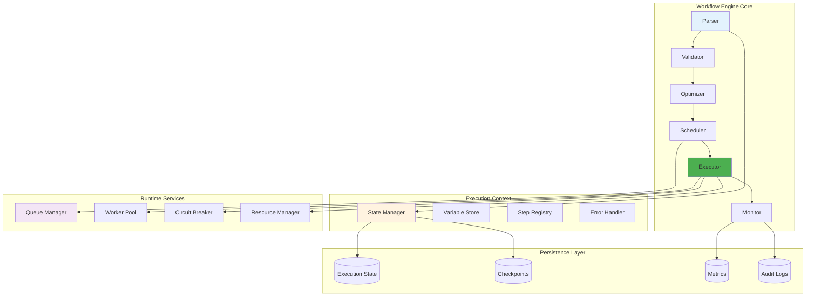

# Workflow Engine Deep Dive

This document provides an in-depth technical analysis of Tolstoy's workflow execution engine, covering its internal architecture, algorithms, and optimization strategies.

## Engine Architecture



## Core Components

### 1. Workflow Parser

The parser transforms workflow definitions into executable formats:

<Tabs>
  <Tab title="Parser Implementation">
    ```typescript
    class WorkflowParser {
      private schema: JSONSchema;
      private compiler: ExpressionCompiler;
      
      parse(definition: WorkflowDefinition): ParsedWorkflow {
        // Validate workflow definition
        const validation = this.validateDefinition(definition);
        if (!validation.valid) {
          throw new ParseError(validation.errors);
        }
        
        // Parse steps into execution graph
        const graph = this.buildExecutionGraph(definition.steps);
        
        // Compile expressions
        const compiledSteps = this.compileExpressions(graph.steps);
        
        // Optimize execution plan
        const optimizedPlan = this.optimizeExecutionPlan(compiledSteps);
        
        return {
          id: definition.id,
          version: definition.version,
          metadata: definition.metadata,
          inputSchema: definition.inputSchema,
          outputSchema: definition.outputSchema,
          executionPlan: optimizedPlan,
          graph,
          estimatedComplexity: this.calculateComplexity(optimizedPlan)
        };
      }
      
      private buildExecutionGraph(steps: Step[]): ExecutionGraph {
        const graph = new ExecutionGraph();
        const nodeMap = new Map<string, GraphNode>();
        
        // Create nodes for each step
        for (const step of steps) {
          const node = new GraphNode({
            id: step.id,
            type: step.type,
            action: step.action,
            condition: step.condition,
            dependencies: this.extractDependencies(step),
            metadata: {
              timeout: step.timeout,
              retryPolicy: step.retryPolicy,
              resources: step.resources
            }
          });
          
          graph.addNode(node);
          nodeMap.set(step.id, node);
        }
        
        // Create edges based on dependencies
        for (const [stepId, node] of nodeMap) {
          for (const depId of node.dependencies) {
            const depNode = nodeMap.get(depId);
            if (depNode) {
              graph.addEdge(depNode, node);
            }
          }
        }
        
        // Validate graph structure
        this.validateGraph(graph);
        
        return graph;
      }
      
      private extractDependencies(step: Step): string[] {
        const dependencies = new Set<string>();
        
        // Extract from input expressions
        if (step.input) {
          const expressions = this.extractExpressions(step.input);
          for (const expr of expressions) {
            const stepRefs = this.parseStepReferences(expr);
            stepRefs.forEach(ref => dependencies.add(ref));
          }
        }
        
        // Extract from conditions
        if (step.condition) {
          const stepRefs = this.parseStepReferences(step.condition);
          stepRefs.forEach(ref => dependencies.add(ref));
        }
        
        return Array.from(dependencies);
      }
      
      private parseStepReferences(expression: string): string[] {
        // Parse expressions like "{{steps.stepId.output}}"
        const stepRegex = /\{\{steps\.(\w+)(?:\.\w+)*\}\}/g;
        const matches = [];
        let match;
        
        while ((match = stepRegex.exec(expression)) !== null) {
          matches.push(match[1]);
        }
        
        return matches;
      }
      
      private validateGraph(graph: ExecutionGraph): void {
        // Check for cycles
        if (graph.hasCycle()) {
          throw new ParseError('Workflow contains circular dependencies');
        }
        
        // Check for orphaned nodes
        const orphanedNodes = graph.getOrphanedNodes();
        if (orphanedNodes.length > 0) {
          console.warn(`Found orphaned nodes: ${orphanedNodes.map(n => n.id)}`);
        }
        
        // Validate resource requirements
        this.validateResourceRequirements(graph);
      }
      
      private calculateComplexity(plan: ExecutionPlan): ComplexityMetrics {
        let totalSteps = 0;
        let parallelismDegree = 0;
        let maxDepth = 0;
        let loopComplexity = 0;
        
        for (const stage of plan.stages) {
          totalSteps += stage.steps.length;
          parallelismDegree = Math.max(parallelismDegree, stage.steps.length);
          
          for (const step of stage.steps) {
            if (step.type === 'loop') {
              loopComplexity += this.estimateLoopComplexity(step);
            }
          }
        }
        
        maxDepth = plan.stages.length;
        
        return {
          totalSteps,
          parallelismDegree,
          maxDepth,
          loopComplexity,
          estimatedDuration: this.estimateDuration(plan),
          resourceRequirements: this.calculateResourceRequirements(plan)
        };
      }
    }
    ```
  </Tab>
  
  <Tab title="Expression Compiler">
    ```typescript
    class ExpressionCompiler {
      private ast: ASTGenerator;
      private optimizer: ExpressionOptimizer;
      
      compile(expression: string): CompiledExpression {
        // Parse expression into AST
        const ast = this.ast.parse(expression);
        
        // Optimize AST
        const optimizedAST = this.optimizer.optimize(ast);
        
        // Generate executable code
        const executable = this.generateExecutable(optimizedAST);
        
        return {
          original: expression,
          ast: optimizedAST,
          executable,
          dependencies: this.extractDependencies(ast),
          isConstant: this.isConstantExpression(ast)
        };
      }
      
      private generateExecutable(ast: ASTNode): ExecutableFunction {
        const code = this.generateCode(ast);
        
        // Create sandboxed execution environment
        const sandbox = this.createSandbox();
        
        // Compile with safety checks
        const executable = new Function(
          'context', 
          'steps', 
          'input', 
          'variables',
          `
            'use strict';
            const { ${Object.keys(sandbox).join(', ')} } = arguments[4];
            try {
              return ${code};
            } catch (error) {
              throw new ExpressionExecutionError(error.message, '${ast.expression}');
            }
          `
        );
        
        return (context, steps, input, variables) => {
          return executable(context, steps, input, variables, sandbox);
        };
      }
      
      private generateCode(node: ASTNode): string {
        switch (node.type) {
          case 'literal':
            return JSON.stringify(node.value);
          
          case 'identifier':
            return this.generateIdentifierCode(node);
          
          case 'member_access':
            return `${this.generateCode(node.object)}.${node.property}`;
          
          case 'array_access':
            return `${this.generateCode(node.object)}[${this.generateCode(node.index)}]`;
          
          case 'function_call':
            const args = node.arguments.map(arg => this.generateCode(arg)).join(', ');
            return `${node.function}(${args})`;
          
          case 'binary_operation':
            const left = this.generateCode(node.left);
            const right = this.generateCode(node.right);
            return `(${left} ${node.operator} ${right})`;
          
          case 'conditional':
            const condition = this.generateCode(node.condition);
            const trueExpr = this.generateCode(node.trueExpression);
            const falseExpr = this.generateCode(node.falseExpression);
            return `(${condition} ? ${trueExpr} : ${falseExpr})`;
          
          case 'template_literal':
            return this.generateTemplateLiteralCode(node);
          
          default:
            throw new CompilationError(`Unknown node type: ${node.type}`);
        }
      }
      
      private generateIdentifierCode(node: IdentifierNode): string {
        switch (node.scope) {
          case 'input':
            return `input${node.path ? '.' + node.path : ''}`;
          
          case 'steps':
            return `steps${node.path ? '.' + node.path : ''}`;
          
          case 'variables':
            return `variables${node.path ? '.' + node.path : ''}`;
          
          case 'context':
            return `context${node.path ? '.' + node.path : ''}`;
          
          default:
            throw new CompilationError(`Unknown scope: ${node.scope}`);
        }
      }
      
      private createSandbox(): SandboxEnvironment {
        return {
          // Math functions
          Math,
          
          // Date/time functions
          Date,
          
          // String functions
          String,
          Number,
          Boolean,
          
          // Array functions
          Array,
          
          // JSON functions
          JSON,
          
          // Custom helper functions
          isEmpty: (value: any) => value == null || value === '',
          isArray: Array.isArray,
          hasProperty: (obj: any, prop: string) => obj && obj.hasOwnProperty(prop),
          
          // Utility functions
          uuid: () => crypto.randomUUID(),
          timestamp: () => Date.now(),
          formatDate: (date: Date, format: string) => this.formatDate(date, format),
          
          // Type checking
          typeof: (value: any) => typeof value,
          
          // Regular expressions (limited)
          RegExp: (pattern: string, flags?: string) => {
            // Validate pattern for safety
            if (this.isUnsafeRegex(pattern)) {
              throw new SecurityError('Unsafe regex pattern');
            }
            return new RegExp(pattern, flags);
          }
        };
      }
    }
    ```
  </Tab>
  
  <Tab title="Execution Graph">
    ```typescript
    class ExecutionGraph {
      private nodes: Map<string, GraphNode> = new Map();
      private edges: Map<string, Set<string>> = new Map();
      private reverseEdges: Map<string, Set<string>> = new Map();
      
      addNode(node: GraphNode): void {
        this.nodes.set(node.id, node);
        this.edges.set(node.id, new Set());
        this.reverseEdges.set(node.id, new Set());
      }
      
      addEdge(from: GraphNode, to: GraphNode): void {
        this.edges.get(from.id)?.add(to.id);
        this.reverseEdges.get(to.id)?.add(from.id);
      }
      
      hasCycle(): boolean {
        const visited = new Set<string>();
        const recursionStack = new Set<string>();
        
        for (const nodeId of this.nodes.keys()) {
          if (this.hasCycleUtil(nodeId, visited, recursionStack)) {
            return true;
          }
        }
        
        return false;
      }
      
      private hasCycleUtil(
        nodeId: string, 
        visited: Set<string>, 
        recursionStack: Set<string>
      ): boolean {
        if (recursionStack.has(nodeId)) {
          return true;
        }
        
        if (visited.has(nodeId)) {
          return false;
        }
        
        visited.add(nodeId);
        recursionStack.add(nodeId);
        
        const neighbors = this.edges.get(nodeId) || new Set();
        for (const neighbor of neighbors) {
          if (this.hasCycleUtil(neighbor, visited, recursionStack)) {
            return true;
          }
        }
        
        recursionStack.delete(nodeId);
        return false;
      }
      
      topologicalSort(): string[] {
        const inDegree = new Map<string, number>();
        const queue: string[] = [];
        const result: string[] = [];
        
        // Initialize in-degrees
        for (const nodeId of this.nodes.keys()) {
          inDegree.set(nodeId, this.reverseEdges.get(nodeId)?.size || 0);
        }
        
        // Add nodes with no dependencies to queue
        for (const [nodeId, degree] of inDegree) {
          if (degree === 0) {
            queue.push(nodeId);
          }
        }
        
        // Process queue
        while (queue.length > 0) {
          const nodeId = queue.shift()!;
          result.push(nodeId);
          
          // Reduce in-degree of neighbors
          const neighbors = this.edges.get(nodeId) || new Set();
          for (const neighbor of neighbors) {
            const newDegree = (inDegree.get(neighbor) || 0) - 1;
            inDegree.set(neighbor, newDegree);
            
            if (newDegree === 0) {
              queue.push(neighbor);
            }
          }
        }
        
        // Check if all nodes were processed
        if (result.length !== this.nodes.size) {
          throw new Error('Graph contains cycles - topological sort impossible');
        }
        
        return result;
      }
      
      getParallelGroups(): ParallelGroup[] {
        const groups: ParallelGroup[] = [];
        const processed = new Set<string>();
        const sortedNodes = this.topologicalSort();
        
        while (processed.size < sortedNodes.length) {
          const group = new ParallelGroup();
          
          // Find nodes that can be executed in parallel
          for (const nodeId of sortedNodes) {
            if (processed.has(nodeId)) continue;
            
            // Check if all dependencies are satisfied
            const dependencies = this.reverseEdges.get(nodeId) || new Set();
            const canExecute = Array.from(dependencies).every(dep => processed.has(dep));
            
            if (canExecute) {
              group.add(nodeId);
              processed.add(nodeId);
            }
          }
          
          if (group.isEmpty()) {
            throw new Error('Unable to find executable nodes - possible deadlock');
          }
          
          groups.push(group);
        }
        
        return groups;
      }
      
      getResourceRequirements(): ResourceRequirements {
        const requirements = new ResourceRequirements();
        
        for (const node of this.nodes.values()) {
          if (node.metadata.resources) {
            requirements.merge(node.metadata.resources);
          }
        }
        
        return requirements;
      }
    }
    ```
  </Tab>
</Tabs>

### 2. Execution Scheduler

The scheduler manages workflow execution timing and resource allocation:

<Tabs>
  <Tab title="Scheduler Core">
    ```typescript
    class WorkflowScheduler {
      private queues: Map<Priority, PriorityQueue<ScheduledExecution>>;
      private resourceManager: ResourceManager;
      private loadBalancer: LoadBalancer;
      
      async schedule(
        execution: ExecutionRequest,
        options: SchedulingOptions = {}
      ): Promise<ScheduledExecution> {
        // Calculate execution priority
        const priority = this.calculatePriority(execution, options);
        
        // Estimate resource requirements
        const resourceReqs = await this.estimateResources(execution);
        
        // Check resource availability
        const availability = await this.resourceManager.checkAvailability(resourceReqs);
        
        if (availability.immediate) {
          // Execute immediately
          return this.executeImmediate(execution, priority);
        } else {
          // Queue for later execution
          return this.queueExecution(execution, priority, resourceReqs);
        }
      }
      
      private calculatePriority(
        execution: ExecutionRequest,
        options: SchedulingOptions
      ): Priority {
        let score = 0;
        
        // User-specified priority
        if (options.priority) {
          score += this.priorityWeights[options.priority];
        }
        
        // Workflow complexity (lower complexity = higher priority for fairness)
        const complexity = execution.workflow.estimatedComplexity;
        score += Math.max(0, 100 - complexity.totalSteps);
        
        // SLA requirements
        if (execution.sla) {
          const urgency = this.calculateUrgency(execution.sla);
          score += urgency * 50;
        }
        
        // Organization tier
        const orgTier = execution.organization.subscriptionTier;
        score += this.tierWeights[orgTier];
        
        // Time-based factors
        const age = Date.now() - execution.createdAt;
        score += Math.min(age / 1000, 300); // Up to 5 minutes aging bonus
        
        return this.scoreToPriority(score);
      }
      
      private async estimateResources(
        execution: ExecutionRequest
      ): Promise<ResourceEstimate> {
        const workflow = execution.workflow;
        const complexity = workflow.estimatedComplexity;
        
        // Base resource requirements
        let cpu = 100; // millicores
        let memory = 128; // MB
        let network = 10; // MB/s
        let storage = 10; // MB
        
        // Scale based on complexity
        const complexityMultiplier = 1 + (complexity.totalSteps / 100);
        cpu *= complexityMultiplier;
        memory *= complexityMultiplier;
        
        // Account for parallel execution
        if (complexity.parallelismDegree > 1) {
          cpu *= Math.min(complexity.parallelismDegree, 4); // Cap at 4x
          memory *= Math.sqrt(complexity.parallelismDegree);
        }
        
        // Account for loop complexity
        if (complexity.loopComplexity > 0) {
          const loopMultiplier = 1 + Math.log(complexity.loopComplexity);
          cpu *= loopMultiplier;
          memory *= loopMultiplier;
        }
        
        // Historical data adjustment
        const historical = await this.getHistoricalResourceUsage(workflow.id);
        if (historical) {
          cpu = Math.max(cpu, historical.avgCpu * 1.2);
          memory = Math.max(memory, historical.avgMemory * 1.2);
        }
        
        return {
          cpu: Math.ceil(cpu),
          memory: Math.ceil(memory),
          network: Math.ceil(network),
          storage: Math.ceil(storage),
          estimatedDuration: complexity.estimatedDuration
        };
      }
      
      async executeImmediate(
        execution: ExecutionRequest,
        priority: Priority
      ): Promise<ScheduledExecution> {
        // Select optimal worker
        const worker = await this.loadBalancer.selectWorker({
          execution,
          priority,
          requirements: execution.resourceRequirements
        });
        
        if (!worker) {
          throw new NoWorkerAvailableError('No suitable worker available');
        }
        
        // Create scheduled execution
        const scheduledExecution = new ScheduledExecution({
          id: generateId(),
          execution,
          priority,
          assignedWorker: worker.id,
          scheduledAt: Date.now(),
          status: 'scheduled'
        });
        
        // Submit to worker
        await worker.submit(scheduledExecution);
        
        return scheduledExecution;
      }
      
      private async queueExecution(
        execution: ExecutionRequest,
        priority: Priority,
        resourceReqs: ResourceEstimate
      ): Promise<ScheduledExecution> {
        const queue = this.queues.get(priority) || this.createQueue(priority);
        
        const scheduledExecution = new ScheduledExecution({
          id: generateId(),
          execution,
          priority,
          resourceRequirements: resourceReqs,
          queuedAt: Date.now(),
          status: 'queued'
        });
        
        // Add to priority queue
        queue.enqueue(scheduledExecution);
        
        // Update queue metrics
        this.updateQueueMetrics(priority, queue.size());
        
        // Schedule queue processing
        this.scheduleQueueProcessing();
        
        return scheduledExecution;
      }
      
      private async processQueues(): Promise<void> {
        const priorities = [Priority.URGENT, Priority.HIGH, Priority.NORMAL, Priority.LOW];
        
        for (const priority of priorities) {
          const queue = this.queues.get(priority);
          if (!queue || queue.isEmpty()) continue;
          
          // Process up to N items from this priority level
          const maxItems = this.getMaxItemsPerPriority(priority);
          let processed = 0;
          
          while (processed < maxItems && !queue.isEmpty()) {
            const scheduledExecution = queue.peek();
            
            // Check if resources are available
            const available = await this.resourceManager.checkAvailability(
              scheduledExecution.resourceRequirements
            );
            
            if (!available.immediate) {
              break; // Resources not available, try next priority
            }
            
            // Dequeue and execute
            queue.dequeue();
            await this.executeImmediate(scheduledExecution.execution, priority);
            processed++;
          }
        }
        
        // Schedule next processing cycle
        setTimeout(() => this.processQueues(), 1000);
      }
    }
    ```
  </Tab>
  
  <Tab title="Load Balancer">
    ```typescript
    class LoadBalancer {
      private workers: Map<string, Worker> = new Map();
      private healthChecker: HealthChecker;
      private metrics: LoadBalancerMetrics;
      
      async selectWorker(request: WorkerRequest): Promise<Worker | null> {
        const availableWorkers = await this.getAvailableWorkers(request);
        
        if (availableWorkers.length === 0) {
          return null;
        }
        
        // Apply selection strategy
        return this.applySelectionStrategy(availableWorkers, request);
      }
      
      private async getAvailableWorkers(request: WorkerRequest): Promise<Worker[]> {
        const workers: Worker[] = [];
        
        for (const worker of this.workers.values()) {
          // Check health
          if (!await this.healthChecker.isHealthy(worker)) {
            continue;
          }
          
          // Check capacity
          if (!worker.hasCapacity(request.requirements)) {
            continue;
          }
          
          // Check compatibility
          if (!this.isCompatible(worker, request)) {
            continue;
          }
          
          workers.push(worker);
        }
        
        return workers;
      }
      
      private applySelectionStrategy(
        workers: Worker[],
        request: WorkerRequest
      ): Worker {
        switch (this.strategy) {
          case 'round_robin':
            return this.roundRobinSelection(workers);
          
          case 'least_connections':
            return this.leastConnectionsSelection(workers);
          
          case 'least_response_time':
            return this.leastResponseTimeSelection(workers);
          
          case 'resource_based':
            return this.resourceBasedSelection(workers, request);
          
          case 'weighted_round_robin':
            return this.weightedRoundRobinSelection(workers);
          
          default:
            return workers[0]; // Fallback to first available
        }
      }
      
      private resourceBasedSelection(
        workers: Worker[],
        request: WorkerRequest
      ): Worker {
        // Score each worker based on resource efficiency
        const scoredWorkers = workers.map(worker => ({
          worker,
          score: this.calculateResourceScore(worker, request)
        }));
        
        // Sort by score (higher is better)
        scoredWorkers.sort((a, b) => b.score - a.score);
        
        return scoredWorkers[0].worker;
      }
      
      private calculateResourceScore(
        worker: Worker,
        request: WorkerRequest
      ): number {
        let score = 0;
        
        // CPU utilization score (prefer workers with available CPU)
        const cpuUtilization = worker.metrics.cpuUtilization;
        score += (1 - cpuUtilization) * 40;
        
        // Memory utilization score
        const memoryUtilization = worker.metrics.memoryUtilization;
        score += (1 - memoryUtilization) * 30;
        
        // Queue depth score (prefer workers with shorter queues)
        const queueDepth = worker.getQueueDepth();
        score += Math.max(0, 20 - queueDepth) * 2;
        
        // Network latency score
        const latency = worker.metrics.averageLatency;
        score += Math.max(0, (100 - latency) / 10);
        
        // Specialization bonus
        if (this.isSpecializedFor(worker, request)) {
          score += 20;
        }
        
        // Affinity bonus (prefer workers that recently executed similar workflows)
        if (this.hasAffinity(worker, request)) {
          score += 10;
        }
        
        return score;
      }
      
      private isSpecializedFor(worker: Worker, request: WorkerRequest): boolean {
        // Check if worker is specialized for this type of work
        const workflowType = request.execution.workflow.metadata.type;
        return worker.specializations.includes(workflowType);
      }
      
      private hasAffinity(worker: Worker, request: WorkerRequest): boolean {
        // Check if worker recently executed similar workflows
        const workflowId = request.execution.workflow.id;
        const recentExecutions = worker.getRecentExecutions(10);
        
        return recentExecutions.some(exec => exec.workflowId === workflowId);
      }
      
      async addWorker(worker: Worker): Promise<void> {
        this.workers.set(worker.id, worker);
        
        // Start health monitoring
        this.healthChecker.monitor(worker);
        
        // Update load balancer metrics
        this.metrics.workerAdded(worker);
      }
      
      async removeWorker(workerId: string): Promise<void> {
        const worker = this.workers.get(workerId);
        if (!worker) return;
        
        // Graceful shutdown - wait for current executions to complete
        await worker.gracefulShutdown();
        
        // Remove from pool
        this.workers.delete(workerId);
        
        // Stop health monitoring
        this.healthChecker.unmonitor(workerId);
        
        // Update metrics
        this.metrics.workerRemoved(workerId);
      }
    }
    ```
  </Tab>
  
  <Tab title="Resource Manager">
    ```typescript
    class ResourceManager {
      private totalResources: ResourcePool;
      private allocatedResources: Map<string, ResourceAllocation>;
      private reservations: Map<string, ResourceReservation>;
      
      async checkAvailability(
        requirements: ResourceEstimate
      ): Promise<AvailabilityResult> {
        const current = this.getCurrentUsage();
        const available = this.calculateAvailable(current);
        
        // Check immediate availability
        const immediate = this.canAllocateImmediately(requirements, available);
        
        if (immediate) {
          return {
            immediate: true,
            estimatedWaitTime: 0
          };
        }
        
        // Estimate wait time
        const waitTime = await this.estimateWaitTime(requirements);
        
        return {
          immediate: false,
          estimatedWaitTime: waitTime,
          availableAt: Date.now() + waitTime
        };
      }
      
      private getCurrentUsage(): ResourceUsage {
        let totalCpu = 0;
        let totalMemory = 0;
        let totalNetwork = 0;
        let totalStorage = 0;
        
        for (const allocation of this.allocatedResources.values()) {
          totalCpu += allocation.cpu;
          totalMemory += allocation.memory;
          totalNetwork += allocation.network;
          totalStorage += allocation.storage;
        }
        
        return {
          cpu: totalCpu,
          memory: totalMemory,
          network: totalNetwork,
          storage: totalStorage
        };
      }
      
      private calculateAvailable(current: ResourceUsage): ResourcePool {
        return {
          cpu: this.totalResources.cpu - current.cpu,
          memory: this.totalResources.memory - current.memory,
          network: this.totalResources.network - current.network,
          storage: this.totalResources.storage - current.storage
        };
      }
      
      private canAllocateImmediately(
        requirements: ResourceEstimate,
        available: ResourcePool
      ): boolean {
        return (
          requirements.cpu <= available.cpu &&
          requirements.memory <= available.memory &&
          requirements.network <= available.network &&
          requirements.storage <= available.storage
        );
      }
      
      private async estimateWaitTime(
        requirements: ResourceEstimate
      ): Promise<number> {
        // Get current allocations sorted by expected completion time
        const allocations = Array.from(this.allocatedResources.values())
          .sort((a, b) => a.expectedCompletionTime - b.expectedCompletionTime);
        
        let availableResources = this.calculateAvailable(this.getCurrentUsage());
        let currentTime = Date.now();
        
        // Simulate resource releases over time
        for (const allocation of allocations) {
          // Fast-forward to allocation completion
          currentTime = allocation.expectedCompletionTime;
          
          // Add freed resources
          availableResources.cpu += allocation.cpu;
          availableResources.memory += allocation.memory;
          availableResources.network += allocation.network;
          availableResources.storage += allocation.storage;
          
          // Check if requirements can be satisfied
          if (this.canAllocateImmediately(requirements, availableResources)) {
            return Math.max(0, currentTime - Date.now());
          }
        }
        
        // If we can't satisfy requirements even after all current allocations complete
        if (!this.canAllocateImmediately(requirements, this.totalResources)) {
          throw new InsufficientResourcesError(
            'Requirements exceed total available resources'
          );
        }
        
        // Conservative estimate: wait for all current allocations to complete
        const maxCompletionTime = Math.max(
          ...allocations.map(a => a.expectedCompletionTime),
          Date.now()
        );
        
        return maxCompletionTime - Date.now();
      }
      
      async allocateResources(
        executionId: string,
        requirements: ResourceEstimate,
        estimatedDuration: number
      ): Promise<ResourceAllocation> {
        // Check availability one more time
        const availability = await this.checkAvailability(requirements);
        if (!availability.immediate) {
          throw new ResourceUnavailableError('Resources not available for allocation');
        }
        
        // Create allocation
        const allocation = new ResourceAllocation({
          executionId,
          cpu: requirements.cpu,
          memory: requirements.memory,
          network: requirements.network,
          storage: requirements.storage,
          allocatedAt: Date.now(),
          expectedCompletionTime: Date.now() + estimatedDuration
        });
        
        // Record allocation
        this.allocatedResources.set(executionId, allocation);
        
        // Update metrics
        this.updateAllocationMetrics(allocation);
        
        return allocation;
      }
      
      async releaseResources(executionId: string): Promise<void> {
        const allocation = this.allocatedResources.get(executionId);
        if (!allocation) {
          return; // Already released or never allocated
        }
        
        // Remove allocation
        this.allocatedResources.delete(executionId);
        
        // Update metrics
        this.updateReleaseMetrics(allocation);
        
        // Process any pending reservations
        await this.processReservations();
      }
      
      async createReservation(
        requirements: ResourceEstimate,
        priority: Priority,
        maxWaitTime: number
      ): Promise<ResourceReservation> {
        const reservation = new ResourceReservation({
          id: generateId(),
          requirements,
          priority,
          createdAt: Date.now(),
          expiresAt: Date.now() + maxWaitTime
        });
        
        this.reservations.set(reservation.id, reservation);
        
        return reservation;
      }
      
      private async processReservations(): Promise<void> {
        // Sort reservations by priority and creation time
        const sortedReservations = Array.from(this.reservations.values())
          .filter(r => r.expiresAt > Date.now())
          .sort((a, b) => {
            if (a.priority !== b.priority) {
              return this.priorityOrder[a.priority] - this.priorityOrder[b.priority];
            }
            return a.createdAt - b.createdAt;
          });
        
        // Try to fulfill reservations
        for (const reservation of sortedReservations) {
          const availability = await this.checkAvailability(reservation.requirements);
          
          if (availability.immediate) {
            // Fulfill reservation
            await this.fulfillReservation(reservation);
            break; // Only fulfill one reservation per cycle to be fair
          }
        }
      }
    }
    ```
  </Tab>
</Tabs>

### 3. State Management

Advanced state management for workflow execution persistence and recovery:

<Tabs>
  <Tab title="State Store">
    ```typescript
    class DistributedStateStore {
      private primaryStore: StateStorage;
      private replicaStores: StateStorage[];
      private cache: StateCache;
      private serializer: StateSerializer;
      private compressor: StateCompressor;
      
      async saveState(
        executionId: string,
        state: WorkflowState
      ): Promise<void> {
        // Serialize and compress state
        const serialized = this.serializer.serialize(state);
        const compressed = await this.compressor.compress(serialized);
        
        // Calculate checksum
        const checksum = this.calculateChecksum(compressed);
        
        const stateRecord = {
          executionId,
          data: compressed,
          checksum,
          version: state.version,
          timestamp: Date.now()
        };
        
        // Write to primary store
        await this.primaryStore.write(stateRecord);
        
        // Asynchronously replicate to replica stores
        this.replicateAsync(stateRecord);
        
        // Update cache
        await this.cache.set(executionId, state);
      }
      
      async loadState(executionId: string): Promise<WorkflowState | null> {
        // Try cache first
        let state = await this.cache.get(executionId);
        if (state) {
          return state;
        }
        
        // Try primary store
        let stateRecord = await this.primaryStore.read(executionId);
        
        if (!stateRecord) {
          // Try replica stores
          for (const replica of this.replicaStores) {
            stateRecord = await replica.read(executionId);
            if (stateRecord) break;
          }
        }
        
        if (!stateRecord) {
          return null;
        }
        
        // Verify checksum
        const expectedChecksum = this.calculateChecksum(stateRecord.data);
        if (expectedChecksum !== stateRecord.checksum) {
          throw new StateCorruptionError('State checksum mismatch');
        }
        
        // Decompress and deserialize
        const decompressed = await this.compressor.decompress(stateRecord.data);
        state = this.serializer.deserialize(decompressed);
        
        // Update cache
        await this.cache.set(executionId, state);
        
        return state;
      }
      
      async createCheckpoint(
        executionId: string,
        state: WorkflowState
      ): Promise<string> {
        const checkpointId = generateId();
        
        // Create checkpoint record
        const checkpoint = {
          id: checkpointId,
          executionId,
          state: this.serializer.serialize(state),
          metadata: {
            stepCount: Object.keys(state.stepStates).length,
            completedSteps: Object.values(state.stepStates)
              .filter(s => s.status === 'completed').length,
            totalDuration: Date.now() - state.startTime,
            memoryUsage: this.estimateStateMemoryUsage(state)
          },
          createdAt: Date.now()
        };
        
        // Store checkpoint
        await this.primaryStore.writeCheckpoint(checkpoint);
        
        // Update state with checkpoint reference
        state.checkpoints.push({
          id: checkpointId,
          createdAt: checkpoint.createdAt
        });
        
        // Cleanup old checkpoints if needed
        await this.cleanupOldCheckpoints(executionId);
        
        return checkpointId;
      }
      
      async restoreFromCheckpoint(
        executionId: string,
        checkpointId: string
      ): Promise<WorkflowState> {
        // Load checkpoint
        const checkpoint = await this.primaryStore.readCheckpoint(checkpointId);
        if (!checkpoint) {
          throw new CheckpointNotFoundError(`Checkpoint ${checkpointId} not found`);
        }
        
        // Verify checkpoint belongs to execution
        if (checkpoint.executionId !== executionId) {
          throw new InvalidCheckpointError('Checkpoint does not belong to execution');
        }
        
        // Deserialize state
        const state = this.serializer.deserialize(checkpoint.state);
        
        // Validate state consistency
        if (!this.validateStateConsistency(state)) {
          throw new StateCorruptionError('Checkpoint state is inconsistent');
        }
        
        // Mark as restored
        state.restoredFromCheckpoint = {
          checkpointId,
          restoredAt: Date.now()
        };
        
        return state;
      }
      
      private async replicateAsync(stateRecord: StateRecord): Promise<void> {
        // Replicate to all replica stores in parallel
        const replicationPromises = this.replicaStores.map(async (replica) => {
          try {
            await replica.write(stateRecord);
          } catch (error) {
            // Log replication failure but don't fail the main operation
            this.logger.error('State replication failed', {
              replica: replica.id,
              executionId: stateRecord.executionId,
              error: error.message
            });
          }
        });
        
        await Promise.allSettled(replicationPromises);
      }
      
      private validateStateConsistency(state: WorkflowState): boolean {
        // Check required fields
        if (!state.executionId || !state.workflowId || !state.status) {
          return false;
        }
        
        // Validate step states
        for (const [stepId, stepState] of Object.entries(state.stepStates)) {
          if (!stepState.status || !stepState.startedAt) {
            return false;
          }
          
          // Completed steps must have completion time
          if (stepState.status === 'completed' && !stepState.completedAt) {
            return false;
          }
          
          // Failed steps must have error information
          if (stepState.status === 'failed' && !stepState.error) {
            return false;
          }
        }
        
        // Validate checkpoints are ordered chronologically
        const checkpoints = state.checkpoints || [];
        for (let i = 1; i < checkpoints.length; i++) {
          if (checkpoints[i].createdAt <= checkpoints[i-1].createdAt) {
            return false;
          }
        }
        
        return true;
      }
      
      private async cleanupOldCheckpoints(executionId: string): Promise<void> {
        const maxCheckpoints = 10;
        const checkpoints = await this.primaryStore.listCheckpoints(executionId);
        
        if (checkpoints.length > maxCheckpoints) {
          // Sort by creation time and keep only the latest
          checkpoints.sort((a, b) => b.createdAt - a.createdAt);
          const toDelete = checkpoints.slice(maxCheckpoints);
          
          // Delete old checkpoints
          await Promise.all(
            toDelete.map(cp => this.primaryStore.deleteCheckpoint(cp.id))
          );
        }
      }
    }
    ```
  </Tab>
  
  <Tab title="State Compression">
    ```typescript
    class StateCompressor {
      private algorithm: CompressionAlgorithm;
      
      constructor(algorithm: CompressionAlgorithm = 'gzip') {
        this.algorithm = algorithm;
      }
      
      async compress(data: string): Promise<Buffer> {
        switch (this.algorithm) {
          case 'gzip':
            return this.gzipCompress(data);
          
          case 'brotli':
            return this.brotliCompress(data);
          
          case 'lz4':
            return this.lz4Compress(data);
          
          default:
            throw new Error(`Unsupported compression algorithm: ${this.algorithm}`);
        }
      }
      
      async decompress(compressed: Buffer): Promise<string> {
        switch (this.algorithm) {
          case 'gzip':
            return this.gzipDecompress(compressed);
          
          case 'brotli':
            return this.brotliDecompress(compressed);
          
          case 'lz4':
            return this.lz4Decompress(compressed);
          
          default:
            throw new Error(`Unsupported compression algorithm: ${this.algorithm}`);
        }
      }
      
      private async gzipCompress(data: string): Promise<Buffer> {
        return new Promise((resolve, reject) => {
          zlib.gzip(Buffer.from(data, 'utf8'), { level: 6 }, (err, result) => {
            if (err) reject(err);
            else resolve(result);
          });
        });
      }
      
      private async gzipDecompress(compressed: Buffer): Promise<string> {
        return new Promise((resolve, reject) => {
          zlib.gunzip(compressed, (err, result) => {
            if (err) reject(err);
            else resolve(result.toString('utf8'));
          });
        });
      }
      
      // Adaptive compression based on data characteristics
      async adaptiveCompress(data: string): Promise<CompressedData> {
        const originalSize = Buffer.byteLength(data, 'utf8');
        
        // Try different algorithms for small sample
        const sample = data.substring(0, Math.min(1000, data.length));
        const algorithms = ['gzip', 'brotli', 'lz4'];
        
        const results = await Promise.all(
          algorithms.map(async (algo) => {
            const tempCompressor = new StateCompressor(algo);
            const compressed = await tempCompressor.compress(sample);
            return {
              algorithm: algo,
              compressionRatio: compressed.length / Buffer.byteLength(sample, 'utf8')
            };
          })
        );
        
        // Select best algorithm
        const bestAlgo = results.reduce((best, current) => 
          current.compressionRatio < best.compressionRatio ? current : best
        );
        
        // Compress with best algorithm
        const finalCompressor = new StateCompressor(bestAlgo.algorithm);
        const compressed = await finalCompressor.compress(data);
        
        return {
          data: compressed,
          algorithm: bestAlgo.algorithm,
          originalSize,
          compressedSize: compressed.length,
          compressionRatio: compressed.length / originalSize
        };
      }
    }
    ```
  </Tab>
  
  <Tab title="State Serialization">
    ```typescript
    class StateSerializer {
      private version: number = 1;
      private schema: SerializationSchema;
      
      serialize(state: WorkflowState): string {
        // Add serialization metadata
        const serializable = {
          __version: this.version,
          __timestamp: Date.now(),
          __schema: this.schema.version,
          ...this.prepareForSerialization(state)
        };
        
        return JSON.stringify(serializable, this.replacer);
      }
      
      deserialize(serialized: string): WorkflowState {
        const data = JSON.parse(serialized, this.reviver);
        
        // Check version compatibility
        if (data.__version !== this.version) {
          return this.migrateVersion(data, data.__version, this.version);
        }
        
        // Remove metadata
        delete data.__version;
        delete data.__timestamp;
        delete data.__schema;
        
        return this.restoreFromSerialization(data);
      }
      
      private prepareForSerialization(state: WorkflowState): any {
        return {
          executionId: state.executionId,
          workflowId: state.workflowId,
          status: state.status,
          startTime: state.startTime,
          endTime: state.endTime,
          input: this.serializeValue(state.input),
          output: this.serializeValue(state.output),
          variables: this.serializeVariables(state.variables),
          stepStates: this.serializeStepStates(state.stepStates),
          checkpoints: state.checkpoints,
          metadata: state.metadata,
          error: state.error ? this.serializeError(state.error) : null
        };
      }
      
      private serializeValue(value: any): any {
        if (value === null || value === undefined) {
          return value;
        }
        
        // Handle special types
        if (value instanceof Date) {
          return { __type: 'Date', __value: value.toISOString() };
        }
        
        if (value instanceof Buffer) {
          return { __type: 'Buffer', __value: value.toString('base64') };
        }
        
        if (value instanceof Map) {
          return { 
            __type: 'Map', 
            __value: Array.from(value.entries()) 
          };
        }
        
        if (value instanceof Set) {
          return { 
            __type: 'Set', 
            __value: Array.from(value.values()) 
          };
        }
        
        // Handle circular references
        if (typeof value === 'object') {
          return this.handleCircularReferences(value);
        }
        
        return value;
      }
      
      private serializeVariables(variables: Record<string, any>): any {
        const serialized: Record<string, any> = {};
        
        for (const [key, value] of Object.entries(variables)) {
          serialized[key] = this.serializeValue(value);
        }
        
        return serialized;
      }
      
      private serializeStepStates(stepStates: Record<string, StepState>): any {
        const serialized: Record<string, any> = {};
        
        for (const [stepId, stepState] of Object.entries(stepStates)) {
          serialized[stepId] = {
            status: stepState.status,
            startedAt: stepState.startedAt,
            completedAt: stepState.completedAt,
            duration: stepState.duration,
            input: this.serializeValue(stepState.input),
            output: this.serializeValue(stepState.output),
            error: stepState.error ? this.serializeError(stepState.error) : null,
            retryCount: stepState.retryCount,
            metadata: stepState.metadata
          };
        }
        
        return serialized;
      }
      
      private serializeError(error: any): any {
        return {
          name: error.name,
          message: error.message,
          stack: error.stack,
          code: error.code,
          details: error.details,
          timestamp: error.timestamp || Date.now()
        };
      }
      
      private replacer(key: string, value: any): any {
        // Custom JSON replacer for special handling
        if (typeof value === 'function') {
          return undefined; // Skip functions
        }
        
        if (typeof value === 'bigint') {
          return { __type: 'BigInt', __value: value.toString() };
        }
        
        return value;
      }
      
      private reviver(key: string, value: any): any {
        // Custom JSON reviver for special types
        if (value && typeof value === 'object' && value.__type) {
          switch (value.__type) {
            case 'Date':
              return new Date(value.__value);
            
            case 'Buffer':
              return Buffer.from(value.__value, 'base64');
            
            case 'Map':
              return new Map(value.__value);
            
            case 'Set':
              return new Set(value.__value);
            
            case 'BigInt':
              return BigInt(value.__value);
            
            default:
              return value;
          }
        }
        
        return value;
      }
      
      private migrateVersion(
        data: any,
        fromVersion: number,
        toVersion: number
      ): WorkflowState {
        // Implement version migration logic
        let migrated = data;
        
        for (let version = fromVersion; version < toVersion; version++) {
          migrated = this.migrateFromVersion(migrated, version);
        }
        
        return this.restoreFromSerialization(migrated);
      }
      
      private handleCircularReferences(obj: any): any {
        const seen = new WeakSet();
        
        return JSON.parse(JSON.stringify(obj, (key, value) => {
          if (typeof value === 'object' && value !== null) {
            if (seen.has(value)) {
              return '[Circular Reference]';
            }
            seen.add(value);
          }
          return value;
        }));
      }
    }
    ```
  </Tab>
</Tabs>

## Performance Optimization

### Execution Optimization

<Tabs>
  <Tab title="Parallel Optimization">
    ```typescript
    class ParallelExecutionOptimizer {
      private dependencyAnalyzer: DependencyAnalyzer;
      private resourceEstimator: ResourceEstimator;
      
      optimizeExecution(steps: Step[]): OptimizedExecutionPlan {
        // Build dependency graph
        const graph = this.dependencyAnalyzer.buildGraph(steps);
        
        // Find critical path
        const criticalPath = this.findCriticalPath(graph);
        
        // Identify parallelizable groups
        const parallelGroups = this.findParallelGroups(graph);
        
        // Optimize resource allocation
        const resourcePlan = this.optimizeResourceAllocation(parallelGroups);
        
        // Generate execution plan
        return this.generateExecutionPlan(parallelGroups, resourcePlan, criticalPath);
      }
      
      private findCriticalPath(graph: DependencyGraph): CriticalPath {
        // Calculate longest path through the graph
        const distances = new Map<string, number>();
        const predecessors = new Map<string, string>();
        
        // Initialize distances
        for (const node of graph.nodes) {
          distances.set(node.id, node.estimatedDuration);
        }
        
        // Relax edges
        const sortedNodes = graph.topologicalSort();
        for (const nodeId of sortedNodes) {
          const node = graph.getNode(nodeId);
          const currentDistance = distances.get(nodeId) || 0;
          
          for (const dependency of node.dependencies) {
            const depDistance = distances.get(dependency) || 0;
            const newDistance = depDistance + node.estimatedDuration;
            
            if (newDistance > currentDistance) {
              distances.set(nodeId, newDistance);
              predecessors.set(nodeId, dependency);
            }
          }
        }
        
        // Reconstruct critical path
        const criticalPath = [];
        let current = this.findLongestPathEnd(distances);
        
        while (current) {
          criticalPath.unshift(current);
          current = predecessors.get(current);
        }
        
        return {
          path: criticalPath,
          totalDuration: Math.max(...distances.values())
        };
      }
      
      private findParallelGroups(graph: DependencyGraph): ParallelGroup[] {
        const groups: ParallelGroup[] = [];
        const processed = new Set<string>();
        const available = new Set<string>();
        
        // Initialize with nodes that have no dependencies
        for (const node of graph.nodes) {
          if (node.dependencies.length === 0) {
            available.add(node.id);
          }
        }
        
        while (processed.size < graph.nodes.length) {
          const group = new ParallelGroup();
          const currentAvailable = Array.from(available);
          
          // Add all currently available nodes to the group
          for (const nodeId of currentAvailable) {
            if (!processed.has(nodeId)) {
              group.add(nodeId);
              processed.add(nodeId);
              available.delete(nodeId);
              
              // Make dependent nodes available if all their dependencies are satisfied
              const node = graph.getNode(nodeId);
              for (const dependentId of node.dependents) {
                const dependent = graph.getNode(dependentId);
                const allDepsProcessed = dependent.dependencies.every(dep => processed.has(dep));
                
                if (allDepsProcessed) {
                  available.add(dependentId);
                }
              }
            }
          }
          
          if (!group.isEmpty()) {
            groups.push(group);
          }
        }
        
        return groups;
      }
      
      private optimizeResourceAllocation(groups: ParallelGroup[]): ResourcePlan {
        const plan = new ResourcePlan();
        
        for (const group of groups) {
          const groupAllocation = this.optimizeGroupAllocation(group);
          plan.addGroupAllocation(groupAllocation);
        }
        
        return plan;
      }
      
      private optimizeGroupAllocation(group: ParallelGroup): GroupAllocation {
        const steps = group.getSteps();
        
        // Calculate total resource requirements if all steps run in parallel
        const totalResources = this.calculateTotalResources(steps);
        
        // Check if we have enough resources for full parallelization
        const availableResources = this.resourceEstimator.getAvailableResources();
        
        if (this.canAllocateAll(totalResources, availableResources)) {
          // Full parallelization
          return new GroupAllocation({
            steps,
            parallelism: steps.length,
            resources: totalResources
          });
        }
        
        // Partial parallelization - find optimal subset
        return this.findOptimalSubset(steps, availableResources);
      }
      
      private findOptimalSubset(
        steps: Step[],
        availableResources: ResourcePool
      ): GroupAllocation {
        // Sort steps by priority/benefit ratio
        const scoredSteps = steps.map(step => ({
          step,
          score: this.calculateStepScore(step),
          resources: this.resourceEstimator.estimate(step)
        }));
        
        scoredSteps.sort((a, b) => b.score - a.score);
        
        // Greedy selection of steps that fit in available resources
        const selectedSteps: Step[] = [];
        let remainingResources = { ...availableResources };
        
        for (const { step, resources } of scoredSteps) {
          if (this.canAllocate(resources, remainingResources)) {
            selectedSteps.push(step);
            this.subtractResources(remainingResources, resources);
          }
        }
        
        return new GroupAllocation({
          steps: selectedSteps,
          parallelism: selectedSteps.length,
          resources: this.calculateTotalResources(selectedSteps)
        });
      }
      
      private calculateStepScore(step: Step): number {
        let score = 0;
        
        // Shorter steps get higher priority for better throughput
        const durationScore = Math.max(0, 100 - step.estimatedDuration);
        score += durationScore * 0.3;
        
        // Steps on critical path get higher priority
        if (step.onCriticalPath) {
          score += 50;
        }
        
        // Lower resource requirements get higher priority
        const resourceScore = Math.max(0, 100 - step.resourceComplexity);
        score += resourceScore * 0.2;
        
        return score;
      }
    }
    ```
  </Tab>
  
  <Tab title="Memory Optimization">
    ```typescript
    class MemoryOptimizer {
      private memoryPool: MemoryPool;
      private gcManager: GarbageCollectionManager;
      
      optimizeWorkflowMemory(execution: WorkflowExecution): MemoryPlan {
        // Analyze memory usage patterns
        const analysis = this.analyzeMemoryPatterns(execution);
        
        // Create memory allocation plan
        const plan = this.createMemoryPlan(analysis);
        
        // Set up garbage collection strategy
        this.configureGarbageCollection(plan);
        
        return plan;
      }
      
      private analyzeMemoryPatterns(execution: WorkflowExecution): MemoryAnalysis {
        const analysis = new MemoryAnalysis();
        
        // Analyze step memory requirements
        for (const step of execution.workflow.steps) {
          const stepAnalysis = this.analyzeStepMemory(step);
          analysis.addStepAnalysis(step.id, stepAnalysis);
        }
        
        // Identify memory hotspots
        analysis.hotspots = this.identifyMemoryHotspots(execution);
        
        // Calculate peak memory usage
        analysis.peakMemory = this.calculatePeakMemory(execution);
        
        // Identify sharing opportunities
        analysis.sharingOpportunities = this.identifySharingOpportunities(execution);
        
        return analysis;
      }
      
      private analyzeStepMemory(step: Step): StepMemoryAnalysis {
        const analysis = new StepMemoryAnalysis();
        
        // Estimate input memory
        analysis.inputMemory = this.estimateInputMemory(step);
        
        // Estimate processing memory
        analysis.processingMemory = this.estimateProcessingMemory(step);
        
        // Estimate output memory
        analysis.outputMemory = this.estimateOutputMemory(step);
        
        // Calculate total memory
        analysis.totalMemory = analysis.inputMemory + 
                              analysis.processingMemory + 
                              analysis.outputMemory;
        
        // Determine memory lifecycle
        analysis.lifecycle = this.determineMemoryLifecycle(step);
        
        return analysis;
      }
      
      private createMemoryPlan(analysis: MemoryAnalysis): MemoryPlan {
        const plan = new MemoryPlan();
        
        // Allocate base memory pool
        plan.basePool = this.allocateBasePool(analysis.peakMemory);
        
        // Create step-specific allocators
        for (const [stepId, stepAnalysis] of analysis.stepAnalyses) {
          plan.stepAllocators.set(stepId, this.createStepAllocator(stepAnalysis));
        }
        
        // Set up shared memory regions
        plan.sharedRegions = this.createSharedRegions(analysis.sharingOpportunities);
        
        // Configure memory reclamation
        plan.reclamationStrategy = this.createReclamationStrategy(analysis);
        
        return plan;
      }
      
      private createStepAllocator(analysis: StepMemoryAnalysis): StepMemoryAllocator {
        return new StepMemoryAllocator({
          initialSize: analysis.inputMemory,
          maxSize: analysis.totalMemory,
          growthStrategy: analysis.lifecycle.growthPattern,
          alignment: this.getOptimalAlignment(analysis),
          preallocation: analysis.lifecycle.predictable
        });
      }
      
      private configureGarbageCollection(plan: MemoryPlan): void {
        // Configure GC for different memory regions
        for (const [regionId, region] of plan.sharedRegions) {
          this.gcManager.configureRegion(regionId, {
            strategy: this.selectGCStrategy(region),
            threshold: region.size * 0.8,
            frequency: this.calculateGCFrequency(region)
          });
        }
        
        // Set up incremental GC for large allocations
        this.gcManager.enableIncremental({
          maxPauseTime: 10, // milliseconds
          targetThroughput: 0.95
        });
      }
      
      private selectGCStrategy(region: MemoryRegion): GCStrategy {
        if (region.accessPattern === 'sequential') {
          return 'generational';
        } else if (region.accessPattern === 'random') {
          return 'mark_and_sweep';
        } else {
          return 'concurrent_mark_sweep';
        }
      }
      
      // Memory pool implementation
      class MemoryPool {
        private pools: Map<number, Pool<Buffer>> = new Map();
        private stats: PoolStats = new PoolStats();
        
        allocate(size: number): Buffer {
          const poolSize = this.getPoolSize(size);
          let pool = this.pools.get(poolSize);
          
          if (!pool) {
            pool = this.createPool(poolSize);
            this.pools.set(poolSize, pool);
          }
          
          const buffer = pool.acquire();
          this.stats.recordAllocation(poolSize);
          
          return buffer.slice(0, size);
        }
        
        deallocate(buffer: Buffer): void {
          const poolSize = this.getPoolSize(buffer.length);
          const pool = this.pools.get(poolSize);
          
          if (pool) {
            // Clear buffer before returning to pool
            buffer.fill(0);
            pool.release(buffer);
            this.stats.recordDeallocation(poolSize);
          }
        }
        
        private getPoolSize(size: number): number {
          // Round up to next power of 2
          return Math.pow(2, Math.ceil(Math.log2(size)));
        }
        
        private createPool(size: number): Pool<Buffer> {
          return new Pool({
            create: () => Buffer.allocUnsafe(size),
            destroy: (buffer) => { /* Buffer will be GC'd */ },
            validate: (buffer) => buffer.length === size,
            maxSize: this.calculateMaxPoolSize(size),
            minSize: this.calculateMinPoolSize(size)
          });
        }
      }
    }
    ```
  </Tab>
  
  <Tab title="Cache Optimization">
    ```typescript
    class CacheOptimizer {
      private hitRateAnalyzer: HitRateAnalyzer;
      private evictionOptimizer: EvictionOptimizer;
      
      optimizeCache(usage: CacheUsageData): CacheOptimization {
        // Analyze cache hit patterns
        const hitAnalysis = this.hitRateAnalyzer.analyze(usage);
        
        // Optimize cache size allocation
        const sizeOptimization = this.optimizeCacheSizes(hitAnalysis);
        
        // Optimize eviction policies
        const evictionOptimization = this.optimizeEvictionPolicies(hitAnalysis);
        
        // Optimize cache warming
        const warmingStrategy = this.optimizeCacheWarming(hitAnalysis);
        
        return {
          sizing: sizeOptimization,
          eviction: evictionOptimization,
          warming: warmingStrategy
        };
      }
      
      private optimizeCacheSizes(analysis: HitRateAnalysis): SizeOptimization {
        const optimization = new SizeOptimization();
        
        // Calculate optimal cache sizes based on hit rates
        for (const [cacheType, hitData] of analysis.hitRates) {
          const currentSize = hitData.currentSize;
          const hitRate = hitData.hitRate;
          const accessFrequency = hitData.accessFrequency;
          
          // Calculate value density (hits per MB)
          const valueDensity = (hitRate * accessFrequency) / currentSize;
          
          // Determine optimal size based on value density
          let optimalSize: number;
          
          if (valueDensity > 100) {
            // High value - increase cache size
            optimalSize = Math.min(currentSize * 1.5, hitData.maxPossibleSize);
          } else if (valueDensity < 20) {
            // Low value - decrease cache size
            optimalSize = Math.max(currentSize * 0.7, hitData.minRequiredSize);
          } else {
            // Optimal range - maintain current size
            optimalSize = currentSize;
          }
          
          optimization.setSizeRecommendation(cacheType, optimalSize);
        }
        
        return optimization;
      }
      
      private optimizeEvictionPolicies(analysis: HitRateAnalysis): EvictionOptimization {
        const optimization = new EvictionOptimization();
        
        for (const [cacheType, data] of analysis.accessPatterns) {
          const policy = this.selectOptimalEvictionPolicy(data);
          optimization.setPolicyRecommendation(cacheType, policy);
        }
        
        return optimization;
      }
      
      private selectOptimalEvictionPolicy(pattern: AccessPattern): EvictionPolicy {
        // Analyze access pattern characteristics
        const temporalLocality = pattern.temporalLocality;
        const accessFrequencyVariance = pattern.accessFrequencyVariance;
        const hotDataPercentage = pattern.hotDataPercentage;
        
        // Select policy based on pattern
        if (temporalLocality > 0.8) {
          // High temporal locality - LRU works well
          return new LRUEvictionPolicy();
        } else if (accessFrequencyVariance > 0.6) {
          // High frequency variance - LFU handles hot/cold data better
          return new LFUEvictionPolicy();
        } else if (hotDataPercentage < 0.2) {
          // Very little hot data - Random eviction might be sufficient
          return new RandomEvictionPolicy();
        } else {
          // Mixed pattern - Adaptive policy
          return new AdaptiveEvictionPolicy({
            lruWeight: temporalLocality,
            lfuWeight: accessFrequencyVariance,
            adaptationPeriod: 3600000 // 1 hour
          });
        }
      }
      
      private optimizeCacheWarming(analysis: HitRateAnalysis): WarmingStrategy {
        const strategy = new WarmingStrategy();
        
        // Identify items that should be pre-warmed
        const warmingCandidates = this.identifyWarmingCandidates(analysis);
        
        // Create warming schedule
        const schedule = this.createWarmingSchedule(warmingCandidates);
        
        strategy.setSchedule(schedule);
        
        return strategy;
      }
      
      private identifyWarmingCandidates(analysis: HitRateAnalysis): WarmingCandidate[] {
        const candidates: WarmingCandidate[] = [];
        
        for (const [cacheType, hitData] of analysis.hitRates) {
          // Items with high hit rate and predictable access pattern
          const highValueItems = hitData.items.filter(item => 
            item.hitRate > 0.7 && 
            item.accessPredictability > 0.8
          );
          
          for (const item of highValueItems) {
            candidates.push(new WarmingCandidate({
              cacheType,
              key: item.key,
              priority: item.hitRate * item.accessPredictability,
              estimatedLoadTime: item.averageLoadTime,
              nextPredictedAccess: item.nextPredictedAccess
            }));
          }
        }
        
        // Sort by priority
        candidates.sort((a, b) => b.priority - a.priority);
        
        return candidates;
      }
      
      private createWarmingSchedule(candidates: WarmingCandidate[]): WarmingSchedule {
        const schedule = new WarmingSchedule();
        
        // Group candidates by next predicted access time
        const timeGroups = this.groupByAccessTime(candidates);
        
        for (const [accessTime, groupCandidates] of timeGroups) {
          // Schedule warming before predicted access time
          const warmingTime = accessTime - this.calculateLeadTime(groupCandidates);
          
          schedule.addWarmingTask(warmingTime, groupCandidates);
        }
        
        return schedule;
      }
      
      private calculateLeadTime(candidates: WarmingCandidate[]): number {
        // Calculate time needed to warm all candidates
        const totalLoadTime = candidates.reduce(
          (sum, candidate) => sum + candidate.estimatedLoadTime, 
          0
        );
        
        // Add buffer time
        return totalLoadTime * 1.2;
      }
    }
    ```
  </Tab>
</Tabs>

## Monitoring and Diagnostics

### Performance Metrics

```typescript
class PerformanceMonitor {
  private metrics: MetricsCollector;
  private profiler: ExecutionProfiler;
  
  collectExecutionMetrics(execution: WorkflowExecution): ExecutionMetrics {
    return {
      // Timing metrics
      totalDuration: execution.endTime - execution.startTime,
      queueTime: execution.startTime - execution.queuedTime,
      stepDurations: this.collectStepDurations(execution),
      criticalPathDuration: this.calculateCriticalPathDuration(execution),
      
      // Resource metrics
      peakMemoryUsage: this.profiler.getPeakMemoryUsage(execution.id),
      averageCPUUsage: this.profiler.getAverageCPUUsage(execution.id),
      networkIO: this.profiler.getNetworkIO(execution.id),
      diskIO: this.profiler.getDiskIO(execution.id),
      
      // Efficiency metrics
      parallelismEfficiency: this.calculateParallelismEfficiency(execution),
      resourceUtilization: this.calculateResourceUtilization(execution),
      cacheHitRate: this.calculateCacheHitRate(execution),
      
      // Error metrics
      failureRate: this.calculateFailureRate(execution),
      retryCount: this.getTotalRetries(execution),
      errorDistribution: this.getErrorDistribution(execution)
    };
  }
}
```

---

This deep dive into the Workflow Engine provides comprehensive technical details for engineers working on the internal implementation. The architecture supports scalable, reliable, and high-performance workflow execution with advanced optimization capabilities.