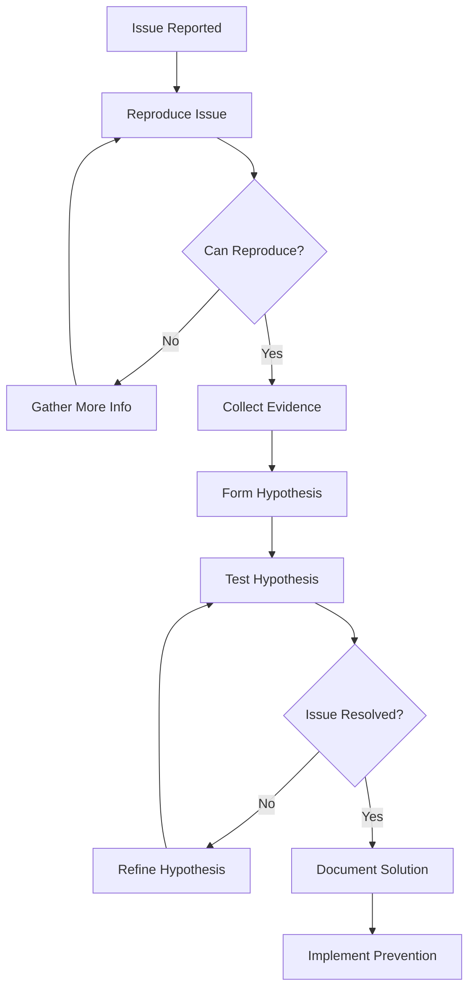

# Debugging & Troubleshooting Guide

## Overview

This guide provides systematic approaches for debugging applications, diagnosing performance issues, and troubleshooting common problems across the Tolstoy platform stack.

## Debugging Philosophy

### 1. Systematic Approach

<CardGroup cols={2}>
  <Card title="Reproduce Consistently" icon="repeat">
    Always try to reproduce the issue reliably before investigating
  </Card>
  <Card title="Narrow the Scope" icon="funnel">
    Use binary search approach to isolate the problem area
  </Card>
  <Card title="Gather Evidence" icon="magnifying-glass">
    Collect logs, metrics, and traces before making assumptions
  </Card>
  <Card title="Form Hypotheses" icon="lightbulb">
    Make educated guesses about root causes and test them systematically
  </Card>
</CardGroup>

### 2. Debugging Workflow



## Application Debugging

### 1. Node.js Debugging

<Tabs>
  <Tab title="Debug Configuration">
    ```javascript
    // package.json debug scripts
    {
      "scripts": {
        "debug": "node --inspect=0.0.0.0:9229 dist/index.js",
        "debug:break": "node --inspect-brk=0.0.0.0:9229 dist/index.js",
        "debug:dev": "nodemon --exec 'node --inspect=0.0.0.0:9229' src/index.ts",
        "debug:test": "node --inspect-brk=0.0.0.0:9229 node_modules/.bin/jest --runInBand"
      }
    }
    
    // VS Code launch.json
    {
      "version": "0.2.0",
      "configurations": [
        {
          "name": "Debug Application",
          "type": "node",
          "request": "attach",
          "port": 9229,
          "restart": true,
          "localRoot": "${workspaceFolder}",
          "remoteRoot": "/app",
          "skipFiles": ["<node_internals>/**"]
        },
        {
          "name": "Debug Tests",
          "type": "node",
          "request": "launch",
          "program": "${workspaceFolder}/node_modules/.bin/jest",
          "args": ["--runInBand", "--testPathPattern", "${input:testFile}"],
          "console": "integratedTerminal",
          "internalConsoleOptions": "neverOpen"
        },
        {
          "name": "Debug Single Test",
          "type": "node",
          "request": "launch",
          "program": "${workspaceFolder}/node_modules/.bin/jest",
          "args": ["--runInBand", "${file}"],
          "console": "integratedTerminal"
        }
      ]
    }
    ```
  </Tab>
  
  <Tab title="Debugging Techniques">
    ```typescript
    // Strategic console.log debugging
    class WorkflowService {
      async executeWorkflow(workflowId: string, input: any): Promise<ExecutionResult> {
        // Add context to logs
        console.log(`🚀 [${workflowId}] Starting workflow execution`, { 
          workflowId, 
          inputKeys: Object.keys(input),
          timestamp: new Date().toISOString()
        });
        
        try {
          // Validate input
          const validationResult = this.validateInput(input);
          console.log(`✅ [${workflowId}] Input validation`, { validationResult });
          
          // Load workflow
          const workflow = await this.workflowRepository.findById(workflowId);
          console.log(`📋 [${workflowId}] Workflow loaded`, { 
            steps: workflow.definition.steps.length,
            version: workflow.version 
          });
          
          // Execute steps
          const results = [];
          for (const [index, step] of workflow.definition.steps.entries()) {
            console.log(`🔧 [${workflowId}] Executing step ${index + 1}/${workflow.definition.steps.length}`, {
              stepId: step.id,
              stepType: step.type
            });
            
            const stepResult = await this.executeStep(step, input, results);
            results.push(stepResult);
            
            console.log(`✨ [${workflowId}] Step ${index + 1} completed`, {
              stepId: step.id,
              duration: stepResult.duration,
              status: stepResult.status
            });
          }
          
          console.log(`🎉 [${workflowId}] Workflow execution completed`, { 
            totalSteps: results.length,
            totalDuration: results.reduce((sum, r) => sum + r.duration, 0)
          });
          
          return {
            id: generateId(),
            workflowId,
            status: 'completed',
            results
          };
          
        } catch (error) {
          console.error(`💥 [${workflowId}] Workflow execution failed`, {
            error: error.message,
            stack: error.stack,
            workflowId,
            input
          });
          throw error;
        }
      }
    }
    
    // Using Node.js debugger API
    const util = require('util');
    
    function debugObject(obj: any, label?: string) {
      console.log(`🔍 ${label || 'Debug Object'}:`);
      console.log(util.inspect(obj, { 
        colors: true, 
        depth: 3, 
        compact: false 
      }));
    }
    
    // Memory usage debugging
    function logMemoryUsage(label: string) {
      const used = process.memoryUsage();
      console.log(`📊 Memory Usage (${label}):`);
      for (let key in used) {
        console.log(`  ${key}: ${Math.round(used[key] / 1024 / 1024 * 100) / 100} MB`);
      }
    }
    
    // Performance timing
    function createTimer(label: string) {
      const start = process.hrtime.bigint();
      return {
        end: () => {
          const end = process.hrtime.bigint();
          const duration = Number(end - start) / 1000000; // Convert to milliseconds
          console.log(`⏱️  ${label}: ${duration.toFixed(2)}ms`);
          return duration;
        }
      };
    }
    
    // Usage
    const timer = createTimer('Database Query');
    const users = await userRepository.findAll();
    timer.end();
    ```
  </Tab>
  
  <Tab title="Remote Debugging">
    ```bash
    # Kubernetes debugging
    
    # Port forward to debug pod
    kubectl port-forward deployment/tolstoy-api 9229:9229 -n tolstoy-prod
    
    # Get pod logs with follow
    kubectl logs -f deployment/tolstoy-api -n tolstoy-prod --tail=100
    
    # Execute commands in pod
    kubectl exec -it deployment/tolstoy-api -n tolstoy-prod -- /bin/bash
    
    # Debug specific pod
    POD_NAME=$(kubectl get pods -n tolstoy-prod -l app=tolstoy-api -o jsonpath='{.items[0].metadata.name}')
    kubectl exec -it $POD_NAME -n tolstoy-prod -- node --version
    
    # Copy files from pod for analysis
    kubectl cp tolstoy-prod/$POD_NAME:/app/logs/error.log ./error.log
    
    # Docker debugging
    
    # Run container with debug port exposed
    docker run -p 9229:9229 -p 3000:3000 -e NODE_ENV=development tolstoy/api:latest
    
    # Debug running container
    docker exec -it container_name /bin/bash
    
    # View container logs
    docker logs -f container_name --tail=100
    
    # Inspect container
    docker inspect container_name | jq '.[0].Config.Env'
    ```
  </Tab>
</Tabs>

### 2. Database Debugging

<Tabs>
  <Tab title="Query Analysis">
    ```sql
    -- Enable query logging for debugging
    ALTER SYSTEM SET log_statement = 'all';
    ALTER SYSTEM SET log_min_duration_statement = 0;
    SELECT pg_reload_conf();
    
    -- Monitor current queries
    SELECT 
        pid,
        usename,
        application_name,
        client_addr,
        query_start,
        state,
        left(query, 100) as query_preview
    FROM pg_stat_activity 
    WHERE state = 'active' 
        AND query NOT LIKE '%pg_stat_activity%'
    ORDER BY query_start;
    
    -- Find slow queries
    SELECT 
        query,
        calls,
        total_time,
        mean_time,
        max_time,
        stddev_time
    FROM pg_stat_statements 
    WHERE mean_time > 100  -- queries taking more than 100ms on average
    ORDER BY total_time DESC 
    LIMIT 20;
    
    -- Explain query plans
    EXPLAIN (ANALYZE, BUFFERS, VERBOSE, FORMAT JSON) 
    SELECT w.*, u.name as created_by_name
    FROM workflows w
    JOIN users u ON w.created_by = u.id
    WHERE w.organization_id = 'org-123'
        AND w.status = 'active'
    ORDER BY w.created_at DESC
    LIMIT 20;
    
    -- Check index usage
    SELECT 
        schemaname,
        tablename,
        indexname,
        idx_tup_read,
        idx_tup_fetch,
        idx_tup_read - idx_tup_fetch as unused_reads
    FROM pg_stat_user_indexes
    WHERE idx_tup_read > 0
    ORDER BY unused_reads DESC;
    
    -- Find missing indexes
    SELECT 
        schemaname,
        tablename,
        seq_scan,
        seq_tup_read,
        seq_tup_read / seq_scan as avg_tup_per_scan
    FROM pg_stat_user_tables
    WHERE seq_scan > 0
    ORDER BY seq_tup_read DESC;
    ```
  </Tab>
  
  <Tab title="Connection Debugging">
    ```typescript
    // Database connection debugging
    class DatabaseDebugger {
      private pool: Pool;
      
      constructor(pool: Pool) {
        this.pool = pool;
        this.setupEventListeners();
      }
      
      private setupEventListeners() {
        this.pool.on('connect', (client) => {
          console.log('🔗 Database client connected', {
            processID: client.processID,
            totalCount: this.pool.totalCount,
            idleCount: this.pool.idleCount,
            waitingCount: this.pool.waitingCount
          });
        });
        
        this.pool.on('acquire', (client) => {
          console.log('📤 Database client acquired', {
            processID: client.processID,
            totalCount: this.pool.totalCount,
            idleCount: this.pool.idleCount
          });
        });
        
        this.pool.on('release', (client) => {
          console.log('📥 Database client released', {
            processID: client.processID,
            totalCount: this.pool.totalCount,
            idleCount: this.pool.idleCount
          });
        });
        
        this.pool.on('error', (err, client) => {
          console.error('💥 Database pool error', {
            error: err.message,
            processID: client?.processID,
            totalCount: this.pool.totalCount
          });
        });
      }
      
      async debugQuery<T>(query: string, params?: any[]): Promise<T[]> {
        const client = await this.pool.connect();
        const queryId = Math.random().toString(36).substring(7);
        
        try {
          console.log(`🔍 [${queryId}] Executing query:`, {
            query: query.replace(/\s+/g, ' ').trim(),
            params: params?.map(p => typeof p === 'string' && p.length > 50 ? 
              p.substring(0, 50) + '...' : p
            )
          });
          
          const start = process.hrtime.bigint();
          const result = await client.query(query, params);
          const duration = Number(process.hrtime.bigint() - start) / 1000000;
          
          console.log(`✅ [${queryId}] Query completed:`, {
            rowCount: result.rowCount,
            duration: `${duration.toFixed(2)}ms`,
            command: result.command
          });
          
          return result.rows;
        } catch (error) {
          console.error(`💥 [${queryId}] Query failed:`, {
            error: error.message,
            code: error.code,
            detail: error.detail,
            hint: error.hint,
            position: error.position
          });
          throw error;
        } finally {
          client.release();
        }
      }
      
      async getPoolStatus() {
        return {
          totalCount: this.pool.totalCount,
          idleCount: this.pool.idleCount,
          waitingCount: this.pool.waitingCount,
          maxConnections: this.pool.options.max,
          minConnections: this.pool.options.min
        };
      }
    }
    
    // Connection leak detection
    class ConnectionLeakDetector {
      private activeConnections = new Map<number, { 
        processID: number;
        acquiredAt: Date;
        stack: string;
      }>();
      
      trackConnection(client: any) {
        const stack = new Error().stack;
        this.activeConnections.set(client.processID, {
          processID: client.processID,
          acquiredAt: new Date(),
          stack: stack || 'unknown'
        });
      }
      
      releaseConnection(client: any) {
        this.activeConnections.delete(client.processID);
      }
      
      detectLeaks(maxAgeMs: number = 30000) {
        const now = Date.now();
        const leaks = [];
        
        for (const [processID, info] of this.activeConnections) {
          const age = now - info.acquiredAt.getTime();
          if (age > maxAgeMs) {
            leaks.push({
              processID,
              age,
              stack: info.stack
            });
          }
        }
        
        if (leaks.length > 0) {
          console.warn('🚨 Connection leaks detected:', {
            count: leaks.length,
            leaks: leaks.map(l => ({
              processID: l.processID,
              ageSeconds: Math.round(l.age / 1000),
              stackPreview: l.stack.split('\n').slice(1, 4).join('\n')
            }))
          });
        }
        
        return leaks;
      }
    }
    ```
  </Tab>
  
  <Tab title="Transaction Debugging">
    ```typescript
    // Transaction debugging wrapper
    class TransactionDebugger {
      private db: DatabaseConnection;
      
      constructor(db: DatabaseConnection) {
        this.db = db;
      }
      
      async debugTransaction<T>(
        name: string,
        operation: (tx: Transaction) => Promise<T>
      ): Promise<T> {
        const transactionId = Math.random().toString(36).substring(7);
        
        console.log(`🔄 [${transactionId}] Starting transaction: ${name}`);
        
        const transaction = await this.db.transaction();
        const startTime = process.hrtime.bigint();
        
        try {
          // Add query logging to transaction
          const originalQuery = transaction.query.bind(transaction);
          let queryCount = 0;
          
          transaction.query = async (text: string, params?: any[]) => {
            queryCount++;
            const queryId = `${transactionId}-${queryCount}`;
            
            console.log(`  📝 [${queryId}] Transaction query:`, {
              query: text.replace(/\s+/g, ' ').trim().substring(0, 100),
              params: params?.length || 0
            });
            
            const queryStart = process.hrtime.bigint();
            const result = await originalQuery(text, params);
            const queryDuration = Number(process.hrtime.bigint() - queryStart) / 1000000;
            
            console.log(`  ✅ [${queryId}] Query completed: ${queryDuration.toFixed(2)}ms, ${result.rowCount} rows`);
            
            return result;
          };
          
          const result = await operation(transaction);
          
          await transaction.commit();
          
          const totalDuration = Number(process.hrtime.bigint() - startTime) / 1000000;
          console.log(`✅ [${transactionId}] Transaction committed: ${name}`, {
            duration: `${totalDuration.toFixed(2)}ms`,
            queries: queryCount
          });
          
          return result;
          
        } catch (error) {
          await transaction.rollback();
          
          const totalDuration = Number(process.hrtime.bigint() - startTime) / 1000000;
          console.error(`💥 [${transactionId}] Transaction rolled back: ${name}`, {
            duration: `${totalDuration.toFixed(2)}ms`,
            queries: queryCount,
            error: error.message
          });
          
          throw error;
        }
      }
    }
    
    // Usage
    const txDebugger = new TransactionDebugger(db);
    
    await txDebugger.debugTransaction('Create User with Workflows', async (tx) => {
      const user = await tx.users.create(userData);
      
      const workflows = await Promise.all(
        workflowsData.map(workflow => 
          tx.workflows.create({ ...workflow, createdBy: user.id })
        )
      );
      
      return { user, workflows };
    });
    ```
  </Tab>
</Tabs>

### 3. API Debugging

<Tabs>
  <Tab title="Request/Response Debugging">
    ```typescript
    // Enhanced logging middleware
    import { Request, Response, NextFunction } from 'express';
    import { v4 as uuidv4 } from 'uuid';
    
    interface DebugRequest extends Request {
      id: string;
      startTime: bigint;
    }
    
    export function debugLoggingMiddleware(
      req: DebugRequest, 
      res: Response, 
      next: NextFunction
    ) {
      req.id = uuidv4().substring(0, 8);
      req.startTime = process.hrtime.bigint();
      
      // Log request
      console.log(`📥 [${req.id}] ${req.method} ${req.url}`, {
        headers: filterSensitiveHeaders(req.headers),
        query: req.query,
        body: filterSensitiveBody(req.body),
        ip: req.ip,
        userAgent: req.headers['user-agent']
      });
      
      // Capture response
      const originalJson = res.json;
      res.json = function(body: any) {
        const duration = Number(process.hrtime.bigint() - req.startTime) / 1000000;
        
        console.log(`📤 [${req.id}] Response ${res.statusCode}`, {
          duration: `${duration.toFixed(2)}ms`,
          contentLength: JSON.stringify(body).length,
          body: res.statusCode >= 400 ? body : filterLargeResponse(body)
        });
        
        return originalJson.call(this, body);
      };
      
      next();
    }
    
    function filterSensitiveHeaders(headers: any) {
      const filtered = { ...headers };
      const sensitiveHeaders = ['authorization', 'cookie', 'x-api-key'];
      
      sensitiveHeaders.forEach(header => {
        if (filtered[header]) {
          filtered[header] = '[REDACTED]';
        }
      });
      
      return filtered;
    }
    
    function filterSensitiveBody(body: any) {
      if (!body || typeof body !== 'object') return body;
      
      const filtered = { ...body };
      const sensitiveFields = ['password', 'token', 'secret', 'apiKey'];
      
      sensitiveFields.forEach(field => {
        if (filtered[field]) {
          filtered[field] = '[REDACTED]';
        }
      });
      
      return filtered;
    }
    
    function filterLargeResponse(body: any) {
      const bodyStr = JSON.stringify(body);
      if (bodyStr.length > 1000) {
        return {
          _debug: `Response too large (${bodyStr.length} chars), truncated`,
          ...Object.fromEntries(Object.entries(body).slice(0, 3))
        };
      }
      return body;
    }
    ```
  </Tab>
  
  <Tab title="Error Debugging">
    ```typescript
    // Enhanced error handler with debugging info
    export function debugErrorHandler(
      error: Error,
      req: DebugRequest,
      res: Response,
      next: NextFunction
    ) {
      const errorId = uuidv4().substring(0, 8);
      
      // Collect debug information
      const debugInfo = {
        errorId,
        requestId: req.id,
        timestamp: new Date().toISOString(),
        error: {
          name: error.name,
          message: error.message,
          stack: error.stack
        },
        request: {
          method: req.method,
          url: req.url,
          headers: filterSensitiveHeaders(req.headers),
          body: filterSensitiveBody(req.body),
          params: req.params,
          query: req.query,
          user: req.user?.id
        },
        system: {
          nodeVersion: process.version,
          platform: process.platform,
          memory: process.memoryUsage(),
          uptime: process.uptime()
        }
      };
      
      // Log error with full context
      console.error(`💥 [${errorId}] Unhandled error:`, debugInfo);
      
      // Send to error tracking service
      if (process.env.NODE_ENV === 'production') {
        sendErrorToTracking(debugInfo);
      }
      
      // Return appropriate response
      const statusCode = getErrorStatusCode(error);
      res.status(statusCode).json({
        success: false,
        error: {
          code: error.name || 'INTERNAL_SERVER_ERROR',
          message: statusCode === 500 ? 'An internal server error occurred' : error.message,
          ...(process.env.NODE_ENV === 'development' && { 
            stack: error.stack,
            debugInfo 
          })
        },
        meta: {
          errorId,
          requestId: req.id,
          timestamp: debugInfo.timestamp
        }
      });
    }
    
    function getErrorStatusCode(error: Error): number {
      const errorStatusMap: Record<string, number> = {
        ValidationError: 400,
        UnauthorizedError: 401,
        ForbiddenError: 403,
        NotFoundError: 404,
        ConflictError: 409,
        RateLimitError: 429
      };
      
      return errorStatusMap[error.name] || 500;
    }
    
    async function sendErrorToTracking(debugInfo: any) {
      try {
        // Send to Sentry, DataDog, etc.
        await fetch('https://error-tracking-service.com/errors', {
          method: 'POST',
          headers: { 'Content-Type': 'application/json' },
          body: JSON.stringify(debugInfo)
        });
      } catch (trackingError) {
        console.error('Failed to send error to tracking service:', trackingError);
      }
    }
    ```
  </Tab>
  
  <Tab title="Performance Debugging">
    ```typescript
    // API performance debugging middleware
    export function performanceDebugMiddleware(
      req: DebugRequest,
      res: Response,
      next: NextFunction
    ) {
      const metrics = {
        startTime: process.hrtime.bigint(),
        startMemory: process.memoryUsage(),
        startCpuUsage: process.cpuUsage()
      };
      
      // Track database queries
      const dbQueries: Array<{
        query: string;
        duration: number;
        rowCount: number;
      }> = [];
      
      // Monkey patch database query method (if using a specific ORM)
      const originalQuery = global.db?.query?.bind(global.db);
      if (originalQuery) {
        global.db.query = async (...args: any[]) => {
          const queryStart = process.hrtime.bigint();
          const result = await originalQuery(...args);
          const queryDuration = Number(process.hrtime.bigint() - queryStart) / 1000000;
          
          dbQueries.push({
            query: args[0]?.substring(0, 100) || 'unknown',
            duration: queryDuration,
            rowCount: result.rowCount || 0
          });
          
          return result;
        };
      }
      
      // Override response to capture metrics
      const originalJson = res.json;
      res.json = function(body: any) {
        const endTime = process.hrtime.bigint();
        const endMemory = process.memoryUsage();
        const endCpuUsage = process.cpuUsage(metrics.startCpuUsage);
        
        const totalDuration = Number(endTime - metrics.startTime) / 1000000;
        const memoryDelta = endMemory.heapUsed - metrics.startMemory.heapUsed;
        
        const performanceMetrics = {
          requestId: req.id,
          totalDuration: `${totalDuration.toFixed(2)}ms`,
          memoryUsage: {
            start: Math.round(metrics.startMemory.heapUsed / 1024 / 1024),
            end: Math.round(endMemory.heapUsed / 1024 / 1024),
            delta: Math.round(memoryDelta / 1024 / 1024)
          },
          cpuUsage: {
            user: endCpuUsage.user,
            system: endCpuUsage.system
          },
          database: {
            queryCount: dbQueries.length,
            totalQueryTime: dbQueries.reduce((sum, q) => sum + q.duration, 0).toFixed(2),
            slowQueries: dbQueries.filter(q => q.duration > 100).length
          }
        };
        
        // Log performance warnings
        if (totalDuration > 1000) {
          console.warn(`🐌 [${req.id}] Slow request detected:`, performanceMetrics);
        }
        
        if (memoryDelta > 10 * 1024 * 1024) { // 10MB
          console.warn(`🚨 [${req.id}] High memory usage:`, performanceMetrics);
        }
        
        if (dbQueries.length > 10) {
          console.warn(`🔍 [${req.id}] High query count:`, performanceMetrics);
        }
        
        // Add performance headers in development
        if (process.env.NODE_ENV === 'development') {
          res.setHeader('X-Response-Time', `${totalDuration.toFixed(2)}ms`);
          res.setHeader('X-Database-Queries', dbQueries.length.toString());
          res.setHeader('X-Memory-Delta', `${Math.round(memoryDelta / 1024 / 1024)}MB`);
        }
        
        // Restore original query method
        if (originalQuery) {
          global.db.query = originalQuery;
        }
        
        return originalJson.call(this, body);
      };
      
      next();
    }
    ```
  </Tab>
</Tabs>

## Common Issues & Solutions

### 1. Memory Leaks

<AccordionGroup>
  <Accordion title="Detecting Memory Leaks">
    ```javascript
    // Memory leak detection utilities
    class MemoryLeakDetector {
      private snapshots: Array<{
        timestamp: Date;
        heapUsed: number;
        external: number;
        handles: number;
        requests: number;
      }> = [];
      
      startMonitoring(intervalMs: number = 60000) {
        setInterval(() => {
          const memUsage = process.memoryUsage();
          const snapshot = {
            timestamp: new Date(),
            heapUsed: memUsage.heapUsed,
            external: memUsage.external,
            handles: process._getActiveHandles().length,
            requests: process._getActiveRequests().length
          };
          
          this.snapshots.push(snapshot);
          
          // Keep only last 100 snapshots
          if (this.snapshots.length > 100) {
            this.snapshots.shift();
          }
          
          this.detectLeaks();
        }, intervalMs);
      }
      
      private detectLeaks() {
        if (this.snapshots.length < 10) return;
        
        const recent = this.snapshots.slice(-10);
        const trend = this.calculateTrend(recent.map(s => s.heapUsed));
        
        if (trend > 1024 * 1024) { // 1MB growth trend
          console.warn('🚨 Potential memory leak detected:', {
            currentHeap: Math.round(recent[recent.length - 1].heapUsed / 1024 / 1024),
            growthTrend: Math.round(trend / 1024 / 1024),
            activeHandles: recent[recent.length - 1].handles,
            activeRequests: recent[recent.length - 1].requests
          });
        }
      }
      
      private calculateTrend(values: number[]): number {
        const n = values.length;
        const sumX = n * (n + 1) / 2;
        const sumY = values.reduce((sum, val) => sum + val, 0);
        const sumXY = values.reduce((sum, val, i) => sum + (i + 1) * val, 0);
        const sumX2 = n * (n + 1) * (2 * n + 1) / 6;
        
        return (n * sumXY - sumX * sumY) / (n * sumX2 - sumX * sumX);
      }
      
      generateHeapSnapshot(filename?: string) {
        const heapdump = require('heapdump');
        const file = filename || `heapdump-${Date.now()}.heapsnapshot`;
        heapdump.writeSnapshot(file);
        console.log(`📸 Heap snapshot saved to ${file}`);
        return file;
      }
    }
    
    // Usage
    const detector = new MemoryLeakDetector();
    detector.startMonitoring(30000); // Check every 30 seconds
    ```
  </Accordion>
  
  <Accordion title="Common Memory Leak Patterns">
    ```typescript
    // Event listener leaks
    class EventEmitterLeakExample {
      private eventEmitter = new EventEmitter();
      
      // ❌ Memory leak - listeners never removed
      badPattern() {
        setInterval(() => {
          const handler = (data: any) => console.log(data);
          this.eventEmitter.on('data', handler);
          // handler is never removed, accumulates over time
        }, 1000);
      }
      
      // ✅ Proper cleanup
      goodPattern() {
        const handler = (data: any) => console.log(data);
        this.eventEmitter.on('data', handler);
        
        // Always remove listeners
        setTimeout(() => {
          this.eventEmitter.removeListener('data', handler);
        }, 5000);
      }
    }
    
    // Closure leaks
    class ClosureLeakExample {
      // ❌ Memory leak - closures retain references
      badPattern() {
        const largeData = new Array(1000000).fill('data');
        
        return {
          // This closure keeps largeData in memory even if unused
          doSomething: () => {
            console.log('doing something');
          },
          getData: () => largeData // Only this method needs largeData
        };
      }
      
      // ✅ Avoid unnecessary closures
      goodPattern() {
        const largeData = new Array(1000000).fill('data');
        
        return {
          doSomething: () => {
            console.log('doing something');
          },
          getData: (() => {
            const data = largeData; // Copy reference in limited scope
            return () => data;
          })()
        };
      }
    }
    
    // Global variable leaks
    class GlobalLeakExample {
      // ❌ Memory leak - globals never cleaned up
      badPattern() {
        (global as any).cache = (global as any).cache || {};
        (global as any).cache[Math.random()] = new Array(100000).fill('data');
        // Cache grows indefinitely
      }
      
      // ✅ Bounded cache
      goodPattern() {
        const cache = new Map();
        const maxSize = 100;
        
        const key = Math.random().toString();
        const value = new Array(100000).fill('data');
        
        if (cache.size >= maxSize) {
          const firstKey = cache.keys().next().value;
          cache.delete(firstKey);
        }
        
        cache.set(key, value);
      }
    }
    ```
  </Accordion>
</AccordionGroup>

### 2. Performance Issues

<AccordionGroup>
  <Accordion title="Database N+1 Query Problem">
    ```typescript
    // N+1 Query Problem Example & Solution
    class WorkflowService {
      // ❌ N+1 Problem - Makes N+1 database queries
      async getWorkflowsWithCreatorBad(organizationId: string) {
        const workflows = await this.workflowRepository.findByOrganization(organizationId);
        
        const workflowsWithCreator = [];
        for (const workflow of workflows) {
          // This creates N additional queries
          const creator = await this.userRepository.findById(workflow.createdBy);
          workflowsWithCreator.push({
            ...workflow,
            creator: creator.name
          });
        }
        
        return workflowsWithCreator;
      }
      
      // ✅ Solution - Use JOIN or batch loading
      async getWorkflowsWithCreatorGood(organizationId: string) {
        // Option 1: Use JOIN query
        const workflows = await this.workflowRepository.findByOrganizationWithCreator(organizationId);
        return workflows;
      }
      
      // Alternative: DataLoader pattern for batch loading
      async getWorkflowsWithCreatorBatched(organizationId: string) {
        const workflows = await this.workflowRepository.findByOrganization(organizationId);
        
        // Collect all unique creator IDs
        const creatorIds = [...new Set(workflows.map(w => w.createdBy))];
        
        // Batch load all creators in one query
        const creators = await this.userRepository.findByIds(creatorIds);
        const creatorMap = new Map(creators.map(c => [c.id, c]));
        
        // Map creators to workflows
        return workflows.map(workflow => ({
          ...workflow,
          creator: creatorMap.get(workflow.createdBy)?.name || 'Unknown'
        }));
      }
    }
    ```
  </Accordion>
  
  <Accordion title="Inefficient Loops and Operations">
    ```typescript
    // Performance optimization examples
    class PerformanceOptimizer {
      // ❌ Inefficient - O(n²) complexity
      findDuplicateWorkflowsBad(workflows: Workflow[]): Workflow[] {
        const duplicates: Workflow[] = [];
        
        for (let i = 0; i < workflows.length; i++) {
          for (let j = i + 1; j < workflows.length; j++) {
            if (workflows[i].name === workflows[j].name) {
              duplicates.push(workflows[j]);
            }
          }
        }
        
        return duplicates;
      }
      
      // ✅ Efficient - O(n) complexity using Map
      findDuplicateWorkflowsGood(workflows: Workflow[]): Workflow[] {
        const nameCount = new Map<string, Workflow[]>();
        const duplicates: Workflow[] = [];
        
        // Single pass to group by name
        for (const workflow of workflows) {
          const existing = nameCount.get(workflow.name) || [];
          existing.push(workflow);
          nameCount.set(workflow.name, existing);
        }
        
        // Extract duplicates
        for (const [name, group] of nameCount) {
          if (group.length > 1) {
            duplicates.push(...group.slice(1)); // Skip first occurrence
          }
        }
        
        return duplicates;
      }
      
      // ❌ Inefficient - Multiple array iterations
      processWorkflowDataBad(workflows: Workflow[]) {
        const activeWorkflows = workflows.filter(w => w.status === 'active');
        const workflowNames = activeWorkflows.map(w => w.name);
        const totalSteps = activeWorkflows.reduce((sum, w) => sum + w.definition.steps.length, 0);
        const avgSteps = totalSteps / activeWorkflows.length;
        
        return { workflowNames, totalSteps, avgSteps };
      }
      
      // ✅ Efficient - Single pass
      processWorkflowDataGood(workflows: Workflow[]) {
        let totalSteps = 0;
        let activeCount = 0;
        const workflowNames: string[] = [];
        
        for (const workflow of workflows) {
          if (workflow.status === 'active') {
            workflowNames.push(workflow.name);
            totalSteps += workflow.definition.steps.length;
            activeCount++;
          }
        }
        
        return {
          workflowNames,
          totalSteps,
          avgSteps: activeCount > 0 ? totalSteps / activeCount : 0
        };
      }
      
      // Async operations optimization
      // ❌ Sequential - slow
      async executeWorkflowsSequentiallyBad(workflowIds: string[]) {
        const results = [];
        for (const id of workflowIds) {
          const result = await this.executeWorkflow(id);
          results.push(result);
        }
        return results;
      }
      
      // ✅ Concurrent with limit - fast but controlled
      async executeWorkflowsConcurrentlyGood(workflowIds: string[], concurrency = 5) {
        const results = [];
        
        for (let i = 0; i < workflowIds.length; i += concurrency) {
          const batch = workflowIds.slice(i, i + concurrency);
          const batchResults = await Promise.all(
            batch.map(id => this.executeWorkflow(id))
          );
          results.push(...batchResults);
        }
        
        return results;
      }
    }
    ```
  </Accordion>
</AccordionGroup>

### 3. Distributed System Issues

<AccordionGroup>
  <Accordion title="Service Communication Debugging">
    ```typescript
    // Service communication debugging
    class ServiceCommunicationDebugger {
      private httpClient: AxiosInstance;
      
      constructor() {
        this.httpClient = axios.create({
          timeout: 30000,
          retry: 3
        });
        
        this.setupInterceptors();
      }
      
      private setupInterceptors() {
        // Request interceptor
        this.httpClient.interceptors.request.use(
          (config) => {
            const requestId = Math.random().toString(36).substring(7);
            config.metadata = { requestId, startTime: Date.now() };
            
            console.log(`🔄 [${requestId}] Outgoing request:`, {
              method: config.method?.toUpperCase(),
              url: config.url,
              baseURL: config.baseURL,
              headers: this.filterHeaders(config.headers),
              params: config.params,
              dataSize: config.data ? JSON.stringify(config.data).length : 0
            });
            
            // Add correlation ID for tracing
            config.headers = {
              ...config.headers,
              'X-Correlation-ID': requestId,
              'X-Request-Source': 'tolstoy-api'
            };
            
            return config;
          },
          (error) => {
            console.error('🚨 Request setup failed:', error.message);
            return Promise.reject(error);
          }
        );
        
        // Response interceptor
        this.httpClient.interceptors.response.use(
          (response) => {
            const { requestId, startTime } = response.config.metadata || {};
            const duration = startTime ? Date.now() - startTime : 0;
            
            console.log(`✅ [${requestId}] Response received:`, {
              status: response.status,
              statusText: response.statusText,
              duration: `${duration}ms`,
              responseSize: JSON.stringify(response.data).length,
              headers: this.filterHeaders(response.headers)
            });
            
            return response;
          },
          (error) => {
            const { requestId, startTime } = error.config?.metadata || {};
            const duration = startTime ? Date.now() - startTime : 0;
            
            if (error.response) {
              console.error(`❌ [${requestId}] Response error:`, {
                status: error.response.status,
                statusText: error.response.statusText,
                duration: `${duration}ms`,
                data: error.response.data,
                url: error.config?.url
              });
            } else if (error.request) {
              console.error(`🔌 [${requestId}] Network error:`, {
                duration: `${duration}ms`,
                code: error.code,
                message: error.message,
                url: error.config?.url
              });
            } else {
              console.error(`🚫 [${requestId}] Request setup error:`, {
                message: error.message,
                url: error.config?.url
              });
            }
            
            return Promise.reject(error);
          }
        );
      }
      
      private filterHeaders(headers: any): any {
        const filtered = { ...headers };
        const sensitiveHeaders = ['authorization', 'x-api-key', 'cookie'];
        
        sensitiveHeaders.forEach(header => {
          if (filtered[header]) {
            filtered[header] = '[REDACTED]';
          }
        });
        
        return filtered;
      }
      
      // Circuit breaker pattern for debugging service failures
      async callWithCircuitBreaker<T>(
        serviceName: string,
        operation: () => Promise<T>,
        options = { failureThreshold: 5, resetTimeout: 60000 }
      ): Promise<T> {
        const circuitState = this.getCircuitState(serviceName);
        
        if (circuitState.isOpen) {
          const timeSinceOpened = Date.now() - circuitState.openedAt;
          if (timeSinceOpened < options.resetTimeout) {
            console.warn(`🔴 [${serviceName}] Circuit breaker OPEN, rejecting call`);
            throw new Error(`Service ${serviceName} circuit breaker is open`);
          } else {
            // Try to close circuit
            circuitState.isOpen = false;
            circuitState.halfOpen = true;
            console.log(`🟡 [${serviceName}] Circuit breaker HALF-OPEN, trying request`);
          }
        }
        
        try {
          const result = await operation();
          
          if (circuitState.halfOpen) {
            console.log(`🟢 [${serviceName}] Circuit breaker CLOSED, service recovered`);
            circuitState.halfOpen = false;
            circuitState.failures = 0;
          }
          
          return result;
        } catch (error) {
          circuitState.failures++;
          
          if (circuitState.failures >= options.failureThreshold) {
            circuitState.isOpen = true;
            circuitState.openedAt = Date.now();
            console.error(`🔴 [${serviceName}] Circuit breaker OPENED due to failures:`, {
              failures: circuitState.failures,
              threshold: options.failureThreshold
            });
          }
          
          throw error;
        }
      }
      
      private circuitStates = new Map<string, {
        isOpen: boolean;
        halfOpen: boolean;
        failures: number;
        openedAt: number;
      }>();
      
      private getCircuitState(serviceName: string) {
        if (!this.circuitStates.has(serviceName)) {
          this.circuitStates.set(serviceName, {
            isOpen: false,
            halfOpen: false,
            failures: 0,
            openedAt: 0
          });
        }
        return this.circuitStates.get(serviceName)!;
      }
    }
    ```
  </Accordion>
  
  <Accordion title="Message Queue Debugging">
    ```typescript
    // Message queue debugging utilities
    class QueueDebugger {
      private redis: Redis;
      private queues = new Map<string, any>();
      
      constructor(redis: Redis) {
        this.redis = redis;
      }
      
      async debugQueue(queueName: string): Promise<QueueDebugInfo> {
        const queueInfo = {
          name: queueName,
          length: await this.redis.llen(queueName),
          processingLength: await this.redis.llen(`${queueName}:processing`),
          failedLength: await this.redis.llen(`${queueName}:failed`),
          delayedLength: await this.redis.zcard(`${queueName}:delayed`),
          completedLength: await this.redis.llen(`${queueName}:completed`)
        };
        
        console.log(`📊 Queue Debug Info [${queueName}]:`, queueInfo);
        
        // Get sample jobs
        const pendingJobs = await this.redis.lrange(queueName, 0, 4);
        const processingJobs = await this.redis.lrange(`${queueName}:processing`, 0, 4);
        const failedJobs = await this.redis.lrange(`${queueName}:failed`, 0, 4);
        
        console.log(`📝 Sample Jobs [${queueName}]:`, {
          pending: pendingJobs.map(job => JSON.parse(job)),
          processing: processingJobs.map(job => JSON.parse(job)),
          failed: failedJobs.map(job => JSON.parse(job))
        });
        
        return {
          ...queueInfo,
          samples: {
            pending: pendingJobs.map(job => JSON.parse(job)),
            processing: processingJobs.map(job => JSON.parse(job)),
            failed: failedJobs.map(job => JSON.parse(job))
          }
        };
      }
      
      async debugStuckJobs(queueName: string, stuckThresholdMs = 300000) {
        const processingJobs = await this.redis.lrange(`${queueName}:processing`, 0, -1);
        const stuckJobs = [];
        
        for (const jobData of processingJobs) {
          try {
            const job = JSON.parse(jobData);
            const processingTime = Date.now() - job.processedAt;
            
            if (processingTime > stuckThresholdMs) {
              stuckJobs.push({
                ...job,
                stuckFor: processingTime,
                stuckForHuman: `${Math.round(processingTime / 1000 / 60)} minutes`
              });
            }
          } catch (error) {
            console.error(`Failed to parse job data:`, { jobData, error: error.message });
          }
        }
        
        if (stuckJobs.length > 0) {
          console.warn(`🚨 Found ${stuckJobs.length} stuck jobs in queue [${queueName}]:`, stuckJobs);
        }
        
        return stuckJobs;
      }
      
      async debugJobExecution(queueName: string, jobId: string) {
        console.log(`🔍 Debugging job execution [${jobId}]:`);
        
        // Check all possible locations for the job
        const locations = [
          queueName,
          `${queueName}:processing`,
          `${queueName}:completed`,
          `${queueName}:failed`
        ];
        
        for (const location of locations) {
          const jobs = await this.redis.lrange(location, 0, -1);
          const job = jobs.find(jobData => {
            try {
              const parsed = JSON.parse(jobData);
              return parsed.id === jobId;
            } catch {
              return false;
            }
          });
          
          if (job) {
            console.log(`📍 Job found in ${location}:`, JSON.parse(job));
            return { location, job: JSON.parse(job) };
          }
        }
        
        // Check delayed queue
        const delayedJobs = await this.redis.zrange(`${queueName}:delayed`, 0, -1, 'WITHSCORES');
        for (let i = 0; i < delayedJobs.length; i += 2) {
          const jobData = delayedJobs[i];
          const score = delayedJobs[i + 1];
          
          try {
            const job = JSON.parse(jobData);
            if (job.id === jobId) {
              console.log(`📍 Job found in delayed queue:`, {
                job,
                delayUntil: new Date(parseInt(score)),
                delayRemaining: Math.max(0, parseInt(score) - Date.now())
              });
              return { location: `${queueName}:delayed`, job, delayUntil: new Date(parseInt(score)) };
            }
          } catch (error) {
            continue;
          }
        }
        
        console.log(`❓ Job [${jobId}] not found in any queue location`);
        return null;
      }
    }
    
    interface QueueDebugInfo {
      name: string;
      length: number;
      processingLength: number;
      failedLength: number;
      delayedLength: number;
      completedLength: number;
      samples: {
        pending: any[];
        processing: any[];
        failed: any[];
      };
    }
    ```
  </Accordion>
</AccordionGroup>

## Debugging Tools & Techniques

### 1. Logging Best Practices

```typescript
// Structured logging with Winston
import winston from 'winston';

const logger = winston.createLogger({
  level: process.env.LOG_LEVEL || 'info',
  format: winston.format.combine(
    winston.format.timestamp(),
    winston.format.errors({ stack: true }),
    winston.format.json(),
    winston.format.printf(({ timestamp, level, message, ...meta }) => {
      return JSON.stringify({
        timestamp,
        level,
        message,
        ...meta,
        // Add correlation ID from request context
        correlationId: getCorrelationId(),
        service: 'tolstoy-api'
      });
    })
  ),
  defaultMeta: { service: 'tolstoy-api' },
  transports: [
    new winston.transports.File({ filename: 'logs/error.log', level: 'error' }),
    new winston.transports.File({ filename: 'logs/combined.log' }),
    new winston.transports.Console({
      format: winston.format.combine(
        winston.format.colorize(),
        winston.format.simple()
      )
    })
  ]
});

// Debugging logger with context
export class ContextualLogger {
  constructor(private context: Record<string, any> = {}) {}
  
  withContext(additionalContext: Record<string, any>) {
    return new ContextualLogger({ ...this.context, ...additionalContext });
  }
  
  debug(message: string, meta?: Record<string, any>) {
    logger.debug(message, { ...this.context, ...meta });
  }
  
  info(message: string, meta?: Record<string, any>) {
    logger.info(message, { ...this.context, ...meta });
  }
  
  warn(message: string, meta?: Record<string, any>) {
    logger.warn(message, { ...this.context, ...meta });
  }
  
  error(message: string, error?: Error, meta?: Record<string, any>) {
    logger.error(message, { 
      ...this.context, 
      ...meta, 
      error: error ? {
        name: error.name,
        message: error.message,
        stack: error.stack
      } : undefined 
    });
  }
}

// Usage
const workflowLogger = new ContextualLogger({ 
  component: 'WorkflowService',
  workflowId: 'workflow-123'
});

workflowLogger.info('Starting workflow execution');
workflowLogger.error('Workflow execution failed', error, { step: 'validation' });
```

### 2. Distributed Tracing

```typescript
// OpenTelemetry tracing setup
import { NodeSDK } from '@opentelemetry/sdk-node';
import { JaegerExporter } from '@opentelemetry/exporter-jaeger';
import { Resource } from '@opentelemetry/resources';
import { SemanticResourceAttributes } from '@opentelemetry/semantic-conventions';

const sdk = new NodeSDK({
  resource: new Resource({
    [SemanticResourceAttributes.SERVICE_NAME]: 'tolstoy-api',
    [SemanticResourceAttributes.SERVICE_VERSION]: process.env.APP_VERSION,
  }),
  traceExporter: new JaegerExporter({
    endpoint: process.env.JAEGER_ENDPOINT,
  }),
});

sdk.start();

// Custom tracing utilities
import { trace, SpanKind, SpanStatusCode } from '@opentelemetry/api';

export class TracingDebugger {
  private tracer = trace.getTracer('tolstoy-debug');
  
  async traceOperation<T>(
    operationName: string,
    operation: () => Promise<T>,
    attributes?: Record<string, any>
  ): Promise<T> {
    const span = this.tracer.startSpan(operationName, {
      kind: SpanKind.INTERNAL,
      attributes
    });
    
    try {
      span.addEvent('operation.started');
      const result = await operation();
      
      span.setStatus({ code: SpanStatusCode.OK });
      span.addEvent('operation.completed');
      
      return result;
    } catch (error) {
      span.setStatus({
        code: SpanStatusCode.ERROR,
        message: error.message
      });
      
      span.recordException(error);
      span.addEvent('operation.failed', {
        error: error.message
      });
      
      throw error;
    } finally {
      span.end();
    }
  }
  
  addDebugEvent(name: string, attributes?: Record<string, any>) {
    const span = trace.getActiveSpan();
    if (span) {
      span.addEvent(name, attributes);
    }
  }
}
```

---

<Note>
This debugging guide provides systematic approaches for troubleshooting issues across the Tolstoy platform. Regular practice with these techniques and tools will improve debugging efficiency and help prevent issues from reaching production.
</Note>