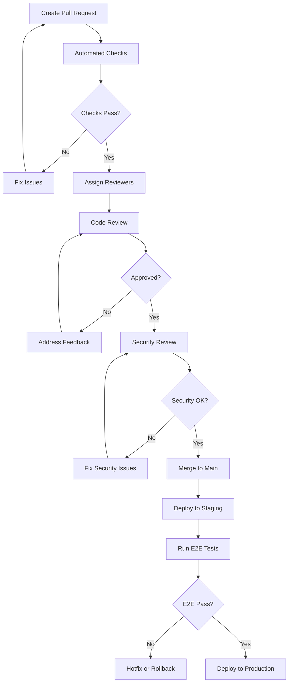

# Coding Standards & Guidelines

## Overview

This document establishes coding standards and best practices for all development work on the Tolstoy platform. These standards ensure code consistency, maintainability, and quality across the entire codebase.

## General Principles

### 1. Code Quality Principles

<CardGroup cols={2}>
  <Card title="Readability First" icon="book-open">
    Code should be written for humans to read and understand, not just for machines to execute.
  </Card>
  <Card title="Consistency" icon="equals">
    Follow established patterns and conventions throughout the codebase.
  </Card>
  <Card title="Simplicity" icon="minimize">
    Prefer simple, straightforward solutions over complex, clever ones.
  </Card>
  <Card title="Testing" icon="vial">
    All code should be thoroughly tested with appropriate test coverage.
  </Card>
</CardGroup>

### 2. SOLID Principles

```typescript
// ✅ Single Responsibility Principle
class UserService {
  constructor(private userRepository: UserRepository) {}
  
  async createUser(userData: CreateUserRequest): Promise<User> {
    // Only responsible for user creation logic
    return this.userRepository.create(userData);
  }
}

class UserValidator {
  static validate(userData: CreateUserRequest): ValidationResult {
    // Only responsible for user validation
    return this.validateFields(userData);
  }
}

// ✅ Open/Closed Principle
interface PaymentProcessor {
  processPayment(amount: number): Promise<PaymentResult>;
}

class StripeProcessor implements PaymentProcessor {
  async processPayment(amount: number): Promise<PaymentResult> {
    // Stripe-specific implementation
  }
}

class PayPalProcessor implements PaymentProcessor {
  async processPayment(amount: number): Promise<PaymentResult> {
    // PayPal-specific implementation
  }
}

// ✅ Dependency Inversion Principle
class OrderService {
  constructor(
    private paymentProcessor: PaymentProcessor,  // Depend on abstraction
    private orderRepository: OrderRepository
  ) {}
}
```

## Language-Specific Standards

### TypeScript/JavaScript

<Tabs>
  <Tab title="File Organization">
    ```typescript
    // ✅ Proper file structure
    
    // 1. External imports (third-party libraries)
    import express from 'express';
    import { z } from 'zod';
    import bcrypt from 'bcrypt';
    
    // 2. Internal imports (relative paths)
    import { UserService } from '../services/UserService';
    import { DatabaseConnection } from '../database/connection';
    import { logger } from '../utils/logger';
    
    // 3. Type definitions
    interface CreateUserRequest {
      email: string;
      password: string;
      name: string;
    }
    
    type UserRole = 'admin' | 'member' | 'viewer';
    
    // 4. Constants
    const DEFAULT_PAGE_SIZE = 20;
    const PASSWORD_MIN_LENGTH = 8;
    
    // 5. Implementation
    export class UserController {
      // Implementation here
    }
    
    // 6. Default export (if applicable)
    export default UserController;
    ```
  </Tab>
  
  <Tab title="Naming Conventions">
    ```typescript
    // ✅ Naming conventions
    
    // Classes: PascalCase
    class WorkflowEngine {}
    class DatabaseConnection {}
    
    // Interfaces: PascalCase with 'I' prefix (optional) or descriptive names
    interface User {}
    interface PaymentProvider {}
    
    // Functions and variables: camelCase
    const userName = 'john.doe';
    function calculateTotalAmount() {}
    
    // Constants: SCREAMING_SNAKE_CASE
    const MAX_RETRY_ATTEMPTS = 3;
    const API_BASE_URL = 'https://api.tolstoy.dev';
    
    // Enums: PascalCase with descriptive values
    enum WorkflowStatus {
      PENDING = 'pending',
      RUNNING = 'running',
      COMPLETED = 'completed',
      FAILED = 'failed'
    }
    
    // Files and directories: kebab-case
    // user-service.ts
    // workflow-engine/
    // api-client.ts
    
    // Database tables and columns: snake_case
    // users, workflow_executions, created_at, updated_at
    ```
  </Tab>
  
  <Tab title="Type Safety">
    ```typescript
    // ✅ Strict type safety
    
    // Use proper type definitions
    interface ApiResponse<T> {
      data: T;
      success: boolean;
      message?: string;
      errors?: string[];
    }
    
    // Avoid 'any' - use specific types
    ❌ function processData(data: any): any {
      return data.something;
    }
    
    ✅ function processData<T extends Record<string, unknown>>(
      data: T
    ): ProcessedData {
      return {
        processedAt: new Date(),
        originalData: data
      };
    }
    
    // Use type guards for runtime type checking
    function isValidUser(obj: unknown): obj is User {
      return (
        typeof obj === 'object' &&
        obj !== null &&
        'id' in obj &&
        'email' in obj &&
        typeof (obj as User).email === 'string'
      );
    }
    
    // Use discriminated unions for complex types
    type ActionResult = 
      | { success: true; data: any }
      | { success: false; error: string };
    
    // Strict null checks
    function findUser(id: string): User | null {
      // Implementation
      return user ?? null;
    }
    ```
  </Tab>
  
  <Tab title="Error Handling">
    ```typescript
    // ✅ Proper error handling
    
    // Custom error classes
    export class ValidationError extends Error {
      constructor(
        message: string,
        public field: string,
        public code: string = 'VALIDATION_ERROR'
      ) {
        super(message);
        this.name = 'ValidationError';
      }
    }
    
    export class NotFoundError extends Error {
      constructor(resource: string, id: string) {
        super(`${resource} with id ${id} not found`);
        this.name = 'NotFoundError';
      }
    }
    
    // Result pattern for operations that can fail
    type Result<T, E = Error> = 
      | { success: true; data: T }
      | { success: false; error: E };
    
    async function createUser(userData: CreateUserRequest): Promise<Result<User, ValidationError>> {
      try {
        // Validation
        const validationResult = UserValidator.validate(userData);
        if (!validationResult.isValid) {
          return {
            success: false,
            error: new ValidationError(validationResult.message, validationResult.field)
          };
        }
        
        // Business logic
        const user = await this.userService.create(userData);
        
        return { success: true, data: user };
      } catch (error) {
        // Log error for debugging
        logger.error('Failed to create user', { error, userData: { ...userData, password: '[REDACTED]' } });
        
        // Return structured error
        return {
          success: false,
          error: error instanceof Error ? error : new Error('Unknown error occurred')
        };
      }
    }
    
    // Usage
    const result = await createUser(userData);
    if (result.success) {
      // Handle success - TypeScript knows result.data is User
      console.log(`Created user: ${result.data.email}`);
    } else {
      // Handle error - TypeScript knows result.error is ValidationError
      console.error(`Validation failed: ${result.error.message}`);
    }
    ```
  </Tab>
</Tabs>

### Database & SQL

<Tabs>
  <Tab title="Schema Design">
    ```sql
    -- ✅ Proper table design
    
    -- Use descriptive table names (plural nouns)
    CREATE TABLE organizations (
        id UUID PRIMARY KEY DEFAULT gen_random_uuid(),
        name VARCHAR(255) NOT NULL,
        slug VARCHAR(255) UNIQUE NOT NULL,
        
        -- Metadata columns
        created_at TIMESTAMP WITH TIME ZONE DEFAULT NOW() NOT NULL,
        updated_at TIMESTAMP WITH TIME ZONE DEFAULT NOW() NOT NULL,
        created_by UUID REFERENCES users(id),
        
        -- Soft delete
        deleted_at TIMESTAMP WITH TIME ZONE,
        
        -- Constraints
        CONSTRAINT organizations_name_length CHECK (length(name) >= 2),
        CONSTRAINT organizations_slug_format CHECK (slug ~ '^[a-z0-9-]+$')
    );
    
    -- Proper indexing strategy
    CREATE INDEX idx_organizations_slug ON organizations(slug) WHERE deleted_at IS NULL;
    CREATE INDEX idx_organizations_created_at ON organizations(created_at DESC);
    CREATE INDEX idx_organizations_active ON organizations(id) WHERE deleted_at IS NULL;
    
    -- Foreign key relationships
    CREATE TABLE workflows (
        id UUID PRIMARY KEY DEFAULT gen_random_uuid(),
        organization_id UUID NOT NULL REFERENCES organizations(id) ON DELETE CASCADE,
        name VARCHAR(255) NOT NULL,
        description TEXT,
        definition JSONB NOT NULL,
        status VARCHAR(50) DEFAULT 'active' CHECK (status IN ('active', 'inactive', 'archived')),
        
        created_at TIMESTAMP WITH TIME ZONE DEFAULT NOW() NOT NULL,
        updated_at TIMESTAMP WITH TIME ZONE DEFAULT NOW() NOT NULL,
        created_by UUID REFERENCES users(id)
    );
    ```
  </Tab>
  
  <Tab title="Query Patterns">
    ```sql
    -- ✅ Efficient query patterns
    
    -- Use explicit column lists
    ❌ SELECT * FROM users WHERE organization_id = ?;
    
    ✅ SELECT id, email, name, created_at 
       FROM users 
       WHERE organization_id = ? AND deleted_at IS NULL;
    
    -- Proper JOIN syntax
    SELECT 
        u.id,
        u.email,
        u.name,
        o.name as organization_name,
        count(w.id) as workflow_count
    FROM users u
    JOIN organizations o ON u.organization_id = o.id
    LEFT JOIN workflows w ON w.created_by = u.id AND w.deleted_at IS NULL
    WHERE u.deleted_at IS NULL
      AND o.deleted_at IS NULL
    GROUP BY u.id, u.email, u.name, o.name
    ORDER BY u.created_at DESC;
    
    -- Pagination with cursor-based approach for large datasets
    SELECT id, name, created_at
    FROM workflows
    WHERE organization_id = ?
      AND created_at < ?  -- cursor
      AND deleted_at IS NULL
    ORDER BY created_at DESC
    LIMIT 20;
    
    -- Use CTEs for complex queries
    WITH recent_executions AS (
        SELECT workflow_id, count(*) as execution_count
        FROM executions
        WHERE created_at >= NOW() - INTERVAL '7 days'
        GROUP BY workflow_id
    ),
    workflow_stats AS (
        SELECT 
            w.id,
            w.name,
            COALESCE(re.execution_count, 0) as recent_executions
        FROM workflows w
        LEFT JOIN recent_executions re ON w.id = re.workflow_id
        WHERE w.deleted_at IS NULL
    )
    SELECT * FROM workflow_stats
    WHERE recent_executions > 0
    ORDER BY recent_executions DESC;
    ```
  </Tab>
  
  <Tab title="Migration Best Practices">
    ```sql
    -- ✅ Safe migration patterns
    
    -- Always use transactions for multiple operations
    BEGIN;
    
    -- Add column as nullable first
    ALTER TABLE users ADD COLUMN email_verified BOOLEAN;
    
    -- Create index concurrently (doesn't lock table)
    CREATE INDEX CONCURRENTLY idx_users_email_verified ON users(email_verified);
    
    -- Backfill data in batches (separate script)
    -- UPDATE users SET email_verified = false WHERE email_verified IS NULL AND id IN (
    --     SELECT id FROM users WHERE email_verified IS NULL LIMIT 1000
    -- );
    
    COMMIT;
    
    -- In subsequent migration: add NOT NULL constraint
    -- ALTER TABLE users ALTER COLUMN email_verified SET NOT NULL;
    -- ALTER TABLE users ALTER COLUMN email_verified SET DEFAULT false;
    
    -- ❌ Avoid these patterns
    -- Don't drop columns immediately (use deprecated flag first)
    -- Don't rename columns directly (add new, migrate, drop old)
    -- Don't add NOT NULL constraints without defaults on large tables
    ```
  </Tab>
</Tabs>

### API Design

<Tabs>
  <Tab title="REST API Standards">
    ```typescript
    // ✅ RESTful API design
    
    // Resource-based URLs
    GET    /api/v1/organizations/{id}/workflows
    POST   /api/v1/organizations/{id}/workflows
    GET    /api/v1/organizations/{id}/workflows/{workflow_id}
    PUT    /api/v1/organizations/{id}/workflows/{workflow_id}
    DELETE /api/v1/organizations/{id}/workflows/{workflow_id}
    
    // Action-based endpoints for complex operations
    POST   /api/v1/organizations/{id}/workflows/{workflow_id}/execute
    POST   /api/v1/organizations/{id}/workflows/{workflow_id}/duplicate
    
    // Consistent response format
    interface ApiResponse<T> {
      success: boolean;
      data?: T;
      error?: {
        code: string;
        message: string;
        details?: Record<string, any>;
      };
      meta?: {
        pagination?: {
          page: number;
          limit: number;
          total: number;
          hasNext: boolean;
        };
        timestamp: string;
        requestId: string;
      };
    }
    
    // Example implementation
    export class WorkflowController {
      async list(req: Request, res: Response) {
        try {
          const { page = 1, limit = 20, search } = req.query;
          const organizationId = req.params.organizationId;
          
          const result = await this.workflowService.list(organizationId, {
            page: Number(page),
            limit: Number(limit),
            search: String(search || '')
          });
          
          res.json({
            success: true,
            data: result.workflows,
            meta: {
              pagination: {
                page: result.page,
                limit: result.limit,
                total: result.total,
                hasNext: result.hasNext
              },
              timestamp: new Date().toISOString(),
              requestId: req.id
            }
          });
        } catch (error) {
          this.handleError(error, res);
        }
      }
    }
    ```
  </Tab>
  
  <Tab title="Request Validation">
    ```typescript
    // ✅ Input validation with Zod
    
    import { z } from 'zod';
    
    const CreateWorkflowSchema = z.object({
      name: z.string().min(1).max(255),
      description: z.string().optional(),
      definition: z.object({
        steps: z.array(z.object({
          id: z.string(),
          type: z.string(),
          config: z.record(z.unknown())
        })).min(1)
      }),
      tags: z.array(z.string()).optional().default([])
    });
    
    const UpdateWorkflowSchema = CreateWorkflowSchema.partial();
    
    // Validation middleware
    export function validateRequest<T>(schema: z.ZodSchema<T>) {
      return (req: Request, res: Response, next: NextFunction) => {
        try {
          req.validatedData = schema.parse(req.body);
          next();
        } catch (error) {
          if (error instanceof z.ZodError) {
            res.status(400).json({
              success: false,
              error: {
                code: 'VALIDATION_ERROR',
                message: 'Request validation failed',
                details: error.errors.map(err => ({
                  field: err.path.join('.'),
                  message: err.message,
                  code: err.code
                }))
              }
            });
          } else {
            next(error);
          }
        }
      };
    }
    
    // Usage in routes
    router.post('/workflows', 
      validateRequest(CreateWorkflowSchema),
      workflowController.create
    );
    ```
  </Tab>
  
  <Tab title="Error Handling">
    ```typescript
    // ✅ Comprehensive error handling
    
    // Standard HTTP status codes mapping
    const ErrorStatusMap = {
      ValidationError: 400,
      UnauthorizedError: 401,
      ForbiddenError: 403,
      NotFoundError: 404,
      ConflictError: 409,
      RateLimitError: 429,
      InternalServerError: 500,
      BadGatewayError: 502,
      ServiceUnavailableError: 503
    } as const;
    
    // Error response interface
    interface ErrorResponse {
      success: false;
      error: {
        code: string;
        message: string;
        details?: Record<string, any>;
        timestamp: string;
        requestId: string;
        traceId?: string;
      };
    }
    
    // Global error handler
    export function errorHandler(
      error: Error,
      req: Request,
      res: Response,
      next: NextFunction
    ) {
      const requestId = req.id || 'unknown';
      const traceId = req.headers['x-trace-id'] as string;
      
      // Log error for debugging
      logger.error('API Error', {
        error: {
          name: error.name,
          message: error.message,
          stack: error.stack
        },
        request: {
          method: req.method,
          url: req.url,
          headers: req.headers,
          body: req.body,
          user: req.user?.id
        },
        requestId,
        traceId
      });
      
      // Determine status code
      const statusCode = ErrorStatusMap[error.name as keyof typeof ErrorStatusMap] || 500;
      
      // Prepare error response
      const errorResponse: ErrorResponse = {
        success: false,
        error: {
          code: error.name || 'INTERNAL_SERVER_ERROR',
          message: statusCode === 500 ? 'An internal server error occurred' : error.message,
          timestamp: new Date().toISOString(),
          requestId,
          traceId
        }
      };
      
      // Add details for development environment
      if (process.env.NODE_ENV === 'development') {
        errorResponse.error.details = {
          stack: error.stack,
          originalMessage: error.message
        };
      }
      
      res.status(statusCode).json(errorResponse);
    }
    ```
  </Tab>
</Tabs>

## Code Review Guidelines

### 1. Review Checklist

<AccordionGroup>
  <Accordion title="Functionality">
    **Code Logic & Functionality:**
    - [ ] Does the code do what it's supposed to do?
    - [ ] Are edge cases handled appropriately?
    - [ ] Is error handling comprehensive and appropriate?
    - [ ] Are there any potential bugs or logic errors?
    - [ ] Does the code handle concurrency issues correctly?
    
    **Performance:**
    - [ ] Are there any obvious performance issues?
    - [ ] Are database queries optimized?
    - [ ] Is caching implemented where appropriate?
    - [ ] Are there any memory leaks or resource management issues?
  </Accordion>
  
  <Accordion title="Code Quality">
    **Readability & Maintainability:**
    - [ ] Is the code easy to read and understand?
    - [ ] Are variable and function names descriptive?
    - [ ] Is the code properly organized and structured?
    - [ ] Are comments helpful and necessary (not obvious)?
    - [ ] Is the code DRY (Don't Repeat Yourself)?
    
    **Standards Compliance:**
    - [ ] Does the code follow established coding standards?
    - [ ] Are naming conventions consistent?
    - [ ] Is the code properly formatted?
    - [ ] Are imports organized correctly?
  </Accordion>
  
  <Accordion title="Security & Testing">
    **Security:**
    - [ ] Are there any security vulnerabilities?
    - [ ] Is user input properly validated and sanitized?
    - [ ] Are secrets and sensitive data handled appropriately?
    - [ ] Are authentication and authorization checks correct?
    
    **Testing:**
    - [ ] Are there adequate unit tests?
    - [ ] Do integration tests cover the main functionality?
    - [ ] Is test coverage sufficient for the changes?
    - [ ] Are tests maintainable and reliable?
  </Accordion>
</AccordionGroup>

### 2. Review Process



### 3. Pull Request Template

```markdown
## Description
Brief description of changes and motivation.

## Type of Change
- [ ] Bug fix (non-breaking change which fixes an issue)
- [ ] New feature (non-breaking change which adds functionality) 
- [ ] Breaking change (fix or feature that would cause existing functionality to not work as expected)
- [ ] Documentation update
- [ ] Refactoring (no functional changes)
- [ ] Performance improvement

## Testing
- [ ] Unit tests added/updated
- [ ] Integration tests added/updated
- [ ] Manual testing completed
- [ ] Performance testing completed (if applicable)

## Database Changes
- [ ] Migration scripts included
- [ ] Database changes are backward compatible
- [ ] Data migration plan documented

## Security Considerations
- [ ] Security impact assessed
- [ ] Input validation implemented
- [ ] Authentication/authorization checked
- [ ] Secrets management verified

## Documentation
- [ ] Code comments updated
- [ ] API documentation updated
- [ ] User documentation updated
- [ ] README updated (if needed)

## Checklist
- [ ] Self-review completed
- [ ] Code follows style guidelines
- [ ] All tests pass
- [ ] No console logs or debug code left
- [ ] Performance impact considered
- [ ] Accessibility considered (if UI changes)

## Screenshots/Videos
(If applicable, add screenshots or videos of the changes)

## Additional Notes
Any additional information for reviewers.
```

## Performance Guidelines

### 1. Database Performance

```typescript
// ✅ Database optimization patterns

class WorkflowRepository {
  // Use connection pooling
  constructor(private db: Pool) {}
  
  // Batch operations when possible
  async createMultiple(workflows: CreateWorkflowData[]): Promise<Workflow[]> {
    const values = workflows.map(w => [w.name, w.organizationId, w.definition]);
    const query = `
      INSERT INTO workflows (name, organization_id, definition)
      VALUES ${workflows.map((_, i) => `($${i*3+1}, $${i*3+2}, $${i*3+3})`).join(', ')}
      RETURNING *
    `;
    
    const result = await this.db.query(query, values.flat());
    return result.rows;
  }
  
  // Use proper indexing strategy
  async findByOrganization(
    organizationId: string,
    options: PaginationOptions
  ): Promise<PaginatedResult<Workflow>> {
    // Cursor-based pagination for better performance
    const query = `
      SELECT id, name, description, created_at
      FROM workflows
      WHERE organization_id = $1
        AND deleted_at IS NULL
        AND ($2::timestamp IS NULL OR created_at < $2)
      ORDER BY created_at DESC
      LIMIT $3
    `;
    
    const result = await this.db.query(query, [
      organizationId,
      options.cursor,
      options.limit + 1 // +1 to check if there are more records
    ]);
    
    const hasNext = result.rows.length > options.limit;
    const workflows = hasNext ? result.rows.slice(0, -1) : result.rows;
    
    return {
      data: workflows,
      hasNext,
      nextCursor: hasNext ? workflows[workflows.length - 1].created_at : null
    };
  }
}
```

### 2. Caching Strategies

```typescript
// ✅ Effective caching implementation

interface CacheOptions {
  ttl?: number;
  tags?: string[];
}

class CacheService {
  constructor(
    private redis: Redis,
    private memoryCache: LRUCache<string, any>
  ) {}
  
  async get<T>(key: string): Promise<T | null> {
    // L1: Check memory cache first (fastest)
    const memoryResult = this.memoryCache.get(key);
    if (memoryResult) {
      return memoryResult;
    }
    
    // L2: Check Redis cache
    const redisResult = await this.redis.get(key);
    if (redisResult) {
      const parsed = JSON.parse(redisResult);
      // Populate memory cache
      this.memoryCache.set(key, parsed, { ttl: 60 });
      return parsed;
    }
    
    return null;
  }
  
  async set(key: string, value: any, options: CacheOptions = {}): Promise<void> {
    const serialized = JSON.stringify(value);
    const ttl = options.ttl || 300; // 5 minutes default
    
    // Store in both caches
    this.memoryCache.set(key, value, { ttl: Math.min(ttl, 60) });
    
    if (ttl > 0) {
      await this.redis.setex(key, ttl, serialized);
    } else {
      await this.redis.set(key, serialized);
    }
    
    // Store cache tags for invalidation
    if (options.tags) {
      await this.addCacheTags(key, options.tags);
    }
  }
  
  // Cache-aside pattern implementation
  async getOrSet<T>(
    key: string,
    fetcher: () => Promise<T>,
    options: CacheOptions = {}
  ): Promise<T> {
    const cached = await this.get<T>(key);
    if (cached) {
      return cached;
    }
    
    const fresh = await fetcher();
    await this.set(key, fresh, options);
    return fresh;
  }
}

// Usage in service
class WorkflowService {
  async getWorkflow(id: string): Promise<Workflow> {
    return this.cache.getOrSet(
      `workflow:${id}`,
      () => this.repository.findById(id),
      { ttl: 300, tags: ['workflow', `workflow:${id}`] }
    );
  }
  
  async updateWorkflow(id: string, data: UpdateWorkflowData): Promise<Workflow> {
    const updated = await this.repository.update(id, data);
    
    // Invalidate related caches
    await this.cache.invalidateByTags([`workflow:${id}`, 'workflow']);
    
    return updated;
  }
}
```

### 3. API Performance

```typescript
// ✅ API performance optimization

// Request/Response compression
app.use(compression({
  level: 6,
  threshold: 1024,
  filter: (req, res) => {
    if (req.headers['x-no-compression']) {
      return false;
    }
    return compression.filter(req, res);
  }
}));

// Response caching middleware
function cacheResponse(ttl: number = 300) {
  return (req: Request, res: Response, next: NextFunction) => {
    // Skip caching for non-GET requests or authenticated requests
    if (req.method !== 'GET' || req.headers.authorization) {
      return next();
    }
    
    const cacheKey = `response:${req.originalUrl}`;
    
    // Check cache
    cache.get(cacheKey).then(cached => {
      if (cached) {
        res.json(cached);
      } else {
        // Override res.json to cache response
        const originalJson = res.json;
        res.json = function(body) {
          cache.set(cacheKey, body, { ttl });
          return originalJson.call(this, body);
        };
        next();
      }
    });
  };
}

// Usage
router.get('/workflows', cacheResponse(300), workflowController.list);
```

## Security Guidelines

### 1. Input Validation & Sanitization

```typescript
// ✅ Comprehensive input validation

import { z } from 'zod';
import DOMPurify from 'isomorphic-dompurify';

// Schema-based validation
const WorkflowExecutionSchema = z.object({
  workflowId: z.string().uuid(),
  input: z.record(z.unknown()).refine(
    (data) => JSON.stringify(data).length < 1024 * 1024, // 1MB limit
    { message: "Input data too large" }
  ),
  options: z.object({
    timeout: z.number().int().min(1).max(3600).optional(),
    retryAttempts: z.number().int().min(0).max(5).optional()
  }).optional()
});

// SQL injection prevention
class DatabaseService {
  // ✅ Always use parameterized queries
  async findWorkflows(organizationId: string, search?: string): Promise<Workflow[]> {
    const query = `
      SELECT * FROM workflows 
      WHERE organization_id = $1 
        AND ($2::text IS NULL OR name ILIKE '%' || $2 || '%')
        AND deleted_at IS NULL
      ORDER BY created_at DESC
    `;
    
    return this.db.query(query, [organizationId, search]);
  }
  
  // ❌ Never use string concatenation
  // const query = `SELECT * FROM workflows WHERE id = '${id}'`; // VULNERABLE
}

// XSS prevention
function sanitizeUserContent(content: string): string {
  return DOMPurify.sanitize(content, {
    ALLOWED_TAGS: ['b', 'i', 'em', 'strong', 'a', 'p', 'br'],
    ALLOWED_ATTR: ['href'],
    FORBID_SCRIPT: true
  });
}
```

### 2. Authentication & Authorization

```typescript
// ✅ JWT implementation with proper security

interface JWTPayload {
  userId: string;
  organizationId: string;
  role: string;
  permissions: string[];
  iat: number;
  exp: number;
}

class AuthService {
  private readonly JWT_SECRET = process.env.JWT_SECRET!;
  private readonly JWT_EXPIRES_IN = '24h';
  
  generateToken(user: User): string {
    const payload: Omit<JWTPayload, 'iat' | 'exp'> = {
      userId: user.id,
      organizationId: user.organizationId,
      role: user.role,
      permissions: user.permissions
    };
    
    return jwt.sign(payload, this.JWT_SECRET, {
      expiresIn: this.JWT_EXPIRES_IN,
      issuer: 'tolstoy-api',
      audience: 'tolstoy-client'
    });
  }
  
  verifyToken(token: string): JWTPayload | null {
    try {
      return jwt.verify(token, this.JWT_SECRET, {
        issuer: 'tolstoy-api',
        audience: 'tolstoy-client'
      }) as JWTPayload;
    } catch (error) {
      return null;
    }
  }
}

// Permission-based authorization
function requirePermission(permission: string) {
  return (req: AuthenticatedRequest, res: Response, next: NextFunction) => {
    if (!req.user.permissions.includes(permission)) {
      return res.status(403).json({
        success: false,
        error: {
          code: 'INSUFFICIENT_PERMISSIONS',
          message: `Permission '${permission}' required`
        }
      });
    }
    next();
  };
}

// Usage
router.post('/workflows', 
  authenticateToken, 
  requirePermission('workflows:create'),
  workflowController.create
);
```

---

<Note>
These coding standards are living guidelines that should be regularly reviewed and updated as the team and technology stack evolves. All developers should be familiar with these standards and apply them consistently across all projects.
</Note>