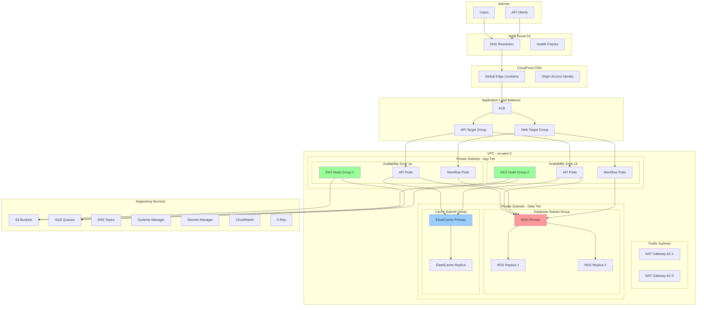

# AWS Infrastructure Architecture

## Overview

The Tolstoy platform runs on a robust, scalable AWS infrastructure designed for high availability, security, and cost optimization. This document outlines the complete architecture, setup procedures, and operational guidelines.

## Architecture Overview



## Core Infrastructure Components

### 1. Compute Infrastructure (EKS)

<Tabs>
  <Tab title="Cluster Configuration">
    ```yaml
    # eks-cluster.yaml
    apiVersion: v1
    kind: ConfigMap
    metadata:
      name: aws-cluster-config
      namespace: kube-system
    data:
      cluster-name: "tolstoy-production"
      region: "us-west-2"
      version: "1.28"
      
    ---
    # Cluster specification
    cluster:
      name: tolstoy-production
      version: "1.28"
      region: us-west-2
      
      # VPC Configuration  
      vpc:
        cidr: "10.0.0.0/16"
        subnets:
          private:
            - "10.0.1.0/24"  # us-west-2a
            - "10.0.2.0/24"  # us-west-2b
            - "10.0.3.0/24"  # us-west-2c
          public:
            - "10.0.101.0/24"  # us-west-2a
            - "10.0.102.0/24"  # us-west-2b
            - "10.0.103.0/24"  # us-west-2c
      
      # Logging
      logging:
        enable:
          - "api"
          - "audit" 
          - "authenticator"
          - "controllerManager"
          - "scheduler"
        logRetention: 30
      
      # Add-ons
      addons:
        - name: vpc-cni
          version: v1.15.0-eksbuild.2
        - name: coredns
          version: v1.10.1-eksbuild.5
        - name: kube-proxy
          version: v1.28.1-eksbuild.1
        - name: aws-ebs-csi-driver
          version: v1.24.0-eksbuild.1
    ```
  </Tab>
  
  <Tab title="Node Groups">
    ```yaml
    # Primary compute node group
    nodeGroups:
      - name: api-nodes
        instanceTypes:
          - m6i.large
          - m6i.xlarge
          - m5.large
          - m5.xlarge
        amiFamily: AmazonLinux2
        desiredCapacity: 6
        minSize: 3
        maxSize: 20
        
        # Availability zones
        availabilityZones:
          - us-west-2a
          - us-west-2b
          - us-west-2c
          
        # Security
        iam:
          attachPolicyARNs:
            - arn:aws:iam::aws:policy/AmazonEKSWorkerNodePolicy
            - arn:aws:iam::aws:policy/AmazonEKS_CNI_Policy
            - arn:aws:iam::aws:policy/AmazonEC2ContainerRegistryReadOnly
            - arn:aws:iam::aws:policy/CloudWatchAgentServerPolicy
          withAddonPolicies:
            autoScaler: true
            ebs: true
            fsx: true
            efs: true
        
        # Storage
        volumeSize: 100
        volumeType: gp3
        volumeEncrypted: true
        
        # Networking
        privateNetworking: true
        
        # Labels and taints
        labels:
          nodegroup-type: "api-compute"
          instance-type: "mixed"
        
        tags:
          Environment: "production"
          Project: "tolstoy"
          NodeGroup: "api-nodes"
          
      # Workflow processing node group
      - name: workflow-nodes
        instanceTypes:
          - c6i.large
          - c6i.xlarge
          - c5.large
          - c5.xlarge
        amiFamily: AmazonLinux2
        desiredCapacity: 4
        minSize: 2
        maxSize: 15
        
        availabilityZones:
          - us-west-2a
          - us-west-2b
          
        # CPU-optimized for workflow processing
        labels:
          nodegroup-type: "workflow-compute"
          instance-type: "cpu-optimized"
        
        taints:
          - key: "workload-type"
            value: "workflow"
            effect: "NoSchedule"
            
        tags:
          Environment: "production"
          Project: "tolstoy"
          NodeGroup: "workflow-nodes"
    ```
  </Tab>
  
  <Tab title="Terraform Configuration">
    ```hcl
    # eks-cluster.tf
    resource "aws_eks_cluster" "tolstoy" {
      name     = "tolstoy-production"
      role_arn = aws_iam_role.eks_cluster.arn
      version  = "1.28"
      
      vpc_config {
        subnet_ids              = concat(aws_subnet.private[*].id, aws_subnet.public[*].id)
        endpoint_private_access = true
        endpoint_public_access  = true
        public_access_cidrs     = ["0.0.0.0/0"]
        
        security_group_ids = [aws_security_group.eks_cluster.id]
      }
      
      encryption_config {
        provider {
          key_arn = aws_kms_key.eks.arn
        }
        resources = ["secrets"]
      }
      
      enabled_cluster_log_types = [
        "api",
        "audit", 
        "authenticator",
        "controllerManager",
        "scheduler"
      ]
      
      depends_on = [
        aws_iam_role_policy_attachment.eks_cluster_policy,
        aws_cloudwatch_log_group.eks_cluster,
      ]
      
      tags = {
        Environment = "production"
        Project     = "tolstoy"
        ManagedBy   = "terraform"
      }
    }
    
    # EKS Node Groups
    resource "aws_eks_node_group" "api_nodes" {
      cluster_name    = aws_eks_cluster.tolstoy.name
      node_group_name = "api-nodes"
      node_role_arn   = aws_iam_role.eks_node_group.arn
      subnet_ids      = aws_subnet.private[*].id
      
      instance_types = ["m6i.large", "m6i.xlarge", "m5.large", "m5.xlarge"]
      capacity_type  = "SPOT"  # Mix of on-demand and spot
      
      scaling_config {
        desired_size = 6
        max_size     = 20
        min_size     = 3
      }
      
      launch_template {
        id      = aws_launch_template.eks_nodes.id
        version = "$Latest"
      }
      
      # Auto Scaling Group tags
      tags = {
        "k8s.io/cluster-autoscaler/tolstoy-production" = "owned"
        "k8s.io/cluster-autoscaler/enabled"            = "true"
        Environment                                    = "production"
        NodeGroup                                      = "api-nodes"
      }
      
      depends_on = [
        aws_iam_role_policy_attachment.eks_worker_node_policy,
        aws_iam_role_policy_attachment.eks_cni_policy,
        aws_iam_role_policy_attachment.eks_container_registry_policy,
      ]
    }
    ```
  </Tab>
</Tabs>

### 2. Database Infrastructure (RDS)

<Tabs>
  <Tab title="Primary Database">
    ```hcl
    # rds-primary.tf
    resource "aws_db_instance" "tolstoy_primary" {
      identifier = "tolstoy-prod-primary"
      
      # Engine configuration
      engine         = "postgres"
      engine_version = "15.4"
      instance_class = "db.r6g.xlarge"
      
      # Storage configuration
      allocated_storage     = 500
      max_allocated_storage = 2000
      storage_type         = "gp3"
      storage_encrypted    = true
      kms_key_id          = aws_kms_key.rds.arn
      
      # Database configuration
      db_name  = "tolstoy_prod"
      username = "tolstoy"
      password = random_password.db_password.result
      port     = 5432
      
      # Network configuration
      db_subnet_group_name   = aws_db_subnet_group.tolstoy.name
      vpc_security_group_ids = [aws_security_group.rds.id]
      publicly_accessible    = false
      
      # Backup configuration
      backup_retention_period = 30
      backup_window          = "03:00-04:00"
      maintenance_window     = "sun:04:00-sun:05:00"
      
      # Performance configuration
      performance_insights_enabled = true
      monitoring_interval         = 60
      monitoring_role_arn        = aws_iam_role.rds_monitoring.arn
      
      # High availability
      multi_az = true
      
      # Parameter group
      parameter_group_name = aws_db_parameter_group.tolstoy.name
      
      # Snapshot configuration
      skip_final_snapshot       = false
      final_snapshot_identifier = "tolstoy-prod-final-snapshot-${formatdate("YYYY-MM-DD-hhmm", timestamp())}"
      
      # Enhanced monitoring
      enabled_cloudwatch_logs_exports = ["postgresql"]
      
      tags = {
        Environment = "production"
        Project     = "tolstoy" 
        Role        = "primary"
        ManagedBy   = "terraform"
      }
    }
    
    # Read replicas
    resource "aws_db_instance" "tolstoy_replica" {
      count = 2
      
      identifier = "tolstoy-prod-replica-${count.index + 1}"
      
      # Replica configuration
      replicate_source_db = aws_db_instance.tolstoy_primary.identifier
      instance_class      = "db.r6g.large"
      
      # Network configuration
      publicly_accessible    = false
      vpc_security_group_ids = [aws_security_group.rds_replica.id]
      
      # Performance monitoring
      performance_insights_enabled = true
      monitoring_interval         = 60
      monitoring_role_arn        = aws_iam_role.rds_monitoring.arn
      
      tags = {
        Environment = "production"
        Project     = "tolstoy"
        Role        = "replica"
        ReplicaIndex = count.index + 1
      }
    }
    ```
  </Tab>
  
  <Tab title="Parameter Group">
    ```hcl
    # db-parameter-group.tf
    resource "aws_db_parameter_group" "tolstoy" {
      family = "postgres15"
      name   = "tolstoy-production-params"
      
      # Connection and authentication
      parameter {
        name  = "max_connections"
        value = "500"
      }
      
      # Memory configuration
      parameter {
        name  = "shared_buffers"
        value = "2048MB"
      }
      
      parameter {
        name  = "effective_cache_size"
        value = "6GB"
      }
      
      parameter {
        name  = "work_mem"
        value = "8MB"
      }
      
      parameter {
        name  = "maintenance_work_mem"
        value = "256MB"
      }
      
      # WAL and checkpointing
      parameter {
        name  = "wal_buffers"
        value = "64MB"
      }
      
      parameter {
        name  = "checkpoint_completion_target"
        value = "0.9"
      }
      
      parameter {
        name  = "checkpoint_timeout"
        value = "900"
      }
      
      # Query optimization
      parameter {
        name  = "random_page_cost"
        value = "1.1"
      }
      
      parameter {
        name  = "seq_page_cost"
        value = "1.0"
      }
      
      parameter {
        name  = "default_statistics_target"
        value = "100"
      }
      
      # Logging
      parameter {
        name  = "log_min_duration_statement"
        value = "1000"
      }
      
      parameter {
        name  = "log_statement"
        value = "ddl"
      }
      
      parameter {
        name  = "log_lock_waits"
        value = "1"
      }
      
      # Performance extensions
      parameter {
        name  = "shared_preload_libraries"
        value = "pg_stat_statements,pgaudit"
      }
      
      parameter {
        name  = "pg_stat_statements.track"
        value = "all"
      }
      
      parameter {
        name  = "pg_stat_statements.max"
        value = "10000"
      }
      
      tags = {
        Environment = "production"
        Project     = "tolstoy"
      }
    }
    ```
  </Tab>
  
  <Tab title="Subnet Groups">
    ```hcl
    # db-subnet-group.tf
    resource "aws_db_subnet_group" "tolstoy" {
      name       = "tolstoy-production-db-subnet-group"
      subnet_ids = aws_subnet.database[*].id
      
      tags = {
        Name        = "Tolstoy Production DB Subnet Group"
        Environment = "production"
        Project     = "tolstoy"
      }
    }
    
    # Database subnets
    resource "aws_subnet" "database" {
      count = length(var.availability_zones)
      
      vpc_id            = aws_vpc.tolstoy.id
      cidr_block        = "10.0.${20 + count.index}.0/24"
      availability_zone = var.availability_zones[count.index]
      
      tags = {
        Name        = "tolstoy-prod-db-subnet-${count.index + 1}"
        Type        = "database"
        Environment = "production"
        Project     = "tolstoy"
      }
    }
    
    # ElastiCache subnet group
    resource "aws_elasticache_subnet_group" "tolstoy" {
      name       = "tolstoy-production-cache-subnet-group"
      subnet_ids = aws_subnet.cache[*].id
      
      tags = {
        Environment = "production"
        Project     = "tolstoy"
      }
    }
    
    # Cache subnets
    resource "aws_subnet" "cache" {
      count = length(var.availability_zones)
      
      vpc_id            = aws_vpc.tolstoy.id
      cidr_block        = "10.0.${30 + count.index}.0/24"
      availability_zone = var.availability_zones[count.index]
      
      tags = {
        Name        = "tolstoy-prod-cache-subnet-${count.index + 1}"
        Type        = "cache"
        Environment = "production"
        Project     = "tolstoy"
      }
    }
    ```
  </Tab>
</Tabs>

### 3. Caching Infrastructure (ElastiCache)

```hcl
# elasticache-redis.tf
resource "aws_elasticache_replication_group" "tolstoy" {
  replication_group_id       = "tolstoy-production-redis"
  description               = "Redis cluster for Tolstoy production"
  
  # Engine configuration
  engine               = "redis"
  engine_version       = "7.0"
  node_type           = "cache.r7g.large"
  parameter_group_name = aws_elasticache_parameter_group.tolstoy.name
  port                = 6379
  
  # Cluster configuration
  num_cache_clusters = 3
  
  # Network configuration
  subnet_group_name  = aws_elasticache_subnet_group.tolstoy.name
  security_group_ids = [aws_security_group.redis.id]
  
  # Backup configuration
  snapshot_retention_limit = 7
  snapshot_window         = "03:00-05:00"
  maintenance_window      = "sun:05:00-sun:07:00"
  
  # Security
  at_rest_encryption_enabled = true
  transit_encryption_enabled = true
  auth_token                = random_password.redis_auth_token.result
  
  # High availability
  multi_az_enabled           = true
  automatic_failover_enabled = true
  
  # Logging
  log_delivery_configuration {
    destination      = aws_cloudwatch_log_group.redis.name
    destination_type = "cloudwatch-logs"
    log_format      = "json"
    log_type        = "slow-log"
  }
  
  tags = {
    Environment = "production"
    Project     = "tolstoy"
    Service     = "redis"
  }
}

# Redis parameter group
resource "aws_elasticache_parameter_group" "tolstoy" {
  family = "redis7"
  name   = "tolstoy-production-redis-params"
  
  # Memory management
  parameter {
    name  = "maxmemory-policy"
    value = "allkeys-lru"
  }
  
  # Persistence
  parameter {
    name  = "save"
    value = "900 1 300 10 60 10000"
  }
  
  # Timeout
  parameter {
    name  = "timeout"
    value = "300"
  }
  
  tags = {
    Environment = "production"
    Project     = "tolstoy"
  }
}
```

### 4. Load Balancing (ALB)

```hcl
# application-load-balancer.tf
resource "aws_lb" "tolstoy" {
  name               = "tolstoy-production-alb"
  internal           = false
  load_balancer_type = "application"
  security_groups    = [aws_security_group.alb.id]
  subnets           = aws_subnet.public[*].id
  
  enable_deletion_protection     = true
  enable_cross_zone_load_balancing = true
  enable_http2                   = true
  enable_waf_fail_open          = false
  
  # Access logs
  access_logs {
    bucket  = aws_s3_bucket.alb_logs.id
    prefix  = "tolstoy-alb"
    enabled = true
  }
  
  tags = {
    Environment = "production"
    Project     = "tolstoy"
    Service     = "load-balancer"
  }
}

# Target groups
resource "aws_lb_target_group" "api" {
  name     = "tolstoy-api-tg"
  port     = 3000
  protocol = "HTTP"
  vpc_id   = aws_vpc.tolstoy.id
  
  target_type = "ip"
  
  health_check {
    enabled             = true
    healthy_threshold   = 2
    unhealthy_threshold = 2
    timeout             = 5
    interval            = 30
    path               = "/health"
    matcher            = "200"
    port               = "traffic-port"
    protocol           = "HTTP"
  }
  
  # Connection draining
  deregistration_delay = 60
  
  tags = {
    Environment = "production"
    Project     = "tolstoy"
    Service     = "api"
  }
}

resource "aws_lb_target_group" "web" {
  name     = "tolstoy-web-tg"
  port     = 3001
  protocol = "HTTP"
  vpc_id   = aws_vpc.tolstoy.id
  
  target_type = "ip"
  
  health_check {
    enabled             = true
    healthy_threshold   = 2
    unhealthy_threshold = 2
    timeout             = 5
    interval            = 30
    path               = "/health"
    matcher            = "200"
    port               = "traffic-port" 
    protocol           = "HTTP"
  }
  
  tags = {
    Environment = "production"
    Project     = "tolstoy"
    Service     = "web"
  }
}

# Listeners
resource "aws_lb_listener" "https" {
  load_balancer_arn = aws_lb.tolstoy.arn
  port              = "443"
  protocol          = "HTTPS"
  ssl_policy        = "ELBSecurityPolicy-TLS-1-2-2017-01"
  certificate_arn   = aws_acm_certificate.tolstoy.arn
  
  default_action {
    type             = "forward"
    target_group_arn = aws_lb_target_group.api.arn
  }
}

resource "aws_lb_listener" "http_redirect" {
  load_balancer_arn = aws_lb.tolstoy.arn
  port              = "80"
  protocol          = "HTTP"
  
  default_action {
    type = "redirect"
    
    redirect {
      port        = "443"
      protocol    = "HTTPS"
      status_code = "HTTP_301"
    }
  }
}

# Listener rules
resource "aws_lb_listener_rule" "api" {
  listener_arn = aws_lb_listener.https.arn
  priority     = 100
  
  action {
    type             = "forward"
    target_group_arn = aws_lb_target_group.api.arn
  }
  
  condition {
    path_pattern {
      values = ["/api/*", "/health", "/metrics"]
    }
  }
}

resource "aws_lb_listener_rule" "web" {
  listener_arn = aws_lb_listener.https.arn
  priority     = 200
  
  action {
    type             = "forward"
    target_group_arn = aws_lb_target_group.web.arn
  }
  
  condition {
    path_pattern {
      values = ["/*"]
    }
  }
}
```

## Storage and Content Delivery

### 1. S3 Storage Architecture

<Tabs>
  <Tab title="Bucket Configuration">
    ```hcl
    # s3-buckets.tf
    
    # Application assets bucket
    resource "aws_s3_bucket" "app_assets" {
      bucket = "tolstoy-prod-app-assets"
      
      tags = {
        Environment = "production"
        Project     = "tolstoy"
        Purpose     = "app-assets"
      }
    }
    
    resource "aws_s3_bucket_versioning" "app_assets" {
      bucket = aws_s3_bucket.app_assets.id
      versioning_configuration {
        status = "Enabled"
      }
    }
    
    resource "aws_s3_bucket_encryption" "app_assets" {
      bucket = aws_s3_bucket.app_assets.id
      
      server_side_encryption_configuration {
        rule {
          apply_server_side_encryption_by_default {
            kms_master_key_id = aws_kms_key.s3.arn
            sse_algorithm     = "aws:kms"
          }
        }
      }
    }
    
    # User uploads bucket
    resource "aws_s3_bucket" "user_uploads" {
      bucket = "tolstoy-prod-user-uploads"
      
      tags = {
        Environment = "production"
        Project     = "tolstoy"
        Purpose     = "user-uploads"
      }
    }
    
    resource "aws_s3_bucket_lifecycle_configuration" "user_uploads" {
      bucket = aws_s3_bucket.user_uploads.id
      
      rule {
        id     = "transition_to_ia"
        status = "Enabled"
        
        transition {
          days          = 30
          storage_class = "STANDARD_IA"
        }
        
        transition {
          days          = 90
          storage_class = "GLACIER"
        }
        
        transition {
          days          = 365
          storage_class = "DEEP_ARCHIVE"
        }
      }
    }
    
    # Backup bucket
    resource "aws_s3_bucket" "backups" {
      bucket = "tolstoy-prod-backups"
      
      tags = {
        Environment = "production"
        Project     = "tolstoy"
        Purpose     = "backups"
      }
    }
    
    resource "aws_s3_bucket_lifecycle_configuration" "backups" {
      bucket = aws_s3_bucket.backups.id
      
      rule {
        id     = "backup_lifecycle"
        status = "Enabled"
        
        # Keep daily backups for 30 days
        expiration {
          days = 30
        }
        
        # Transition to cheaper storage
        transition {
          days          = 7
          storage_class = "STANDARD_IA"
        }
        
        transition {
          days          = 30
          storage_class = "GLACIER"
        }
      }
    }
    ```
  </Tab>
  
  <Tab title="CloudFront Distribution">
    ```hcl
    # cloudfront.tf
    resource "aws_cloudfront_distribution" "tolstoy" {
      origin {
        domain_name              = aws_lb.tolstoy.dns_name
        origin_id               = "tolstoy-alb-origin"
        
        custom_origin_config {
          http_port              = 80
          https_port             = 443
          origin_protocol_policy = "https-only"
          origin_ssl_protocols   = ["TLSv1.2"]
        }
      }
      
      # S3 origin for static assets
      origin {
        domain_name = aws_s3_bucket.app_assets.bucket_regional_domain_name
        origin_id   = "tolstoy-s3-origin"
        
        s3_origin_config {
          origin_access_identity = aws_cloudfront_origin_access_identity.tolstoy.cloudfront_access_identity_path
        }
      }
      
      enabled             = true
      is_ipv6_enabled     = true
      comment             = "Tolstoy Production CDN"
      default_root_object = "index.html"
      
      # Cache behaviors
      default_cache_behavior {
        allowed_methods        = ["DELETE", "GET", "HEAD", "OPTIONS", "PATCH", "POST", "PUT"]
        cached_methods         = ["GET", "HEAD"]
        target_origin_id       = "tolstoy-alb-origin"
        compress              = true
        viewer_protocol_policy = "redirect-to-https"
        
        forwarded_values {
          query_string = true
          headers     = ["Authorization", "CloudFront-Forwarded-Proto"]
          
          cookies {
            forward = "all"
          }
        }
        
        min_ttl     = 0
        default_ttl = 3600
        max_ttl     = 86400
      }
      
      # Static assets cache behavior
      ordered_cache_behavior {
        path_pattern     = "/static/*"
        allowed_methods  = ["GET", "HEAD", "OPTIONS"]
        cached_methods   = ["GET", "HEAD"]
        target_origin_id = "tolstoy-s3-origin"
        compress         = true
        
        forwarded_values {
          query_string = false
          cookies {
            forward = "none"
          }
        }
        
        viewer_protocol_policy = "redirect-to-https"
        min_ttl               = 31536000  # 1 year
        default_ttl           = 31536000
        max_ttl               = 31536000
      }
      
      # API cache behavior
      ordered_cache_behavior {
        path_pattern     = "/api/*"
        allowed_methods  = ["DELETE", "GET", "HEAD", "OPTIONS", "PATCH", "POST", "PUT"]
        cached_methods   = ["GET", "HEAD"]
        target_origin_id = "tolstoy-alb-origin"
        compress         = true
        
        forwarded_values {
          query_string = true
          headers     = ["*"]
          cookies {
            forward = "all"
          }
        }
        
        viewer_protocol_policy = "https-only"
        min_ttl               = 0
        default_ttl           = 0
        max_ttl               = 0
      }
      
      # Geographic restrictions
      restrictions {
        geo_restriction {
          restriction_type = "none"
        }
      }
      
      # SSL certificate
      viewer_certificate {
        acm_certificate_arn      = aws_acm_certificate.tolstoy.arn
        ssl_support_method       = "sni-only"
        minimum_protocol_version = "TLSv1.2_2021"
      }
      
      # Aliases
      aliases = ["api.tolstoy.dev", "app.tolstoy.dev"]
      
      # Logging
      logging_config {
        include_cookies = false
        bucket         = aws_s3_bucket.cloudfront_logs.bucket_domain_name
        prefix         = "cloudfront-logs/"
      }
      
      tags = {
        Environment = "production"
        Project     = "tolstoy"
        Service     = "cdn"
      }
    }
    
    # Origin Access Identity
    resource "aws_cloudfront_origin_access_identity" "tolstoy" {
      comment = "Tolstoy S3 OAI"
    }
    ```
  </Tab>
</Tabs>

### 2. Message Queuing (SQS)

```hcl
# sqs-queues.tf

# Primary workflow processing queue
resource "aws_sqs_queue" "workflow_processing" {
  name                      = "tolstoy-workflow-processing"
  delay_seconds            = 0
  max_message_size         = 262144
  message_retention_seconds = 1209600  # 14 days
  receive_wait_time_seconds = 10       # Long polling
  
  # Visibility timeout should be 6x the Lambda timeout
  visibility_timeout_seconds = 300
  
  # Dead letter queue
  redrive_policy = jsonencode({
    deadLetterTargetArn = aws_sqs_queue.workflow_processing_dlq.arn
    maxReceiveCount     = 3
  })
  
  tags = {
    Environment = "production"
    Project     = "tolstoy"
    Service     = "workflow-processing"
  }
}

# Dead letter queue for failed workflow processing
resource "aws_sqs_queue" "workflow_processing_dlq" {
  name                      = "tolstoy-workflow-processing-dlq"
  message_retention_seconds = 1209600  # 14 days
  
  tags = {
    Environment = "production"
    Project     = "tolstoy"
    Service     = "workflow-processing-dlq"
  }
}

# High priority queue for urgent workflows
resource "aws_sqs_queue" "workflow_high_priority" {
  name                      = "tolstoy-workflow-high-priority"
  delay_seconds            = 0
  max_message_size         = 262144
  message_retention_seconds = 1209600
  receive_wait_time_seconds = 5
  visibility_timeout_seconds = 180
  
  redrive_policy = jsonencode({
    deadLetterTargetArn = aws_sqs_queue.workflow_high_priority_dlq.arn
    maxReceiveCount     = 5
  })
  
  tags = {
    Environment = "production"
    Project     = "tolstoy"
    Service     = "workflow-high-priority"
  }
}

resource "aws_sqs_queue" "workflow_high_priority_dlq" {
  name = "tolstoy-workflow-high-priority-dlq"
  
  tags = {
    Environment = "production"
    Project     = "tolstoy"
    Service     = "workflow-high-priority-dlq"
  }
}

# Notification queue
resource "aws_sqs_queue" "notifications" {
  name                      = "tolstoy-notifications"
  delay_seconds            = 0
  max_message_size         = 262144
  message_retention_seconds = 345600   # 4 days
  receive_wait_time_seconds = 10
  visibility_timeout_seconds = 120
  
  tags = {
    Environment = "production"
    Project     = "tolstoy"
    Service     = "notifications"
  }
}

# Queue policies
resource "aws_sqs_queue_policy" "workflow_processing" {
  queue_url = aws_sqs_queue.workflow_processing.id
  
  policy = jsonencode({
    Version = "2012-10-17"
    Statement = [
      {
        Sid    = "AllowEKSWorkersToSendReceive"
        Effect = "Allow"
        Principal = {
          AWS = aws_iam_role.eks_node_group.arn
        }
        Action = [
          "sqs:SendMessage",
          "sqs:ReceiveMessage",
          "sqs:DeleteMessage",
          "sqs:GetQueueAttributes"
        ]
        Resource = aws_sqs_queue.workflow_processing.arn
      }
    ]
  })
}
```

## Security and Access Control

### 1. VPC Security Groups

<Tabs>
  <Tab title="EKS Security Groups">
    ```hcl
    # eks-security-groups.tf
    resource "aws_security_group" "eks_cluster" {
      name_prefix = "tolstoy-eks-cluster-sg"
      vpc_id      = aws_vpc.tolstoy.id
      
      # Allow HTTPS from anywhere for API access
      ingress {
        description = "HTTPS from internet"
        from_port   = 443
        to_port     = 443
        protocol    = "tcp"
        cidr_blocks = ["0.0.0.0/0"]
      }
      
      # Allow cluster communication
      ingress {
        description = "Cluster communication"
        from_port   = 0
        to_port     = 65535
        protocol    = "tcp"
        self        = true
      }
      
      egress {
        from_port   = 0
        to_port     = 0
        protocol    = "-1"
        cidr_blocks = ["0.0.0.0/0"]
      }
      
      tags = {
        Name = "tolstoy-eks-cluster-sg"
        Environment = "production"
        Project = "tolstoy"
      }
    }
    
    resource "aws_security_group" "eks_nodes" {
      name_prefix = "tolstoy-eks-nodes-sg"
      vpc_id      = aws_vpc.tolstoy.id
      
      # Allow nodes to communicate with each other
      ingress {
        description = "Node to node communication"
        from_port   = 0
        to_port     = 65535
        protocol    = "tcp"
        self        = true
      }
      
      # Allow nodes to receive traffic from ALB
      ingress {
        description     = "ALB to nodes"
        from_port       = 30000
        to_port         = 32767
        protocol        = "tcp"
        security_groups = [aws_security_group.alb.id]
      }
      
      # Allow cluster to communicate with nodes
      ingress {
        description     = "Cluster to nodes"
        from_port       = 1025
        to_port         = 65535
        protocol        = "tcp"
        security_groups = [aws_security_group.eks_cluster.id]
      }
      
      egress {
        from_port   = 0
        to_port     = 0
        protocol    = "-1"
        cidr_blocks = ["0.0.0.0/0"]
      }
      
      tags = {
        Name = "tolstoy-eks-nodes-sg"
        Environment = "production"
        Project = "tolstoy"
      }
    }
    ```
  </Tab>
  
  <Tab title="Database Security Groups">
    ```hcl
    # rds-security-groups.tf
    resource "aws_security_group" "rds" {
      name_prefix = "tolstoy-rds-sg"
      vpc_id      = aws_vpc.tolstoy.id
      
      # Allow PostgreSQL access from EKS nodes
      ingress {
        description     = "PostgreSQL from EKS"
        from_port       = 5432
        to_port         = 5432
        protocol        = "tcp"
        security_groups = [aws_security_group.eks_nodes.id]
      }
      
      # Allow PostgreSQL access from bastion host
      ingress {
        description     = "PostgreSQL from bastion"
        from_port       = 5432
        to_port         = 5432
        protocol        = "tcp"
        security_groups = [aws_security_group.bastion.id]
      }
      
      # No outbound rules needed for RDS
      tags = {
        Name = "tolstoy-rds-sg"
        Environment = "production"
        Project = "tolstoy"
      }
    }
    
    resource "aws_security_group" "rds_replica" {
      name_prefix = "tolstoy-rds-replica-sg"
      vpc_id      = aws_vpc.tolstoy.id
      
      # Allow PostgreSQL access from EKS nodes (read-only queries)
      ingress {
        description     = "PostgreSQL from EKS"
        from_port       = 5432
        to_port         = 5432
        protocol        = "tcp"
        security_groups = [aws_security_group.eks_nodes.id]
      }
      
      # Allow replication from primary
      ingress {
        description     = "Replication from primary"
        from_port       = 5432
        to_port         = 5432
        protocol        = "tcp"
        security_groups = [aws_security_group.rds.id]
      }
      
      tags = {
        Name = "tolstoy-rds-replica-sg"
        Environment = "production"
        Project = "tolstoy"
      }
    }
    ```
  </Tab>
  
  <Tab title="Load Balancer Security Groups">
    ```hcl
    # alb-security-groups.tf
    resource "aws_security_group" "alb" {
      name_prefix = "tolstoy-alb-sg"
      vpc_id      = aws_vpc.tolstoy.id
      
      # Allow HTTP from anywhere (will redirect to HTTPS)
      ingress {
        description = "HTTP from internet"
        from_port   = 80
        to_port     = 80
        protocol    = "tcp"
        cidr_blocks = ["0.0.0.0/0"]
      }
      
      # Allow HTTPS from anywhere
      ingress {
        description = "HTTPS from internet"
        from_port   = 443
        to_port     = 443
        protocol    = "tcp"
        cidr_blocks = ["0.0.0.0/0"]
      }
      
      # Allow outbound to EKS nodes
      egress {
        description     = "To EKS nodes"
        from_port       = 30000
        to_port         = 32767
        protocol        = "tcp"
        security_groups = [aws_security_group.eks_nodes.id]
      }
      
      # Allow health checks to nodes
      egress {
        description     = "Health checks to nodes"
        from_port       = 3000
        to_port         = 3001
        protocol        = "tcp"
        security_groups = [aws_security_group.eks_nodes.id]
      }
      
      tags = {
        Name = "tolstoy-alb-sg"
        Environment = "production"
        Project = "tolstoy"
      }
    }
    ```
  </Tab>
</Tabs>

### 2. IAM Roles and Policies

<Tabs>
  <Tab title="EKS Cluster Role">
    ```hcl
    # eks-cluster-iam.tf
    resource "aws_iam_role" "eks_cluster" {
      name = "tolstoy-eks-cluster-role"
      
      assume_role_policy = jsonencode({
        Version = "2012-10-17"
        Statement = [
          {
            Action = "sts:AssumeRole"
            Effect = "Allow"
            Principal = {
              Service = "eks.amazonaws.com"
            }
          }
        ]
      })
      
      tags = {
        Environment = "production"
        Project = "tolstoy"
        Role = "eks-cluster"
      }
    }
    
    resource "aws_iam_role_policy_attachment" "eks_cluster_policy" {
      policy_arn = "arn:aws:iam::aws:policy/AmazonEKSClusterPolicy"
      role       = aws_iam_role.eks_cluster.name
    }
    
    resource "aws_iam_role_policy_attachment" "eks_vpc_resource_controller" {
      policy_arn = "arn:aws:iam::aws:policy/AmazonEKSVPCResourceController"
      role       = aws_iam_role.eks_cluster.name
    }
    ```
  </Tab>
  
  <Tab title="EKS Node Group Role">
    ```hcl
    # eks-nodegroup-iam.tf
    resource "aws_iam_role" "eks_node_group" {
      name = "tolstoy-eks-nodegroup-role"
      
      assume_role_policy = jsonencode({
        Version = "2012-10-17"
        Statement = [
          {
            Action = "sts:AssumeRole"
            Effect = "Allow"
            Principal = {
              Service = "ec2.amazonaws.com"
            }
          }
        ]
      })
      
      tags = {
        Environment = "production"
        Project = "tolstoy"
        Role = "eks-nodegroup"
      }
    }
    
    resource "aws_iam_role_policy_attachment" "eks_worker_node_policy" {
      policy_arn = "arn:aws:iam::aws:policy/AmazonEKSWorkerNodePolicy"
      role       = aws_iam_role.eks_node_group.name
    }
    
    resource "aws_iam_role_policy_attachment" "eks_cni_policy" {
      policy_arn = "arn:aws:iam::aws:policy/AmazonEKS_CNI_Policy"
      role       = aws_iam_role.eks_node_group.name
    }
    
    resource "aws_iam_role_policy_attachment" "eks_container_registry_policy" {
      policy_arn = "arn:aws:iam::aws:policy/AmazonEC2ContainerRegistryReadOnly"
      role       = aws_iam_role.eks_node_group.name
    }
    
    # Custom policy for Tolstoy-specific permissions
    resource "aws_iam_policy" "tolstoy_node_policy" {
      name        = "tolstoy-node-policy"
      description = "Custom policy for Tolstoy EKS nodes"
      
      policy = jsonencode({
        Version = "2012-10-17"
        Statement = [
          {
            Effect = "Allow"
            Action = [
              "s3:GetObject",
              "s3:PutObject",
              "s3:DeleteObject",
              "s3:ListBucket"
            ]
            Resource = [
              aws_s3_bucket.app_assets.arn,
              "${aws_s3_bucket.app_assets.arn}/*",
              aws_s3_bucket.user_uploads.arn,
              "${aws_s3_bucket.user_uploads.arn}/*"
            ]
          },
          {
            Effect = "Allow"
            Action = [
              "sqs:SendMessage",
              "sqs:ReceiveMessage",
              "sqs:DeleteMessage",
              "sqs:GetQueueAttributes"
            ]
            Resource = [
              aws_sqs_queue.workflow_processing.arn,
              aws_sqs_queue.workflow_high_priority.arn,
              aws_sqs_queue.notifications.arn
            ]
          },
          {
            Effect = "Allow"
            Action = [
              "secretsmanager:GetSecretValue"
            ]
            Resource = [
              aws_secretsmanager_secret.database.arn,
              aws_secretsmanager_secret.redis.arn,
              aws_secretsmanager_secret.app_secrets.arn
            ]
          },
          {
            Effect = "Allow"
            Action = [
              "ssm:GetParameter",
              "ssm:GetParameters",
              "ssm:GetParametersByPath"
            ]
            Resource = "arn:aws:ssm:*:*:parameter/tolstoy/*"
          }
        ]
      })
      
      tags = {
        Environment = "production"
        Project = "tolstoy"
      }
    }
    
    resource "aws_iam_role_policy_attachment" "tolstoy_node_policy" {
      policy_arn = aws_iam_policy.tolstoy_node_policy.arn
      role       = aws_iam_role.eks_node_group.name
    }
    ```
  </Tab>
  
  <Tab title="Service Account Roles">
    ```hcl
    # service-account-iam.tf
    
    # IRSA for AWS Load Balancer Controller
    module "aws_load_balancer_controller_irsa_role" {
      source    = "terraform-aws-modules/iam/aws//modules/iam-role-for-service-accounts-eks"
      role_name = "tolstoy-aws-load-balancer-controller"
      
      attach_load_balancer_controller_policy = true
      
      oidc_providers = {
        ex = {
          provider_arn               = module.eks.oidc_provider_arn
          namespace_service_accounts = ["kube-system:aws-load-balancer-controller"]
        }
      }
      
      tags = {
        Environment = "production"
        Project = "tolstoy"
        Service = "aws-load-balancer-controller"
      }
    }
    
    # IRSA for External DNS
    module "external_dns_irsa_role" {
      source    = "terraform-aws-modules/iam/aws//modules/iam-role-for-service-accounts-eks"
      role_name = "tolstoy-external-dns"
      
      attach_external_dns_policy    = true
      external_dns_hosted_zone_arns = [aws_route53_zone.tolstoy.arn]
      
      oidc_providers = {
        ex = {
          provider_arn               = module.eks.oidc_provider_arn
          namespace_service_accounts = ["kube-system:external-dns"]
        }
      }
      
      tags = {
        Environment = "production"
        Project = "tolstoy"
        Service = "external-dns"
      }
    }
    
    # IRSA for Cluster Autoscaler
    module "cluster_autoscaler_irsa_role" {
      source    = "terraform-aws-modules/iam/aws//modules/iam-role-for-service-accounts-eks"
      role_name = "tolstoy-cluster-autoscaler"
      
      attach_cluster_autoscaler_policy = true
      cluster_autoscaler_cluster_ids   = [module.eks.cluster_name]
      
      oidc_providers = {
        ex = {
          provider_arn               = module.eks.oidc_provider_arn
          namespace_service_accounts = ["kube-system:cluster-autoscaler"]
        }
      }
      
      tags = {
        Environment = "production"
        Project = "tolstoy"
        Service = "cluster-autoscaler"
      }
    }
    ```
  </Tab>
</Tabs>

---

<Note>
This AWS architecture documentation provides a comprehensive foundation for deploying and managing the Tolstoy platform infrastructure. Regular reviews and updates should be performed to ensure optimal performance, security, and cost efficiency.
</Note>