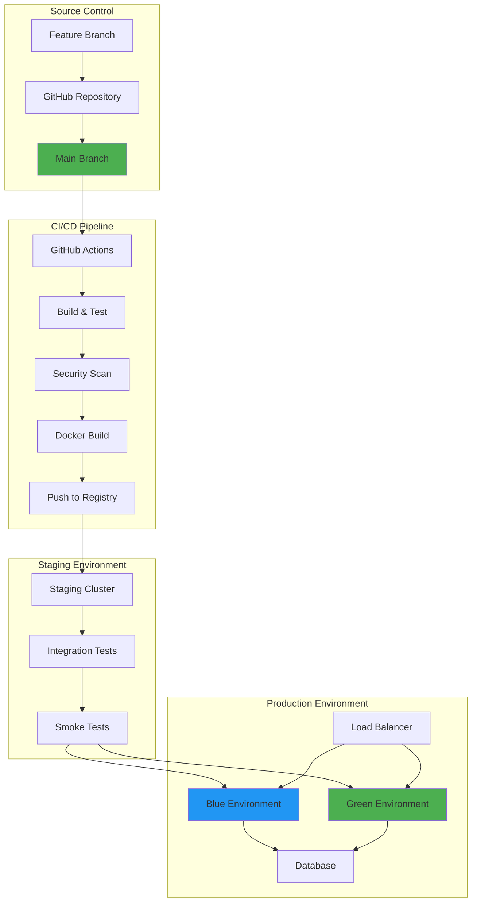

# Production Deployment Guide

## Overview

This guide covers the complete process for deploying Tolstoy applications to production, including pre-deployment checks, deployment strategies, rollback procedures, and post-deployment verification.

## Deployment Architecture



## Pre-Deployment Checklist

### 1. Code and Quality Gates

<Tabs>
  <Tab title="Code Review">
    ```bash
    # Verify all PRs are reviewed and approved
    gh pr list --state merged --limit 10 --json number,title,reviews
    
    # Check for any open security alerts
    gh api repos/:owner/:repo/security-advisories
    
    # Verify branch protection rules
    gh api repos/:owner/:repo/branches/main/protection
    ```
    
    **Requirements:**
    - [ ] All code changes reviewed by at least 2 engineers
    - [ ] Security team approval for security-related changes  
    - [ ] Database migration scripts reviewed by DBA
    - [ ] No high or critical security vulnerabilities
    - [ ] All required status checks passed
  </Tab>
  
  <Tab title="Testing">
    ```bash
    # Run complete test suite
    npm run test:all
    npm run test:integration
    npm run test:e2e
    
    # Check test coverage
    npm run test:coverage
    
    # Verify performance benchmarks
    npm run test:performance
    ```
    
    **Requirements:**
    - [ ] Unit test coverage > 80%
    - [ ] All integration tests passing
    - [ ] End-to-end tests passing
    - [ ] Performance tests meet SLA requirements
    - [ ] Load tests completed for high-traffic features
  </Tab>
  
  <Tab title="Infrastructure">
    ```bash
    # Verify infrastructure state
    kubectl cluster-info
    kubectl get nodes
    kubectl get pods -A | grep -v Running
    
    # Check resource availability
    kubectl top nodes
    kubectl describe nodes | grep -A 5 "Allocated resources"
    
    # Verify database health
    psql -h prod-db -c "SELECT version();"
    psql -h prod-db -c "SELECT pg_database_size(current_database());"
    ```
    
    **Requirements:**
    - [ ] All Kubernetes nodes healthy and ready
    - [ ] Sufficient CPU/Memory resources available
    - [ ] Database cluster healthy with < 1s replication lag
    - [ ] Redis cluster healthy and synchronized
    - [ ] Load balancer health checks passing
  </Tab>
  
  <Tab title="Dependencies">
    ```bash
    # Check external service health
    curl -s https://api.stripe.com/healthcheck | jq
    curl -s https://api.sendgrid.com/v3/scopes | jq
    
    # Verify API rate limits
    curl -I https://api.external-service.com/
    
    # Check SSL certificate expiry
    echo | openssl s_client -servername api.tolstoy.dev -connect api.tolstoy.dev:443 2>/dev/null | 
    openssl x509 -noout -dates
    ```
    
    **Requirements:**
    - [ ] All critical external APIs operational
    - [ ] Third-party service status pages show no incidents
    - [ ] API rate limits sufficient for traffic surge
    - [ ] SSL certificates valid for > 30 days
    - [ ] DNS records properly configured
  </Tab>
</Tabs>

### 2. Deployment Windows and Maintenance

**Preferred Deployment Windows:**
- **Primary:** Tuesday-Thursday, 10 AM - 4 PM UTC
- **Emergency:** Any time with incident commander approval
- **Avoid:** Fridays, weekends, holidays, major customer events

**Pre-deployment Communication:**
```bash
# Status page maintenance notice
curl -X POST "https://api.statuspage.io/v1/pages/$PAGE_ID/incidents" \
  -H "Authorization: OAuth $TOKEN" \
  -H "Content-Type: application/json" \
  -d '{
    "incident": {
      "name": "Scheduled Maintenance - System Updates",
      "status": "scheduled",
      "impact": "minor",
      "scheduled_for": "2024-01-15T14:00:00.000Z",
      "scheduled_until": "2024-01-15T15:00:00.000Z",
      "message": "We will be performing scheduled maintenance to deploy system updates. Brief service interruptions may occur."
    }
  }'

# Slack notification
curl -X POST https://hooks.slack.com/services/$SLACK_WEBHOOK \
  -H 'Content-type: application/json' \
  -d '{
    "text": "🚀 Production deployment starting in 30 minutes",
    "blocks": [
      {
        "type": "section", 
        "text": {
          "type": "mrkdwn",
          "text": "*Deployment Schedule*\n• Start: 2024-01-15 14:00 UTC\n• Duration: ~60 minutes\n• Impact: Brief service interruptions possible"
        }
      }
    ]
  }'
```

## Deployment Strategies

### 1. Blue-Green Deployment (Recommended)

Blue-Green deployment allows zero-downtime deployments by maintaining two identical production environments.

<Tabs>
  <Tab title="Setup">
    ```yaml
    # blue-green-config.yaml
    apiVersion: v1
    kind: ConfigMap
    metadata:
      name: deployment-config
      namespace: tolstoy-prod
    data:
      ACTIVE_ENVIRONMENT: "blue"
      BLUE_VERSION: "v2.1.0"
      GREEN_VERSION: "v2.0.9"
      
    ---
    apiVersion: apps/v1
    kind: Deployment
    metadata:
      name: tolstoy-api-blue
      namespace: tolstoy-prod
    spec:
      replicas: 5
      selector:
        matchLabels:
          app: tolstoy-api
          environment: blue
      template:
        metadata:
          labels:
            app: tolstoy-api
            environment: blue
            version: v2.1.0
        spec:
          containers:
          - name: api
            image: tolstoy/api:v2.1.0
            ports:
            - containerPort: 3000
            env:
            - name: ENVIRONMENT
              value: "blue"
    
    ---
    apiVersion: apps/v1
    kind: Deployment  
    metadata:
      name: tolstoy-api-green
      namespace: tolstoy-prod
    spec:
      replicas: 5
      selector:
        matchLabels:
          app: tolstoy-api
          environment: green
      template:
        metadata:
          labels:
            app: tolstoy-api
            environment: green
            version: v2.0.9
        spec:
          containers:
          - name: api
            image: tolstoy/api:v2.0.9
            ports:
            - containerPort: 3000
            env:
            - name: ENVIRONMENT
              value: "green"
    ```
  </Tab>
  
  <Tab title="Deployment Process">
    ```bash
    #!/bin/bash
    # Blue-Green deployment script
    
    set -e
    
    # Configuration
    NAMESPACE="tolstoy-prod"
    NEW_VERSION="v2.1.0"
    HEALTH_CHECK_URL="https://api.tolstoy.dev/health"
    
    # Determine current active environment
    CURRENT_ACTIVE=$(kubectl get configmap deployment-config -n $NAMESPACE -o jsonpath='{.data.ACTIVE_ENVIRONMENT}')
    
    if [ "$CURRENT_ACTIVE" = "blue" ]; then
        INACTIVE_ENV="green"
        ACTIVE_ENV="blue"
    else
        INACTIVE_ENV="blue" 
        ACTIVE_ENV="green"
    fi
    
    echo "Current active: $ACTIVE_ENV"
    echo "Deploying to inactive: $INACTIVE_ENV"
    
    # Step 1: Deploy to inactive environment
    echo "Updating $INACTIVE_ENV environment with version $NEW_VERSION..."
    kubectl set image deployment/tolstoy-api-$INACTIVE_ENV \
        api=tolstoy/api:$NEW_VERSION -n $NAMESPACE
    
    # Step 2: Wait for rollout to complete
    echo "Waiting for rollout to complete..."
    kubectl rollout status deployment/tolstoy-api-$INACTIVE_ENV -n $NAMESPACE --timeout=600s
    
    # Step 3: Health checks on inactive environment
    echo "Running health checks on $INACTIVE_ENV environment..."
    
    # Get service endpoint for inactive environment
    INACTIVE_ENDPOINT=$(kubectl get service tolstoy-api-$INACTIVE_ENV-internal -n $NAMESPACE -o jsonpath='{.spec.clusterIP}')
    
    # Warm up and health check
    for i in {1..10}; do
        echo "Health check attempt $i/10..."
        if curl -f "http://$INACTIVE_ENDPOINT:3000/health" > /dev/null 2>&1; then
            echo "✓ Health check passed"
            break
        elif [ $i -eq 10 ]; then
            echo "✗ Health checks failed after 10 attempts"
            exit 1
        else
            echo "Health check failed, retrying in 10s..."
            sleep 10
        fi
    done
    
    # Step 4: Run smoke tests on inactive environment
    echo "Running smoke tests..."
    kubectl run smoke-test-$(date +%s) \
        --image=tolstoy/smoke-tests:latest \
        --env="TARGET_URL=http://$INACTIVE_ENDPOINT:3000" \
        --restart=Never \
        -n $NAMESPACE
    
    # Wait for smoke tests
    kubectl wait --for=condition=complete job/smoke-test-* -n $NAMESPACE --timeout=300s
    
    # Check smoke test results
    if kubectl logs job/smoke-test-* -n $NAMESPACE | grep -q "SMOKE_TESTS_PASSED"; then
        echo "✓ Smoke tests passed"
    else
        echo "✗ Smoke tests failed"
        kubectl logs job/smoke-test-* -n $NAMESPACE
        exit 1
    fi
    
    # Step 5: Switch traffic to new environment
    echo "Switching traffic to $INACTIVE_ENV environment..."
    
    # Update load balancer to point to new environment
    kubectl patch service tolstoy-api -n $NAMESPACE --patch "
    spec:
      selector:
        app: tolstoy-api
        environment: $INACTIVE_ENV
    "
    
    # Update configuration
    kubectl patch configmap deployment-config -n $NAMESPACE --patch "
    data:
      ACTIVE_ENVIRONMENT: $INACTIVE_ENV
      ${INACTIVE_ENV^^}_VERSION: $NEW_VERSION
    "
    
    # Step 6: Final verification
    echo "Verifying traffic switch..."
    sleep 30  # Allow load balancer to propagate
    
    for i in {1..5}; do
        if curl -f "$HEALTH_CHECK_URL" > /dev/null 2>&1; then
            echo "✓ Public health check passed"
            break
        elif [ $i -eq 5 ]; then
            echo "✗ Public health checks failed - initiating rollback"
            # Immediate rollback
            kubectl patch service tolstoy-api -n $NAMESPACE --patch "
            spec:
              selector:
                app: tolstoy-api
                environment: $ACTIVE_ENV
            "
            exit 1
        else
            sleep 10
        fi
    done
    
    echo "🎉 Deployment successful!"
    echo "Active environment: $INACTIVE_ENV"
    echo "Version: $NEW_VERSION"
    
    # Cleanup old smoke test jobs
    kubectl delete job -l "job-name=smoke-test" -n $NAMESPACE
    ```
  </Tab>
  
  <Tab title="Rollback Process">
    ```bash
    #!/bin/bash
    # Emergency rollback script
    
    set -e
    
    NAMESPACE="tolstoy-prod"
    
    # Get current configuration
    CURRENT_ACTIVE=$(kubectl get configmap deployment-config -n $NAMESPACE -o jsonpath='{.data.ACTIVE_ENVIRONMENT}')
    
    if [ "$CURRENT_ACTIVE" = "blue" ]; then
        ROLLBACK_TO="green"
    else
        ROLLBACK_TO="blue"
    fi
    
    echo "🚨 EMERGENCY ROLLBACK"
    echo "Rolling back from $CURRENT_ACTIVE to $ROLLBACK_TO"
    
    # Immediate traffic switch
    kubectl patch service tolstoy-api -n $NAMESPACE --patch "
    spec:
      selector:
        app: tolstoy-api
        environment: $ROLLBACK_TO
    "
    
    # Update configuration
    kubectl patch configmap deployment-config -n $NAMESPACE --patch "
    data:
      ACTIVE_ENVIRONMENT: $ROLLBACK_TO
    "
    
    # Verify rollback
    sleep 15
    curl -f "https://api.tolstoy.dev/health" && echo "✓ Rollback successful" || echo "✗ Rollback failed"
    
    # Notification
    curl -X POST https://hooks.slack.com/services/$SLACK_WEBHOOK \
      -H 'Content-type: application/json' \
      -d "{\"text\":\"🚨 Emergency rollback completed to $ROLLBACK_TO environment\"}"
    
    echo "Rollback completed to $ROLLBACK_TO environment"
    ```
  </Tab>
</Tabs>

### 2. Rolling Deployment

For less critical services or when blue-green isn't feasible:

```bash
#!/bin/bash
# Rolling deployment script

NAMESPACE="tolstoy-prod"
SERVICE_NAME="tolstoy-worker"
NEW_VERSION="v2.1.0"

echo "Starting rolling deployment of $SERVICE_NAME to $NEW_VERSION"

# Update image
kubectl set image deployment/$SERVICE_NAME \
    worker=tolstoy/$SERVICE_NAME:$NEW_VERSION -n $NAMESPACE

# Monitor rollout
kubectl rollout status deployment/$SERVICE_NAME -n $NAMESPACE --timeout=600s

# Verify deployment
kubectl get pods -l app=$SERVICE_NAME -n $NAMESPACE
kubectl logs -l app=$SERVICE_NAME -n $NAMESPACE --tail=50

echo "Rolling deployment completed"
```

### 3. Canary Deployment

For high-risk deployments, gradually shift traffic:

```yaml
# canary-deployment.yaml
apiVersion: flagger.app/v1beta1
kind: Canary
metadata:
  name: tolstoy-api
  namespace: tolstoy-prod
spec:
  targetRef:
    apiVersion: apps/v1
    kind: Deployment
    name: tolstoy-api
  progressDeadlineSeconds: 60
  service:
    port: 3000
    targetPort: 3000
    gateways:
    - tolstoy-gateway
  analysis:
    interval: 1m
    threshold: 5
    maxWeight: 50
    stepWeight: 10
    metrics:
    - name: request-success-rate
      thresholdRange:
        min: 99
      interval: 1m
    - name: request-duration
      thresholdRange:
        max: 500
      interval: 30s
    webhooks:
    - name: acceptance-test
      type: pre-rollout
      url: http://smoke-tests/
    - name: load-test
      type: rollout
      url: http://load-tests/
      timeout: 15s
      metadata:
        type: bash
        cmd: "hey -z 1m -q 10 -c 2 http://tolstoy-api-canary:3000/"
```

## Database Migrations

### 1. Migration Safety Checks

```sql
-- Pre-migration validation
-- Check for long-running transactions
SELECT pid, usename, application_name, state,
       now() - xact_start as transaction_duration
FROM pg_stat_activity
WHERE xact_start IS NOT NULL
  AND now() - xact_start > interval '30 seconds'
ORDER BY transaction_duration DESC;

-- Check table sizes (for migration impact assessment)
SELECT schemaname, tablename,
       pg_size_pretty(pg_total_relation_size(schemaname||'.'||tablename)) as size,
       pg_total_relation_size(schemaname||'.'||tablename) as size_bytes
FROM pg_tables
WHERE schemaname = 'public'
ORDER BY size_bytes DESC;

-- Check for foreign key constraints (that might block migrations)
SELECT tc.table_name, tc.constraint_name, tc.constraint_type,
       kcu.column_name,
       ccu.table_name AS foreign_table_name,
       ccu.column_name AS foreign_column_name
FROM information_schema.table_constraints AS tc
JOIN information_schema.key_column_usage AS kcu
  ON tc.constraint_name = kcu.constraint_name
JOIN information_schema.constraint_column_usage AS ccu
  ON ccu.constraint_name = tc.constraint_name
WHERE tc.constraint_type = 'FOREIGN KEY'
  AND tc.table_schema = 'public';
```

### 2. Safe Migration Process

```bash
#!/bin/bash
# Database migration deployment script

set -e

# Configuration
DB_HOST="tolstoy-prod-db.cluster-xyz.us-west-2.rds.amazonaws.com"
DB_NAME="tolstoy_prod"
DB_USER="migration_user"
MIGRATION_TIMEOUT="300"

# Step 1: Create database backup before migration
echo "Creating pre-migration backup..."
BACKUP_NAME="pre_migration_$(date +%Y%m%d_%H%M%S)"
pg_dump -h $DB_HOST -U $DB_USER -d $DB_NAME \
        --format=custom --compress=9 \
        --file=/backups/$BACKUP_NAME.dump

# Step 2: Check for blocking conditions
echo "Checking for migration blockers..."
ACTIVE_CONNECTIONS=$(psql -h $DB_HOST -U $DB_USER -d $DB_NAME -t -c "
SELECT count(*) FROM pg_stat_activity 
WHERE state = 'active' AND query NOT LIKE '%pg_stat_activity%'")

if [ $ACTIVE_CONNECTIONS -gt 5 ]; then
    echo "Warning: $ACTIVE_CONNECTIONS active connections detected"
    echo "Consider running during low-traffic period"
fi

# Step 3: Put application in maintenance mode (optional)
if [ "${MAINTENANCE_MODE:-false}" = "true" ]; then
    echo "Enabling maintenance mode..."
    kubectl patch configmap app-config -n tolstoy-prod \
        --patch='{"data":{"MAINTENANCE_MODE":"true"}}'
    
    # Wait for connections to drain
    sleep 30
fi

# Step 4: Run migrations with timeout
echo "Running database migrations..."
timeout $MIGRATION_TIMEOUT npx prisma migrate deploy || {
    echo "Migration failed or timed out!"
    
    # Rollback application if in maintenance mode
    if [ "${MAINTENANCE_MODE:-false}" = "true" ]; then
        kubectl patch configmap app-config -n tolstoy-prod \
            --patch='{"data":{"MAINTENANCE_MODE":"false"}}'
    fi
    
    exit 1
}

# Step 5: Verify migration success
echo "Verifying migration..."
psql -h $DB_HOST -U $DB_USER -d $DB_NAME -c "
SELECT schemaname, tablename, n_live_tup, n_dead_tup
FROM pg_stat_user_tables
ORDER BY schemaname, tablename;"

# Step 6: Re-enable application
if [ "${MAINTENANCE_MODE:-false}" = "true" ]; then
    echo "Disabling maintenance mode..."
    kubectl patch configmap app-config -n tolstoy-prod \
        --patch='{"data":{"MAINTENANCE_MODE":"false"}}'
fi

echo "Migration completed successfully!"
```

### 3. Zero-Downtime Migration Patterns

<Tabs>
  <Tab title="Adding Columns">
    ```sql
    -- Phase 1: Add nullable column
    ALTER TABLE users ADD COLUMN email_verified BOOLEAN;
    
    -- Phase 2: Deploy application code that handles both states
    -- (Code should work with NULL and non-NULL values)
    
    -- Phase 3: Backfill data (in batches)
    UPDATE users SET email_verified = false 
    WHERE email_verified IS NULL AND created_at < '2024-01-01';
    
    -- Phase 4: Add NOT NULL constraint
    ALTER TABLE users ALTER COLUMN email_verified SET NOT NULL;
    
    -- Phase 5: Add default value for new rows
    ALTER TABLE users ALTER COLUMN email_verified SET DEFAULT false;
    ```
  </Tab>
  
  <Tab title="Dropping Columns">
    ```sql
    -- Phase 1: Stop using column in application code
    -- Deploy application that ignores the column
    
    -- Phase 2: Remove column from database (after application deployment)
    ALTER TABLE users DROP COLUMN deprecated_field;
    ```
  </Tab>
  
  <Tab title="Renaming Columns">
    ```sql
    -- Phase 1: Add new column
    ALTER TABLE users ADD COLUMN full_name VARCHAR(255);
    
    -- Phase 2: Dual-write phase - update application to write to both columns
    -- Phase 3: Backfill data
    UPDATE users SET full_name = first_name || ' ' || last_name 
    WHERE full_name IS NULL;
    
    -- Phase 4: Switch reads to new column
    -- Phase 5: Stop writing to old column
    -- Phase 6: Drop old columns
    ALTER TABLE users DROP COLUMN first_name, DROP COLUMN last_name;
    ```
  </Tab>
  
  <Tab title="Creating Indexes">
    ```sql
    -- Use CONCURRENTLY to avoid blocking writes
    CREATE INDEX CONCURRENTLY idx_users_email_domain 
    ON users (substring(email from '@(.*)$'));
    
    -- Verify index was created successfully
    SELECT schemaname, tablename, indexname, indexdef
    FROM pg_indexes
    WHERE indexname = 'idx_users_email_domain';
    ```
  </Tab>
</Tabs>

## Post-Deployment Verification

### 1. Automated Verification

```bash
#!/bin/bash
# Post-deployment verification script

ENVIRONMENT="production"
BASE_URL="https://api.tolstoy.dev"

echo "🔍 Starting post-deployment verification..."

# Health check
echo "Checking application health..."
HEALTH_RESPONSE=$(curl -s "$BASE_URL/health")
echo $HEALTH_RESPONSE | jq '.'

if echo $HEALTH_RESPONSE | jq -e '.status == "healthy"' > /dev/null; then
    echo "✓ Health check passed"
else
    echo "✗ Health check failed"
    exit 1
fi

# Database connectivity
echo "Checking database connectivity..."
DB_HEALTH=$(curl -s "$BASE_URL/health/database")
if echo $DB_HEALTH | jq -e '.connected == true' > /dev/null; then
    echo "✓ Database connectivity verified"
else
    echo "✗ Database connectivity failed"
    exit 1
fi

# Redis connectivity
echo "Checking Redis connectivity..."
REDIS_HEALTH=$(curl -s "$BASE_URL/health/redis")
if echo $REDIS_HEALTH | jq -e '.connected == true' > /dev/null; then
    echo "✓ Redis connectivity verified"
else
    echo "✗ Redis connectivity failed"
    exit 1
fi

# API functionality test
echo "Testing API functionality..."
API_TEST=$(curl -s -H "Authorization: Bearer $TEST_TOKEN" "$BASE_URL/api/v1/workflows")
if echo $API_TEST | jq -e '.data' > /dev/null; then
    echo "✓ API functionality verified"
else
    echo "✗ API functionality failed"
    exit 1
fi

# Performance test
echo "Running performance test..."
PERF_RESULT=$(curl -w "@curl-format.txt" -s -o /dev/null "$BASE_URL/api/v1/health")
RESPONSE_TIME=$(echo $PERF_RESULT | grep 'time_total' | awk '{print $2}')

if (( $(echo "$RESPONSE_TIME < 1.0" | bc -l) )); then
    echo "✓ Performance test passed (${RESPONSE_TIME}s)"
else
    echo "⚠ Performance test warning - slow response time: ${RESPONSE_TIME}s"
fi

echo "✅ Post-deployment verification completed successfully"
```

### 2. Monitoring Dashboard Check

```bash
# Check key metrics after deployment
echo "Checking metrics dashboard..."

# Error rate
ERROR_RATE=$(curl -s "http://prometheus:9090/api/v1/query?query=rate(http_requests_total{status=~\"5..\"}[5m])" | jq -r '.data.result[0].value[1]')
echo "Error rate: $ERROR_RATE"

# Response time
RESPONSE_TIME=$(curl -s "http://prometheus:9090/api/v1/query?query=histogram_quantile(0.95,rate(http_request_duration_seconds_bucket[5m]))" | jq -r '.data.result[0].value[1]')
echo "95th percentile response time: ${RESPONSE_TIME}s"

# Active connections
CONNECTIONS=$(curl -s "http://prometheus:9090/api/v1/query?query=pg_stat_activity_count" | jq -r '.data.result[0].value[1]')
echo "Database connections: $CONNECTIONS"
```

## Rollback Procedures

### 1. Application Rollback

```bash
#!/bin/bash
# Emergency application rollback

set -e

NAMESPACE="tolstoy-prod"
PREVIOUS_VERSION=$(kubectl get deployment tolstoy-api -n $NAMESPACE -o jsonpath='{.metadata.annotations.deployment\.kubernetes\.io/revision}')
PREVIOUS_VERSION=$((PREVIOUS_VERSION - 1))

echo "🚨 EMERGENCY ROLLBACK"
echo "Rolling back to revision: $PREVIOUS_VERSION"

# Rollback deployment
kubectl rollout undo deployment/tolstoy-api -n $NAMESPACE --to-revision=$PREVIOUS_VERSION

# Wait for rollback
kubectl rollout status deployment/tolstoy-api -n $NAMESPACE --timeout=300s

# Verify rollback
echo "Verifying rollback..."
sleep 30

curl -f "https://api.tolstoy.dev/health" && echo "✓ Rollback successful" || {
    echo "✗ Rollback failed - escalating to manual intervention"
    exit 1
}

# Notification
curl -X POST https://hooks.slack.com/services/$SLACK_WEBHOOK \
  -H 'Content-type: application/json' \
  -d '{"text":"🚨 Emergency rollback completed"}'

echo "Rollback completed successfully"
```

### 2. Database Rollback

```bash
#!/bin/bash
# Database rollback procedures

set -e

# Configuration
BACKUP_FILE="/backups/pre_migration_20240115_140000.dump"
ROLLBACK_DB="tolstoy_prod_rollback"

echo "🚨 DATABASE ROLLBACK PROCEDURE"

# Step 1: Create rollback database from backup
echo "Creating rollback database from backup..."
createdb $ROLLBACK_DB
pg_restore -d $ROLLBACK_DB $BACKUP_FILE

# Step 2: Verify rollback database
echo "Verifying rollback database..."
psql -d $ROLLBACK_DB -c "SELECT count(*) FROM users;"
psql -d $ROLLBACK_DB -c "SELECT count(*) FROM workflows;"

# Step 3: Switch application to rollback database
echo "Switching application to rollback database..."
kubectl patch secret database-credentials -n tolstoy-prod \
  --patch="{\"data\":{\"POSTGRES_DATABASE\":\"$(echo -n $ROLLBACK_DB | base64)\"}}"

# Step 4: Restart application
kubectl rollout restart deployment/tolstoy-api -n tolstoy-prod
kubectl rollout status deployment/tolstoy-api -n tolstoy-prod

echo "Database rollback completed"
```

## Deployment Monitoring

### 1. Real-time Monitoring

```bash
#!/bin/bash
# Deployment monitoring script

NAMESPACE="tolstoy-prod"
DEPLOYMENT_NAME="tolstoy-api"

echo "📊 Starting deployment monitoring..."

# Monitor deployment progress
kubectl get deployment $DEPLOYMENT_NAME -n $NAMESPACE -w &
WATCH_PID=$!

# Monitor pod status
kubectl get pods -l app=$DEPLOYMENT_NAME -n $NAMESPACE -w &
POD_WATCH_PID=$!

# Monitor metrics
while true; do
    echo "--- $(date) ---"
    
    # Error rate
    ERROR_RATE=$(curl -s "http://prometheus:9090/api/v1/query?query=rate(http_requests_total{status=~\"5..\"}[1m])" 2>/dev/null | jq -r '.data.result[0].value[1] // 0')
    echo "Error rate: $ERROR_RATE requests/sec"
    
    # Response time  
    RESPONSE_TIME=$(curl -s "http://prometheus:9090/api/v1/query?query=histogram_quantile(0.95,rate(http_request_duration_seconds_bucket[1m]))" 2>/dev/null | jq -r '.data.result[0].value[1] // 0')
    echo "95th percentile response time: ${RESPONSE_TIME}s"
    
    # Memory usage
    MEMORY_USAGE=$(kubectl top pods -l app=$DEPLOYMENT_NAME -n $NAMESPACE --no-headers | awk '{sum+=$3} END {print sum}')
    echo "Total memory usage: ${MEMORY_USAGE}Mi"
    
    sleep 30
done &
METRICS_PID=$!

# Wait for deployment completion
kubectl rollout status deployment/$DEPLOYMENT_NAME -n $NAMESPACE

# Cleanup background processes
kill $WATCH_PID $POD_WATCH_PID $METRICS_PID 2>/dev/null

echo "📊 Deployment monitoring completed"
```

### 2. Alerting During Deployment

```yaml
# deployment-alerts.yaml
apiVersion: monitoring.coreos.com/v1
kind: PrometheusRule
metadata:
  name: deployment-alerts
  namespace: tolstoy-prod
spec:
  groups:
  - name: deployment.rules
    rules:
    - alert: DeploymentHighErrorRate
      expr: rate(http_requests_total{status=~"5.."}[2m]) > 0.1
      for: 1m
      labels:
        severity: critical
        context: deployment
      annotations:
        summary: High error rate during deployment
        description: "Error rate is {{ $value }} errors/sec during deployment"
        
    - alert: DeploymentHighLatency
      expr: histogram_quantile(0.95, rate(http_request_duration_seconds_bucket[2m])) > 2.0
      for: 2m
      labels:
        severity: warning
        context: deployment
      annotations:
        summary: High latency during deployment
        description: "95th percentile latency is {{ $value }}s during deployment"
        
    - alert: DeploymentReplicasNotReady
      expr: kube_deployment_status_replicas_unavailable > 0
      for: 5m
      labels:
        severity: critical
        context: deployment
      annotations:
        summary: Deployment replicas not ready
        description: "{{ $value }} replicas are not ready for deployment {{ $labels.deployment }}"
```

## Documentation and Communication

### 1. Deployment Notes Template

```markdown
# Deployment Report - v2.1.0

## Summary
- **Version:** v2.1.0
- **Deployment Date:** 2024-01-15 14:00 UTC
- **Duration:** 45 minutes
- **Strategy:** Blue-Green
- **Status:** ✅ Successful

## Changes Included
- Added user email verification feature
- Performance improvements to workflow execution
- Security updates for authentication
- Database migration: Added email_verified column

## Deployment Timeline
- 14:00 - Deployment started
- 14:15 - Green environment updated
- 14:30 - Health checks completed
- 14:35 - Traffic switched to green
- 14:45 - Deployment completed

## Verification Results
- ✅ Health checks: All passed
- ✅ Smoke tests: All passed  
- ✅ Performance test: 150ms average response time
- ✅ Database migration: Completed successfully
- ✅ External integrations: All operational

## Issues Encountered
- None

## Rollback Plan
- Blue environment maintained with v2.0.9
- Rollback available via traffic switch
- Database rollback: Pre-migration backup available

## Post-Deployment Actions
- [ ] Monitor error rates for 24 hours
- [ ] Review performance metrics
- [ ] Update documentation
- [ ] Schedule retrospective meeting
```

### 2. Stakeholder Communication

```bash
# Deployment success notification
curl -X POST "https://api.statuspage.io/v1/pages/$PAGE_ID/incidents/$INCIDENT_ID" \
  -H "Authorization: OAuth $TOKEN" \
  -H "Content-Type: application/json" \
  -d '{
    "incident": {
      "status": "resolved",
      "message": "✅ Scheduled maintenance completed successfully. All systems are operational."
    }
  }'

# Team notification
curl -X POST https://hooks.slack.com/services/$SLACK_WEBHOOK \
  -H 'Content-type: application/json' \
  -d '{
    "text": "🎉 Production deployment v2.1.0 completed successfully!",
    "blocks": [
      {
        "type": "section",
        "text": {
          "type": "mrkdwn", 
          "text": "*Deployment Summary*\n• Version: v2.1.0\n• Duration: 45 minutes\n• Strategy: Blue-Green\n• Status: ✅ Successful\n\n*Next Steps:*\n• Monitoring for 24 hours\n• Performance review tomorrow"
        }
      }
    ]
  }'
```

---

<Warning>
This deployment guide contains critical production procedures. Ensure all team members are trained on these processes and that emergency contacts are readily available during deployments.
</Warning>