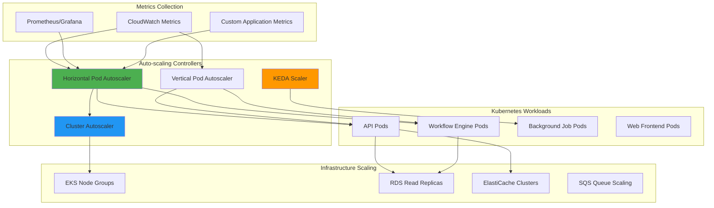

# Auto-scaling & Performance Optimization

## Overview

This document outlines the auto-scaling strategies, performance optimization techniques, and capacity planning approaches for the Tolstoy platform to ensure optimal resource utilization and cost efficiency while maintaining high availability.

## Auto-scaling Architecture



## Horizontal Pod Autoscaler (HPA)

### 1. API Service HPA Configuration

<Tabs>
  <Tab title="CPU & Memory Based">
    ```yaml
    # api-hpa-cpu-memory.yaml
    apiVersion: autoscaling/v2
    kind: HorizontalPodAutoscaler
    metadata:
      name: tolstoy-api-hpa
      namespace: tolstoy-prod
      labels:
        app: tolstoy-api
        tier: production
    spec:
      scaleTargetRef:
        apiVersion: apps/v1
        kind: Deployment
        name: tolstoy-api
      
      minReplicas: 5
      maxReplicas: 50
      
      metrics:
      # CPU utilization target
      - type: Resource
        resource:
          name: cpu
          target:
            type: Utilization
            averageUtilization: 70
      
      # Memory utilization target
      - type: Resource
        resource:
          name: memory
          target:
            type: Utilization
            averageUtilization: 80
      
      # Scale-up/down behavior configuration
      behavior:
        scaleDown:
          stabilizationWindowSeconds: 300  # Wait 5 minutes before scaling down
          policies:
          - type: Percent
            value: 10    # Scale down by max 10% of current replicas
            periodSeconds: 60
          - type: Pods
            value: 2     # Scale down by max 2 pods
            periodSeconds: 60
          selectPolicy: Min  # Use the most conservative policy
        
        scaleUp:
          stabilizationWindowSeconds: 60   # Wait 1 minute before scaling up
          policies:
          - type: Percent
            value: 50    # Scale up by max 50% of current replicas
            periodSeconds: 60
          - type: Pods
            value: 5     # Scale up by max 5 pods
            periodSeconds: 60
          selectPolicy: Max  # Use the most aggressive policy
    ```
  </Tab>
  
  <Tab title="Custom Metrics Based">
    ```yaml
    # api-hpa-custom-metrics.yaml
    apiVersion: autoscaling/v2
    kind: HorizontalPodAutoscaler
    metadata:
      name: tolstoy-api-hpa-custom
      namespace: tolstoy-prod
    spec:
      scaleTargetRef:
        apiVersion: apps/v1
        kind: Deployment
        name: tolstoy-api
      
      minReplicas: 5
      maxReplicas: 100
      
      metrics:
      # Response time based scaling
      - type: Object
        object:
          metric:
            name: http_request_duration_p95
          describedObject:
            apiVersion: v1
            kind: Service
            name: tolstoy-api-service
          target:
            type: Value
            value: "500m"  # 500ms
      
      # Request rate based scaling  
      - type: Object
        object:
          metric:
            name: http_requests_per_second
          describedObject:
            apiVersion: v1
            kind: Service
            name: tolstoy-api-service
          target:
            type: Value
            value: "100"   # 100 RPS per pod
      
      # Active connections based scaling
      - type: Object
        object:
          metric:
            name: active_connections_per_pod
          describedObject:
            apiVersion: v1
            kind: Service
            name: tolstoy-api-service
          target:
            type: Value
            value: "50"    # 50 active connections per pod
      
      # Queue depth based scaling
      - type: External
        external:
          metric:
            name: sqs_queue_depth
            selector:
              matchLabels:
                queue: "tolstoy-workflow-processing"
          target:
            type: AverageValue
            averageValue: "30"  # 30 messages per pod
      
      behavior:
        scaleDown:
          stabilizationWindowSeconds: 600  # 10 minutes
          policies:
          - type: Percent
            value: 25
            periodSeconds: 300
        scaleUp:
          stabilizationWindowSeconds: 30   # 30 seconds
          policies:
          - type: Percent
            value: 100   # Can double the replicas
            periodSeconds: 60
    ```
  </Tab>
  
  <Tab title="Workflow Engine HPA">
    ```yaml
    # workflow-engine-hpa.yaml
    apiVersion: autoscaling/v2
    kind: HorizontalPodAutoscaler
    metadata:
      name: tolstoy-workflow-hpa
      namespace: tolstoy-prod
    spec:
      scaleTargetRef:
        apiVersion: apps/v1
        kind: Deployment
        name: tolstoy-workflow-engine
      
      minReplicas: 3
      maxReplicas: 30
      
      metrics:
      # CPU utilization (workflow processing is CPU intensive)
      - type: Resource
        resource:
          name: cpu
          target:
            type: Utilization
            averageUtilization: 75
      
      # Memory utilization
      - type: Resource
        resource:
          name: memory
          target:
            type: Utilization
            averageUtilization: 70
      
      # Workflow queue depth (most important metric)
      - type: External
        external:
          metric:
            name: sqs_approximate_number_of_messages
            selector:
              matchLabels:
                queue_name: "tolstoy-workflow-processing"
          target:
            type: AverageValue
            averageValue: "20"  # 20 messages per pod
      
      # Active workflow executions per pod
      - type: Object
        object:
          metric:
            name: active_workflow_executions
          describedObject:
            apiVersion: apps/v1
            kind: Deployment
            name: tolstoy-workflow-engine
          target:
            type: AverageValue
            averageValue: "5"   # 5 concurrent executions per pod
      
      behavior:
        scaleDown:
          stabilizationWindowSeconds: 900  # 15 minutes
          policies:
          - type: Percent
            value: 20
            periodSeconds: 300
        scaleUp:
          stabilizationWindowSeconds: 60
          policies:
          - type: Pods
            value: 5     # Add up to 5 pods at once
            periodSeconds: 60
    ```
  </Tab>
</Tabs>

### 2. Custom Metrics Collection

<Tabs>
  <Tab title="Prometheus ServiceMonitor">
    ```yaml
    # prometheus-servicemonitor.yaml
    apiVersion: monitoring.coreos.com/v1
    kind: ServiceMonitor
    metadata:
      name: tolstoy-api-metrics
      namespace: tolstoy-prod
      labels:
        app: tolstoy-api
        prometheus: kube-prometheus
    spec:
      selector:
        matchLabels:
          app: tolstoy-api
      endpoints:
      - port: metrics
        interval: 30s
        path: /metrics
        scheme: http
        
    ---
    apiVersion: monitoring.coreos.com/v1
    kind: ServiceMonitor
    metadata:
      name: tolstoy-workflow-metrics
      namespace: tolstoy-prod
    spec:
      selector:
        matchLabels:
          app: tolstoy-workflow-engine
      endpoints:
      - port: metrics
        interval: 15s  # More frequent for workflow metrics
        path: /metrics
    ```
  </Tab>
  
  <Tab title="Custom Metrics Adapter">
    ```yaml
    # prometheus-adapter-config.yaml
    apiVersion: v1
    kind: ConfigMap
    metadata:
      name: adapter-config
      namespace: custom-metrics
    data:
      config.yaml: |
        rules:
        # HTTP request duration P95
        - seriesQuery: 'http_request_duration_seconds{job="tolstoy-api"}'
          metricsQuery: 'histogram_quantile(0.95, rate(<<.Series>>{<<.LabelMatchers>>}[2m]))'
          name:
            matches: "^http_request_duration_seconds"
            as: "http_request_duration_p95"
          resources:
            overrides:
              namespace: {resource: "namespace"}
              service: {resource: "service"}
        
        # HTTP requests per second
        - seriesQuery: 'http_requests_total{job="tolstoy-api"}'
          metricsQuery: 'rate(<<.Series>>{<<.LabelMatchers>>}[1m])'
          name:
            matches: "^http_requests_total"
            as: "http_requests_per_second"
          resources:
            overrides:
              namespace: {resource: "namespace"}
              service: {resource: "service"}
        
        # Active connections per pod
        - seriesQuery: 'active_connections{job="tolstoy-api"}'
          metricsQuery: 'avg(<<.Series>>{<<.LabelMatchers>>}) by (<<.GroupBy>>)'
          name:
            matches: "^active_connections"
            as: "active_connections_per_pod"
          resources:
            overrides:
              namespace: {resource: "namespace"}
              pod: {resource: "pod"}
        
        # Active workflow executions
        - seriesQuery: 'workflow_executions_active{job="tolstoy-workflow"}'
          metricsQuery: 'avg(<<.Series>>{<<.LabelMatchers>>}) by (<<.GroupBy>>)'
          name:
            matches: "^workflow_executions_active"
            as: "active_workflow_executions"
          resources:
            overrides:
              namespace: {resource: "namespace"}
              deployment: {resource: "deployment"}
        
        # External metrics (SQS)
        externalRules:
        - seriesQuery: 'aws_sqs_approximate_number_of_messages_average'
          metricsQuery: 'avg(<<.Series>>{queue_name="tolstoy-workflow-processing"})'
          name:
            matches: "^aws_sqs_approximate_number_of_messages_average"
            as: "sqs_queue_depth"
        
        - seriesQuery: 'aws_sqs_approximate_number_of_messages_average'
          metricsQuery: '<<.Series>>{<<.LabelMatchers>>}'
          name:
            matches: "^aws_sqs_approximate_number_of_messages_average"
            as: "sqs_approximate_number_of_messages"
    ```
  </Tab>
</Tabs>

## Vertical Pod Autoscaler (VPA)

### 1. VPA Configuration

```yaml
# vpa-configurations.yaml
apiVersion: autoscaling.k8s.io/v1
kind: VerticalPodAutoscaler
metadata:
  name: tolstoy-api-vpa
  namespace: tolstoy-prod
spec:
  targetRef:
    apiVersion: apps/v1
    kind: Deployment
    name: tolstoy-api
  
  updatePolicy:
    updateMode: "Auto"    # Auto, Off, Initial, or Recreate
    minReplicas: 3        # Don't scale down below this during updates
  
  resourcePolicy:
    containerPolicies:
    - containerName: api
      minAllowed:
        cpu: 100m
        memory: 256Mi
      maxAllowed:
        cpu: 2000m
        memory: 4Gi
      controlledResources: ["cpu", "memory"]
      controlledValues: RequestsAndLimits

---
# VPA for workflow engine with different settings
apiVersion: autoscaling.k8s.io/v1
kind: VerticalPodAutoscaler
metadata:
  name: tolstoy-workflow-vpa
  namespace: tolstoy-prod
spec:
  targetRef:
    apiVersion: apps/v1
    kind: Deployment
    name: tolstoy-workflow-engine
  
  updatePolicy:
    updateMode: "Initial"  # Only set resources on pod creation
  
  resourcePolicy:
    containerPolicies:
    - containerName: workflow-engine
      minAllowed:
        cpu: 200m
        memory: 512Mi
      maxAllowed:
        cpu: 4000m     # Workflow processing can be CPU intensive
        memory: 8Gi
      controlledResources: ["cpu", "memory"]

---
# VPA for background jobs - recommendation only
apiVersion: autoscaling.k8s.io/v1
kind: VerticalPodAutoscaler
metadata:
  name: tolstoy-background-jobs-vpa
  namespace: tolstoy-prod
spec:
  targetRef:
    apiVersion: apps/v1
    kind: Deployment
    name: tolstoy-background-jobs
  
  updatePolicy:
    updateMode: "Off"     # Recommendation only, no automatic updates
  
  resourcePolicy:
    containerPolicies:
    - containerName: background-jobs
      minAllowed:
        cpu: 50m
        memory: 128Mi
      maxAllowed:
        cpu: 1000m
        memory: 2Gi
```

## Cluster Autoscaler

### 1. Cluster Autoscaler Configuration

<Tabs>
  <Tab title="Deployment">
    ```yaml
    # cluster-autoscaler.yaml
    apiVersion: apps/v1
    kind: Deployment
    metadata:
      name: cluster-autoscaler
      namespace: kube-system
      labels:
        app: cluster-autoscaler
    spec:
      replicas: 1
      selector:
        matchLabels:
          app: cluster-autoscaler
      template:
        metadata:
          labels:
            app: cluster-autoscaler
        spec:
          priorityClassName: system-cluster-critical
          securityContext:
            runAsNonRoot: true
            runAsUser: 65534
            fsGroup: 65534
          serviceAccountName: cluster-autoscaler
          containers:
          - image: k8s.gcr.io/autoscaling/cluster-autoscaler:v1.28.0
            name: cluster-autoscaler
            resources:
              limits:
                cpu: 100m
                memory: 600Mi
              requests:
                cpu: 100m
                memory: 600Mi
            command:
            - ./cluster-autoscaler
            - --v=4
            - --stderrthreshold=info
            - --cloud-provider=aws
            - --skip-nodes-with-local-storage=false
            - --expander=least-waste
            - --node-group-auto-discovery=asg:tag=k8s.io/cluster-autoscaler/enabled,k8s.io/cluster-autoscaler/tolstoy-production
            - --balance-similar-node-groups
            - --scale-down-enabled=true
            - --scale-down-delay-after-add=10m
            - --scale-down-delay-after-delete=10s
            - --scale-down-delay-after-failure=3m
            - --scale-down-unneeded-time=10m
            - --scale-down-utilization-threshold=0.5
            - --skip-nodes-with-system-pods=false
            - --max-node-provision-time=15m
            volumeMounts:
            - name: ssl-certs
              mountPath: /etc/ssl/certs/ca-certificates.crt
              readOnly: true
            imagePullPolicy: "Always"
            env:
            - name: AWS_REGION
              value: us-west-2
          volumes:
          - name: ssl-certs
            hostPath:
              path: "/etc/ssl/certs/ca-bundle.crt"
          nodeSelector:
            kubernetes.io/arch: amd64
            kubernetes.io/os: linux
    
    ---
    apiVersion: v1
    kind: ServiceAccount
    metadata:
      labels:
        k8s-addon: cluster-autoscaler.addons.k8s.io
        k8s-app: cluster-autoscaler
      name: cluster-autoscaler
      namespace: kube-system
      annotations:
        eks.amazonaws.com/role-arn: arn:aws:iam::123456789012:role/tolstoy-cluster-autoscaler
    ```
  </Tab>
  
  <Tab title="Priority Expander Config">
    ```yaml
    # cluster-autoscaler-priority-config.yaml
    apiVersion: v1
    kind: ConfigMap
    metadata:
      name: cluster-autoscaler-priority-expander
      namespace: kube-system
    data:
      priorities: |-
        10:
          - .*spot.*
        5:
          - .*on-demand.*
        1:
          - .*
    
    # Updated deployment to use priority expander
    ---
    apiVersion: apps/v1
    kind: Deployment
    metadata:
      name: cluster-autoscaler
      namespace: kube-system
    spec:
      template:
        spec:
          containers:
          - name: cluster-autoscaler
            command:
            - ./cluster-autoscaler
            - --expander=priority,least-waste
            - --expandor-priorities-config-map=cluster-autoscaler-priority-expander
            # ... other args
            volumeMounts:
            - name: priority-expander-config
              mountPath: /etc/cluster-autoscaler
          volumes:
          - name: priority-expander-config
            configMap:
              name: cluster-autoscaler-priority-expander
    ```
  </Tab>
  
  <Tab title="Node Group Scaling Policies">
    ```hcl
    # eks-node-groups-autoscaling.tf
    resource "aws_eks_node_group" "api_nodes_spot" {
      cluster_name    = aws_eks_cluster.tolstoy.name
      node_group_name = "api-nodes-spot"
      node_role_arn   = aws_iam_role.eks_node_group.arn
      subnet_ids      = aws_subnet.private[*].id
      
      # Instance configuration
      instance_types = ["m5.large", "m5.xlarge", "m5a.large", "m5a.xlarge", "m6i.large", "m6i.xlarge"]
      capacity_type  = "SPOT"
      
      scaling_config {
        desired_size = 10
        max_size     = 50    # Allow significant scaling
        min_size     = 5
      }
      
      # Spot instance configuration
      launch_template {
        id      = aws_launch_template.eks_nodes_spot.id
        version = "$Latest"
      }
      
      # Taints for spot instances
      taint {
        key    = "spot-instance"
        value  = "true"
        effect = "NO_SCHEDULE"
      }
      
      # Labels for node selection
      labels = {
        "node-type"                                      = "spot"
        "tolstoy.dev/instance-type"                     = "mixed"
        "kubernetes.io/arch"                            = "amd64"
        "node.kubernetes.io/instance-type"              = "mixed"
      }
      
      # Auto Scaling Group tags
      tags = {
        "k8s.io/cluster-autoscaler/tolstoy-production" = "owned"
        "k8s.io/cluster-autoscaler/enabled"            = "true"
        "k8s.io/cluster-autoscaler/node-template/label/node-type" = "spot"
        "k8s.io/cluster-autoscaler/node-template/taint/spot-instance" = "true:NoSchedule"
      }
    }
    
    resource "aws_eks_node_group" "workflow_nodes_on_demand" {
      cluster_name    = aws_eks_cluster.tolstoy.name
      node_group_name = "workflow-nodes-on-demand"
      node_role_arn   = aws_iam_role.eks_node_group.arn
      subnet_ids      = aws_subnet.private[*].id
      
      # CPU-optimized instances for workflow processing
      instance_types = ["c5.large", "c5.xlarge", "c6i.large", "c6i.xlarge"]
      capacity_type  = "ON_DEMAND"
      
      scaling_config {
        desired_size = 6
        max_size     = 30
        min_size     = 3
      }
      
      labels = {
        "node-type"                         = "on-demand"
        "tolstoy.dev/workload"             = "workflow-processing"
        "kubernetes.io/arch"               = "amd64"
      }
      
      tags = {
        "k8s.io/cluster-autoscaler/tolstoy-production" = "owned"
        "k8s.io/cluster-autoscaler/enabled"            = "true"
        "k8s.io/cluster-autoscaler/node-template/label/node-type" = "on-demand"
        "k8s.io/cluster-autoscaler/node-template/label/tolstoy.dev/workload" = "workflow-processing"
      }
    }
    ```
  </Tab>
</Tabs>

## KEDA (Kubernetes Event-driven Autoscaling)

### 1. KEDA ScaledObject Configurations

<Tabs>
  <Tab title="SQS Queue Scaler">
    ```yaml
    # keda-sqs-scaler.yaml
    apiVersion: keda.sh/v1alpha1
    kind: ScaledObject
    metadata:
      name: tolstoy-workflow-processor-scaler
      namespace: tolstoy-prod
    spec:
      scaleTargetRef:
        name: tolstoy-workflow-processor
      
      minReplicaCount: 2
      maxReplicaCount: 50
      
      # Advanced scaling behavior
      advanced:
        restoreToOriginalReplicaCount: true
        horizontalPodAutoscalerConfig:
          behavior:
            scaleDown:
              stabilizationWindowSeconds: 300
              policies:
              - type: Percent
                value: 50
                periodSeconds: 60
            scaleUp:
              stabilizationWindowSeconds: 60
              policies:
              - type: Percent
                value: 100
                periodSeconds: 30
      
      triggers:
      - type: aws-sqs-queue
        metadata:
          queueURL: "https://sqs.us-west-2.amazonaws.com/123456789012/tolstoy-workflow-processing"
          queueLength: "10"     # Target: 10 messages per pod
          awsRegion: "us-west-2"
          identityOwner: "operator"  # Use IRSA
        authenticationRef:
          name: keda-aws-credentials
      
      # Scale based on high priority queue as well
      - type: aws-sqs-queue
        metadata:
          queueURL: "https://sqs.us-west-2.amazonaws.com/123456789012/tolstoy-workflow-high-priority"
          queueLength: "3"      # More sensitive scaling for high priority
          awsRegion: "us-west-2"
          identityOwner: "operator"
        authenticationRef:
          name: keda-aws-credentials
    
    ---
    apiVersion: keda.sh/v1alpha1
    kind: TriggerAuthentication
    metadata:
      name: keda-aws-credentials
      namespace: tolstoy-prod
    spec:
      podIdentity:
        provider: aws-eks  # Use IRSA
    ```
  </Tab>
  
  <Tab title="Prometheus Scaler">
    ```yaml
    # keda-prometheus-scaler.yaml
    apiVersion: keda.sh/v1alpha1
    kind: ScaledObject
    metadata:
      name: tolstoy-api-prometheus-scaler
      namespace: tolstoy-prod
    spec:
      scaleTargetRef:
        name: tolstoy-api
      
      minReplicaCount: 5
      maxReplicaCount: 100
      
      triggers:
      # Scale based on HTTP request rate
      - type: prometheus
        metadata:
          serverAddress: http://prometheus-server.monitoring.svc.cluster.local:9090
          metricName: http_requests_per_second
          threshold: "50"
          query: 'sum(rate(http_requests_total{job="tolstoy-api"}[2m]))'
      
      # Scale based on response time
      - type: prometheus
        metadata:
          serverAddress: http://prometheus-server.monitoring.svc.cluster.local:9090
          metricName: http_response_time_p95
          threshold: "0.5"   # 500ms
          query: 'histogram_quantile(0.95, sum(rate(http_request_duration_seconds_bucket{job="tolstoy-api"}[2m])) by (le))'
      
      # Scale based on active connections
      - type: prometheus
        metadata:
          serverAddress: http://prometheus-server.monitoring.svc.cluster.local:9090
          metricName: active_connections_avg
          threshold: "100"
          query: 'avg(nodejs_active_handles{job="tolstoy-api"})'
    ```
  </Tab>
  
  <Tab title="Cron Scaler">
    ```yaml
    # keda-cron-scaler.yaml
    apiVersion: keda.sh/v1alpha1
    kind: ScaledObject
    metadata:
      name: tolstoy-background-jobs-cron-scaler
      namespace: tolstoy-prod
    spec:
      scaleTargetRef:
        name: tolstoy-background-jobs
      
      minReplicaCount: 1
      maxReplicaCount: 10
      
      triggers:
      # Scale up for business hours (9 AM - 6 PM UTC)
      - type: cron
        metadata:
          timezone: "UTC"
          start: "0 9 * * 1-5"    # 9 AM Monday-Friday
          end: "0 18 * * 1-5"     # 6 PM Monday-Friday
          desiredReplicas: "8"
      
      # Scale up for weekend maintenance (Saturday night)
      - type: cron
        metadata:
          timezone: "UTC"
          start: "0 2 * * 7"      # 2 AM Sunday (maintenance window)
          end: "0 6 * * 7"        # 6 AM Sunday
          desiredReplicas: "15"
      
      # Scale down during low usage hours
      - type: cron
        metadata:
          timezone: "UTC"
          start: "0 22 * * *"     # 10 PM every day
          end: "0 6 * * *"        # 6 AM every day
          desiredReplicas: "2"
    ```
  </Tab>
</Tabs>

### 2. KEDA Installation and Configuration

```yaml
# keda-installation.yaml
apiVersion: v1
kind: Namespace
metadata:
  name: keda

---
# Install KEDA using Helm via ArgoCD or direct helm
# helm repo add kedacore https://kedacore.github.io/charts
# helm install keda kedacore/keda --namespace keda --create-namespace

# IRSA role for KEDA operator
apiVersion: v1
kind: ServiceAccount
metadata:
  name: keda-operator
  namespace: keda
  annotations:
    eks.amazonaws.com/role-arn: arn:aws:iam::123456789012:role/tolstoy-keda-operator

---
# ClusterRole for KEDA
apiVersion: rbac.authorization.k8s.io/v1
kind: ClusterRole
metadata:
  name: keda-operator
rules:
- apiGroups: [""]
  resources: ["pods", "services", "configmaps", "secrets"]
  verbs: ["get", "list", "watch"]
- apiGroups: ["apps"]
  resources: ["deployments", "replicasets"]
  verbs: ["get", "list", "watch", "update", "patch"]
- apiGroups: ["autoscaling"]
  resources: ["horizontalpodautoscalers"]
  verbs: ["*"]
- apiGroups: ["keda.sh"]
  resources: ["scaledobjects", "triggerauthentications"]
  verbs: ["*"]

---
apiVersion: rbac.authorization.k8s.io/v1
kind: ClusterRoleBinding
metadata:
  name: keda-operator
roleRef:
  apiGroup: rbac.authorization.k8s.io
  kind: ClusterRole
  name: keda-operator
subjects:
- kind: ServiceAccount
  name: keda-operator
  namespace: keda
```

## Database Auto-scaling

### 1. RDS Read Replica Auto-scaling

<Tabs>
  <Tab title="CloudWatch Alarms">
    ```hcl
    # rds-autoscaling.tf
    
    # CPU utilization alarm for read replicas
    resource "aws_cloudwatch_metric_alarm" "rds_cpu_high" {
      alarm_name          = "tolstoy-rds-cpu-utilization-high"
      comparison_operator = "GreaterThanThreshold"
      evaluation_periods  = "2"
      metric_name         = "CPUUtilization"
      namespace           = "AWS/RDS"
      period              = "300"
      statistic           = "Average"
      threshold           = "75"
      alarm_description   = "This metric monitors RDS CPU utilization"
      
      dimensions = {
        DBInstanceIdentifier = aws_db_instance.tolstoy_primary.id
      }
      
      alarm_actions = [aws_sns_topic.rds_scaling.arn]
      ok_actions    = [aws_sns_topic.rds_scaling.arn]
      
      tags = {
        Environment = "production"
        Service = "rds-monitoring"
      }
    }
    
    # Read latency alarm
    resource "aws_cloudwatch_metric_alarm" "rds_read_latency" {
      alarm_name          = "tolstoy-rds-read-latency-high"
      comparison_operator = "GreaterThanThreshold"
      evaluation_periods  = "3"
      metric_name         = "ReadLatency"
      namespace           = "AWS/RDS"
      period              = "300"
      statistic           = "Average"
      threshold           = "0.2"  # 200ms
      alarm_description   = "This metric monitors RDS read latency"
      
      dimensions = {
        DBInstanceIdentifier = aws_db_instance.tolstoy_primary.id
      }
      
      alarm_actions = [aws_lambda_function.create_read_replica.arn]
      
      tags = {
        Environment = "production"
        Service = "rds-monitoring"
      }
    }
    
    # Connection count alarm
    resource "aws_cloudwatch_metric_alarm" "rds_connections_high" {
      alarm_name          = "tolstoy-rds-connections-high"
      comparison_operator = "GreaterThanThreshold"
      evaluation_periods  = "2"
      metric_name         = "DatabaseConnections"
      namespace           = "AWS/RDS"
      period              = "300"
      statistic           = "Average"
      threshold           = "400"  # 80% of max_connections
      
      dimensions = {
        DBInstanceIdentifier = aws_db_instance.tolstoy_primary.id
      }
      
      alarm_actions = [aws_lambda_function.create_read_replica.arn]
    }
    ```
  </Tab>
  
  <Tab title="Auto-scaling Lambda">
    ```python
    # lambda/rds_autoscaler.py
    import boto3
    import json
    import logging
    from datetime import datetime, timedelta
    
    logger = logging.getLogger()
    logger.setLevel(logging.INFO)
    
    rds_client = boto3.client('rds')
    cloudwatch = boto3.client('cloudwatch')
    
    def lambda_handler(event, context):
        """
        Auto-scale RDS read replicas based on load
        """
        try:
            # Parse CloudWatch alarm
            message = json.loads(event['Records'][0]['Sns']['Message'])
            alarm_name = message['AlarmName']
            new_state = message['NewStateValue']
            
            if new_state == 'ALARM':
                if 'read-latency' in alarm_name or 'connections' in alarm_name:
                    create_read_replica_if_needed()
                elif 'cpu-utilization-high' in alarm_name:
                    scale_up_existing_replicas()
            
            return {
                'statusCode': 200,
                'body': json.dumps('Auto-scaling action completed')
            }
            
        except Exception as e:
            logger.error(f"Error in RDS auto-scaling: {str(e)}")
            return {
                'statusCode': 500,
                'body': json.dumps(f'Error: {str(e)}')
            }
    
    def create_read_replica_if_needed():
        """Create new read replica if we haven't reached the limit"""
        try:
            # Get existing read replicas
            response = rds_client.describe_db_instances()
            replicas = [db for db in response['DBInstances'] 
                       if db['DBInstanceIdentifier'].startswith('tolstoy-prod-replica')]
            
            max_replicas = 5
            if len(replicas) < max_replicas:
                replica_id = f"tolstoy-prod-replica-{len(replicas) + 1}"
                
                logger.info(f"Creating new read replica: {replica_id}")
                
                rds_client.create_db_instance_read_replica(
                    DBInstanceIdentifier=replica_id,
                    SourceDBInstanceIdentifier='tolstoy-prod-primary',
                    DBInstanceClass='db.r6g.large',
                    PubliclyAccessible=False,
                    MultiAZ=False,
                    StorageEncrypted=True,
                    PerformanceInsightsEnabled=True,
                    MonitoringInterval=60,
                    MonitoringRoleArn='arn:aws:iam::123456789012:role/rds-monitoring-role',
                    Tags=[
                        {'Key': 'Environment', 'Value': 'production'},
                        {'Key': 'Project', 'Value': 'tolstoy'},
                        {'Key': 'AutoScaled', 'Value': 'true'},
                        {'Key': 'CreatedAt', 'Value': datetime.now().isoformat()}
                    ]
                )
                
                logger.info(f"Successfully initiated creation of replica: {replica_id}")
            else:
                logger.info(f"Maximum replicas ({max_replicas}) already reached")
                
        except Exception as e:
            logger.error(f"Error creating read replica: {str(e)}")
            raise
    
    def scale_up_existing_replicas():
        """Scale up existing read replicas to larger instance classes"""
        try:
            response = rds_client.describe_db_instances()
            replicas = [db for db in response['DBInstances'] 
                       if db['DBInstanceIdentifier'].startswith('tolstoy-prod-replica')
                       and db['DBInstanceStatus'] == 'available']
            
            # Scale up replicas that are still on smaller instance classes
            scale_up_map = {
                'db.r6g.large': 'db.r6g.xlarge',
                'db.r6g.xlarge': 'db.r6g.2xlarge'
            }
            
            for replica in replicas:
                current_class = replica['DBInstanceClass']
                if current_class in scale_up_map:
                    new_class = scale_up_map[current_class]
                    replica_id = replica['DBInstanceIdentifier']
                    
                    logger.info(f"Scaling up {replica_id} from {current_class} to {new_class}")
                    
                    rds_client.modify_db_instance(
                        DBInstanceIdentifier=replica_id,
                        DBInstanceClass=new_class,
                        ApplyImmediately=False  # Apply during maintenance window
                    )
                    
        except Exception as e:
            logger.error(f"Error scaling up replicas: {str(e)}")
            raise
    
    def cleanup_unused_replicas():
        """
        Remove auto-scaled replicas that are no longer needed
        This function should be called by a separate scheduled Lambda
        """
        try:
            # Get metrics for the last hour
            end_time = datetime.utcnow()
            start_time = end_time - timedelta(hours=1)
            
            response = rds_client.describe_db_instances()
            auto_scaled_replicas = [
                db for db in response['DBInstances'] 
                if db['DBInstanceIdentifier'].startswith('tolstoy-prod-replica')
                and any(tag['Key'] == 'AutoScaled' and tag['Value'] == 'true' 
                       for tag in db.get('TagList', []))
            ]
            
            for replica in auto_scaled_replicas:
                replica_id = replica['DBInstanceIdentifier']
                
                # Get connection count metrics
                metrics = cloudwatch.get_metric_statistics(
                    Namespace='AWS/RDS',
                    MetricName='DatabaseConnections',
                    Dimensions=[
                        {'Name': 'DBInstanceIdentifier', 'Value': replica_id}
                    ],
                    StartTime=start_time,
                    EndTime=end_time,
                    Period=300,
                    Statistics=['Average']
                )
                
                # If average connections < 10 for the last hour, consider removing
                if metrics['Datapoints']:
                    avg_connections = sum(dp['Average'] for dp in metrics['Datapoints']) / len(metrics['Datapoints'])
                    
                    if avg_connections < 10:
                        # Check if replica was created more than 1 hour ago
                        created_time = None
                        for tag in replica.get('TagList', []):
                            if tag['Key'] == 'CreatedAt':
                                created_time = datetime.fromisoformat(tag['Value'])
                                break
                        
                        if created_time and (datetime.now() - created_time).total_seconds() > 3600:
                            logger.info(f"Removing underutilized replica: {replica_id}")
                            rds_client.delete_db_instance(
                                DBInstanceIdentifier=replica_id,
                                SkipFinalSnapshot=True
                            )
                
        except Exception as e:
            logger.error(f"Error cleaning up replicas: {str(e)}")
            raise
    ```
  </Tab>
</Tabs>

### 2. ElastiCache Auto-scaling

```hcl
# elasticache-autoscaling.tf
resource "aws_appautoscaling_target" "redis_target" {
  max_capacity       = 20
  min_capacity       = 3
  resource_id        = "replication-group/${aws_elasticache_replication_group.tolstoy.replication_group_id}"
  scalable_dimension = "elasticache:replication-group:Replicas"
  service_namespace  = "elasticache"
}

resource "aws_appautoscaling_policy" "redis_cpu_policy" {
  name               = "tolstoy-redis-cpu-scaling-policy"
  policy_type        = "TargetTrackingScaling"
  resource_id        = aws_appautoscaling_target.redis_target.resource_id
  scalable_dimension = aws_appautoscaling_target.redis_target.scalable_dimension
  service_namespace  = aws_appautoscaling_target.redis_target.service_namespace

  target_tracking_scaling_policy_configuration {
    predefined_metric_specification {
      predefined_metric_type = "ElastiCachePrimaryCPUUtilization"
    }
    target_value = 70.0
    
    scale_out_cooldown = 300  # 5 minutes
    scale_in_cooldown  = 300  # 5 minutes
  }
}

resource "aws_appautoscaling_policy" "redis_memory_policy" {
  name               = "tolstoy-redis-memory-scaling-policy"
  policy_type        = "TargetTrackingScaling"
  resource_id        = aws_appautoscaling_target.redis_target.resource_id
  scalable_dimension = aws_appautoscaling_target.redis_target.scalable_dimension
  service_namespace  = aws_appautoscaling_target.redis_target.service_namespace

  target_tracking_scaling_policy_configuration {
    predefined_metric_specification {
      predefined_metric_type = "ElastiCacheDatabaseMemoryUsageCountedForEvictPercentage"
    }
    target_value = 80.0
  }
}
```

## Performance Optimization

### 1. Application Performance Tuning

<Tabs>
  <Tab title="Pod Resource Optimization">
    ```yaml
    # optimized-deployments.yaml
    apiVersion: apps/v1
    kind: Deployment
    metadata:
      name: tolstoy-api-optimized
      namespace: tolstoy-prod
    spec:
      replicas: 10
      selector:
        matchLabels:
          app: tolstoy-api
      template:
        metadata:
          labels:
            app: tolstoy-api
        spec:
          # Node selection and affinity
          nodeSelector:
            node-type: "on-demand"  # Prefer stable nodes for API
          
          affinity:
            podAntiAffinity:
              preferredDuringSchedulingIgnoredDuringExecution:
              - weight: 100
                podAffinityTerm:
                  labelSelector:
                    matchLabels:
                      app: tolstoy-api
                  topologyKey: kubernetes.io/hostname
            
            nodeAffinity:
              preferredDuringSchedulingIgnoredDuringExecution:
              - weight: 80
                preference:
                  matchExpressions:
                  - key: node.kubernetes.io/instance-type
                    operator: In
                    values: ["m6i.large", "m6i.xlarge", "m5.large", "m5.xlarge"]
          
          # Topology spread constraints
          topologySpreadConstraints:
          - maxSkew: 1
            topologyKey: topology.kubernetes.io/zone
            whenUnsatisfiable: ScheduleAnyway
            labelSelector:
              matchLabels:
                app: tolstoy-api
          
          containers:
          - name: api
            image: tolstoy/api:latest
            
            # Optimized resource requests and limits
            resources:
              requests:
                cpu: 200m
                memory: 512Mi
                ephemeral-storage: 2Gi
              limits:
                cpu: 1000m
                memory: 2Gi
                ephemeral-storage: 4Gi
            
            # Startup and readiness probes
            startupProbe:
              httpGet:
                path: /health/startup
                port: 3000
              initialDelaySeconds: 10
              periodSeconds: 5
              failureThreshold: 30  # Allow 150 seconds for startup
              successThreshold: 1
            
            readinessProbe:
              httpGet:
                path: /health/ready
                port: 3000
              initialDelaySeconds: 5
              periodSeconds: 10
              failureThreshold: 3
              successThreshold: 1
            
            livenessProbe:
              httpGet:
                path: /health/live
                port: 3000
              initialDelaySeconds: 30
              periodSeconds: 30
              failureThreshold: 3
              successThreshold: 1
              timeoutSeconds: 5
            
            # Environment variables for performance tuning
            env:
            - name: NODE_ENV
              value: "production"
            - name: MAX_OLD_SPACE_SIZE
              value: "1536"  # 1.5GB heap size
            - name: UV_THREADPOOL_SIZE
              value: "16"    # Increase libuv thread pool
            - name: DB_POOL_SIZE
              value: "20"    # Database connection pool size
            - name: REDIS_POOL_SIZE
              value: "10"    # Redis connection pool size
            
            ports:
            - containerPort: 3000
              name: http
              protocol: TCP
            - containerPort: 9090
              name: metrics
              protocol: TCP
          
          # Init container for database migrations
          initContainers:
          - name: migrate-database
            image: tolstoy/migrations:latest
            command: ["npm", "run", "migrate"]
            env:
            - name: DATABASE_URL
              valueFrom:
                secretKeyRef:
                  name: database-credentials
                  key: url
          
          # DNS configuration for faster resolution
          dnsPolicy: ClusterFirst
          dnsConfig:
            options:
            - name: ndots
              value: "2"
            - name: edns0
          
          # Security context
          securityContext:
            runAsNonRoot: true
            runAsUser: 1000
            fsGroup: 1000
          
          # Graceful shutdown
          terminationGracePeriodSeconds: 60
    ```
  </Tab>
  
  <Tab title="Quality of Service Classes">
    ```yaml
    # qos-configurations.yaml
    
    # Guaranteed QoS for critical API pods
    apiVersion: apps/v1
    kind: Deployment
    metadata:
      name: tolstoy-api-guaranteed
      namespace: tolstoy-prod
    spec:
      template:
        spec:
          containers:
          - name: api
            resources:
              requests:
                cpu: 500m      # Guaranteed CPU
                memory: 1Gi    # Guaranteed memory
              limits:
                cpu: 500m      # Same as requests for Guaranteed QoS
                memory: 1Gi    # Same as requests for Guaranteed QoS
            
            # Priority class for guaranteed scheduling
            priorityClassName: high-priority
    
    ---
    # Burstable QoS for workflow processing (can use more resources when available)
    apiVersion: apps/v1
    kind: Deployment
    metadata:
      name: tolstoy-workflow-burstable
      namespace: tolstoy-prod
    spec:
      template:
        spec:
          containers:
          - name: workflow-engine
            resources:
              requests:
                cpu: 300m      # Minimum guaranteed
                memory: 512Mi  # Minimum guaranteed
              limits:
                cpu: 2000m     # Can burst up to 2 cores
                memory: 4Gi    # Can burst up to 4GB
    
    ---
    # Best effort QoS for background jobs (lowest priority)
    apiVersion: apps/v1
    kind: Deployment
    metadata:
      name: tolstoy-background-besteffort
      namespace: tolstoy-prod
    spec:
      template:
        spec:
          containers:
          - name: background-jobs
            # No resource requests or limits = Best Effort QoS
            # Will be evicted first under memory pressure
            
            # Use tolerations to run on spot instances
            tolerations:
            - key: "spot-instance"
              operator: "Equal"
              value: "true"
              effect: "NoSchedule"
    
    ---
    # Priority classes
    apiVersion: scheduling.k8s.io/v1
    kind: PriorityClass
    metadata:
      name: high-priority
    value: 1000
    globalDefault: false
    description: "High priority class for critical workloads"
    
    ---
    apiVersion: scheduling.k8s.io/v1
    kind: PriorityClass
    metadata:
      name: medium-priority
    value: 500
    globalDefault: false
    description: "Medium priority class for standard workloads"
    
    ---
    apiVersion: scheduling.k8s.io/v1
    kind: PriorityClass
    metadata:
      name: low-priority
    value: 100
    globalDefault: true
    description: "Low priority class for background workloads"
    ```
  </Tab>
  
  <Tab title="Pod Disruption Budgets">
    ```yaml
    # pod-disruption-budgets.yaml
    
    # PDB for API service - always maintain 70% capacity
    apiVersion: policy/v1
    kind: PodDisruptionBudget
    metadata:
      name: tolstoy-api-pdb
      namespace: tolstoy-prod
    spec:
      minAvailable: 70%
      selector:
        matchLabels:
          app: tolstoy-api
    
    ---
    # PDB for workflow engine - maintain at least 2 pods
    apiVersion: policy/v1
    kind: PodDisruptionBudget
    metadata:
      name: tolstoy-workflow-pdb
      namespace: tolstoy-prod
    spec:
      minAvailable: 2
      selector:
        matchLabels:
          app: tolstoy-workflow-engine
    
    ---
    # PDB for background jobs - can tolerate more disruption
    apiVersion: policy/v1
    kind: PodDisruptionBudget
    metadata:
      name: tolstoy-background-pdb
      namespace: tolstoy-prod
    spec:
      maxUnavailable: 50%
      selector:
        matchLabels:
          app: tolstoy-background-jobs
    ```
  </Tab>
</Tabs>

### 2. Network Performance Optimization

```yaml
# network-optimization.yaml
apiVersion: v1
kind: Service
metadata:
  name: tolstoy-api-service-optimized
  namespace: tolstoy-prod
  annotations:
    # Enable session affinity for better caching
    service.beta.kubernetes.io/aws-load-balancer-target-group-attributes: |
      stickiness.enabled=true,stickiness.lb_cookie.duration_seconds=86400
    
    # Connection draining
    service.beta.kubernetes.io/aws-load-balancer-connection-draining-enabled: "true"
    service.beta.kubernetes.io/aws-load-balancer-connection-draining-timeout: "60"
    
    # Health check configuration
    service.beta.kubernetes.io/aws-load-balancer-healthcheck-interval: "10"
    service.beta.kubernetes.io/aws-load-balancer-healthcheck-timeout: "5"
    service.beta.kubernetes.io/aws-load-balancer-healthcheck-healthy-threshold: "2"
    service.beta.kubernetes.io/aws-load-balancer-healthcheck-unhealthy-threshold: "3"
    
    # Cross-zone load balancing
    service.beta.kubernetes.io/aws-load-balancer-cross-zone-load-balancing-enabled: "true"
spec:
  type: NodePort
  selector:
    app: tolstoy-api
  ports:
  - name: http
    port: 80
    targetPort: 3000
    protocol: TCP
  - name: metrics
    port: 9090
    targetPort: 9090
    protocol: TCP

---
# Network policy for performance and security
apiVersion: networking.k8s.io/v1
kind: NetworkPolicy
metadata:
  name: tolstoy-api-network-policy
  namespace: tolstoy-prod
spec:
  podSelector:
    matchLabels:
      app: tolstoy-api
  policyTypes:
  - Ingress
  - Egress
  
  ingress:
  # Allow traffic from load balancer
  - from:
    - namespaceSelector:
        matchLabels:
          name: kube-system
    ports:
    - protocol: TCP
      port: 3000
  
  # Allow metrics scraping
  - from:
    - namespaceSelector:
        matchLabels:
          name: monitoring
    ports:
    - protocol: TCP
      port: 9090
  
  egress:
  # Allow database connections
  - to: []
    ports:
    - protocol: TCP
      port: 5432
  
  # Allow Redis connections
  - to: []
    ports:
    - protocol: TCP
      port: 6379
  
  # Allow HTTPS outbound
  - to: []
    ports:
    - protocol: TCP
      port: 443
```

### 3. Capacity Planning

<Tabs>
  <Tab title="Load Testing Configuration">
    ```yaml
    # load-testing-job.yaml
    apiVersion: batch/v1
    kind: Job
    metadata:
      name: tolstoy-load-test
      namespace: tolstoy-prod
    spec:
      parallelism: 10
      completions: 10
      backoffLimit: 3
      
      template:
        spec:
          containers:
          - name: load-test
            image: artillery/artillery:latest
            command: ["artillery", "run"]
            args:
            - "--config"
            - "/config/artillery-config.yml"
            - "/config/load-test-scenarios.yml"
            
            resources:
              requests:
                cpu: 100m
                memory: 256Mi
              limits:
                cpu: 500m
                memory: 1Gi
            
            volumeMounts:
            - name: config
              mountPath: /config
          
          volumes:
          - name: config
            configMap:
              name: load-test-config
          
          restartPolicy: OnFailure
    
    ---
    apiVersion: v1
    kind: ConfigMap
    metadata:
      name: load-test-config
      namespace: tolstoy-prod
    data:
      artillery-config.yml: |
        config:
          target: 'https://api.tolstoy.dev'
          phases:
            # Ramp up phase
            - duration: 300
              arrivalRate: 1
              rampTo: 50
              name: "Ramp up"
            
            # Sustained load phase
            - duration: 600
              arrivalRate: 50
              name: "Sustained load"
            
            # Stress test phase
            - duration: 300
              arrivalRate: 50
              rampTo: 200
              name: "Stress test"
            
            # Cool down phase
            - duration: 300
              arrivalRate: 200
              rampTo: 1
              name: "Cool down"
          
          processor: "./processors/custom-functions.js"
          
          # Performance metrics
          statsInterval: 30
          
          # HTTP configuration
          http:
            timeout: 30
            pool: 50
        
        # Custom metrics
        plugins:
          expect:
            outputFormat: json
          metrics-by-endpoint:
            useOnlyRequestNames: true
      
      load-test-scenarios.yml: |
        scenarios:
        # API health check scenario
        - name: "Health Check"
          weight: 10
          flow:
          - get:
              url: "/health"
              expect:
                - statusCode: 200
                - contentType: json
                - hasProperty: status
        
        # User authentication scenario
        - name: "Authentication"
          weight: 20
          flow:
          - post:
              url: "/api/v1/auth/login"
              json:
                email: "load-test@tolstoy.dev"
                password: "test-password"
              capture:
                json: $.token
                as: auth_token
              expect:
                - statusCode: 200
        
        # Workflow listing scenario
        - name: "List Workflows"
          weight: 30
          flow:
          - get:
              url: "/api/v1/workflows"
              headers:
                Authorization: "Bearer {{ auth_token }}"
              expect:
                - statusCode: 200
                - contentType: json
        
        # Workflow execution scenario
        - name: "Execute Workflow"
          weight: 25
          flow:
          - post:
              url: "/api/v1/workflows/{{ $randomString() }}/execute"
              headers:
                Authorization: "Bearer {{ auth_token }}"
              json:
                input:
                  data: "{{ $randomString() }}"
              expect:
                - statusCode: 202
        
        # Heavy computation scenario
        - name: "Heavy Processing"
          weight: 15
          flow:
          - post:
              url: "/api/v1/workflows/heavy-computation"
              headers:
                Authorization: "Bearer {{ auth_token }}"
              json:
                complexity: "high"
                iterations: 1000
              expect:
                - statusCode: 202
    ```
  </Tab>
  
  <Tab title="Capacity Planning Calculator">
    ```python
    # capacity_planning.py
    import math
    from dataclasses import dataclass
    from typing import Dict, List
    
    @dataclass
    class ResourceRequirement:
        cpu_cores: float
        memory_gb: float
        requests_per_second: int
        concurrent_users: int
    
    @dataclass
    class ServiceConfig:
        name: str
        base_requirement: ResourceRequirement
        scaling_factor: float
        max_replicas: int
        min_replicas: int
    
    class CapacityPlanner:
        def __init__(self):
            self.services = {
                'api': ServiceConfig(
                    name='API Service',
                    base_requirement=ResourceRequirement(
                        cpu_cores=0.5,
                        memory_gb=1.0,
                        requests_per_second=100,
                        concurrent_users=50
                    ),
                    scaling_factor=1.2,  # 20% overhead
                    max_replicas=100,
                    min_replicas=5
                ),
                'workflow': ServiceConfig(
                    name='Workflow Engine',
                    base_requirement=ResourceRequirement(
                        cpu_cores=1.0,
                        memory_gb=2.0,
                        requests_per_second=20,
                        concurrent_users=10
                    ),
                    scaling_factor=1.5,  # 50% overhead for processing
                    max_replicas=50,
                    min_replicas=3
                ),
                'background': ServiceConfig(
                    name='Background Jobs',
                    base_requirement=ResourceRequirement(
                        cpu_cores=0.2,
                        memory_gb=0.5,
                        requests_per_second=10,
                        concurrent_users=5
                    ),
                    scaling_factor=1.1,  # 10% overhead
                    max_replicas=20,
                    min_replicas=2
                )
            }
        
        def calculate_required_replicas(
            self,
            service_name: str,
            target_rps: int,
            target_concurrent_users: int
        ) -> Dict:
            """Calculate required replicas based on load requirements"""
            
            if service_name not in self.services:
                raise ValueError(f"Unknown service: {service_name}")
            
            service = self.services[service_name]
            base = service.base_requirement
            
            # Calculate replicas needed based on RPS
            rps_based_replicas = math.ceil(target_rps / base.requests_per_second)
            
            # Calculate replicas needed based on concurrent users
            user_based_replicas = math.ceil(target_concurrent_users / base.concurrent_users)
            
            # Take the maximum of both requirements
            required_replicas = max(rps_based_replicas, user_based_replicas)
            
            # Apply scaling factor for overhead
            required_replicas = math.ceil(required_replicas * service.scaling_factor)
            
            # Ensure within min/max bounds
            required_replicas = max(service.min_replicas, 
                                  min(required_replicas, service.max_replicas))
            
            # Calculate resource requirements
            total_cpu = required_replicas * base.cpu_cores
            total_memory = required_replicas * base.memory_gb
            
            return {
                'service': service.name,
                'required_replicas': required_replicas,
                'total_cpu_cores': total_cpu,
                'total_memory_gb': total_memory,
                'max_rps_capacity': required_replicas * base.requests_per_second,
                'max_concurrent_users': required_replicas * base.concurrent_users,
                'scaling_factor_applied': service.scaling_factor
            }
        
        def plan_for_load_scenario(
            self,
            scenario_name: str,
            load_requirements: Dict[str, Dict]
        ) -> Dict:
            """Plan capacity for a complete load scenario"""
            
            results = {
                'scenario': scenario_name,
                'services': {},
                'cluster_totals': {
                    'total_cpu_cores': 0,
                    'total_memory_gb': 0,
                    'total_pods': 0
                },
                'node_requirements': {}
            }
            
            for service_name, requirements in load_requirements.items():
                service_plan = self.calculate_required_replicas(
                    service_name,
                    requirements['target_rps'],
                    requirements['target_concurrent_users']
                )
                
                results['services'][service_name] = service_plan
                results['cluster_totals']['total_cpu_cores'] += service_plan['total_cpu_cores']
                results['cluster_totals']['total_memory_gb'] += service_plan['total_memory_gb']
                results['cluster_totals']['total_pods'] += service_plan['required_replicas']
            
            # Calculate node requirements
            results['node_requirements'] = self.calculate_node_requirements(
                results['cluster_totals']['total_cpu_cores'],
                results['cluster_totals']['total_memory_gb']
            )
            
            return results
        
        def calculate_node_requirements(self, total_cpu: float, total_memory: float) -> Dict:
            """Calculate required worker nodes"""
            
            node_types = {
                'm6i.large': {'cpu': 2, 'memory': 8, 'cost_per_hour': 0.096},
                'm6i.xlarge': {'cpu': 4, 'memory': 16, 'cost_per_hour': 0.192},
                'm6i.2xlarge': {'cpu': 8, 'memory': 32, 'cost_per_hour': 0.384},
                'c6i.large': {'cpu': 2, 'memory': 4, 'cost_per_hour': 0.085},
                'c6i.xlarge': {'cpu': 4, 'memory': 8, 'cost_per_hour': 0.170},
            }
            
            # Reserve 20% of node resources for system overhead
            overhead_factor = 0.8
            
            recommendations = {}
            
            for node_type, specs in node_types.items():
                available_cpu = specs['cpu'] * overhead_factor
                available_memory = specs['memory'] * overhead_factor
                
                # Calculate nodes needed based on CPU and memory constraints
                cpu_based_nodes = math.ceil(total_cpu / available_cpu)
                memory_based_nodes = math.ceil(total_memory / available_memory)
                
                required_nodes = max(cpu_based_nodes, memory_based_nodes)
                
                # Calculate utilization
                cpu_utilization = (total_cpu / (required_nodes * available_cpu)) * 100
                memory_utilization = (total_memory / (required_nodes * available_memory)) * 100
                
                # Calculate cost
                monthly_cost = required_nodes * specs['cost_per_hour'] * 24 * 30
                
                recommendations[node_type] = {
                    'required_nodes': required_nodes,
                    'cpu_utilization_percent': round(cpu_utilization, 1),
                    'memory_utilization_percent': round(memory_utilization, 1),
                    'monthly_cost_usd': round(monthly_cost, 2),
                    'cost_per_hour_usd': round(required_nodes * specs['cost_per_hour'], 3)
                }
            
            return recommendations
    
    # Example usage
    if __name__ == "__main__":
        planner = CapacityPlanner()
        
        # Define load scenarios
        scenarios = {
            'normal_load': {
                'api': {'target_rps': 1000, 'target_concurrent_users': 500},
                'workflow': {'target_rps': 200, 'target_concurrent_users': 100},
                'background': {'target_rps': 50, 'target_concurrent_users': 25}
            },
            'peak_load': {
                'api': {'target_rps': 5000, 'target_concurrent_users': 2500},
                'workflow': {'target_rps': 1000, 'target_concurrent_users': 500},
                'background': {'target_rps': 200, 'target_concurrent_users': 100}
            },
            'black_friday': {
                'api': {'target_rps': 10000, 'target_concurrent_users': 5000},
                'workflow': {'target_rps': 2000, 'target_concurrent_users': 1000},
                'background': {'target_rps': 500, 'target_concurrent_users': 250}
            }
        }
        
        for scenario_name, requirements in scenarios.items():
            print(f"\n=== {scenario_name.upper()} SCENARIO ===")
            plan = planner.plan_for_load_scenario(scenario_name, requirements)
            
            print(f"Total CPU cores needed: {plan['cluster_totals']['total_cpu_cores']}")
            print(f"Total memory needed: {plan['cluster_totals']['total_memory_gb']} GB")
            print(f"Total pods: {plan['cluster_totals']['total_pods']}")
            
            print("\nService breakdown:")
            for service, details in plan['services'].items():
                print(f"  {details['service']}: {details['required_replicas']} replicas")
            
            print("\nRecommended node configurations:")
            for node_type, specs in plan['node_requirements'].items():
                if specs['required_nodes'] <= 20:  # Only show reasonable options
                    print(f"  {node_type}: {specs['required_nodes']} nodes, "
                          f"CPU: {specs['cpu_utilization_percent']}%, "
                          f"Memory: {specs['memory_utilization_percent']}%, "
                          f"Cost: ${specs['monthly_cost_usd']}/month")
    ```
  </Tab>
</Tabs>

---

<Note>
This auto-scaling and performance optimization guide provides comprehensive strategies for maintaining optimal performance while controlling costs. Regular monitoring and adjustment of these configurations based on actual usage patterns is essential for optimal results.
</Note>