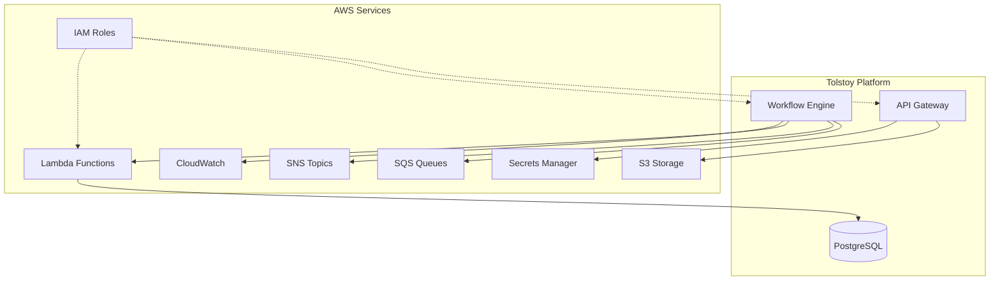

# AWS Services Integration Guide

## Overview

The Tolstoy platform leverages multiple AWS services for scalable, reliable operations. This guide provides implementation details for integrating with core AWS services including storage, messaging, compute, and monitoring.

## Architecture Overview



## AWS SDK Configuration

### Node.js AWS SDK Setup

```typescript
// src/config/aws.ts
import { 
  S3Client, 
  SQSClient, 
  SNSClient, 
  LambdaClient,
  CloudWatchClient,
  SecretsManagerClient 
} from '@aws-sdk/client-s3';
import { fromNodeProviderChain } from '@aws-sdk/credential-providers';

export class AWSConfig {
  private static instance: AWSConfig;
  
  public readonly s3Client: S3Client;
  public readonly sqsClient: SQSClient;
  public readonly snsClient: SNSClient;
  public readonly lambdaClient: LambdaClient;
  public readonly cloudWatchClient: CloudWatchClient;
  public readonly secretsClient: SecretsManagerClient;
  
  private constructor() {
    const credentials = fromNodeProviderChain();
    const region = process.env.AWS_REGION || 'us-east-1';
    
    const clientConfig = {
      region,
      credentials,
      maxAttempts: 3,
      retryMode: 'adaptive' as const,
    };
    
    this.s3Client = new S3Client(clientConfig);
    this.sqsClient = new SQSClient(clientConfig);
    this.snsClient = new SNSClient(clientConfig);
    this.lambdaClient = new LambdaClient(clientConfig);
    this.cloudWatchClient = new CloudWatchClient(clientConfig);
    this.secretsClient = new SecretsManagerClient(clientConfig);
  }
  
  public static getInstance(): AWSConfig {
    if (!AWSConfig.instance) {
      AWSConfig.instance = new AWSConfig();
    }
    return AWSConfig.instance;
  }
}
```

## S3 Storage Integration

### File Upload Service

```typescript
// src/services/storage/s3-service.ts
import { 
  PutObjectCommand, 
  GetObjectCommand, 
  DeleteObjectCommand,
  HeadObjectCommand,
  CopyObjectCommand
} from '@aws-sdk/client-s3';
import { getSignedUrl } from '@aws-sdk/s3-request-presigner';
import { AWSConfig } from '../../config/aws';
import { createHash } from 'crypto';

export interface UploadOptions {
  bucket: string;
  key: string;
  body: Buffer | Uint8Array | string;
  contentType?: string;
  metadata?: Record<string, string>;
  serverSideEncryption?: 'AES256' | 'aws:kms';
  kmsKeyId?: string;
}

export interface PresignedUrlOptions {
  bucket: string;
  key: string;
  operation: 'getObject' | 'putObject';
  expiresIn?: number;
  contentType?: string;
}

export class S3Service {
  private readonly s3Client: S3Client;
  private readonly defaultBucket: string;
  
  constructor() {
    const aws = AWSConfig.getInstance();
    this.s3Client = aws.s3Client;
    this.defaultBucket = process.env.AWS_S3_DEFAULT_BUCKET || '';
  }
  
  async uploadFile(options: UploadOptions): Promise<string> {
    const { bucket, key, body, contentType, metadata, serverSideEncryption, kmsKeyId } = options;
    
    // Generate ETag for integrity verification
    const contentHash = createHash('md5').update(body as Buffer).digest('hex');
    
    const command = new PutObjectCommand({
      Bucket: bucket,
      Key: key,
      Body: body,
      ContentType: contentType,
      Metadata: {
        ...metadata,
        uploadedAt: new Date().toISOString(),
        contentHash,
      },
      ServerSideEncryption: serverSideEncryption,
      SSEKMSKeyId: kmsKeyId,
      ChecksumAlgorithm: 'SHA256',
    });
    
    try {
      const result = await this.s3Client.send(command);
      return `s3://${bucket}/${key}`;
    } catch (error) {
      throw new Error(`S3 upload failed: ${error.message}`);
    }
  }
  
  async downloadFile(bucket: string, key: string): Promise<Buffer> {
    const command = new GetObjectCommand({
      Bucket: bucket,
      Key: key,
    });
    
    try {
      const response = await this.s3Client.send(command);
      const chunks: Uint8Array[] = [];
      
      if (response.Body) {
        const reader = response.Body.getReader();
        let done = false;
        
        while (!done) {
          const { value, done: readerDone } = await reader.read();
          done = readerDone;
          if (value) {
            chunks.push(value);
          }
        }
      }
      
      return Buffer.concat(chunks);
    } catch (error) {
      throw new Error(`S3 download failed: ${error.message}`);
    }
  }
  
  async generatePresignedUrl(options: PresignedUrlOptions): Promise<string> {
    const { bucket, key, operation, expiresIn = 3600, contentType } = options;
    
    let command;
    if (operation === 'getObject') {
      command = new GetObjectCommand({ Bucket: bucket, Key: key });
    } else {
      command = new PutObjectCommand({ 
        Bucket: bucket, 
        Key: key,
        ContentType: contentType,
      });
    }
    
    try {
      return await getSignedUrl(this.s3Client, command, { expiresIn });
    } catch (error) {
      throw new Error(`Failed to generate presigned URL: ${error.message}`);
    }
  }
  
  async fileExists(bucket: string, key: string): Promise<boolean> {
    const command = new HeadObjectCommand({
      Bucket: bucket,
      Key: key,
    });
    
    try {
      await this.s3Client.send(command);
      return true;
    } catch (error) {
      if (error.name === 'NotFound') {
        return false;
      }
      throw error;
    }
  }
  
  async copyFile(sourceBucket: string, sourceKey: string, destBucket: string, destKey: string): Promise<void> {
    const command = new CopyObjectCommand({
      Bucket: destBucket,
      Key: destKey,
      CopySource: `${sourceBucket}/${sourceKey}`,
      MetadataDirective: 'COPY',
    });
    
    try {
      await this.s3Client.send(command);
    } catch (error) {
      throw new Error(`S3 copy failed: ${error.message}`);
    }
  }
  
  async deleteFile(bucket: string, key: string): Promise<void> {
    const command = new DeleteObjectCommand({
      Bucket: bucket,
      Key: key,
    });
    
    try {
      await this.s3Client.send(command);
    } catch (error) {
      throw new Error(`S3 delete failed: ${error.message}`);
    }
  }
}
```

## SQS Queue Integration

### Message Queue Service

```typescript
// src/services/messaging/sqs-service.ts
import { 
  SendMessageCommand, 
  ReceiveMessageCommand, 
  DeleteMessageCommand,
  GetQueueAttributesCommand,
  SendMessageBatchCommand,
  DeleteMessageBatchCommand
} from '@aws-sdk/client-sqs';
import { AWSConfig } from '../../config/aws';

export interface QueueMessage {
  id: string;
  body: string;
  attributes?: Record<string, string>;
  receiptHandle?: string;
  approximateReceiveCount?: number;
}

export interface SendMessageOptions {
  queueUrl: string;
  messageBody: string;
  delaySeconds?: number;
  messageAttributes?: Record<string, { StringValue: string; DataType: string }>;
  messageGroupId?: string; // For FIFO queues
  messageDeduplicationId?: string; // For FIFO queues
}

export class SQSService {
  private readonly sqsClient: SQSClient;
  
  constructor() {
    const aws = AWSConfig.getInstance();
    this.sqsClient = aws.sqsClient;
  }
  
  async sendMessage(options: SendMessageOptions): Promise<string> {
    const command = new SendMessageCommand({
      QueueUrl: options.queueUrl,
      MessageBody: options.messageBody,
      DelaySeconds: options.delaySeconds,
      MessageAttributes: options.messageAttributes,
      MessageGroupId: options.messageGroupId,
      MessageDeduplicationId: options.messageDeduplicationId,
    });
    
    try {
      const result = await this.sqsClient.send(command);
      return result.MessageId!;
    } catch (error) {
      throw new Error(`SQS send message failed: ${error.message}`);
    }
  }
  
  async sendMessageBatch(queueUrl: string, messages: Array<{
    id: string;
    messageBody: string;
    delaySeconds?: number;
    messageGroupId?: string;
  }>): Promise<void> {
    const entries = messages.map(msg => ({
      Id: msg.id,
      MessageBody: msg.messageBody,
      DelaySeconds: msg.delaySeconds,
      MessageGroupId: msg.messageGroupId,
    }));
    
    const command = new SendMessageBatchCommand({
      QueueUrl: queueUrl,
      Entries: entries,
    });
    
    try {
      const result = await this.sqsClient.send(command);
      if (result.Failed && result.Failed.length > 0) {
        throw new Error(`Batch send failed for messages: ${result.Failed.map(f => f.Id).join(', ')}`);
      }
    } catch (error) {
      throw new Error(`SQS batch send failed: ${error.message}`);
    }
  }
  
  async receiveMessages(queueUrl: string, maxMessages: number = 1, waitTimeSeconds: number = 0): Promise<QueueMessage[]> {
    const command = new ReceiveMessageCommand({
      QueueUrl: queueUrl,
      MaxNumberOfMessages: maxMessages,
      WaitTimeSeconds: waitTimeSeconds,
      AttributeNames: ['All'],
      MessageAttributeNames: ['All'],
    });
    
    try {
      const result = await this.sqsClient.send(command);
      return (result.Messages || []).map(msg => ({
        id: msg.MessageId!,
        body: msg.Body!,
        receiptHandle: msg.ReceiptHandle,
        approximateReceiveCount: parseInt(msg.Attributes?.ApproximateReceiveCount || '0'),
        attributes: msg.Attributes,
      }));
    } catch (error) {
      throw new Error(`SQS receive messages failed: ${error.message}`);
    }
  }
  
  async deleteMessage(queueUrl: string, receiptHandle: string): Promise<void> {
    const command = new DeleteMessageCommand({
      QueueUrl: queueUrl,
      ReceiptHandle: receiptHandle,
    });
    
    try {
      await this.sqsClient.send(command);
    } catch (error) {
      throw new Error(`SQS delete message failed: ${error.message}`);
    }
  }
  
  async deleteMessageBatch(queueUrl: string, messages: Array<{ id: string; receiptHandle: string }>): Promise<void> {
    const entries = messages.map(msg => ({
      Id: msg.id,
      ReceiptHandle: msg.receiptHandle,
    }));
    
    const command = new DeleteMessageBatchCommand({
      QueueUrl: queueUrl,
      Entries: entries,
    });
    
    try {
      const result = await this.sqsClient.send(command);
      if (result.Failed && result.Failed.length > 0) {
        throw new Error(`Batch delete failed for messages: ${result.Failed.map(f => f.Id).join(', ')}`);
      }
    } catch (error) {
      throw new Error(`SQS batch delete failed: ${error.message}`);
    }
  }
  
  async getQueueAttributes(queueUrl: string): Promise<Record<string, string>> {
    const command = new GetQueueAttributesCommand({
      QueueUrl: queueUrl,
      AttributeNames: ['All'],
    });
    
    try {
      const result = await this.sqsClient.send(command);
      return result.Attributes || {};
    } catch (error) {
      throw new Error(`SQS get queue attributes failed: ${error.message}`);
    }
  }
}
```

## SNS Notification Integration

### Notification Service

```typescript
// src/services/messaging/sns-service.ts
import { 
  PublishCommand, 
  PublishBatchCommand, 
  SubscribeCommand,
  UnsubscribeCommand,
  CreateTopicCommand,
  ListTopicsCommand
} from '@aws-sdk/client-sns';
import { AWSConfig } from '../../config/aws';

export interface NotificationMessage {
  topicArn: string;
  message: string;
  subject?: string;
  messageAttributes?: Record<string, { StringValue: string; DataType: string }>;
  targetArn?: string; // For direct publishing to endpoints
}

export interface SubscriptionOptions {
  topicArn: string;
  protocol: 'email' | 'sms' | 'sqs' | 'http' | 'https' | 'lambda';
  endpoint: string;
  attributes?: Record<string, string>;
}

export class SNSService {
  private readonly snsClient: SNSClient;
  
  constructor() {
    const aws = AWSConfig.getInstance();
    this.snsClient = aws.snsClient;
  }
  
  async publishMessage(notification: NotificationMessage): Promise<string> {
    const command = new PublishCommand({
      TopicArn: notification.topicArn,
      Message: notification.message,
      Subject: notification.subject,
      MessageAttributes: notification.messageAttributes,
      TargetArn: notification.targetArn,
    });
    
    try {
      const result = await this.snsClient.send(command);
      return result.MessageId!;
    } catch (error) {
      throw new Error(`SNS publish failed: ${error.message}`);
    }
  }
  
  async publishBatch(topicArn: string, messages: Array<{
    id: string;
    message: string;
    subject?: string;
  }>): Promise<void> {
    const entries = messages.map(msg => ({
      Id: msg.id,
      Message: msg.message,
      Subject: msg.subject,
    }));
    
    const command = new PublishBatchCommand({
      TopicArn: topicArn,
      PublishRequestEntries: entries,
    });
    
    try {
      const result = await this.snsClient.send(command);
      if (result.Failed && result.Failed.length > 0) {
        throw new Error(`Batch publish failed for messages: ${result.Failed.map(f => f.Id).join(', ')}`);
      }
    } catch (error) {
      throw new Error(`SNS batch publish failed: ${error.message}`);
    }
  }
  
  async createTopic(name: string, attributes?: Record<string, string>): Promise<string> {
    const command = new CreateTopicCommand({
      Name: name,
      Attributes: attributes,
    });
    
    try {
      const result = await this.snsClient.send(command);
      return result.TopicArn!;
    } catch (error) {
      throw new Error(`SNS create topic failed: ${error.message}`);
    }
  }
  
  async subscribe(options: SubscriptionOptions): Promise<string> {
    const command = new SubscribeCommand({
      TopicArn: options.topicArn,
      Protocol: options.protocol,
      Endpoint: options.endpoint,
      Attributes: options.attributes,
    });
    
    try {
      const result = await this.snsClient.send(command);
      return result.SubscriptionArn!;
    } catch (error) {
      throw new Error(`SNS subscribe failed: ${error.message}`);
    }
  }
  
  async unsubscribe(subscriptionArn: string): Promise<void> {
    const command = new UnsubscribeCommand({
      SubscriptionArn: subscriptionArn,
    });
    
    try {
      await this.snsClient.send(command);
    } catch (error) {
      throw new Error(`SNS unsubscribe failed: ${error.message}`);
    }
  }
  
  async listTopics(): Promise<Array<{ topicArn: string }>> {
    const command = new ListTopicsCommand({});
    
    try {
      const result = await this.snsClient.send(command);
      return (result.Topics || []).map(topic => ({ topicArn: topic.TopicArn! }));
    } catch (error) {
      throw new Error(`SNS list topics failed: ${error.message}`);
    }
  }
}
```

## Lambda Function Integration

### Lambda Invocation Service

```typescript
// src/services/compute/lambda-service.ts
import { 
  InvokeCommand, 
  ListFunctionsCommand,
  GetFunctionCommand,
  InvocationType
} from '@aws-sdk/client-lambda';
import { AWSConfig } from '../../config/aws';

export interface LambdaInvocationOptions {
  functionName: string;
  payload?: object;
  invocationType?: 'RequestResponse' | 'Event' | 'DryRun';
  clientContext?: string;
}

export interface LambdaResponse {
  statusCode: number;
  payload?: any;
  executedVersion?: string;
  logResult?: string;
}

export class LambdaService {
  private readonly lambdaClient: LambdaClient;
  
  constructor() {
    const aws = AWSConfig.getInstance();
    this.lambdaClient = aws.lambdaClient;
  }
  
  async invokeFunction(options: LambdaInvocationOptions): Promise<LambdaResponse> {
    const { functionName, payload, invocationType = 'RequestResponse', clientContext } = options;
    
    const command = new InvokeCommand({
      FunctionName: functionName,
      InvocationType: invocationType as InvocationType,
      Payload: payload ? JSON.stringify(payload) : undefined,
      ClientContext: clientContext,
      LogType: 'Tail', // Include execution logs
    });
    
    try {
      const result = await this.lambdaClient.send(command);
      
      let responsePayload;
      if (result.Payload) {
        const payloadString = Buffer.from(result.Payload).toString();
        try {
          responsePayload = JSON.parse(payloadString);
        } catch {
          responsePayload = payloadString;
        }
      }
      
      return {
        statusCode: result.StatusCode || 200,
        payload: responsePayload,
        executedVersion: result.ExecutedVersion,
        logResult: result.LogResult ? Buffer.from(result.LogResult, 'base64').toString() : undefined,
      };
    } catch (error) {
      throw new Error(`Lambda invocation failed: ${error.message}`);
    }
  }
  
  async invokeFunctionAsync(functionName: string, payload?: object): Promise<void> {
    await this.invokeFunction({
      functionName,
      payload,
      invocationType: 'Event',
    });
  }
  
  async getFunctionInfo(functionName: string): Promise<any> {
    const command = new GetFunctionCommand({
      FunctionName: functionName,
    });
    
    try {
      const result = await this.lambdaClient.send(command);
      return {
        functionName: result.Configuration?.FunctionName,
        runtime: result.Configuration?.Runtime,
        handler: result.Configuration?.Handler,
        codeSize: result.Configuration?.CodeSize,
        timeout: result.Configuration?.Timeout,
        memorySize: result.Configuration?.MemorySize,
        lastModified: result.Configuration?.LastModified,
        version: result.Configuration?.Version,
      };
    } catch (error) {
      throw new Error(`Get Lambda function info failed: ${error.message}`);
    }
  }
  
  async listFunctions(): Promise<Array<{ functionName: string; runtime: string }>> {
    const command = new ListFunctionsCommand({});
    
    try {
      const result = await this.lambdaClient.send(command);
      return (result.Functions || []).map(func => ({
        functionName: func.FunctionName!,
        runtime: func.Runtime!,
      }));
    } catch (error) {
      throw new Error(`List Lambda functions failed: ${error.message}`);
    }
  }
}
```

## CloudWatch Metrics Integration

### Monitoring Service

```typescript
// src/services/monitoring/cloudwatch-service.ts
import { 
  PutMetricDataCommand, 
  GetMetricStatisticsCommand,
  ListMetricsCommand,
  Dimension,
  MetricDatum
} from '@aws-sdk/client-cloudwatch';
import { AWSConfig } from '../../config/aws';

export interface CustomMetric {
  metricName: string;
  namespace: string;
  value: number;
  unit?: string;
  dimensions?: Array<{ name: string; value: string }>;
  timestamp?: Date;
}

export interface MetricQuery {
  namespace: string;
  metricName: string;
  startTime: Date;
  endTime: Date;
  period: number;
  statistics: string[];
  dimensions?: Array<{ name: string; value: string }>;
}

export class CloudWatchService {
  private readonly cloudWatchClient: CloudWatchClient;
  private readonly defaultNamespace: string;
  
  constructor() {
    const aws = AWSConfig.getInstance();
    this.cloudWatchClient = aws.cloudWatchClient;
    this.defaultNamespace = process.env.CLOUDWATCH_NAMESPACE || 'Tolstoy/Application';
  }
  
  async putMetric(metric: CustomMetric): Promise<void> {
    const dimensions: Dimension[] = (metric.dimensions || []).map(dim => ({
      Name: dim.name,
      Value: dim.value,
    }));
    
    const metricData: MetricDatum = {
      MetricName: metric.metricName,
      Value: metric.value,
      Unit: metric.unit || 'Count',
      Dimensions: dimensions,
      Timestamp: metric.timestamp || new Date(),
    };
    
    const command = new PutMetricDataCommand({
      Namespace: metric.namespace,
      MetricData: [metricData],
    });
    
    try {
      await this.cloudWatchClient.send(command);
    } catch (error) {
      throw new Error(`CloudWatch put metric failed: ${error.message}`);
    }
  }
  
  async putMetrics(metrics: CustomMetric[]): Promise<void> {
    // CloudWatch accepts up to 20 metrics per request
    const chunks = this.chunkArray(metrics, 20);
    
    for (const chunk of chunks) {
      const metricData: MetricDatum[] = chunk.map(metric => ({
        MetricName: metric.metricName,
        Value: metric.value,
        Unit: metric.unit || 'Count',
        Dimensions: (metric.dimensions || []).map(dim => ({
          Name: dim.name,
          Value: dim.value,
        })),
        Timestamp: metric.timestamp || new Date(),
      }));
      
      const command = new PutMetricDataCommand({
        Namespace: chunk[0].namespace,
        MetricData: metricData,
      });
      
      try {
        await this.cloudWatchClient.send(command);
      } catch (error) {
        throw new Error(`CloudWatch put metrics batch failed: ${error.message}`);
      }
    }
  }
  
  async getMetricStatistics(query: MetricQuery): Promise<any> {
    const dimensions: Dimension[] = (query.dimensions || []).map(dim => ({
      Name: dim.name,
      Value: dim.value,
    }));
    
    const command = new GetMetricStatisticsCommand({
      Namespace: query.namespace,
      MetricName: query.metricName,
      StartTime: query.startTime,
      EndTime: query.endTime,
      Period: query.period,
      Statistics: query.statistics,
      Dimensions: dimensions,
    });
    
    try {
      const result = await this.cloudWatchClient.send(command);
      return {
        label: result.Label,
        datapoints: result.Datapoints || [],
      };
    } catch (error) {
      throw new Error(`CloudWatch get metric statistics failed: ${error.message}`);
    }
  }
  
  async listMetrics(namespace?: string): Promise<Array<{ metricName: string; namespace: string }>> {
    const command = new ListMetricsCommand({
      Namespace: namespace,
    });
    
    try {
      const result = await this.cloudWatchClient.send(command);
      return (result.Metrics || []).map(metric => ({
        metricName: metric.MetricName!,
        namespace: metric.Namespace!,
      }));
    } catch (error) {
      throw new Error(`CloudWatch list metrics failed: ${error.message}`);
    }
  }
  
  // Utility methods for common metrics
  async recordWorkflowExecution(workflowId: string, status: 'success' | 'failure', duration: number): Promise<void> {
    const metrics: CustomMetric[] = [
      {
        metricName: 'WorkflowExecutions',
        namespace: this.defaultNamespace,
        value: 1,
        unit: 'Count',
        dimensions: [
          { name: 'WorkflowId', value: workflowId },
          { name: 'Status', value: status },
        ],
      },
      {
        metricName: 'WorkflowDuration',
        namespace: this.defaultNamespace,
        value: duration,
        unit: 'Milliseconds',
        dimensions: [
          { name: 'WorkflowId', value: workflowId },
        ],
      },
    ];
    
    await this.putMetrics(metrics);
  }
  
  async recordAPIRequest(endpoint: string, method: string, statusCode: number, responseTime: number): Promise<void> {
    const metrics: CustomMetric[] = [
      {
        metricName: 'APIRequests',
        namespace: this.defaultNamespace,
        value: 1,
        unit: 'Count',
        dimensions: [
          { name: 'Endpoint', value: endpoint },
          { name: 'Method', value: method },
          { name: 'StatusCode', value: statusCode.toString() },
        ],
      },
      {
        metricName: 'APIResponseTime',
        namespace: this.defaultNamespace,
        value: responseTime,
        unit: 'Milliseconds',
        dimensions: [
          { name: 'Endpoint', value: endpoint },
          { name: 'Method', value: method },
        ],
      },
    ];
    
    await this.putMetrics(metrics);
  }
  
  private chunkArray<T>(array: T[], size: number): T[][] {
    const chunks: T[][] = [];
    for (let i = 0; i < array.length; i += size) {
      chunks.push(array.slice(i, i + size));
    }
    return chunks;
  }
}
```

## Secrets Manager Integration

### Secrets Management Service

```typescript
// src/services/security/secrets-service.ts
import { 
  GetSecretValueCommand, 
  CreateSecretCommand,
  UpdateSecretCommand,
  DeleteSecretCommand,
  ListSecretsCommand,
  PutSecretValueCommand
} from '@aws-sdk/client-secrets-manager';
import { AWSConfig } from '../../config/aws';

export interface SecretOptions {
  name: string;
  description?: string;
  secretValue: string | Record<string, any>;
  kmsKeyId?: string;
  replicationRegions?: string[];
}

export interface SecretValue {
  name: string;
  value: string | Record<string, any>;
  versionId?: string;
  createdDate?: Date;
}

export class SecretsService {
  private readonly secretsClient: SecretsManagerClient;
  private readonly cache: Map<string, { value: any; expiry: number }> = new Map();
  private readonly cacheTtl: number = 300000; // 5 minutes
  
  constructor() {
    const aws = AWSConfig.getInstance();
    this.secretsClient = aws.secretsClient;
  }
  
  async getSecret(secretName: string, useCache: boolean = true): Promise<SecretValue> {
    // Check cache first
    if (useCache) {
      const cached = this.cache.get(secretName);
      if (cached && cached.expiry > Date.now()) {
        return cached.value;
      }
    }
    
    const command = new GetSecretValueCommand({
      SecretId: secretName,
    });
    
    try {
      const result = await this.secretsClient.send(command);
      
      let secretValue: string | Record<string, any>;
      if (result.SecretString) {
        try {
          secretValue = JSON.parse(result.SecretString);
        } catch {
          secretValue = result.SecretString;
        }
      } else if (result.SecretBinary) {
        secretValue = Buffer.from(result.SecretBinary).toString();
      } else {
        throw new Error('Secret value not found');
      }
      
      const secret: SecretValue = {
        name: result.Name!,
        value: secretValue,
        versionId: result.VersionId,
        createdDate: result.CreatedDate,
      };
      
      // Cache the result
      if (useCache) {
        this.cache.set(secretName, {
          value: secret,
          expiry: Date.now() + this.cacheTtl,
        });
      }
      
      return secret;
    } catch (error) {
      throw new Error(`Get secret failed: ${error.message}`);
    }
  }
  
  async createSecret(options: SecretOptions): Promise<string> {
    const secretString = typeof options.secretValue === 'string' 
      ? options.secretValue 
      : JSON.stringify(options.secretValue);
    
    const command = new CreateSecretCommand({
      Name: options.name,
      Description: options.description,
      SecretString: secretString,
      KmsKeyId: options.kmsKeyId,
      ReplicaRegions: options.replicationRegions?.map(region => ({ Region: region })),
    });
    
    try {
      const result = await this.secretsClient.send(command);
      return result.ARN!;
    } catch (error) {
      throw new Error(`Create secret failed: ${error.message}`);
    }
  }
  
  async updateSecret(secretName: string, secretValue: string | Record<string, any>): Promise<void> {
    const secretString = typeof secretValue === 'string' 
      ? secretValue 
      : JSON.stringify(secretValue);
    
    const command = new UpdateSecretCommand({
      SecretId: secretName,
      SecretString: secretString,
    });
    
    try {
      await this.secretsClient.send(command);
      
      // Invalidate cache
      this.cache.delete(secretName);
    } catch (error) {
      throw new Error(`Update secret failed: ${error.message}`);
    }
  }
  
  async deleteSecret(secretName: string, forceDelete: boolean = false): Promise<void> {
    const command = new DeleteSecretCommand({
      SecretId: secretName,
      ForceDeleteWithoutRecovery: forceDelete,
      RecoveryWindowInDays: forceDelete ? undefined : 7,
    });
    
    try {
      await this.secretsClient.send(command);
      
      // Remove from cache
      this.cache.delete(secretName);
    } catch (error) {
      throw new Error(`Delete secret failed: ${error.message}`);
    }
  }
  
  async listSecrets(): Promise<Array<{ name: string; description?: string; lastChangedDate?: Date }>> {
    const command = new ListSecretsCommand({});
    
    try {
      const result = await this.secretsClient.send(command);
      return (result.SecretList || []).map(secret => ({
        name: secret.Name!,
        description: secret.Description,
        lastChangedDate: secret.LastChangedDate,
      }));
    } catch (error) {
      throw new Error(`List secrets failed: ${error.message}`);
    }
  }
  
  // Utility methods for common secret patterns
  async getDatabaseCredentials(environment: string): Promise<{ username: string; password: string; host: string; port: number }> {
    const secret = await this.getSecret(`tolstoy/${environment}/database`);
    
    if (typeof secret.value === 'object') {
      return secret.value as any;
    }
    
    throw new Error('Database credentials not in expected format');
  }
  
  async getAPIKeys(service: string): Promise<{ apiKey: string; secretKey?: string }> {
    const secret = await this.getSecret(`tolstoy/api-keys/${service}`);
    
    if (typeof secret.value === 'object') {
      return secret.value as any;
    }
    
    throw new Error('API keys not in expected format');
  }
  
  clearCache(): void {
    this.cache.clear();
  }
}
```

## Integration Usage Examples

### Workflow Integration Example

```typescript
// src/services/workflow/aws-workflow-integration.ts
import { S3Service } from '../storage/s3-service';
import { SQSService } from '../messaging/sqs-service';
import { SNSService } from '../messaging/sns-service';
import { LambdaService } from '../compute/lambda-service';
import { CloudWatchService } from '../monitoring/cloudwatch-service';
import { SecretsService } from '../security/secrets-service';

export class AWSWorkflowIntegration {
  private readonly s3Service: S3Service;
  private readonly sqsService: SQSService;
  private readonly snsService: SNSService;
  private readonly lambdaService: LambdaService;
  private readonly cloudWatchService: CloudWatchService;
  private readonly secretsService: SecretsService;
  
  constructor() {
    this.s3Service = new S3Service();
    this.sqsService = new SQSService();
    this.snsService = new SNSService();
    this.lambdaService = new LambdaService();
    this.cloudWatchService = new CloudWatchService();
    this.secretsService = new SecretsService();
  }
  
  async processWorkflowWithAWS(workflowId: string, workflowData: any): Promise<void> {
    const startTime = Date.now();
    
    try {
      // 1. Store workflow data in S3
      const s3Key = `workflows/${workflowId}/data.json`;
      await this.s3Service.uploadFile({
        bucket: process.env.AWS_S3_WORKFLOW_BUCKET!,
        key: s3Key,
        body: JSON.stringify(workflowData),
        contentType: 'application/json',
      });
      
      // 2. Queue workflow for processing
      await this.sqsService.sendMessage({
        queueUrl: process.env.AWS_SQS_WORKFLOW_QUEUE!,
        messageBody: JSON.stringify({
          workflowId,
          s3Location: `s3://${process.env.AWS_S3_WORKFLOW_BUCKET}/${s3Key}`,
          timestamp: new Date().toISOString(),
        }),
      });
      
      // 3. Invoke processing Lambda function
      const lambdaResponse = await this.lambdaService.invokeFunction({
        functionName: process.env.AWS_LAMBDA_WORKFLOW_PROCESSOR!,
        payload: {
          workflowId,
          action: 'process',
        },
      });
      
      // 4. Send notification on completion
      await this.snsService.publishMessage({
        topicArn: process.env.AWS_SNS_WORKFLOW_TOPIC!,
        message: JSON.stringify({
          workflowId,
          status: 'completed',
          processingTime: Date.now() - startTime,
        }),
        subject: 'Workflow Processing Complete',
      });
      
      // 5. Record metrics
      await this.cloudWatchService.recordWorkflowExecution(
        workflowId,
        'success',
        Date.now() - startTime
      );
      
    } catch (error) {
      // Record failure metrics
      await this.cloudWatchService.recordWorkflowExecution(
        workflowId,
        'failure',
        Date.now() - startTime
      );
      
      throw error;
    }
  }
}
```

## Environment Configuration

```bash
# AWS Configuration
AWS_REGION=us-east-1
AWS_ACCESS_KEY_ID=your-access-key
AWS_SECRET_ACCESS_KEY=your-secret-key

# S3 Configuration
AWS_S3_DEFAULT_BUCKET=tolstoy-workflows
AWS_S3_WORKFLOW_BUCKET=tolstoy-workflow-data

# SQS Configuration
AWS_SQS_WORKFLOW_QUEUE=https://sqs.us-east-1.amazonaws.com/123456789/tolstoy-workflows
AWS_SQS_DLQ_QUEUE=https://sqs.us-east-1.amazonaws.com/123456789/tolstoy-workflows-dlq

# SNS Configuration
AWS_SNS_WORKFLOW_TOPIC=arn:aws:sns:us-east-1:123456789:tolstoy-workflow-notifications

# Lambda Configuration
AWS_LAMBDA_WORKFLOW_PROCESSOR=tolstoy-workflow-processor

# CloudWatch Configuration
CLOUDWATCH_NAMESPACE=Tolstoy/Application

# Secrets Manager Configuration
AWS_SECRETS_PREFIX=tolstoy/
```

## IAM Policies

### Application Service Role Policy

```json
{
  "Version": "2012-10-17",
  "Statement": [
    {
      "Sid": "S3Access",
      "Effect": "Allow",
      "Action": [
        "s3:GetObject",
        "s3:PutObject",
        "s3:DeleteObject",
        "s3:ListBucket"
      ],
      "Resource": [
        "arn:aws:s3:::tolstoy-*/*",
        "arn:aws:s3:::tolstoy-*"
      ]
    },
    {
      "Sid": "SQSAccess",
      "Effect": "Allow",
      "Action": [
        "sqs:SendMessage",
        "sqs:ReceiveMessage",
        "sqs:DeleteMessage",
        "sqs:GetQueueAttributes"
      ],
      "Resource": "arn:aws:sqs:*:*:tolstoy-*"
    },
    {
      "Sid": "SNSAccess",
      "Effect": "Allow",
      "Action": [
        "sns:Publish",
        "sns:Subscribe",
        "sns:Unsubscribe"
      ],
      "Resource": "arn:aws:sns:*:*:tolstoy-*"
    },
    {
      "Sid": "LambdaAccess",
      "Effect": "Allow",
      "Action": [
        "lambda:InvokeFunction"
      ],
      "Resource": "arn:aws:lambda:*:*:function:tolstoy-*"
    },
    {
      "Sid": "CloudWatchAccess",
      "Effect": "Allow",
      "Action": [
        "cloudwatch:PutMetricData",
        "cloudwatch:GetMetricStatistics",
        "cloudwatch:ListMetrics"
      ],
      "Resource": "*"
    },
    {
      "Sid": "SecretsManagerAccess",
      "Effect": "Allow",
      "Action": [
        "secretsmanager:GetSecretValue"
      ],
      "Resource": "arn:aws:secretsmanager:*:*:secret:tolstoy/*"
    }
  ]
}
```

---

<Note>
This AWS integration guide provides comprehensive implementation details for all major AWS services used by the Tolstoy platform. Each service includes proper error handling, retry logic, and production-ready patterns for scalable operations.
</Note>