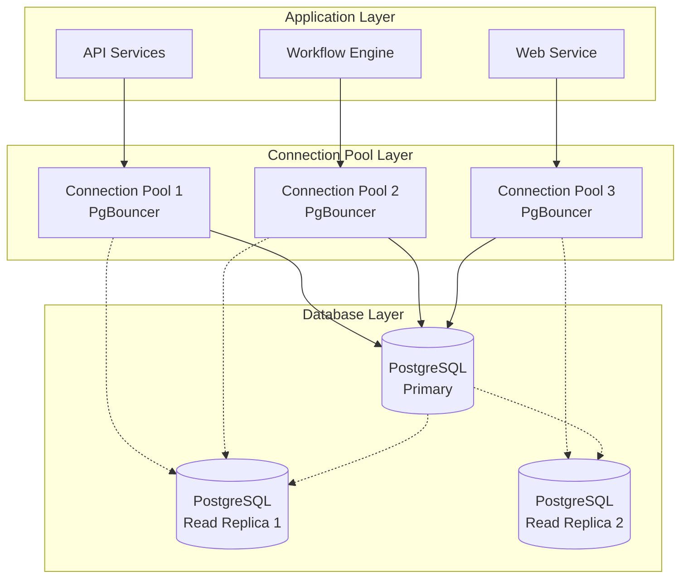

# Database Connection Configuration Guide

## Overview

The Tolstoy platform uses PostgreSQL as its primary database with advanced features for connection pooling, failover, and performance optimization. This guide covers all aspects of database connectivity and integration patterns.

## Database Architecture



## Database Configuration

### Primary Database Configuration

```typescript
// src/config/database.ts
import { Pool, PoolConfig } from 'pg';
import { SecretsService } from '../services/security/secrets-service';

export interface DatabaseConfig {
  host: string;
  port: number;
  database: string;
  username: string;
  password: string;
  ssl?: boolean;
  poolConfig?: PoolConfig;
  replicationMode?: 'primary' | 'replica';
}

export class DatabaseManager {
  private static instance: DatabaseManager;
  private primaryPool: Pool;
  private replicaPools: Pool[] = [];
  private secretsService: SecretsService;
  
  private constructor() {
    this.secretsService = new SecretsService();
  }
  
  public static getInstance(): DatabaseManager {
    if (!DatabaseManager.instance) {
      DatabaseManager.instance = new DatabaseManager();
    }
    return DatabaseManager.instance;
  }
  
  async initialize(): Promise<void> {
    // Load database credentials from AWS Secrets Manager
    const credentials = await this.secretsService.getDatabaseCredentials(
      process.env.NODE_ENV || 'development'
    );
    
    // Initialize primary connection pool
    this.primaryPool = this.createConnectionPool({
      ...credentials,
      replicationMode: 'primary',
    });
    
    // Initialize read replica pools
    const replicaHosts = process.env.DB_REPLICA_HOSTS?.split(',') || [];
    for (const host of replicaHosts) {
      const replicaPool = this.createConnectionPool({
        ...credentials,
        host: host.trim(),
        replicationMode: 'replica',
      });
      this.replicaPools.push(replicaPool);
    }
    
    // Test connections
    await this.testConnections();
  }
  
  private createConnectionPool(config: DatabaseConfig): Pool {
    const poolConfig: PoolConfig = {
      host: config.host,
      port: config.port,
      database: config.database,
      user: config.username,
      password: config.password,
      
      // Connection pool settings
      min: 2, // Minimum connections
      max: 20, // Maximum connections
      idleTimeoutMillis: 30000, // Close idle connections after 30s
      connectionTimeoutMillis: 2000, // Fail fast if can't connect
      
      // SSL configuration
      ssl: config.ssl ? {
        rejectUnauthorized: false, // For development
      } : false,
      
      // Connection validation
      keepAlive: true,
      keepAliveInitialDelayMillis: 10000,
      
      // Query timeout
      query_timeout: 30000,
      statement_timeout: 30000,
      
      // Application name for monitoring
      application_name: `tolstoy-${config.replicationMode}-${process.env.NODE_ENV}`,
    };
    
    const pool = new Pool(poolConfig);
    
    // Event handlers
    pool.on('connect', (client) => {
      console.log(`Database connected: ${config.host}:${config.port}/${config.database}`);
      
      // Set session configuration
      client.query(`
        SET statement_timeout = '30s';
        SET lock_timeout = '10s';
        SET idle_in_transaction_session_timeout = '60s';
      `);
    });
    
    pool.on('error', (err, client) => {
      console.error(`Database error on ${config.host}:`, err);
    });
    
    pool.on('remove', (client) => {
      console.log(`Database client removed from pool: ${config.host}`);
    });
    
    return pool;
  }
  
  private async testConnections(): Promise<void> {
    // Test primary connection
    try {
      const client = await this.primaryPool.connect();
      await client.query('SELECT NOW()');
      client.release();
      console.log('Primary database connection successful');
    } catch (error) {
      console.error('Primary database connection failed:', error);
      throw error;
    }
    
    // Test replica connections
    for (let i = 0; i < this.replicaPools.length; i++) {
      try {
        const client = await this.replicaPools[i].connect();
        await client.query('SELECT NOW()');
        client.release();
        console.log(`Read replica ${i + 1} connection successful`);
      } catch (error) {
        console.error(`Read replica ${i + 1} connection failed:`, error);
        // Continue with other replicas
      }
    }
  }
  
  // Get primary pool for write operations
  getPrimaryPool(): Pool {
    return this.primaryPool;
  }
  
  // Get replica pool for read operations (with load balancing)
  getReplicaPool(): Pool {
    if (this.replicaPools.length === 0) {
      return this.primaryPool; // Fallback to primary
    }
    
    // Simple round-robin load balancing
    const index = Math.floor(Math.random() * this.replicaPools.length);
    return this.replicaPools[index];
  }
  
  // Execute write operations
  async executeWrite<T = any>(query: string, params?: any[]): Promise<T[]> {
    const client = await this.primaryPool.connect();
    try {
      const result = await client.query(query, params);
      return result.rows;
    } finally {
      client.release();
    }
  }
  
  // Execute read operations (with replica preference)
  async executeRead<T = any>(query: string, params?: any[]): Promise<T[]> {
    const pool = this.getReplicaPool();
    const client = await pool.connect();
    try {
      const result = await client.query(query, params);
      return result.rows;
    } catch (error) {
      // Fallback to primary if replica fails
      if (pool !== this.primaryPool) {
        console.warn('Replica query failed, falling back to primary:', error.message);
        return this.executeWrite(query, params);
      }
      throw error;
    } finally {
      client.release();
    }
  }
  
  // Execute transaction
  async executeTransaction<T>(
    operations: (client: any) => Promise<T>
  ): Promise<T> {
    const client = await this.primaryPool.connect();
    try {
      await client.query('BEGIN');
      const result = await operations(client);
      await client.query('COMMIT');
      return result;
    } catch (error) {
      await client.query('ROLLBACK');
      throw error;
    } finally {
      client.release();
    }
  }
  
  // Health check
  async healthCheck(): Promise<{ primary: boolean; replicas: boolean[] }> {
    const results = {
      primary: false,
      replicas: [] as boolean[],
    };
    
    // Check primary
    try {
      const client = await this.primaryPool.connect();
      await client.query('SELECT 1');
      client.release();
      results.primary = true;
    } catch (error) {
      console.error('Primary database health check failed:', error);
    }
    
    // Check replicas
    for (const replica of this.replicaPools) {
      try {
        const client = await replica.connect();
        await client.query('SELECT 1');
        client.release();
        results.replicas.push(true);
      } catch (error) {
        console.error('Replica database health check failed:', error);
        results.replicas.push(false);
      }
    }
    
    return results;
  }
  
  // Graceful shutdown
  async shutdown(): Promise<void> {
    console.log('Shutting down database connections...');
    
    await this.primaryPool.end();
    
    for (const replica of this.replicaPools) {
      await replica.end();
    }
    
    console.log('Database connections closed');
  }
}
```

### Connection Pool Configuration with PgBouncer

```ini
# /etc/pgbouncer/pgbouncer.ini
[databases]
tolstoy_production = host=prod-postgres.cluster-xyz.us-east-1.rds.amazonaws.com port=5432 dbname=tolstoy
tolstoy_staging = host=staging-postgres.cluster-xyz.us-east-1.rds.amazonaws.com port=5432 dbname=tolstoy

[pgbouncer]
# Pool settings
pool_mode = transaction
max_client_conn = 1000
default_pool_size = 25
reserve_pool_size = 5
reserve_pool_timeout = 3
max_db_connections = 100

# Connection settings
listen_addr = *
listen_port = 5432
unix_socket_dir = /var/run/postgresql

# Authentication
auth_type = md5
auth_file = /etc/pgbouncer/userlist.txt
auth_user = pgbouncer

# Logging
log_connections = 1
log_disconnections = 1
log_pooler_errors = 1

# Timeouts (in seconds)
server_reset_query = DISCARD ALL
server_check_delay = 10
server_check_query = SELECT 1
server_lifetime = 3600
server_idle_timeout = 600
query_timeout = 30

# Resource limits
max_packet_size = 2147483647
pkt_buf = 4096
sbuf_loopcnt = 5

# Admin settings
admin_users = pgbouncer, admin
stats_users = pgbouncer, admin, monitoring
```

## Repository Pattern Implementation

### Base Repository

```typescript
// src/repositories/base-repository.ts
import { DatabaseManager } from '../config/database';

export abstract class BaseRepository<T> {
  protected dbManager: DatabaseManager;
  protected tableName: string;
  
  constructor(tableName: string) {
    this.tableName = tableName;
    this.dbManager = DatabaseManager.getInstance();
  }
  
  async findById(id: string): Promise<T | null> {
    const query = `SELECT * FROM ${this.tableName} WHERE id = $1`;
    const result = await this.dbManager.executeRead(query, [id]);
    return result.length > 0 ? this.mapToEntity(result[0]) : null;
  }
  
  async findAll(limit: number = 100, offset: number = 0): Promise<T[]> {
    const query = `
      SELECT * FROM ${this.tableName} 
      ORDER BY created_at DESC 
      LIMIT $1 OFFSET $2
    `;
    const result = await this.dbManager.executeRead(query, [limit, offset]);
    return result.map(row => this.mapToEntity(row));
  }
  
  async create(entity: Partial<T>): Promise<T> {
    const fields = Object.keys(entity);
    const values = Object.values(entity);
    const placeholders = values.map((_, index) => `$${index + 1}`).join(', ');
    
    const query = `
      INSERT INTO ${this.tableName} (${fields.join(', ')})
      VALUES (${placeholders})
      RETURNING *
    `;
    
    const result = await this.dbManager.executeWrite(query, values);
    return this.mapToEntity(result[0]);
  }
  
  async update(id: string, updates: Partial<T>): Promise<T | null> {
    const fields = Object.keys(updates);
    const values = Object.values(updates);
    
    const setClause = fields
      .map((field, index) => `${field} = $${index + 2}`)
      .join(', ');
    
    const query = `
      UPDATE ${this.tableName}
      SET ${setClause}, updated_at = NOW()
      WHERE id = $1
      RETURNING *
    `;
    
    const result = await this.dbManager.executeWrite(query, [id, ...values]);
    return result.length > 0 ? this.mapToEntity(result[0]) : null;
  }
  
  async delete(id: string): Promise<boolean> {
    const query = `DELETE FROM ${this.tableName} WHERE id = $1`;
    const result = await this.dbManager.executeWrite(query, [id]);
    return result.length > 0;
  }
  
  async count(): Promise<number> {
    const query = `SELECT COUNT(*) as count FROM ${this.tableName}`;
    const result = await this.dbManager.executeRead(query);
    return parseInt(result[0].count);
  }
  
  // Abstract method to be implemented by concrete repositories
  abstract mapToEntity(row: any): T;
  
  // Utility methods
  protected async executeRawQuery<R = any>(query: string, params?: any[]): Promise<R[]> {
    return this.dbManager.executeRead(query, params);
  }
  
  protected async executeTransaction<R>(
    operations: (client: any) => Promise<R>
  ): Promise<R> {
    return this.dbManager.executeTransaction(operations);
  }
}
```

### Workflow Repository Implementation

```typescript
// src/repositories/workflow-repository.ts
import { BaseRepository } from './base-repository';

export interface Workflow {
  id: string;
  name: string;
  description: string;
  definition: object;
  organizationId: string;
  createdBy: string;
  isActive: boolean;
  version: number;
  createdAt: Date;
  updatedAt: Date;
}

export class WorkflowRepository extends BaseRepository<Workflow> {
  constructor() {
    super('workflows');
  }
  
  mapToEntity(row: any): Workflow {
    return {
      id: row.id,
      name: row.name,
      description: row.description,
      definition: row.definition,
      organizationId: row.organization_id,
      createdBy: row.created_by,
      isActive: row.is_active,
      version: row.version,
      createdAt: new Date(row.created_at),
      updatedAt: new Date(row.updated_at),
    };
  }
  
  async findByOrganization(organizationId: string): Promise<Workflow[]> {
    const query = `
      SELECT * FROM ${this.tableName}
      WHERE organization_id = $1 AND is_active = true
      ORDER BY created_at DESC
    `;
    const result = await this.executeRawQuery(query, [organizationId]);
    return result.map(row => this.mapToEntity(row));
  }
  
  async findByNameAndOrganization(name: string, organizationId: string): Promise<Workflow | null> {
    const query = `
      SELECT * FROM ${this.tableName}
      WHERE name = $1 AND organization_id = $2 AND is_active = true
      LIMIT 1
    `;
    const result = await this.executeRawQuery(query, [name, organizationId]);
    return result.length > 0 ? this.mapToEntity(result[0]) : null;
  }
  
  async incrementVersion(workflowId: string): Promise<number> {
    const query = `
      UPDATE ${this.tableName}
      SET version = version + 1, updated_at = NOW()
      WHERE id = $1
      RETURNING version
    `;
    const result = await this.dbManager.executeWrite(query, [workflowId]);
    return result[0].version;
  }
  
  async createWorkflowWithExecution(
    workflowData: Partial<Workflow>,
    initialExecution: any
  ): Promise<{ workflow: Workflow; execution: any }> {
    return this.executeTransaction(async (client) => {
      // Create workflow
      const workflowFields = Object.keys(workflowData);
      const workflowValues = Object.values(workflowData);
      const workflowPlaceholders = workflowValues
        .map((_, index) => `$${index + 1}`)
        .join(', ');
      
      const workflowQuery = `
        INSERT INTO workflows (${workflowFields.join(', ')})
        VALUES (${workflowPlaceholders})
        RETURNING *
      `;
      
      const workflowResult = await client.query(workflowQuery, workflowValues);
      const workflow = this.mapToEntity(workflowResult.rows[0]);
      
      // Create initial execution
      const executionQuery = `
        INSERT INTO workflow_executions (workflow_id, status, started_at)
        VALUES ($1, $2, NOW())
        RETURNING *
      `;
      
      const executionResult = await client.query(executionQuery, [
        workflow.id,
        'pending',
      ]);
      
      return {
        workflow,
        execution: executionResult.rows[0],
      };
    });
  }
}
```

## Advanced Database Features

### Connection Health Monitoring

```typescript
// src/services/monitoring/database-monitor.ts
import { DatabaseManager } from '../../config/database';
import { CloudWatchService } from '../monitoring/cloudwatch-service';

export class DatabaseMonitor {
  private dbManager: DatabaseManager;
  private cloudWatch: CloudWatchService;
  private monitoringInterval?: NodeJS.Timeout;
  
  constructor() {
    this.dbManager = DatabaseManager.getInstance();
    this.cloudWatch = new CloudWatchService();
  }
  
  startMonitoring(intervalMs: number = 30000): void {
    this.monitoringInterval = setInterval(async () => {
      await this.collectMetrics();
    }, intervalMs);
  }
  
  stopMonitoring(): void {
    if (this.monitoringInterval) {
      clearInterval(this.monitoringInterval);
    }
  }
  
  private async collectMetrics(): Promise<void> {
    try {
      const healthCheck = await this.dbManager.healthCheck();
      
      // Database availability metrics
      await this.cloudWatch.putMetric({
        metricName: 'DatabaseAvailable',
        namespace: 'Tolstoy/Database',
        value: healthCheck.primary ? 1 : 0,
        dimensions: [
          { name: 'DatabaseType', value: 'Primary' },
        ],
      });
      
      // Replica availability metrics
      for (let i = 0; i < healthCheck.replicas.length; i++) {
        await this.cloudWatch.putMetric({
          metricName: 'DatabaseAvailable',
          namespace: 'Tolstoy/Database',
          value: healthCheck.replicas[i] ? 1 : 0,
          dimensions: [
            { name: 'DatabaseType', value: 'Replica' },
            { name: 'ReplicaIndex', value: i.toString() },
          ],
        });
      }
      
      // Connection pool metrics
      const primaryPool = this.dbManager.getPrimaryPool();
      await this.cloudWatch.putMetric({
        metricName: 'DatabaseConnections',
        namespace: 'Tolstoy/Database',
        value: primaryPool.totalCount,
        dimensions: [
          { name: 'ConnectionType', value: 'Total' },
          { name: 'DatabaseType', value: 'Primary' },
        ],
      });
      
      await this.cloudWatch.putMetric({
        metricName: 'DatabaseConnections',
        namespace: 'Tolstoy/Database',
        value: primaryPool.idleCount,
        dimensions: [
          { name: 'ConnectionType', value: 'Idle' },
          { name: 'DatabaseType', value: 'Primary' },
        ],
      });
      
      await this.cloudWatch.putMetric({
        metricName: 'DatabaseConnections',
        namespace: 'Tolstoy/Database',
        value: primaryPool.waitingCount,
        dimensions: [
          { name: 'ConnectionType', value: 'Waiting' },
          { name: 'DatabaseType', value: 'Primary' },
        ],
      });
      
    } catch (error) {
      console.error('Database monitoring failed:', error);
    }
  }
}
```

### Database Migration System

```typescript
// src/database/migration-runner.ts
import { readdir, readFile } from 'fs/promises';
import { join } from 'path';
import { DatabaseManager } from '../config/database';

export interface Migration {
  version: string;
  name: string;
  up: string;
  down?: string;
  applied: boolean;
  appliedAt?: Date;
}

export class MigrationRunner {
  private dbManager: DatabaseManager;
  private migrationsPath: string;
  
  constructor(migrationsPath: string = './migrations') {
    this.dbManager = DatabaseManager.getInstance();
    this.migrationsPath = migrationsPath;
  }
  
  async initialize(): Promise<void> {
    // Create migrations table if it doesn't exist
    const query = `
      CREATE TABLE IF NOT EXISTS schema_migrations (
        version VARCHAR(255) PRIMARY KEY,
        name VARCHAR(255) NOT NULL,
        applied_at TIMESTAMP WITH TIME ZONE DEFAULT NOW()
      );
      
      CREATE INDEX IF NOT EXISTS idx_migrations_applied_at 
      ON schema_migrations(applied_at);
    `;
    
    await this.dbManager.executeWrite(query);
  }
  
  async getMigrations(): Promise<Migration[]> {
    const files = await readdir(this.migrationsPath);
    const migrationFiles = files
      .filter(file => file.endsWith('.sql'))
      .sort();
    
    const appliedMigrations = await this.getAppliedMigrations();
    const appliedVersions = new Set(appliedMigrations.map(m => m.version));
    
    const migrations: Migration[] = [];
    
    for (const file of migrationFiles) {
      const [version, ...nameParts] = file.replace('.sql', '').split('_');
      const name = nameParts.join('_');
      
      const content = await readFile(join(this.migrationsPath, file), 'utf-8');
      const [up, down] = content.split('-- DOWN');
      
      migrations.push({
        version,
        name,
        up: up.replace('-- UP', '').trim(),
        down: down?.trim(),
        applied: appliedVersions.has(version),
        appliedAt: appliedMigrations.find(m => m.version === version)?.appliedAt,
      });
    }
    
    return migrations;
  }
  
  private async getAppliedMigrations(): Promise<Migration[]> {
    const query = 'SELECT version, name, applied_at FROM schema_migrations ORDER BY version';
    const result = await this.dbManager.executeRead(query);
    
    return result.map(row => ({
      version: row.version,
      name: row.name,
      up: '',
      applied: true,
      appliedAt: row.applied_at,
    }));
  }
  
  async runMigrations(): Promise<void> {
    const migrations = await this.getMigrations();
    const pendingMigrations = migrations.filter(m => !m.applied);
    
    if (pendingMigrations.length === 0) {
      console.log('No pending migrations');
      return;
    }
    
    console.log(`Running ${pendingMigrations.length} migrations...`);
    
    for (const migration of pendingMigrations) {
      await this.runMigration(migration);
    }
    
    console.log('All migrations completed successfully');
  }
  
  private async runMigration(migration: Migration): Promise<void> {
    console.log(`Running migration: ${migration.version}_${migration.name}`);
    
    await this.dbManager.executeTransaction(async (client) => {
      // Run the migration
      await client.query(migration.up);
      
      // Record the migration
      await client.query(
        'INSERT INTO schema_migrations (version, name) VALUES ($1, $2)',
        [migration.version, migration.name]
      );
    });
    
    console.log(`Migration completed: ${migration.version}_${migration.name}`);
  }
  
  async rollbackMigration(version: string): Promise<void> {
    const migrations = await this.getMigrations();
    const migration = migrations.find(m => m.version === version);
    
    if (!migration) {
      throw new Error(`Migration not found: ${version}`);
    }
    
    if (!migration.applied) {
      throw new Error(`Migration not applied: ${version}`);
    }
    
    if (!migration.down) {
      throw new Error(`No rollback script for migration: ${version}`);
    }
    
    console.log(`Rolling back migration: ${version}_${migration.name}`);
    
    await this.dbManager.executeTransaction(async (client) => {
      // Run the rollback
      await client.query(migration.down!);
      
      // Remove from migrations table
      await client.query(
        'DELETE FROM schema_migrations WHERE version = $1',
        [version]
      );
    });
    
    console.log(`Migration rolled back: ${version}_${migration.name}`);
  }
}
```

## Database Backup and Recovery

### Automated Backup Script

```bash
#!/bin/bash
# scripts/backup-database.sh

set -e

# Configuration
DB_HOST=${DB_HOST:-"localhost"}
DB_PORT=${DB_PORT:-5432}
DB_NAME=${DB_NAME:-"tolstoy"}
DB_USER=${DB_USER:-"postgres"}
BACKUP_DIR=${BACKUP_DIR:-"/var/backups/postgresql"}
S3_BUCKET=${S3_BUCKET:-"tolstoy-database-backups"}
RETENTION_DAYS=${RETENTION_DAYS:-7}

# Create backup directory
mkdir -p "$BACKUP_DIR"

# Generate backup filename
TIMESTAMP=$(date +"%Y%m%d_%H%M%S")
BACKUP_FILE="$BACKUP_DIR/tolstoy_backup_$TIMESTAMP.sql"
COMPRESSED_FILE="$BACKUP_FILE.gz"

echo "Starting database backup..."

# Create backup
pg_dump \
  --host="$DB_HOST" \
  --port="$DB_PORT" \
  --username="$DB_USER" \
  --dbname="$DB_NAME" \
  --no-password \
  --verbose \
  --format=custom \
  --blobs \
  --encoding=UTF8 \
  --file="$BACKUP_FILE"

# Compress backup
gzip "$BACKUP_FILE"

# Upload to S3
aws s3 cp "$COMPRESSED_FILE" "s3://$S3_BUCKET/daily/$(basename "$COMPRESSED_FILE")"

echo "Backup uploaded to S3: s3://$S3_BUCKET/daily/$(basename "$COMPRESSED_FILE")"

# Clean up old local backups
find "$BACKUP_DIR" -name "tolstoy_backup_*.sql.gz" -mtime +$RETENTION_DAYS -delete

echo "Database backup completed successfully"

# Verify backup integrity
echo "Verifying backup integrity..."
gunzip -t "$COMPRESSED_FILE"
echo "Backup integrity verified"

# Optional: Test restore on a separate database
if [ "$VERIFY_RESTORE" = "true" ]; then
  echo "Testing backup restore..."
  
  # Create test database
  createdb --host="$DB_HOST" --port="$DB_PORT" --username="$DB_USER" "tolstoy_backup_test"
  
  # Restore backup
  gunzip -c "$COMPRESSED_FILE" | pg_restore \
    --host="$DB_HOST" \
    --port="$DB_PORT" \
    --username="$DB_USER" \
    --dbname="tolstoy_backup_test" \
    --verbose \
    --no-password
  
  # Clean up test database
  dropdb --host="$DB_HOST" --port="$DB_PORT" --username="$DB_USER" "tolstoy_backup_test"
  
  echo "Backup restore test completed successfully"
fi
```

## Environment Configuration

```bash
# Database Configuration
DB_HOST=prod-postgres.cluster-xyz.us-east-1.rds.amazonaws.com
DB_PORT=5432
DB_NAME=tolstoy
DB_SSL=true

# Read Replicas
DB_REPLICA_HOSTS=replica1.cluster-xyz.us-east-1.rds.amazonaws.com,replica2.cluster-xyz.us-east-1.rds.amazonaws.com

# Connection Pool Settings
DB_POOL_MIN=2
DB_POOL_MAX=20
DB_POOL_IDLE_TIMEOUT=30000
DB_CONNECTION_TIMEOUT=2000

# PgBouncer Configuration
PGBOUNCER_HOST=pgbouncer.tolstoy.internal
PGBOUNCER_PORT=5432
PGBOUNCER_POOL_SIZE=25
PGBOUNCER_MAX_CLIENT_CONN=1000

# Monitoring
DB_HEALTH_CHECK_INTERVAL=30000
DB_METRICS_ENABLED=true

# Backup Configuration
BACKUP_S3_BUCKET=tolstoy-database-backups
BACKUP_RETENTION_DAYS=7
BACKUP_VERIFY_RESTORE=true
```

## Performance Tuning

### Database Optimization Queries

```sql
-- Check connection count
SELECT 
  application_name,
  state,
  COUNT(*) as connections
FROM pg_stat_activity 
WHERE datname = 'tolstoy'
GROUP BY application_name, state;

-- Check slow queries
SELECT 
  query,
  calls,
  total_time,
  mean_time,
  rows
FROM pg_stat_statements 
ORDER BY total_time DESC 
LIMIT 10;

-- Check index usage
SELECT 
  schemaname,
  tablename,
  indexname,
  idx_scan,
  idx_tup_read,
  idx_tup_fetch
FROM pg_stat_user_indexes 
ORDER BY idx_scan DESC;

-- Check table sizes
SELECT 
  schemaname,
  tablename,
  pg_size_pretty(pg_total_relation_size(schemaname||'.'||tablename)) as size
FROM pg_tables 
WHERE schemaname = 'public'
ORDER BY pg_total_relation_size(schemaname||'.'||tablename) DESC;

-- Check cache hit ratio
SELECT 
  'buffer_cache' as cache_type,
  round(100.0 * sum(heap_blks_hit) / (sum(heap_blks_hit) + sum(heap_blks_read)), 2) as hit_ratio
FROM pg_statio_user_tables
UNION ALL
SELECT 
  'index_cache' as cache_type,
  round(100.0 * sum(idx_blks_hit) / (sum(idx_blks_hit) + sum(idx_blks_read)), 2) as hit_ratio
FROM pg_statio_user_indexes;
```

---

<Note>
This database connection guide provides comprehensive configuration for PostgreSQL integration including connection pooling, read replicas, monitoring, and backup strategies. All configurations are production-ready with proper error handling and performance optimization.
</Note>