# Service Integration Guide

## Overview

This guide covers the integration patterns, configuration, and operational procedures for external services used by the Tolstoy platform. It includes authentication methods, error handling, monitoring, and troubleshooting for critical service dependencies.

## Integration Architecture

```mermaid
graph TB
    subgraph "Tolstoy Platform"
        API[API Services]
        WF[Workflow Engine]
        BG[Background Jobs]
        CACHE[Redis Cache]
    end
    
    subgraph "Authentication Services"
        AUTH0[Auth0]
        OKTA[Okta SSO]
        GOOGLE[Google OAuth]
    end
    
    subgraph "Communication Services"
        SENDGRID[SendGrid Email]
        TWILIO[Twilio SMS]
        SLACK[Slack API]
        DISCORD[Discord Webhooks]
    end
    
    subgraph "Payment Services"
        STRIPE[Stripe Payments]
        PAYPAL[PayPal]
        PLAID[Plaid Banking]
    end
    
    subgraph "Cloud Services"
        AWS_S3[AWS S3]
        AWS_SES[AWS SES]
        AWS_SNS[AWS SNS]
        AWS_SQS[AWS SQS]
    end
    
    subgraph "Analytics & Monitoring"
        SEGMENT[Segment Analytics]
        DATADOG[Datadog APM]
        SENTRY[Sentry Error Tracking]
    end
    
    subgraph "Developer Tools"
        GITHUB[GitHub API]
        DOCKER[Docker Registry]
        K8S[Kubernetes API]
    end
    
    API --> AUTH0
    API --> SENDGRID
    API --> STRIPE
    API --> AWS_S3
    API --> SEGMENT
    API --> GITHUB
    
    WF --> TWILIO
    WF --> SLACK
    WF --> AWS_SES
    WF --> SENTRY
    
    BG --> PAYPAL
    BG --> AWS_SNS
    BG --> DATADOG
    BG --> DOCKER
    
    style AUTH0 fill:#4caf50
    style STRIPE fill:#635bff
    style AWS_S3 fill:#ff9900
    style SENDGRID fill:#1a82e2
```



## Authentication Strategies

### 1. OAuth 2.0 Integration

<Tabs>
  <Tab title="Auth0 Integration">
    ```typescript
    // integrations/auth0/auth0-client.ts
    import { AuthenticationClient, ManagementClient } from 'auth0';
    import { CircuitBreaker } from '../utils/circuit-breaker';
    
    export class Auth0Integration {
      private authClient: AuthenticationClient;
      private mgmtClient: ManagementClient;
      private circuitBreaker: CircuitBreaker;
      
      constructor(config: Auth0Config) {
        this.authClient = new AuthenticationClient({
          domain: config.domain,
          clientId: config.clientId,
          clientSecret: config.clientSecret,
        });
        
        this.mgmtClient = new ManagementClient({
          domain: config.domain,
          clientId: config.managementClientId,
          clientSecret: config.managementClientSecret,
          scope: 'read:users update:users create:users delete:users'
        });
        
        this.circuitBreaker = new CircuitBreaker({
          failureThreshold: 5,
          resetTimeout: 30000,
          monitoringPeriod: 60000
        });
      }
      
      async authenticateUser(credentials: UserCredentials): Promise<AuthResult> {
        return this.circuitBreaker.execute(async () => {
          try {
            const response = await this.authClient.passwordGrant({
              username: credentials.email,
              password: credentials.password,
              scope: 'openid profile email',
              audience: process.env.AUTH0_AUDIENCE
            });
            
            return {
              success: true,
              accessToken: response.access_token,
              refreshToken: response.refresh_token,
              expiresIn: response.expires_in,
              user: await this.getUserInfo(response.access_token)
            };
          } catch (error) {
            console.error('Auth0 authentication failed:', error);
            return {
              success: false,
              error: this.handleAuth0Error(error)
            };
          }
        });
      }
      
      async getUserInfo(accessToken: string): Promise<User> {
        try {
          const userInfo = await this.authClient.getProfile(accessToken);
          return {
            id: userInfo.sub,
            email: userInfo.email,
            name: userInfo.name,
            picture: userInfo.picture,
            emailVerified: userInfo.email_verified,
            provider: 'auth0'
          };
        } catch (error) {
          console.error('Failed to get Auth0 user info:', error);
          throw new IntegrationError('AUTH0_USER_INFO_FAILED', error.message);
        }
      }
      
      async createUser(userData: CreateUserData): Promise<CreateUserResult> {
        return this.circuitBreaker.execute(async () => {
          try {
            const user = await this.mgmtClient.createUser({
              connection: 'Username-Password-Authentication',
              email: userData.email,
              password: userData.password,
              name: userData.name,
              user_metadata: userData.metadata || {},
              app_metadata: {
                organization_id: userData.organizationId,
                role: userData.role || 'member'
              }
            });
            
            return {
              success: true,
              userId: user.user_id,
              email: user.email
            };
          } catch (error) {
            console.error('Auth0 user creation failed:', error);
            return {
              success: false,
              error: this.handleAuth0Error(error)
            };
          }
        });
      }
      
      async updateUser(userId: string, updates: UserUpdates): Promise<UpdateResult> {
        try {
          await this.mgmtClient.updateUser(
            { id: userId },
            {
              name: updates.name,
              user_metadata: updates.metadata,
              app_metadata: updates.appMetadata
            }
          );
          
          return { success: true };
        } catch (error) {
          console.error('Auth0 user update failed:', error);
          return {
            success: false,
            error: this.handleAuth0Error(error)
          };
        }
      }
      
      async refreshToken(refreshToken: string): Promise<TokenRefreshResult> {
        try {
          const response = await this.authClient.refreshToken({
            refresh_token: refreshToken
          });
          
          return {
            success: true,
            accessToken: response.access_token,
            expiresIn: response.expires_in
          };
        } catch (error) {
          console.error('Auth0 token refresh failed:', error);
          return {
            success: false,
            error: this.handleAuth0Error(error)
          };
        }
      }
      
      private handleAuth0Error(error: any): IntegrationError {
        const errorMap: Record<string, string> = {
          'invalid_grant': 'Invalid credentials provided',
          'invalid_client': 'Invalid client configuration',
          'invalid_request': 'Invalid request parameters',
          'unauthorized': 'Authentication failed',
          'access_denied': 'Access denied by authorization server',
          'server_error': 'Auth0 server error',
          'temporarily_unavailable': 'Auth0 service temporarily unavailable'
        };
        
        const errorCode = error.error || error.code || 'UNKNOWN_ERROR';
        const errorMessage = errorMap[errorCode] || error.message || 'Unknown Auth0 error';
        
        return new IntegrationError(errorCode, errorMessage, {
          provider: 'auth0',
          originalError: error
        });
      }
      
      async healthCheck(): Promise<HealthCheckResult> {
        try {
          // Simple health check by getting client info
          await this.mgmtClient.getClient({ client_id: this.authClient.clientId });
          
          return {
            healthy: true,
            provider: 'auth0',
            responseTime: Date.now()
          };
        } catch (error) {
          return {
            healthy: false,
            provider: 'auth0',
            error: error.message
          };
        }
      }
    }
    
    // Configuration interface
    interface Auth0Config {
      domain: string;
      clientId: string;
      clientSecret: string;
      managementClientId: string;
      managementClientSecret: string;
    }
    
    // Error handling class
    class IntegrationError extends Error {
      constructor(
        public code: string,
        message: string,
        public metadata?: any
      ) {
        super(message);
        this.name = 'IntegrationError';
      }
    }
    ```
  </Tab>
  
  <Tab title="Google OAuth Integration">
    ```typescript
    // integrations/google/google-oauth.ts
    import { OAuth2Client } from 'google-auth-library';
    import { google } from 'googleapis';
    
    export class GoogleOAuthIntegration {
      private oauth2Client: OAuth2Client;
      private gmail: any;
      private calendar: any;
      
      constructor(config: GoogleOAuthConfig) {
        this.oauth2Client = new OAuth2Client({
          clientId: config.clientId,
          clientSecret: config.clientSecret,
          redirectUri: config.redirectUri
        });
        
        this.gmail = google.gmail({ version: 'v1', auth: this.oauth2Client });
        this.calendar = google.calendar({ version: 'v3', auth: this.oauth2Client });
      }
      
      generateAuthUrl(scopes: string[], state?: string): string {
        return this.oauth2Client.generateAuthUrl({
          access_type: 'offline',
          scope: scopes,
          state: state,
          prompt: 'consent' // Force consent screen to get refresh token
        });
      }
      
      async exchangeCodeForTokens(code: string): Promise<GoogleTokens> {
        try {
          const { tokens } = await this.oauth2Client.getToken(code);
          
          // Set credentials for future requests
          this.oauth2Client.setCredentials(tokens);
          
          return {
            accessToken: tokens.access_token!,
            refreshToken: tokens.refresh_token,
            expiryDate: tokens.expiry_date,
            tokenType: tokens.token_type,
            scope: tokens.scope
          };
        } catch (error) {
          console.error('Google token exchange failed:', error);
          throw new IntegrationError('GOOGLE_TOKEN_EXCHANGE_FAILED', error.message);
        }
      }
      
      async getUserProfile(): Promise<GoogleUserProfile> {
        try {
          const oauth2 = google.oauth2({ version: 'v2', auth: this.oauth2Client });
          const { data } = await oauth2.userinfo.get();
          
          return {
            id: data.id!,
            email: data.email!,
            name: data.name!,
            picture: data.picture,
            verified: data.verified_email || false
          };
        } catch (error) {
          console.error('Google user profile fetch failed:', error);
          throw new IntegrationError('GOOGLE_PROFILE_FETCH_FAILED', error.message);
        }
      }
      
      async sendEmail(message: EmailMessage): Promise<SendEmailResult> {
        try {
          const emailContent = this.buildEmailContent(message);
          
          const response = await this.gmail.users.messages.send({
            userId: 'me',
            requestBody: {
              raw: Buffer.from(emailContent).toString('base64url')
            }
          });
          
          return {
            success: true,
            messageId: response.data.id,
            provider: 'gmail'
          };
        } catch (error) {
          console.error('Gmail send failed:', error);
          return {
            success: false,
            error: error.message,
            provider: 'gmail'
          };
        }
      }
      
      async createCalendarEvent(event: CalendarEvent): Promise<CreateEventResult> {
        try {
          const response = await this.calendar.events.insert({
            calendarId: 'primary',
            requestBody: {
              summary: event.title,
              description: event.description,
              start: {
                dateTime: event.startTime,
                timeZone: event.timeZone || 'UTC'
              },
              end: {
                dateTime: event.endTime,
                timeZone: event.timeZone || 'UTC'
              },
              attendees: event.attendees?.map(email => ({ email })),
              reminders: {
                useDefault: false,
                overrides: event.reminders || [
                  { method: 'email', minutes: 24 * 60 },
                  { method: 'popup', minutes: 10 }
                ]
              }
            }
          });
          
          return {
            success: true,
            eventId: response.data.id!,
            eventUrl: response.data.htmlLink,
            provider: 'google_calendar'
          };
        } catch (error) {
          console.error('Google Calendar event creation failed:', error);
          return {
            success: false,
            error: error.message,
            provider: 'google_calendar'
          };
        }
      }
      
      async refreshTokens(): Promise<TokenRefreshResult> {
        try {
          const { credentials } = await this.oauth2Client.refreshAccessToken();
          
          return {
            success: true,
            accessToken: credentials.access_token!,
            expiryDate: credentials.expiry_date
          };
        } catch (error) {
          console.error('Google token refresh failed:', error);
          return {
            success: false,
            error: error.message
          };
        }
      }
      
      private buildEmailContent(message: EmailMessage): string {
        const headers = [
          `To: ${message.to}`,
          `Subject: ${message.subject}`,
          'Content-Type: text/html; charset=utf-8',
          'MIME-Version: 1.0'
        ];
        
        if (message.cc) headers.push(`Cc: ${message.cc}`);
        if (message.bcc) headers.push(`Bcc: ${message.bcc}`);
        
        return headers.join('\r\n') + '\r\n\r\n' + message.html;
      }
      
      async healthCheck(): Promise<HealthCheckResult> {
        try {
          const oauth2 = google.oauth2({ version: 'v2', auth: this.oauth2Client });
          await oauth2.userinfo.get();
          
          return {
            healthy: true,
            provider: 'google',
            responseTime: Date.now()
          };
        } catch (error) {
          return {
            healthy: false,
            provider: 'google',
            error: error.message
          };
        }
      }
    }
    
    interface GoogleOAuthConfig {
      clientId: string;
      clientSecret: string;
      redirectUri: string;
    }
    
    interface GoogleTokens {
      accessToken: string;
      refreshToken?: string;
      expiryDate?: number;
      tokenType?: string;
      scope?: string;
    }
    
    interface GoogleUserProfile {
      id: string;
      email: string;
      name: string;
      picture?: string;
      verified: boolean;
    }
    
    interface EmailMessage {
      to: string;
      cc?: string;
      bcc?: string;
      subject: string;
      html: string;
    }
    
    interface CalendarEvent {
      title: string;
      description?: string;
      startTime: string;
      endTime: string;
      timeZone?: string;
      attendees?: string[];
      reminders?: Array<{ method: string; minutes: number }>;
    }
    ```
  </Tab>
</Tabs>

### 2. Payment Integration

<Tabs>
  <Tab title="Stripe Integration">
    ```typescript
    // integrations/stripe/stripe-client.ts
    import Stripe from 'stripe';
    import { EventEmitter } from 'events';
    
    export class StripeIntegration extends EventEmitter {
      private stripe: Stripe;
      private webhookSecret: string;
      
      constructor(config: StripeConfig) {
        super();
        
        this.stripe = new Stripe(config.secretKey, {
          apiVersion: '2023-10-16',
          timeout: 30000,
          maxNetworkRetries: 3,
          appInfo: {
            name: 'Tolstoy Platform',
            version: '1.0.0'
          }
        });
        
        this.webhookSecret = config.webhookSecret;
      }
      
      async createCustomer(customerData: CreateCustomerData): Promise<CreateCustomerResult> {
        try {
          const customer = await this.stripe.customers.create({
            email: customerData.email,
            name: customerData.name,
            description: customerData.description,
            metadata: {
              organization_id: customerData.organizationId,
              user_id: customerData.userId,
              ...customerData.metadata
            }
          });
          
          return {
            success: true,
            customerId: customer.id,
            customer: {
              id: customer.id,
              email: customer.email!,
              name: customer.name!,
              created: new Date(customer.created * 1000)
            }
          };
        } catch (error) {
          console.error('Stripe customer creation failed:', error);
          return {
            success: false,
            error: this.handleStripeError(error)
          };
        }
      }
      
      async createPaymentIntent(
        paymentData: CreatePaymentData
      ): Promise<CreatePaymentResult> {
        try {
          const paymentIntent = await this.stripe.paymentIntents.create({
            amount: Math.round(paymentData.amount * 100), // Convert to cents
            currency: paymentData.currency || 'usd',
            customer: paymentData.customerId,
            description: paymentData.description,
            metadata: {
              organization_id: paymentData.organizationId,
              subscription_id: paymentData.subscriptionId,
              ...paymentData.metadata
            },
            automatic_payment_methods: {
              enabled: true
            },
            receipt_email: paymentData.receiptEmail
          });
          
          return {
            success: true,
            paymentIntentId: paymentIntent.id,
            clientSecret: paymentIntent.client_secret!,
            status: paymentIntent.status
          };
        } catch (error) {
          console.error('Stripe payment intent creation failed:', error);
          return {
            success: false,
            error: this.handleStripeError(error)
          };
        }
      }
      
      async createSubscription(
        subscriptionData: CreateSubscriptionData
      ): Promise<CreateSubscriptionResult> {
        try {
          const subscription = await this.stripe.subscriptions.create({
            customer: subscriptionData.customerId,
            items: subscriptionData.items.map(item => ({
              price: item.priceId,
              quantity: item.quantity
            })),
            payment_behavior: 'default_incomplete',
            payment_settings: { save_default_payment_method: 'on_subscription' },
            expand: ['latest_invoice.payment_intent'],
            metadata: {
              organization_id: subscriptionData.organizationId,
              plan_type: subscriptionData.planType,
              ...subscriptionData.metadata
            },
            trial_period_days: subscriptionData.trialDays,
            proration_behavior: 'create_prorations'
          });
          
          const invoice = subscription.latest_invoice as Stripe.Invoice;
          const paymentIntent = invoice.payment_intent as Stripe.PaymentIntent;
          
          return {
            success: true,
            subscriptionId: subscription.id,
            clientSecret: paymentIntent?.client_secret,
            status: subscription.status,
            currentPeriodStart: new Date(subscription.current_period_start * 1000),
            currentPeriodEnd: new Date(subscription.current_period_end * 1000)
          };
        } catch (error) {
          console.error('Stripe subscription creation failed:', error);
          return {
            success: false,
            error: this.handleStripeError(error)
          };
        }
      }
      
      async updateSubscription(
        subscriptionId: string,
        updates: UpdateSubscriptionData
      ): Promise<UpdateSubscriptionResult> {
        try {
          const subscription = await this.stripe.subscriptions.update(subscriptionId, {
            items: updates.items?.map(item => ({
              id: item.subscriptionItemId,
              price: item.priceId,
              quantity: item.quantity
            })),
            proration_behavior: 'always_invoice',
            metadata: updates.metadata
          });
          
          return {
            success: true,
            subscriptionId: subscription.id,
            status: subscription.status,
            currentPeriodStart: new Date(subscription.current_period_start * 1000),
            currentPeriodEnd: new Date(subscription.current_period_end * 1000)
          };
        } catch (error) {
          console.error('Stripe subscription update failed:', error);
          return {
            success: false,
            error: this.handleStripeError(error)
          };
        }
      }
      
      async cancelSubscription(
        subscriptionId: string,
        immediately = false
      ): Promise<CancelSubscriptionResult> {
        try {
          let subscription: Stripe.Subscription;
          
          if (immediately) {
            subscription = await this.stripe.subscriptions.cancel(subscriptionId);
          } else {
            subscription = await this.stripe.subscriptions.update(subscriptionId, {
              cancel_at_period_end: true
            });
          }
          
          return {
            success: true,
            subscriptionId: subscription.id,
            status: subscription.status,
            canceledAt: subscription.canceled_at ? new Date(subscription.canceled_at * 1000) : undefined,
            cancelAtPeriodEnd: subscription.cancel_at_period_end
          };
        } catch (error) {
          console.error('Stripe subscription cancellation failed:', error);
          return {
            success: false,
            error: this.handleStripeError(error)
          };
        }
      }
      
      async handleWebhook(body: string, signature: string): Promise<WebhookHandleResult> {
        try {
          const event = this.stripe.webhooks.constructEvent(
            body,
            signature,
            this.webhookSecret
          );
          
          console.log('Stripe webhook received:', event.type);
          
          // Emit event for handling by application
          this.emit('webhook', event);
          
          // Handle specific events
          switch (event.type) {
            case 'payment_intent.succeeded':
              await this.handlePaymentSuccess(event.data.object as Stripe.PaymentIntent);
              break;
              
            case 'payment_intent.payment_failed':
              await this.handlePaymentFailure(event.data.object as Stripe.PaymentIntent);
              break;
              
            case 'invoice.payment_succeeded':
              await this.handleInvoicePaymentSuccess(event.data.object as Stripe.Invoice);
              break;
              
            case 'customer.subscription.updated':
              await this.handleSubscriptionUpdate(event.data.object as Stripe.Subscription);
              break;
              
            case 'customer.subscription.deleted':
              await this.handleSubscriptionCancellation(event.data.object as Stripe.Subscription);
              break;
          }
          
          return {
            success: true,
            eventType: event.type,
            eventId: event.id
          };
        } catch (error) {
          console.error('Stripe webhook handling failed:', error);
          return {
            success: false,
            error: error.message
          };
        }
      }
      
      private async handlePaymentSuccess(paymentIntent: Stripe.PaymentIntent): Promise<void> {
        const organizationId = paymentIntent.metadata?.organization_id;
        const subscriptionId = paymentIntent.metadata?.subscription_id;
        
        console.log('Payment successful:', {
          paymentIntentId: paymentIntent.id,
          amount: paymentIntent.amount / 100,
          organizationId,
          subscriptionId
        });
        
        // Emit application event
        this.emit('payment.success', {
          paymentIntentId: paymentIntent.id,
          amount: paymentIntent.amount / 100,
          currency: paymentIntent.currency,
          organizationId,
          subscriptionId,
          metadata: paymentIntent.metadata
        });
      }
      
      private async handlePaymentFailure(paymentIntent: Stripe.PaymentIntent): Promise<void> {
        const organizationId = paymentIntent.metadata?.organization_id;
        
        console.warn('Payment failed:', {
          paymentIntentId: paymentIntent.id,
          amount: paymentIntent.amount / 100,
          organizationId,
          lastPaymentError: paymentIntent.last_payment_error
        });
        
        this.emit('payment.failed', {
          paymentIntentId: paymentIntent.id,
          amount: paymentIntent.amount / 100,
          organizationId,
          error: paymentIntent.last_payment_error,
          metadata: paymentIntent.metadata
        });
      }
      
      private async handleInvoicePaymentSuccess(invoice: Stripe.Invoice): Promise<void> {
        const subscriptionId = invoice.subscription as string;
        const organizationId = invoice.metadata?.organization_id;
        
        console.log('Invoice payment successful:', {
          invoiceId: invoice.id,
          subscriptionId,
          amount: invoice.amount_paid / 100,
          organizationId
        });
        
        this.emit('invoice.paid', {
          invoiceId: invoice.id,
          subscriptionId,
          amount: invoice.amount_paid / 100,
          organizationId,
          period: {
            start: new Date((invoice.lines.data[0]?.period?.start || 0) * 1000),
            end: new Date((invoice.lines.data[0]?.period?.end || 0) * 1000)
          }
        });
      }
      
      private async handleSubscriptionUpdate(subscription: Stripe.Subscription): Promise<void> {
        const organizationId = subscription.metadata?.organization_id;
        
        console.log('Subscription updated:', {
          subscriptionId: subscription.id,
          status: subscription.status,
          organizationId
        });
        
        this.emit('subscription.updated', {
          subscriptionId: subscription.id,
          status: subscription.status,
          organizationId,
          currentPeriodStart: new Date(subscription.current_period_start * 1000),
          currentPeriodEnd: new Date(subscription.current_period_end * 1000),
          cancelAtPeriodEnd: subscription.cancel_at_period_end
        });
      }
      
      private async handleSubscriptionCancellation(subscription: Stripe.Subscription): Promise<void> {
        const organizationId = subscription.metadata?.organization_id;
        
        console.log('Subscription canceled:', {
          subscriptionId: subscription.id,
          organizationId,
          canceledAt: subscription.canceled_at
        });
        
        this.emit('subscription.canceled', {
          subscriptionId: subscription.id,
          organizationId,
          canceledAt: subscription.canceled_at ? new Date(subscription.canceled_at * 1000) : undefined
        });
      }
      
      private handleStripeError(error: any): IntegrationError {
        if (error.type) {
          // Stripe error
          return new IntegrationError(
            error.code || error.type,
            error.message,
            {
              provider: 'stripe',
              type: error.type,
              requestId: error.requestId,
              statusCode: error.statusCode
            }
          );
        }
        
        // Generic error
        return new IntegrationError('STRIPE_ERROR', error.message, {
          provider: 'stripe',
          originalError: error
        });
      }
      
      async healthCheck(): Promise<HealthCheckResult> {
        try {
          // Simple health check by retrieving account info
          await this.stripe.accounts.retrieve();
          
          return {
            healthy: true,
            provider: 'stripe',
            responseTime: Date.now()
          };
        } catch (error) {
          return {
            healthy: false,
            provider: 'stripe',
            error: error.message
          };
        }
      }
    }
    
    // Configuration and type definitions
    interface StripeConfig {
      secretKey: string;
      webhookSecret: string;
    }
    
    interface CreateCustomerData {
      email: string;
      name: string;
      description?: string;
      organizationId: string;
      userId: string;
      metadata?: Record<string, string>;
    }
    
    interface CreatePaymentData {
      amount: number; // in dollars
      currency?: string;
      customerId?: string;
      description?: string;
      organizationId: string;
      subscriptionId?: string;
      receiptEmail?: string;
      metadata?: Record<string, string>;
    }
    
    interface CreateSubscriptionData {
      customerId: string;
      items: Array<{
        priceId: string;
        quantity: number;
      }>;
      organizationId: string;
      planType: string;
      trialDays?: number;
      metadata?: Record<string, string>;
    }
    
    interface UpdateSubscriptionData {
      items?: Array<{
        subscriptionItemId?: string;
        priceId: string;
        quantity: number;
      }>;
      metadata?: Record<string, string>;
    }
    ```
  </Tab>
</Tabs>

### 3. Communication Services

<Tabs>
  <Tab title="SendGrid Integration">
    ```typescript
    // integrations/sendgrid/sendgrid-client.ts
    import sgMail from '@sendgrid/mail';
    import { RateLimiter } from '../utils/rate-limiter';
    
    export class SendGridIntegration {
      private rateLimiter: RateLimiter;
      private defaultFrom: string;
      private templates: Map<string, string>;
      
      constructor(config: SendGridConfig) {
        sgMail.setApiKey(config.apiKey);
        this.defaultFrom = config.defaultFrom;
        this.templates = new Map(Object.entries(config.templates || {}));
        
        // SendGrid has rate limits: 600 emails/minute for free, higher for paid
        this.rateLimiter = new RateLimiter({
          maxRequests: config.rateLimit || 500,
          windowMs: 60000, // 1 minute
          identifier: 'sendgrid'
        });
      }
      
      async sendEmail(emailData: EmailData): Promise<SendEmailResult> {
        try {
          // Check rate limit
          const rateLimitResult = await this.rateLimiter.checkLimit('email');
          if (!rateLimitResult.allowed) {
            return {
              success: false,
              error: 'Rate limit exceeded',
              retryAfter: rateLimitResult.retryAfter
            };
          }
          
          const msg: sgMail.MailDataRequired = {
            to: emailData.to,
            from: emailData.from || this.defaultFrom,
            subject: emailData.subject,
            html: emailData.html,
            text: emailData.text,
            cc: emailData.cc,
            bcc: emailData.bcc,
            replyTo: emailData.replyTo,
            customArgs: {
              organization_id: emailData.organizationId,
              user_id: emailData.userId,
              email_type: emailData.type || 'transactional',
              ...emailData.customArgs
            },
            categories: emailData.categories || [emailData.type || 'general']
          };
          
          // Add attachments if provided
          if (emailData.attachments && emailData.attachments.length > 0) {
            msg.attachments = emailData.attachments.map(attachment => ({
              content: attachment.content,
              filename: attachment.filename,
              type: attachment.type,
              disposition: attachment.disposition || 'attachment'
            }));
          }
          
          const [response] = await sgMail.send(msg);
          
          return {
            success: true,
            messageId: response.headers['x-message-id'],
            statusCode: response.statusCode,
            provider: 'sendgrid'
          };
          
        } catch (error) {
          console.error('SendGrid email send failed:', error);
          return {
            success: false,
            error: this.handleSendGridError(error),
            provider: 'sendgrid'
          };
        }
      }
      
      async sendTemplateEmail(templateData: TemplateEmailData): Promise<SendEmailResult> {
        try {
          const templateId = this.templates.get(templateData.templateName);
          if (!templateId) {
            return {
              success: false,
              error: `Template not found: ${templateData.templateName}`,
              provider: 'sendgrid'
            };
          }
          
          const msg: sgMail.MailDataRequired = {
            to: templateData.to,
            from: templateData.from || this.defaultFrom,
            templateId: templateId,
            dynamicTemplateData: {
              ...templateData.templateData,
              // Add common template variables
              app_name: 'Tolstoy',
              app_url: process.env.APP_URL,
              support_email: process.env.SUPPORT_EMAIL
            },
            customArgs: {
              organization_id: templateData.organizationId,
              user_id: templateData.userId,
              template_name: templateData.templateName,
              ...templateData.customArgs
            },
            categories: [templateData.templateName]
          };
          
          const [response] = await sgMail.send(msg);
          
          return {
            success: true,
            messageId: response.headers['x-message-id'],
            statusCode: response.statusCode,
            provider: 'sendgrid'
          };
          
        } catch (error) {
          console.error('SendGrid template email send failed:', error);
          return {
            success: false,
            error: this.handleSendGridError(error),
            provider: 'sendgrid'
          };
        }
      }
      
      async sendBulkEmail(bulkData: BulkEmailData): Promise<BulkEmailResult> {
        try {
          // SendGrid recommends batches of max 1000 recipients
          const batchSize = 1000;
          const results: SendEmailResult[] = [];
          
          for (let i = 0; i < bulkData.recipients.length; i += batchSize) {
            const batch = bulkData.recipients.slice(i, i + batchSize);
            
            const msg: sgMail.MailDataRequired = {
              to: batch.map(recipient => ({
                email: recipient.email,
                name: recipient.name
              })),
              from: bulkData.from || this.defaultFrom,
              subject: bulkData.subject,
              html: bulkData.html,
              text: bulkData.text,
              templateId: bulkData.templateId,
              customArgs: {
                organization_id: bulkData.organizationId,
                campaign_id: bulkData.campaignId,
                batch_number: Math.floor(i / batchSize) + 1,
                ...bulkData.customArgs
              },
              categories: bulkData.categories || ['bulk-email']
            };
            
            try {
              const [response] = await sgMail.send(msg);
              results.push({
                success: true,
                messageId: response.headers['x-message-id'],
                statusCode: response.statusCode,
                provider: 'sendgrid'
              });
            } catch (batchError) {
              results.push({
                success: false,
                error: this.handleSendGridError(batchError),
                provider: 'sendgrid'
              });
            }
            
            // Small delay between batches to respect rate limits
            if (i + batchSize < bulkData.recipients.length) {
              await new Promise(resolve => setTimeout(resolve, 100));
            }
          }
          
          const successCount = results.filter(r => r.success).length;
          const failureCount = results.length - successCount;
          
          return {
            success: failureCount === 0,
            totalSent: successCount,
            totalFailed: failureCount,
            results: results
          };
          
        } catch (error) {
          console.error('SendGrid bulk email send failed:', error);
          return {
            success: false,
            totalSent: 0,
            totalFailed: bulkData.recipients.length,
            error: this.handleSendGridError(error)
          };
        }
      }
      
      async addToSuppressionGroup(email: string, groupId: number): Promise<SuppressionResult> {
        try {
          await sgMail.request({
            method: 'POST',
            url: `/v3/asm/groups/${groupId}/suppressions`,
            body: {
              recipient_emails: [email]
            }
          });
          
          return {
            success: true,
            email: email,
            groupId: groupId
          };
        } catch (error) {
          console.error('SendGrid suppression add failed:', error);
          return {
            success: false,
            error: this.handleSendGridError(error)
          };
        }
      }
      
      async removeFromSuppressionGroup(email: string, groupId: number): Promise<SuppressionResult> {
        try {
          await sgMail.request({
            method: 'DELETE',
            url: `/v3/asm/groups/${groupId}/suppressions/${email}`
          });
          
          return {
            success: true,
            email: email,
            groupId: groupId
          };
        } catch (error) {
          console.error('SendGrid suppression removal failed:', error);
          return {
            success: false,
            error: this.handleSendGridError(error)
          };
        }
      }
      
      async getEmailStats(
        startDate: string,
        endDate?: string,
        aggregatedBy?: 'day' | 'week' | 'month'
      ): Promise<EmailStatsResult> {
        try {
          const params = new URLSearchParams({
            start_date: startDate,
            aggregated_by: aggregatedBy || 'day'
          });
          
          if (endDate) {
            params.append('end_date', endDate);
          }
          
          const [response] = await sgMail.request({
            method: 'GET',
            url: `/v3/stats?${params.toString()}`
          });
          
          return {
            success: true,
            stats: response.body
          };
        } catch (error) {
          console.error('SendGrid stats retrieval failed:', error);
          return {
            success: false,
            error: this.handleSendGridError(error)
          };
        }
      }
      
      private handleSendGridError(error: any): string {
        if (error.response && error.response.body) {
          const errorBody = error.response.body;
          
          if (errorBody.errors && errorBody.errors.length > 0) {
            return errorBody.errors.map((err: any) => err.message).join('; ');
          }
          
          return errorBody.message || 'SendGrid API error';
        }
        
        return error.message || 'Unknown SendGrid error';
      }
      
      async healthCheck(): Promise<HealthCheckResult> {
        try {
          // Check API key validity by getting account info
          await sgMail.request({
            method: 'GET',
            url: '/v3/user/profile'
          });
          
          return {
            healthy: true,
            provider: 'sendgrid',
            responseTime: Date.now()
          };
        } catch (error) {
          return {
            healthy: false,
            provider: 'sendgrid',
            error: this.handleSendGridError(error)
          };
        }
      }
    }
    
    // Configuration and type definitions
    interface SendGridConfig {
      apiKey: string;
      defaultFrom: string;
      templates?: Record<string, string>;
      rateLimit?: number;
    }
    
    interface EmailData {
      to: string | string[];
      from?: string;
      subject: string;
      html?: string;
      text?: string;
      cc?: string[];
      bcc?: string[];
      replyTo?: string;
      organizationId?: string;
      userId?: string;
      type?: string;
      categories?: string[];
      customArgs?: Record<string, string>;
      attachments?: Array<{
        content: string;
        filename: string;
        type: string;
        disposition?: string;
      }>;
    }
    
    interface TemplateEmailData {
      to: string | string[];
      from?: string;
      templateName: string;
      templateData: Record<string, any>;
      organizationId?: string;
      userId?: string;
      customArgs?: Record<string, string>;
    }
    
    interface BulkEmailData {
      recipients: Array<{
        email: string;
        name?: string;
      }>;
      from?: string;
      subject?: string;
      html?: string;
      text?: string;
      templateId?: string;
      organizationId?: string;
      campaignId?: string;
      categories?: string[];
      customArgs?: Record<string, string>;
    }
    
    interface SendEmailResult {
      success: boolean;
      messageId?: string;
      statusCode?: number;
      error?: string;
      provider: string;
      retryAfter?: number;
    }
    
    interface BulkEmailResult {
      success: boolean;
      totalSent: number;
      totalFailed: number;
      error?: string;
      results?: SendEmailResult[];
    }
    
    interface SuppressionResult {
      success: boolean;
      email?: string;
      groupId?: number;
      error?: string;
    }
    
    interface EmailStatsResult {
      success: boolean;
      stats?: any;
      error?: string;
    }
    ```
  </Tab>
  
  <Tab title="Slack Integration">
    ```typescript
    // integrations/slack/slack-client.ts
    import { WebClient } from '@slack/web-api';
    import { IncomingWebhook } from '@slack/webhook';
    
    export class SlackIntegration {
      private client: WebClient;
      private webhooks: Map<string, IncomingWebhook>;
      
      constructor(config: SlackConfig) {
        this.client = new WebClient(config.botToken, {
          retryConfig: {
            retries: 3,
            factor: 2
          }
        });
        
        this.webhooks = new Map();
        
        // Initialize webhooks
        Object.entries(config.webhooks || {}).forEach(([name, url]) => {
          this.webhooks.set(name, new IncomingWebhook(url));
        });
      }
      
      async sendMessage(messageData: SlackMessageData): Promise<SlackMessageResult> {
        try {
          const result = await this.client.chat.postMessage({
            channel: messageData.channel,
            text: messageData.text,
            blocks: messageData.blocks,
            attachments: messageData.attachments,
            thread_ts: messageData.threadTimestamp,
            reply_broadcast: messageData.replyBroadcast,
            unfurl_links: messageData.unfurlLinks !== false,
            unfurl_media: messageData.unfurlMedia !== false,
            username: messageData.username,
            icon_emoji: messageData.iconEmoji,
            icon_url: messageData.iconUrl
          });
          
          return {
            success: true,
            messageId: result.ts!,
            channel: result.channel!,
            provider: 'slack'
          };
        } catch (error) {
          console.error('Slack message send failed:', error);
          return {
            success: false,
            error: this.handleSlackError(error),
            provider: 'slack'
          };
        }
      }
      
      async sendDirectMessage(userId: string, text: string): Promise<SlackMessageResult> {
        try {
          // Open DM channel
          const dmResult = await this.client.conversations.open({
            users: userId
          });
          
          if (!dmResult.ok || !dmResult.channel?.id) {
            return {
              success: false,
              error: 'Failed to open DM channel',
              provider: 'slack'
            };
          }
          
          // Send message
          return await this.sendMessage({
            channel: dmResult.channel.id,
            text: text
          });
        } catch (error) {
          console.error('Slack DM send failed:', error);
          return {
            success: false,
            error: this.handleSlackError(error),
            provider: 'slack'
          };
        }
      }
      
      async sendWebhook(
        webhookName: string,
        data: SlackWebhookData
      ): Promise<SlackMessageResult> {
        try {
          const webhook = this.webhooks.get(webhookName);
          if (!webhook) {
            return {
              success: false,
              error: `Webhook not configured: ${webhookName}`,
              provider: 'slack'
            };
          }
          
          await webhook.send({
            text: data.text,
            blocks: data.blocks,
            attachments: data.attachments,
            channel: data.channel,
            username: data.username,
            icon_emoji: data.iconEmoji,
            icon_url: data.iconUrl
          });
          
          return {
            success: true,
            provider: 'slack'
          };
        } catch (error) {
          console.error('Slack webhook send failed:', error);
          return {
            success: false,
            error: this.handleSlackError(error),
            provider: 'slack'
          };
        }
      }
      
      async createScheduledMessage(
        scheduleData: ScheduleMessageData
      ): Promise<ScheduleMessageResult> {
        try {
          const result = await this.client.chat.scheduleMessage({
            channel: scheduleData.channel,
            text: scheduleData.text,
            blocks: scheduleData.blocks,
            post_at: Math.floor(scheduleData.postAt.getTime() / 1000),
            thread_ts: scheduleData.threadTimestamp
          });
          
          return {
            success: true,
            scheduledMessageId: result.scheduled_message_id!,
            postAt: new Date(result.post_at! * 1000),
            provider: 'slack'
          };
        } catch (error) {
          console.error('Slack scheduled message creation failed:', error);
          return {
            success: false,
            error: this.handleSlackError(error),
            provider: 'slack'
          };
        }
      }
      
      async getUserInfo(userId: string): Promise<SlackUserResult> {
        try {
          const result = await this.client.users.info({
            user: userId
          });
          
          if (!result.ok || !result.user) {
            return {
              success: false,
              error: 'User not found',
              provider: 'slack'
            };
          }
          
          const user = result.user;
          return {
            success: true,
            user: {
              id: user.id!,
              name: user.name!,
              realName: user.real_name,
              email: user.profile?.email,
              displayName: user.profile?.display_name,
              avatar: user.profile?.image_72,
              timezone: user.tz,
              isBot: user.is_bot || false,
              isActive: !user.deleted
            },
            provider: 'slack'
          };
        } catch (error) {
          console.error('Slack user info failed:', error);
          return {
            success: false,
            error: this.handleSlackError(error),
            provider: 'slack'
          };
        }
      }
      
      async getChannelInfo(channelId: string): Promise<SlackChannelResult> {
        try {
          const result = await this.client.conversations.info({
            channel: channelId
          });
          
          if (!result.ok || !result.channel) {
            return {
              success: false,
              error: 'Channel not found',
              provider: 'slack'
            };
          }
          
          const channel = result.channel;
          return {
            success: true,
            channel: {
              id: channel.id!,
              name: channel.name!,
              isPrivate: channel.is_private || false,
              memberCount: channel.num_members,
              topic: channel.topic?.value,
              purpose: channel.purpose?.value,
              created: new Date(channel.created! * 1000)
            },
            provider: 'slack'
          };
        } catch (error) {
          console.error('Slack channel info failed:', error);
          return {
            success: false,
            error: this.handleSlackError(error),
            provider: 'slack'
          };
        }
      }
      
      async uploadFile(fileData: SlackFileUpload): Promise<SlackFileResult> {
        try {
          const result = await this.client.files.upload({
            channels: fileData.channels?.join(','),
            content: fileData.content,
            file: fileData.file,
            filename: fileData.filename,
            filetype: fileData.filetype,
            initial_comment: fileData.initialComment,
            title: fileData.title,
            thread_ts: fileData.threadTimestamp
          });
          
          return {
            success: true,
            fileId: result.file?.id!,
            url: result.file?.url_private!,
            provider: 'slack'
          };
        } catch (error) {
          console.error('Slack file upload failed:', error);
          return {
            success: false,
            error: this.handleSlackError(error),
            provider: 'slack'
          };
        }
      }
      
      // Workflow notification helpers
      async notifyWorkflowStart(
        channel: string,
        workflowName: string,
        executionId: string,
        userId?: string
      ): Promise<SlackMessageResult> {
        const blocks = [
          {
            type: 'section',
            text: {
              type: 'mrkdwn',
              text: `🚀 *Workflow Started*\n*${workflowName}*\nExecution ID: \`${executionId}\``
            }
          },
          {
            type: 'context',
            elements: [
              {
                type: 'mrkdwn',
                text: `Started by: ${userId ? `<@${userId}>` : 'System'} | ${new Date().toLocaleString()}`
              }
            ]
          }
        ];
        
        return this.sendMessage({
          channel,
          text: `Workflow "${workflowName}" started`,
          blocks
        });
      }
      
      async notifyWorkflowComplete(
        channel: string,
        workflowName: string,
        executionId: string,
        duration: number,
        success: boolean
      ): Promise<SlackMessageResult> {
        const status = success ? '✅ Completed' : '❌ Failed';
        const statusColor = success ? '#36a64f' : '#ff0000';
        
        const blocks = [
          {
            type: 'section',
            text: {
              type: 'mrkdwn',
              text: `${status} *${workflowName}*\nExecution ID: \`${executionId}\`\nDuration: ${this.formatDuration(duration)}`
            }
          }
        ];
        
        return this.sendMessage({
          channel,
          text: `Workflow "${workflowName}" ${success ? 'completed' : 'failed'}`,
          blocks,
          attachments: [{
            color: statusColor,
            fallback: `Workflow ${workflowName} ${success ? 'completed' : 'failed'}`
          }]
        });
      }
      
      private formatDuration(ms: number): string {
        const seconds = Math.floor(ms / 1000);
        const minutes = Math.floor(seconds / 60);
        const hours = Math.floor(minutes / 60);
        
        if (hours > 0) {
          return `${hours}h ${minutes % 60}m ${seconds % 60}s`;
        } else if (minutes > 0) {
          return `${minutes}m ${seconds % 60}s`;
        } else {
          return `${seconds}s`;
        }
      }
      
      private handleSlackError(error: any): string {
        if (error.data) {
          return error.data.error || error.data.message || 'Slack API error';
        }
        
        return error.message || 'Unknown Slack error';
      }
      
      async healthCheck(): Promise<HealthCheckResult> {
        try {
          const result = await this.client.auth.test();
          
          if (!result.ok) {
            return {
              healthy: false,
              provider: 'slack',
              error: 'Authentication failed'
            };
          }
          
          return {
            healthy: true,
            provider: 'slack',
            responseTime: Date.now(),
            metadata: {
              botId: result.bot_id,
              teamId: result.team_id
            }
          };
        } catch (error) {
          return {
            healthy: false,
            provider: 'slack',
            error: this.handleSlackError(error)
          };
        }
      }
    }
    
    // Configuration and type definitions
    interface SlackConfig {
      botToken: string;
      webhooks?: Record<string, string>;
    }
    
    interface SlackMessageData {
      channel: string;
      text: string;
      blocks?: any[];
      attachments?: any[];
      threadTimestamp?: string;
      replyBroadcast?: boolean;
      unfurlLinks?: boolean;
      unfurlMedia?: boolean;
      username?: string;
      iconEmoji?: string;
      iconUrl?: string;
    }
    
    interface SlackWebhookData {
      text: string;
      blocks?: any[];
      attachments?: any[];
      channel?: string;
      username?: string;
      iconEmoji?: string;
      iconUrl?: string;
    }
    
    interface ScheduleMessageData {
      channel: string;
      text: string;
      blocks?: any[];
      postAt: Date;
      threadTimestamp?: string;
    }
    
    interface SlackFileUpload {
      channels?: string[];
      content?: string;
      file?: Buffer;
      filename?: string;
      filetype?: string;
      initialComment?: string;
      title?: string;
      threadTimestamp?: string;
    }
    
    interface SlackMessageResult {
      success: boolean;
      messageId?: string;
      channel?: string;
      error?: string;
      provider: string;
    }
    
    interface ScheduleMessageResult {
      success: boolean;
      scheduledMessageId?: string;
      postAt?: Date;
      error?: string;
      provider: string;
    }
    
    interface SlackUserResult {
      success: boolean;
      user?: {
        id: string;
        name: string;
        realName?: string;
        email?: string;
        displayName?: string;
        avatar?: string;
        timezone?: string;
        isBot: boolean;
        isActive: boolean;
      };
      error?: string;
      provider: string;
    }
    
    interface SlackChannelResult {
      success: boolean;
      channel?: {
        id: string;
        name: string;
        isPrivate: boolean;
        memberCount?: number;
        topic?: string;
        purpose?: string;
        created: Date;
      };
      error?: string;
      provider: string;
    }
    
    interface SlackFileResult {
      success: boolean;
      fileId?: string;
      url?: string;
      error?: string;
      provider: string;
    }
    ```
  </Tab>
</Tabs>

---

<Note>
This service integration guide provides comprehensive implementations for critical external services. Each integration includes proper error handling, rate limiting, health checks, and monitoring capabilities to ensure reliable operation in production environments.
</Note>