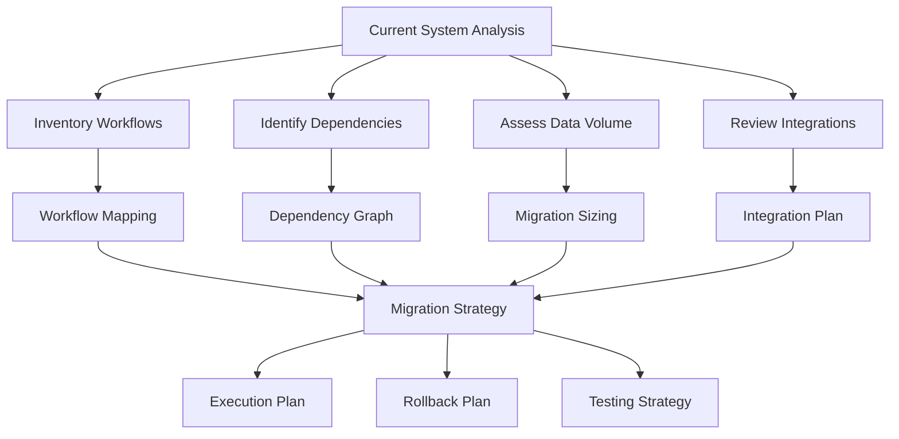
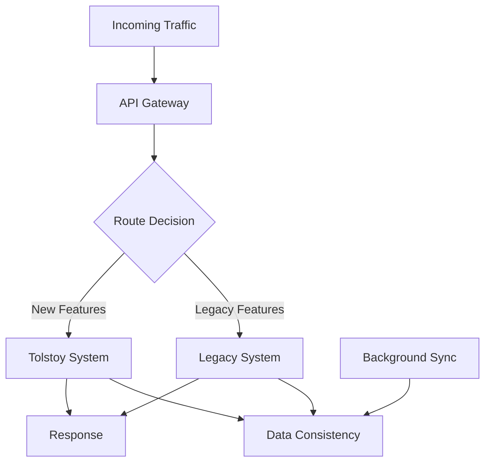

# Migration & Upgrade Guide

This guide provides detailed instructions and strategies for migrating existing workflow systems to Tolstoy and upgrading between Tolstoy versions safely and efficiently.

## Migration Overview

<CardGroup cols={2}>
  <Card title="Platform Migration" icon="exchange-alt" href="#platform-migration">
    Migrate from other workflow platforms
  </Card>
  <Card title="Version Upgrades" icon="arrow-up" href="#version-upgrades">
    Upgrade between Tolstoy versions
  </Card>
  <Card title="Data Migration" icon="database" href="#data-migration">
    Migrate workflows and configuration data
  </Card>
  <Card title="Zero-Downtime Migration" icon="sync" href="#zero-downtime-migration">
    Maintain service availability during migration
  </Card>
</CardGroup>

## Pre-Migration Planning

### Migration Assessment



<AccordionGroup>
  <Accordion title="Current System Inventory">
    **Assessment Checklist:**
    ```typescript
    interface SystemInventory {
      workflows: {
        count: number;
        complexity: 'simple' | 'medium' | 'complex';
        frequency: 'low' | 'medium' | 'high';
        dependencies: string[];
      }[];
      integrations: {
        service: string;
        type: 'api' | 'webhook' | 'database';
        criticality: 'low' | 'medium' | 'high';
        authMethod: string;
      }[];
      dataVolume: {
        executions: number;
        historicalData: string; // e.g., "6 months"
        averagePayloadSize: string;
      };
      performance: {
        currentThroughput: number; // executions per minute
        peakLoad: number;
        responseTime: {
          p50: number;
          p95: number;
          p99: number;
        };
      };
    }
    
    // Example assessment
    const currentSystemAssessment: SystemInventory = {
      workflows: [
        {
          count: 45,
          complexity: 'medium',
          frequency: 'high',
          dependencies: ['stripe', 'sendgrid', 'slack']
        },
        {
          count: 15,
          complexity: 'complex',
          frequency: 'medium',
          dependencies: ['hubspot', 'salesforce', 'zendesk']
        }
      ],
      integrations: [
        {
          service: 'stripe',
          type: 'api',
          criticality: 'high',
          authMethod: 'api_key'
        },
        {
          service: 'sendgrid',
          type: 'api', 
          criticality: 'medium',
          authMethod: 'api_key'
        }
      ],
      dataVolume: {
        executions: 500000,
        historicalData: '12 months',
        averagePayloadSize: '2KB'
      },
      performance: {
        currentThroughput: 150,
        peakLoad: 500,
        responseTime: {
          p50: 800,
          p95: 2000,
          p99: 5000
        }
      }
    };
    ```
  </Accordion>
  
  <Accordion title="Migration Strategy Selection">
    **Strategy Comparison:**
    
    | Strategy | Downtime | Risk | Complexity | Best For |
    |----------|----------|------|------------|----------|
    | Big Bang | High | High | Low | Simple systems, maintenance windows |
    | Phased | Medium | Medium | Medium | Medium-complexity systems |
    | Parallel Run | Low | Low | High | Critical systems, large scale |
    | Strangler Fig | None | Very Low | Very High | Complex systems, gradual migration |
    
    ```typescript
    interface MigrationStrategy {
      name: string;
      phases: Phase[];
      rollbackPlan: RollbackPlan;
      validationSteps: ValidationStep[];
    }
    
    const parallelRunStrategy: MigrationStrategy = {
      name: 'Parallel Run Migration',
      phases: [
        {
          name: 'Setup Parallel Environment',
          duration: '2 weeks',
          tasks: [
            'Deploy Tolstoy infrastructure',
            'Configure monitoring and alerting',
            'Set up data synchronization'
          ]
        },
        {
          name: 'Workflow Migration',
          duration: '4 weeks',
          tasks: [
            'Migrate workflows by priority',
            'Run parallel execution',
            'Compare results and performance'
          ]
        },
        {
          name: 'Traffic Shift',
          duration: '2 weeks',
          tasks: [
            'Gradual traffic migration (10%, 25%, 50%, 100%)',
            'Monitor system performance',
            'Validate data consistency'
          ]
        },
        {
          name: 'Decommission Legacy',
          duration: '1 week',
          tasks: [
            'Final data sync',
            'Shut down legacy system',
            'Clean up resources'
          ]
        }
      ],
      rollbackPlan: {
        triggers: ['Error rate > 5%', 'Response time > 3s', 'Data inconsistency detected'],
        steps: [
          'Stop traffic to Tolstoy',
          'Route all traffic to legacy system', 
          'Investigate and fix issues',
          'Resume migration after validation'
        ]
      },
      validationSteps: [
        {
          name: 'Workflow Output Validation',
          type: 'automated',
          frequency: 'continuous'
        },
        {
          name: 'Performance Comparison',
          type: 'monitoring',
          frequency: 'real-time'
        },
        {
          name: 'Data Integrity Check',
          type: 'batch',
          frequency: 'daily'
        }
      ]
    };
    ```
  </Accordion>
  
  <Accordion title="Risk Assessment">
    **Risk Matrix:**
    ```typescript
    interface MigrationRisk {
      category: string;
      risk: string;
      probability: 'low' | 'medium' | 'high';
      impact: 'low' | 'medium' | 'high';
      mitigation: string[];
      contingency: string;
    }
    
    const migrationRisks: MigrationRisk[] = [
      {
        category: 'Technical',
        risk: 'Data loss during migration',
        probability: 'low',
        impact: 'high',
        mitigation: [
          'Multiple backup points',
          'Incremental migration with validation',
          'Rollback procedures tested'
        ],
        contingency: 'Restore from backup and retry with smaller batches'
      },
      {
        category: 'Performance',
        risk: 'System slowdown during migration',
        probability: 'medium',
        impact: 'medium',
        mitigation: [
          'Load testing before migration',
          'Resource scaling during migration',
          'Off-peak migration timing'
        ],
        contingency: 'Scale up resources or pause migration during peak hours'
      },
      {
        category: 'Integration',
        risk: 'Third-party API rate limiting',
        probability: 'high',
        impact: 'medium',
        mitigation: [
          'Pre-negotiate higher rate limits',
          'Implement exponential backoff',
          'Batch API calls where possible'
        ],
        contingency: 'Temporary rate limit increase or migration pause'
      },
      {
        category: 'Business',
        risk: 'Service disruption during migration',
        probability: 'medium',
        impact: 'high',
        mitigation: [
          'Parallel run strategy',
          'Gradual traffic shift',
          '24/7 monitoring during migration'
        ],
        contingency: 'Immediate rollback to legacy system'
      }
    ];
    ```
  </Accordion>
</AccordionGroup>

## Platform Migration

### From Zapier

<Tabs>
  <Tab title="Workflow Mapping">
    **Zapier to Tolstoy Mapping:**
    ```typescript
    interface ZapierWorkflow {
      id: string;
      name: string;
      trigger: {
        app: string;
        event: string;
        config: any;
      };
      actions: Array<{
        app: string;
        action: string;
        config: any;
      }>;
      filters?: Array<{
        field: string;
        operator: string;
        value: any;
      }>;
    }
    
    class ZapierMigrator {
      async convertWorkflow(zapierWorkflow: ZapierWorkflow): Promise<TolstoyFlow> {
        const tolstoyFlow: TolstoyFlow = {
          name: zapierWorkflow.name,
          description: `Migrated from Zapier: ${zapierWorkflow.id}`,
          trigger: await this.convertTrigger(zapierWorkflow.trigger),
          steps: await this.convertSteps(zapierWorkflow.actions, zapierWorkflow.filters)
        };
        
        return tolstoyFlow;
      }
      
      private async convertTrigger(zapierTrigger: any): Promise<TolstoyTrigger> {
        const triggerMappings = {
          'webhook': {
            type: 'webhook',
            config: {
              method: 'POST',
              path: `/webhooks/${zapierTrigger.config.hook_id}`,
              authentication: {
                type: 'signature',
                secret: zapierTrigger.config.hook_secret
              }
            }
          },
          'schedule': {
            type: 'schedule',
            config: {
              cron: this.convertZapierSchedule(zapierTrigger.config.schedule)
            }
          },
          // Add more trigger mappings as needed
        };
        
        return triggerMappings[zapierTrigger.event] || {
          type: 'webhook',
          config: { method: 'POST', path: '/webhooks/generic' }
        };
      }
      
      private async convertSteps(
        zapierActions: any[], 
        zapierFilters?: any[]
      ): Promise<TolstoyStep[]> {
        const steps: TolstoyStep[] = [];
        
        // Add filter step if filters exist
        if (zapierFilters && zapierFilters.length > 0) {
          steps.push({
            id: 'filter_conditions',
            name: 'Apply Filters',
            type: 'condition',
            condition: this.convertFilters(zapierFilters)
          });
        }
        
        // Convert actions to steps
        for (let i = 0; i < zapierActions.length; i++) {
          const action = zapierActions[i];
          const step = await this.convertAction(action, i);
          steps.push(step);
        }
        
        return steps;
      }
      
      private async convertAction(zapierAction: any, index: number): Promise<TolstoyStep> {
        const actionMappings = {
          'gmail': {
            'send_email': 'gmail_send_email'
          },
          'slack': {
            'send_channel_message': 'slack_send_message',
            'send_direct_message': 'slack_send_dm'
          },
          'google-sheets': {
            'create_spreadsheet_row': 'sheets_append_row',
            'update_spreadsheet_row': 'sheets_update_row'
          },
          'airtable': {
            'create_record': 'airtable_create_record'
          }
        };
        
        const tolstoyActionId = actionMappings[zapierAction.app]?.[zapierAction.action];
        
        if (!tolstoyActionId) {
          throw new Error(`No mapping found for ${zapierAction.app}:${zapierAction.action}`);
        }
        
        return {
          id: `step_${index + 1}`,
          name: `${zapierAction.app} - ${zapierAction.action}`,
          type: 'action',
          actionId: tolstoyActionId,
          input: this.convertActionInput(zapierAction.config),
          dependencies: index > 0 ? [`step_${index}`] : undefined
        };
      }
      
      private convertActionInput(zapierConfig: any): any {
        // Convert Zapier's variable format {{field}} to Tolstoy's format {{ trigger.field }}
        const input = { ...zapierConfig };
        
        for (const [key, value] of Object.entries(input)) {
          if (typeof value === 'string') {
            input[key] = value.replace(/{{([^}]+)}}/g, '{{ trigger.$1 }}');
          }
        }
        
        return input;
      }
    }
    ```
  </Tab>
  
  <Tab title="Bulk Migration Tool">
    **Automated Migration Script:**
    ```typescript
    class BulkMigrationTool {
      private zapierClient: ZapierClient;
      private tolstoyClient: TolstoyClient;
      private migrator: ZapierMigrator;
      
      constructor() {
        this.zapierClient = new ZapierClient(process.env.ZAPIER_API_KEY);
        this.tolstoyClient = new TolstoyClient({
          apiKey: process.env.TOLSTOY_API_KEY,
          organizationId: process.env.TOLSTOY_ORG_ID
        });
        this.migrator = new ZapierMigrator();
      }
      
      async migrateAllWorkflows(): Promise<MigrationReport> {
        const report: MigrationReport = {
          totalWorkflows: 0,
          migrated: 0,
          failed: 0,
          errors: []
        };
        
        try {
          // Get all Zapier workflows
          const zapierWorkflows = await this.zapierClient.getWorkflows();
          report.totalWorkflows = zapierWorkflows.length;
          
          console.log(`Found ${zapierWorkflows.length} Zapier workflows to migrate`);
          
          // Migrate workflows in batches
          const batchSize = 5;
          for (let i = 0; i < zapierWorkflows.length; i += batchSize) {
            const batch = zapierWorkflows.slice(i, i + batchSize);
            
            console.log(`Migrating batch ${Math.floor(i/batchSize) + 1}/${Math.ceil(zapierWorkflows.length/batchSize)}`);
            
            await Promise.allSettled(
              batch.map(async (workflow) => {
                try {
                  await this.migrateWorkflow(workflow);
                  report.migrated++;
                  console.log(`✅ Migrated: ${workflow.name}`);
                } catch (error) {
                  report.failed++;
                  report.errors.push({
                    workflowId: workflow.id,
                    workflowName: workflow.name,
                    error: error.message
                  });
                  console.error(`❌ Failed: ${workflow.name} - ${error.message}`);
                }
              })
            );
            
            // Wait between batches to avoid rate limits
            if (i + batchSize < zapierWorkflows.length) {
              await this.sleep(2000);
            }
          }
          
          console.log('Migration completed!');
          console.log(`Successfully migrated: ${report.migrated}/${report.totalWorkflows}`);
          console.log(`Failed migrations: ${report.failed}`);
          
          return report;
          
        } catch (error) {
          console.error('Migration failed:', error);
          throw error;
        }
      }
      
      private async migrateWorkflow(zapierWorkflow: ZapierWorkflow): Promise<void> {
        // Convert Zapier workflow to Tolstoy format
        const tolstoyFlow = await this.migrator.convertWorkflow(zapierWorkflow);
        
        // Create necessary tools first
        await this.ensureToolsExist(zapierWorkflow);
        
        // Create the flow in Tolstoy
        const createdFlow = await this.tolstoyClient.flows.create(tolstoyFlow);
        
        // Test the migrated workflow
        await this.validateMigratedWorkflow(createdFlow, zapierWorkflow);
        
        // Store mapping for reference
        await this.storeMigrationMapping(zapierWorkflow.id, createdFlow.id);
      }
      
      private async ensureToolsExist(zapierWorkflow: ZapierWorkflow): Promise<void> {
        const requiredApps = new Set<string>();
        
        // Collect all apps used in the workflow
        requiredApps.add(zapierWorkflow.trigger.app);
        zapierWorkflow.actions.forEach(action => requiredApps.add(action.app));
        
        // Check if tools exist, create if needed
        for (const app of requiredApps) {
          const existingTool = await this.findExistingTool(app);
          
          if (!existingTool) {
            const toolConfig = this.getToolConfig(app);
            await this.tolstoyClient.tools.create(toolConfig);
            console.log(`Created tool for ${app}`);
          }
        }
      }
      
      private async validateMigratedWorkflow(
        tolstoyFlow: any, 
        zapierWorkflow: ZapierWorkflow
      ): Promise<void> {
        // Create a test execution to validate the migration
        const testData = this.generateTestData(zapierWorkflow);
        
        try {
          const execution = await this.tolstoyClient.flows.execute(tolstoyFlow.id, {
            input: testData,
            dryRun: true // Don't actually execute external actions
          });
          
          const result = await this.tolstoyClient.executions.waitForCompletion(execution.id);
          
          if (result.status !== 'success') {
            throw new Error(`Test execution failed: ${result.error?.message}`);
          }
          
          console.log(`✅ Validation passed for ${tolstoyFlow.name}`);
          
        } catch (error) {
          console.warn(`⚠️  Validation warning for ${tolstoyFlow.name}: ${error.message}`);
          // Don't fail the migration for validation issues, just log them
        }
      }
    }
    ```
  </Tab>
  
  <Tab title="Data Sync">
    **Historical Data Migration:**
    ```typescript
    class ZapierDataSync {
      private zapierClient: ZapierClient;
      private tolstoyClient: TolstoyClient;
      
      async syncHistoricalData(
        zapierWorkflowId: string, 
        tolstoyFlowId: string,
        timeRange: { start: Date; end: Date }
      ): Promise<void> {
        console.log(`Syncing historical data from ${timeRange.start} to ${timeRange.end}`);
        
        const zapierExecutions = await this.zapierClient.getExecutionHistory(
          zapierWorkflowId, 
          timeRange
        );
        
        console.log(`Found ${zapierExecutions.length} historical executions`);
        
        // Process executions in batches
        const batchSize = 50;
        for (let i = 0; i < zapierExecutions.length; i += batchSize) {
          const batch = zapierExecutions.slice(i, i + batchSize);
          
          await Promise.all(
            batch.map(execution => this.syncExecution(execution, tolstoyFlowId))
          );
          
          console.log(`Synced ${Math.min(i + batchSize, zapierExecutions.length)}/${zapierExecutions.length} executions`);
          
          // Rate limiting
          await this.sleep(1000);
        }
      }
      
      private async syncExecution(zapierExecution: any, tolstoyFlowId: string): Promise<void> {
        try {
          // Create corresponding execution record in Tolstoy
          const tolstoyExecution = await this.tolstoyClient.executions.create({
            flowId: tolstoyFlowId,
            status: this.mapExecutionStatus(zapierExecution.status),
            startedAt: zapierExecution.started_at,
            completedAt: zapierExecution.completed_at,
            input: zapierExecution.input_data,
            output: zapierExecution.output_data,
            steps: zapierExecution.steps?.map(step => ({
              id: step.id,
              name: step.name,
              status: this.mapStepStatus(step.status),
              startedAt: step.started_at,
              completedAt: step.completed_at,
              input: step.input_data,
              output: step.output_data,
              error: step.error
            })),
            metadata: {
              migratedFromZapier: true,
              originalExecutionId: zapierExecution.id,
              migrationTimestamp: new Date().toISOString()
            }
          });
          
          // Store mapping for future reference
          await this.storeExecutionMapping(zapierExecution.id, tolstoyExecution.id);
          
        } catch (error) {
          console.error(`Failed to sync execution ${zapierExecution.id}:`, error.message);
        }
      }
      
      private mapExecutionStatus(zapierStatus: string): string {
        const statusMap = {
          'success': 'success',
          'error': 'failed',
          'halted': 'cancelled',
          'throttled': 'failed',
          'filtered': 'skipped'
        };
        
        return statusMap[zapierStatus] || 'unknown';
      }
    }
    ```
  </Tab>
</Tabs>

### From Microsoft Power Automate

<AccordionGroup>
  <Accordion title="Flow Export">
    **Power Automate Export Process:**
    ```typescript
    class PowerAutomateMigrator {
      private powerAutomateClient: PowerAutomateClient;
      
      async exportFlows(environmentId: string): Promise<PowerAutomateFlow[]> {
        const flows = await this.powerAutomateClient.getFlows(environmentId);
        
        const exportedFlows = await Promise.all(
          flows.map(async (flow) => {
            // Get detailed flow definition
            const flowDefinition = await this.powerAutomateClient.getFlowDefinition(flow.id);
            
            // Get connection references
            const connections = await this.powerAutomateClient.getFlowConnections(flow.id);
            
            // Get run history for analysis
            const runHistory = await this.powerAutomateClient.getRunHistory(flow.id, {
              limit: 100
            });
            
            return {
              ...flow,
              definition: flowDefinition,
              connections,
              runHistory
            };
          })
        );
        
        return exportedFlows;
      }
      
      async convertToTolstoy(powerAutomateFlow: PowerAutomateFlow): Promise<TolstoyFlow> {
        const definition = powerAutomateFlow.definition;
        
        // Parse Power Automate trigger
        const trigger = await this.convertTrigger(definition.triggers);
        
        // Parse Power Automate actions
        const steps = await this.convertActions(definition.actions);
        
        return {
          name: powerAutomateFlow.displayName,
          description: `Migrated from Power Automate: ${powerAutomateFlow.id}`,
          trigger,
          steps,
          settings: {
            timeout: 300, // 5 minutes default
            retryPolicy: {
              maxRetries: 3,
              backoffMultiplier: 2
            }
          }
        };
      }
      
      private async convertTrigger(triggers: any): Promise<TolstoyTrigger> {
        const triggerKey = Object.keys(triggers)[0];
        const trigger = triggers[triggerKey];
        
        const triggerMappings = {
          'manual': {
            type: 'manual',
            config: {}
          },
          'recurrence': {
            type: 'schedule',
            config: {
              cron: this.convertRecurrenceToCron(trigger.recurrence)
            }
          },
          'apiconnection': this.convertApiConnectionTrigger(trigger),
          'http': {
            type: 'webhook',
            config: {
              method: trigger.method || 'POST',
              path: `/webhooks/${triggerKey.toLowerCase()}`
            }
          }
        };
        
        return triggerMappings[trigger.type] || triggerMappings['manual'];
      }
      
      private async convertActions(actions: any): Promise<TolstoyStep[]> {
        const steps: TolstoyStep[] = [];
        const actionKeys = Object.keys(actions);
        
        // Build dependency graph
        const dependencies = this.buildDependencyGraph(actions);
        
        for (const actionKey of actionKeys) {
          const action = actions[actionKey];
          const step = await this.convertAction(actionKey, action, dependencies);
          steps.push(step);
        }
        
        return steps;
      }
      
      private async convertAction(
        actionKey: string, 
        action: any, 
        dependencies: Map<string, string[]>
      ): Promise<TolstoyStep> {
        const actionMappings = {
          'office365': this.convertOffice365Action,
          'sharepointonline': this.convertSharePointAction,
          'http': this.convertHttpAction,
          'condition': this.convertConditionAction,
          'foreach': this.convertForeachAction,
          'compose': this.convertComposeAction
        };
        
        const converter = actionMappings[action.type];
        
        if (converter) {
          return converter.call(this, actionKey, action, dependencies);
        }
        
        // Generic action conversion
        return {
          id: actionKey,
          name: action.metadata?.operationName || actionKey,
          type: 'action',
          actionId: 'generic_http_request',
          input: action.inputs || {},
          dependencies: dependencies.get(actionKey) || []
        };
      }
    }
    ```
  </Accordion>
  
  <Accordion title="Connection Migration">
    **Migrate Power Automate Connections:**
    ```typescript
    class ConnectionMigrator {
      async migrateConnections(
        powerAutomateConnections: PowerAutomateConnection[]
      ): Promise<Map<string, string>> {
        const connectionMap = new Map<string, string>();
        
        for (const connection of powerAutomateConnections) {
          try {
            const tolstoyTool = await this.createTolstoyTool(connection);
            connectionMap.set(connection.id, tolstoyTool.id);
            
            console.log(`✅ Migrated connection: ${connection.displayName} -> ${tolstoyTool.id}`);
          } catch (error) {
            console.error(`❌ Failed to migrate connection ${connection.displayName}:`, error.message);
          }
        }
        
        return connectionMap;
      }
      
      private async createTolstoyTool(connection: PowerAutomateConnection): Promise<Tool> {
        const toolConfig = this.getToolConfigForConnector(connection.connectorName);
        
        const tool = await this.tolstoyClient.tools.create({
          name: connection.displayName,
          baseUrl: toolConfig.baseUrl,
          category: toolConfig.category,
          authType: toolConfig.authType,
          authConfig: toolConfig.authConfig,
          metadata: {
            migratedFromPowerAutomate: true,
            originalConnectionId: connection.id,
            connectorName: connection.connectorName
          }
        });
        
        // Migrate authentication if possible
        if (connection.authParameters) {
          await this.migrateAuthentication(tool.id, connection.authParameters);
        }
        
        return tool;
      }
      
      private getToolConfigForConnector(connectorName: string): ToolConfig {
        const connectorMappings = {
          'office365': {
            baseUrl: 'https://graph.microsoft.com/v1.0',
            category: 'productivity',
            authType: 'oauth2',
            authConfig: {
              authUrl: 'https://login.microsoftonline.com/common/oauth2/v2.0/authorize',
              tokenUrl: 'https://login.microsoftonline.com/common/oauth2/v2.0/token',
              scopes: ['https://graph.microsoft.com/.default']
            }
          },
          'sharepointonline': {
            baseUrl: 'https://graph.microsoft.com/v1.0',
            category: 'productivity',
            authType: 'oauth2',
            authConfig: {
              authUrl: 'https://login.microsoftonline.com/common/oauth2/v2.0/authorize',
              tokenUrl: 'https://login.microsoftonline.com/common/oauth2/v2.0/token',
              scopes: ['https://graph.microsoft.com/.default']
            }
          },
          'sql': {
            baseUrl: '',
            category: 'database',
            authType: 'basic',
            authConfig: {}
          },
          'http': {
            baseUrl: '',
            category: 'api',
            authType: 'api_key',
            authConfig: {}
          }
        };
        
        return connectorMappings[connectorName] || connectorMappings['http'];
      }
    }
    ```
  </Accordion>
</AccordionGroup>

## Version Upgrades

### Tolstoy Version Upgrade Process

<Tabs>
  <Tab title="Upgrade Planning">
    **Pre-Upgrade Checklist:**
    ```typescript
    interface UpgradeReadiness {
      currentVersion: string;
      targetVersion: string;
      compatibility: CompatibilityCheck;
      backups: BackupStatus;
      testing: TestingStatus;
      rollbackPlan: RollbackPlan;
    }
    
    class UpgradePlanner {
      async assessUpgradeReadiness(
        currentVersion: string, 
        targetVersion: string
      ): Promise<UpgradeReadiness> {
        const compatibility = await this.checkCompatibility(currentVersion, targetVersion);
        const backups = await this.verifyBackups();
        const testing = await this.validateTestEnvironment();
        const rollbackPlan = this.createRollbackPlan(currentVersion);
        
        return {
          currentVersion,
          targetVersion,
          compatibility,
          backups,
          testing,
          rollbackPlan
        };
      }
      
      private async checkCompatibility(
        currentVersion: string, 
        targetVersion: string
      ): Promise<CompatibilityCheck> {
        const versionInfo = await this.getVersionInfo(targetVersion);
        
        return {
          breakingChanges: versionInfo.breakingChanges,
          deprecations: versionInfo.deprecations,
          newFeatures: versionInfo.newFeatures,
          migrationSteps: versionInfo.migrationSteps,
          estimatedDowntime: versionInfo.estimatedDowntime
        };
      }
      
      private async validateTestEnvironment(): Promise<TestingStatus> {
        // Verify test environment exists and is ready
        const testEnvHealth = await this.checkTestEnvironmentHealth();
        const testDataReady = await this.verifyTestData();
        const automatedTests = await this.validateAutomatedTests();
        
        return {
          environmentReady: testEnvHealth,
          testDataReady,
          automatedTestsReady: automatedTests,
          testPlan: this.createUpgradeTestPlan()
        };
      }
      
      async generateUpgradePlan(readiness: UpgradeReadiness): Promise<UpgradePlan> {
        return {
          phases: [
            {
              name: 'Preparation',
              duration: '2 hours',
              tasks: [
                'Create full system backup',
                'Deploy to test environment',
                'Run compatibility tests',
                'Validate rollback procedures'
              ]
            },
            {
              name: 'Database Migration',
              duration: '1 hour',
              tasks: [
                'Stop application traffic',
                'Run database migrations',
                'Verify data integrity',
                'Update configuration'
              ]
            },
            {
              name: 'Application Update',
              duration: '30 minutes',
              tasks: [
                'Deploy new application version',
                'Update dependencies',
                'Apply configuration changes',
                'Restart services'
              ]
            },
            {
              name: 'Validation',
              duration: '1 hour',
              tasks: [
                'Health checks',
                'Smoke tests',
                'Performance validation',
                'Resume traffic'
              ]
            }
          ],
          totalEstimatedTime: '4.5 hours',
          rollbackTime: '1 hour',
          riskLevel: this.calculateRiskLevel(readiness)
        };
      }
    }
    ```
  </Tab>
  
  <Tab title="Zero-Downtime Upgrade">
    **Blue-Green Deployment Strategy:**
    ```typescript
    class BlueGreenUpgrade {
      private currentEnvironment: 'blue' | 'green' = 'blue';
      private environments = {
        blue: {
          instances: [] as string[],
          version: '',
          traffic: 0
        },
        green: {
          instances: [] as string[],
          version: '',
          traffic: 0
        }
      };
      
      async performZeroDowntimeUpgrade(targetVersion: string): Promise<void> {
        const targetEnv = this.currentEnvironment === 'blue' ? 'green' : 'blue';
        
        console.log(`Starting zero-downtime upgrade to ${targetVersion}`);
        console.log(`Current environment: ${this.currentEnvironment}`);
        console.log(`Target environment: ${targetEnv}`);
        
        try {
          // Phase 1: Deploy to inactive environment
          await this.deployToEnvironment(targetEnv, targetVersion);
          
          // Phase 2: Run health checks
          await this.validateEnvironment(targetEnv);
          
          // Phase 3: Gradual traffic shift
          await this.performTrafficShift(targetEnv);
          
          // Phase 4: Decommission old environment
          await this.decommissionEnvironment(this.currentEnvironment);
          
          // Update current environment reference
          this.currentEnvironment = targetEnv;
          
          console.log(`✅ Zero-downtime upgrade completed successfully`);
          
        } catch (error) {
          console.error('Upgrade failed, rolling back...');
          await this.rollbackUpgrade();
          throw error;
        }
      }
      
      private async deployToEnvironment(env: 'blue' | 'green', version: string): Promise<void> {
        console.log(`Deploying version ${version} to ${env} environment`);
        
        // Scale up target environment
        const instances = await this.scaleUpEnvironment(env, 3);
        this.environments[env].instances = instances;
        this.environments[env].version = version;
        
        // Deploy application
        await Promise.all(instances.map(instance => 
          this.deployToInstance(instance, version)
        ));
        
        // Wait for all instances to be ready
        await Promise.all(instances.map(instance => 
          this.waitForInstanceReady(instance)
        ));
        
        console.log(`✅ Deployment to ${env} environment completed`);
      }
      
      private async performTrafficShift(targetEnv: 'blue' | 'green'): Promise<void> {
        const shiftSteps = [10, 25, 50, 75, 100];
        
        for (const percentage of shiftSteps) {
          console.log(`Shifting ${percentage}% traffic to ${targetEnv} environment`);
          
          await this.updateLoadBalancer(targetEnv, percentage);
          this.environments[targetEnv].traffic = percentage;
          this.environments[this.currentEnvironment].traffic = 100 - percentage;
          
          // Monitor for 5 minutes at each step
          await this.monitorTrafficShift(5 * 60 * 1000);
          
          // Check health metrics
          const healthCheck = await this.checkEnvironmentHealth(targetEnv);
          if (!healthCheck.healthy) {
            throw new Error(`Health check failed during traffic shift: ${healthCheck.errors.join(', ')}`);
          }
        }
        
        console.log(`✅ Traffic shift to ${targetEnv} completed`);
      }
      
      private async monitorTrafficShift(durationMs: number): Promise<void> {
        const startTime = Date.now();
        const endTime = startTime + durationMs;
        
        while (Date.now() < endTime) {
          const metrics = await this.getMetrics();
          
          // Check error rates
          if (metrics.errorRate > 0.05) { // 5% error threshold
            throw new Error(`High error rate detected: ${metrics.errorRate * 100}%`);
          }
          
          // Check response times
          if (metrics.responseTime.p95 > 2000) { // 2s response time threshold
            throw new Error(`High response time detected: ${metrics.responseTime.p95}ms`);
          }
          
          console.log(`Monitoring... Error rate: ${(metrics.errorRate * 100).toFixed(2)}%, P95: ${metrics.responseTime.p95}ms`);
          
          await this.sleep(30000); // Check every 30 seconds
        }
      }
      
      private async rollbackUpgrade(): Promise<void> {
        console.log('Rolling back upgrade...');
        
        // Immediately route all traffic back to current environment
        await this.updateLoadBalancer(this.currentEnvironment, 100);
        
        // Scale down failed environment
        const failedEnv = this.currentEnvironment === 'blue' ? 'green' : 'blue';
        await this.scaleDownEnvironment(failedEnv);
        
        console.log('✅ Rollback completed');
      }
    }
    ```
  </Tab>
  
  <Tab title="Database Migration">
    **Database Schema Updates:**
    ```typescript
    class DatabaseMigrator {
      private migrations: Migration[] = [];
      
      async runMigrations(targetVersion: string): Promise<void> {
        const pendingMigrations = await this.getPendingMigrations(targetVersion);
        
        if (pendingMigrations.length === 0) {
          console.log('No database migrations required');
          return;
        }
        
        console.log(`Running ${pendingMigrations.length} database migrations`);
        
        // Create backup before migrations
        const backupId = await this.createBackup();
        
        try {
          for (const migration of pendingMigrations) {
            await this.runMigration(migration);
          }
          
          console.log('✅ All database migrations completed successfully');
          
        } catch (error) {
          console.error('Database migration failed, rolling back...');
          await this.restoreBackup(backupId);
          throw error;
        }
      }
      
      private async runMigration(migration: Migration): Promise<void> {
        console.log(`Running migration: ${migration.name}`);
        
        const startTime = Date.now();
        
        try {
          // Check if migration is reversible
          if (!migration.down) {
            console.warn(`Migration ${migration.name} is not reversible`);
          }
          
          // Run pre-migration checks
          await this.runPreMigrationChecks(migration);
          
          // Execute migration
          await migration.up();
          
          // Record migration in database
          await this.recordMigration(migration);
          
          const duration = Date.now() - startTime;
          console.log(`✅ Migration ${migration.name} completed in ${duration}ms`);
          
        } catch (error) {
          console.error(`❌ Migration ${migration.name} failed:`, error.message);
          
          // Attempt rollback if available
          if (migration.down) {
            try {
              await migration.down();
              console.log(`Rolled back migration ${migration.name}`);
            } catch (rollbackError) {
              console.error(`Failed to rollback migration ${migration.name}:`, rollbackError.message);
            }
          }
          
          throw error;
        }
      }
      
      async validateDataIntegrity(): Promise<IntegrityReport> {
        console.log('Validating data integrity...');
        
        const checks = [
          this.checkReferentialIntegrity(),
          this.checkDataConsistency(),
          this.checkIndexIntegrity(),
          this.validateConstraints()
        ];
        
        const results = await Promise.all(checks);
        
        const report: IntegrityReport = {
          referentialIntegrity: results[0],
          dataConsistency: results[1],
          indexIntegrity: results[2],
          constraintValidation: results[3],
          overallStatus: results.every(r => r.passed) ? 'passed' : 'failed'
        };
        
        if (report.overallStatus === 'failed') {
          console.error('❌ Data integrity validation failed');
          console.error('Issues found:', results.filter(r => !r.passed));
        } else {
          console.log('✅ Data integrity validation passed');
        }
        
        return report;
      }
      
      private async checkReferentialIntegrity(): Promise<IntegrityCheck> {
        // Check foreign key constraints
        const query = `
          SELECT 
            tc.constraint_name,
            tc.table_name,
            kcu.column_name,
            ccu.table_name AS foreign_table_name,
            ccu.column_name AS foreign_column_name 
          FROM 
            information_schema.table_constraints AS tc 
            JOIN information_schema.key_column_usage AS kcu
              ON tc.constraint_name = kcu.constraint_name
            JOIN information_schema.constraint_column_usage AS ccu
              ON ccu.constraint_name = tc.constraint_name
          WHERE constraint_type = 'FOREIGN KEY'
        `;
        
        const foreignKeys = await this.executeQuery(query);
        const violations = [];
        
        for (const fk of foreignKeys) {
          const violationQuery = `
            SELECT COUNT(*) as violation_count
            FROM ${fk.table_name} t1
            LEFT JOIN ${fk.foreign_table_name} t2 
              ON t1.${fk.column_name} = t2.${fk.foreign_column_name}
            WHERE t1.${fk.column_name} IS NOT NULL 
              AND t2.${fk.foreign_column_name} IS NULL
          `;
          
          const result = await this.executeQuery(violationQuery);
          if (result[0].violation_count > 0) {
            violations.push({
              constraint: fk.constraint_name,
              table: fk.table_name,
              violations: result[0].violation_count
            });
          }
        }
        
        return {
          name: 'Referential Integrity',
          passed: violations.length === 0,
          violations
        };
      }
    }
    ```
  </Tab>
</Tabs>

## Data Migration

### Workflow Data Migration

<AccordionGroup>
  <Accordion title="Execution History Migration">
    ```typescript
    class ExecutionHistoryMigrator {
      private batchSize = 1000;
      private maxConcurrency = 5;
      
      async migrateExecutionHistory(
        sourceSystem: string,
        timeRange: { start: Date; end: Date }
      ): Promise<MigrationStats> {
        const stats: MigrationStats = {
          totalExecutions: 0,
          migratedExecutions: 0,
          failedExecutions: 0,
          startTime: Date.now(),
          endTime: 0
        };
        
        console.log(`Starting execution history migration from ${sourceSystem}`);
        console.log(`Time range: ${timeRange.start} to ${timeRange.end}`);
        
        try {
          // Get total count for progress tracking
          stats.totalExecutions = await this.getExecutionCount(sourceSystem, timeRange);
          console.log(`Found ${stats.totalExecutions} executions to migrate`);
          
          // Process executions in batches
          let offset = 0;
          while (offset < stats.totalExecutions) {
            const batch = await this.getExecutionBatch(
              sourceSystem, 
              timeRange, 
              offset, 
              this.batchSize
            );
            
            if (batch.length === 0) break;
            
            const batchStats = await this.processBatch(batch);
            stats.migratedExecutions += batchStats.migrated;
            stats.failedExecutions += batchStats.failed;
            
            offset += this.batchSize;
            
            const progress = ((offset / stats.totalExecutions) * 100).toFixed(1);
            console.log(`Progress: ${progress}% (${stats.migratedExecutions}/${stats.totalExecutions})`);
            
            // Rate limiting
            await this.sleep(1000);
          }
          
          stats.endTime = Date.now();
          const duration = (stats.endTime - stats.startTime) / 1000;
          
          console.log('✅ Execution history migration completed');
          console.log(`Total time: ${duration}s`);
          console.log(`Migrated: ${stats.migratedExecutions}/${stats.totalExecutions}`);
          console.log(`Failed: ${stats.failedExecutions}`);
          
          return stats;
          
        } catch (error) {
          stats.endTime = Date.now();
          console.error('❌ Execution history migration failed:', error);
          throw error;
        }
      }
      
      private async processBatch(executions: SourceExecution[]): Promise<BatchStats> {
        const semaphore = new Semaphore(this.maxConcurrency);
        let migrated = 0;
        let failed = 0;
        
        const promises = executions.map(async (execution) => {
          await semaphore.acquire();
          
          try {
            await this.migrateExecution(execution);
            migrated++;
          } catch (error) {
            console.error(`Failed to migrate execution ${execution.id}:`, error.message);
            failed++;
          } finally {
            semaphore.release();
          }
        });
        
        await Promise.all(promises);
        
        return { migrated, failed };
      }
      
      private async migrateExecution(sourceExecution: SourceExecution): Promise<void> {
        // Convert source execution to Tolstoy format
        const tolstoyExecution = await this.convertExecution(sourceExecution);
        
        // Create execution in Tolstoy
        const createdExecution = await this.tolstoyClient.executions.create(tolstoyExecution);
        
        // Store mapping for reference
        await this.storeMigrationMapping(sourceExecution.id, createdExecution.id);
      }
      
      private async convertExecution(sourceExecution: SourceExecution): Promise<TolstoyExecution> {
        return {
          flowId: await this.getFlowMapping(sourceExecution.workflowId),
          status: this.mapExecutionStatus(sourceExecution.status),
          startedAt: sourceExecution.startedAt,
          completedAt: sourceExecution.completedAt,
          duration: sourceExecution.duration,
          input: sourceExecution.input,
          output: sourceExecution.output,
          steps: sourceExecution.steps?.map(step => ({
            id: step.id,
            name: step.name,
            status: this.mapStepStatus(step.status),
            startedAt: step.startedAt,
            completedAt: step.completedAt,
            duration: step.duration,
            input: step.input,
            output: step.output,
            error: step.error
          })),
          error: sourceExecution.error,
          metadata: {
            migratedFrom: sourceExecution.source,
            originalExecutionId: sourceExecution.id,
            migrationTimestamp: new Date().toISOString()
          }
        };
      }
    }
    ```
  </Accordion>
  
  <Accordion title="Configuration Migration">
    ```typescript
    class ConfigurationMigrator {
      async migrateConfigurations(sourceSystem: string): Promise<void> {
        console.log(`Migrating configurations from ${sourceSystem}`);
        
        const migrations = [
          this.migrateEnvironmentVariables,
          this.migrateSecrets,
          this.migrateWebhookConfigurations,
          this.migrateRateLimits,
          this.migrateAlertRules
        ];
        
        for (const migration of migrations) {
          try {
            await migration.call(this, sourceSystem);
          } catch (error) {
            console.error(`Configuration migration failed: ${migration.name}`, error);
          }
        }
      }
      
      private async migrateEnvironmentVariables(sourceSystem: string): Promise<void> {
        console.log('Migrating environment variables...');
        
        const envVars = await this.getSourceEnvironmentVariables(sourceSystem);
        
        for (const [key, value] of Object.entries(envVars)) {
          // Skip sensitive variables that need manual configuration
          if (this.isSensitiveVariable(key)) {
            console.warn(`Skipping sensitive variable: ${key}`);
            continue;
          }
          
          await this.tolstoyClient.configuration.setEnvironmentVariable(key, value);
          console.log(`✅ Migrated environment variable: ${key}`);
        }
      }
      
      private async migrateSecrets(sourceSystem: string): Promise<void> {
        console.log('Migrating secrets...');
        
        const secrets = await this.getSourceSecrets(sourceSystem);
        
        for (const secret of secrets) {
          // Create placeholder secret - actual values need to be set manually
          await this.tolstoyClient.secrets.create({
            name: secret.name,
            description: `Migrated from ${sourceSystem}: ${secret.description}`,
            placeholder: true,
            metadata: {
              migratedFrom: sourceSystem,
              originalSecretId: secret.id,
              requiredForWorkflows: secret.usedByWorkflows
            }
          });
          
          console.log(`✅ Created placeholder secret: ${secret.name}`);
        }
        
        // Generate secrets migration report
        await this.generateSecretsReport(secrets);
      }
      
      private async migrateWebhookConfigurations(sourceSystem: string): Promise<void> {
        console.log('Migrating webhook configurations...');
        
        const webhooks = await this.getSourceWebhooks(sourceSystem);
        
        for (const webhook of webhooks) {
          const tolstoyWebhook = await this.tolstoyClient.webhooks.create({
            name: webhook.name,
            url: webhook.url,
            events: this.mapWebhookEvents(webhook.events),
            secret: webhook.secret,
            headers: webhook.headers,
            retryPolicy: {
              maxRetries: webhook.retryConfig?.maxRetries || 3,
              backoffMultiplier: webhook.retryConfig?.backoffMultiplier || 2
            },
            metadata: {
              migratedFrom: sourceSystem,
              originalWebhookId: webhook.id
            }
          });
          
          console.log(`✅ Migrated webhook: ${webhook.name} -> ${tolstoyWebhook.id}`);
        }
      }
      
      private async generateSecretsReport(secrets: SourceSecret[]): Promise<void> {
        const report = {
          totalSecrets: secrets.length,
          secretsByCategory: this.groupSecretsByCategory(secrets),
          manualActionRequired: secrets.map(secret => ({
            name: secret.name,
            description: secret.description,
            usedByWorkflows: secret.usedByWorkflows,
            priority: this.getSecretPriority(secret)
          })),
          generatedAt: new Date().toISOString()
        };
        
        await this.saveReport('secrets-migration-report.json', report);
        
        console.log('📊 Secrets migration report generated');
        console.log(`Total secrets to configure manually: ${secrets.length}`);
      }
    }
    ```
  </Accordion>
</AccordionGroup>

## Zero-Downtime Migration

### Strangler Fig Pattern



<Tabs>
  <Tab title="API Gateway Routing">
    ```typescript
    class StranglerFigRouter {
      private routingRules: RoutingRule[] = [];
      private migrationProgress: Map<string, number> = new Map();
      
      constructor() {
        this.loadRoutingRules();
        this.initializeProgressTracking();
      }
      
      async routeRequest(request: IncomingRequest): Promise<RouteTarget> {
        // Check if request should go to new system
        const rule = this.findMatchingRule(request);
        
        if (rule) {
          if (rule.target === 'tolstoy') {
            return this.routeToTolstoy(request, rule);
          } else if (rule.target === 'both') {
            return this.routeToBoth(request, rule);
          }
        }
        
        // Default to legacy system
        return this.routeToLegacy(request);
      }
      
      private findMatchingRule(request: IncomingRequest): RoutingRule | null {
        for (const rule of this.routingRules) {
          if (this.ruleMatches(rule, request)) {
            return rule;
          }
        }
        return null;
      }
      
      private ruleMatches(rule: RoutingRule, request: IncomingRequest): boolean {
        // Path matching
        if (rule.pathPattern && !this.pathMatches(rule.pathPattern, request.path)) {
          return false;
        }
        
        // Header matching
        if (rule.headers) {
          for (const [key, value] of Object.entries(rule.headers)) {
            if (request.headers[key] !== value) {
              return false;
            }
          }
        }
        
        // User-based routing (gradual rollout)
        if (rule.userPercentage) {
          const userId = this.extractUserId(request);
          const userHash = this.hashUser(userId);
          const userPercentile = (userHash % 100) + 1;
          
          if (userPercentile > rule.userPercentage) {
            return false;
          }
        }
        
        // Feature flag based routing
        if (rule.featureFlag) {
          const featureEnabled = this.isFeatureEnabled(rule.featureFlag, request);
          if (!featureEnabled) {
            return false;
          }
        }
        
        return true;
      }
      
      private async routeToBoth(
        request: IncomingRequest, 
        rule: RoutingRule
      ): Promise<RouteTarget> {
        // Send to both systems for comparison
        const [legacyResponse, tolstoyResponse] = await Promise.allSettled([
          this.sendToLegacy(request),
          this.sendToTolstoy(request)
        ]);
        
        // Compare responses
        const comparison = this.compareResponses(legacyResponse, tolstoyResponse);
        
        // Log comparison results
        await this.logComparison(request, comparison);
        
        // Return primary response (gradually shift from legacy to tolstoy)
        if (rule.primaryTarget === 'tolstoy' && tolstoyResponse.status === 'fulfilled') {
          return {
            target: 'tolstoy',
            response: tolstoyResponse.value,
            comparison
          };
        } else if (legacyResponse.status === 'fulfilled') {
          return {
            target: 'legacy',
            response: legacyResponse.value,
            comparison
          };
        } else {
          throw new Error('Both systems failed');
        }
      }
      
      async updateMigrationProgress(feature: string, percentage: number): Promise<void> {
        this.migrationProgress.set(feature, percentage);
        
        // Update routing rules based on progress
        await this.updateRoutingRules();
        
        // Log progress
        console.log(`Migration progress for ${feature}: ${percentage}%`);
        
        // If feature is 100% migrated, remove from legacy routing
        if (percentage >= 100) {
          await this.removeFromLegacyRouting(feature);
          console.log(`✅ Feature ${feature} fully migrated to Tolstoy`);
        }
      }
      
      private async updateRoutingRules(): Promise<void> {
        const updatedRules = this.routingRules.map(rule => {
          const progress = this.migrationProgress.get(rule.feature) || 0;
          
          // Gradually increase traffic to Tolstoy
          return {
            ...rule,
            userPercentage: Math.min(progress, 100),
            primaryTarget: progress >= 50 ? 'tolstoy' : 'legacy'
          };
        });
        
        this.routingRules = updatedRules;
        await this.saveRoutingRules(updatedRules);
      }
      
      private compareResponses(
        legacyResult: PromiseSettledResult<any>,
        tolstoyResult: PromiseSettledResult<any>
      ): ResponseComparison {
        const comparison: ResponseComparison = {
          statusCodesMatch: false,
          dataMatch: false,
          responseTimeComparison: 0,
          differences: []
        };
        
        if (legacyResult.status === 'fulfilled' && tolstoyResult.status === 'fulfilled') {
          const legacy = legacyResult.value;
          const tolstoy = tolstoyResult.value;
          
          // Compare status codes
          comparison.statusCodesMatch = legacy.status === tolstoy.status;
          
          // Compare response data
          comparison.dataMatch = this.deepEqual(legacy.data, tolstoy.data);
          
          // Compare response times
          comparison.responseTimeComparison = tolstoy.responseTime - legacy.responseTime;
          
          // Identify differences
          if (!comparison.dataMatch) {
            comparison.differences = this.identifyDifferences(legacy.data, tolstoy.data);
          }
        }
        
        return comparison;
      }
    }
    ```
  </Tab>
  
  <Tab title="Data Synchronization">
    ```typescript
    class DataSynchronizer {
      private syncQueue: SyncOperation[] = [];
      private isRunning = false;
      
      async startContinuousSync(): Promise<void> {
        if (this.isRunning) {
          console.log('Data synchronization already running');
          return;
        }
        
        this.isRunning = true;
        console.log('Starting continuous data synchronization');
        
        // Process sync queue continuously
        while (this.isRunning) {
          try {
            await this.processSyncQueue();
            await this.sleep(5000); // 5 second intervals
          } catch (error) {
            console.error('Sync processing error:', error);
            await this.sleep(30000); // Longer delay on error
          }
        }
      }
      
      async stopSync(): Promise<void> {
        this.isRunning = false;
        
        // Process remaining items in queue
        await this.processSyncQueue();
        
        console.log('Data synchronization stopped');
      }
      
      private async processSyncQueue(): Promise<void> {
        const batchSize = 50;
        const batch = this.syncQueue.splice(0, batchSize);
        
        if (batch.length === 0) return;
        
        console.log(`Processing ${batch.length} sync operations`);
        
        const promises = batch.map(operation => this.processSyncOperation(operation));
        const results = await Promise.allSettled(promises);
        
        // Handle failed operations
        const failed = results
          .map((result, index) => ({ result, operation: batch[index] }))
          .filter(({ result }) => result.status === 'rejected');
        
        if (failed.length > 0) {
          console.warn(`${failed.length} sync operations failed`);
          
          // Retry failed operations with backoff
          for (const { operation } of failed) {
            operation.retryCount = (operation.retryCount || 0) + 1;
            
            if (operation.retryCount <= 3) {
              operation.nextRetry = Date.now() + (Math.pow(2, operation.retryCount) * 1000);
              this.syncQueue.push(operation);
            } else {
              console.error(`Sync operation permanently failed: ${operation.id}`);
              await this.handlePermanentFailure(operation);
            }
          }
        }
      }
      
      async queueDataChange(changeEvent: DataChangeEvent): Promise<void> {
        const syncOperation: SyncOperation = {
          id: this.generateId(),
          type: changeEvent.type,
          table: changeEvent.table,
          recordId: changeEvent.recordId,
          data: changeEvent.data,
          timestamp: changeEvent.timestamp,
          retryCount: 0
        };
        
        this.syncQueue.push(syncOperation);
      }
      
      private async processSyncOperation(operation: SyncOperation): Promise<void> {
        switch (operation.type) {
          case 'INSERT':
            await this.syncInsert(operation);
            break;
          case 'UPDATE':
            await this.syncUpdate(operation);
            break;
          case 'DELETE':
            await this.syncDelete(operation);
            break;
          default:
            throw new Error(`Unknown sync operation type: ${operation.type}`);
        }
      }
      
      private async syncInsert(operation: SyncOperation): Promise<void> {
        // Check if record already exists in target system
        const existingRecord = await this.tolstoyClient.data.findById(
          operation.table,
          operation.recordId
        );
        
        if (existingRecord) {
          console.log(`Record ${operation.recordId} already exists, skipping insert`);
          return;
        }
        
        // Insert record
        await this.tolstoyClient.data.create(operation.table, {
          id: operation.recordId,
          ...operation.data,
          syncedAt: new Date(),
          syncedFrom: 'legacy_system'
        });
        
        console.log(`✅ Synced INSERT: ${operation.table}:${operation.recordId}`);
      }
      
      private async syncUpdate(operation: SyncOperation): Promise<void> {
        // Update record with conflict resolution
        await this.tolstoyClient.data.upsert(operation.table, operation.recordId, {
          ...operation.data,
          lastSyncedAt: new Date(),
          syncedFrom: 'legacy_system'
        });
        
        console.log(`✅ Synced UPDATE: ${operation.table}:${operation.recordId}`);
      }
      
      private async syncDelete(operation: SyncOperation): Promise<void> {
        // Soft delete to maintain referential integrity
        await this.tolstoyClient.data.update(operation.table, operation.recordId, {
          deletedAt: new Date(),
          deletedFrom: 'legacy_system'
        });
        
        console.log(`✅ Synced DELETE: ${operation.table}:${operation.recordId}`);
      }
      
      async validateDataConsistency(): Promise<ConsistencyReport> {
        console.log('Validating data consistency between systems...');
        
        const tables = await this.getTablesForValidation();
        const validationResults = [];
        
        for (const table of tables) {
          const result = await this.validateTableConsistency(table);
          validationResults.push(result);
          
          if (result.inconsistencies > 0) {
            console.warn(`Found ${result.inconsistencies} inconsistencies in ${table}`);
          }
        }
        
        return {
          totalTables: tables.length,
          consistentTables: validationResults.filter(r => r.inconsistencies === 0).length,
          inconsistentTables: validationResults.filter(r => r.inconsistencies > 0).length,
          totalInconsistencies: validationResults.reduce((sum, r) => sum + r.inconsistencies, 0),
          details: validationResults
        };
      }
    }
    ```
  </Tab>
</Tabs>

This comprehensive migration and upgrade guide provides the tools and strategies needed to safely transition to Tolstoy and maintain system reliability throughout the migration process.