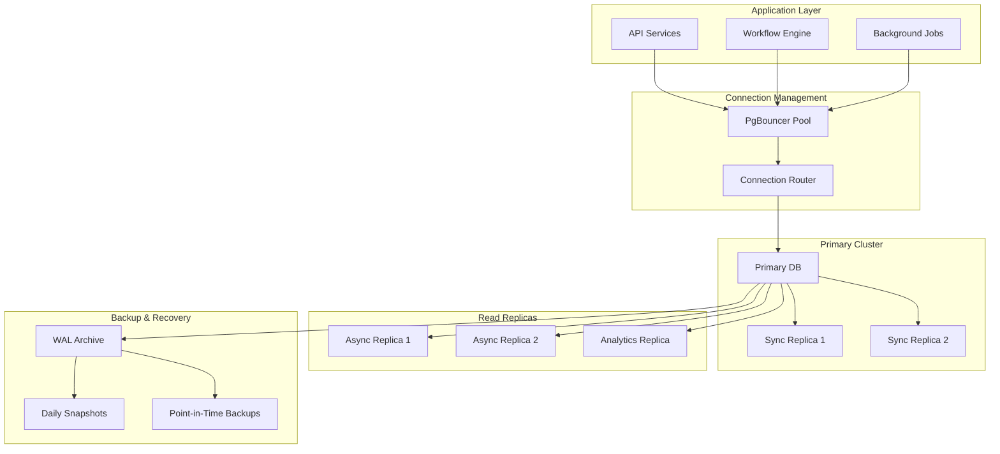

# Database Operations Runbook

## Overview

This runbook covers essential database operations for the PostgreSQL databases supporting the Tolstoy platform, including maintenance procedures, performance optimization, backup management, and troubleshooting.

## Database Architecture



## Daily Operations

### 1. Health Monitoring

<Tabs>
  <Tab title="Connection Status">
    ```sql
    -- Check active connections by state
    SELECT state, count(*) as connections
    FROM pg_stat_activity
    WHERE state IS NOT NULL
    GROUP BY state
    ORDER BY connections DESC;
    
    -- Check connections by application
    SELECT application_name, count(*) as connections, 
           max(backend_start) as latest_connection
    FROM pg_stat_activity
    WHERE application_name IS NOT NULL
    GROUP BY application_name
    ORDER BY connections DESC;
    
    -- Check for idle connections
    SELECT pid, usename, application_name, state, 
           now() - state_change as idle_duration
    FROM pg_stat_activity
    WHERE state = 'idle'
      AND now() - state_change > interval '1 hour'
    ORDER BY idle_duration DESC;
    ```
  </Tab>
  
  <Tab title="Performance Metrics">
    ```sql
    -- Database size and growth
    SELECT datname,
           pg_size_pretty(pg_database_size(datname)) as size,
           pg_database_size(datname) as size_bytes
    FROM pg_database
    WHERE datname NOT IN ('template0', 'template1', 'postgres')
    ORDER BY size_bytes DESC;
    
    -- Table sizes
    SELECT schemaname, tablename,
           pg_size_pretty(pg_total_relation_size(schemaname||'.'||tablename)) as total_size,
           pg_size_pretty(pg_relation_size(schemaname||'.'||tablename)) as table_size,
           pg_size_pretty(pg_total_relation_size(schemaname||'.'||tablename) - 
                         pg_relation_size(schemaname||'.'||tablename)) as index_size
    FROM pg_tables
    WHERE schemaname = 'public'
    ORDER BY pg_total_relation_size(schemaname||'.'||tablename) DESC
    LIMIT 20;
    
    -- Index usage statistics
    SELECT schemaname, tablename, indexname,
           idx_tup_read, idx_tup_fetch,
           pg_size_pretty(pg_relation_size(indexrelid)) as index_size
    FROM pg_stat_user_indexes
    WHERE idx_tup_read = 0
    ORDER BY pg_relation_size(indexrelid) DESC;
    ```
  </Tab>
  
  <Tab title="Query Performance">
    ```sql
    -- Slowest queries (requires pg_stat_statements)
    SELECT query,
           calls,
           total_time,
           mean_time,
           max_time,
           stddev_time,
           rows as total_rows,
           (100.0 * shared_blks_hit / nullif(shared_blks_hit + shared_blks_read, 0))::numeric(5,2) as hit_percent
    FROM pg_stat_statements
    WHERE calls > 100
    ORDER BY mean_time DESC
    LIMIT 20;
    
    -- Most frequently executed queries
    SELECT query,
           calls,
           total_time,
           mean_time,
           rows as total_rows
    FROM pg_stat_statements
    ORDER BY calls DESC
    LIMIT 20;
    
    -- Currently running queries
    SELECT pid, usename, application_name,
           now() - query_start as duration,
           state,
           left(query, 100) as query_preview
    FROM pg_stat_activity
    WHERE state = 'active'
      AND query NOT LIKE '%pg_stat_activity%'
    ORDER BY duration DESC;
    ```
  </Tab>
  
  <Tab title="System Resources">
    ```sql
    -- Check WAL generation rate
    SELECT slot_name,
           plugin,
           slot_type,
           database,
           active,
           pg_size_pretty(pg_wal_lsn_diff(pg_current_wal_lsn(), restart_lsn)) as lag
    FROM pg_replication_slots;
    
    -- Checkpoint and background writer stats
    SELECT checkpoints_timed,
           checkpoints_req,
           checkpoint_write_time,
           checkpoint_sync_time,
           buffers_checkpoint,
           buffers_clean,
           maxwritten_clean,
           buffers_backend,
           buffers_backend_fsync,
           buffers_alloc
    FROM pg_stat_bgwriter;
    
    -- Cache hit ratio
    SELECT datname,
           numbackends as connections,
           xact_commit,
           xact_rollback,
           blks_read,
           blks_hit,
           (100.0 * blks_hit / (blks_hit + blks_read))::numeric(5,2) as cache_hit_ratio
    FROM pg_stat_database
    WHERE datname = current_database();
    ```
  </Tab>
</Tabs>

### 2. Routine Maintenance

**Daily Tasks:**
```bash
#!/bin/bash
# Daily database maintenance script

# Set connection parameters
export PGHOST="tolstoy-prod-db.cluster-xyz.us-west-2.rds.amazonaws.com"
export PGDATABASE="tolstoy_prod"
export PGUSER="tolstoy_admin"

# Check database connectivity
psql -c "SELECT version();" || exit 1

# Update table statistics
echo "Updating table statistics..."
psql -c "ANALYZE;"

# Check for bloated tables
echo "Checking for table bloat..."
psql -c "
SELECT schemaname, tablename,
       pg_size_pretty(pg_total_relation_size(schemaname||'.'||tablename)) as size,
       n_dead_tup, n_live_tup,
       round((n_dead_tup::float / (n_dead_tup + n_live_tup)) * 100, 2) as dead_ratio
FROM pg_stat_user_tables
WHERE n_dead_tup > 1000
  AND (n_dead_tup::float / (n_dead_tup + n_live_tup)) > 0.1
ORDER BY dead_ratio DESC;
"

# Check for unused indexes
echo "Checking for unused indexes..."
psql -c "
SELECT schemaname, tablename, indexname,
       pg_size_pretty(pg_relation_size(indexrelid)) as size
FROM pg_stat_user_indexes
WHERE idx_tup_read = 0
  AND idx_tup_fetch = 0
  AND pg_relation_size(indexrelid) > 1048576  -- > 1MB
ORDER BY pg_relation_size(indexrelid) DESC;
"

# Log file analysis
echo "Recent errors in PostgreSQL logs:"
tail -1000 /var/log/postgresql/postgresql.log | grep -i error | tail -10

echo "Daily maintenance completed at $(date)"
```

**Weekly Tasks:**
```bash
#!/bin/bash
# Weekly database maintenance script

# Vacuum analyze all tables
echo "Running VACUUM ANALYZE on all tables..."
psql -c "VACUUM ANALYZE;"

# Reindex if needed
echo "Checking for indexes that need rebuilding..."
psql -c "
SELECT schemaname, tablename, indexname,
       pg_size_pretty(pg_relation_size(indexrelid)) as size
FROM pg_stat_user_indexes
WHERE idx_tup_read > 0
  AND idx_tup_fetch / idx_tup_read < 0.01  -- Low fetch ratio
ORDER BY pg_relation_size(indexrelid) DESC;
"

# Clean up old partitions (if using partitioning)
echo "Cleaning up old partitions..."
psql -c "
SELECT 'DROP TABLE IF EXISTS ' || schemaname || '.' || tablename || ';' as drop_command
FROM pg_tables
WHERE tablename ~ '^executions_[0-9]{4}_[0-9]{2}$'
  AND tablename < 'executions_' || to_char(current_date - interval '90 days', 'YYYY_MM')
ORDER BY tablename;
"
```

## Performance Optimization

### 1. Query Optimization

<AccordionGroup>
  <Accordion title="Identifying Slow Queries">
    ```sql
    -- Enable query logging for slow queries
    ALTER SYSTEM SET log_min_duration_statement = '1000';  -- Log queries > 1 second
    SELECT pg_reload_conf();
    
    -- Top queries by total time
    SELECT query,
           calls,
           total_time,
           total_time/calls as avg_time,
           rows,
           100.0 * shared_blks_hit / nullif(shared_blks_hit + shared_blks_read, 0) AS hit_percent
    FROM pg_stat_statements
    ORDER BY total_time DESC
    LIMIT 10;
    
    -- Queries with high I/O
    SELECT query,
           calls,
           shared_blks_read + shared_blks_written as total_io,
           shared_blks_read,
           shared_blks_written,
           shared_blks_hit
    FROM pg_stat_statements
    WHERE shared_blks_read + shared_blks_written > 1000
    ORDER BY total_io DESC
    LIMIT 10;
    ```
  </Accordion>
  
  <Accordion title="Index Analysis and Optimization">
    ```sql
    -- Missing indexes analysis
    SELECT schemaname, tablename, attname, n_distinct, correlation
    FROM pg_stats
    WHERE schemaname = 'public'
      AND n_distinct > 100
      AND abs(correlation) < 0.1
    ORDER BY n_distinct DESC;
    
    -- Duplicate indexes
    SELECT pg_size_pretty(SUM(pg_relation_size(idx))::BIGINT) as size,
           (array_agg(idx))[1] as idx1, (array_agg(idx))[2] as idx2,
           (array_agg(idx))[3] as idx3, (array_agg(idx))[4] as idx4
    FROM (
        SELECT indexrelid::regclass as idx, (indrelid::text ||E'\n'|| indclass::text ||E'\n'|| indkey::text ||E'\n'||
                                           COALESCE(indexprs::text,'')||E'\n' || COALESCE(indpred::text,'')) as KEY
        FROM pg_index) sub
    GROUP BY KEY HAVING count(*)>1
    ORDER BY SUM(pg_relation_size(idx)) DESC;
    
    -- Create missing indexes (examples)
    -- CREATE INDEX CONCURRENTLY IF NOT EXISTS idx_executions_org_status_created 
    -- ON executions (organization_id, status, created_at) 
    -- WHERE status IN ('running', 'pending');
    ```
  </Accordion>
  
  <Accordion title="Configuration Tuning">
    ```sql
    -- Check current configuration
    SELECT name, setting, unit, context
    FROM pg_settings
    WHERE name IN (
        'shared_buffers',
        'effective_cache_size',
        'work_mem',
        'maintenance_work_mem',
        'max_connections',
        'random_page_cost',
        'seq_page_cost',
        'checkpoint_completion_target',
        'wal_buffers',
        'default_statistics_target'
    )
    ORDER BY name;
    
    -- Recommended settings for production
    /*
    shared_buffers = 25% of RAM (for dedicated DB server)
    effective_cache_size = 75% of RAM
    work_mem = 4MB (adjust based on concurrent queries)
    maintenance_work_mem = 64MB
    checkpoint_completion_target = 0.9
    wal_buffers = 16MB
    default_statistics_target = 100
    random_page_cost = 1.1 (for SSD)
    seq_page_cost = 1.0
    */
    ```
  </Accordion>
</AccordionGroup>

### 2. Connection Management

```sql
-- PgBouncer configuration for connection pooling
-- /etc/pgbouncer/pgbouncer.ini

[databases]
tolstoy_prod = host=tolstoy-prod-db.cluster-xyz.us-west-2.rds.amazonaws.com 
               port=5432 
               dbname=tolstoy_prod 
               user=tolstoy_user
               password=secret
               max_db_connections=95

[pgbouncer]
pool_mode = transaction
listen_port = 6432
listen_addr = 0.0.0.0
auth_type = md5
auth_file = /etc/pgbouncer/userlist.txt
logfile = /var/log/pgbouncer/pgbouncer.log
pidfile = /var/run/pgbouncer/pgbouncer.pid
admin_users = admin
stats_users = stats, admin

# Pool settings
max_client_conn = 1000
default_pool_size = 25
min_pool_size = 10
reserve_pool_size = 5
reserve_pool_timeout = 3
max_db_connections = 95
max_user_connections = 90

# Timing
server_reset_query = DISCARD ALL
server_check_delay = 10
server_lifetime = 3600
server_idle_timeout = 600
client_idle_timeout = 0
```

## Backup and Recovery

### 1. Backup Strategy

<Tabs>
  <Tab title="Automated Backups">
    ```bash
    #!/bin/bash
    # Automated backup script for PostgreSQL
    
    # Configuration
    DB_HOST="tolstoy-prod-db.cluster-xyz.us-west-2.rds.amazonaws.com"
    DB_NAME="tolstoy_prod"
    DB_USER="backup_user"
    BACKUP_DIR="/backups/postgresql"
    S3_BUCKET="tolstoy-db-backups"
    RETENTION_DAYS=30
    
    # Create backup directory
    mkdir -p $BACKUP_DIR/$(date +%Y/%m/%d)
    
    # Generate backup filename
    BACKUP_FILE="$BACKUP_DIR/$(date +%Y/%m/%d)/tolstoy_prod_$(date +%Y%m%d_%H%M%S).sql.gz"
    
    # Create logical backup
    echo "Starting backup at $(date)"
    pg_dump -h $DB_HOST -U $DB_USER -d $DB_NAME \
            --verbose --no-password --format=custom \
            --compress=9 --file=$BACKUP_FILE.tmp
    
    if [ $? -eq 0 ]; then
        mv $BACKUP_FILE.tmp $BACKUP_FILE
        echo "Backup completed: $BACKUP_FILE"
        
        # Upload to S3
        aws s3 cp $BACKUP_FILE s3://$S3_BUCKET/$(date +%Y/%m/%d)/
        
        # Verify backup integrity
        pg_restore --list $BACKUP_FILE > /dev/null
        if [ $? -eq 0 ]; then
            echo "Backup verification successful"
        else
            echo "Backup verification failed!" >&2
            exit 1
        fi
        
        # Clean up old local backups
        find $BACKUP_DIR -name "*.sql.gz" -mtime +$RETENTION_DAYS -delete
        
    else
        echo "Backup failed!" >&2
        rm -f $BACKUP_FILE.tmp
        exit 1
    fi
    ```
  </Tab>
  
  <Tab title="Point-in-Time Recovery">
    ```bash
    #!/bin/bash
    # Point-in-time recovery procedure
    
    # Parameters
    RECOVERY_TARGET_TIME="2024-01-15 14:30:00"
    RECOVERY_TARGET_DB="tolstoy_prod_recovery"
    BASE_BACKUP_ID="arn:aws:rds:us-west-2:123456789012:snapshot:tolstoy-prod-snapshot-20240115"
    
    # Step 1: Restore from snapshot to specific point in time
    echo "Creating point-in-time recovery instance..."
    aws rds restore-db-instance-to-point-in-time \
        --source-db-instance-identifier tolstoy-prod-db \
        --target-db-instance-identifier tolstoy-recovery-$(date +%Y%m%d%H%M) \
        --restore-time "$RECOVERY_TARGET_TIME" \
        --db-instance-class db.t3.large \
        --no-multi-az \
        --no-publicly-accessible \
        --vpc-security-group-ids sg-12345678 \
        --db-subnet-group-name tolstoy-db-subnet-group
    
    # Step 2: Wait for instance to be available
    echo "Waiting for recovery instance to be available..."
    aws rds wait db-instance-available \
        --db-instance-identifier tolstoy-recovery-$(date +%Y%m%d%H%M)
    
    # Step 3: Get connection endpoint
    RECOVERY_ENDPOINT=$(aws rds describe-db-instances \
        --db-instance-identifier tolstoy-recovery-$(date +%Y%m%d%H%M) \
        --query 'DBInstances[0].Endpoint.Address' \
        --output text)
    
    echo "Recovery instance available at: $RECOVERY_ENDPOINT"
    
    # Step 4: Verify recovered data
    psql -h $RECOVERY_ENDPOINT -U tolstoy -d tolstoy_prod -c "
    SELECT 'Recovery successful' as status,
           count(*) as total_executions,
           max(created_at) as latest_execution
    FROM executions
    WHERE created_at <= '$RECOVERY_TARGET_TIME';"
    ```
  </Tab>
  
  <Tab title="Backup Verification">
    ```bash
    #!/bin/bash
    # Backup verification and testing script
    
    BACKUP_FILE="/backups/postgresql/2024/01/15/tolstoy_prod_20240115_120000.sql.gz"
    TEST_DB="tolstoy_test_restore"
    
    # Step 1: Create test database
    createdb -h localhost -U postgres $TEST_DB
    
    # Step 2: Restore backup to test database
    echo "Restoring backup to test database..."
    pg_restore -h localhost -U postgres -d $TEST_DB \
               --verbose --clean --if-exists $BACKUP_FILE
    
    if [ $? -eq 0 ]; then
        echo "Backup restore successful"
        
        # Step 3: Run verification queries
        echo "Running data integrity checks..."
        
        psql -h localhost -U postgres -d $TEST_DB -c "
        -- Check row counts for major tables
        SELECT 'organizations' as table_name, count(*) as row_count FROM organizations
        UNION ALL
        SELECT 'users' as table_name, count(*) FROM users
        UNION ALL
        SELECT 'workflows' as table_name, count(*) FROM workflows
        UNION ALL
        SELECT 'executions' as table_name, count(*) FROM executions
        ORDER BY table_name;
        
        -- Check for data consistency
        SELECT 'Data consistency check' as test,
               CASE WHEN count(*) = 0 THEN 'PASS' ELSE 'FAIL' END as result
        FROM executions e
        LEFT JOIN workflows w ON e.workflow_id = w.id
        WHERE w.id IS NULL;
        "
        
        # Step 4: Performance test
        echo "Running performance test..."
        pgbench -h localhost -U postgres -d $TEST_DB \
                -c 10 -j 2 -t 100 -S
        
        # Step 5: Clean up test database
        dropdb -h localhost -U postgres $TEST_DB
        
        echo "Backup verification completed successfully"
    else
        echo "Backup verification failed!" >&2
        exit 1
    fi
    ```
  </Tab>
</Tabs>

### 2. Recovery Procedures

<AccordionGroup>
  <Accordion title="Database Corruption Recovery">
    **Symptoms:**
    - Checksum failures
    - Index corruption errors
    - Data inconsistencies
    
    **Recovery Steps:**
    ```bash
    # 1. Immediate isolation
    # Stop all application connections
    kubectl scale deployment api-server --replicas=0 -n tolstoy-prod
    
    # 2. Assess corruption scope
    psql -c "SELECT datname FROM pg_database;" || echo "Cannot connect to cluster"
    
    # 3. Enable data checksums verification
    psql -c "SHOW data_checksums;"
    
    # 4. Check for corruption
    # Run on each database
    psql -d tolstoy_prod -c "
    SELECT schemaname, tablename,
           pg_relation_size(schemaname||'.'||tablename) as size_bytes
    FROM pg_tables
    WHERE schemaname = 'public'
    ORDER BY size_bytes DESC;"
    
    # Try to detect specific corruption
    # This will fail on corrupted blocks
    for table in organizations users workflows executions; do
        echo "Checking table: $table"
        psql -d tolstoy_prod -c "SELECT count(*) FROM $table;" || echo "Corruption in $table"
    done
    
    # 5. Recovery options
    # Option A: Point-in-time recovery (preferred)
    # [Use PITR script from above]
    
    # Option B: Selective table recovery
    # Export clean data from replica
    pg_dump -h replica-host -U user -d tolstoy_prod -t clean_table | 
    psql -h primary-host -U user -d tolstoy_prod
    ```
  </Accordion>
  
  <Accordion title="Failed Replica Recovery">
    ```bash
    # Rebuild streaming replica
    
    # 1. Stop replica
    sudo systemctl stop postgresql
    
    # 2. Remove old data directory
    sudo rm -rf /var/lib/postgresql/14/main/*
    
    # 3. Take fresh base backup
    sudo -u postgres pg_basebackup \
        -h primary-host \
        -D /var/lib/postgresql/14/main \
        -U replication \
        -P -v -R -X stream -C -S replica_1
    
    # 4. Configure recovery
    sudo -u postgres cat > /var/lib/postgresql/14/main/postgresql.conf << EOF
    # Replica configuration
    hot_standby = on
    max_standby_streaming_delay = 30s
    wal_receiver_status_interval = 10s
    hot_standby_feedback = on
    EOF
    
    # 5. Start replica
    sudo systemctl start postgresql
    
    # 6. Verify replication
    # On primary:
    psql -c "SELECT client_addr, state, sync_state FROM pg_stat_replication;"
    
    # On replica:
    psql -c "SELECT pg_is_in_recovery(), pg_last_wal_receive_lsn(), pg_last_wal_replay_lsn();"
    ```
  </Accordion>
  
  <Accordion title="Disaster Recovery Failover">
    ```bash
    # Complete failover to disaster recovery site
    
    # 1. Assess primary site status
    ping -c 3 primary-db-host || echo "Primary site unreachable"
    
    # 2. Promote DR replica to primary
    sudo -u postgres pg_promote
    
    # 3. Update application connection strings
    kubectl patch configmap database-config -n tolstoy-prod \
      --patch='{"data":{"POSTGRES_HOST":"dr-db-host"}}'
    
    # 4. Restart application services
    kubectl rollout restart deployment/api-server -n tolstoy-prod
    kubectl rollout restart deployment/workflow-engine -n tolstoy-prod
    
    # 5. Update DNS records (if needed)
    aws route53 change-resource-record-sets \
      --hosted-zone-id Z123456789 \
      --change-batch file://dns-failover.json
    
    # 6. Monitor application health
    for i in {1..30}; do
        curl -s https://api.tolstoy.dev/health && echo "API healthy" && break
        echo "Waiting for API... ($i/30)"
        sleep 10
    done
    
    # 7. Notify team
    curl -X POST https://hooks.slack.com/services/XXX \
      -H 'Content-type: application/json' \
      -d '{"text":"🚨 Database failover completed to DR site"}'
    ```
  </Accordion>
</AccordionGroup>

## Monitoring and Alerting

### 1. Key Metrics to Monitor

```sql
-- Database health metrics query
WITH db_stats AS (
    SELECT 
        -- Connection metrics
        (SELECT count(*) FROM pg_stat_activity) as total_connections,
        (SELECT count(*) FROM pg_stat_activity WHERE state = 'active') as active_connections,
        (SELECT count(*) FROM pg_stat_activity WHERE state = 'idle') as idle_connections,
        
        -- Performance metrics
        (SELECT sum(blks_hit) FROM pg_stat_database) as cache_hits,
        (SELECT sum(blks_read) FROM pg_stat_database) as cache_misses,
        
        -- Transaction metrics
        (SELECT sum(xact_commit) FROM pg_stat_database) as commits,
        (SELECT sum(xact_rollback) FROM pg_stat_database) as rollbacks,
        
        -- Size metrics
        (SELECT pg_database_size(current_database())) as db_size,
        
        -- WAL metrics
        (SELECT pg_wal_lsn_diff(pg_current_wal_lsn(), '0/0')) as wal_bytes
),
calculated_metrics AS (
    SELECT *,
        CASE 
            WHEN (cache_hits + cache_misses) > 0 
            THEN (cache_hits::float / (cache_hits + cache_misses) * 100)::numeric(5,2)
            ELSE 0 
        END as cache_hit_ratio,
        CASE
            WHEN (commits + rollbacks) > 0
            THEN (rollbacks::float / (commits + rollbacks) * 100)::numeric(5,2)
            ELSE 0
        END as rollback_ratio
    FROM db_stats
)
SELECT 
    total_connections,
    active_connections,
    idle_connections,
    cache_hit_ratio || '%' as cache_hit_ratio,
    rollback_ratio || '%' as rollback_ratio,
    pg_size_pretty(db_size) as database_size,
    pg_size_pretty(wal_bytes) as wal_generated
FROM calculated_metrics;
```

### 2. Alerting Rules

```yaml
# Prometheus alerting rules for PostgreSQL
groups:
  - name: postgresql
    rules:
      - alert: PostgreSQLDown
        expr: pg_up == 0
        for: 0m
        labels:
          severity: critical
        annotations:
          summary: PostgreSQL instance is down
          description: "PostgreSQL instance {{ $labels.instance }} is down"

      - alert: PostgreSQLHighConnections
        expr: (pg_stat_activity_count / pg_settings_max_connections * 100) > 80
        for: 2m
        labels:
          severity: warning
        annotations:
          summary: PostgreSQL high number of connections
          description: "PostgreSQL instance {{ $labels.instance }} has {{ $value }}% connections used"

      - alert: PostgreSQLSlowQueries
        expr: increase(pg_stat_activity_max_tx_duration[5m]) > 300
        for: 2m
        labels:
          severity: warning
        annotations:
          summary: PostgreSQL slow queries
          description: "PostgreSQL instance {{ $labels.instance }} has queries running longer than 5 minutes"

      - alert: PostgreSQLLowCacheHitRatio
        expr: (pg_stat_database_blks_hit / (pg_stat_database_blks_hit + pg_stat_database_blks_read)) * 100 < 95
        for: 5m
        labels:
          severity: warning
        annotations:
          summary: PostgreSQL low cache hit ratio
          description: "PostgreSQL instance {{ $labels.instance }} has cache hit ratio of {{ $value }}%"

      - alert: PostgreSQLReplicationLag
        expr: (pg_replication_lag > 30) and on (instance) pg_replication_is_replica
        for: 5m
        labels:
          severity: warning
        annotations:
          summary: PostgreSQL replication lag
          description: "PostgreSQL replica {{ $labels.instance }} is lagging by {{ $value }} seconds"
```

## Troubleshooting Guide

### Common Issues and Solutions

<AccordionGroup>
  <Accordion title="High CPU Usage">
    **Diagnosis:**
    ```sql
    -- Find CPU-intensive queries
    SELECT query, calls, total_time, mean_time
    FROM pg_stat_statements
    WHERE mean_time > 1000  -- queries taking > 1 second on average
    ORDER BY total_time DESC
    LIMIT 10;
    
    -- Check for table scans
    SELECT schemaname, tablename, seq_scan, seq_tup_read
    FROM pg_stat_user_tables
    WHERE seq_scan > 1000
    ORDER BY seq_tup_read DESC;
    ```
    
    **Solutions:**
    - Add missing indexes for frequently scanned tables
    - Optimize slow queries identified above
    - Consider partitioning large tables
    - Increase work_mem for complex queries
  </Accordion>
  
  <Accordion title="High Memory Usage">
    **Diagnosis:**
    ```sql
    -- Check memory usage by connection
    SELECT pid, usename, application_name, state,
           backend_start,
           now() - backend_start as connection_age
    FROM pg_stat_activity
    ORDER BY backend_start
    LIMIT 20;
    
    -- Check for large result sets
    SELECT query, calls, total_time, rows, rows/calls as avg_rows_per_call
    FROM pg_stat_statements
    WHERE rows/calls > 10000
    ORDER BY rows DESC
    LIMIT 10;
    ```
    
    **Solutions:**
    - Reduce shared_buffers if over-allocated
    - Lower work_mem for individual connections
    - Implement result set pagination
    - Close idle connections
  </Accordion>
  
  <Accordion title="Lock Contention">
    **Diagnosis:**
    ```sql
    -- Active locks and waiting queries
    SELECT 
        blocked_locks.pid AS blocked_pid,
        blocked_activity.usename AS blocked_user,
        blocking_locks.pid AS blocking_pid,
        blocking_activity.usename AS blocking_user,
        blocked_activity.query AS blocked_statement,
        blocking_activity.query AS current_statement_in_blocking_process,
        blocked_activity.application_name AS blocked_application,
        blocking_activity.application_name AS blocking_application
    FROM pg_catalog.pg_locks blocked_locks
    JOIN pg_catalog.pg_stat_activity blocked_activity ON blocked_activity.pid = blocked_locks.pid
    JOIN pg_catalog.pg_locks blocking_locks 
        ON blocking_locks.locktype = blocked_locks.locktype
        AND blocking_locks.DATABASE IS NOT DISTINCT FROM blocked_locks.DATABASE
        AND blocking_locks.relation IS NOT DISTINCT FROM blocked_locks.relation
        AND blocking_locks.page IS NOT DISTINCT FROM blocked_locks.page
        AND blocking_locks.tuple IS NOT DISTINCT FROM blocked_locks.tuple
        AND blocking_locks.virtualxid IS NOT DISTINCT FROM blocked_locks.virtualxid
        AND blocking_locks.transactionid IS NOT DISTINCT FROM blocked_locks.transactionid
        AND blocking_locks.classid IS NOT DISTINCT FROM blocked_locks.classid
        AND blocking_locks.objid IS NOT DISTINCT FROM blocked_locks.objid
        AND blocking_locks.objsubid IS NOT DISTINCT FROM blocked_locks.objsubid
        AND blocking_locks.pid != blocked_locks.pid
    JOIN pg_catalog.pg_stat_activity blocking_activity ON blocking_activity.pid = blocking_locks.pid
    WHERE NOT blocked_locks.GRANTED;
    ```
    
    **Solutions:**
    - Identify and optimize long-running transactions
    - Consider reducing transaction scope
    - Use appropriate isolation levels
    - Implement application-level locking strategies
  </Accordion>
</AccordionGroup>

## Security Operations

### 1. User Management

```sql
-- Create read-only user for monitoring
CREATE USER monitoring_user WITH PASSWORD 'secure_password';
GRANT CONNECT ON DATABASE tolstoy_prod TO monitoring_user;
GRANT USAGE ON SCHEMA public TO monitoring_user;
GRANT SELECT ON ALL TABLES IN SCHEMA public TO monitoring_user;
ALTER DEFAULT PRIVILEGES IN SCHEMA public GRANT SELECT ON TABLES TO monitoring_user;

-- Create backup user
CREATE USER backup_user WITH PASSWORD 'secure_backup_password';
GRANT CONNECT ON DATABASE tolstoy_prod TO backup_user;
GRANT USAGE ON SCHEMA public TO backup_user;
GRANT SELECT ON ALL TABLES IN SCHEMA public TO backup_user;
ALTER DEFAULT PRIVILEGES IN SCHEMA public GRANT SELECT ON TABLES TO backup_user;

-- Regular security audit
SELECT usename, usesuper, usecreatedb, usebypassrls, 
       usecanlogin, useconnlimit, valuntil
FROM pg_user
ORDER BY usename;
```

### 2. Audit and Compliance

```sql
-- Enable audit logging (pgaudit extension)
ALTER SYSTEM SET pgaudit.log = 'ddl, dml, misc';
ALTER SYSTEM SET pgaudit.log_catalog = off;
ALTER SYSTEM SET pgaudit.log_parameter = on;
SELECT pg_reload_conf();

-- Query audit logs
SELECT session_id, command_tag, object_type, object_name, statement
FROM audit.audit_log
WHERE event_time >= now() - interval '1 day'
  AND command_tag IN ('SELECT', 'INSERT', 'UPDATE', 'DELETE')
ORDER BY event_time DESC;
```

---

<Note>
This runbook should be regularly updated to reflect changes in the database schema, infrastructure, and operational procedures. All team members with database responsibilities should be familiar with these procedures.
</Note>