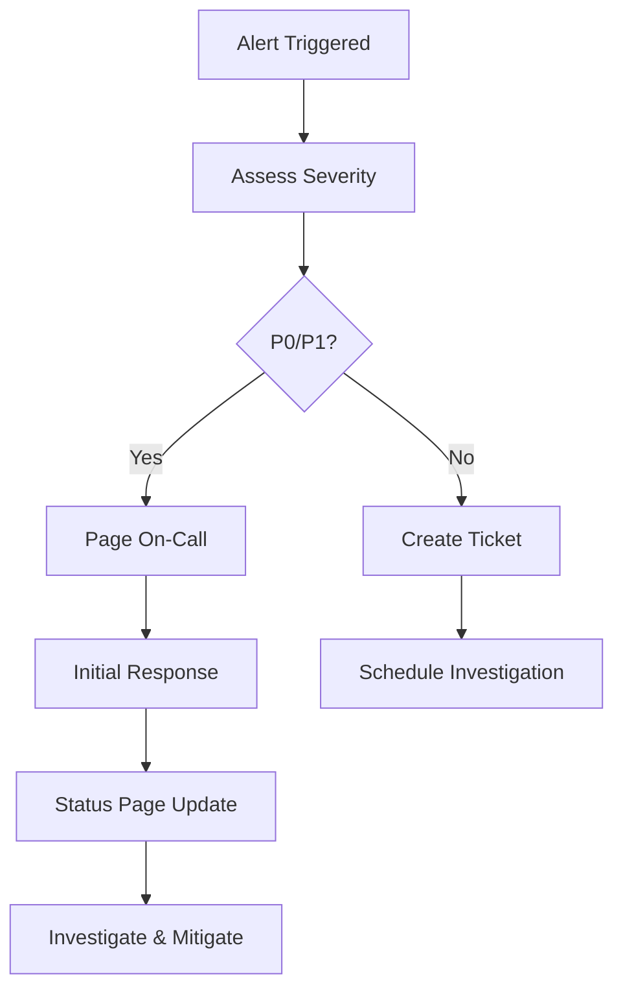

# Incident Response Runbook

## Overview

This runbook provides detailed procedures for responding to production incidents, managing outages, and coordinating recovery efforts for the Tolstoy platform.

## Incident Classification

### Severity Levels

<AccordionGroup>
  <Accordion title="P0 - Critical (Complete Outage)">
    **Definition:** Complete system failure affecting all users
    
    **Response Time:** 15 minutes
    
    **Examples:**
    - API gateway down
    - Database cluster failure
    - Authentication service unavailable
    - Major security breach
    
    **Escalation:** Immediate page to on-call engineer + engineering manager
  </Accordion>
  
  <Accordion title="P1 - High (Major Degradation)">
    **Definition:** Significant functionality impaired for majority of users
    
    **Response Time:** 30 minutes
    
    **Examples:**
    - Workflow execution failures > 50%
    - Performance degradation > 300% baseline
    - Third-party integration failures
    - Data corruption detected
    
    **Escalation:** Page to on-call engineer
  </Accordion>
  
  <Accordion title="P2 - Medium (Partial Degradation)">
    **Definition:** Some functionality impaired for subset of users
    
    **Response Time:** 2 hours
    
    **Examples:**
    - Single service degradation
    - Regional connectivity issues
    - Non-critical feature failures
    - Performance alerts
    
    **Escalation:** Alert to on-call engineer
  </Accordion>
  
  <Accordion title="P3 - Low (Monitoring Alert)">
    **Definition:** Potential issues detected, no user impact
    
    **Response Time:** Next business day
    
    **Examples:**
    - Resource utilization warnings
    - Non-critical errors increase
    - Monitoring system failures
    
    **Escalation:** Ticket creation
  </Accordion>
</AccordionGroup>

## Incident Response Workflow

### 1. Detection & Alert



### 2. Initial Response (First 5 Minutes)

**Immediate Actions:**
1. **Acknowledge Alert** - Stop alert escalation
2. **Assess Impact** - Check system status dashboard
3. **Update Status Page** - Communicate issue to users
4. **Gather Context** - Recent deployments, changes, alerts

**Status Page Communication Template:**
```
🔴 [INVESTIGATING] API Response Delays
We are currently investigating reports of increased API response times. 
We will provide updates as more information becomes available.
Posted at: [TIMESTAMP]
```

### 3. Investigation Phase

**Standard Diagnostic Steps:**

<Tabs>
  <Tab title="System Health">
    ```bash
    # Check overall system health
    kubectl get pods -A | grep -v Running
    kubectl top nodes
    kubectl top pods -A --sort-by=memory
    
    # Check service status
    curl -s https://api.tolstoy.dev/health | jq
    curl -s https://api.tolstoy.dev/health/database | jq
    curl -s https://api.tolstoy.dev/health/redis | jq
    ```
  </Tab>
  
  <Tab title="Application Metrics">
    ```bash
    # Check error rates (last 15 minutes)
    curl -G 'http://prometheus:9090/api/v1/query' \
      --data-urlencode 'query=rate(http_requests_total{status=~"5.."}[15m])'
    
    # Check response times
    curl -G 'http://prometheus:9090/api/v1/query' \
      --data-urlencode 'query=histogram_quantile(0.95, rate(http_request_duration_seconds_bucket[15m]))'
    
    # Check workflow execution failures
    curl -G 'http://prometheus:9090/api/v1/query' \
      --data-urlencode 'query=rate(workflow_executions_total{status="failed"}[15m])'
    ```
  </Tab>
  
  <Tab title="Infrastructure">
    ```bash
    # Check AWS resources
    aws cloudwatch get-metric-statistics \
      --namespace AWS/ApplicationELB \
      --metric-name TargetResponseTime \
      --dimensions Name=LoadBalancer,Value=tolstoy-prod-alb \
      --start-time 2024-01-01T00:00:00Z \
      --end-time 2024-01-01T01:00:00Z \
      --period 300 \
      --statistics Average
    
    # Check RDS performance
    aws rds describe-db-instances --db-instance-identifier tolstoy-prod-db
    
    # Check ElastiCache status
    aws elasticache describe-cache-clusters --cache-cluster-id tolstoy-prod-redis
    ```
  </Tab>
  
  <Tab title="Database Diagnostics">
    ```sql
    -- Check active connections
    SELECT count(*) FROM pg_stat_activity;
    
    -- Check long-running queries
    SELECT pid, now() - pg_stat_activity.query_start AS duration, query 
    FROM pg_stat_activity 
    WHERE (now() - pg_stat_activity.query_start) > interval '5 minutes'
    ORDER BY duration DESC;
    
    -- Check locks
    SELECT blocked_locks.pid AS blocked_pid,
           blocked_activity.usename AS blocked_user,
           blocking_locks.pid AS blocking_pid,
           blocking_activity.usename AS blocking_user,
           blocked_activity.query AS blocked_statement,
           blocking_activity.query AS current_statement_in_blocking_process
    FROM pg_catalog.pg_locks blocked_locks
    JOIN pg_catalog.pg_stat_activity blocked_activity ON blocked_activity.pid = blocked_locks.pid
    JOIN pg_catalog.pg_locks blocking_locks ON blocking_locks.locktype = blocked_locks.locktype
    AND blocking_locks.DATABASE IS NOT DISTINCT FROM blocked_locks.DATABASE
    AND blocking_locks.relation IS NOT DISTINCT FROM blocked_locks.relation
    JOIN pg_catalog.pg_stat_activity blocking_activity ON blocking_activity.pid = blocking_locks.pid
    WHERE NOT blocked_locks.GRANTED;
    ```
  </Tab>
</Tabs>

### 4. Common Incident Scenarios

<AccordionGroup>
  <Accordion title="API Gateway Issues">
    **Symptoms:** 
    - 502/503 errors
    - High response times
    - Connection timeouts
    
    **Diagnostic Steps:**
    ```bash
    # Check API Gateway health
    kubectl logs -f deployment/api-gateway -n tolstoy-prod
    kubectl describe pods -l app=api-gateway -n tolstoy-prod
    
    # Check upstream services
    kubectl get endpoints -n tolstoy-prod
    kubectl describe service core-api -n tolstoy-prod
    ```
    
    **Common Fixes:**
    - Restart API Gateway pods: `kubectl rollout restart deployment/api-gateway -n tolstoy-prod`
    - Scale up replicas: `kubectl scale deployment api-gateway --replicas=5 -n tolstoy-prod`
    - Check rate limiting configuration
    - Verify SSL certificate validity
    
    **Escalation:** If symptoms persist after service restart, escalate to infrastructure team
  </Accordion>
  
  <Accordion title="Database Performance Issues">
    **Symptoms:**
    - Query timeouts
    - Connection pool exhaustion
    - High CPU/Memory on database
    
    **Diagnostic Steps:**
    ```sql
    -- Find slow queries
    SELECT query, mean_time, calls, total_time 
    FROM pg_stat_statements 
    ORDER BY mean_time DESC LIMIT 10;
    
    -- Check connection usage
    SELECT state, count(*) 
    FROM pg_stat_activity 
    GROUP BY state;
    
    -- Check table sizes
    SELECT schemaname, tablename, 
           pg_size_pretty(size) as size,
           pg_size_pretty(total_size) as total_size
    FROM (
        SELECT schemaname, tablename,
               pg_relation_size(schemaname||'.'||tablename) as size,
               pg_total_relation_size(schemaname||'.'||tablename) as total_size
        FROM pg_tables
        WHERE schemaname NOT IN ('information_schema', 'pg_catalog')
    ) AS TABLES
    ORDER BY total_size DESC;
    ```
    
    **Common Fixes:**
    - Kill long-running queries: `SELECT pg_terminate_backend(pid) FROM pg_stat_activity WHERE ...`
    - Increase connection pool size temporarily
    - Add missing database indexes
    - Enable read replica routing for read queries
    - Restart application pods to reset connection pools
    
    **Escalation:** For persistent database issues, involve DBA and consider read-only mode
  </Accordion>
  
  <Accordion title="Workflow Execution Failures">
    **Symptoms:**
    - High failure rate in workflow executions
    - Queue backup
    - Timeout errors
    
    **Diagnostic Steps:**
    ```bash
    # Check queue depth
    redis-cli -h tolstoy-prod-redis llen workflow_queue
    
    # Check worker pod status
    kubectl get pods -l app=workflow-worker -n tolstoy-prod
    kubectl logs -f deployment/workflow-worker -n tolstoy-prod --tail=100
    
    # Check recent failed workflows
    curl -s "https://api.tolstoy.dev/admin/executions?status=failed&limit=10" | jq
    ```
    
    **Common Fixes:**
    - Scale up worker pods: `kubectl scale deployment workflow-worker --replicas=20 -n tolstoy-prod`
    - Clear stuck jobs from Redis queue
    - Restart workflow engine: `kubectl rollout restart deployment/workflow-engine -n tolstoy-prod`
    - Check third-party API limits and quotas
    - Verify network connectivity to external services
    
    **Escalation:** If failures are due to external service issues, contact vendor support
  </Accordion>
  
  <Accordion title="Authentication/Authorization Issues">
    **Symptoms:**
    - 401/403 errors
    - Login failures
    - JWT validation errors
    
    **Diagnostic Steps:**
    ```bash
    # Check auth service
    kubectl logs -f deployment/auth-service -n tolstoy-prod
    curl -s https://auth.tolstoy.dev/health | jq
    
    # Check Redis session store
    redis-cli -h auth-redis ping
    redis-cli -h auth-redis info memory
    
    # Test JWT validation
    curl -H "Authorization: Bearer <token>" https://api.tolstoy.dev/auth/validate
    ```
    
    **Common Fixes:**
    - Restart auth service: `kubectl rollout restart deployment/auth-service -n tolstoy-prod`
    - Clear Redis session cache if corrupted
    - Check JWT secret configuration
    - Verify OAuth provider connectivity
    - Check certificate expiration
    
    **Escalation:** For security-related issues, immediately involve security team
  </Accordion>
</AccordionGroup>

### 5. Mitigation Strategies

<Tabs>
  <Tab title="Traffic Management">
    ```bash
    # Enable maintenance mode (return 503 for new requests)
    kubectl patch configmap api-config -n tolstoy-prod --patch='{"data":{"maintenance_mode":"true"}}'
    
    # Implement circuit breaker for failing service
    kubectl patch configmap circuit-breaker-config -n tolstoy-prod --patch='{"data":{"external_api_enabled":"false"}}'
    
    # Route traffic to specific region/AZ
    kubectl patch service api-gateway -n tolstoy-prod --patch='{"spec":{"selector":{"region":"us-west-2a"}}}'
    
    # Emergency rate limiting
    kubectl patch configmap rate-limit-config -n tolstoy-prod --patch='{"data":{"requests_per_minute":"10"}}'
    ```
  </Tab>
  
  <Tab title="Resource Scaling">
    ```bash
    # Emergency scaling commands
    kubectl scale deployment api-gateway --replicas=10 -n tolstoy-prod
    kubectl scale deployment core-api --replicas=15 -n tolstoy-prod
    kubectl scale deployment workflow-worker --replicas=25 -n tolstoy-prod
    
    # Increase resource limits
    kubectl patch deployment api-gateway -n tolstoy-prod --patch='
    spec:
      template:
        spec:
          containers:
          - name: api-gateway
            resources:
              limits:
                memory: "2Gi"
                cpu: "1000m"
              requests:
                memory: "1Gi"
                cpu: "500m"'
    
    # Add more nodes to cluster (if needed)
    eksctl scale nodegroup --cluster=tolstoy-prod --nodes=10 --name=standard-workers
    ```
  </Tab>
  
  <Tab title="Data Recovery">
    ```bash
    # Database point-in-time recovery
    aws rds restore-db-instance-to-point-in-time \
      --source-db-instance-identifier tolstoy-prod-db \
      --target-db-instance-identifier tolstoy-recovery-$(date +%Y%m%d%H%M) \
      --restore-time 2024-01-01T12:00:00.000Z
    
    # Redis data recovery from backup
    aws elasticache create-cache-cluster \
      --cache-cluster-id tolstoy-recovery-redis \
      --snapshot-name tolstoy-prod-redis-backup-$(date +%Y%m%d)
    
    # S3 object recovery
    aws s3api list-object-versions \
      --bucket tolstoy-prod-data \
      --prefix workflows/ \
      --query 'Versions[?IsLatest==false]' \
      --output table
    ```
  </Tab>
  
  <Tab title="Communication">
    ```bash
    # Update status page via API
    curl -X PUT "https://api.statuspage.io/v1/pages/PAGE_ID/incidents/INCIDENT_ID" \
      -H "Authorization: OAuth TOKEN" \
      -H "Content-Type: application/json" \
      -d '{
        "incident": {
          "status": "investigating",
          "message": "We are continuing to investigate this issue and will provide updates as soon as more information is available."
        }
      }'
    
    # Send Slack notification
    curl -X POST https://hooks.slack.com/services/SLACK_WEBHOOK \
      -H 'Content-type: application/json' \
      -d '{
        "text": ":alert: P1 Incident Update",
        "blocks": [
          {
            "type": "section",
            "text": {
              "type": "mrkdwn",
              "text": "*Status:* Investigating\n*Impact:* API response times elevated\n*ETA:* 30 minutes"
            }
          }
        ]
      }'
    ```
  </Tab>
</Tabs>

## Post-Incident Procedures

### 1. Resolution Confirmation

**Checklist:**
- [ ] Primary symptoms resolved
- [ ] System metrics returned to normal
- [ ] User-facing functionality verified
- [ ] Monitoring alerts cleared
- [ ] Status page updated to "Resolved"

### 2. Post-Incident Review (PIR)

**Timeline:** Within 48 hours of resolution

**Required Attendees:**
- Incident Commander
- On-call engineer(s)
- Engineering Manager
- Product Owner (if user-facing impact)

**PIR Template:**
```markdown
# Post-Incident Review - [DATE]

## Incident Summary
**Duration:** [START TIME] - [END TIME] ([TOTAL DURATION])
**Severity:** P[X]
**Impact:** [DESCRIPTION OF USER IMPACT]

## Timeline
- **[TIME]** - Initial alert received
- **[TIME]** - Incident acknowledged
- **[TIME]** - Root cause identified
- **[TIME]** - Mitigation applied
- **[TIME]** - Issue resolved

## Root Cause
[DETAILED ANALYSIS OF WHAT CAUSED THE INCIDENT]

## What Went Well
- [POSITIVE ASPECTS OF RESPONSE]

## What Could Be Improved
- [AREAS FOR IMPROVEMENT]

## Action Items
1. [ACTION ITEM] - Owner: [PERSON] - Due: [DATE]
2. [ACTION ITEM] - Owner: [PERSON] - Due: [DATE]

## Preventive Measures
- [SPECIFIC STEPS TO PREVENT RECURRENCE]
```

### 3. Follow-up Actions

**Immediate (24 hours):**
- Update monitoring and alerting rules
- Implement temporary fixes/workarounds
- Document lessons learned

**Short-term (1 week):**
- Implement proper fixes
- Update runbooks and procedures
- Conduct team training if needed

**Long-term (1 month):**
- Address systemic issues
- Improve architecture/processes
- Review and update incident procedures

## Emergency Contacts

### Internal Escalation

| Role | Primary | Secondary | Phone | Slack |
|------|---------|-----------|-------|-------|
| On-Call Engineer | @jane.doe | @john.smith | +1-555-0101 | @jane.doe |
| Engineering Manager | @alice.johnson | @bob.wilson | +1-555-0102 | @alice.johnson |
| Infrastructure Lead | @charlie.brown | @diana.prince | +1-555-0103 | @charlie.brown |
| Security Lead | @eve.adams | @frank.castle | +1-555-0104 | @eve.adams |

### External Vendors

| Service | Contact | Phone | Support Portal |
|---------|---------|-------|----------------|
| AWS | Enterprise Support | +1-800-xxx-xxxx | console.aws.amazon.com/support |
| Datadog | Premium Support | +1-866-xxx-xxxx | app.datadoghq.com/help |
| PagerDuty | Support | support@pagerduty.com | support.pagerduty.com |

## Tools & Resources

### Essential URLs
- **Status Page:** https://status.tolstoy.dev
- **Grafana Dashboards:** https://grafana.tolstoy.dev/d/production
- **PagerDuty Console:** https://tolstoy.pagerduty.com
- **AWS Console:** https://console.aws.amazon.com
- **Kubernetes Dashboard:** https://k8s.tolstoy.dev

### Quick Access Commands
```bash
# SSH into bastion host
ssh -i ~/.ssh/tolstoy-prod.pem ec2-user@bastion.tolstoy.dev

# Connect to production cluster
aws eks update-kubeconfig --region us-west-2 --name tolstoy-prod

# Access production database (via bastion)
psql -h tolstoy-prod-db.cluster-xyz.us-west-2.rds.amazonaws.com -U tolstoy -d tolstoy_prod

# Connect to Redis
redis-cli -h tolstoy-prod-redis.abc123.cache.amazonaws.com
```

---

<Warning>
This runbook contains sensitive operational procedures. Ensure all team members are trained on these procedures and that the document is kept up to date with system changes.
</Warning>