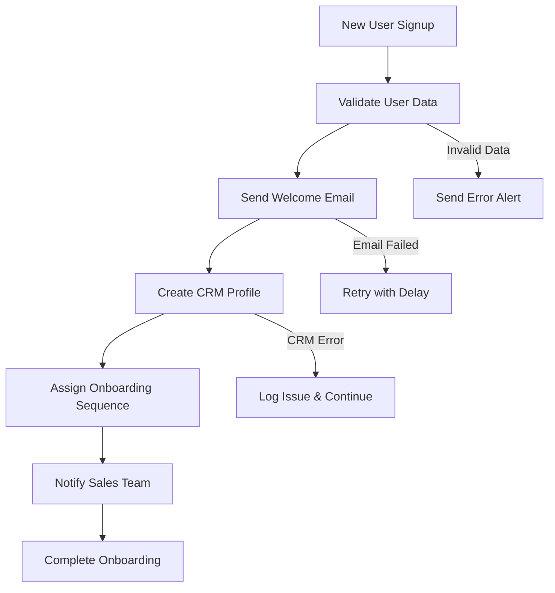

# Building Your First Workflow

Learn how to build sophisticated workflows by combining actions into powerful automation flows. This guide walks you through creating a complete customer onboarding workflow from scratch.

## What You'll Build

By the end of this guide, you'll have created a customer onboarding workflow that:

1. ✅ Triggers when a new user signs up
2. ✅ Sends a personalized welcome email
3. ✅ Creates a user profile in your CRM
4. ✅ Assigns the user to an onboarding sequence
5. ✅ Notifies your sales team
6. ✅ Handles errors gracefully with retries

## Prerequisites

- Tolstoy API key ([get one here](https://app.tolstoy.dev/settings/api-keys))
- Basic understanding of REST APIs
- Access to external services (email, CRM, Slack)

## Step 1: Plan Your Workflow

### **Workflow Design**

Before writing code, let's map out our workflow:



### **Required Actions**

We'll need these actions:

1. **Email Action** - Send welcome emails
2. **CRM Action** - Create customer profiles
3. **Slack Action** - Send team notifications
4. **Validation Action** - Validate user data

Let's start building!

## Step 2: Create the Email Action

<CodeGroup>

```javascript Create Email Action
const emailAction = {
  name: "send_welcome_email",
  display_name: "Send Welcome Email",
  description: "Send personalized welcome email to new customers",
  type: "http",
  configuration: {
    endpoint: {
      url: "https://api.sendgrid.com/v3/mail/send",
      method: "POST",
      headers: {
        "Authorization": "Bearer {{secrets.SENDGRID_API_KEY}}",
        "Content-Type": "application/json"
      }
    },
    inputs: [
      {
        name: "to_email",
        type: "string",
        required: true,
        description: "Recipient email address",
        validation: {
          format: "email"
        }
      },
      {
        name: "user_name",
        type: "string", 
        required: true,
        description: "User's first name for personalization"
      },
      {
        name: "plan_type",
        type: "string",
        required: false,
        default: "free",
        description: "User's subscription plan",
        validation: {
          enum: ["free", "starter", "professional", "enterprise"]
        }
      }
    ],
    outputs: [
      {
        name: "message_id",
        type: "string",
        description: "Email message ID from SendGrid"
      },
      {
        name: "status",
        type: "string", 
        description: "Email delivery status"
      }
    ],
    body_template: {
      personalizations: [
        {
          to: [{ email: "{{inputs.to_email}}", name: "{{inputs.user_name}}" }],
          subject: "Welcome to Acme Corp, {{inputs.user_name}}!"
        }
      ],
      from: { email: "welcome@acme.com", name: "Acme Team" },
      template_id: "d-welcome-template-123",
      dynamic_template_data: {
        user_name: "{{inputs.user_name}}",
        plan_type: "{{inputs.plan_type}}",
        dashboard_url: "https://app.acme.com/dashboard"
      }
    },
    timeout: 15000,
    retry_policy: {
      max_retries: 3,
      backoff_multiplier: 2,
      retryable_statuses: [500, 502, 503, 504, 429]
    }
  },
  tags: ["email", "onboarding", "customer"]
};

const response = await fetch('https://api.tolstoy.dev/actions', {
  method: 'POST',
  headers: {
    'Authorization': `Bearer ${apiKey}`,
    'Content-Type': 'application/json'
  },
  body: JSON.stringify(emailAction)
});

const emailActionData = await response.json();
console.log('✅ Email action created:', emailActionData.action.id);
```

```python Create Email Action - Python
email_action = {
    "name": "send_welcome_email",
    "display_name": "Send Welcome Email",
    "description": "Send personalized welcome email to new customers",
    "type": "http",
    "configuration": {
        "endpoint": {
            "url": "https://api.sendgrid.com/v3/mail/send",
            "method": "POST",
            "headers": {
                "Authorization": "Bearer {{secrets.SENDGRID_API_KEY}}",
                "Content-Type": "application/json"
            }
        },
        "inputs": [
            {
                "name": "to_email",
                "type": "string",
                "required": True,
                "description": "Recipient email address",
                "validation": {"format": "email"}
            },
            {
                "name": "user_name",
                "type": "string",
                "required": True,
                "description": "User's first name for personalization"
            },
            {
                "name": "plan_type",
                "type": "string",
                "required": False,
                "default": "free",
                "validation": {
                    "enum": ["free", "starter", "professional", "enterprise"]
                }
            }
        ],
        "body_template": {
            "personalizations": [{
                "to": [{"email": "{{inputs.to_email}}", "name": "{{inputs.user_name}}"}],
                "subject": "Welcome to Acme Corp, {{inputs.user_name}}!"
            }],
            "from": {"email": "welcome@acme.com", "name": "Acme Team"},
            "template_id": "d-welcome-template-123",
            "dynamic_template_data": {
                "user_name": "{{inputs.user_name}}",
                "plan_type": "{{inputs.plan_type}}"
            }
        },
        "timeout": 15000
    },
    "tags": ["email", "onboarding", "customer"]
}

response = requests.post(
    'https://api.tolstoy.dev/actions',
    headers={'Authorization': f'Bearer {api_key}'},
    json=email_action
)

email_action_data = response.json()
print(f"✅ Email action created: {email_action_data['action']['id']}")
```

</CodeGroup>

## Step 3: Create the CRM Action

<CodeGroup>

```javascript Create CRM Action
const crmAction = {
  name: "create_crm_profile",
  display_name: "Create CRM Profile", 
  description: "Create customer profile in HubSpot CRM",
  type: "http",
  configuration: {
    endpoint: {
      url: "https://api.hubapi.com/crm/v3/objects/contacts",
      method: "POST",
      headers: {
        "Authorization": "Bearer {{secrets.HUBSPOT_ACCESS_TOKEN}}",
        "Content-Type": "application/json"
      }
    },
    inputs: [
      {
        name: "email",
        type: "string",
        required: true,
        description: "Customer email address"
      },
      {
        name: "firstname",
        type: "string",
        required: true,
        description: "Customer first name"
      },
      {
        name: "lastname", 
        type: "string",
        required: false,
        description: "Customer last name"
      },
      {
        name: "company",
        type: "string",
        required: false,
        description: "Customer company name"
      },
      {
        name: "plan_type",
        type: "string",
        required: true,
        description: "Subscription plan"
      },
      {
        name: "signup_source",
        type: "string",
        required: false,
        description: "Where user signed up from"
      }
    ],
    outputs: [
      {
        name: "contact_id",
        type: "string",
        description: "HubSpot contact ID"
      },
      {
        name: "contact_url",
        type: "string",
        description: "Link to contact in HubSpot"
      }
    ],
    body_template: {
      properties: {
        email: "{{inputs.email}}",
        firstname: "{{inputs.firstname}}",
        lastname: "{{inputs.lastname}}",
        company: "{{inputs.company}}",
        subscription_plan: "{{inputs.plan_type}}",
        lifecycle_stage: "customer",
        lead_source: "{{inputs.signup_source}}",
        created_via: "tolstoy_api"
      }
    },
    timeout: 20000,
    retry_policy: {
      max_retries: 2,
      backoff_multiplier: 1.5
    }
  },
  tags: ["crm", "hubspot", "customer"]
};

const crmResponse = await fetch('https://api.tolstoy.dev/actions', {
  method: 'POST',
  headers: {
    'Authorization': `Bearer ${apiKey}`,
    'Content-Type': 'application/json'
  },
  body: JSON.stringify(crmAction)
});

const crmActionData = await crmResponse.json();
console.log('✅ CRM action created:', crmActionData.action.id);
```

</CodeGroup>

## Step 4: Create the Slack Notification Action

<CodeGroup>

```javascript Create Slack Action
const slackAction = {
  name: "notify_sales_team",
  display_name: "Notify Sales Team",
  description: "Send new customer notification to sales team in Slack",
  type: "http",
  configuration: {
    endpoint: {
      url: "{{secrets.SLACK_WEBHOOK_URL}}",
      method: "POST",
      headers: {
        "Content-Type": "application/json"
      }
    },
    inputs: [
      {
        name: "customer_email",
        type: "string", 
        required: true,
        description: "New customer email"
      },
      {
        name: "customer_name",
        type: "string",
        required: true,
        description: "Customer name"
      },
      {
        name: "plan_type",
        type: "string",
        required: true,
        description: "Selected plan"
      },
      {
        name: "signup_source",
        type: "string",
        required: false,
        description: "Signup source"
      },
      {
        name: "crm_profile_url",
        type: "string",
        required: false,
        description: "Link to CRM profile"
      }
    ],
    outputs: [
      {
        name: "message_ts",
        type: "string",
        description: "Slack message timestamp"
      },
      {
        name: "channel",
        type: "string",
        description: "Channel where message was sent"
      }
    ],
    body_template: {
      channel: "#sales",
      username: "Tolstoy Bot",
      icon_emoji: ":rocket:",
      text: "🎉 New customer signed up!",
      blocks: [
        {
          type: "section",
          text: {
            type: "mrkdwn",
            text: "*New Customer Alert* 🎉\n\n*Name:* {{inputs.customer_name}}\n*Email:* {{inputs.customer_email}}\n*Plan:* {{inputs.plan_type}}\n*Source:* {{inputs.signup_source}}"
          }
        },
        {
          type: "actions",
          elements: [
            {
              type: "button",
              text: { type: "plain_text", text: "View in CRM" },
              url: "{{inputs.crm_profile_url}}",
              style: "primary"
            },
            {
              type: "button", 
              text: { type: "plain_text", text: "Send Follow-up" },
              value: "followup_{{inputs.customer_email}}"
            }
          ]
        }
      ]
    },
    timeout: 10000
  },
  tags: ["slack", "notification", "sales"]
};

const slackResponse = await fetch('https://api.tolstoy.dev/actions', {
  method: 'POST',
  headers: {
    'Authorization': `Bearer ${apiKey}`,
    'Content-Type': 'application/json'
  },
  body: JSON.stringify(slackAction)
});

const slackActionData = await slackResponse.json();
console.log('✅ Slack action created:', slackActionData.action.id);
```

</CodeGroup>

## Step 5: Create the Complete Workflow

Now let's combine our actions into a complete workflow:

<CodeGroup>

```javascript Create Customer Onboarding Flow
const customerOnboardingFlow = {
  name: "customer_onboarding_flow",
  display_name: "Customer Onboarding Workflow",
  description: "Complete automated customer onboarding process",
  trigger: {
    type: "webhook",
    config: {
      endpoint: "/customer-signup",
      method: "POST",
      authentication: {
        type: "signature",
        algorithm: "sha256",
        secret_name: "WEBHOOK_SECRET"
      }
    }
  },
  variables: {
    customer_email: {
      type: "string",
      required: true,
      description: "Customer email from signup form"
    },
    customer_name: {
      type: "string", 
      required: true,
      description: "Customer full name"
    },
    first_name: {
      type: "string",
      required: true,
      description: "Customer first name"
    },
    last_name: {
      type: "string",
      required: false,
      description: "Customer last name"
    },
    company: {
      type: "string",
      required: false,
      description: "Customer company"
    },
    plan_type: {
      type: "string",
      required: true,
      default: "free",
      validation: {
        enum: ["free", "starter", "professional", "enterprise"]
      }
    },
    signup_source: {
      type: "string",
      required: false,
      description: "Where customer signed up from"
    }
  },
  steps: [
    {
      id: "validate_data",
      name: "validate_customer_data", 
      type: "condition",
      condition: {
        expression: "{{variables.customer_email}} != '' AND {{variables.customer_name}} != ''",
        on_true: "send_welcome_email",
        on_false: "send_error_alert"
      }
    },
    {
      id: "send_welcome_email",
      name: "send_welcome_email",
      action_id: emailActionData.action.id,
      type: "action",
      input_mapping: {
        to_email: "{{variables.customer_email}}",
        user_name: "{{variables.first_name}}",
        plan_type: "{{variables.plan_type}}"
      },
      on_success: "create_crm_profile",
      on_failure: "retry_email",
      retry_policy: {
        max_retries: 2,
        backoff_multiplier: 2
      }
    },
    {
      id: "retry_email",
      name: "retry_welcome_email",
      type: "delay",
      delay_seconds: 300,
      next_step: "send_welcome_email_retry"
    },
    {
      id: "send_welcome_email_retry",
      name: "send_welcome_email",
      action_id: emailActionData.action.id,
      type: "action",
      input_mapping: {
        to_email: "{{variables.customer_email}}",
        user_name: "{{variables.first_name}}",
        plan_type: "{{variables.plan_type}}"
      },
      on_success: "create_crm_profile",
      on_failure: "log_email_failure"
    },
    {
      id: "create_crm_profile",
      name: "create_crm_profile",
      action_id: crmActionData.action.id,
      type: "action",
      input_mapping: {
        email: "{{variables.customer_email}}",
        firstname: "{{variables.first_name}}",
        lastname: "{{variables.last_name}}",
        company: "{{variables.company}}",
        plan_type: "{{variables.plan_type}}",
        signup_source: "{{variables.signup_source}}"
      },
      on_success: "notify_sales_team",
      on_failure: "log_crm_failure"
    },
    {
      id: "notify_sales_team",
      name: "notify_sales_team",
      action_id: slackActionData.action.id,
      type: "action",
      input_mapping: {
        customer_email: "{{variables.customer_email}}",
        customer_name: "{{variables.customer_name}}",
        plan_type: "{{variables.plan_type}}",
        signup_source: "{{variables.signup_source}}",
        crm_profile_url: "{{steps.create_crm_profile.outputs.contact_url}}"
      },
      on_success: "complete_onboarding",
      on_failure: "log_notification_failure"
    },
    {
      id: "complete_onboarding",
      name: "complete_onboarding",
      type: "output",
      outputs: {
        onboarding_status: "completed",
        customer_id: "{{steps.create_crm_profile.outputs.contact_id}}",
        welcome_email_sent: "{{steps.send_welcome_email.outputs.status}}",
        sales_notified: "{{steps.notify_sales_team.success}}",
        completion_time: "{{execution.completed_at}}"
      }
    },
    {
      id: "send_error_alert",
      name: "send_validation_error",
      type: "action",
      action_id: slackActionData.action.id,
      input_mapping: {
        channel: "#alerts",
        message: "❌ Customer onboarding failed: Invalid data received"
      }
    }
  ],
  error_handling: {
    global_timeout: 300000, // 5 minutes
    on_timeout: "send_timeout_alert",
    on_failure: "send_failure_alert"
  },
  tags: ["onboarding", "automation", "customer"]
};

const flowResponse = await fetch('https://api.tolstoy.dev/flows', {
  method: 'POST',
  headers: {
    'Authorization': `Bearer ${apiKey}`,
    'Content-Type': 'application/json'
  },
  body: JSON.stringify(customerOnboardingFlow)
});

const flowData = await flowResponse.json();
console.log('✅ Customer onboarding flow created:', flowData.flow.id);
console.log('🔗 Webhook URL:', flowData.flow.trigger.webhook_url);
```

</CodeGroup>

## Step 6: Test Your Workflow

### **Manual Testing**

<CodeGroup>

```javascript Test Flow Execution
// Test the flow with sample data
const testExecution = {
  inputs: {
    customer_email: "test.user@example.com",
    customer_name: "Test User",
    first_name: "Test",
    last_name: "User",
    company: "Example Corp",
    plan_type: "professional",
    signup_source: "website"
  }
};

const executionResponse = await fetch(
  `https://api.tolstoy.dev/flows/${flowData.flow.id}/execute`,
  {
    method: 'POST',
    headers: {
      'Authorization': `Bearer ${apiKey}`,
      'Content-Type': 'application/json'
    },
    body: JSON.stringify(testExecution)
  }
);

const execution = await executionResponse.json();
console.log('🧪 Test execution started:', execution.execution.id);

// Monitor execution status
async function monitorExecution(executionId) {
  while (true) {
    const statusResponse = await fetch(
      `https://api.tolstoy.dev/executions/${executionId}`,
      {
        headers: {
          'Authorization': `Bearer ${apiKey}`
        }
      }
    );
    
    const status = await statusResponse.json();
    const exec = status.execution;
    
    console.log(`Status: ${exec.status} (${exec.duration_ms || 0}ms)`);
    
    if (exec.status === 'success') {
      console.log('✅ Flow completed successfully!');
      console.log('Outputs:', exec.outputs);
      break;
    } else if (exec.status === 'failed') {
      console.error('❌ Flow execution failed');
      console.error('Error:', exec.error);
      break;
    } else if (exec.status === 'timeout') {
      console.error('⏰ Flow execution timed out');
      break;
    }
    
    // Wait 2 seconds before checking again
    await new Promise(resolve => setTimeout(resolve, 2000));
  }
}

await monitorExecution(execution.execution.id);
```

</CodeGroup>

### **Webhook Testing**

<CodeGroup>

```javascript Test Webhook Trigger
// Simulate webhook payload
const webhookPayload = {
  customer_email: "jane.doe@example.com",
  customer_name: "Jane Doe",
  first_name: "Jane", 
  last_name: "Doe",
  company: "Doe Enterprises",
  plan_type: "professional",
  signup_source: "pricing_page",
  signup_timestamp: new Date().toISOString()
};

// Generate webhook signature
const crypto = require('crypto');
const payload = JSON.stringify(webhookPayload);
const signature = 'sha256=' + crypto
  .createHmac('sha256', process.env.WEBHOOK_SECRET)
  .update(payload, 'utf8')
  .digest('hex');

// Send webhook to trigger flow
const webhookResponse = await fetch(flowData.flow.trigger.webhook_url, {
  method: 'POST',
  headers: {
    'Content-Type': 'application/json',
    'X-Tolstoy-Signature': signature
  },
  body: payload
});

if (webhookResponse.ok) {
  const result = await webhookResponse.json();
  console.log('✅ Webhook triggered successfully');
  console.log('Execution ID:', result.execution.id);
} else {
  console.error('❌ Webhook trigger failed:', webhookResponse.status);
}
```

</CodeGroup>

## Step 7: Add Error Handling and Monitoring

### **Enhanced Error Handling**

<CodeGroup>

```javascript Add Error Handling Steps
// Add error handling actions to your flow
const errorHandlingSteps = [
  {
    id: "log_email_failure",
    name: "log_email_failure",
    type: "action",
    action_id: "action_logging_service", // Assume you have a logging action
    input_mapping: {
      level: "error",
      message: "Welcome email failed for {{variables.customer_email}}",
      context: {
        customer: "{{variables.customer_email}}",
        plan: "{{variables.plan_type}}",
        error: "{{steps.send_welcome_email.error}}"
      }
    },
    on_success: "create_crm_profile" // Continue flow even if email fails
  },
  {
    id: "log_crm_failure", 
    name: "log_crm_failure",
    type: "action",
    action_id: "action_logging_service",
    input_mapping: {
      level: "warning",
      message: "CRM profile creation failed for {{variables.customer_email}}",
      context: {
        customer: "{{variables.customer_email}}",
        error: "{{steps.create_crm_profile.error}}"
      }
    },
    on_success: "notify_sales_team" // Continue to notification
  },
  {
    id: "send_timeout_alert",
    name: "send_timeout_alert", 
    type: "action",
    action_id: slackActionData.action.id,
    input_mapping: {
      channel: "#alerts",
      message: "⏰ Customer onboarding flow timed out for {{variables.customer_email}}"
    }
  },
  {
    id: "send_failure_alert",
    name: "send_failure_alert",
    type: "action", 
    action_id: slackActionData.action.id,
    input_mapping: {
      channel: "#alerts",
      message: "💥 Customer onboarding flow failed for {{variables.customer_email}}: {{execution.error.message}}"
    }
  }
];

// Update flow with error handling
const updatedFlow = {
  steps: [...customerOnboardingFlow.steps, ...errorHandlingSteps]
};

const updateResponse = await fetch(
  `https://api.tolstoy.dev/flows/${flowData.flow.id}`,
  {
    method: 'PATCH',
    headers: {
      'Authorization': `Bearer ${apiKey}`,
      'Content-Type': 'application/json'
    },
    body: JSON.stringify(updatedFlow)
  }
);

console.log('✅ Added error handling to flow');
```

</CodeGroup>

### **Monitoring Setup**

<CodeGroup>

```javascript Setup Flow Monitoring
class FlowMonitor {
  constructor(apiKey, flowId) {
    this.apiKey = apiKey;
    this.flowId = flowId;
    this.metrics = {
      executions: 0,
      successes: 0,
      failures: 0,
      avgDuration: 0,
      errors: []
    };
  }
  
  async startMonitoring() {
    console.log('📊 Starting flow monitoring...');
    
    // Set up webhook to receive execution events
    const webhookConfig = {
      url: "https://your-app.com/webhooks/monitoring",
      events: [
        "execution.started",
        "execution.completed", 
        "execution.failed",
        "execution.timeout"
      ],
      filters: {
        flow_ids: [this.flowId]
      }
    };
    
    const webhookResponse = await fetch('https://api.tolstoy.dev/webhooks', {
      method: 'POST',
      headers: {
        'Authorization': `Bearer ${this.apiKey}`,
        'Content-Type': 'application/json'
      },
      body: JSON.stringify(webhookConfig)
    });
    
    const webhook = await webhookResponse.json();
    console.log('✅ Monitoring webhook created:', webhook.webhook.id);
    
    return webhook.webhook;
  }
  
  processExecutionEvent(event) {
    const execution = event.data.object;
    
    switch (event.event.type) {
      case 'execution.started':
        this.metrics.executions++;
        console.log(`🚀 Execution started: ${execution.id}`);
        break;
        
      case 'execution.completed':
        this.metrics.successes++;
        this.updateAvgDuration(execution.duration_ms);
        console.log(`✅ Execution completed: ${execution.id} (${execution.duration_ms}ms)`);
        break;
        
      case 'execution.failed':
        this.metrics.failures++;
        this.metrics.errors.push({
          executionId: execution.id,
          error: execution.error,
          timestamp: event.event.created_at
        });
        console.log(`❌ Execution failed: ${execution.id} - ${execution.error.message}`);
        break;
        
      case 'execution.timeout':
        this.metrics.failures++;
        console.log(`⏰ Execution timed out: ${execution.id}`);
        break;
    }
    
    this.logMetrics();
  }
  
  updateAvgDuration(duration) {
    const totalExecutions = this.metrics.successes;
    this.metrics.avgDuration = (
      (this.metrics.avgDuration * (totalExecutions - 1) + duration) / totalExecutions
    );
  }
  
  logMetrics() {
    const successRate = this.metrics.executions > 0 
      ? (this.metrics.successes / this.metrics.executions * 100).toFixed(1)
      : 0;
    
    console.log(`📈 Metrics - Executions: ${this.metrics.executions}, Success Rate: ${successRate}%, Avg Duration: ${Math.round(this.metrics.avgDuration)}ms`);
  }
  
  getDetailedReport() {
    return {
      flowId: this.flowId,
      metrics: this.metrics,
      successRate: this.metrics.executions > 0 ? this.metrics.successes / this.metrics.executions : 0,
      failureRate: this.metrics.executions > 0 ? this.metrics.failures / this.metrics.executions : 0,
      recentErrors: this.metrics.errors.slice(-10)
    };
  }
}

// Set up monitoring
const monitor = new FlowMonitor(apiKey, flowData.flow.id);
const monitoringWebhook = await monitor.startMonitoring();

// Handle monitoring webhooks
app.post('/webhooks/monitoring', (req, res) => {
  monitor.processExecutionEvent(req.body);
  res.json({ received: true });
});
```

</CodeGroup>

## Step 8: Production Deployment

### **Environment Configuration**

<CodeGroup>

```javascript Production Deployment
// Production configuration
const productionConfig = {
  flow: {
    ...customerOnboardingFlow,
    name: "prod_customer_onboarding",
    display_name: "Production Customer Onboarding",
    error_handling: {
      global_timeout: 600000, // 10 minutes for production
      on_timeout: "escalate_to_ops_team",
      on_failure: "create_support_ticket"
    },
    monitoring: {
      alerts: {
        failure_rate_threshold: 0.05, // Alert if >5% failure rate
        avg_duration_threshold: 30000, // Alert if avg >30 seconds
        consecutive_failures: 3 // Alert after 3 consecutive failures
      },
      metrics: {
        track_performance: true,
        track_costs: true,
        detailed_logging: true
      }
    }
  },
  secrets: {
    SENDGRID_API_KEY: process.env.PROD_SENDGRID_API_KEY,
    HUBSPOT_ACCESS_TOKEN: process.env.PROD_HUBSPOT_TOKEN,
    SLACK_WEBHOOK_URL: process.env.PROD_SLACK_WEBHOOK,
    WEBHOOK_SECRET: process.env.PROD_WEBHOOK_SECRET
  }
};

// Deploy to production
const prodResponse = await fetch('https://api.tolstoy.dev/flows', {
  method: 'POST',
  headers: {
    'Authorization': `Bearer ${prodApiKey}`, // Use production API key
    'Content-Type': 'application/json'
  },
  body: JSON.stringify(productionConfig.flow)
});

const prodFlow = await prodResponse.json();
console.log('🚀 Production flow deployed:', prodFlow.flow.id);
console.log('🔗 Production webhook URL:', prodFlow.flow.trigger.webhook_url);

// Configure secrets
for (const [secretName, secretValue] of Object.entries(productionConfig.secrets)) {
  await fetch('https://api.tolstoy.dev/secrets', {
    method: 'POST',
    headers: {
      'Authorization': `Bearer ${prodApiKey}`,
      'Content-Type': 'application/json'
    },
    body: JSON.stringify({
      name: secretName,
      value: secretValue,
      description: `Production secret for ${secretName}`
    })
  });
}

console.log('🔐 Production secrets configured');
```

</CodeGroup>

### **Health Checks**

<CodeGroup>

```javascript Production Health Checks
class ProductionHealthChecker {
  constructor(apiKey, flowId) {
    this.apiKey = apiKey;
    this.flowId = flowId;
  }
  
  async runHealthChecks() {
    console.log('🏥 Running production health checks...');
    
    const checks = [
      this.checkFlowHealth(),
      this.checkActionHealth(),
      this.checkWebhookConnectivity(),
      this.checkExternalDependencies(),
      this.checkRateLimits()
    ];
    
    const results = await Promise.allSettled(checks);
    
    const report = {
      overall: 'healthy',
      checks: results.map((result, index) => ({
        name: ['flow', 'actions', 'webhook', 'dependencies', 'rate_limits'][index],
        status: result.status === 'fulfilled' ? 'pass' : 'fail',
        details: result.value || result.reason?.message
      }))
    };
    
    const failedChecks = report.checks.filter(c => c.status === 'fail');
    if (failedChecks.length > 0) {
      report.overall = 'unhealthy';
      console.error('❌ Health check failures:', failedChecks);
    } else {
      console.log('✅ All health checks passed');
    }
    
    return report;
  }
  
  async checkFlowHealth() {
    const response = await fetch(`https://api.tolstoy.dev/flows/${this.flowId}`, {
      headers: { 'Authorization': `Bearer ${this.apiKey}` }
    });
    
    if (!response.ok) {
      throw new Error(`Flow not accessible: ${response.status}`);
    }
    
    const flow = await response.json();
    
    if (flow.flow.status !== 'active') {
      throw new Error(`Flow status is ${flow.flow.status}, expected active`);
    }
    
    return 'Flow is active and accessible';
  }
  
  async checkActionHealth() {
    // Get flow details to check all actions
    const flowResponse = await fetch(`https://api.tolstoy.dev/flows/${this.flowId}`, {
      headers: { 'Authorization': `Bearer ${this.apiKey}` }
    });
    
    const flow = await flowResponse.json();
    const actionIds = flow.flow.steps
      .filter(step => step.type === 'action')
      .map(step => step.action_id);
    
    for (const actionId of actionIds) {
      const actionResponse = await fetch(`https://api.tolstoy.dev/actions/${actionId}`, {
        headers: { 'Authorization': `Bearer ${this.apiKey}` }
      });
      
      if (!actionResponse.ok) {
        throw new Error(`Action ${actionId} not accessible`);
      }
      
      const action = await actionResponse.json();
      if (action.action.status !== 'active') {
        throw new Error(`Action ${actionId} status is ${action.action.status}`);
      }
    }
    
    return `All ${actionIds.length} actions are healthy`;
  }
  
  async checkWebhookConnectivity() {
    // Test webhook endpoint connectivity
    const testPayload = {
      test: true,
      timestamp: new Date().toISOString()
    };
    
    const response = await fetch(flowData.flow.trigger.webhook_url, {
      method: 'POST',
      headers: {
        'Content-Type': 'application/json',
        'X-Tolstoy-Test': 'health-check'
      },
      body: JSON.stringify(testPayload)
    });
    
    if (!response.ok) {
      throw new Error(`Webhook endpoint returned ${response.status}`);
    }
    
    return 'Webhook endpoint is accessible';
  }
  
  async checkExternalDependencies() {
    const dependencies = [
      { name: 'SendGrid', url: 'https://api.sendgrid.com/v3' },
      { name: 'HubSpot', url: 'https://api.hubapi.com' },
      { name: 'Slack', url: 'https://slack.com/api' }
    ];
    
    for (const dep of dependencies) {
      try {
        const response = await fetch(dep.url, { 
          method: 'HEAD',
          timeout: 10000
        });
        
        if (!response.ok) {
          throw new Error(`${dep.name} returned ${response.status}`);
        }
      } catch (error) {
        throw new Error(`${dep.name} dependency check failed: ${error.message}`);
      }
    }
    
    return 'All external dependencies are accessible';
  }
  
  async checkRateLimits() {
    const response = await fetch('https://api.tolstoy.dev/account/rate-limits', {
      headers: { 'Authorization': `Bearer ${this.apiKey}` }
    });
    
    const limits = await response.json();
    
    // Check if we're approaching limits
    const apiUsage = limits.api_requests.current / limits.api_requests.limit;
    const execUsage = limits.executions.current / limits.executions.limit;
    
    if (apiUsage > 0.8 || execUsage > 0.8) {
      throw new Error(`Rate limit usage high: API ${(apiUsage*100).toFixed(1)}%, Exec ${(execUsage*100).toFixed(1)}%`);
    }
    
    return `Rate limits healthy: API ${(apiUsage*100).toFixed(1)}%, Exec ${(execUsage*100).toFixed(1)}%`;
  }
}

// Run health checks
const healthChecker = new ProductionHealthChecker(prodApiKey, prodFlow.flow.id);
const healthReport = await healthChecker.runHealthChecks();

console.log('🏥 Health Report:', healthReport);
```

</CodeGroup>

## Advanced Workflow Patterns

### **Conditional Logic**

<CodeGroup>

```javascript Advanced Conditional Flow
const advancedFlow = {
  name: "smart_customer_onboarding",
  display_name: "Smart Customer Onboarding",
  description: "Intelligent onboarding with personalized paths",
  steps: [
    {
      id: "analyze_customer",
      name: "analyze_customer_data",
      type: "condition",
      conditions: [
        {
          expression: "{{variables.plan_type}} == 'enterprise'",
          next_step: "enterprise_onboarding"
        },
        {
          expression: "{{variables.company}} != '' AND {{variables.plan_type}} == 'professional'",
          next_step: "business_onboarding"
        },
        {
          expression: "{{variables.plan_type}} in ['free', 'starter']",
          next_step: "standard_onboarding"
        }
      ],
      default_step: "standard_onboarding"
    },
    {
      id: "enterprise_onboarding",
      name: "enterprise_onboarding_sequence",
      type: "parallel", // Run steps in parallel
      steps: [
        {
          id: "assign_account_manager",
          action_id: "action_assign_am",
          input_mapping: {
            customer_email: "{{variables.customer_email}}",
            plan_type: "{{variables.plan_type}}"
          }
        },
        {
          id: "schedule_onboarding_call",
          action_id: "action_schedule_call",
          input_mapping: {
            customer_email: "{{variables.customer_email}}",
            customer_name: "{{variables.customer_name}}"
          }
        },
        {
          id: "send_enterprise_welcome",
          action_id: "action_enterprise_email",
          input_mapping: {
            to_email: "{{variables.customer_email}}",
            user_name: "{{variables.first_name}}"
          }
        }
      ],
      next_step: "complete_onboarding"
    },
    {
      id: "business_onboarding",
      name: "business_onboarding_sequence",
      type: "sequential",
      steps: [
        {
          id: "send_business_welcome",
          action_id: emailActionData.action.id,
          input_mapping: {
            to_email: "{{variables.customer_email}}",
            template: "business_welcome"
          }
        },
        {
          id: "create_team_workspace",
          action_id: "action_create_workspace",
          input_mapping: {
            company: "{{variables.company}}",
            admin_email: "{{variables.customer_email}}"
          }
        }
      ],
      next_step: "complete_onboarding"
    },
    {
      id: "standard_onboarding",
      name: "standard_onboarding_sequence",
      type: "sequential",
      steps: [
        {
          id: "send_standard_welcome",
          action_id: emailActionData.action.id
        },
        {
          id: "add_to_newsletter",
          action_id: "action_newsletter_signup"
        }
      ],
      next_step: "complete_onboarding"
    }
  ]
};
```

</CodeGroup>

### **Error Recovery Patterns**

<CodeGroup>

```javascript Error Recovery Strategies
const robustFlow = {
  name: "robust_customer_onboarding",
  error_handling: {
    strategies: [
      {
        error_types: ["EXTERNAL_SERVICE_ERROR", "TIMEOUT"],
        strategy: "retry_with_backoff",
        max_retries: 3,
        backoff_multiplier: 2
      },
      {
        error_types: ["VALIDATION_FAILED"],
        strategy: "skip_and_log",
        continue_execution: true
      },
      {
        error_types: ["RATE_LIMIT_EXCEEDED"],
        strategy: "delay_and_retry",
        delay_seconds: 60
      }
    ],
    fallback_actions: [
      {
        condition: "step_failures > 2",
        action: "escalate_to_human"
      },
      {
        condition: "execution_time > 300000", // 5 minutes
        action: "switch_to_async_mode"
      }
    ]
  },
  steps: [
    {
      id: "send_welcome_email",
      name: "send_welcome_email",
      action_id: emailActionData.action.id,
      error_handling: {
        on_failure: [
          {
            condition: "error.code == 'RATE_LIMIT_EXCEEDED'",
            action: "delay_and_retry",
            delay_seconds: "{{error.retry_after_seconds}}"
          },
          {
            condition: "error.code == 'INVALID_EMAIL'",
            action: "log_and_skip",
            log_level: "warning"
          },
          {
            condition: "error.code == 'EXTERNAL_SERVICE_ERROR'",
            action: "try_backup_email_service"
          }
        ],
        default_action: "log_and_continue"
      }
    }
  ]
};
```

</CodeGroup>

## Workflow Optimization

### **Performance Optimization**

<CodeGroup>

```javascript Optimized Workflow
const optimizedFlow = {
  name: "optimized_customer_onboarding",
  performance: {
    execution_mode: "optimized", // Enable performance optimizations
    parallel_execution: true,    // Allow parallel step execution where possible
    caching: {
      enabled: true,
      ttl_seconds: 3600,
      cache_keys: ["user_data", "plan_features"]
    },
    resource_limits: {
      max_memory_mb: 512,
      max_cpu_time_ms: 30000
    }
  },
  steps: [
    {
      id: "parallel_setup",
      type: "parallel",
      description: "Run independent setup tasks in parallel",
      steps: [
        {
          id: "send_welcome_email",
          action_id: emailActionData.action.id,
          priority: "high" // High priority for user-facing action
        },
        {
          id: "create_crm_profile", 
          action_id: crmActionData.action.id,
          priority: "medium"
        },
        {
          id: "setup_analytics_tracking",
          action_id: "action_analytics_setup",
          priority: "low" // Low priority for internal tracking
        }
      ],
      wait_for: "any", // Continue when any step completes
      continue_on_failure: true // Don't block if non-critical steps fail
    },
    {
      id: "conditional_notifications",
      type: "condition",
      condition: {
        expression: "{{steps.parallel_setup.send_welcome_email.success}} == true",
        on_true: "notify_sales_immediate",
        on_false: "schedule_follow_up"
      }
    }
  ]
};
```

</CodeGroup>

## API Playground

Test workflow creation:

<ApiPlayground
  method="POST"
  endpoint="/flows"
  baseUrl="https://api.tolstoy.dev"
  auth={{
    type: "bearer",
    placeholder: "Your API Key"
  }}
  body={{
    type: "json",
    schema: {
      name: {
        type: "string",
        placeholder: "my_first_workflow",
        description: "Unique workflow identifier",
        required: true
      },
      display_name: {
        type: "string", 
        placeholder: "My First Workflow",
        description: "Human-readable workflow name",
        required: true
      },
      description: {
        type: "string",
        placeholder: "A simple workflow to get started",
        description: "Workflow description"
      },
      trigger: {
        type: "object",
        defaultValue: {
          type: "manual"
        },
        description: "How the workflow is triggered",
        required: true
      },
      steps: {
        type: "array",
        defaultValue: [
          {
            id: "step_1",
            name: "first_step",
            type: "action",
            action_id: "action_123456789"
          }
        ],
        description: "Workflow steps",
        required: true
      },
      variables: {
        type: "object",
        defaultValue: {
          user_input: {
            type: "string",
            required: true,
            description: "User input variable"
          }
        },
        description: "Flow variables"
      }
    }
  }}
  sampleResponse={{
    "flow": {
      "id": "flow_new123456",
      "name": "my_first_workflow",
      "display_name": "My First Workflow",
      "status": "active",
      "trigger": {
        "type": "manual"
      },
      "steps": [
        {
          "id": "step_1",
          "name": "first_step",
          "type": "action"
        }
      ],
      "created_at": "2024-01-15T10:30:00Z"
    }
  }}
/>

## Next Steps

### **Workflow Enhancements**

<CardGroup cols={2}>
  <Card title="Advanced Patterns" icon="diagram-project" href="/api/guides/advanced-workflows">
    Loops, conditions, and parallel execution
  </Card>
  <Card title="Error Handling" icon="shield" href="/api/guides/error-handling">
    Robust error handling strategies
  </Card>
  <Card title="Performance Optimization" icon="gauge" href="/api/guides/performance">
    Optimize workflow execution speed
  </Card>
  <Card title="Monitoring & Analytics" icon="chart-line" href="/api/guides/monitoring">
    Monitor workflow performance
  </Card>
</CardGroup>

### **Integration Guides**

<CardGroup cols={2}>
  <Card title="Webhook Setup" icon="link" href="/api/guides/webhooks">
    Set up webhook triggers
  </Card>
  <Card title="External Services" icon="plug" href="/api/guides/integrations">
    Connect to third-party services
  </Card>
  <Card title="Testing Workflows" icon="flask" href="/api/guides/testing">
    Test your workflows thoroughly
  </Card>
  <Card title="Production Deployment" icon="rocket" href="/api/guides/production">
    Deploy workflows to production
  </Card>
</CardGroup>

## Common Workflow Patterns

### **E-commerce Order Processing**

<CodeGroup>

```javascript E-commerce Workflow
const orderProcessingFlow = {
  name: "order_processing_workflow",
  display_name: "E-commerce Order Processing",
  trigger: {
    type: "webhook",
    config: { endpoint: "/order-placed" }
  },
  steps: [
    {
      id: "validate_payment",
      name: "validate_payment_info",
      action_id: "action_payment_validation"
    },
    {
      id: "check_inventory", 
      name: "check_product_inventory",
      action_id: "action_inventory_check"
    },
    {
      id: "process_payment",
      name: "charge_customer_payment", 
      action_id: "action_payment_processing",
      depends_on: ["validate_payment", "check_inventory"]
    },
    {
      id: "update_inventory",
      name: "update_inventory_levels",
      action_id: "action_inventory_update",
      depends_on: ["process_payment"]
    },
    {
      id: "parallel_fulfillment",
      type: "parallel",
      steps: [
        {
          id: "send_confirmation_email",
          action_id: "action_order_confirmation"
        },
        {
          id: "create_shipping_label",
          action_id: "action_shipping_label"
        },
        {
          id: "notify_fulfillment_team",
          action_id: "action_fulfillment_notification"
        }
      ]
    }
  ]
};
```

</CodeGroup>

### **Content Publishing Pipeline**

<CodeGroup>

```javascript Content Pipeline
const contentPipelineFlow = {
  name: "content_publishing_pipeline",
  display_name: "Content Publishing Pipeline",
  trigger: {
    type: "webhook",
    config: { endpoint: "/content-submitted" }
  },
  steps: [
    {
      id: "content_validation",
      name: "validate_content_quality",
      action_id: "action_content_validator"
    },
    {
      id: "automated_review",
      name: "ai_content_review",
      action_id: "action_ai_review",
      depends_on: ["content_validation"]
    },
    {
      id: "review_decision",
      type: "condition",
      condition: {
        expression: "{{steps.automated_review.outputs.confidence_score}} > 0.8",
        on_true: "auto_publish",
        on_false: "human_review"
      }
    },
    {
      id: "auto_publish",
      name: "publish_content_automatically",
      action_id: "action_content_publisher"
    },
    {
      id: "human_review",
      name: "request_human_review",
      action_id: "action_review_request",
      next_step: "wait_for_approval"
    },
    {
      id: "wait_for_approval",
      type: "wait",
      wait_for: "webhook",
      webhook_endpoint: "/content-approved",
      timeout_seconds: 86400, // 24 hours
      on_timeout: "escalate_review"
    }
  ]
};
```

</CodeGroup>

## Related Documentation

<CardGroup cols={2}>
  <Card title="Actions API" icon="bolt" href="/api/actions">
    Create and manage actions
  </Card>
  <Card title="Flows API" icon="diagram-project" href="/api/flows">
    Create and manage flows
  </Card>
  <Card title="Webhook Setup" icon="link" href="/api/guides/webhooks">
    Configure webhook triggers
  </Card>
  <Card title="Testing Guide" icon="flask" href="/api/guides/testing">
    Test your workflows
  </Card>
</CardGroup>