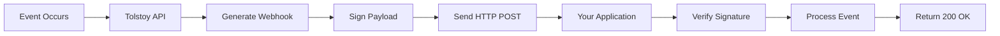

# Setting Up Webhooks

Webhooks allow your application to receive real-time notifications when events occur in your Tolstoy organization. This guide covers everything from basic setup to advanced webhook patterns.

## What Are Webhooks?

Webhooks are HTTP callbacks that Tolstoy sends to your application when specific events occur. Instead of polling our API for updates, webhooks push notifications to you instantly.

### **Benefits of Webhooks**

- ⚡ **Real-time notifications** - Get instant updates
- 🔄 **Reduced API calls** - No need to poll for changes  
- 📊 **Better performance** - Lower latency than polling
- 🔒 **Secure delivery** - HMAC signature verification
- 🔁 **Automatic retries** - Built-in retry mechanism

## Webhook Flow Overview



## Step 1: Create Your Webhook Endpoint

First, create an endpoint in your application to receive webhooks:

<CodeGroup>

```javascript Express.js Webhook Endpoint
const express = require('express');
const crypto = require('crypto');
const app = express();

// Middleware to capture raw body for signature verification
app.use('/webhooks', express.raw({ type: 'application/json' }));

// Webhook signature verification
function verifyWebhookSignature(payload, signature, secret) {
  const expectedSignature = crypto
    .createHmac('sha256', secret)
    .update(payload, 'utf8')
    .digest('hex');
  
  const providedSignature = signature.replace('sha256=', '');
  
  return crypto.timingSafeEqual(
    Buffer.from(expectedSignature, 'hex'),
    Buffer.from(providedSignature, 'hex')
  );
}

// Webhook handler
app.post('/webhooks/tolstoy', (req, res) => {
  const signature = req.headers['x-tolstoy-signature'];
  const payload = req.body;
  const secret = process.env.TOLSTOY_WEBHOOK_SECRET;
  
  // Verify webhook signature
  if (!signature || !verifyWebhookSignature(payload, signature, secret)) {
    console.error('❌ Invalid webhook signature');
    return res.status(401).json({ error: 'Invalid signature' });
  }
  
  try {
    // Parse the event
    const event = JSON.parse(payload);
    console.log('📥 Received webhook:', event.event.type);
    
    // Process the event
    processWebhookEvent(event);
    
    // Always respond with 200 OK quickly
    res.status(200).json({ received: true });
    
  } catch (error) {
    console.error('💥 Webhook processing error:', error);
    
    // Still return 200 to prevent retries for parsing errors
    res.status(200).json({ 
      received: true, 
      processing_error: error.message 
    });
  }
});

async function processWebhookEvent(event) {
  const eventType = event.event.type;
  const eventData = event.data.object;
  
  switch (eventType) {
    case 'flow.completed':
      await handleFlowCompleted(eventData);
      break;
    case 'flow.failed':
      await handleFlowFailed(eventData);
      break;
    case 'user.created':
      await handleUserCreated(eventData);
      break;
    default:
      console.log(`Unhandled event type: ${eventType}`);
  }
}

app.listen(3000, () => {
  console.log('🎣 Webhook server listening on port 3000');
});
```

```python Flask Webhook Endpoint
from flask import Flask, request, jsonify
import hmac
import hashlib
import json
import os

app = Flask(__name__)

def verify_webhook_signature(payload: str, signature: str, secret: str) -> bool:
    """Verify Tolstoy webhook signature"""
    expected_signature = hmac.new(
        secret.encode('utf-8'),
        payload.encode('utf-8'),
        hashlib.sha256
    ).hexdigest()
    
    provided_signature = signature.replace('sha256=', '')
    
    return hmac.compare_digest(expected_signature, provided_signature)

@app.route('/webhooks/tolstoy', methods=['POST'])
def handle_webhook():
    signature = request.headers.get('X-Tolstoy-Signature')
    payload = request.get_data(as_text=True)
    secret = os.environ['TOLSTOY_WEBHOOK_SECRET']
    
    # Verify signature
    if not signature or not verify_webhook_signature(payload, signature, secret):
        print('❌ Invalid webhook signature')
        return jsonify({'error': 'Invalid signature'}), 401
    
    try:
        # Parse event
        event = json.loads(payload)
        print(f'📥 Received webhook: {event["event"]["type"]}')
        
        # Process event asynchronously
        process_webhook_event(event)
        
        return jsonify({'received': True})
        
    except Exception as e:
        print(f'💥 Webhook processing error: {e}')
        return jsonify({'received': True, 'processing_error': str(e)})

def process_webhook_event(event):
    event_type = event['event']['type']
    event_data = event['data']['object']
    
    if event_type == 'flow.completed':
        handle_flow_completed(event_data)
    elif event_type == 'flow.failed':
        handle_flow_failed(event_data)
    elif event_type == 'user.created':
        handle_user_created(event_data)
    else:
        print(f'Unhandled event type: {event_type}')

def handle_flow_completed(execution_data):
    print(f'✅ Flow completed: {execution_data["flow_name"]}')
    # Add your logic here

def handle_flow_failed(execution_data):
    print(f'❌ Flow failed: {execution_data["flow_name"]}')
    # Add your error handling logic here

if __name__ == '__main__':
    app.run(host='0.0.0.0', port=3000, debug=False)
```

```go Go Webhook Handler
package main

import (
    "crypto/hmac"
    "crypto/sha256"
    "encoding/hex"
    "encoding/json"
    "fmt"
    "io"
    "net/http"
    "os"
    "strings"
)

type WebhookEvent struct {
    Event struct {
        ID        string `json:"id"`
        Type      string `json:"type"`
        CreatedAt string `json:"created_at"`
    } `json:"event"`
    Data struct {
        Object map[string]interface{} `json:"object"`
    } `json:"data"`
    Organization struct {
        ID   string `json:"id"`
        Name string `json:"name"`
    } `json:"organization"`
}

func verifyWebhookSignature(payload, signature, secret string) bool {
    // Remove sha256= prefix
    providedSig := strings.TrimPrefix(signature, "sha256=")
    
    // Calculate expected signature
    mac := hmac.New(sha256.New, []byte(secret))
    mac.Write([]byte(payload))
    expectedSig := hex.EncodeToString(mac.Sum(nil))
    
    return hmac.Equal([]byte(expectedSig), []byte(providedSig))
}

func webhookHandler(w http.ResponseWriter, r *http.Request) {
    if r.Method != "POST" {
        http.Error(w, "Method not allowed", http.StatusMethodNotAllowed)
        return
    }
    
    // Read body
    body, err := io.ReadAll(r.Body)
    if err != nil {
        http.Error(w, "Failed to read body", http.StatusBadRequest)
        return
    }
    
    // Verify signature
    signature := r.Header.Get("X-Tolstoy-Signature")
    secret := os.Getenv("TOLSTOY_WEBHOOK_SECRET")
    
    if !verifyWebhookSignature(string(body), signature, secret) {
        fmt.Println("❌ Invalid webhook signature")
        http.Error(w, "Invalid signature", http.StatusUnauthorized)
        return
    }
    
    // Parse event
    var event WebhookEvent
    if err := json.Unmarshal(body, &event); err != nil {
        fmt.Printf("💥 Failed to parse webhook: %v\n", err)
        w.WriteHeader(http.StatusOK) // Still return 200 for parsing errors
        return
    }
    
    fmt.Printf("📥 Received webhook: %s\n", event.Event.Type)
    
    // Process event
    go processWebhookEvent(event) // Process asynchronously
    
    // Respond immediately
    w.Header().Set("Content-Type", "application/json")
    w.WriteHeader(http.StatusOK)
    json.NewEncoder(w).Encode(map[string]bool{"received": true})
}

func processWebhookEvent(event WebhookEvent) {
    switch event.Event.Type {
    case "flow.completed":
        handleFlowCompleted(event.Data.Object)
    case "flow.failed":
        handleFlowFailed(event.Data.Object)
    case "user.created":
        handleUserCreated(event.Data.Object)
    default:
        fmt.Printf("Unhandled event type: %s\n", event.Event.Type)
    }
}

func main() {
    http.HandleFunc("/webhooks/tolstoy", webhookHandler)
    
    fmt.Println("🎣 Webhook server listening on :3000")
    if err := http.ListenAndServe(":3000", nil); err != nil {
        fmt.Printf("Server failed: %v\n", err)
    }
}
```

</CodeGroup>

## Step 2: Register Your Webhook

Register your webhook endpoint with the Tolstoy API:

<CodeGroup>

```javascript Register Webhook
const webhookConfig = {
  url: "https://your-app.com/webhooks/tolstoy",
  description: "Main application webhook for customer events",
  events: [
    "flow.completed",
    "flow.failed", 
    "execution.started",
    "execution.completed",
    "execution.failed",
    "user.created",
    "organization.plan_changed"
  ],
  filters: {
    // Only receive events for flows with specific tags
    flow_tags: ["production", "customer"],
    
    // Only receive events for certain user roles
    user_roles: ["admin", "developer"],
    
    // Filter by error severity
    error_severity: ["medium", "high", "critical"]
  },
  signature: {
    algorithm: "sha256",
    header: "X-Tolstoy-Signature",
    secret_name: "TOLSTOY_WEBHOOK_SECRET"
  },
  retry_policy: {
    max_attempts: 5,
    backoff_strategy: "exponential",
    retry_codes: [500, 502, 503, 504, 408],
    initial_delay_seconds: 1,
    max_delay_seconds: 300
  },
  timeout_seconds: 30,
  active: true
};

const webhookResponse = await fetch('https://api.tolstoy.dev/webhooks', {
  method: 'POST',
  headers: {
    'Authorization': `Bearer ${apiKey}`,
    'Content-Type': 'application/json'
  },
  body: JSON.stringify(webhookConfig)
});

const webhook = await webhookResponse.json();
console.log('✅ Webhook registered:', webhook.webhook.id);
console.log('🔗 Webhook URL:', webhook.webhook.url);
console.log('🔑 Secret name:', webhook.webhook.signature.secret_name);
```

```python Register Webhook - Python
webhook_config = {
    "url": "https://your-app.com/webhooks/tolstoy",
    "description": "Main application webhook for customer events",
    "events": [
        "flow.completed",
        "flow.failed",
        "execution.started", 
        "execution.completed",
        "execution.failed",
        "user.created",
        "organization.plan_changed"
    ],
    "filters": {
        "flow_tags": ["production", "customer"],
        "user_roles": ["admin", "developer"],
        "error_severity": ["medium", "high", "critical"]
    },
    "signature": {
        "algorithm": "sha256",
        "header": "X-Tolstoy-Signature",
        "secret_name": "TOLSTOY_WEBHOOK_SECRET"
    },
    "retry_policy": {
        "max_attempts": 5,
        "backoff_strategy": "exponential",
        "retry_codes": [500, 502, 503, 504, 408],
        "initial_delay_seconds": 1,
        "max_delay_seconds": 300
    },
    "timeout_seconds": 30,
    "active": True
}

response = requests.post(
    'https://api.tolstoy.dev/webhooks',
    headers={
        'Authorization': f'Bearer {api_key}',
        'Content-Type': 'application/json'
    },
    json=webhook_config
)

webhook = response.json()
print(f'✅ Webhook registered: {webhook["webhook"]["id"]}')
print(f'🔗 Webhook URL: {webhook["webhook"]["url"]}')
```

</CodeGroup>

## Step 3: Configure Webhook Secrets

Store your webhook secret securely:

<CodeGroup>

```javascript Configure Webhook Secret
// Generate a secure webhook secret
const crypto = require('crypto');
const webhookSecret = crypto.randomBytes(32).toString('hex');

console.log('🔑 Generated webhook secret:', webhookSecret);

// Store the secret in Tolstoy (optional - for convenience)
const secretConfig = {
  name: "TOLSTOY_WEBHOOK_SECRET",
  value: webhookSecret,
  description: "Secret for verifying webhook signatures",
  expires_at: null // Never expires
};

const secretResponse = await fetch('https://api.tolstoy.dev/secrets', {
  method: 'POST',
  headers: {
    'Authorization': `Bearer ${apiKey}`,
    'Content-Type': 'application/json'
  },
  body: JSON.stringify(secretConfig)
});

if (secretResponse.ok) {
  console.log('✅ Webhook secret stored in Tolstoy');
} else {
  console.log('⚠️ Store webhook secret in your environment variables');
}

// Add to your environment variables
console.log('Add this to your .env file:');
console.log(`TOLSTOY_WEBHOOK_SECRET=${webhookSecret}`);
```

```bash Environment Setup
# Add to your .env file
TOLSTOY_WEBHOOK_SECRET=your-generated-secret-here

# For production, use secure secret management
# AWS Secrets Manager
aws secretsmanager create-secret \
  --name "tolstoy/webhook-secret" \
  --secret-string "your-generated-secret-here"

# Kubernetes Secret  
kubectl create secret generic tolstoy-webhook-secret \
  --from-literal=secret=your-generated-secret-here

# Docker Compose
# docker-compose.yml
version: '3.8'
services:
  app:
    environment:
      - TOLSTOY_WEBHOOK_SECRET_FILE=/run/secrets/webhook_secret
    secrets:
      - webhook_secret
secrets:
  webhook_secret:
    external: true
```

</CodeGroup>

## Step 4: Handle Different Event Types

Create handlers for different webhook events:

<CodeGroup>

```javascript Event Handlers
class WebhookEventProcessor {
  constructor() {
    this.handlers = new Map();
    this.setupHandlers();
  }
  
  setupHandlers() {
    // Flow events
    this.handlers.set('flow.completed', this.handleFlowCompleted.bind(this));
    this.handlers.set('flow.failed', this.handleFlowFailed.bind(this));
    
    // Execution events
    this.handlers.set('execution.started', this.handleExecutionStarted.bind(this));
    this.handlers.set('execution.timeout', this.handleExecutionTimeout.bind(this));
    
    // User events
    this.handlers.set('user.created', this.handleUserCreated.bind(this));
    this.handlers.set('user.role_changed', this.handleUserRoleChanged.bind(this));
    
    // System events
    this.handlers.set('organization.plan_changed', this.handlePlanChanged.bind(this));
    this.handlers.set('system.maintenance_started', this.handleMaintenanceStarted.bind(this));
  }
  
  async process(event) {
    const eventType = event.event.type;
    const handler = this.handlers.get(eventType);
    
    if (handler) {
      try {
        await handler(event.data.object, event);
        console.log(`✅ Processed ${eventType} event`);
      } catch (error) {
        console.error(`💥 Error processing ${eventType}:`, error);
        
        // Log error for debugging
        await this.logError(eventType, error, event);
      }
    } else {
      console.log(`⚠️ No handler for event type: ${eventType}`);
    }
  }
  
  async handleFlowCompleted(execution, event) {
    const flowName = execution.flow_name;
    const duration = execution.duration_ms;
    
    console.log(`🎉 Flow "${flowName}" completed in ${duration}ms`);
    
    // Update success metrics
    await this.updateMetrics({
      flow_id: execution.flow_id,
      status: 'success',
      duration_ms: duration,
      timestamp: event.event.created_at
    });
    
    // Flow-specific handling
    switch (flowName) {
      case 'customer_onboarding_flow':
        await this.handleCustomerOnboardingComplete(execution);
        break;
      case 'order_processing_flow':
        await this.handleOrderProcessingComplete(execution);
        break;
      default:
        console.log(`No specific handler for flow: ${flowName}`);
    }
    
    // Send success notification if configured
    if (execution.outputs?.notification_required) {
      await this.sendSuccessNotification(execution);
    }
  }
  
  async handleFlowFailed(execution, event) {
    const flowName = execution.flow_name;
    const error = execution.error;
    
    console.error(`💥 Flow "${flowName}" failed: ${error.message}`);
    
    // Update failure metrics
    await this.updateMetrics({
      flow_id: execution.flow_id,
      status: 'failed',
      error_code: error.code,
      timestamp: event.event.created_at
    });
    
    // Determine alert severity
    const severity = this.getErrorSeverity(flowName, error);
    
    // Send alerts based on severity
    switch (severity) {
      case 'critical':
        await this.sendCriticalAlert(execution, error);
        await this.createIncident(execution, error);
        break;
      case 'high':
        await this.sendHighPriorityAlert(execution, error);
        break;
      case 'medium':
        await this.logError('flow_failure', error, execution);
        break;
      default:
        console.log(`Low severity failure logged for flow: ${flowName}`);
    }
    
    // Attempt automatic recovery if possible
    if (this.canAutoRecover(error)) {
      await this.attemptRecovery(execution);
    }
  }
  
  async handleUserCreated(user, event) {
    console.log(`👤 New user created: ${user.email}`);
    
    // Send welcome message
    await this.sendWelcomeMessage(user);
    
    // Update user analytics
    await this.updateUserAnalytics({
      user_id: user.id,
      signup_source: user.signup_source,
      role: user.role,
      timestamp: event.event.created_at
    });
    
    // Trigger onboarding if needed
    if (user.role === 'admin') {
      await this.triggerAdminOnboarding(user);
    }
  }
  
  async handleCustomerOnboardingComplete(execution) {
    const customerId = execution.outputs?.customer_id;
    
    if (customerId) {
      // Update customer status in your database
      await this.updateCustomerStatus(customerId, 'onboarded');
      
      // Schedule follow-up actions
      await this.scheduleFollowUp(customerId, '7_day_check_in');
      
      // Update analytics
      await this.trackConversion('signup_to_onboarded');
    }
  }
  
  getErrorSeverity(flowName, error) {
    // Critical flows that require immediate attention
    const criticalFlows = ['payment_processing', 'security_alerts'];
    
    // Critical error codes
    const criticalErrors = ['PAYMENT_FAILED', 'SECURITY_BREACH', 'DATA_CORRUPTION'];
    
    if (criticalFlows.includes(flowName) || criticalErrors.includes(error.code)) {
      return 'critical';
    }
    
    // Customer-facing flows are high priority
    const customerFacingFlows = ['customer_onboarding', 'order_processing'];
    if (customerFacingFlows.includes(flowName)) {
      return 'high';
    }
    
    return 'medium';
  }
}

// Usage
const processor = new WebhookEventProcessor();

// In your webhook endpoint
async function processWebhookEvent(event) {
  await processor.process(event);
}
```

</CodeGroup>

## Step 5: Advanced Webhook Patterns

### **Event Aggregation**

<CodeGroup>

```javascript Event Aggregation
class WebhookEventAggregator {
  constructor(batchSize = 10, flushInterval = 30000) {
    this.batchSize = batchSize;
    this.flushInterval = flushInterval;
    this.eventBatch = [];
    this.flushTimer = null;
    
    this.startFlushTimer();
  }
  
  addEvent(event) {
    this.eventBatch.push({
      ...event,
      received_at: new Date().toISOString()
    });
    
    // Flush if batch is full
    if (this.eventBatch.length >= this.batchSize) {
      this.flush();
    }
  }
  
  startFlushTimer() {
    this.flushTimer = setInterval(() => {
      if (this.eventBatch.length > 0) {
        this.flush();
      }
    }, this.flushInterval);
  }
  
  async flush() {
    if (this.eventBatch.length === 0) return;
    
    const batch = [...this.eventBatch];
    this.eventBatch = [];
    
    console.log(`📦 Processing batch of ${batch.length} events`);
    
    try {
      // Process events in batch
      await this.processBatch(batch);
      console.log(`✅ Batch processed successfully`);
    } catch (error) {
      console.error('💥 Batch processing failed:', error);
      
      // Re-queue failed events for individual processing
      for (const event of batch) {
        try {
          await this.processIndividualEvent(event);
        } catch (individualError) {
          console.error(`💥 Individual event processing failed:`, individualError);
        }
      }
    }
  }
  
  async processBatch(events) {
    // Group events by type
    const eventsByType = events.reduce((groups, event) => {
      const type = event.event.type;
      if (!groups[type]) groups[type] = [];
      groups[type].push(event);
      return groups;
    }, {});
    
    // Process each event type in batch
    const batchPromises = Object.entries(eventsByType).map(([type, eventList]) => {
      return this.processBatchByType(type, eventList);
    });
    
    await Promise.all(batchPromises);
  }
  
  async processBatchByType(eventType, events) {
    switch (eventType) {
      case 'execution.completed':
        await this.batchUpdateExecutionMetrics(events);
        break;
      case 'user.created':
        await this.batchProcessNewUsers(events);
        break;
      default:
        // Process individually
        for (const event of events) {
          await this.processIndividualEvent(event);
        }
    }
  }
  
  async batchUpdateExecutionMetrics(events) {
    const metrics = events.map(event => ({
      execution_id: event.data.object.id,
      flow_id: event.data.object.flow_id,
      duration_ms: event.data.object.duration_ms,
      status: 'success',
      timestamp: event.event.created_at
    }));
    
    // Bulk insert metrics
    await this.bulkInsertMetrics(metrics);
  }
}

// Usage
const aggregator = new WebhookEventAggregator(20, 15000); // 20 events or 15 seconds

app.post('/webhooks/tolstoy', (req, res) => {
  // Verify signature (omitted for brevity)
  
  const event = JSON.parse(req.body);
  
  // Add to batch for processing
  aggregator.addEvent(event);
  
  // Respond immediately
  res.json({ received: true });
});
```

</CodeGroup>

### **Event Routing**

<CodeGroup>

```javascript Advanced Event Routing
class WebhookRouter {
  constructor() {
    this.routes = [];
    this.middleware = [];
  }
  
  use(middleware) {
    this.middleware.push(middleware);
  }
  
  on(pattern, handler, options = {}) {
    this.routes.push({
      pattern,
      handler,
      options
    });
  }
  
  async route(event) {
    // Apply middleware
    for (const middleware of this.middleware) {
      await middleware(event);
    }
    
    // Find matching routes
    const matchingRoutes = this.routes.filter(route => 
      this.matchesPattern(event.event.type, route.pattern, event)
    );
    
    if (matchingRoutes.length === 0) {
      console.warn(`No routes found for event: ${event.event.type}`);
      return;
    }
    
    // Execute handlers
    const handlerPromises = matchingRoutes.map(route => {
      return this.executeHandler(route, event);
    });
    
    await Promise.allSettled(handlerPromises);
  }
  
  matchesPattern(eventType, pattern, event) {
    // Simple wildcard matching
    if (pattern.includes('*')) {
      const regex = new RegExp(pattern.replace('*', '.*'));
      return regex.test(eventType);
    }
    
    // Exact match
    if (pattern === eventType) {
      return true;
    }
    
    // Function-based matching
    if (typeof pattern === 'function') {
      return pattern(event);
    }
    
    return false;
  }
  
  async executeHandler(route, event) {
    try {
      // Apply rate limiting if configured
      if (route.options.rateLimit) {
        await this.checkRateLimit(route.pattern);
      }
      
      // Execute handler with timeout
      const timeout = route.options.timeout || 30000;
      await this.withTimeout(route.handler(event.data.object, event), timeout);
      
    } catch (error) {
      console.error(`Handler error for ${route.pattern}:`, error);
      
      if (route.options.onError) {
        await route.options.onError(error, event);
      }
    }
  }
  
  withTimeout(promise, timeoutMs) {
    return Promise.race([
      promise,
      new Promise((_, reject) => 
        setTimeout(() => reject(new Error('Handler timeout')), timeoutMs)
      )
    ]);
  }
}

// Setup routing
const router = new WebhookRouter();

// Add middleware for logging
router.use(async (event) => {
  console.log(`📥 ${event.event.type} from org ${event.organization.name}`);
});

// Add middleware for authentication
router.use(async (event) => {
  // Verify organization access
  if (!await hasAccess(event.organization.id)) {
    throw new Error('Organization access denied');
  }
});

// Route flow events
router.on('flow.*', async (execution, event) => {
  await updateDashboard({
    type: 'flow_event',
    event_type: event.event.type,
    flow_name: execution.flow_name,
    timestamp: event.event.created_at
  });
}, { timeout: 5000 });

// Route critical failures
router.on((event) => {
  return event.event.type.includes('failed') && 
         event.data.object.severity === 'critical';
}, async (data, event) => {
  await sendPagerDutyAlert({
    incident_key: `tolstoy_${event.event.id}`,
    description: `Critical failure: ${data.error?.message}`,
    severity: 'critical'
  });
}, { rateLimit: { max: 10, window: 60000 } });

// Route customer events
router.on('flow.completed', async (execution, event) => {
  if (execution.flow_name === 'customer_onboarding_flow') {
    // Customer successfully onboarded
    await updateCRM({
      customer_id: execution.outputs.customer_id,
      status: 'onboarded',
      onboarding_date: execution.completed_at
    });
    
    // Schedule follow-up
    await scheduleFollowUp({
      customer_id: execution.outputs.customer_id,
      type: 'onboarding_check_in',
      schedule_at: new Date(Date.now() + 7 * 24 * 60 * 60 * 1000) // 7 days
    });
  }
});

// Usage in webhook endpoint
app.post('/webhooks/tolstoy', async (req, res) => {
  // Verify signature (omitted for brevity)
  
  const event = JSON.parse(req.body);
  
  // Route event (async processing)
  router.route(event).catch(error => {
    console.error('Routing error:', error);
  });
  
  res.json({ received: true });
});
```

</CodeGroup>

## Step 6: Webhook Security

### **Advanced Signature Verification**

<CodeGroup>

```javascript Enhanced Security
class WebhookSecurity {
  constructor(secret) {
    this.secret = secret;
    this.replayAttackWindow = 300; // 5 minutes
    this.recentDeliveries = new Set();
  }
  
  verifyRequest(payload, signature, timestamp, deliveryId) {
    // 1. Verify timestamp freshness (prevent replay attacks)
    if (!this.verifyTimestamp(timestamp)) {
      throw new Error('Request timestamp too old');
    }
    
    // 2. Check for duplicate deliveries
    if (this.recentDeliveries.has(deliveryId)) {
      throw new Error('Duplicate delivery detected');
    }
    
    // 3. Verify HMAC signature
    if (!this.verifySignature(payload, signature)) {
      throw new Error('Invalid webhook signature');
    }
    
    // 4. Record delivery to prevent replays
    this.recentDeliveries.add(deliveryId);
    
    // 5. Clean old deliveries periodically
    this.cleanupOldDeliveries();
    
    return true;
  }
  
  verifyTimestamp(timestamp) {
    const eventTime = new Date(timestamp).getTime();
    const now = Date.now();
    const age = (now - eventTime) / 1000; // Age in seconds
    
    return age <= this.replayAttackWindow;
  }
  
  verifySignature(payload, signature) {
    const crypto = require('crypto');
    
    const expectedSignature = crypto
      .createHmac('sha256', this.secret)
      .update(payload, 'utf8')
      .digest('hex');
    
    const providedSignature = signature.replace('sha256=', '');
    
    return crypto.timingSafeEqual(
      Buffer.from(expectedSignature, 'hex'),
      Buffer.from(providedSignature, 'hex')
    );
  }
  
  cleanupOldDeliveries() {
    // Remove deliveries older than replay window
    // In production, use Redis or database with TTL
    if (this.recentDeliveries.size > 10000) {
      this.recentDeliveries.clear();
    }
  }
}

// Enhanced webhook middleware
function createSecureWebhookMiddleware(secret) {
  const security = new WebhookSecurity(secret);
  
  return (req, res, next) => {
    const signature = req.headers['x-tolstoy-signature'];
    const timestamp = req.headers['x-tolstoy-timestamp'];
    const deliveryId = req.headers['x-tolstoy-delivery'];
    const payload = req.body;
    
    try {
      security.verifyRequest(payload, signature, timestamp, deliveryId);
      next();
    } catch (error) {
      console.error('🚫 Webhook security check failed:', error.message);
      res.status(401).json({ error: error.message });
    }
  };
}

// Usage
app.use('/webhooks/tolstoy',
  express.raw({ type: 'application/json' }),
  createSecureWebhookMiddleware(process.env.TOLSTOY_WEBHOOK_SECRET)
);
```

</CodeGroup>

### **Rate Limiting Webhooks**

<CodeGroup>

```javascript Webhook Rate Limiting
class WebhookRateLimiter {
  constructor() {
    this.windows = new Map(); // event_type -> { count, reset_time }
    this.limits = {
      'flow.completed': { max: 1000, window: 3600 }, // 1000 per hour
      'flow.failed': { max: 100, window: 3600 },     // 100 per hour  
      'user.created': { max: 50, window: 3600 },     // 50 per hour
      'default': { max: 500, window: 3600 }          // Default limit
    };
  }
  
  isAllowed(eventType) {
    const limit = this.limits[eventType] || this.limits.default;
    const now = Date.now();
    const windowKey = `${eventType}:${Math.floor(now / (limit.window * 1000))}`;
    
    if (!this.windows.has(windowKey)) {
      this.windows.set(windowKey, { count: 0, reset_time: now + limit.window * 1000 });
    }
    
    const window = this.windows.get(windowKey);
    
    if (window.count >= limit.max) {
      return {
        allowed: false,
        limit: limit.max,
        remaining: 0,
        reset_time: window.reset_time
      };
    }
    
    window.count++;
    
    return {
      allowed: true,
      limit: limit.max,
      remaining: limit.max - window.count,
      reset_time: window.reset_time
    };
  }
  
  cleanup() {
    const now = Date.now();
    for (const [key, window] of this.windows.entries()) {
      if (window.reset_time < now) {
        this.windows.delete(key);
      }
    }
  }
}

// Rate limiting middleware
function webhookRateLimitMiddleware() {
  const limiter = new WebhookRateLimiter();
  
  // Cleanup old windows every 10 minutes
  setInterval(() => limiter.cleanup(), 600000);
  
  return (req, res, next) => {
    const event = JSON.parse(req.body);
    const eventType = event.event.type;
    
    const rateCheck = limiter.isAllowed(eventType);
    
    if (!rateCheck.allowed) {
      console.warn(`🚫 Rate limit exceeded for ${eventType}`);
      
      res.status(429).json({
        error: 'Rate limit exceeded',
        limit: rateCheck.limit,
        reset_time: rateCheck.reset_time
      });
      return;
    }
    
    // Add rate limit headers
    res.set({
      'X-RateLimit-Limit': rateCheck.limit,
      'X-RateLimit-Remaining': rateCheck.remaining,
      'X-RateLimit-Reset': rateCheck.reset_time
    });
    
    next();
  };
}
```

</CodeGroup>

## Step 7: Monitoring and Debugging

### **Webhook Analytics Dashboard**

<CodeGroup>

```javascript Analytics Dashboard
class WebhookAnalyticsDashboard {
  constructor() {
    this.metrics = {
      totalEvents: 0,
      eventsByType: new Map(),
      eventsByOrganization: new Map(),
      processingTimes: [],
      errorRates: new Map(),
      deliveryStatuses: {
        success: 0,
        failed: 0,
        retried: 0
      }
    };
  }
  
  recordEvent(event, processingTime, error = null) {
    this.metrics.totalEvents++;
    
    const eventType = event.event.type;
    const orgId = event.organization.id;
    
    // Count by type
    this.metrics.eventsByType.set(
      eventType, 
      (this.metrics.eventsByType.get(eventType) || 0) + 1
    );
    
    // Count by organization
    this.metrics.eventsByOrganization.set(
      orgId,
      (this.metrics.eventsByOrganization.get(orgId) || 0) + 1
    );
    
    // Track processing time
    if (processingTime) {
      this.metrics.processingTimes.push(processingTime);
    }
    
    // Track errors
    if (error) {
      this.metrics.deliveryStatuses.failed++;
      this.metrics.errorRates.set(
        eventType,
        (this.metrics.errorRates.get(eventType) || 0) + 1
      );
    } else {
      this.metrics.deliveryStatuses.success++;
    }
  }
  
  generateReport() {
    const avgProcessingTime = this.metrics.processingTimes.length > 0
      ? this.metrics.processingTimes.reduce((a, b) => a + b) / this.metrics.processingTimes.length
      : 0;
    
    const successRate = this.metrics.totalEvents > 0
      ? (this.metrics.deliveryStatuses.success / this.metrics.totalEvents * 100)
      : 0;
    
    return {
      summary: {
        total_events: this.metrics.totalEvents,
        success_rate: `${successRate.toFixed(2)}%`,
        avg_processing_time_ms: Math.round(avgProcessingTime),
        failed_deliveries: this.metrics.deliveryStatuses.failed
      },
      events_by_type: Object.fromEntries(this.metrics.eventsByType),
      events_by_organization: Object.fromEntries(this.metrics.eventsByOrganization),
      performance: {
        p50: this.getPercentile(50),
        p95: this.getPercentile(95),
        p99: this.getPercentile(99)
      },
      error_rates: Object.fromEntries(this.metrics.errorRates)
    };
  }
  
  getPercentile(percentile) {
    if (this.metrics.processingTimes.length === 0) return 0;
    
    const sorted = [...this.metrics.processingTimes].sort((a, b) => a - b);
    const index = Math.ceil(sorted.length * percentile / 100) - 1;
    
    return sorted[index] || 0;
  }
}

// Usage
const analytics = new WebhookAnalyticsDashboard();

app.post('/webhooks/tolstoy', async (req, res) => {
  const startTime = Date.now();
  let error = null;
  
  try {
    const event = JSON.parse(req.body);
    await processWebhookEvent(event);
    res.json({ received: true });
  } catch (err) {
    error = err;
    res.status(500).json({ error: err.message });
  } finally {
    const processingTime = Date.now() - startTime;
    const event = JSON.parse(req.body);
    analytics.recordEvent(event, processingTime, error);
  }
});

// Dashboard endpoint
app.get('/webhook-analytics', (req, res) => {
  const report = analytics.generateReport();
  res.json(report);
});
```

</CodeGroup>

### **Webhook Debugging Tools**

<CodeGroup>

```javascript Debugging Tools
class WebhookDebugger {
  constructor() {
    this.debugMode = process.env.NODE_ENV === 'development';
    this.eventLog = [];
    this.maxLogSize = 1000;
  }
  
  logEvent(event, context = {}) {
    if (!this.debugMode) return;
    
    const logEntry = {
      timestamp: new Date().toISOString(),
      event_id: event.event.id,
      event_type: event.event.type,
      organization: event.organization.name,
      payload_size: JSON.stringify(event).length,
      context
    };
    
    this.eventLog.push(logEntry);
    
    // Keep log size manageable
    if (this.eventLog.length > this.maxLogSize) {
      this.eventLog = this.eventLog.slice(-this.maxLogSize);
    }
    
    // Pretty print for development
    console.log('🐛 Webhook Debug:');
    console.log(`  Event: ${logEntry.event_type}`);
    console.log(`  ID: ${logEntry.event_id}`);
    console.log(`  Org: ${logEntry.organization}`);
    console.log(`  Size: ${logEntry.payload_size} bytes`);
    
    if (context.processing_time) {
      console.log(`  Processing: ${context.processing_time}ms`);
    }
    
    if (context.error) {
      console.log(`  Error: ${context.error}`);
    }
  }
  
  getEventHistory(filters = {}) {
    let filtered = this.eventLog;
    
    if (filters.event_type) {
      filtered = filtered.filter(e => e.event_type === filters.event_type);
    }
    
    if (filters.organization) {
      filtered = filtered.filter(e => e.organization === filters.organization);
    }
    
    if (filters.since) {
      const since = new Date(filters.since);
      filtered = filtered.filter(e => new Date(e.timestamp) > since);
    }
    
    return filtered;
  }
  
  analyzeEvents() {
    const analysis = {
      total_events: this.eventLog.length,
      event_types: {},
      organizations: {},
      avg_payload_size: 0,
      errors: []
    };
    
    let totalSize = 0;
    
    for (const entry of this.eventLog) {
      // Count by type
      analysis.event_types[entry.event_type] = 
        (analysis.event_types[entry.event_type] || 0) + 1;
      
      // Count by organization
      analysis.organizations[entry.organization] = 
        (analysis.organizations[entry.organization] || 0) + 1;
      
      // Track payload sizes
      totalSize += entry.payload_size;
      
      // Collect errors
      if (entry.context.error) {
        analysis.errors.push({
          event_type: entry.event_type,
          error: entry.context.error,
          timestamp: entry.timestamp
        });
      }
    }
    
    analysis.avg_payload_size = Math.round(totalSize / this.eventLog.length);
    
    return analysis;
  }
}

// Usage
const debugger = new WebhookDebugger();

app.post('/webhooks/tolstoy', async (req, res) => {
  const startTime = Date.now();
  let error = null;
  
  try {
    const event = JSON.parse(req.body);
    
    // Log event for debugging
    debugger.logEvent(event, {
      user_agent: req.headers['user-agent'],
      ip_address: req.ip
    });
    
    await processWebhookEvent(event);
    res.json({ received: true });
    
  } catch (err) {
    error = err.message;
    res.status(500).json({ error: err.message });
  } finally {
    const processingTime = Date.now() - startTime;
    const event = JSON.parse(req.body);
    
    debugger.logEvent(event, {
      processing_time: processingTime,
      error
    });
  }
});

// Debug endpoints (development only)
if (process.env.NODE_ENV === 'development') {
  app.get('/debug/webhooks', (req, res) => {
    const history = debugger.getEventHistory(req.query);
    res.json(history);
  });
  
  app.get('/debug/webhook-analysis', (req, res) => {
    const analysis = debugger.analyzeEvents();
    res.json(analysis);
  });
}
```

</CodeGroup>

## Step 8: Testing Your Webhooks

### **Webhook Testing Framework**

<CodeGroup>

```javascript Webhook Test Suite
class WebhookTestSuite {
  constructor(webhookUrl, secret) {
    this.webhookUrl = webhookUrl;
    this.secret = secret;
    this.testResults = [];
  }
  
  generateSignature(payload) {
    const crypto = require('crypto');
    return 'sha256=' + crypto
      .createHmac('sha256', this.secret)
      .update(payload, 'utf8')
      .digest('hex');
  }
  
  createTestEvent(type, data) {
    return {
      event: {
        id: `evt_test_${Date.now()}`,
        type,
        created_at: new Date().toISOString(),
        api_version: '2024-01-15'
      },
      data: {
        object: data
      },
      organization: {
        id: 'org_test123',
        name: 'test-organization'
      }
    };
  }
  
  async sendTestWebhook(eventType, data, options = {}) {
    const event = this.createTestEvent(eventType, data);
    const payload = JSON.stringify(event);
    const signature = this.generateSignature(payload);
    
    const headers = {
      'Content-Type': 'application/json',
      'X-Tolstoy-Event': eventType,
      'X-Tolstoy-Signature': signature,
      'X-Tolstoy-Delivery': `test_${Date.now()}`,
      'X-Tolstoy-Timestamp': event.event.created_at,
      'User-Agent': 'Tolstoy-Webhooks-Test/1.0',
      ...options.headers
    };
    
    const startTime = Date.now();
    
    try {
      const response = await fetch(this.webhookUrl, {
        method: 'POST',
        headers,
        body: payload,
        timeout: options.timeout || 30000
      });
      
      const duration = Date.now() - startTime;
      
      const result = {
        event_type: eventType,
        status: response.status,
        success: response.ok,
        duration_ms: duration,
        response_size: parseInt(response.headers.get('content-length') || '0'),
        timestamp: new Date().toISOString()
      };
      
      this.testResults.push(result);
      
      if (response.ok) {
        console.log(`✅ ${eventType}: ${response.status} (${duration}ms)`);
      } else {
        console.log(`❌ ${eventType}: ${response.status} (${duration}ms)`);
      }
      
      return result;
      
    } catch (error) {
      const duration = Date.now() - startTime;
      
      const result = {
        event_type: eventType,
        status: 0,
        success: false,
        duration_ms: duration,
        error: error.message,
        timestamp: new Date().toISOString()
      };
      
      this.testResults.push(result);
      console.log(`💥 ${eventType}: ${error.message} (${duration}ms)`);
      
      return result;
    }
  }
  
  async runComprehensiveTest() {
    console.log('🧪 Running comprehensive webhook test suite...\n');
    
    const tests = [
      // Flow events
      {
        type: 'flow.completed',
        data: {
          id: 'exec_test123',
          flow_id: 'flow_test456',
          flow_name: 'test_onboarding',
          status: 'success',
          duration_ms: 2500,
          outputs: { customer_id: 'cust_123' }
        }
      },
      {
        type: 'flow.failed',
        data: {
          id: 'exec_failed123',
          flow_id: 'flow_test456',
          flow_name: 'test_onboarding',
          status: 'failed',
          error: {
            code: 'EXECUTION_FAILED',
            message: 'Test failure scenario'
          }
        }
      },
      
      // User events
      {
        type: 'user.created',
        data: {
          id: 'user_test123',
          email: 'test.user@example.com',
          name: 'Test User',
          role: 'developer',
          created_at: new Date().toISOString()
        }
      },
      
      // System events
      {
        type: 'organization.plan_changed',
        data: {
          id: 'org_test123',
          plan: 'professional',
          previous_plan: 'starter',
          changed_at: new Date().toISOString()
        }
      }
    ];
    
    // Run basic tests
    for (const test of tests) {
      await this.sendTestWebhook(test.type, test.data);
      await this.delay(100); // Small delay between tests
    }
    
    // Test error scenarios
    await this.testErrorScenarios();
    
    // Test performance
    await this.testPerformance();
    
    // Generate report
    const report = this.generateTestReport();
    console.log('\n📊 Test Report:');
    console.table(report.summary);
    
    return report;
  }
  
  async testErrorScenarios() {
    console.log('\n🔍 Testing error scenarios...');
    
    // Test invalid signature
    await this.sendTestWebhook('flow.completed', { test: true }, {
      headers: { 'X-Tolstoy-Signature': 'sha256=invalid' }
    });
    
    // Test malformed payload
    try {
      await fetch(this.webhookUrl, {
        method: 'POST',
        headers: {
          'Content-Type': 'application/json',
          'X-Tolstoy-Signature': this.generateSignature('invalid json')
        },
        body: 'invalid json'
      });
    } catch (error) {
      console.log('📝 Malformed payload test completed');
    }
  }
  
  async testPerformance() {
    console.log('\n⚡ Testing performance with concurrent requests...');
    
    const concurrentTests = Array(10).fill().map(async (_, i) => {
      return this.sendTestWebhook('execution.completed', {
        id: `exec_perf_${i}`,
        flow_id: 'flow_performance_test',
        status: 'success'
      });
    });
    
    const results = await Promise.all(concurrentTests);
    const avgDuration = results.reduce((sum, r) => sum + r.duration_ms, 0) / results.length;
    
    console.log(`📈 Average concurrent processing time: ${Math.round(avgDuration)}ms`);
  }
  
  generateTestReport() {
    const successful = this.testResults.filter(r => r.success);
    const failed = this.testResults.filter(r => !r.success);
    
    const summary = {
      total_tests: this.testResults.length,
      successful: successful.length,
      failed: failed.length,
      success_rate: `${(successful.length / this.testResults.length * 100).toFixed(1)}%`,
      avg_duration: `${Math.round(this.testResults.reduce((sum, r) => sum + r.duration_ms, 0) / this.testResults.length)}ms`
    };
    
    const byEventType = this.testResults.reduce((acc, result) => {
      const type = result.event_type;
      if (!acc[type]) acc[type] = { success: 0, failed: 0 };
      
      if (result.success) {
        acc[type].success++;
      } else {
        acc[type].failed++;
      }
      
      return acc;
    }, {});
    
    return {
      summary,
      by_event_type: byEventType,
      failed_tests: failed,
      recommendations: this.getRecommendations()
    };
  }
  
  getRecommendations() {
    const recommendations = [];
    
    const avgDuration = this.testResults.reduce((sum, r) => sum + r.duration_ms, 0) / this.testResults.length;
    
    if (avgDuration > 5000) {
      recommendations.push('Consider optimizing webhook processing - average response time is high');
    }
    
    const failureRate = this.testResults.filter(r => !r.success).length / this.testResults.length;
    
    if (failureRate > 0.1) {
      recommendations.push('High failure rate detected - check error handling logic');
    }
    
    return recommendations;
  }
  
  delay(ms) {
    return new Promise(resolve => setTimeout(resolve, ms));
  }
}

// Run tests
async function testWebhookEndpoint() {
  const tester = new WebhookTestSuite(
    'https://your-app.com/webhooks/tolstoy',
    process.env.TOLSTOY_WEBHOOK_SECRET
  );
  
  const report = await tester.runComprehensiveTest();
  
  if (report.summary.success_rate === '100.0%') {
    console.log('🎉 All webhook tests passed!');
  } else {
    console.log('⚠️ Some webhook tests failed - check the report above');
  }
  
  return report;
}

// Run tests if this file is executed directly
if (require.main === module) {
  testWebhookEndpoint().catch(console.error);
}
```

</CodeGroup>

## Production Webhook Setup

### **High Availability Configuration**

<CodeGroup>

```javascript Production Webhook Setup
class ProductionWebhookManager {
  constructor(apiKey) {
    this.apiKey = apiKey;
    this.webhookConfigs = {
      primary: {
        url: 'https://api.yourapp.com/webhooks/tolstoy',
        priority: 1,
        timeout: 30,
        retries: 5
      },
      backup: {
        url: 'https://backup.yourapp.com/webhooks/tolstoy',
        priority: 2,
        timeout: 45,
        retries: 3
      },
      monitoring: {
        url: 'https://monitoring.yourapp.com/webhooks/tolstoy',
        priority: 3,
        timeout: 15,
        retries: 1,
        events: ['system.*', '*.failed'] // Only critical events
      }
    };
  }
  
  async setupProductionWebhooks() {
    console.log('🚀 Setting up production webhooks...');
    
    const results = [];
    
    for (const [name, config] of Object.entries(this.webhookConfigs)) {
      try {
        const webhook = await this.createWebhook(name, config);
        results.push({ name, webhook_id: webhook.id, status: 'success' });
        console.log(`✅ ${name} webhook created: ${webhook.id}`);
      } catch (error) {
        results.push({ name, status: 'failed', error: error.message });
        console.error(`❌ Failed to create ${name} webhook:`, error.message);
      }
    }
    
    return results;
  }
  
  async createWebhook(name, config) {
    const webhookConfig = {
      url: config.url,
      description: `Production ${name} webhook`,
      events: config.events || [
        'flow.completed',
        'flow.failed',
        'execution.failed',
        'user.created',
        'organization.plan_changed',
        'system.maintenance_started'
      ],
      filters: {
        environment: 'production',
        severity: ['medium', 'high', 'critical']
      },
      signature: {
        algorithm: 'sha256',
        header: 'X-Tolstoy-Signature',
        secret_name: `WEBHOOK_SECRET_${name.toUpperCase()}`
      },
      retry_policy: {
        max_attempts: config.retries,
        backoff_strategy: 'exponential',
        retry_codes: [500, 502, 503, 504, 408, 429],
        initial_delay_seconds: 1,
        max_delay_seconds: 300
      },
      timeout_seconds: config.timeout,
      priority: config.priority,
      active: true,
      metadata: {
        environment: 'production',
        created_by: 'deployment_script',
        purpose: name
      }
    };
    
    const response = await fetch('https://api.tolstoy.dev/webhooks', {
      method: 'POST',
      headers: {
        'Authorization': `Bearer ${this.apiKey}`,
        'Content-Type': 'application/json'
      },
      body: JSON.stringify(webhookConfig)
    });
    
    if (!response.ok) {
      const error = await response.json();
      throw new Error(error.error.message);
    }
    
    return (await response.json()).webhook;
  }
  
  async testWebhookHealth() {
    console.log('🏥 Testing webhook health...');
    
    const healthResults = [];
    
    for (const [name, config] of Object.entries(this.webhookConfigs)) {
      try {
        const startTime = Date.now();
        
        // Send health check ping
        const response = await fetch(config.url, {
          method: 'POST',
          headers: {
            'Content-Type': 'application/json',
            'X-Tolstoy-Health-Check': 'true'
          },
          body: JSON.stringify({ test: true, timestamp: new Date().toISOString() }),
          timeout: config.timeout * 1000
        });
        
        const duration = Date.now() - startTime;
        
        healthResults.push({
          name,
          url: config.url,
          status: response.status,
          healthy: response.ok,
          response_time_ms: duration
        });
        
        if (response.ok) {
          console.log(`✅ ${name}: ${response.status} (${duration}ms)`);
        } else {
          console.log(`❌ ${name}: ${response.status} (${duration}ms)`);
        }
        
      } catch (error) {
        healthResults.push({
          name,
          url: config.url,
          healthy: false,
          error: error.message
        });
        
        console.log(`💥 ${name}: ${error.message}`);
      }
    }
    
    return healthResults;
  }
}

// Deploy production webhooks
const manager = new ProductionWebhookManager(process.env.TOLSTOY_PROD_API_KEY);

async function deployWebhooks() {
  const setupResults = await manager.setupProductionWebhooks();
  const healthResults = await manager.testWebhookHealth();
  
  console.log('\n📋 Deployment Summary:');
  console.table(setupResults);
  
  console.log('\n🏥 Health Check Summary:');
  console.table(healthResults);
}

deployWebhooks().catch(console.error);
```

</CodeGroup>

## Webhook Monitoring

### **Real-time Monitoring**

<CodeGroup>

```javascript Webhook Monitoring
class WebhookMonitor {
  constructor() {
    this.stats = {
      delivered: 0,
      failed: 0,
      retried: 0,
      avg_response_time: 0,
      last_delivery: null
    };
    
    this.alerts = {
      failure_rate_threshold: 0.1, // Alert if >10% failure rate
      response_time_threshold: 5000, // Alert if >5 second response
      consecutive_failures: 5 // Alert after 5 consecutive failures
    };
    
    this.consecutiveFailures = 0;
  }
  
  recordDelivery(success, responseTime, error = null) {
    if (success) {
      this.stats.delivered++;
      this.consecutiveFailures = 0;
    } else {
      this.stats.failed++;
      this.consecutiveFailures++;
    }
    
    // Update average response time
    const totalDeliveries = this.stats.delivered + this.stats.failed;
    this.stats.avg_response_time = (
      (this.stats.avg_response_time * (totalDeliveries - 1) + responseTime) / totalDeliveries
    );
    
    this.stats.last_delivery = new Date().toISOString();
    
    // Check alert conditions
    this.checkAlertConditions(success, responseTime, error);
  }
  
  checkAlertConditions(success, responseTime, error) {
    // Failure rate alert
    const totalDeliveries = this.stats.delivered + this.stats.failed;
    const failureRate = this.stats.failed / totalDeliveries;
    
    if (failureRate > this.alerts.failure_rate_threshold) {
      this.sendAlert('HIGH_FAILURE_RATE', {
        failure_rate: (failureRate * 100).toFixed(1),
        total_deliveries: totalDeliveries,
        failed_deliveries: this.stats.failed
      });
    }
    
    // Response time alert
    if (responseTime > this.alerts.response_time_threshold) {
      this.sendAlert('SLOW_RESPONSE', {
        response_time_ms: responseTime,
        threshold_ms: this.alerts.response_time_threshold
      });
    }
    
    // Consecutive failures alert
    if (this.consecutiveFailures >= this.alerts.consecutive_failures) {
      this.sendAlert('CONSECUTIVE_FAILURES', {
        consecutive_failures: this.consecutiveFailures,
        last_error: error
      });
    }
  }
  
  async sendAlert(alertType, data) {
    console.log(`🚨 Webhook Alert: ${alertType}`, data);
    
    // Send to monitoring service
    await fetch('https://your-monitoring.com/alerts', {
      method: 'POST',
      headers: { 'Content-Type': 'application/json' },
      body: JSON.stringify({
        source: 'tolstoy_webhooks',
        alert_type: alertType,
        severity: 'warning',
        data,
        timestamp: new Date().toISOString()
      })
    });
  }
  
  getHealthStatus() {
    const totalDeliveries = this.stats.delivered + this.stats.failed;
    const failureRate = totalDeliveries > 0 ? this.stats.failed / totalDeliveries : 0;
    
    let status = 'healthy';
    
    if (failureRate > 0.2) {
      status = 'unhealthy';
    } else if (failureRate > 0.1 || this.consecutiveFailures > 2) {
      status = 'degraded';
    }
    
    return {
      status,
      stats: this.stats,
      failure_rate: (failureRate * 100).toFixed(2),
      consecutive_failures: this.consecutiveFailures,
      last_check: new Date().toISOString()
    };
  }
}

// Monitoring usage
const monitor = new WebhookMonitor();

app.post('/webhooks/tolstoy', async (req, res) => {
  const startTime = Date.now();
  let success = false;
  let error = null;
  
  try {
    // Process webhook
    const event = JSON.parse(req.body);
    await processWebhookEvent(event);
    
    success = true;
    res.json({ received: true });
    
  } catch (err) {
    error = err.message;
    res.status(500).json({ error: err.message });
  } finally {
    const responseTime = Date.now() - startTime;
    monitor.recordDelivery(success, responseTime, error);
  }
});

// Health check endpoint
app.get('/webhook-health', (req, res) => {
  const health = monitor.getHealthStatus();
  res.json(health);
});
```

</CodeGroup>

## API Playground

Test webhook configuration:

<ApiPlayground
  method="POST"
  endpoint="/webhooks"
  baseUrl="https://api.tolstoy.dev"
  auth={{
    type: "bearer",
    placeholder: "Your API Key"
  }}
  body={{
    type: "json",
    schema: {
      url: {
        type: "string",
        placeholder: "https://your-app.com/webhooks/tolstoy",
        description: "Your webhook endpoint URL",
        required: true
      },
      description: {
        type: "string",
        placeholder: "Main application webhook",
        description: "Webhook description"
      },
      events: {
        type: "array",
        defaultValue: ["flow.completed", "flow.failed", "user.created"],
        description: "Events to subscribe to",
        required: true
      },
      signature: {
        type: "object",
        defaultValue: {
          algorithm: "sha256",
          header: "X-Tolstoy-Signature",
          secret_name: "WEBHOOK_SECRET"
        },
        description: "Signature verification config",
        required: true
      },
      timeout_seconds: {
        type: "integer",
        defaultValue: 30,
        description: "Request timeout in seconds"
      },
      active: {
        type: "boolean",
        defaultValue: true,
        description: "Whether webhook is active"
      }
    }
  }}
  sampleResponse={{
    "webhook": {
      "id": "webhook_new123456",
      "url": "https://your-app.com/webhooks/tolstoy",
      "events": ["flow.completed", "flow.failed", "user.created"],
      "status": "active",
      "created_at": "2024-01-15T10:30:00Z"
    }
  }}
/>

## Troubleshooting Common Issues

### **Webhook Delivery Failures**

<Accordion>
  <AccordionItem title="Timeouts">
    **Symptoms:**
    - Webhook delivery failures with timeout errors
    - High response times in webhook analytics
    
    **Solutions:**
    - Optimize webhook processing logic
    - Process events asynchronously
    - Increase timeout settings
    - Return 200 OK immediately, process later
    
    **Example Fix:**
    ```javascript
    app.post('/webhooks/tolstoy', (req, res) => {
      // Respond immediately
      res.json({ received: true });
      
      // Process asynchronously
      processWebhookEvent(JSON.parse(req.body))
        .catch(error => console.error('Processing error:', error));
    });
    ```
  </AccordionItem>
  
  <AccordionItem title="Signature Verification Failures">
    **Symptoms:**
    - 401 Unauthorized responses
    - "Invalid signature" errors in logs
    
    **Solutions:**
    - Verify webhook secret is correct
    - Check payload is not modified before verification
    - Ensure raw body is used for signature calculation
    - Verify HMAC algorithm (SHA-256)
    
    **Debug Steps:**
    ```javascript
    console.log('Payload:', req.body.toString());
    console.log('Signature:', req.headers['x-tolstoy-signature']);
    console.log('Expected:', crypto.createHmac('sha256', secret).update(req.body).digest('hex'));
    ```
  </AccordionItem>
  
  <AccordionItem title="High Memory Usage">
    **Symptoms:**
    - Server memory issues during high webhook volume
    - Out of memory errors
    
    **Solutions:**
    - Process events in batches
    - Use streaming JSON parsing for large payloads
    - Implement event queuing with worker processes
    - Monitor and limit concurrent processing
    
    **Example Solution:**
    ```javascript
    const Queue = require('bull');
    const webhookQueue = new Queue('webhook processing');
    
    app.post('/webhooks/tolstoy', (req, res) => {
      // Queue for processing instead of processing inline
      webhookQueue.add('process-event', req.body);
      res.json({ received: true });
    });
    
    webhookQueue.process('process-event', async (job) => {
      await processWebhookEvent(job.data);
    });
    ```
  </AccordionItem>
</Accordion>

## Related Documentation

<CardGroup cols={2}>
  <Card title="Webhook Events" icon="bell" href="/api/webhook-events">
    Complete webhook events reference
  </Card>
  <Card title="Authentication" icon="key" href="/api/guides/authentication">
    Webhook signature verification
  </Card>
  <Card title="Error Handling" icon="shield" href="/api/guides/error-handling">
    Handle webhook delivery failures
  </Card>
  <Card title="Security Best Practices" icon="lock" href="/api/guides/security">
    Secure webhook implementations
  </Card>
</CardGroup>