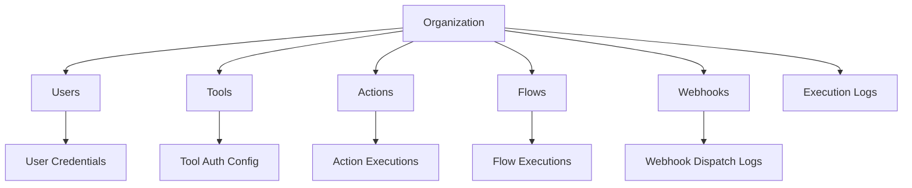

# Organizations

Organizations are the top-level tenant containers in Tolstoy. Every resource (users, tools, actions, flows, webhooks) belongs to an organization, providing complete data isolation and multi-tenant security.

## Organization Structure



## Key Features

### **Multi-Tenant Isolation**
- Complete data separation between organizations
- Automatic tenant context in all API requests
- Organization-scoped authentication and authorization
- Independent configuration and settings per organization

### **Resource Management**
- Centralized management of all workflow components
- Organization-level quotas and limits
- Resource usage tracking and monitoring
- Bulk operations across organization resources

### **Settings Configuration**
Organizations support various configuration options:

- **Timezone** - Default timezone for scheduling and logs
- **Retry Policies** - Default retry behavior for failed executions
- **Rate Limits** - API and execution rate limiting
- **Webhook Settings** - Default webhook configuration
- **Security Policies** - Authentication and access control settings

## Creating Organizations

<CodeGroup>

```bash cURL
curl -X POST 'https://api.tolstoy.dev/organizations' \
  -H 'Authorization: Bearer YOUR_API_KEY' \
  -H 'Content-Type: application/json' \
  -d '{
    "name": "Acme Corporation",
    "settings": {
      "timezone": "America/New_York",
      "defaultRetryPolicy": {
        "maxRetries": 3,
        "backoffMultiplier": 2,
        "retryableStatuses": [500, 502, 503, 504]
      },
      "webhookSettings": {
        "defaultTimeout": 30000,
        "maxRetries": 3
      }
    }
  }'
```

```javascript TypeScript SDK
const organization = await client.organizations.create({
  name: 'Acme Corporation',
  settings: {
    timezone: 'America/New_York',
    defaultRetryPolicy: {
      maxRetries: 3,
      backoffMultiplier: 2,
      retryableStatuses: [500, 502, 503, 504]
    },
    webhookSettings: {
      defaultTimeout: 30000,
      maxRetries: 3
    }
  }
});

console.log('Organization ID:', organization.id);
```

```bash CLI
tolstoy orgs create \
  --name "Acme Corporation" \
  --timezone "America/New_York" \
  --max-retries 3
```

</CodeGroup>

## Organization Settings

### **Default Retry Policy**
Configure how failed executions are retried:

```json
{
  "defaultRetryPolicy": {
    "maxRetries": 3,
    "backoffMultiplier": 2,
    "retryableStatuses": [500, 502, 503, 504],
    "initialDelay": 1000
  }
}
```

### **Webhook Configuration**
Default settings for webhook dispatching:

```json
{
  "webhookSettings": {
    "defaultTimeout": 30000,
    "maxRetries": 3,
    "retryDelay": 5000,
    "enableSignatureVerification": true
  }
}
```

### **Rate Limiting**
Control API usage per organization:

```json
{
  "rateLimits": {
    "apiRequestsPerMinute": 1000,
    "executionsPerHour": 10000,
    "webhookDispatchesPerMinute": 100
  }
}
```

## Managing Organizations

### **Listing Organizations**

<CodeGroup>

```bash cURL
curl -X GET 'https://api.tolstoy.dev/organizations' \
  -H 'Authorization: Bearer YOUR_API_KEY'
```

```javascript TypeScript SDK
const organizations = await client.organizations.list();

organizations.forEach(org => {
  console.log(`${org.name} (${org.id})`);
});
```

```bash CLI
tolstoy orgs list
```

</CodeGroup>

### **Updating Organization Settings**

<CodeGroup>

```bash cURL
curl -X PATCH 'https://api.tolstoy.dev/organizations/ORG_ID' \
  -H 'Authorization: Bearer YOUR_API_KEY' \
  -H 'Content-Type: application/json' \
  -d '{
    "settings": {
      "timezone": "Europe/London",
      "defaultRetryPolicy": {
        "maxRetries": 5
      }
    }
  }'
```

```javascript TypeScript SDK
await client.organizations.update('org_123', {
  settings: {
    timezone: 'Europe/London',
    defaultRetryPolicy: {
      maxRetries: 5
    }
  }
});
```

```bash CLI
tolstoy orgs update ORG_ID \
  --timezone "Europe/London" \
  --max-retries 5
```

</CodeGroup>

## Organization Analytics

View organization-level metrics and usage:

<CodeGroup>

```bash cURL
curl -X GET 'https://api.tolstoy.dev/organizations/ORG_ID/analytics' \
  -H 'Authorization: Bearer YOUR_API_KEY'
```

```javascript TypeScript SDK
const analytics = await client.organizations.getAnalytics('org_123');

console.log('Total Executions:', analytics.totalExecutions);
console.log('Success Rate:', analytics.successRate);
console.log('Average Execution Time:', analytics.avgExecutionTime);
```

</CodeGroup>

### **Key Metrics**
- **Total Executions** - Number of workflow executions
- **Success Rate** - Percentage of successful executions
- **Error Rate** - Percentage of failed executions
- **Average Execution Time** - Mean execution duration
- **Resource Usage** - API calls, storage, compute usage

## Best Practices

### **Organization Design**
<Tabs>
  <Tab title="Single Organization">
    **When to Use:**
    - Small to medium teams
    - Single business entity
    - Shared workflow governance
    
    **Benefits:**
    - Simplified management
    - Easy resource sharing
    - Lower administrative overhead
  </Tab>
  
  <Tab title="Multiple Organizations">
    **When to Use:**
    - Large enterprises
    - Multiple business units
    - Different compliance requirements
    - Separate environments (dev/staging/prod)
    
    **Benefits:**
    - Complete data isolation
    - Independent governance
    - Separate billing and quotas
    - Environment-specific configurations
  </Tab>
</Tabs>

### **Naming Conventions**
Use clear, descriptive organization names:

```javascript
// Good
"Acme Corp - Production"
"Engineering - Development"
"Marketing Automation"

// Avoid
"Org 1"
"Test"
"My Org"
```

### **Settings Management**
- Set appropriate default retry policies for your use case
- Configure timezone based on your team's location
- Implement reasonable rate limits to prevent abuse
- Enable webhook signature verification for security

## Security Considerations

### **Access Control**
- Organizations provide the primary security boundary
- All API requests are scoped to the authenticated organization
- Users cannot access resources from other organizations
- Implement proper API key management per organization

### **Data Isolation**
- Complete database-level isolation between organizations
- Separate encryption keys for sensitive data
- Independent backup and recovery per organization
- Audit logs are organization-scoped

## Troubleshooting

### **Common Issues**

<AccordionGroup>
  <Accordion title="Cannot Access Organization Resources">
    **Symptoms:** API returns empty results or 404 errors
    
    **Solution:** 
    - Verify API key belongs to correct organization
    - Check organization ID in requests
    - Ensure user has proper permissions
  </Accordion>
  
  <Accordion title="Rate Limit Exceeded">
    **Symptoms:** 429 Too Many Requests errors
    
    **Solution:**
    - Review organization rate limits
    - Implement request throttling
    - Contact support for limit increases
  </Accordion>
  
  <Accordion title="Settings Not Taking Effect">
    **Symptoms:** Default settings not applied to new resources
    
    **Solution:**
    - Verify settings syntax is correct
    - Check for conflicting resource-level settings
    - Allow time for settings to propagate
  </Accordion>
</AccordionGroup>

## Next Steps

<CardGroup cols={2}>
  <Card title="Users and Roles" icon="users" href="/concepts/users-and-roles">
    Learn about user management and permissions
  </Card>
  <Card title="Tools" icon="wrench" href="/concepts/tools">
    Understand how tools represent external services
  </Card>
  <Card title="Actions" icon="bolt" href="/concepts/actions">
    Create reusable workflow components
  </Card>
  <Card title="Security" icon="shield" href="/security/multi-tenant">
    Explore multi-tenant security features
  </Card>
</CardGroup>