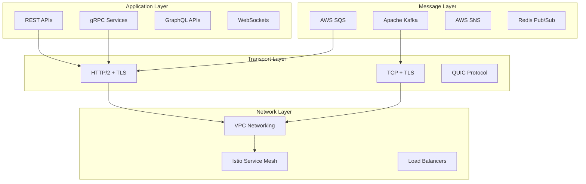

# Microservices Communication Patterns

This document outlines the communication patterns, protocols, and best practices used for service-to-service communication within the Tolstoy platform's microservices architecture.

## Communication Overview

### Communication Types

<CardGroup cols={2}>
  <Card title="Synchronous" icon="arrow-right">
    Direct request-response communication for immediate data exchange
  </Card>
  <Card title="Asynchronous" icon="paper-plane">
    Event-driven communication through message queues and event streams
  </Card>
  <Card title="Streaming" icon="stream">
    Real-time data streaming for continuous communication
  </Card>
  <Card title="Batch" icon="layer-group">
    Bulk data processing and periodic synchronization
  </Card>
</CardGroup>

### Protocol Stack



## Synchronous Communication

### REST API Communication

#### Service-to-Service REST Calls

```typescript
// Base HTTP client configuration
import axios, { AxiosInstance, AxiosRequestConfig } from 'axios';
import jwt from 'jsonwebtoken';

interface ServiceClientConfig {
  baseURL: string;
  service: string;
  timeout: number;
  retries: number;
}

class ServiceClient {
  private client: AxiosInstance;
  private config: ServiceClientConfig;

  constructor(config: ServiceClientConfig) {
    this.config = config;
    this.client = axios.create({
      baseURL: config.baseURL,
      timeout: config.timeout,
      headers: {
        'Content-Type': 'application/json',
        'User-Agent': `tolstoy-service/${process.env.SERVICE_NAME}`,
      },
    });

    this.setupInterceptors();
  }

  private setupInterceptors() {
    // Request interceptor for authentication
    this.client.interceptors.request.use(
      (config) => {
        const token = this.generateServiceToken();
        config.headers.Authorization = `Bearer ${token}`;
        config.headers['X-Request-ID'] = generateRequestId();
        config.headers['X-Service-Name'] = process.env.SERVICE_NAME;
        return config;
      },
      (error) => Promise.reject(error)
    );

    // Response interceptor for error handling
    this.client.interceptors.response.use(
      (response) => response,
      async (error) => {
        if (error.response?.status === 401) {
          // Token might be expired, regenerate and retry
          const token = this.generateServiceToken();
          error.config.headers.Authorization = `Bearer ${token}`;
          return this.client.request(error.config);
        }
        return Promise.reject(error);
      }
    );
  }

  private generateServiceToken(): string {
    const payload = {
      iss: process.env.SERVICE_NAME,
      sub: process.env.SERVICE_NAME,
      aud: this.config.service,
      exp: Math.floor(Date.now() / 1000) + 300, // 5 minutes
      iat: Math.floor(Date.now() / 1000),
      jti: generateRequestId(),
    };

    return jwt.sign(payload, process.env.SERVICE_JWT_SECRET!);
  }

  async get<T>(path: string, config?: AxiosRequestConfig): Promise<T> {
    const response = await this.client.get(path, config);
    return response.data;
  }

  async post<T>(path: string, data?: any, config?: AxiosRequestConfig): Promise<T> {
    const response = await this.client.post(path, data, config);
    return response.data;
  }

  async put<T>(path: string, data?: any, config?: AxiosRequestConfig): Promise<T> {
    const response = await this.client.put(path, data, config);
    return response.data;
  }

  async delete<T>(path: string, config?: AxiosRequestConfig): Promise<T> {
    const response = await this.client.delete(path, config);
    return response.data;
  }
}
```

#### Circuit Breaker Pattern

```typescript
interface CircuitBreakerConfig {
  failureThreshold: number;
  resetTimeout: number;
  monitoringPeriod: number;
}

enum CircuitState {
  CLOSED = 'closed',
  OPEN = 'open',
  HALF_OPEN = 'half_open',
}

class CircuitBreaker {
  private state: CircuitState = CircuitState.CLOSED;
  private failureCount = 0;
  private lastFailureTime?: Date;
  private nextAttempt?: Date;

  constructor(private config: CircuitBreakerConfig) {}

  async execute<T>(operation: () => Promise<T>): Promise<T> {
    if (this.state === CircuitState.OPEN) {
      if (this.shouldAttemptReset()) {
        this.state = CircuitState.HALF_OPEN;
      } else {
        throw new Error('Circuit breaker is OPEN');
      }
    }

    try {
      const result = await operation();
      this.onSuccess();
      return result;
    } catch (error) {
      this.onFailure();
      throw error;
    }
  }

  private onSuccess() {
    this.failureCount = 0;
    this.state = CircuitState.CLOSED;
  }

  private onFailure() {
    this.failureCount++;
    this.lastFailureTime = new Date();

    if (this.failureCount >= this.config.failureThreshold) {
      this.state = CircuitState.OPEN;
      this.nextAttempt = new Date(Date.now() + this.config.resetTimeout);
    }
  }

  private shouldAttemptReset(): boolean {
    return this.nextAttempt ? new Date() >= this.nextAttempt : false;
  }
}

// Usage example
const workflowServiceClient = new ServiceClient({
  baseURL: 'http://workflow-service:3000',
  service: 'workflow-service',
  timeout: 5000,
  retries: 3,
});

const circuitBreaker = new CircuitBreaker({
  failureThreshold: 5,
  resetTimeout: 60000, // 1 minute
  monitoringPeriod: 10000, // 10 seconds
});

export async function getWorkflow(workflowId: string): Promise<Workflow> {
  return circuitBreaker.execute(() =>
    workflowServiceClient.get<Workflow>(`/v1/workflows/${workflowId}`)
  );
}
```

#### Retry Logic with Exponential Backoff

```typescript
interface RetryConfig {
  maxRetries: number;
  baseDelay: number;
  maxDelay: number;
  backoffMultiplier: number;
  retryableStatuses: number[];
}

class RetryHandler {
  constructor(private config: RetryConfig) {}

  async execute<T>(operation: () => Promise<T>): Promise<T> {
    let lastError: Error;

    for (let attempt = 0; attempt <= this.config.maxRetries; attempt++) {
      try {
        return await operation();
      } catch (error: any) {
        lastError = error;

        if (attempt === this.config.maxRetries) {
          break;
        }

        if (!this.shouldRetry(error)) {
          throw error;
        }

        const delay = this.calculateDelay(attempt);
        await this.sleep(delay);
      }
    }

    throw lastError!;
  }

  private shouldRetry(error: any): boolean {
    if (error.code === 'ECONNRESET' || error.code === 'ETIMEDOUT') {
      return true;
    }

    if (error.response?.status) {
      return this.config.retryableStatuses.includes(error.response.status);
    }

    return false;
  }

  private calculateDelay(attempt: number): number {
    const delay = this.config.baseDelay * Math.pow(this.config.backoffMultiplier, attempt);
    return Math.min(delay, this.config.maxDelay);
  }

  private sleep(ms: number): Promise<void> {
    return new Promise((resolve) => setTimeout(resolve, ms));
  }
}

// Enhanced service client with retry logic
class EnhancedServiceClient extends ServiceClient {
  private retryHandler: RetryHandler;

  constructor(config: ServiceClientConfig) {
    super(config);
    this.retryHandler = new RetryHandler({
      maxRetries: 3,
      baseDelay: 1000,
      maxDelay: 10000,
      backoffMultiplier: 2,
      retryableStatuses: [502, 503, 504],
    });
  }

  async get<T>(path: string, config?: AxiosRequestConfig): Promise<T> {
    return this.retryHandler.execute(() => super.get<T>(path, config));
  }
}
```

### gRPC Communication

#### Service Definition

```protobuf
// workflow_service.proto
syntax = "proto3";

package tolstoy.workflow.v1;

import "google/protobuf/timestamp.proto";
import "google/protobuf/empty.proto";

service WorkflowService {
  rpc GetWorkflow(GetWorkflowRequest) returns (GetWorkflowResponse);
  rpc CreateWorkflow(CreateWorkflowRequest) returns (CreateWorkflowResponse);
  rpc UpdateWorkflow(UpdateWorkflowRequest) returns (UpdateWorkflowResponse);
  rpc DeleteWorkflow(DeleteWorkflowRequest) returns (google.protobuf.Empty);
  rpc ExecuteWorkflow(ExecuteWorkflowRequest) returns (ExecuteWorkflowResponse);
  rpc StreamExecutions(StreamExecutionsRequest) returns (stream ExecutionEvent);
}

message Workflow {
  string id = 1;
  string organization_id = 2;
  string name = 3;
  string description = 4;
  string trigger = 5; // JSON string
  string actions = 6; // JSON string
  string status = 7;
  int32 version = 8;
  google.protobuf.Timestamp created_at = 9;
  google.protobuf.Timestamp updated_at = 10;
}

message GetWorkflowRequest {
  string id = 1;
  string organization_id = 2;
}

message GetWorkflowResponse {
  Workflow workflow = 1;
  repeated Execution recent_executions = 2;
}

message CreateWorkflowRequest {
  string organization_id = 1;
  string name = 2;
  string description = 3;
  string trigger = 4;
  string actions = 5;
  string created_by = 6;
}

message CreateWorkflowResponse {
  Workflow workflow = 1;
}

message ExecutionEvent {
  string execution_id = 1;
  string workflow_id = 2;
  string event_type = 3;
  string data = 4; // JSON string
  google.protobuf.Timestamp timestamp = 5;
}

message StreamExecutionsRequest {
  string workflow_id = 1;
  string organization_id = 2;
  bool include_completed = 3;
}
```

#### gRPC Client Implementation

```typescript
// grpc-client.ts
import * as grpc from '@grpc/grpc-js';
import * as protoLoader from '@grpc/proto-loader';
import { ProtoGrpcType } from './generated/workflow_service';
import { WorkflowServiceClient } from './generated/tolstoy/workflow/v1/WorkflowService';

interface GrpcClientConfig {
  serverAddress: string;
  credentials?: grpc.ChannelCredentials;
  options?: grpc.ClientOptions;
}

class WorkflowGrpcClient {
  private client: WorkflowServiceClient;
  private packageDefinition: protoLoader.PackageDefinition;

  constructor(config: GrpcClientConfig) {
    this.packageDefinition = protoLoader.loadSync(
      path.join(__dirname, '../protos/workflow_service.proto'),
      {
        keepCase: true,
        longs: String,
        enums: String,
        defaults: true,
        oneofs: true,
      }
    );

    const proto = grpc.loadPackageDefinition(this.packageDefinition) as unknown as ProtoGrpcType;
    
    this.client = new proto.tolstoy.workflow.v1.WorkflowService(
      config.serverAddress,
      config.credentials || grpc.credentials.createInsecure(),
      config.options
    );
  }

  async getWorkflow(
    request: { id: string; organization_id: string },
    metadata?: grpc.Metadata
  ): Promise<any> {
    return new Promise((resolve, reject) => {
      this.client.getWorkflow(
        request,
        metadata || this.createMetadata(),
        (error, response) => {
          if (error) {
            reject(error);
          } else {
            resolve(response);
          }
        }
      );
    });
  }

  streamExecutions(
    request: { workflow_id: string; organization_id: string; include_completed: boolean },
    metadata?: grpc.Metadata
  ): grpc.ClientReadableStream<any> {
    return this.client.streamExecutions(request, metadata || this.createMetadata());
  }

  private createMetadata(): grpc.Metadata {
    const metadata = new grpc.Metadata();
    metadata.add('authorization', `Bearer ${this.generateServiceToken()}`);
    metadata.add('x-request-id', generateRequestId());
    metadata.add('x-service-name', process.env.SERVICE_NAME || 'unknown');
    return metadata;
  }

  private generateServiceToken(): string {
    // Same JWT generation logic as REST client
    return jwt.sign({
      iss: process.env.SERVICE_NAME,
      sub: process.env.SERVICE_NAME,
      aud: 'workflow-service',
      exp: Math.floor(Date.now() / 1000) + 300,
      iat: Math.floor(Date.now() / 1000),
    }, process.env.SERVICE_JWT_SECRET!);
  }
}
```

#### gRPC Server Implementation

```typescript
// grpc-server.ts
import * as grpc from '@grpc/grpc-js';
import { WorkflowServiceService } from './generated/tolstoy/workflow/v1/WorkflowService';
import { WorkflowController } from '../controllers/workflow.controller';

class WorkflowGrpcServer {
  private server: grpc.Server;
  private workflowController: WorkflowController;

  constructor() {
    this.server = new grpc.Server();
    this.workflowController = new WorkflowController();
    this.setupRoutes();
  }

  private setupRoutes() {
    this.server.addService(WorkflowServiceService, {
      getWorkflow: this.getWorkflow.bind(this),
      createWorkflow: this.createWorkflow.bind(this),
      updateWorkflow: this.updateWorkflow.bind(this),
      deleteWorkflow: this.deleteWorkflow.bind(this),
      executeWorkflow: this.executeWorkflow.bind(this),
      streamExecutions: this.streamExecutions.bind(this),
    });
  }

  private async getWorkflow(
    call: grpc.ServerUnaryCall<any, any>,
    callback: grpc.sendUnaryData<any>
  ) {
    try {
      const { id, organization_id } = call.request;
      
      // Validate service-to-service authentication
      const authResult = await this.validateServiceAuth(call.metadata);
      if (!authResult.valid) {
        return callback({
          code: grpc.status.UNAUTHENTICATED,
          message: 'Invalid service authentication',
        });
      }

      const result = await this.workflowController.getWorkflow(id, organization_id);
      callback(null, result);
    } catch (error: any) {
      callback({
        code: grpc.status.INTERNAL,
        message: error.message,
      });
    }
  }

  private streamExecutions(call: grpc.ServerWritableStream<any, any>) {
    const { workflow_id, organization_id, include_completed } = call.request;
    
    // Set up real-time execution streaming
    const executionStream = this.workflowController.streamExecutions(
      workflow_id,
      organization_id,
      include_completed
    );

    executionStream.on('data', (executionEvent) => {
      call.write(executionEvent);
    });

    executionStream.on('end', () => {
      call.end();
    });

    executionStream.on('error', (error) => {
      call.destroy(error);
    });

    call.on('cancelled', () => {
      executionStream.destroy();
    });
  }

  private async validateServiceAuth(metadata: grpc.Metadata): Promise<{ valid: boolean; service?: string }> {
    const authHeader = metadata.get('authorization')[0] as string;
    if (!authHeader?.startsWith('Bearer ')) {
      return { valid: false };
    }

    try {
      const token = authHeader.substring(7);
      const decoded = jwt.verify(token, process.env.SERVICE_JWT_SECRET!) as any;
      return { valid: true, service: decoded.iss };
    } catch (error) {
      return { valid: false };
    }
  }

  start(port: number) {
    this.server.bindAsync(
      `0.0.0.0:${port}`,
      grpc.ServerCredentials.createInsecure(),
      (error, port) => {
        if (error) {
          console.error('Failed to start gRPC server:', error);
          return;
        }
        console.log(`gRPC server started on port ${port}`);
        this.server.start();
      }
    );
  }
}
```

## Asynchronous Communication

### Event-Driven Architecture

#### Event Schema Design

```typescript
// Base event interface
interface BaseEvent {
  id: string;
  type: string;
  source: string;
  timestamp: string;
  version: string;
  correlation_id?: string;
  causation_id?: string;
}

interface DomainEvent<T = any> extends BaseEvent {
  aggregate_id: string;
  aggregate_type: string;
  sequence_number: number;
  data: T;
  metadata: {
    organization_id: string;
    user_id?: string;
    ip_address?: string;
    user_agent?: string;
  };
}

// Specific event types
interface WorkflowCreatedEvent extends DomainEvent<{
  name: string;
  description?: string;
  trigger: any;
  actions: any[];
  created_by: string;
}> {
  type: 'workflow.created';
  aggregate_type: 'workflow';
}

interface WorkflowExecutedEvent extends DomainEvent<{
  execution_id: string;
  input: any;
  trigger_data: any;
}> {
  type: 'workflow.executed';
  aggregate_type: 'workflow';
}

interface ExecutionCompletedEvent extends DomainEvent<{
  workflow_id: string;
  status: 'completed' | 'failed';
  output?: any;
  error?: string;
  duration_ms: number;
}> {
  type: 'execution.completed';
  aggregate_type: 'execution';
}
```

#### Event Publisher

```typescript
// event-publisher.ts
import { Kafka, Producer, ProducerRecord } from 'kafkajs';

interface EventPublisherConfig {
  brokers: string[];
  clientId: string;
  retries: number;
}

class EventPublisher {
  private kafka: Kafka;
  private producer: Producer;
  private isConnected = false;

  constructor(private config: EventPublisherConfig) {
    this.kafka = new Kafka({
      clientId: config.clientId,
      brokers: config.brokers,
      retry: {
        initialRetryTime: 100,
        retries: config.retries,
      },
    });

    this.producer = this.kafka.producer({
      maxInFlightRequests: 1,
      idempotent: true,
      transactionTimeout: 30000,
    });
  }

  async connect(): Promise<void> {
    if (!this.isConnected) {
      await this.producer.connect();
      this.isConnected = true;
    }
  }

  async disconnect(): Promise<void> {
    if (this.isConnected) {
      await this.producer.disconnect();
      this.isConnected = false;
    }
  }

  async publishEvent<T extends DomainEvent>(event: T): Promise<void> {
    await this.connect();

    const record: ProducerRecord = {
      topic: this.getTopicName(event.type),
      messages: [
        {
          key: event.aggregate_id,
          value: JSON.stringify(event),
          headers: {
            'event-type': event.type,
            'event-version': event.version,
            'correlation-id': event.correlation_id || '',
            'organization-id': event.metadata.organization_id,
          },
          timestamp: new Date(event.timestamp).getTime().toString(),
        },
      ],
    };

    await this.producer.send(record);
  }

  async publishEvents<T extends DomainEvent>(events: T[]): Promise<void> {
    await this.connect();

    const recordsByTopic = new Map<string, ProducerRecord>();

    for (const event of events) {
      const topic = this.getTopicName(event.type);
      
      if (!recordsByTopic.has(topic)) {
        recordsByTopic.set(topic, {
          topic,
          messages: [],
        });
      }

      recordsByTopic.get(topic)!.messages.push({
        key: event.aggregate_id,
        value: JSON.stringify(event),
        headers: {
          'event-type': event.type,
          'event-version': event.version,
          'correlation-id': event.correlation_id || '',
          'organization-id': event.metadata.organization_id,
        },
        timestamp: new Date(event.timestamp).getTime().toString(),
      });
    }

    const transaction = await this.producer.transaction();
    try {
      for (const record of recordsByTopic.values()) {
        await transaction.send(record);
      }
      await transaction.commit();
    } catch (error) {
      await transaction.abort();
      throw error;
    }
  }

  private getTopicName(eventType: string): string {
    const [domain] = eventType.split('.');
    return `${domain}.events`;
  }
}
```

#### Event Consumer

```typescript
// event-consumer.ts
import { Kafka, Consumer, EachMessagePayload } from 'kafkajs';

interface EventHandler<T extends DomainEvent = DomainEvent> {
  eventType: string;
  handle(event: T): Promise<void>;
}

class EventConsumer {
  private kafka: Kafka;
  private consumer: Consumer;
  private handlers = new Map<string, EventHandler[]>();

  constructor(
    private config: { brokers: string[]; groupId: string; topics: string[] }
  ) {
    this.kafka = new Kafka({
      clientId: `${config.groupId}-consumer`,
      brokers: config.brokers,
    });

    this.consumer = this.kafka.consumer({
      groupId: config.groupId,
      sessionTimeout: 30000,
      rebalanceTimeout: 60000,
      heartbeatInterval: 3000,
    });
  }

  registerHandler<T extends DomainEvent>(handler: EventHandler<T>): void {
    if (!this.handlers.has(handler.eventType)) {
      this.handlers.set(handler.eventType, []);
    }
    this.handlers.get(handler.eventType)!.push(handler as EventHandler);
  }

  async start(): Promise<void> {
    await this.consumer.connect();
    await this.consumer.subscribe({
      topics: this.config.topics,
      fromBeginning: false,
    });

    await this.consumer.run({
      eachMessage: this.handleMessage.bind(this),
    });
  }

  async stop(): Promise<void> {
    await this.consumer.disconnect();
  }

  private async handleMessage(payload: EachMessagePayload): Promise<void> {
    try {
      const event = JSON.parse(payload.message.value!.toString()) as DomainEvent;
      const handlers = this.handlers.get(event.type) || [];

      // Process handlers in parallel for better performance
      const promises = handlers.map(async (handler) => {
        try {
          await handler.handle(event);
        } catch (error) {
          console.error(`Error in handler for ${event.type}:`, error);
          // Send to dead letter queue or retry logic here
        }
      });

      await Promise.all(promises);
    } catch (error) {
      console.error('Error processing message:', error);
      // Handle deserialization errors
    }
  }
}

// Example event handlers
class WorkflowCreatedHandler implements EventHandler<WorkflowCreatedEvent> {
  eventType = 'workflow.created';

  async handle(event: WorkflowCreatedEvent): Promise<void> {
    // Update search index
    await searchService.indexWorkflow({
      id: event.aggregate_id,
      name: event.data.name,
      description: event.data.description,
      organization_id: event.metadata.organization_id,
    });

    // Send notification
    await notificationService.sendWorkflowCreatedNotification(
      event.metadata.organization_id,
      event.aggregate_id,
      event.data.name
    );

    // Update analytics
    await analyticsService.recordWorkflowCreation(event);
  }
}

class ExecutionCompletedHandler implements EventHandler<ExecutionCompletedEvent> {
  eventType = 'execution.completed';

  async handle(event: ExecutionCompletedEvent): Promise<void> {
    // Trigger webhooks
    await webhookService.triggerWebhooks(
      event.metadata.organization_id,
      'execution.completed',
      {
        execution_id: event.aggregate_id,
        workflow_id: event.data.workflow_id,
        status: event.data.status,
        duration_ms: event.data.duration_ms,
      }
    );

    // Update metrics
    await metricsService.recordExecutionCompletion({
      workflow_id: event.data.workflow_id,
      organization_id: event.metadata.organization_id,
      status: event.data.status,
      duration_ms: event.data.duration_ms,
    });

    // Check for alerts
    if (event.data.status === 'failed') {
      await alertService.checkFailureAlerts(
        event.metadata.organization_id,
        event.data.workflow_id,
        event.aggregate_id
      );
    }
  }
}
```

### Message Queue Patterns

#### Request-Response Pattern

```typescript
// request-response-pattern.ts
import { v4 as uuidv4 } from 'uuid';

interface RequestMessage<T = any> {
  id: string;
  reply_to: string;
  correlation_id: string;
  payload: T;
  timestamp: string;
  expires_at: string;
}

interface ResponseMessage<T = any> {
  correlation_id: string;
  payload: T;
  error?: string;
  timestamp: string;
}

class RequestResponseClient {
  private pendingRequests = new Map<string, {
    resolve: (value: any) => void;
    reject: (error: Error) => void;
    timeout: NodeJS.Timeout;
  }>();

  constructor(
    private producer: Producer,
    private consumer: Consumer,
    private responseQueue: string
  ) {
    this.setupResponseHandler();
  }

  async request<T, R>(
    queue: string,
    payload: T,
    timeout = 30000
  ): Promise<R> {
    const correlationId = uuidv4();
    const requestId = uuidv4();

    const promise = new Promise<R>((resolve, reject) => {
      const timeoutHandle = setTimeout(() => {
        this.pendingRequests.delete(correlationId);
        reject(new Error('Request timeout'));
      }, timeout);

      this.pendingRequests.set(correlationId, {
        resolve,
        reject,
        timeout: timeoutHandle,
      });
    });

    const message: RequestMessage<T> = {
      id: requestId,
      reply_to: this.responseQueue,
      correlation_id: correlationId,
      payload,
      timestamp: new Date().toISOString(),
      expires_at: new Date(Date.now() + timeout).toISOString(),
    };

    await this.producer.send({
      topic: queue,
      messages: [{
        key: correlationId,
        value: JSON.stringify(message),
      }],
    });

    return promise;
  }

  private async setupResponseHandler(): Promise<void> {
    await this.consumer.subscribe({
      topics: [this.responseQueue],
      fromBeginning: false,
    });

    await this.consumer.run({
      eachMessage: async ({ message }) => {
        try {
          const response = JSON.parse(message.value!.toString()) as ResponseMessage;
          const pending = this.pendingRequests.get(response.correlation_id);

          if (pending) {
            clearTimeout(pending.timeout);
            this.pendingRequests.delete(response.correlation_id);

            if (response.error) {
              pending.reject(new Error(response.error));
            } else {
              pending.resolve(response.payload);
            }
          }
        } catch (error) {
          console.error('Error handling response:', error);
        }
      },
    });
  }
}
```

#### Saga Pattern for Distributed Transactions

```typescript
// saga-orchestrator.ts
interface SagaStep {
  name: string;
  service: string;
  action: string;
  compensationAction?: string;
  input: any;
}

interface SagaDefinition {
  id: string;
  name: string;
  steps: SagaStep[];
}

enum SagaState {
  PENDING = 'pending',
  RUNNING = 'running',
  COMPLETED = 'completed',
  FAILED = 'failed',
  COMPENSATING = 'compensating',
  COMPENSATED = 'compensated',
}

interface SagaExecution {
  id: string;
  definition: SagaDefinition;
  state: SagaState;
  currentStep: number;
  completedSteps: string[];
  failedStep?: string;
  error?: string;
  createdAt: Date;
  updatedAt: Date;
}

class SagaOrchestrator {
  private executions = new Map<string, SagaExecution>();

  constructor(
    private eventPublisher: EventPublisher,
    private requestResponseClient: RequestResponseClient
  ) {}

  async startSaga(definition: SagaDefinition, input: any): Promise<string> {
    const executionId = uuidv4();
    const execution: SagaExecution = {
      id: executionId,
      definition,
      state: SagaState.RUNNING,
      currentStep: 0,
      completedSteps: [],
      createdAt: new Date(),
      updatedAt: new Date(),
    };

    this.executions.set(executionId, execution);
    
    // Start executing steps
    this.executeNextStep(execution, input);
    
    return executionId;
  }

  private async executeNextStep(execution: SagaExecution, input: any): Promise<void> {
    if (execution.currentStep >= execution.definition.steps.length) {
      execution.state = SagaState.COMPLETED;
      execution.updatedAt = new Date();
      
      await this.eventPublisher.publishEvent({
        id: uuidv4(),
        type: 'saga.completed',
        source: 'saga-orchestrator',
        timestamp: new Date().toISOString(),
        version: '1.0',
        aggregate_id: execution.id,
        aggregate_type: 'saga',
        sequence_number: execution.completedSteps.length + 1,
        data: {
          saga_id: execution.id,
          saga_name: execution.definition.name,
          steps_completed: execution.completedSteps.length,
        },
        metadata: {
          organization_id: input.organization_id || '',
        },
      });
      
      return;
    }

    const step = execution.definition.steps[execution.currentStep];
    
    try {
      const result = await this.requestResponseClient.request(
        `${step.service}.requests`,
        {
          action: step.action,
          ...step.input,
          ...input,
          saga_id: execution.id,
          step_name: step.name,
        },
        30000
      );

      // Step completed successfully
      execution.completedSteps.push(step.name);
      execution.currentStep++;
      execution.updatedAt = new Date();

      // Execute next step
      await this.executeNextStep(execution, { ...input, [step.name]: result });
      
    } catch (error: any) {
      // Step failed, start compensation
      execution.state = SagaState.FAILED;
      execution.failedStep = step.name;
      execution.error = error.message;
      execution.updatedAt = new Date();

      await this.startCompensation(execution, input);
    }
  }

  private async startCompensation(execution: SagaExecution, input: any): Promise<void> {
    execution.state = SagaState.COMPENSATING;
    
    // Compensate completed steps in reverse order
    const completedSteps = [...execution.completedSteps].reverse();
    
    for (const stepName of completedSteps) {
      const step = execution.definition.steps.find(s => s.name === stepName);
      
      if (step?.compensationAction) {
        try {
          await this.requestResponseClient.request(
            `${step.service}.requests`,
            {
              action: step.compensationAction,
              ...step.input,
              ...input,
              saga_id: execution.id,
              step_name: step.name,
            },
            30000
          );
        } catch (error) {
          console.error(`Compensation failed for step ${stepName}:`, error);
          // Log compensation failure but continue with other compensations
        }
      }
    }

    execution.state = SagaState.COMPENSATED;
    execution.updatedAt = new Date();

    await this.eventPublisher.publishEvent({
      id: uuidv4(),
      type: 'saga.compensated',
      source: 'saga-orchestrator',
      timestamp: new Date().toISOString(),
      version: '1.0',
      aggregate_id: execution.id,
      aggregate_type: 'saga',
      sequence_number: execution.completedSteps.length + 1,
      data: {
        saga_id: execution.id,
        saga_name: execution.definition.name,
        failed_step: execution.failedStep,
        error: execution.error,
      },
      metadata: {
        organization_id: input.organization_id || '',
      },
    });
  }
}

// Example saga definition for workflow execution
const workflowExecutionSaga: SagaDefinition = {
  id: 'workflow-execution',
  name: 'Workflow Execution Saga',
  steps: [
    {
      name: 'validate-workflow',
      service: 'workflow-service',
      action: 'validate',
      input: {},
    },
    {
      name: 'reserve-resources',
      service: 'resource-service',
      action: 'reserve',
      compensationAction: 'release',
      input: {},
    },
    {
      name: 'execute-workflow',
      service: 'execution-engine',
      action: 'execute',
      compensationAction: 'cancel',
      input: {},
    },
    {
      name: 'update-metrics',
      service: 'analytics-service',
      action: 'record-execution',
      input: {},
    },
  ],
};
```

## Service Mesh Communication

### Istio Configuration

#### Service Mesh Policies

```yaml
# Service mesh security policies
apiVersion: security.istio.io/v1beta1
kind: PeerAuthentication
metadata:
  name: default
  namespace: tolstoy
spec:
  mtls:
    mode: STRICT

---
apiVersion: security.istio.io/v1beta1
kind: AuthorizationPolicy
metadata:
  name: workflow-service-authz
  namespace: tolstoy
spec:
  selector:
    matchLabels:
      app: workflow-service
  rules:
  - from:
    - source:
        principals: ["cluster.local/ns/tolstoy/sa/execution-engine"]
    to:
    - operation:
        methods: ["GET", "POST"]
        paths: ["/v1/workflows/*"]
  - from:
    - source:
        principals: ["cluster.local/ns/tolstoy/sa/api-gateway"]
    to:
    - operation:
        methods: ["GET", "POST", "PUT", "DELETE"]
```

#### Traffic Management

```yaml
# Virtual service for canary deployments
apiVersion: networking.istio.io/v1alpha3
kind: VirtualService
metadata:
  name: workflow-service
spec:
  hosts:
  - workflow-service
  http:
  - match:
    - headers:
        canary:
          exact: "true"
    route:
    - destination:
        host: workflow-service
        subset: v2
  - route:
    - destination:
        host: workflow-service
        subset: v1
      weight: 90
    - destination:
        host: workflow-service
        subset: v2
      weight: 10

---
apiVersion: networking.istio.io/v1alpha3
kind: DestinationRule
metadata:
  name: workflow-service
spec:
  host: workflow-service
  trafficPolicy:
    connectionPool:
      tcp:
        maxConnections: 100
      http:
        http1MaxPendingRequests: 50
        maxRequestsPerConnection: 10
    circuitBreaker:
      consecutiveErrors: 3
      interval: 30s
      baseEjectionTime: 30s
      maxEjectionPercent: 50
    loadBalancer:
      simple: LEAST_CONN
  subsets:
  - name: v1
    labels:
      version: v1
  - name: v2
    labels:
      version: v2
```

#### Observability Configuration

```yaml
# Distributed tracing configuration
apiVersion: v1
kind: ConfigMap
metadata:
  name: istio-tracing
  namespace: istio-system
data:
  mesh: |
    defaultConfig:
      proxyStatsMatcher:
        inclusionRegexps:
        - ".*outlier_detection.*"
        - ".*circuit_breakers.*"
        - ".*upstream_rq_retry.*"
        - ".*_cx_.*"
      tracing:
        jaeger:
          address: jaeger-collector.observability.svc.cluster.local:14268
        sampling: 1.0
    extensionProviders:
    - name: jaeger
      envoyOtelAls:
        service: jaeger-collector.observability.svc.cluster.local
        port: 4317
```

## Communication Patterns Best Practices

### Error Handling Strategies

#### Standardized Error Response Format

```typescript
// Standard error response format
interface ServiceError {
  code: string;
  message: string;
  details?: Record<string, any>;
  trace_id?: string;
  timestamp: string;
}

interface ServiceResponse<T = any> {
  success: boolean;
  data?: T;
  error?: ServiceError;
  metadata?: {
    request_id: string;
    service: string;
    version: string;
    timestamp: string;
  };
}

// Error factory
class ServiceErrorFactory {
  static create(
    code: string,
    message: string,
    details?: Record<string, any>,
    traceId?: string
  ): ServiceError {
    return {
      code,
      message,
      details,
      trace_id: traceId,
      timestamp: new Date().toISOString(),
    };
  }

  static fromError(error: Error, traceId?: string): ServiceError {
    return {
      code: 'INTERNAL_ERROR',
      message: error.message,
      trace_id: traceId,
      timestamp: new Date().toISOString(),
    };
  }
}

// Response factory
class ServiceResponseFactory {
  static success<T>(
    data: T,
    metadata?: Partial<ServiceResponse['metadata']>
  ): ServiceResponse<T> {
    return {
      success: true,
      data,
      metadata: {
        request_id: metadata?.request_id || generateRequestId(),
        service: process.env.SERVICE_NAME || 'unknown',
        version: process.env.SERVICE_VERSION || '1.0.0',
        timestamp: new Date().toISOString(),
        ...metadata,
      },
    };
  }

  static error(
    error: ServiceError,
    metadata?: Partial<ServiceResponse['metadata']>
  ): ServiceResponse {
    return {
      success: false,
      error,
      metadata: {
        request_id: metadata?.request_id || generateRequestId(),
        service: process.env.SERVICE_NAME || 'unknown',
        version: process.env.SERVICE_VERSION || '1.0.0',
        timestamp: new Date().toISOString(),
        ...metadata,
      },
    };
  }
}
```

### Performance Optimization

#### Connection Pooling

```typescript
// HTTP connection pooling
import http from 'http';
import https from 'https';

const httpAgent = new http.Agent({
  keepAlive: true,
  maxSockets: 50,
  maxFreeSockets: 10,
  timeout: 60000,
  freeSocketTimeout: 30000,
});

const httpsAgent = new https.Agent({
  keepAlive: true,
  maxSockets: 50,
  maxFreeSockets: 10,
  timeout: 60000,
  freeSocketTimeout: 30000,
});

// Apply to axios instances
axios.defaults.httpAgent = httpAgent;
axios.defaults.httpsAgent = httpsAgent;
```

#### Request Batching

```typescript
// Request batching utility
class RequestBatcher<T, R> {
  private batch: Array<{
    request: T;
    resolve: (value: R) => void;
    reject: (error: Error) => void;
  }> = [];
  private timeout?: NodeJS.Timeout;

  constructor(
    private batchProcessor: (requests: T[]) => Promise<R[]>,
    private batchSize = 10,
    private batchTimeout = 100
  ) {}

  async add(request: T): Promise<R> {
    return new Promise<R>((resolve, reject) => {
      this.batch.push({ request, resolve, reject });

      if (this.batch.length >= this.batchSize) {
        this.flush();
      } else if (!this.timeout) {
        this.timeout = setTimeout(() => this.flush(), this.batchTimeout);
      }
    });
  }

  private async flush(): Promise<void> {
    if (this.batch.length === 0) return;

    const currentBatch = this.batch.splice(0);
    if (this.timeout) {
      clearTimeout(this.timeout);
      this.timeout = undefined;
    }

    try {
      const requests = currentBatch.map(item => item.request);
      const results = await this.batchProcessor(requests);

      currentBatch.forEach((item, index) => {
        item.resolve(results[index]);
      });
    } catch (error) {
      currentBatch.forEach(item => {
        item.reject(error as Error);
      });
    }
  }
}

// Usage example for batched workflow fetching
const workflowBatcher = new RequestBatcher(
  async (workflowIds: string[]) => {
    const response = await workflowServiceClient.post<Workflow[]>(
      '/v1/workflows/batch',
      { ids: workflowIds }
    );
    return response.data;
  },
  10,
  50
);

// Batch multiple workflow requests
const workflows = await Promise.all([
  workflowBatcher.add('workflow-1'),
  workflowBatcher.add('workflow-2'),
  workflowBatcher.add('workflow-3'),
]);
```

This comprehensive communication patterns documentation provides the foundation for reliable, scalable, and maintainable service-to-service communication in the Tolstoy platform's microservices architecture.