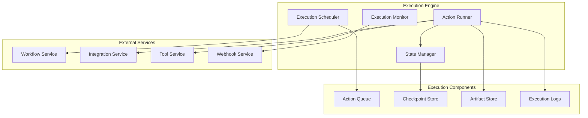

# Service Architecture

The Tolstoy platform consists of multiple specialized microservices, each responsible for specific business domains. This document provides detailed specifications for each service, their APIs, data models, and integration patterns.

## Service Catalog

### Core Application Services

<CardGroup cols={2}>
  <Card title="Workflow Service" icon="diagram-project">
    Manages workflow definitions, templates, and lifecycle operations
  </Card>
  <Card title="Execution Engine" icon="gears">
    Orchestrates workflow execution with step-by-step processing and state management
  </Card>
  <Card title="Integration Service" icon="plug">
    Handles external API integrations and tool connections with authentication
  </Card>
  <Card title="Organization Service" icon="building">
    Multi-tenancy, organization management, and access control
  </Card>
</CardGroup>

<CardGroup cols={2}>
  <Card title="User Service" icon="users">
    User authentication, authorization, and profile management
  </Card>
  <Card title="Webhook Service" icon="webhook">
    Reliable webhook delivery and event management with retry logic
  </Card>
  <Card title="Tool Service" icon="wrench">
    External tool integrations and action implementations
  </Card>
  <Card title="Notification Service" icon="bell">
    Multi-channel notifications and alerting system
  </Card>
</CardGroup>

## Workflow Service

### Service Specification

**Repository**: `services/workflow-service`  
**Language**: Node.js 18 with TypeScript  
**Framework**: Express.js + TypeORM  
**Database**: PostgreSQL (primary), Redis (cache)  
**Port**: 3001  

### Core Functionality

#### Primary Capabilities
- **Workflow Management**: Complete CRUD operations with validation, schema enforcement, and business rule validation
- **Template System**: Pre-built workflow templates with customization options and marketplace integration
- **Version Control**: Git-like versioning with branching, merging, and rollback capabilities
- **Trigger Management**: Multi-type trigger support (webhook, cron, event-driven, manual)
- **Workflow Orchestration**: State machine implementation with conditional logic and parallel execution
- **Analytics Engine**: Real-time workflow performance metrics, usage statistics, and trend analysis

#### Advanced Features
- **Visual Workflow Builder**: Drag-and-drop interface with real-time validation
- **Conditional Branching**: IF/ELSE logic, switch statements, and complex decision trees
- **Loop Support**: For-each, while loops with break conditions and iteration limits
- **Error Handling**: Try-catch blocks, custom error handlers, and retry policies
- **Variable Management**: Global, local, and context variables with type validation
- **Workflow Composition**: Sub-workflows, workflow libraries, and modular components

#### Performance Characteristics
- **Throughput**: 10,000 workflow operations/minute
- **Latency**: &lt;50ms for CRUD operations, &lt;200ms for complex validations
- **Concurrent Workflows**: Up to 50,000 active workflows per organization
- **Template Library**: 500+ pre-built templates across 20+ categories
- **Version History**: Unlimited versions with 90-day retention for deleted workflows

### Limitations and Constraints

#### Technical Limitations
- **Workflow Size**: Maximum 100 actions per workflow
- **Nesting Depth**: Maximum 10 levels of nested conditions/loops
- **Variable Scope**: Maximum 1,000 variables per workflow execution
- **Template Complexity**: Maximum 50 configurable parameters per template
- **Concurrent Executions**: Maximum 1,000 simultaneous executions per workflow

#### Resource Constraints
- **Memory Usage**: 512MB per service instance
- **Database Connections**: 50 concurrent connections per instance
- **API Rate Limits**: 1,000 requests/minute per organization
- **Webhook Payload**: Maximum 10MB per webhook trigger
- **Execution Timeout**: Maximum 24 hours per workflow execution

#### Business Limitations
- **Organization Workflows**: Varies by plan (Free: 10, Pro: 1,000, Enterprise: Unlimited)
- **Template Usage**: Free templates + premium marketplace (paid)
- **Audit Retention**: 30 days (Free), 1 year (Pro), Unlimited (Enterprise)
- **Export Functionality**: JSON/YAML export, API-based bulk operations

### Known Issues and Troubleshooting

#### Common Issues
1. **Workflow Validation Timeout**
   - **Symptom**: Validation takes >30 seconds for complex workflows
   - **Cause**: Deeply nested conditions or circular references
   - **Resolution**: Simplify workflow structure, use sub-workflows
   - **Monitoring**: `workflow_validation_duration_seconds` metric

2. **Template Loading Failures**
   - **Symptom**: Templates fail to load or show incomplete data
   - **Cause**: Template registry connectivity issues
   - **Resolution**: Check network connectivity, restart template cache
   - **Monitoring**: `template_load_errors_total` metric

3. **Version Conflicts**
   - **Symptom**: Cannot save workflow changes due to version conflicts
   - **Cause**: Concurrent modifications by multiple users
   - **Resolution**: Implement optimistic locking with conflict resolution UI
   - **Monitoring**: `workflow_version_conflicts_total` metric

### Data Model

<CodeGroup>
```typescript Workflow Data Model
// workflow-service/src/models/workflow.ts
export interface Workflow {
  id: string;
  organization_id: string;
  name: string;
  description?: string;
  trigger: WorkflowTrigger;
  actions: WorkflowAction[];
  status: 'active' | 'paused' | 'draft' | 'archived';
  version: number;
  tags: string[];
  metadata: Record<string, any>;
  created_by: string;
  created_at: Date;
  updated_at: Date;
}

export interface WorkflowTrigger {
  type: 'webhook' | 'scheduled' | 'manual' | 'event';
  config: {
    // Webhook trigger
    endpoint?: string;
    method?: string;
    headers?: Record<string, string>;
    
    // Scheduled trigger
    cron?: string;
    timezone?: string;
    
    // Event trigger
    event_type?: string;
    filters?: Record<string, any>;
  };
}

export interface WorkflowAction {
  id: string;
  type: string;
  name: string;
  config: Record<string, any>;
  conditions?: ActionCondition[];
  retry_config?: RetryConfig;
  timeout_ms?: number;
}

export interface ActionCondition {
  field: string;
  operator: 'eq' | 'ne' | 'gt' | 'lt' | 'contains' | 'exists';
  value: any;
  logic?: 'and' | 'or';
}

export interface RetryConfig {
  max_attempts: number;
  backoff_type: 'fixed' | 'exponential' | 'linear';
  initial_delay_ms: number;
  max_delay_ms: number;
  multiplier?: number;
}
```

```sql Database Schema
-- workflow-service database schema
CREATE TABLE workflows (
    id UUID PRIMARY KEY DEFAULT gen_random_uuid(),
    organization_id UUID NOT NULL,
    name VARCHAR(255) NOT NULL,
    description TEXT,
    trigger JSONB NOT NULL,
    actions JSONB NOT NULL,
    status VARCHAR(20) NOT NULL DEFAULT 'draft',
    version INTEGER NOT NULL DEFAULT 1,
    tags TEXT[] DEFAULT '{}',
    metadata JSONB DEFAULT '{}',
    created_by UUID NOT NULL,
    created_at TIMESTAMP WITH TIME ZONE DEFAULT NOW(),
    updated_at TIMESTAMP WITH TIME ZONE DEFAULT NOW(),
    
    CONSTRAINT valid_status CHECK (status IN ('active', 'paused', 'draft', 'archived'))
);

CREATE TABLE workflow_versions (
    id UUID PRIMARY KEY DEFAULT gen_random_uuid(),
    workflow_id UUID NOT NULL REFERENCES workflows(id) ON DELETE CASCADE,
    version_number INTEGER NOT NULL,
    changes JSONB NOT NULL,
    trigger JSONB NOT NULL,
    actions JSONB NOT NULL,
    created_by UUID NOT NULL,
    created_at TIMESTAMP WITH TIME ZONE DEFAULT NOW(),
    
    UNIQUE(workflow_id, version_number)
);

CREATE TABLE workflow_templates (
    id UUID PRIMARY KEY DEFAULT gen_random_uuid(),
    name VARCHAR(255) NOT NULL,
    description TEXT,
    category VARCHAR(100),
    trigger JSONB NOT NULL,
    actions JSONB NOT NULL,
    variables JSONB DEFAULT '{}',
    is_public BOOLEAN DEFAULT FALSE,
    created_by UUID NOT NULL,
    created_at TIMESTAMP WITH TIME ZONE DEFAULT NOW()
);

-- Indexes for performance
CREATE INDEX idx_workflows_org_status ON workflows(organization_id, status);
CREATE INDEX idx_workflows_created_at ON workflows(created_at DESC);
CREATE INDEX idx_workflows_tags ON workflows USING GIN(tags);
CREATE INDEX idx_workflow_versions_workflow ON workflow_versions(workflow_id, version_number DESC);
CREATE INDEX idx_workflow_templates_category ON workflow_templates(category, is_public);
```
</CodeGroup>

### Internal API

<CodeGroup>
```typescript Workflow Service API
// workflow-service/src/controllers/internal-controller.ts
export class InternalWorkflowController {
  
  // Get workflow for execution
  async getWorkflowForExecution(req: Request, res: Response) {
    const { workflow_id } = req.params;
    const { organization_id } = req.serviceAuth;

    try {
      const workflow = await this.workflowService.getWorkflowForExecution(
        workflow_id,
        organization_id
      );

      if (!workflow) {
        return res.status(404).json({
          error: 'Workflow not found',
          code: 'WORKFLOW_NOT_FOUND'
        });
      }

      // Include execution metadata
      const executionData = {
        ...workflow,
        execution_metadata: {
          max_execution_time: workflow.metadata.max_execution_time || 300000,
          max_memory_usage: workflow.metadata.max_memory_usage || 512,
          allowed_integrations: workflow.metadata.allowed_integrations || [],
          security_level: workflow.metadata.security_level || 'medium'
        }
      };

      res.json(executionData);
    } catch (error) {
      res.status(500).json({
        error: 'Failed to retrieve workflow',
        code: 'WORKFLOW_RETRIEVAL_ERROR'
      });
    }
  }

  // Bulk workflow operations
  async bulkUpdateWorkflows(req: Request, res: Response) {
    const { workflow_ids, updates } = req.body;
    const { organization_id } = req.serviceAuth;

    try {
      const results = await this.workflowService.bulkUpdate(
        workflow_ids,
        updates,
        organization_id
      );

      res.json({
        updated_count: results.length,
        results
      });
    } catch (error) {
      res.status(500).json({
        error: 'Bulk update failed',
        code: 'BULK_UPDATE_ERROR'
      });
    }
  }

  // Get workflow dependencies
  async getWorkflowDependencies(req: Request, res: Response) {
    const { workflow_id } = req.params;

    try {
      const dependencies = await this.dependencyAnalyzer.analyzeDependencies(workflow_id);
      
      res.json({
        workflow_id,
        dependencies: {
          tools: dependencies.requiredTools,
          integrations: dependencies.requiredIntegrations,
          variables: dependencies.requiredVariables,
          permissions: dependencies.requiredPermissions
        },
        risk_assessment: dependencies.riskLevel
      });
    } catch (error) {
      res.status(500).json({
        error: 'Dependency analysis failed',
        code: 'DEPENDENCY_ANALYSIS_ERROR'
      });
    }
  }
}
```
</CodeGroup>

## Execution Engine

### Service Specification

**Repository**: `services/execution-engine`  
**Language**: Node.js 18 with TypeScript  
**Framework**: Custom execution framework  
**Database**: PostgreSQL (executions), S3 (artifacts)  
**Port**: 3002  

### Execution Architecture



### Execution Data Model

<CodeGroup>
```typescript Execution Model
// execution-engine/src/models/execution.ts
export interface Execution {
  id: string;
  workflow_id: string;
  organization_id: string;
  status: ExecutionStatus;
  input: Record<string, any>;
  output?: Record<string, any>;
  error_message?: string;
  started_at: Date;
  completed_at?: Date;
  metadata: ExecutionMetadata;
  steps: ExecutionStep[];
}

export type ExecutionStatus = 
  | 'pending' 
  | 'running' 
  | 'completed' 
  | 'failed' 
  | 'cancelled' 
  | 'timeout';

export interface ExecutionMetadata {
  triggered_by: 'webhook' | 'schedule' | 'manual' | 'api';
  trigger_source?: string;
  execution_mode: 'sync' | 'async';
  priority: 'low' | 'normal' | 'high' | 'critical';
  resource_limits: {
    max_duration_ms: number;
    max_memory_mb: number;
    max_cpu_percent: number;
  };
  retry_policy: {
    enabled: boolean;
    max_attempts: number;
    backoff_multiplier: number;
  };
}

export interface ExecutionStep {
  id: string;
  execution_id: string;
  action_id: string;
  action_type: string;
  status: ExecutionStatus;
  input: Record<string, any>;
  output?: Record<string, any>;
  error_message?: string;
  started_at: Date;
  completed_at?: Date;
  duration_ms?: number;
  retry_count: number;
  resource_usage: {
    cpu_time_ms: number;
    memory_peak_mb: number;
    network_bytes: number;
  };
}
```

```sql Execution Schema
-- execution-engine database schema
CREATE TABLE executions (
    id UUID PRIMARY KEY DEFAULT gen_random_uuid(),
    workflow_id UUID NOT NULL,
    organization_id UUID NOT NULL,
    status VARCHAR(20) NOT NULL DEFAULT 'pending',
    input JSONB,
    output JSONB,
    error_message TEXT,
    started_at TIMESTAMP WITH TIME ZONE DEFAULT NOW(),
    completed_at TIMESTAMP WITH TIME ZONE,
    metadata JSONB NOT NULL DEFAULT '{}',
    
    CONSTRAINT valid_execution_status CHECK (
        status IN ('pending', 'running', 'completed', 'failed', 'cancelled', 'timeout')
    )
);

CREATE TABLE execution_steps (
    id UUID PRIMARY KEY DEFAULT gen_random_uuid(),
    execution_id UUID NOT NULL REFERENCES executions(id) ON DELETE CASCADE,
    action_id VARCHAR(255) NOT NULL,
    action_type VARCHAR(100) NOT NULL,
    status VARCHAR(20) NOT NULL DEFAULT 'pending',
    input JSONB,
    output JSONB,
    error_message TEXT,
    started_at TIMESTAMP WITH TIME ZONE DEFAULT NOW(),
    completed_at TIMESTAMP WITH TIME ZONE,
    duration_ms INTEGER,
    retry_count INTEGER DEFAULT 0,
    resource_usage JSONB DEFAULT '{}',
    
    CONSTRAINT valid_step_status CHECK (
        status IN ('pending', 'running', 'completed', 'failed', 'cancelled', 'timeout')
    )
);

CREATE TABLE execution_checkpoints (
    id UUID PRIMARY KEY DEFAULT gen_random_uuid(),
    execution_id UUID NOT NULL REFERENCES executions(id) ON DELETE CASCADE,
    step_index INTEGER NOT NULL,
    state JSONB NOT NULL,
    created_at TIMESTAMP WITH TIME ZONE DEFAULT NOW(),
    
    UNIQUE(execution_id, step_index)
);

-- Performance indexes
CREATE INDEX idx_executions_workflow_status ON executions(workflow_id, status);
CREATE INDEX idx_executions_org_status_created ON executions(organization_id, status, created_at DESC);
CREATE INDEX idx_execution_steps_execution ON execution_steps(execution_id, started_at);
CREATE INDEX idx_execution_checkpoints_execution ON execution_checkpoints(execution_id, step_index);

-- Partitioning for large execution tables
CREATE TABLE executions_archive (LIKE executions INCLUDING ALL);
```
</CodeGroup>

### Execution Controller

<CodeGroup>
```typescript Execution Engine API
// execution-engine/src/controllers/execution-controller.ts
export class ExecutionController {
  
  // Start workflow execution
  async executeWorkflow(req: Request, res: Response) {
    const { workflow_id } = req.params;
    const { input, metadata } = req.body;
    const { organization_id, user_id } = req.serviceAuth;

    try {
      // Get workflow definition
      const workflow = await this.workflowClient.getWorkflow(workflow_id, organization_id);
      
      if (!workflow) {
        return res.status(404).json({
          error: 'Workflow not found',
          code: 'WORKFLOW_NOT_FOUND'
        });
      }

      // Validate input against workflow schema
      const inputValidation = await this.validateWorkflowInput(workflow, input);
      if (!inputValidation.valid) {
        return res.status(400).json({
          error: 'Invalid input',
          code: 'INVALID_INPUT',
          validation_errors: inputValidation.errors
        });
      }

      // Create execution record
      const execution = await this.executionService.createExecution({
        workflow_id,
        organization_id,
        input,
        metadata: {
          triggered_by: 'api',
          trigger_source: user_id,
          execution_mode: metadata?.mode || 'async',
          priority: metadata?.priority || 'normal',
          ...metadata
        }
      });

      // Queue for execution
      await this.executionQueue.add('execute-workflow', {
        execution_id: execution.id,
        workflow_id,
        organization_id
      }, {
        priority: this.getPriority(metadata?.priority),
        delay: metadata?.delay || 0
      });

      res.status(202).json({
        execution_id: execution.id,
        status: execution.status,
        started_at: execution.started_at,
        estimated_completion: this.estimateCompletion(workflow)
      });

    } catch (error) {
      await this.auditService.logExecutionError('workflow_execution_start', {
        workflow_id,
        organization_id,
        error: error.message
      });

      res.status(500).json({
        error: 'Execution initiation failed',
        code: 'EXECUTION_START_ERROR'
      });
    }
  }

  // Get execution status and results
  async getExecution(req: Request, res: Response) {
    const { execution_id } = req.params;
    const { organization_id } = req.serviceAuth;

    try {
      const execution = await this.executionService.getExecution(execution_id, organization_id);
      
      if (!execution) {
        return res.status(404).json({
          error: 'Execution not found',
          code: 'EXECUTION_NOT_FOUND'
        });
      }

      // Include step details if requested
      const includeSteps = req.query.include_steps === 'true';
      
      const response = {
        ...execution,
        steps: includeSteps ? await this.executionService.getExecutionSteps(execution_id) : undefined,
        logs: req.query.include_logs === 'true' ? 
          await this.logService.getExecutionLogs(execution_id) : undefined
      };

      res.json(response);
    } catch (error) {
      res.status(500).json({
        error: 'Failed to retrieve execution',
        code: 'EXECUTION_RETRIEVAL_ERROR'
      });
    }
  }

  // Cancel running execution
  async cancelExecution(req: Request, res: Response) {
    const { execution_id } = req.params;
    const { organization_id, user_id } = req.serviceAuth;

    try {
      const execution = await this.executionService.getExecution(execution_id, organization_id);
      
      if (!execution) {
        return res.status(404).json({
          error: 'Execution not found',
          code: 'EXECUTION_NOT_FOUND'
        });
      }

      if (!['pending', 'running'].includes(execution.status)) {
        return res.status(400).json({
          error: 'Execution cannot be cancelled',
          code: 'EXECUTION_NOT_CANCELLABLE',
          current_status: execution.status
        });
      }

      // Signal cancellation
      await this.executionService.cancelExecution(execution_id, user_id);
      
      res.json({
        execution_id,
        status: 'cancelled',
        cancelled_at: new Date().toISOString(),
        cancelled_by: user_id
      });

    } catch (error) {
      res.status(500).json({
        error: 'Execution cancellation failed',
        code: 'EXECUTION_CANCEL_ERROR'
      });
    }
  }

  // Retry failed execution
  async retryExecution(req: Request, res: Response) {
    const { execution_id } = req.params;
    const { from_step } = req.body;
    const { organization_id, user_id } = req.serviceAuth;

    try {
      const originalExecution = await this.executionService.getExecution(execution_id, organization_id);
      
      if (!originalExecution || originalExecution.status !== 'failed') {
        return res.status(400).json({
          error: 'Execution cannot be retried',
          code: 'EXECUTION_NOT_RETRYABLE'
        });
      }

      // Create new execution based on original
      const newExecution = await this.executionService.createRetryExecution({
        original_execution_id: execution_id,
        workflow_id: originalExecution.workflow_id,
        organization_id,
        input: originalExecution.input,
        from_step: from_step || 0,
        retry_metadata: {
          retried_by: user_id,
          retry_reason: req.body.reason
        }
      });

      // Queue for execution
      await this.executionQueue.add('execute-workflow', {
        execution_id: newExecution.id,
        workflow_id: originalExecution.workflow_id,
        organization_id,
        retry_context: {
          original_execution_id: execution_id,
          from_step
        }
      });

      res.json({
        execution_id: newExecution.id,
        original_execution_id: execution_id,
        status: 'pending',
        retry_from_step: from_step
      });

    } catch (error) {
      res.status(500).json({
        error: 'Execution retry failed',
        code: 'EXECUTION_RETRY_ERROR'
      });
    }
  }
}
```
</CodeGroup>

## Integration Service

### Service Specification

**Repository**: `services/integration-service`  
**Language**: Python 3.11 with FastAPI  
**Framework**: FastAPI + SQLAlchemy  
**Database**: PostgreSQL (configs), Redis (cache)  
**Port**: 3003  

### Integration Types

<CodeGroup>
```python Integration Models
# integration-service/src/models/integration.py
from enum import Enum
from typing import Dict, Any, Optional, List
from pydantic import BaseModel, Field

class IntegrationType(str, Enum):
    REST_API = "rest_api"
    GRAPHQL = "graphql"
    DATABASE = "database"
    FILE_SYSTEM = "file_system"
    MESSAGE_QUEUE = "message_queue"
    WEBHOOK = "webhook"

class AuthenticationType(str, Enum):
    API_KEY = "api_key"
    OAUTH2 = "oauth2"
    BASIC_AUTH = "basic_auth"
    BEARER_TOKEN = "bearer_token"
    CUSTOM = "custom"

class Integration(BaseModel):
    id: str
    organization_id: str
    name: str
    description: Optional[str] = None
    type: IntegrationType
    config: Dict[str, Any]
    authentication: AuthenticationConfig
    status: str = "active"
    health_check_url: Optional[str] = None
    rate_limit: Optional[int] = 100
    timeout_ms: int = 30000
    retry_config: RetryConfig
    created_by: str
    created_at: datetime
    updated_at: datetime

class AuthenticationConfig(BaseModel):
    type: AuthenticationType
    config: Dict[str, Any]
    encrypted_credentials: Optional[str] = None
    token_refresh_url: Optional[str] = None
    token_expires_at: Optional[datetime] = None

class RetryConfig(BaseModel):
    max_attempts: int = 3
    backoff_type: str = "exponential"  # fixed, linear, exponential
    initial_delay_ms: int = 1000
    max_delay_ms: int = 60000
    retry_on_status_codes: List[int] = [500, 502, 503, 504, 429]

class IntegrationRequest(BaseModel):
    integration_id: str
    method: str = "GET"
    endpoint: str
    headers: Optional[Dict[str, str]] = None
    body: Optional[Dict[str, Any]] = None
    timeout_ms: Optional[int] = None
    retry_override: Optional[RetryConfig] = None
```

```sql Integration Schema
-- integration-service database schema
CREATE TABLE integrations (
    id UUID PRIMARY KEY DEFAULT gen_random_uuid(),
    organization_id UUID NOT NULL,
    name VARCHAR(255) NOT NULL,
    description TEXT,
    type VARCHAR(50) NOT NULL,
    config JSONB NOT NULL,
    authentication JSONB NOT NULL,
    status VARCHAR(20) DEFAULT 'active',
    health_check_url TEXT,
    rate_limit INTEGER DEFAULT 100,
    timeout_ms INTEGER DEFAULT 30000,
    retry_config JSONB NOT NULL DEFAULT '{}',
    created_by UUID NOT NULL,
    created_at TIMESTAMP WITH TIME ZONE DEFAULT NOW(),
    updated_at TIMESTAMP WITH TIME ZONE DEFAULT NOW(),
    
    CONSTRAINT valid_integration_type CHECK (
        type IN ('rest_api', 'graphql', 'database', 'file_system', 'message_queue', 'webhook')
    ),
    CONSTRAINT valid_status CHECK (status IN ('active', 'paused', 'error', 'disabled'))
);

CREATE TABLE integration_requests (
    id UUID PRIMARY KEY DEFAULT gen_random_uuid(),
    integration_id UUID NOT NULL REFERENCES integrations(id),
    execution_id UUID,
    method VARCHAR(10) NOT NULL,
    endpoint TEXT NOT NULL,
    request_headers JSONB,
    request_body JSONB,
    response_status INTEGER,
    response_headers JSONB,
    response_body JSONB,
    duration_ms INTEGER,
    success BOOLEAN,
    error_message TEXT,
    created_at TIMESTAMP WITH TIME ZONE DEFAULT NOW()
);

CREATE TABLE integration_health (
    integration_id UUID NOT NULL REFERENCES integrations(id),
    status VARCHAR(20) NOT NULL,
    last_check_at TIMESTAMP WITH TIME ZONE DEFAULT NOW(),
    response_time_ms INTEGER,
    error_message TEXT,
    consecutive_failures INTEGER DEFAULT 0,
    
    PRIMARY KEY (integration_id)
);

-- Indexes
CREATE INDEX idx_integrations_org_status ON integrations(organization_id, status);
CREATE INDEX idx_integration_requests_integration ON integration_requests(integration_id, created_at DESC);
CREATE INDEX idx_integration_health_status ON integration_health(status, last_check_at);
```
</CodeGroup>

### Integration Request Handler

<CodeGroup>
```python Integration Request Handler
# integration-service/src/services/request_handler.py
import aiohttp
import asyncio
import time
from typing import Dict, Any, Optional

class IntegrationRequestHandler:
    def __init__(self):
        self.session_pool = {}
        self.rate_limiters = {}
    
    async def make_request(
        self,
        integration: Integration,
        request: IntegrationRequest,
        context: Dict[str, Any] = None
    ) -> Dict[str, Any]:
        
        # Get or create HTTP session
        session = await self.get_session(integration.id)
        
        # Apply rate limiting
        await self.apply_rate_limit(integration.id, integration.rate_limit)
        
        # Prepare request
        url = self.build_url(integration.config.get('base_url'), request.endpoint)
        headers = await self.prepare_headers(integration, request.headers or {})
        
        # Execute request with retries
        return await self.execute_with_retries(
            session,
            request.method,
            url,
            headers=headers,
            json=request.body,
            timeout=request.timeout_ms or integration.timeout_ms,
            retry_config=request.retry_override or integration.retry_config,
            integration_id=integration.id
        )
    
    async def execute_with_retries(
        self,
        session: aiohttp.ClientSession,
        method: str,
        url: str,
        headers: Dict[str, str],
        json: Optional[Dict[str, Any]] = None,
        timeout: int = 30000,
        retry_config: RetryConfig = None,
        integration_id: str = None
    ) -> Dict[str, Any]:
        
        last_error = None
        
        for attempt in range(retry_config.max_attempts):
            try:
                start_time = time.time()
                
                async with session.request(
                    method,
                    url,
                    headers=headers,
                    json=json,
                    timeout=aiohttp.ClientTimeout(total=timeout/1000)
                ) as response:
                    
                    duration_ms = int((time.time() - start_time) * 1000)
                    
                    # Log request
                    await self.log_request(
                        integration_id,
                        method,
                        url,
                        headers,
                        json,
                        response.status,
                        dict(response.headers),
                        await response.text(),
                        duration_ms,
                        response.ok
                    )
                    
                    # Check if retry is needed
                    if response.status in retry_config.retry_on_status_codes and attempt < retry_config.max_attempts - 1:
                        delay = self.calculate_backoff_delay(attempt, retry_config)
                        await asyncio.sleep(delay / 1000)
                        continue
                    
                    # Return response
                    try:
                        response_data = await response.json()
                    except:
                        response_data = await response.text()
                    
                    return {
                        'success': response.ok,
                        'status_code': response.status,
                        'headers': dict(response.headers),
                        'data': response_data,
                        'duration_ms': duration_ms,
                        'attempt': attempt + 1
                    }
            
            except asyncio.TimeoutError:
                last_error = f"Request timeout after {timeout}ms"
                if attempt < retry_config.max_attempts - 1:
                    delay = self.calculate_backoff_delay(attempt, retry_config)
                    await asyncio.sleep(delay / 1000)
            
            except Exception as error:
                last_error = str(error)
                if attempt < retry_config.max_attempts - 1:
                    delay = self.calculate_backoff_delay(attempt, retry_config)
                    await asyncio.sleep(delay / 1000)
        
        # All retries failed
        await self.log_request(
            integration_id,
            method,
            url,
            headers,
            json,
            0,
            {},
            last_error,
            0,
            False
        )
        
        raise Exception(f"Request failed after {retry_config.max_attempts} attempts: {last_error}")
    
    async def prepare_headers(
        self,
        integration: Integration,
        request_headers: Dict[str, str]
    ) -> Dict[str, str]:
        
        headers = {
            'User-Agent': 'Tolstoy-Integration/1.0',
            'Content-Type': 'application/json',
            **request_headers
        }
        
        # Add authentication headers
        auth_config = integration.authentication
        
        if auth_config.type == AuthenticationType.API_KEY:
            api_key = await self.decrypt_credential(auth_config.encrypted_credentials)
            key_header = auth_config.config.get('header_name', 'X-API-Key')
            headers[key_header] = api_key
        
        elif auth_config.type == AuthenticationType.BEARER_TOKEN:
            token = await self.get_bearer_token(integration.id, auth_config)
            headers['Authorization'] = f'Bearer {token}'
        
        elif auth_config.type == AuthenticationType.OAUTH2:
            token = await self.get_oauth_token(integration.id, auth_config)
            headers['Authorization'] = f'Bearer {token}'
        
        elif auth_config.type == AuthenticationType.BASIC_AUTH:
            credentials = await self.decrypt_credential(auth_config.encrypted_credentials)
            encoded = base64.b64encode(credentials.encode()).decode()
            headers['Authorization'] = f'Basic {encoded}'
        
        return headers
    
    def calculate_backoff_delay(self, attempt: int, retry_config: RetryConfig) -> int:
        if retry_config.backoff_type == "fixed":
            return retry_config.initial_delay_ms
        
        elif retry_config.backoff_type == "linear":
            return min(
                retry_config.initial_delay_ms * (attempt + 1),
                retry_config.max_delay_ms
            )
        
        elif retry_config.backoff_type == "exponential":
            delay = retry_config.initial_delay_ms * (2 ** attempt)
            return min(delay, retry_config.max_delay_ms)
        
        return retry_config.initial_delay_ms
    
    async def get_session(self, integration_id: str) -> aiohttp.ClientSession:
        if integration_id not in self.session_pool:
            connector = aiohttp.TCPConnector(
                limit=100,
                limit_per_host=20,
                keepalive_timeout=300,
                enable_cleanup_closed=True
            )
            
            self.session_pool[integration_id] = aiohttp.ClientSession(
                connector=connector,
                timeout=aiohttp.ClientTimeout(total=300)
            )
        
        return self.session_pool[integration_id]
```
</CodeGroup>

## Organization Service

### Service Specification

**Repository**: `services/organization-service`  
**Language**: Go 1.21  
**Framework**: Gin HTTP framework  
**Database**: PostgreSQL with row-level security  
**Port**: 3004  

### Multi-Tenancy Implementation

<CodeGroup>
```go Organization Service
// organization-service/internal/models/organization.go
package models

import (
    "time"
    "github.com/google/uuid"
    "gorm.io/gorm"
)

type Organization struct {
    ID          uuid.UUID `json:"id" gorm:"type:uuid;primary_key;default:gen_random_uuid()"`
    Name        string    `json:"name" gorm:"not null;size:255"`
    Slug        string    `json:"slug" gorm:"uniqueIndex;not null;size:100"`
    Plan        string    `json:"plan" gorm:"not null;default:free"`
    Status      string    `json:"status" gorm:"not null;default:active"`
    Settings    JSON      `json:"settings" gorm:"type:jsonb;default:'{}'"`
    Quotas      JSON      `json:"quotas" gorm:"type:jsonb;default:'{}'"`
    CreatedAt   time.Time `json:"created_at"`
    UpdatedAt   time.Time `json:"updated_at"`
    DeletedAt   gorm.DeletedAt `json:"-" gorm:"index"`
    
    // Relationships
    Members     []OrganizationMember `json:"members,omitempty"`
    Workflows   []Workflow          `json:"workflows,omitempty"`
    APIKeys     []APIKey            `json:"api_keys,omitempty"`
}

type OrganizationMember struct {
    ID             uuid.UUID `json:"id" gorm:"type:uuid;primary_key;default:gen_random_uuid()"`
    OrganizationID uuid.UUID `json:"organization_id" gorm:"type:uuid;not null"`
    UserID         uuid.UUID `json:"user_id" gorm:"type:uuid;not null"`
    Role           string    `json:"role" gorm:"not null"`
    Permissions    []string  `json:"permissions" gorm:"type:text[]"`
    Status         string    `json:"status" gorm:"not null;default:active"`
    InvitedBy      uuid.UUID `json:"invited_by" gorm:"type:uuid"`
    JoinedAt       time.Time `json:"joined_at"`
    CreatedAt      time.Time `json:"created_at"`
    
    // Foreign keys
    Organization   Organization `json:"organization,omitempty"`
    User          User         `json:"user,omitempty"`
}

type OrganizationQuotas struct {
    MaxWorkflows      int `json:"max_workflows"`
    MaxExecutions     int `json:"max_executions_per_month"`
    MaxIntegrations   int `json:"max_integrations"`
    MaxUsers          int `json:"max_users"`
    MaxAPIKeys        int `json:"max_api_keys"`
    MaxWebhooks       int `json:"max_webhooks"`
    MaxStorageGB      int `json:"max_storage_gb"`
    MaxBandwidthGB    int `json:"max_bandwidth_gb"`
}
```

```go Organization Service Logic
// organization-service/internal/services/organization.go
package services

import (
    "context"
    "fmt"
    "github.com/google/uuid"
    "organization-service/internal/models"
)

type OrganizationService struct {
    db     *gorm.DB
    cache  *redis.Client
    audit  *AuditService
    quotas *QuotaService
}

func (s *OrganizationService) CreateOrganization(
    ctx context.Context,
    req *CreateOrganizationRequest,
    createdBy uuid.UUID,
) (*models.Organization, error) {
    
    // Validate organization data
    if err := s.validateOrganizationData(req); err != nil {
        return nil, fmt.Errorf("validation failed: %w", err)
    }

    // Check if slug is available
    if exists, err := s.slugExists(req.Slug); err != nil {
        return nil, err
    } else if exists {
        return nil, fmt.Errorf("organization slug already exists")
    }

    // Create organization
    org := &models.Organization{
        Name:     req.Name,
        Slug:     req.Slug,
        Plan:     req.Plan,
        Status:   "active",
        Settings: req.Settings,
        Quotas:   s.getDefaultQuotas(req.Plan),
    }

    tx := s.db.Begin()
    defer func() {
        if r := recover(); r != nil {
            tx.Rollback()
        }
    }()

    if err := tx.Create(org).Error; err != nil {
        tx.Rollback()
        return nil, fmt.Errorf("failed to create organization: %w", err)
    }

    // Add creator as admin
    member := &models.OrganizationMember{
        OrganizationID: org.ID,
        UserID:         createdBy,
        Role:          "admin",
        Permissions:   s.getAdminPermissions(),
        Status:        "active",
        JoinedAt:      time.Now(),
    }

    if err := tx.Create(member).Error; err != nil {
        tx.Rollback()
        return nil, fmt.Errorf("failed to add admin member: %w", err)
    }

    tx.Commit()

    // Cache organization data
    await s.cacheOrganization(org)

    // Audit log
    await s.audit.LogOrganizationCreated(org.ID, createdBy)

    // Initialize default resources
    go s.initializeDefaultResources(org.ID)

    return org, nil
}

func (s *OrganizationService) GetOrganizationWithContext(
    ctx context.Context,
    orgID uuid.UUID,
    userID uuid.UUID,
) (*models.Organization, error) {
    
    // Check user membership
    member, err := s.getUserMembership(orgID, userID)
    if err != nil {
        return nil, fmt.Errorf("access denied: %w", err)
    }

    // Try cache first
    if cached := s.getCachedOrganization(orgID); cached != nil {
        return cached, nil
    }

    // Query database with RLS
    var org models.Organization
    err = s.db.WithContext(ctx).
        Preload("Members").
        Where("id = ? AND id IN (SELECT organization_id FROM organization_members WHERE user_id = ?)", orgID, userID).
        First(&org).Error

    if err != nil {
        return nil, fmt.Errorf("organization not found: %w", err)
    }

    // Filter sensitive data based on user role
    s.filterSensitiveData(&org, member.Role)

    // Update cache
    await s.cacheOrganization(&org)

    return &org, nil
}

func (s *OrganizationService) CheckQuotaUsage(
    orgID uuid.UUID,
    quotaType string,
) (*QuotaUsage, error) {
    
    quotas := s.getOrganizationQuotas(orgID)
    usage, err := s.quotas.GetCurrentUsage(orgID, quotaType)
    
    if err != nil {
        return nil, err
    }

    return &QuotaUsage{
        QuotaType:    quotaType,
        CurrentUsage: usage.Current,
        Limit:        quotas.GetLimit(quotaType),
        Percentage:   float64(usage.Current) / float64(quotas.GetLimit(quotaType)) * 100,
        ResetDate:    usage.ResetDate,
    }, nil
}

func (s *OrganizationService) EnforceQuota(
    orgID uuid.UUID,
    quotaType string,
    increment int,
) error {
    
    usage, err := s.CheckQuotaUsage(orgID, quotaType)
    if err != nil {
        return err
    }

    if usage.CurrentUsage+increment > usage.Limit {
        return &QuotaExceededError{
            QuotaType:    quotaType,
            CurrentUsage: usage.CurrentUsage,
            Limit:        usage.Limit,
            Requested:    increment,
        }
    }

    // Increment usage
    return s.quotas.IncrementUsage(orgID, quotaType, increment)
}
```
</CodeGroup>

## Tool Service

### Service Specification

**Repository**: `services/tool-service`  
**Language**: Node.js 18 with TypeScript  
**Framework**: NestJS  
**Database**: PostgreSQL (configs), Redis (cache)  
**Port**: 3005  

### Tool Integration Framework

<CodeGroup>
```typescript Tool Framework
// tool-service/src/interfaces/tool.interface.ts
export interface Tool {
  id: string;
  name: string;
  category: ToolCategory;
  description: string;
  version: string;
  author: string;
  icon_url?: string;
  documentation_url?: string;
  
  // Capabilities
  actions: ToolAction[];
  triggers: ToolTrigger[];
  authentication: ToolAuthentication;
  
  // Configuration
  config_schema: JSONSchema;
  required_permissions: string[];
  rate_limits: RateLimitConfig;
  
  // Metadata
  is_official: boolean;
  is_verified: boolean;
  status: 'active' | 'deprecated' | 'beta';
  created_at: Date;
  updated_at: Date;
}

export enum ToolCategory {
  COMMUNICATION = 'communication',
  DATA_PROCESSING = 'data_processing',
  INTEGRATION = 'integration',
  AUTOMATION = 'automation',
  ANALYTICS = 'analytics',
  SECURITY = 'security',
  DEVOPS = 'devops',
  CUSTOM = 'custom'
}

export interface ToolAction {
  id: string;
  name: string;
  description: string;
  input_schema: JSONSchema;
  output_schema: JSONSchema;
  examples: ActionExample[];
  execution_config: {
    timeout_ms: number;
    memory_limit_mb: number;
    cpu_limit_percent: number;
    network_access: boolean;
  };
}

export interface ToolTrigger {
  id: string;
  name: string;
  description: string;
  event_type: string;
  filter_schema: JSONSchema;
  webhook_config?: {
    endpoint: string;
    method: string;
    headers: Record<string, string>;
  };
}
```

```typescript Tool Execution Engine
// tool-service/src/services/tool-executor.ts
export class ToolExecutor {
  private readonly actionExecutors = new Map<string, ActionExecutor>();
  private readonly sandboxManager: SandboxManager;

  async executeAction(
    toolId: string,
    actionId: string,
    input: Record<string, any>,
    context: ExecutionContext
  ): Promise<ActionResult> {
    
    const tool = await this.toolService.getTool(toolId);
    const action = tool.actions.find(a => a.id === actionId);
    
    if (!action) {
      throw new Error(`Action ${actionId} not found in tool ${toolId}`);
    }

    // Validate input against schema
    const validation = await this.validateInput(input, action.input_schema);
    if (!validation.valid) {
      throw new ValidationError('Invalid input', validation.errors);
    }

    // Create execution sandbox
    const sandbox = await this.sandboxManager.createSandbox({
      toolId,
      actionId,
      timeout: action.execution_config.timeout_ms,
      memoryLimit: action.execution_config.memory_limit_mb,
      cpuLimit: action.execution_config.cpu_limit_percent,
      networkAccess: action.execution_config.network_access
    });

    try {
      // Get or create action executor
      const executor = await this.getActionExecutor(tool, action);
      
      // Execute action in sandbox
      const result = await sandbox.execute(async () => {
        return await executor.execute(input, context);
      });

      // Validate output
      const outputValidation = await this.validateOutput(result.output, action.output_schema);
      if (!outputValidation.valid) {
        console.warn('Action output validation failed:', outputValidation.errors);
      }

      return {
        success: true,
        output: result.output,
        execution_time_ms: result.executionTime,
        resource_usage: result.resourceUsage,
        logs: result.logs
      };

    } catch (error) {
      return {
        success: false,
        error: error.message,
        error_type: error.constructor.name,
        execution_time_ms: Date.now() - context.startTime,
        logs: sandbox.getLogs()
      };
    } finally {
      await sandbox.cleanup();
    }
  }

  private async getActionExecutor(tool: Tool, action: ToolAction): Promise<ActionExecutor> {
    const key = `${tool.id}:${action.id}`;
    
    if (!this.actionExecutors.has(key)) {
      const executor = await this.createActionExecutor(tool, action);
      this.actionExecutors.set(key, executor);
    }

    return this.actionExecutors.get(key)!;
  }

  private async createActionExecutor(tool: Tool, action: ToolAction): Promise<ActionExecutor> {
    // Load executor based on tool type
    switch (tool.category) {
      case ToolCategory.COMMUNICATION:
        return new CommunicationExecutor(tool, action);
      case ToolCategory.DATA_PROCESSING:
        return new DataProcessingExecutor(tool, action);
      case ToolCategory.INTEGRATION:
        return new IntegrationExecutor(tool, action);
      default:
        return new GenericExecutor(tool, action);
    }
  }
}

interface ActionExecutor {
  execute(input: Record<string, any>, context: ExecutionContext): Promise<ActionExecutionResult>;
}

interface ExecutionContext {
  execution_id: string;
  workflow_id: string;
  organization_id: string;
  user_id?: string;
  step_index: number;
  variables: Record<string, any>;
  startTime: number;
  trace_id: string;
}

interface ActionResult {
  success: boolean;
  output?: Record<string, any>;
  error?: string;
  error_type?: string;
  execution_time_ms: number;
  resource_usage?: ResourceUsage;
  logs?: string[];
}
```
</CodeGroup>

## Inter-Service Communication

### Service Discovery

<CodeGroup>
```typescript Service Discovery
// shared/src/services/service-discovery.ts
export class ServiceDiscovery {
  private readonly services = new Map<string, ServiceEndpoint>();
  private readonly healthCheckers = new Map<string, HealthChecker>();

  async registerService(
    serviceName: string,
    endpoint: ServiceEndpoint
  ): Promise<void> {
    
    this.services.set(serviceName, endpoint);
    
    // Start health checking
    const healthChecker = new HealthChecker(endpoint);
    this.healthCheckers.set(serviceName, healthChecker);
    
    await healthChecker.start();
    
    console.log(`Service registered: ${serviceName} at ${endpoint.url}`);
  }

  async getServiceEndpoint(serviceName: string): Promise<ServiceEndpoint | null> {
    const endpoint = this.services.get(serviceName);
    
    if (!endpoint) {
      return null;
    }

    // Check health
    const healthChecker = this.healthCheckers.get(serviceName);
    if (healthChecker && !healthChecker.isHealthy()) {
      console.warn(`Service ${serviceName} is unhealthy`);
      return null;
    }

    return endpoint;
  }

  async discoverServices(): Promise<Map<string, ServiceEndpoint>> {
    // In Kubernetes, use service discovery
    if (process.env.KUBERNETES_SERVICE_HOST) {
      return await this.discoverKubernetesServices();
    }
    
    // In development, use static configuration
    return this.getStaticServiceConfiguration();
  }

  private async discoverKubernetesServices(): Promise<Map<string, ServiceEndpoint>> {
    const k8s = require('@kubernetes/client-node');
    const kc = new k8s.KubeConfig();
    kc.loadFromCluster();
    
    const k8sApi = kc.makeApiClient(k8s.CoreV1Api);
    const namespace = process.env.KUBERNETES_NAMESPACE || 'default';
    
    try {
      const services = await k8sApi.listNamespacedService(namespace);
      const endpoints = new Map<string, ServiceEndpoint>();
      
      for (const service of services.body.items) {
        if (service.metadata?.labels?.['app.kubernetes.io/component'] === 'tolstoy-service') {
          const serviceName = service.metadata.name;
          const port = service.spec?.ports?.[0]?.port || 80;
          
          endpoints.set(serviceName, {
            name: serviceName,
            url: `http://${serviceName}.${namespace}.svc.cluster.local:${port}`,
            health_check_path: '/health',
            version: service.metadata.labels?.['app.kubernetes.io/version'] || 'unknown'
          });
        }
      }
      
      return endpoints;
    } catch (error) {
      console.error('Kubernetes service discovery failed:', error);
      return new Map();
    }
  }
}

interface ServiceEndpoint {
  name: string;
  url: string;
  health_check_path: string;
  version: string;
}

class HealthChecker {
  private isRunning = false;
  private healthy = true;
  private readonly checkInterval = 30000; // 30 seconds

  constructor(private endpoint: ServiceEndpoint) {}

  async start(): Promise<void> {
    this.isRunning = true;
    this.scheduleHealthCheck();
  }

  async stop(): Promise<void> {
    this.isRunning = false;
  }

  isHealthy(): boolean {
    return this.healthy;
  }

  private scheduleHealthCheck(): void {
    if (!this.isRunning) return;

    setTimeout(async () => {
      await this.performHealthCheck();
      this.scheduleHealthCheck();
    }, this.checkInterval);
  }

  private async performHealthCheck(): Promise<void> {
    try {
      const response = await fetch(
        `${this.endpoint.url}${this.endpoint.health_check_path}`,
        { timeout: 5000 }
      );
      
      this.healthy = response.ok;
      
      if (!this.healthy) {
        console.warn(`Health check failed for ${this.endpoint.name}: ${response.status}`);
      }
    } catch (error) {
      this.healthy = false;
      console.error(`Health check error for ${this.endpoint.name}:`, error.message);
    }
  }
}
```
</CodeGroup>

### API Client Generation

<CodeGroup>
```typescript Service Client Factory
// shared/src/clients/service-client-factory.ts
export class ServiceClientFactory {
  private readonly clients = new Map<string, any>();
  private readonly serviceDiscovery: ServiceDiscovery;
  private readonly authService: AuthService;

  async getClient<T>(serviceName: string): Promise<T> {
    if (this.clients.has(serviceName)) {
      return this.clients.get(serviceName);
    }

    const endpoint = await this.serviceDiscovery.getServiceEndpoint(serviceName);
    if (!endpoint) {
      throw new Error(`Service ${serviceName} not found`);
    }

    const client = await this.createServiceClient(serviceName, endpoint);
    this.clients.set(serviceName, client);
    
    return client;
  }

  private async createServiceClient(serviceName: string, endpoint: ServiceEndpoint): Promise<any> {
    // Generate service token
    const token = await this.authService.generateServiceToken(
      process.env.SERVICE_NAME!,
      serviceName,
      this.getRequiredScopes(serviceName)
    );

    const baseConfig = {
      baseURL: endpoint.url,
      timeout: 30000,
      headers: {
        'Authorization': `Bearer ${token}`,
        'X-Service-Name': process.env.SERVICE_NAME,
        'X-Service-Version': process.env.SERVICE_VERSION,
        'Content-Type': 'application/json'
      }
    };

    // Create service-specific client
    switch (serviceName) {
      case 'workflow-service':
        return new WorkflowServiceClient(baseConfig);
      case 'execution-engine':
        return new ExecutionEngineClient(baseConfig);
      case 'integration-service':
        return new IntegrationServiceClient(baseConfig);
      case 'organization-service':
        return new OrganizationServiceClient(baseConfig);
      default:
        return new GenericServiceClient(baseConfig);
    }
  }

  private getRequiredScopes(serviceName: string): string[] {
    const scopeMap = {
      'workflow-service': ['workflow:read', 'workflow:write'],
      'execution-engine': ['execution:read', 'execution:write'],
      'integration-service': ['integration:read', 'integration:execute'],
      'organization-service': ['organization:read'],
      'user-service': ['user:read'],
      'webhook-service': ['webhook:send'],
      'tool-service': ['tool:read', 'tool:execute']
    };

    return scopeMap[serviceName] || ['read'];
  }
}

// Service-specific client implementations
export class WorkflowServiceClient {
  constructor(private config: AxiosRequestConfig) {}

  async getWorkflow(workflowId: string, organizationId: string): Promise<Workflow> {
    const response = await axios.get(
      `/internal/v1/workflows/${workflowId}`,
      {
        ...this.config,
        headers: {
          ...this.config.headers,
          'X-Organization-ID': organizationId
        }
      }
    );
    
    return response.data;
  }

  async createWorkflow(workflow: CreateWorkflowRequest): Promise<Workflow> {
    const response = await axios.post(
      '/internal/v1/workflows',
      workflow,
      this.config
    );
    
    return response.data;
  }

  async bulkGetWorkflows(workflowIds: string[], organizationId: string): Promise<Workflow[]> {
    const response = await axios.post(
      '/internal/v1/workflows/bulk',
      { workflow_ids: workflowIds },
      {
        ...this.config,
        headers: {
          ...this.config.headers,
          'X-Organization-ID': organizationId
        }
      }
    );
    
    return response.data;
  }
}

export class ExecutionEngineClient {
  constructor(private config: AxiosRequestConfig) {}

  async executeWorkflow(
    workflowId: string,
    input: Record<string, any>,
    options?: ExecutionOptions
  ): Promise<ExecutionResponse> {
    const response = await axios.post(
      `/internal/v1/executions`,
      {
        workflow_id: workflowId,
        input,
        options
      },
      this.config
    );
    
    return response.data;
  }

  async getExecution(executionId: string): Promise<Execution> {
    const response = await axios.get(
      `/internal/v1/executions/${executionId}`,
      this.config
    );
    
    return response.data;
  }

  async cancelExecution(executionId: string): Promise<void> {
    await axios.post(
      `/internal/v1/executions/${executionId}/cancel`,
      {},
      this.config
    );
  }
}
```
</CodeGroup>

## Service Resilience Patterns

### Circuit Breaker Implementation

<CodeGroup>
```typescript Circuit Breaker
// shared/src/patterns/circuit-breaker.ts
export class CircuitBreaker {
  private state: 'CLOSED' | 'OPEN' | 'HALF_OPEN' = 'CLOSED';
  private failureCount = 0;
  private lastFailureTime = 0;
  private nextAttempt = 0;

  constructor(
    private readonly options: {
      failureThreshold: number;
      recoveryTimeout: number;
      monitoringPeriod: number;
    }
  ) {}

  async execute<T>(operation: () => Promise<T>): Promise<T> {
    if (this.state === 'OPEN') {
      if (Date.now() < this.nextAttempt) {
        throw new CircuitBreakerOpenError('Circuit breaker is OPEN');
      }
      
      // Transition to half-open
      this.state = 'HALF_OPEN';
    }

    try {
      const result = await operation();
      
      // Success resets the circuit breaker
      this.onSuccess();
      return result;
      
    } catch (error) {
      this.onFailure();
      throw error;
    }
  }

  private onSuccess(): void {
    this.failureCount = 0;
    this.state = 'CLOSED';
  }

  private onFailure(): void {
    this.failureCount++;
    this.lastFailureTime = Date.now();

    if (this.failureCount >= this.options.failureThreshold) {
      this.state = 'OPEN';
      this.nextAttempt = Date.now() + this.options.recoveryTimeout;
    }
  }

  getState(): string {
    return this.state;
  }

  getMetrics() {
    return {
      state: this.state,
      failure_count: this.failureCount,
      last_failure_time: this.lastFailureTime,
      next_attempt: this.nextAttempt
    };
  }
}

// Usage in service clients
export class ResilientServiceClient {
  private readonly circuitBreakers = new Map<string, CircuitBreaker>();

  async makeRequest(serviceName: string, operation: () => Promise<any>): Promise<any> {
    const circuitBreaker = this.getCircuitBreaker(serviceName);
    
    return await circuitBreaker.execute(operation);
  }

  private getCircuitBreaker(serviceName: string): CircuitBreaker {
    if (!this.circuitBreakers.has(serviceName)) {
      this.circuitBreakers.set(serviceName, new CircuitBreaker({
        failureThreshold: 5,
        recoveryTimeout: 60000, // 1 minute
        monitoringPeriod: 10000  // 10 seconds
      }));
    }

    return this.circuitBreakers.get(serviceName)!;
  }
}
```
</CodeGroup>

### Bulkhead Pattern

<CodeGroup>
```typescript Bulkhead Pattern
// shared/src/patterns/bulkhead.ts
export class BulkheadManager {
  private readonly pools = new Map<string, ResourcePool>();

  createPool(
    name: string,
    config: {
      maxSize: number;
      coreSize: number;
      keepAliveTime: number;
      queueSize: number;
    }
  ): ResourcePool {
    
    const pool = new ResourcePool(config);
    this.pools.set(name, pool);
    
    return pool;
  }

  async executeInPool<T>(
    poolName: string,
    operation: () => Promise<T>
  ): Promise<T> {
    
    const pool = this.pools.get(poolName);
    if (!pool) {
      throw new Error(`Pool ${poolName} not found`);
    }

    return await pool.execute(operation);
  }

  getPoolMetrics(poolName: string) {
    const pool = this.pools.get(poolName);
    return pool?.getMetrics();
  }
}

class ResourcePool {
  private activeOperations = 0;
  private queuedOperations = 0;
  private readonly queue: Array<{
    operation: () => Promise<any>;
    resolve: (value: any) => void;
    reject: (error: any) => void;
  }> = [];

  constructor(private readonly config: {
    maxSize: number;
    coreSize: number;
    keepAliveTime: number;
    queueSize: number;
  }) {}

  async execute<T>(operation: () => Promise<T>): Promise<T> {
    return new Promise((resolve, reject) => {
      if (this.activeOperations < this.config.maxSize) {
        this.executeImmediately(operation, resolve, reject);
      } else if (this.queuedOperations < this.config.queueSize) {
        this.queue.push({ operation, resolve, reject });
        this.queuedOperations++;
      } else {
        reject(new Error('Resource pool exhausted'));
      }
    });
  }

  private async executeImmediately<T>(
    operation: () => Promise<T>,
    resolve: (value: T) => void,
    reject: (error: any) => void
  ): Promise<void> {
    
    this.activeOperations++;
    
    try {
      const result = await operation();
      resolve(result);
    } catch (error) {
      reject(error);
    } finally {
      this.activeOperations--;
      this.processQueue();
    }
  }

  private processQueue(): void {
    if (this.queue.length > 0 && this.activeOperations < this.config.maxSize) {
      const next = this.queue.shift()!;
      this.queuedOperations--;
      this.executeImmediately(next.operation, next.resolve, next.reject);
    }
  }

  getMetrics() {
    return {
      active_operations: this.activeOperations,
      queued_operations: this.queuedOperations,
      pool_utilization: this.activeOperations / this.config.maxSize,
      queue_utilization: this.queuedOperations / this.config.queueSize
    };
  }
}

// Pre-configured pools for different operation types
export const bulkheadManager = new BulkheadManager();

// Database operations pool
bulkheadManager.createPool('database', {
  maxSize: 20,
  coreSize: 5,
  keepAliveTime: 300000,
  queueSize: 100
});

// External API pool
bulkheadManager.createPool('external-api', {
  maxSize: 50,
  coreSize: 10,
  keepAliveTime: 60000,
  queueSize: 200
});

// CPU-intensive operations pool
bulkheadManager.createPool('cpu-intensive', {
  maxSize: 4,
  coreSize: 2,
  keepAliveTime: 600000,
  queueSize: 50
});
```
</CodeGroup>

## Service Deployment Patterns

### Blue-Green Deployment

<CodeGroup>
```yaml Blue-Green Service Deployment
# k8s/service-deployment.yml
apiVersion: argoproj.io/v1alpha1
kind: Rollout
metadata:
  name: workflow-service
  namespace: production
spec:
  replicas: 5
  strategy:
    blueGreen:
      activeService: workflow-service-active
      previewService: workflow-service-preview
      
      prePromotionAnalysis:
        templates:
        - templateName: success-rate
        - templateName: response-time
        args:
        - name: service-name
          value: workflow-service-preview
      
      postPromotionAnalysis:
        templates:
        - templateName: success-rate
        args:
        - name: service-name
          value: workflow-service-active
      
      scaleDownDelaySeconds: 30
      autoPromotionEnabled: false

  selector:
    matchLabels:
      app: workflow-service
  
  template:
    metadata:
      labels:
        app: workflow-service
    spec:
      containers:
      - name: workflow-service
        image: tolstoy/workflow-service:latest
        ports:
        - containerPort: 3001
        env:
        - name: SERVICE_NAME
          value: workflow-service
        - name: SERVICE_VERSION
          value: "{{ .Values.image.tag }}"
        envFrom:
        - configMapRef:
            name: workflow-service-config
        - secretRef:
            name: workflow-service-secrets
        
        resources:
          requests:
            cpu: 200m
            memory: 256Mi
          limits:
            cpu: 1000m
            memory: 1Gi
        
        livenessProbe:
          httpGet:
            path: /health
            port: 3001
          initialDelaySeconds: 30
          periodSeconds: 10
        
        readinessProbe:
          httpGet:
            path: /ready
            port: 3001
          initialDelaySeconds: 5
          periodSeconds: 5

---
# Analysis templates for deployment verification
apiVersion: argoproj.io/v1alpha1
kind: AnalysisTemplate
metadata:
  name: success-rate
spec:
  args:
  - name: service-name
  metrics:
  - name: success-rate
    provider:
      prometheus:
        address: http://prometheus:9090
        query: |
          sum(rate(http_requests_total{service="{{args.service-name}}",status!~"5.."}[2m])) /
          sum(rate(http_requests_total{service="{{args.service-name}}"}[2m]))
    successCondition: result[0] >= 0.95
    interval: 30s
    count: 5

---
apiVersion: argoproj.io/v1alpha1
kind: AnalysisTemplate
metadata:
  name: response-time
spec:
  args:
  - name: service-name
  metrics:
  - name: response-time
    provider:
      prometheus:
        address: http://prometheus:9090
        query: |
          histogram_quantile(0.95, 
            sum(rate(http_request_duration_seconds_bucket{service="{{args.service-name}}"}[2m])) by (le)
          )
    successCondition: result[0] <= 0.5  # 500ms
    interval: 30s
    count: 5
```
</CodeGroup>

## Service Testing Strategies

### Contract Testing

<CodeGroup>
```typescript Contract Tests
// shared/tests/contracts/workflow-service.contract.ts
import { Pact } from '@pact-foundation/pact';

describe('Workflow Service Contract', () => {
  const provider = new Pact({
    consumer: 'execution-engine',
    provider: 'workflow-service',
    port: 1234,
    log: path.resolve(process.cwd(), 'logs', 'pact.log'),
    dir: path.resolve(process.cwd(), 'pacts'),
    logLevel: 'INFO'
  });

  beforeAll(() => provider.setup());
  afterEach(() => provider.verify());
  afterAll(() => provider.finalize());

  test('should get workflow for execution', async () => {
    // Define expected interaction
    await provider.addInteraction({
      state: 'workflow exists',
      uponReceiving: 'a request for workflow execution data',
      withRequest: {
        method: 'GET',
        path: '/internal/v1/workflows/wf_123',
        headers: {
          'Authorization': Matchers.like('Bearer eyJ...'),
          'X-Service-Name': 'execution-engine',
          'X-Organization-ID': 'org_123'
        }
      },
      willRespondWith: {
        status: 200,
        headers: {
          'Content-Type': 'application/json'
        },
        body: {
          id: 'wf_123',
          name: Matchers.like('Test Workflow'),
          trigger: Matchers.like({}),
          actions: Matchers.eachLike({
            id: Matchers.like('action_1'),
            type: Matchers.like('log'),
            config: Matchers.like({})
          }, { min: 1 }),
          execution_metadata: {
            max_execution_time: Matchers.integer(),
            max_memory_usage: Matchers.integer(),
            security_level: Matchers.term({
              matcher: 'low|medium|high',
              generate: 'medium'
            })
          }
        }
      }
    });

    // Test the interaction
    const workflowClient = new WorkflowServiceClient({
      baseURL: `http://localhost:1234`
    });

    const workflow = await workflowClient.getWorkflow('wf_123', 'org_123');
    
    expect(workflow.id).toBe('wf_123');
    expect(workflow.actions).toHaveLength(1);
    expect(workflow.execution_metadata).toBeDefined();
  });
});
```
</CodeGroup>

### Integration Testing

<CodeGroup>
```typescript Service Integration Tests
// tests/integration/service-communication.test.ts
describe('Service Communication Integration', () => {
  let workflowService: WorkflowServiceClient;
  let executionEngine: ExecutionEngineClient;
  let integrationService: IntegrationServiceClient;

  beforeAll(async () => {
    // Initialize service clients
    const factory = new ServiceClientFactory();
    workflowService = await factory.getClient('workflow-service');
    executionEngine = await factory.getClient('execution-engine');
    integrationService = await factory.getClient('integration-service');
  });

  test('should complete full workflow execution flow', async () => {
    const organizationId = 'org_test_123';
    
    // 1. Create workflow
    const workflow = await workflowService.createWorkflow({
      name: 'Integration Test Workflow',
      organization_id: organizationId,
      trigger: { type: 'manual' },
      actions: [
        {
          type: 'http_request',
          config: {
            url: 'https://httpbin.org/get',
            method: 'GET'
          }
        },
        {
          type: 'log',
          config: {
            message: 'Request completed: {{ previous.output.status }}'
          }
        }
      ]
    });

    expect(workflow.id).toBeDefined();

    // 2. Execute workflow
    const execution = await executionEngine.executeWorkflow(
      workflow.id,
      { test_input: 'integration_test' }
    );

    expect(execution.execution_id).toBeDefined();
    expect(execution.status).toBe('pending');

    // 3. Wait for completion
    let executionStatus;
    let attempts = 0;
    const maxAttempts = 30;

    do {
      await new Promise(resolve => setTimeout(resolve, 2000));
      executionStatus = await executionEngine.getExecution(execution.execution_id);
      attempts++;
    } while (
      executionStatus.status === 'running' || 
      executionStatus.status === 'pending' && 
      attempts < maxAttempts
    );

    // 4. Verify results
    expect(executionStatus.status).toBe('completed');
    expect(executionStatus.output).toBeDefined();
    expect(executionStatus.steps).toHaveLength(2);

    // 5. Cleanup
    await workflowService.deleteWorkflow(workflow.id);
  });

  test('should handle service failures gracefully', async () => {
    // Test circuit breaker behavior
    const mockFailingService = new MockServiceClient();
    mockFailingService.simulateFailure(5); // Fail next 5 requests

    const circuitBreaker = new CircuitBreaker({
      failureThreshold: 3,
      recoveryTimeout: 5000,
      monitoringPeriod: 1000
    });

    // Should fail and open circuit
    for (let i = 0; i < 5; i++) {
      try {
        await circuitBreaker.execute(() => mockFailingService.makeRequest());
      } catch (error) {
        // Expected failures
      }
    }

    expect(circuitBreaker.getState()).toBe('OPEN');

    // Should reject immediately while open
    await expect(
      circuitBreaker.execute(() => mockFailingService.makeRequest())
    ).rejects.toThrow('Circuit breaker is OPEN');
  });
});
```
</CodeGroup>

## Service Monitoring

### Health Check Standards

<CodeGroup>
```typescript Service Health Standards
// shared/src/health/health-checker.ts
export interface HealthCheck {
  name: string;
  check(): Promise<HealthResult>;
  timeout?: number;
  critical?: boolean;
}

export interface HealthResult {
  status: 'healthy' | 'unhealthy' | 'degraded';
  message?: string;
  metadata?: Record<string, any>;
  response_time_ms?: number;
}

export class StandardHealthChecker {
  private readonly checks: HealthCheck[] = [];

  addCheck(check: HealthCheck): void {
    this.checks.push(check);
  }

  async runHealthChecks(): Promise<{
    status: 'healthy' | 'unhealthy' | 'degraded';
    checks: Record<string, HealthResult>;
    timestamp: string;
  }> {
    
    const results: Record<string, HealthResult> = {};
    let overallStatus: 'healthy' | 'unhealthy' | 'degraded' = 'healthy';

    // Run all health checks in parallel
    const checkPromises = this.checks.map(async (check) => {
      const startTime = Date.now();
      
      try {
        const result = await Promise.race([
          check.check(),
          this.timeoutPromise(check.timeout || 5000)
        ]);
        
        result.response_time_ms = Date.now() - startTime;
        results[check.name] = result;
        
        // Update overall status
        if (result.status === 'unhealthy' && check.critical) {
          overallStatus = 'unhealthy';
        } else if (result.status === 'degraded' && overallStatus === 'healthy') {
          overallStatus = 'degraded';
        }
        
      } catch (error) {
        results[check.name] = {
          status: 'unhealthy',
          message: error.message,
          response_time_ms: Date.now() - startTime
        };
        
        if (check.critical) {
          overallStatus = 'unhealthy';
        } else if (overallStatus === 'healthy') {
          overallStatus = 'degraded';
        }
      }
    });

    await Promise.allSettled(checkPromises);

    return {
      status: overallStatus,
      checks: results,
      timestamp: new Date().toISOString()
    };
  }

  private timeoutPromise(ms: number): Promise<never> {
    return new Promise((_, reject) => {
      setTimeout(() => reject(new Error('Health check timeout')), ms);
    });
  }
}

// Standard health checks
export const createDatabaseHealthCheck = (database: any): HealthCheck => ({
  name: 'database',
  critical: true,
  timeout: 5000,
  async check(): Promise<HealthResult> {
    try {
      const startTime = Date.now();
      await database.query('SELECT 1');
      const responseTime = Date.now() - startTime;
      
      return {
        status: responseTime < 100 ? 'healthy' : 'degraded',
        message: `Database connection successful`,
        metadata: { response_time_ms: responseTime }
      };
    } catch (error) {
      return {
        status: 'unhealthy',
        message: `Database connection failed: ${error.message}`
      };
    }
  }
});

export const createCacheHealthCheck = (cache: any): HealthCheck => ({
  name: 'cache',
  critical: false,
  timeout: 3000,
  async check(): Promise<HealthResult> {
    try {
      const startTime = Date.now();
      await cache.ping();
      const responseTime = Date.now() - startTime;
      
      return {
        status: responseTime < 50 ? 'healthy' : 'degraded',
        message: 'Cache connection successful',
        metadata: { response_time_ms: responseTime }
      };
    } catch (error) {
      return {
        status: 'unhealthy',
        message: `Cache connection failed: ${error.message}`
      };
    }
  }
});
```
</CodeGroup>

### Service Metrics

<CodeGroup>
```typescript Service Metrics
// shared/src/metrics/service-metrics.ts
export class ServiceMetrics {
  private readonly prometheus: prometheus.Registry;
  
  // Standard metrics for all services
  private readonly httpRequestsTotal: prometheus.Counter<string>;
  private readonly httpRequestDuration: prometheus.Histogram<string>;
  private readonly activeConnections: prometheus.Gauge<string>;
  private readonly queueSize: prometheus.Gauge<string>;

  constructor(serviceName: string) {
    this.prometheus = new prometheus.Registry();
    
    this.httpRequestsTotal = new prometheus.Counter({
      name: 'http_requests_total',
      help: 'Total number of HTTP requests',
      labelNames: ['method', 'endpoint', 'status_code'],
      registers: [this.prometheus]
    });

    this.httpRequestDuration = new prometheus.Histogram({
      name: 'http_request_duration_seconds',
      help: 'HTTP request duration in seconds',
      labelNames: ['method', 'endpoint'],
      buckets: [0.1, 0.5, 1, 2, 5, 10],
      registers: [this.prometheus]
    });

    this.activeConnections = new prometheus.Gauge({
      name: 'active_connections',
      help: 'Number of active connections',
      labelNames: ['connection_type'],
      registers: [this.prometheus]
    });

    this.queueSize = new prometheus.Gauge({
      name: 'queue_size',
      help: 'Number of items in queue',
      labelNames: ['queue_name'],
      registers: [this.prometheus]
    });

    // Add default Node.js metrics
    prometheus.collectDefaultMetrics({ register: this.prometheus });
  }

  recordHttpRequest(
    method: string,
    endpoint: string,
    statusCode: number,
    duration: number
  ): void {
    this.httpRequestsTotal
      .labels(method, endpoint, statusCode.toString())
      .inc();
    
    this.httpRequestDuration
      .labels(method, endpoint)
      .observe(duration / 1000); // Convert to seconds
  }

  setActiveConnections(type: string, count: number): void {
    this.activeConnections.labels(type).set(count);
  }

  setQueueSize(queueName: string, size: number): void {
    this.queueSize.labels(queueName).set(size);
  }

  getMetrics(): string {
    return this.prometheus.metrics();
  }
}

// Middleware for automatic HTTP metrics collection
export const createMetricsMiddleware = (serviceName: string) => {
  const metrics = new ServiceMetrics(serviceName);
  
  return (req: Request, res: Response, next: NextFunction) => {
    const startTime = Date.now();
    
    res.on('finish', () => {
      const duration = Date.now() - startTime;
      const endpoint = req.route?.path || req.path;
      
      metrics.recordHttpRequest(
        req.method,
        endpoint,
        res.statusCode,
        duration
      );
    });
    
    next();
  };
};
```
</CodeGroup>

## Performance Optimization

### Service-Level Optimizations

1. **Connection Pooling**: Shared database and HTTP connection pools
2. **Response Caching**: Multi-layer caching with Redis and in-memory cache
3. **Request Batching**: Bulk operations to reduce network overhead
4. **Async Processing**: Background job processing for heavy operations
5. **Resource Pooling**: Bulkhead pattern for resource isolation

### Cross-Service Optimizations

1. **Service Mesh**: Istio for intelligent routing and load balancing
2. **gRPC**: High-performance binary protocol for internal communication
3. **Event Sourcing**: Eventual consistency for non-critical operations
4. **CQRS**: Separate read/write models for optimal performance
5. **Data Locality**: Co-locate related services and data

## Next Steps

For detailed information on specific aspects of the service architecture:

- [Database Schema](/internal/architecture/database-schema) - Complete database design
- [Message Queue Architecture](/internal/architecture/messaging) - Event-driven communication
- [Development Guide](/internal/development) - Local development setup
- [Operations Guide](/internal/operations) - Production operations and monitoring