# System Architecture Diagrams

This document provides detailed visual representations of Tolstoy's system architecture, including high-level overviews, component interactions, data flows, and deployment architectures.

## High-Level System Architecture

### Overall System Overview

```mermaid
graph TB
    subgraph "Client Tier"
        WEB[Web Dashboard<br/>React SPA]
        CLI[CLI Tool<br/>Node.js]
        SDK[TypeScript SDK<br/>npm package]
        API_CLIENT[External APIs<br/>REST/GraphQL]
    end
    
    subgraph "Edge Tier"
        CDN[CloudFront CDN<br/>Static Assets]
        WAF[Web Application Firewall<br/>DDoS Protection]
        ALB[Application Load Balancer<br/>SSL Termination]
    end
    
    subgraph "API Gateway Tier"
        GATEWAY[API Gateway Service<br/>NestJS]
        AUTH_SVC[Authentication Service<br/>JWT + RBAC]
        RATE_LIMIT[Rate Limiting Service<br/>Redis-based]
        METRICS[Metrics Collection<br/>Prometheus]
    end
    
    subgraph "Application Tier"
        FLOW_ENGINE[Flow Engine<br/>Orchestration Logic]
        ACTION_REGISTRY[Action Registry<br/>Plugin System]
        TOOL_MGR[Tool Manager<br/>Integration Hub]
        EXECUTION_SVC[Execution Service<br/>Async Processing]
        WEBHOOK_SVC[Webhook Service<br/>Event Handling]
        NOTIFICATION_SVC[Notification Service<br/>Multi-channel]
    end
    
    subgraph "Data Tier"
        PRIMARY_DB[(Primary Database<br/>PostgreSQL)]
        READ_REPLICAS[(Read Replicas<br/>PostgreSQL)]
        CACHE_CLUSTER[Cache Cluster<br/>Redis]
        QUEUE_SYSTEM[Message Queue<br/>Inngest)]
        SEARCH_ENGINE[Search Engine<br/>Elasticsearch]
        BLOB_STORAGE[Blob Storage<br/>AWS S3]
    end
    
    subgraph "External Services"
        SECRETS_MGR[AWS Secrets Manager]
        MONITORING[CloudWatch + DataDog]
        EMAIL_PROVIDER[SendGrid/SES]
        SMS_PROVIDER[Twilio]
        SLACK_API[Slack API]
        CRM_APIS[CRM APIs<br/>Salesforce, HubSpot]
    end
    
    %% Client connections
    WEB --> CDN
    CLI --> ALB
    SDK --> ALB
    API_CLIENT --> ALB
    
    %% Edge tier flow
    CDN --> ALB
    ALB --> WAF
    WAF --> GATEWAY
    
    %% API Gateway connections
    GATEWAY --> AUTH_SVC
    GATEWAY --> RATE_LIMIT
    GATEWAY --> METRICS
    GATEWAY --> FLOW_ENGINE
    GATEWAY --> ACTION_REGISTRY
    GATEWAY --> TOOL_MGR
    
    %% Application tier connections
    FLOW_ENGINE --> EXECUTION_SVC
    FLOW_ENGINE --> ACTION_REGISTRY
    EXECUTION_SVC --> QUEUE_SYSTEM
    EXECUTION_SVC --> WEBHOOK_SVC
    EXECUTION_SVC --> NOTIFICATION_SVC
    ACTION_REGISTRY --> TOOL_MGR
    
    %% Data connections
    FLOW_ENGINE --> PRIMARY_DB
    ACTION_REGISTRY --> PRIMARY_DB
    TOOL_MGR --> PRIMARY_DB
    EXECUTION_SVC --> PRIMARY_DB
    
    GATEWAY --> READ_REPLICAS
    FLOW_ENGINE --> CACHE_CLUSTER
    RATE_LIMIT --> CACHE_CLUSTER
    
    EXECUTION_SVC --> SEARCH_ENGINE
    FLOW_ENGINE --> BLOB_STORAGE
    
    %% External service connections
    TOOL_MGR --> SECRETS_MGR
    NOTIFICATION_SVC --> EMAIL_PROVIDER
    NOTIFICATION_SVC --> SMS_PROVIDER
    TOOL_MGR --> SLACK_API
    TOOL_MGR --> CRM_APIS
    
    METRICS --> MONITORING
    
    %% Styling
    classDef client fill:#e1f5fe
    classDef edge fill:#f3e5f5
    classDef gateway fill:#e8f5e8
    classDef app fill:#fff3e0
    classDef data fill:#fce4ec
    classDef external fill:#f5f5f5
    
    class WEB,CLI,SDK,API_CLIENT client
    class CDN,WAF,ALB edge
    class GATEWAY,AUTH_SVC,RATE_LIMIT,METRICS gateway
    class FLOW_ENGINE,ACTION_REGISTRY,TOOL_MGR,EXECUTION_SVC,WEBHOOK_SVC,NOTIFICATION_SVC app
    class PRIMARY_DB,READ_REPLICAS,CACHE_CLUSTER,QUEUE_SYSTEM,SEARCH_ENGINE,BLOB_STORAGE data
    class SECRETS_MGR,MONITORING,EMAIL_PROVIDER,SMS_PROVIDER,SLACK_API,CRM_APIS external
```

### Microservices Architecture

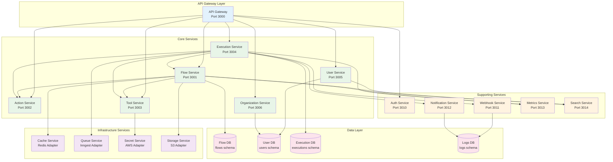

## Data Flow Diagrams

### Flow Execution Data Flow

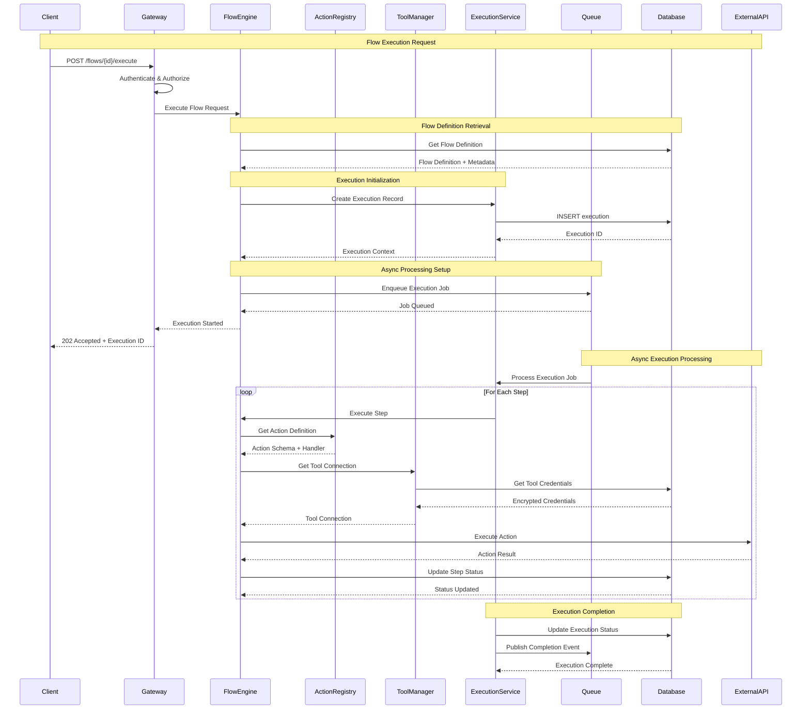

### Authentication & Authorization Flow

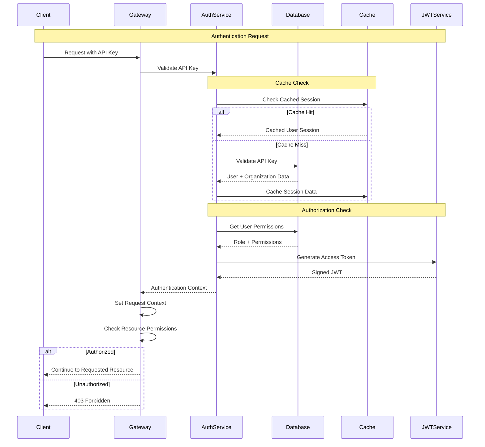

### Multi-Tenant Data Isolation

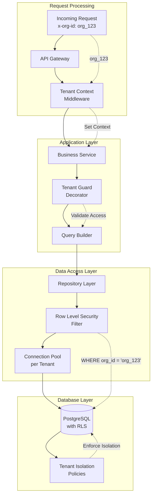

## Component Interaction Diagrams

### Flow Engine Internal Architecture

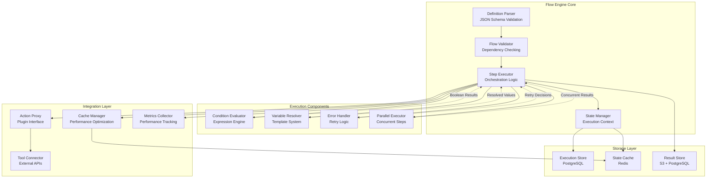

### Action Registry System

```mermaid
graph TB
    subgraph "Action Definition Layer"
        SCHEMA_DEF[Action Schema<br/>Input/Output Definition]
        CODE_DEF[Action Code<br/>Implementation Logic]
        META_DEF[Metadata<br/>Documentation + Config]
    end
    
    subgraph "Registry Core"
        REGISTRY[Action Registry<br/>Central Repository]
        VERSION_MGR[Version Manager<br/>Semantic Versioning]
        DEPENDENCY_RESOLVER[Dependency Resolver<br/>Action Dependencies]
    end
    
    subgraph "Runtime Components"
        LOADER[Dynamic Loader<br/>Code Loading]
        SANDBOX[Execution Sandbox<br/>Isolated Environment]
        VALIDATOR[Input Validator<br/>Schema Validation]
        EXECUTOR[Action Executor<br/>Runtime Engine]
    end
    
    subgraph "Plugin System"
        BUILTIN_ACTIONS[Built-in Actions<br/>Core Library]
        CUSTOM_ACTIONS[Custom Actions<br/>User Code]
        INTEGRATION_ACTIONS[Integration Actions<br/>3rd Party APIs]
    end
    
    subgraph "Storage & Cache"
        ACTION_DB[(Action Database<br/>PostgreSQL)]
        CODE_CACHE[Code Cache<br/>Redis]
        RESULT_CACHE[Result Cache<br/>Redis)]
    end
    
    %% Definition to registry
    SCHEMA_DEF --> REGISTRY
    CODE_DEF --> REGISTRY
    META_DEF --> REGISTRY
    
    %% Registry core interactions
    REGISTRY --> VERSION_MGR
    REGISTRY --> DEPENDENCY_RESOLVER
    VERSION_MGR --> DEPENDENCY_RESOLVER
    
    %% Runtime interactions
    REGISTRY --> LOADER
    LOADER --> SANDBOX
    SANDBOX --> VALIDATOR
    VALIDATOR --> EXECUTOR
    
    %% Plugin system
    BUILTIN_ACTIONS --> REGISTRY
    CUSTOM_ACTIONS --> REGISTRY
    INTEGRATION_ACTIONS --> REGISTRY
    
    %% Storage interactions
    REGISTRY --> ACTION_DB
    LOADER --> CODE_CACHE
    EXECUTOR --> RESULT_CACHE
    
    %% Execution flow
    EXECUTOR -.->|Results| RESULT_CACHE
    CODE_CACHE -.->|Cached Code| SANDBOX
    DEPENDENCY_RESOLVER -.->|Resolved Deps| LOADER
```

## Deployment Architecture

### AWS Infrastructure Diagram

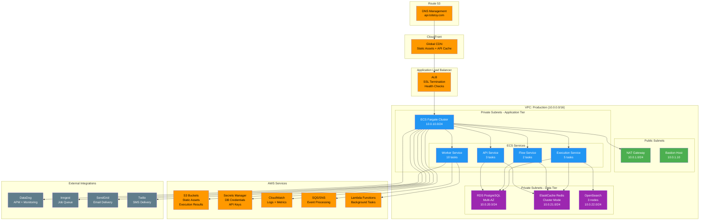

### Container Architecture

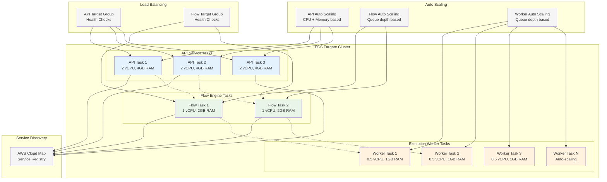

## Database Schema Diagrams

### Core Entity Relationships

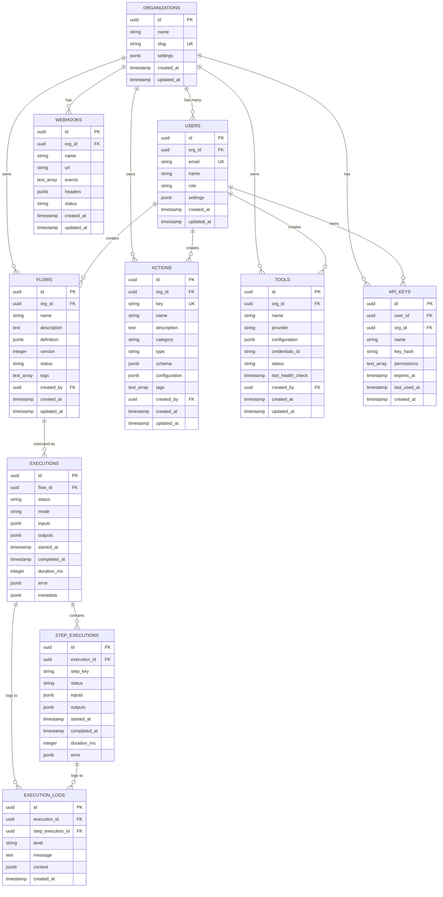

### Sharding Strategy

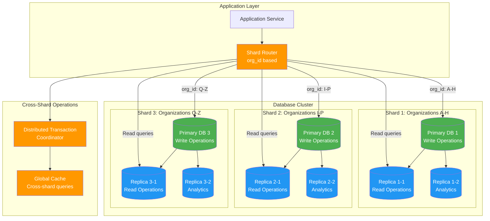

## Security Architecture

### Authentication & Authorization Flow

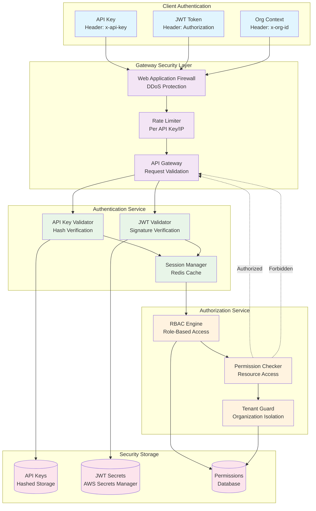

### Data Encryption Architecture

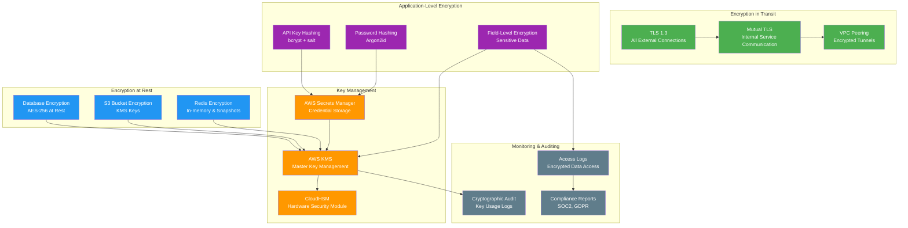

This comprehensive system diagrams documentation provides detailed visual representations of Tolstoy's architecture at every level, from high-level system overviews to detailed component interactions, security architecture, and deployment patterns. These diagrams serve as essential references for understanding system design, troubleshooting issues, and planning architectural improvements.

---

*These architectural diagrams provide comprehensive visual documentation of Tolstoy's system design, enabling better understanding of component interactions, data flows, and infrastructure patterns for engineering teams and stakeholders.*