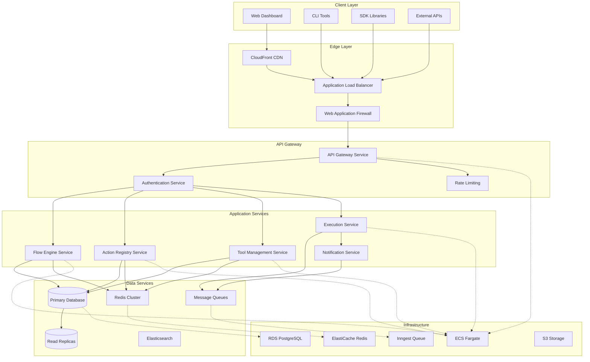

# System Architecture Overview

This document provides a comprehensive overview of Tolstoy's system architecture, covering the key components, design decisions, and architectural patterns that enable scalable workflow automation.

## Architecture Principles

### Core Design Goals

<CardGroup cols={2}>
  <Card title="🔄 Reliability" icon="shield-check">
    **99.9% Uptime Target**
    - Fault tolerance and graceful degradation
    - Automatic failover and recovery
    - Comprehensive monitoring and alerting
  </Card>
  <Card title="📈 Scalability" icon="chart-line">
    **Horizontal Scaling**
    - Stateless application design
    - Auto-scaling based on demand
    - Efficient resource utilization
  </Card>
</CardGroup>

<CardGroup cols={2}>
  <Card title="🔒 Security" icon="lock">
    **Enterprise-Grade Security**
    - Multi-tenant isolation
    - Encryption at rest and in transit
    - Comprehensive audit logging
  </Card>
  <Card title="⚡ Performance" icon="zap">
    **Sub-second Response Times**
    - Optimized database queries
    - Multi-layer caching strategy
    - Async processing for heavy workloads
  </Card>
</CardGroup>

### Architectural Patterns

- **Microservices Architecture**: Loosely coupled services with clear boundaries
- **Event-Driven Design**: Async communication via message queues
- **CQRS Pattern**: Separate read/write models for optimal performance
- **Multi-Tenant SaaS**: Secure isolation with shared infrastructure

## High-Level Architecture



## Core Services

### 1. API Gateway Service

**Responsibilities**:
- Request routing and load balancing
- Authentication and authorization
- Rate limiting and throttling
- Request/response transformation
- API versioning and documentation

**Technology Stack**:
- **Framework**: NestJS with Express
- **Language**: TypeScript
- **Deployment**: ECS Fargate
- **Load Balancing**: Application Load Balancer

```typescript
// Core gateway structure
@Controller('api/v1')
export class ApiGatewayController {
  constructor(
    private readonly authService: AuthenticationService,
    private readonly rateLimitService: RateLimitService,
    private readonly routingService: RoutingService
  ) {}
  
  @UseGuards(AuthGuard, RateLimitGuard)
  @Post(':service/:resource')
  async routeRequest(
    @Param('service') service: string,
    @Param('resource') resource: string,
    @Req() request: Request
  ) {
    return this.routingService.forward(service, resource, request);
  }
}
```

### 2. Flow Engine Service

**Responsibilities**:
- Workflow definition parsing and validation
- Execution orchestration and state management
- Conditional logic evaluation
- Error handling and retry mechanisms
- Step parallelization and optimization

**Key Components**:

```typescript
@Injectable()
export class FlowEngine {
  constructor(
    private readonly actionRegistry: ActionRegistryService,
    private readonly stateManager: ExecutionStateService,
    private readonly conditionEvaluator: ConditionEvaluatorService
  ) {}
  
  async executeFlow(
    flow: FlowDefinition,
    context: ExecutionContext
  ): Promise<ExecutionResult> {
    const execution = await this.stateManager.createExecution(flow, context);
    
    try {
      for (const step of flow.steps) {
        if (await this.shouldExecuteStep(step, execution)) {
          await this.executeStep(step, execution);
        }
      }
      
      return await this.stateManager.completeExecution(execution);
    } catch (error) {
      return await this.stateManager.failExecution(execution, error);
    }
  }
  
  private async executeStep(
    step: FlowStep,
    execution: ExecutionContext
  ): Promise<StepResult> {
    const action = await this.actionRegistry.getAction(step.action);
    const inputs = this.resolveStepInputs(step.inputs, execution);
    
    return await action.execute(inputs, execution);
  }
}
```

### 3. Action Registry Service

**Responsibilities**:
- Action definition storage and retrieval
- Input validation and type checking
- Output mapping and transformation
- Action versioning and compatibility
- Performance monitoring and caching

```typescript
@Injectable()
export class ActionRegistryService {
  private readonly actionCache = new LRUCache<string, ActionDefinition>({
    max: 1000,
    ttl: 5 * 60 * 1000 // 5 minutes
  });
  
  async getAction(actionKey: string): Promise<ActionExecutor> {
    let definition = this.actionCache.get(actionKey);
    
    if (!definition) {
      definition = await this.actionRepository.findByKey(actionKey);
      this.actionCache.set(actionKey, definition);
    }
    
    return this.createExecutor(definition);
  }
  
  private createExecutor(definition: ActionDefinition): ActionExecutor {
    switch (definition.type) {
      case 'http':
        return new HttpActionExecutor(definition);
      case 'javascript':
        return new JavaScriptActionExecutor(definition);
      case 'builtin':
        return new BuiltinActionExecutor(definition);
      default:
        throw new Error(`Unknown action type: ${definition.type}`);
    }
  }
}
```

### 4. Tool Management Service

**Responsibilities**:
- External service integration management
- Authentication credential storage
- Connection health monitoring
- API rate limiting compliance
- Security scanning and validation

```typescript
@Injectable()
export class ToolManagementService {
  constructor(
    private readonly secretsManager: SecretsManagerService,
    private readonly connectionPool: ConnectionPoolService,
    private readonly healthChecker: HealthCheckService
  ) {}
  
  async getToolConnection(toolId: string): Promise<ToolConnection> {
    const tool = await this.toolRepository.findById(toolId);
    const credentials = await this.secretsManager.getCredentials(tool.credentialsId);
    
    return this.connectionPool.getConnection(tool, credentials);
  }
  
  async executeToolAction(
    toolId: string,
    action: ToolAction,
    inputs: any
  ): Promise<any> {
    const connection = await this.getToolConnection(toolId);
    
    try {
      return await connection.execute(action, inputs);
    } catch (error) {
      await this.healthChecker.reportFailure(toolId, error);
      throw error;
    }
  }
}
```

### 5. Execution Service

**Responsibilities**:
- Async execution management
- Job scheduling and queuing
- Resource allocation and scaling
- Execution monitoring and logging
- Results storage and retrieval

```typescript
@Injectable()
export class ExecutionService {
  constructor(
    private readonly queueService: InngestService,
    private readonly stateService: ExecutionStateService,
    private readonly metricsService: MetricsService
  ) {}
  
  async executeAsync(
    flowId: string,
    inputs: any,
    context: ExecutionContext
  ): Promise<AsyncExecutionResult> {
    const execution = await this.stateService.createExecution(flowId, inputs, context);
    
    // Queue for async processing
    await this.queueService.enqueue('flow-execution', {
      executionId: execution.id,
      flowId,
      inputs,
      context
    });
    
    return {
      executionId: execution.id,
      status: 'queued',
      estimatedCompletion: new Date(Date.now() + 30000) // 30 seconds
    };
  }
  
  @InngestFunction('flow-execution')
  async handleFlowExecution({ data }: { data: ExecutionJob }) {
    const { executionId, flowId, inputs, context } = data;
    
    try {
      await this.stateService.updateStatus(executionId, 'running');
      
      const flow = await this.flowService.getFlow(flowId);
      const result = await this.flowEngine.executeFlow(flow, context);
      
      await this.stateService.completeExecution(executionId, result);
      await this.metricsService.recordExecution(executionId, result);
      
    } catch (error) {
      await this.stateService.failExecution(executionId, error);
      await this.metricsService.recordFailure(executionId, error);
    }
  }
}
```

## Data Architecture

### Database Design

**Primary Database: PostgreSQL 14**

```sql
-- Core schema structure
CREATE SCHEMA tolstoy;

-- Organizations table (multi-tenant root)
CREATE TABLE tolstoy.organizations (
    id UUID PRIMARY KEY DEFAULT gen_random_uuid(),
    name VARCHAR(255) NOT NULL,
    slug VARCHAR(100) UNIQUE NOT NULL,
    settings JSONB DEFAULT '{}',
    created_at TIMESTAMP DEFAULT NOW(),
    updated_at TIMESTAMP DEFAULT NOW()
);

-- Users table
CREATE TABLE tolstoy.users (
    id UUID PRIMARY KEY DEFAULT gen_random_uuid(),
    org_id UUID NOT NULL REFERENCES tolstoy.organizations(id) ON DELETE CASCADE,
    email VARCHAR(255) NOT NULL,
    name VARCHAR(255),
    role VARCHAR(50) DEFAULT 'member',
    settings JSONB DEFAULT '{}',
    created_at TIMESTAMP DEFAULT NOW(),
    updated_at TIMESTAMP DEFAULT NOW(),
    
    UNIQUE(org_id, email)
);

-- Flows table
CREATE TABLE tolstoy.flows (
    id UUID PRIMARY KEY DEFAULT gen_random_uuid(),
    org_id UUID NOT NULL REFERENCES tolstoy.organizations(id) ON DELETE CASCADE,
    name VARCHAR(255) NOT NULL,
    description TEXT,
    definition JSONB NOT NULL,
    version INTEGER DEFAULT 1,
    status VARCHAR(20) DEFAULT 'draft',
    tags TEXT[] DEFAULT ARRAY[]::TEXT[],
    created_by UUID NOT NULL REFERENCES tolstoy.users(id),
    created_at TIMESTAMP DEFAULT NOW(),
    updated_at TIMESTAMP DEFAULT NOW()
);

-- Executions table
CREATE TABLE tolstoy.executions (
    id UUID PRIMARY KEY DEFAULT gen_random_uuid(),
    flow_id UUID NOT NULL REFERENCES tolstoy.flows(id) ON DELETE CASCADE,
    status VARCHAR(20) NOT NULL DEFAULT 'pending',
    mode VARCHAR(10) DEFAULT 'async',
    inputs JSONB DEFAULT '{}',
    outputs JSONB,
    started_at TIMESTAMP DEFAULT NOW(),
    completed_at TIMESTAMP,
    duration_ms INTEGER,
    error JSONB,
    metadata JSONB DEFAULT '{}'
);

-- Step executions table
CREATE TABLE tolstoy.step_executions (
    id UUID PRIMARY KEY DEFAULT gen_random_uuid(),
    execution_id UUID NOT NULL REFERENCES tolstoy.executions(id) ON DELETE CASCADE,
    step_key VARCHAR(255) NOT NULL,
    status VARCHAR(20) NOT NULL DEFAULT 'pending',
    inputs JSONB DEFAULT '{}',
    outputs JSONB,
    started_at TIMESTAMP DEFAULT NOW(),
    completed_at TIMESTAMP,
    duration_ms INTEGER,
    error JSONB,
    
    UNIQUE(execution_id, step_key)
);
```

### Indexing Strategy

```sql
-- Performance indexes
CREATE INDEX idx_flows_org_id ON tolstoy.flows(org_id);
CREATE INDEX idx_flows_status ON tolstoy.flows(status) WHERE status != 'draft';
CREATE INDEX idx_flows_tags ON tolstoy.flows USING GIN (tags);
CREATE INDEX idx_flows_definition ON tolstoy.flows USING GIN (definition);

CREATE INDEX idx_executions_flow_id ON tolstoy.executions(flow_id);
CREATE INDEX idx_executions_status ON tolstoy.executions(status);
CREATE INDEX idx_executions_started_at ON tolstoy.executions(started_at DESC);

CREATE INDEX idx_step_executions_execution_id ON tolstoy.step_executions(execution_id);
CREATE INDEX idx_step_executions_status ON tolstoy.step_executions(status);

-- Partial indexes for active queries
CREATE INDEX idx_active_executions ON tolstoy.executions(flow_id, started_at) 
WHERE status IN ('pending', 'running');

CREATE INDEX idx_recent_failures ON tolstoy.executions(org_id, started_at, status) 
WHERE status = 'failed' AND started_at > NOW() - INTERVAL '24 hours';
```

### Caching Architecture

**Redis Cluster Configuration**:

```typescript
// Cache layer implementation
@Injectable()
export class CacheService {
  private readonly redis: Redis.Cluster;
  
  constructor() {
    this.redis = new Redis.Cluster([
      { host: 'redis-node-1', port: 6379 },
      { host: 'redis-node-2', port: 6379 },
      { host: 'redis-node-3', port: 6379 }
    ], {
      redisOptions: {
        password: process.env.REDIS_PASSWORD
      }
    });
  }
  
  // Flow definition caching
  async getFlow(flowId: string): Promise<FlowDefinition | null> {
    const cached = await this.redis.get(`flow:${flowId}`);
    return cached ? JSON.parse(cached) : null;
  }
  
  async setFlow(flowId: string, flow: FlowDefinition, ttl = 300): Promise<void> {
    await this.redis.setex(`flow:${flowId}`, ttl, JSON.stringify(flow));
  }
  
  // Session management
  async getSession(sessionId: string): Promise<SessionData | null> {
    const session = await this.redis.get(`session:${sessionId}`);
    return session ? JSON.parse(session) : null;
  }
  
  // Rate limiting
  async incrementRateLimit(key: string, window: number, limit: number): Promise<{
    count: number;
    remaining: number;
    resetTime: number;
  }> {
    const pipeline = this.redis.pipeline();
    pipeline.incr(key);
    pipeline.expire(key, window);
    
    const results = await pipeline.exec();
    const count = results![0][1] as number;
    
    return {
      count,
      remaining: Math.max(0, limit - count),
      resetTime: Date.now() + (window * 1000)
    };
  }
}
```

## Security Architecture

### Multi-Tenant Isolation

**Row-Level Security (RLS)**:

```sql
-- Enable RLS on all tenant-aware tables
ALTER TABLE tolstoy.flows ENABLE ROW LEVEL SECURITY;
ALTER TABLE tolstoy.executions ENABLE ROW LEVEL SECURITY;
ALTER TABLE tolstoy.users ENABLE ROW LEVEL SECURITY;

-- Create policies for tenant isolation
CREATE POLICY flows_tenant_isolation ON tolstoy.flows
  USING (org_id = current_setting('app.current_org_id')::UUID);

CREATE POLICY executions_tenant_isolation ON tolstoy.executions
  USING (EXISTS (
    SELECT 1 FROM tolstoy.flows f 
    WHERE f.id = flow_id 
    AND f.org_id = current_setting('app.current_org_id')::UUID
  ));
```

**Application-Level Tenant Context**:

```typescript
@Injectable()
export class TenantContextService {
  private static readonly CONTEXT_KEY = 'tenant_context';
  
  async setTenantContext(orgId: string, userId: string): Promise<void> {
    const context = { orgId, userId, timestamp: Date.now() };
    AsyncLocalStorage.getStore()?.set(TenantContextService.CONTEXT_KEY, context);
    
    // Set PostgreSQL session variable for RLS
    await this.databaseService.query(
      'SELECT set_config($1, $2, true)',
      ['app.current_org_id', orgId]
    );
  }
  
  getCurrentTenant(): TenantContext | null {
    return AsyncLocalStorage.getStore()?.get(TenantContextService.CONTEXT_KEY);
  }
  
  @UseGuards(TenantGuard)
  async ensureTenantAccess<T>(
    operation: () => Promise<T>,
    requiredOrgId: string
  ): Promise<T> {
    const context = this.getCurrentTenant();
    if (!context || context.orgId !== requiredOrgId) {
      throw new ForbiddenException('Tenant access denied');
    }
    
    return await operation();
  }
}
```

### Secrets Management

**AWS Secrets Manager Integration**:

```typescript
@Injectable()
export class SecretsManagerService {
  private readonly secretsClient: SecretsManagerClient;
  private readonly cache = new LRUCache<string, any>({
    max: 100,
    ttl: 5 * 60 * 1000 // 5 minutes
  });
  
  constructor() {
    this.secretsClient = new SecretsManagerClient({
      region: process.env.AWS_REGION
    });
  }
  
  async getSecret(secretName: string): Promise<any> {
    if (this.cache.has(secretName)) {
      return this.cache.get(secretName);
    }
    
    try {
      const response = await this.secretsClient.send(
        new GetSecretValueCommand({ SecretId: secretName })
      );
      
      const secretValue = JSON.parse(response.SecretString!);
      this.cache.set(secretName, secretValue);
      
      return secretValue;
    } catch (error) {
      this.logger.error(`Failed to retrieve secret ${secretName}:`, error);
      throw new Error('Secret retrieval failed');
    }
  }
  
  async storeSecret(secretName: string, secretValue: any): Promise<void> {
    await this.secretsClient.send(
      new CreateSecretCommand({
        Name: secretName,
        SecretString: JSON.stringify(secretValue),
        Description: `Tool credentials for ${secretName}`
      })
    );
    
    // Invalidate cache
    this.cache.delete(secretName);
  }
}
```

## Monitoring and Observability

### Application Metrics

**Prometheus Integration**:

```typescript
@Injectable()
export class MetricsService {
  private readonly httpRequestDuration = new prometheus.Histogram({
    name: 'tolstoy_http_request_duration_seconds',
    help: 'HTTP request duration in seconds',
    labelNames: ['method', 'route', 'status_code'],
    buckets: [0.01, 0.05, 0.1, 0.5, 1, 2, 5]
  });
  
  private readonly flowExecutionDuration = new prometheus.Histogram({
    name: 'tolstoy_flow_execution_duration_seconds',
    help: 'Flow execution duration in seconds',
    labelNames: ['flow_id', 'status'],
    buckets: [1, 5, 10, 30, 60, 120, 300, 600]
  });
  
  private readonly activeExecutions = new prometheus.Gauge({
    name: 'tolstoy_active_executions_total',
    help: 'Number of currently active executions',
    labelNames: ['org_id']
  });
  
  recordHttpRequest(method: string, route: string, statusCode: number, duration: number): void {
    this.httpRequestDuration
      .labels(method, route, statusCode.toString())
      .observe(duration);
  }
  
  recordFlowExecution(flowId: string, status: string, duration: number): void {
    this.flowExecutionDuration
      .labels(flowId, status)
      .observe(duration);
  }
  
  updateActiveExecutions(orgId: string, count: number): void {
    this.activeExecutions.labels(orgId).set(count);
  }
}
```

### Structured Logging

```typescript
@Injectable()
export class LoggerService {
  private readonly logger = winston.createLogger({
    format: winston.format.combine(
      winston.format.timestamp(),
      winston.format.errors({ stack: true }),
      winston.format.json()
    ),
    transports: [
      new winston.transports.Console(),
      new winston.transports.File({
        filename: '/var/log/tolstoy/application.log'
      })
    ]
  });
  
  logFlowExecution(
    executionId: string,
    flowId: string,
    orgId: string,
    event: string,
    metadata?: any
  ): void {
    this.logger.info('Flow execution event', {
      event,
      executionId,
      flowId,
      orgId,
      metadata,
      timestamp: new Date().toISOString(),
      service: 'flow-engine'
    });
  }
  
  logError(
    error: Error,
    context: string,
    metadata?: any
  ): void {
    this.logger.error('Application error', {
      message: error.message,
      stack: error.stack,
      context,
      metadata,
      timestamp: new Date().toISOString()
    });
  }
}
```

## Deployment Architecture

### Container Orchestration

**ECS Task Definition**:

```json
{
  "family": "tolstoy-api",
  "networkMode": "awsvpc",
  "requiresCompatibilities": ["FARGATE"],
  "cpu": "1024",
  "memory": "2048",
  "executionRoleArn": "arn:aws:iam::account:role/ecsTaskExecutionRole",
  "taskRoleArn": "arn:aws:iam::account:role/tolstoyTaskRole",
  "containerDefinitions": [
    {
      "name": "api",
      "image": "tolstoy/api:latest",
      "portMappings": [
        {
          "containerPort": 3000,
          "protocol": "tcp"
        }
      ],
      "environment": [
        {
          "name": "NODE_ENV",
          "value": "production"
        },
        {
          "name": "PORT",
          "value": "3000"
        }
      ],
      "secrets": [
        {
          "name": "DATABASE_URL",
          "valueFrom": "arn:aws:secretsmanager:region:account:secret:tolstoy/database-url"
        },
        {
          "name": "REDIS_URL", 
          "valueFrom": "arn:aws:secretsmanager:region:account:secret:tolstoy/redis-url"
        }
      ],
      "logConfiguration": {
        "logDriver": "awslogs",
        "options": {
          "awslogs-group": "/ecs/tolstoy-api",
          "awslogs-region": "us-east-1",
          "awslogs-stream-prefix": "ecs"
        }
      },
      "healthCheck": {
        "command": ["CMD-SHELL", "curl -f http://localhost:3000/health || exit 1"],
        "interval": 30,
        "timeout": 5,
        "retries": 3,
        "startPeriod": 60
      }
    }
  ]
}
```

## Performance Characteristics

### Benchmarks

**API Response Times** (p95):
- Flow list: < 200ms
- Flow execution (sync): < 2s
- Flow execution (async): < 100ms (queue response)
- Action execution: < 500ms

**Throughput Capacity**:
- API requests: 10,000 req/min per instance
- Flow executions: 1,000 concurrent executions
- Database connections: 100 per instance
- Cache operations: 50,000 ops/sec

### Scaling Strategy

```typescript
// Auto-scaling configuration
const autoScalingConfig = {
  minCapacity: 2,
  maxCapacity: 50,
  targetCpuUtilization: 70,
  targetMemoryUtilization: 80,
  scaleOutCooldown: 300, // 5 minutes
  scaleInCooldown: 600,  // 10 minutes
  
  customMetrics: [
    {
      name: 'QueueDepth',
      threshold: 100,
      action: 'scale-out'
    },
    {
      name: 'ActiveExecutions',
      threshold: 80,
      action: 'scale-out'
    }
  ]
};
```

## Related Documentation

<CardGroup cols={2}>
  <Card title="Database Schema" icon="database" href="/internal/architecture/database-schema">
    Detailed database design and relationships
  </Card>
  <Card title="API Design Principles" icon="api" href="/internal/architecture/api-design">
    REST API design patterns and conventions
  </Card>
</CardGroup>

<CardGroup cols={2}>
  <Card title="Execution Engine" icon="cpu" href="/internal/architecture/execution-engine">
    Deep dive into workflow execution architecture
  </Card>
  <Card title="Scaling Strategy" icon="arrows-expand" href="/internal/architecture/scaling-strategy">
    Horizontal and vertical scaling approaches
  </Card>
</CardGroup>

---

*This system architecture enables Tolstoy to handle enterprise-scale workflow automation while maintaining reliability, security, and performance. The modular design allows for independent scaling and evolution of each component.*