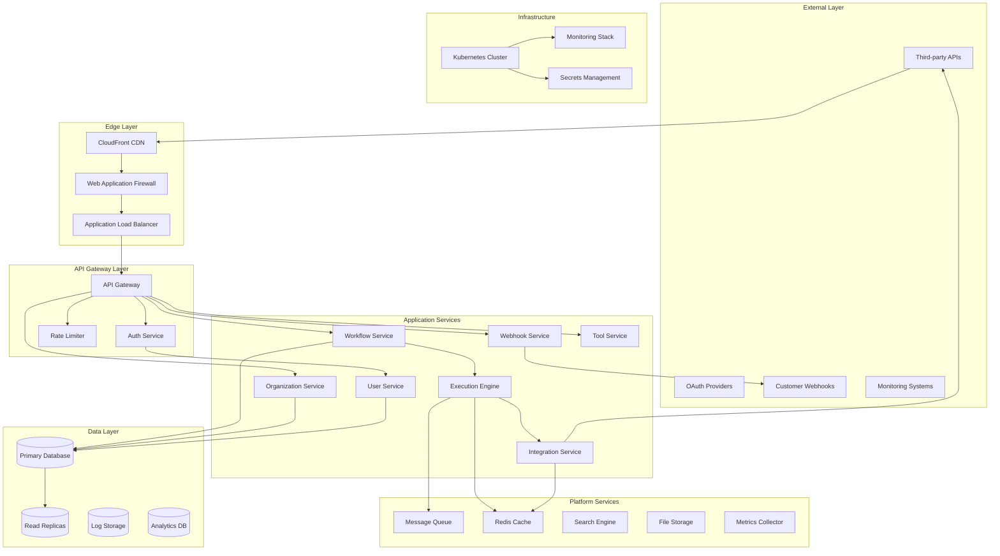
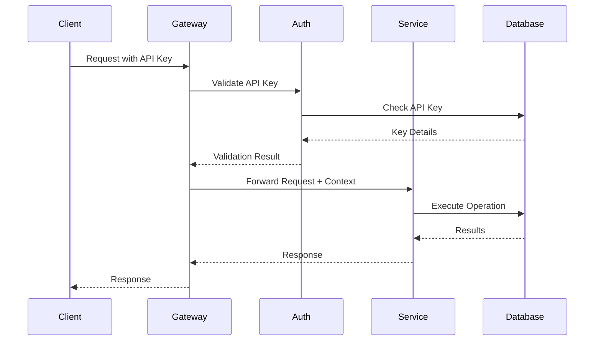
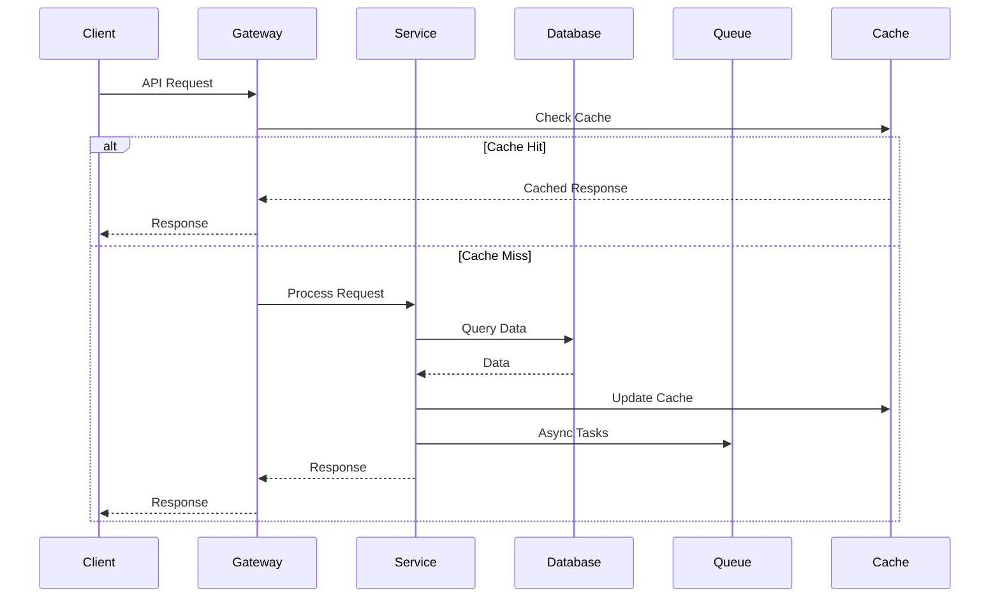
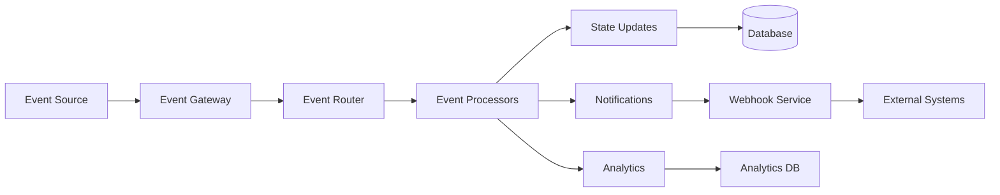

# System Architecture Overview

The Tolstoy platform is built on a modern, cloud-native microservices architecture designed for scalability, reliability, and maintainability. This document provides a comprehensive overview of our system design, service interactions, and infrastructure components.

## Architecture Principles

### Core Design Principles

<CardGroup cols={2}>
  <Card title="Microservices" icon="cubes">
    Decomposed into specialized, independently deployable services with clear boundaries
  </Card>
  <Card title="Event-Driven" icon="bolt">
    Asynchronous communication through events, message queues, and streaming platforms
  </Card>
  <Card title="API-First" icon="code">
    All services expose well-defined APIs with comprehensive documentation and versioning
  </Card>
  <Card title="Cloud-Native" icon="cloud">
    Container-based deployment with Kubernetes orchestration and auto-scaling
  </Card>
</CardGroup>

### Scalability & Reliability

- **Horizontal Scaling**: Services scale independently based on demand
- **Circuit Breakers**: Fault tolerance and graceful degradation
- **Load Balancing**: Traffic distribution across multiple instances
- **Data Replication**: Multi-region data replication for disaster recovery

## High-Level System Diagram



## Service Architecture

### Core Application Services

#### 1. Workflow Service (`workflow-service`)
**Purpose**: Manages workflow definitions, templates, and lifecycle operations

**Responsibilities**:
- Workflow CRUD operations
- Template management
- Version control for workflows
- Workflow validation and schema enforcement
- Integration with execution engine

**Technology Stack**:
- **Runtime**: Node.js 18 with TypeScript
- **Framework**: Express.js with Helmet security
- **Database**: PostgreSQL with TypeORM
- **Cache**: Redis for workflow metadata
- **Queue**: Bull for background processing

**API Endpoints**:
```
POST   /v1/workflows              # Create workflow
GET    /v1/workflows              # List workflows
GET    /v1/workflows/{id}         # Get workflow
PUT    /v1/workflows/{id}         # Update workflow
DELETE /v1/workflows/{id}         # Delete workflow
POST   /v1/workflows/{id}/execute # Execute workflow
```

#### 2. Execution Engine (`execution-engine`)
**Purpose**: Orchestrates workflow execution with step-by-step processing

**Responsibilities**:
- Workflow execution orchestration
- Action processing and state management
- Error handling and retry logic
- Execution logging and monitoring
- Resource allocation and cleanup

**Technology Stack**:
- **Runtime**: Node.js 18 with TypeScript
- **Framework**: Custom execution framework
- **Database**: PostgreSQL for execution state
- **Queue**: AWS SQS for action processing
- **Storage**: S3 for execution artifacts

**Key Components**:
```typescript
interface ExecutionContext {
  executionId: string;
  workflowId: string;
  organizationId: string;
  input: Record<string, any>;
  state: ExecutionState;
  metadata: ExecutionMetadata;
}

interface ExecutionEngine {
  executeWorkflow(context: ExecutionContext): Promise<ExecutionResult>;
  processAction(action: WorkflowAction, context: ExecutionContext): Promise<ActionResult>;
  handleRetry(execution: Execution, error: Error): Promise<void>;
  saveCheckpoint(context: ExecutionContext): Promise<void>;
}
```

#### 3. Integration Service (`integration-service`)
**Purpose**: Manages external API integrations and tool connections

**Responsibilities**:
- Third-party API authentication
- Tool configuration and management
- Request/response transformation
- Rate limiting for external APIs
- Integration health monitoring

**Technology Stack**:
- **Runtime**: Python 3.11 with FastAPI
- **Database**: PostgreSQL for integration configs
- **Cache**: Redis for API responses
- **Queue**: Celery for async processing

**Integration Types**:
- **REST APIs**: HTTP-based integrations with OAuth/API key auth
- **GraphQL APIs**: Schema-aware GraphQL client connections
- **Database Connections**: Direct database integrations
- **File Systems**: File-based data exchanges
- **Message Queues**: Queue-based integrations

#### 4. Organization Service (`organization-service`)
**Purpose**: Multi-tenancy, organization management, and access control

**Responsibilities**:
- Organization lifecycle management
- User membership and roles
- Resource quotas and billing
- Multi-tenant data isolation
- Compliance and audit logging

**Technology Stack**:
- **Runtime**: Go 1.21
- **Framework**: Gin HTTP framework
- **Database**: PostgreSQL with row-level security
- **Cache**: Redis for organization metadata

**Data Model**:
```go
type Organization struct {
    ID          uuid.UUID `json:"id" db:"id"`
    Name        string    `json:"name" db:"name"`
    Slug        string    `json:"slug" db:"slug"`
    Plan        string    `json:"plan" db:"plan"`
    Status      string    `json:"status" db:"status"`
    Settings    JSONB     `json:"settings" db:"settings"`
    CreatedAt   time.Time `json:"created_at" db:"created_at"`
    UpdatedAt   time.Time `json:"updated_at" db:"updated_at"`
}

type OrganizationMember struct {
    OrganizationID uuid.UUID `json:"organization_id" db:"organization_id"`
    UserID         uuid.UUID `json:"user_id" db:"user_id"`
    Role           string    `json:"role" db:"role"`
    Permissions    []string  `json:"permissions" db:"permissions"`
    JoinedAt       time.Time `json:"joined_at" db:"joined_at"`
}
```

### Platform Services

#### 5. User Service (`user-service`)
**Purpose**: User authentication, authorization, and profile management

**Responsibilities**:
- User registration and authentication
- OAuth provider integrations
- Multi-factor authentication (MFA)
- Session management
- User profile and preferences

**Technology Stack**:
- **Runtime**: Node.js 18 with TypeScript
- **Framework**: Express.js with Passport.js
- **Database**: PostgreSQL for user data
- **Cache**: Redis for sessions
- **Security**: bcrypt, JWT, TOTP for MFA

#### 6. Webhook Service (`webhook-service`)
**Purpose**: Reliable webhook delivery and event management

**Responsibilities**:
- Webhook endpoint management
- Event routing and delivery
- Signature generation and verification
- Retry logic with exponential backoff
- Delivery analytics and monitoring

**Technology Stack**:
- **Runtime**: Python 3.11 with FastAPI
- **Queue**: AWS SQS with DLQ for failed deliveries
- **Database**: PostgreSQL for webhook configs
- **Monitoring**: Custom metrics for delivery rates

#### 7. Tool Service (`tool-service`)
**Purpose**: External tool integrations and action implementations

**Responsibilities**:
- Tool catalog and discovery
- Tool authentication management
- Action execution and result handling
- Tool health monitoring
- Usage analytics and reporting

**Technology Stack**:
- **Runtime**: Node.js 18 with TypeScript
- **Framework**: NestJS for modular architecture
- **Database**: PostgreSQL for tool configurations
- **Cache**: Redis for tool metadata

## Data Architecture

### Database Design

#### Primary Database (PostgreSQL)
```sql
-- Core Tables
CREATE TABLE organizations (
    id UUID PRIMARY KEY DEFAULT gen_random_uuid(),
    name VARCHAR(255) NOT NULL,
    slug VARCHAR(100) UNIQUE NOT NULL,
    plan VARCHAR(50) NOT NULL DEFAULT 'free',
    status VARCHAR(20) NOT NULL DEFAULT 'active',
    settings JSONB DEFAULT '{}',
    created_at TIMESTAMP WITH TIME ZONE DEFAULT NOW(),
    updated_at TIMESTAMP WITH TIME ZONE DEFAULT NOW()
);

CREATE TABLE users (
    id UUID PRIMARY KEY DEFAULT gen_random_uuid(),
    email VARCHAR(255) UNIQUE NOT NULL,
    password_hash VARCHAR(255),
    first_name VARCHAR(100),
    last_name VARCHAR(100),
    avatar_url TEXT,
    email_verified BOOLEAN DEFAULT FALSE,
    mfa_enabled BOOLEAN DEFAULT FALSE,
    mfa_secret VARCHAR(32),
    last_login_at TIMESTAMP WITH TIME ZONE,
    created_at TIMESTAMP WITH TIME ZONE DEFAULT NOW(),
    updated_at TIMESTAMP WITH TIME ZONE DEFAULT NOW()
);

CREATE TABLE workflows (
    id UUID PRIMARY KEY DEFAULT gen_random_uuid(),
    organization_id UUID NOT NULL REFERENCES organizations(id) ON DELETE CASCADE,
    name VARCHAR(255) NOT NULL,
    description TEXT,
    trigger JSONB NOT NULL,
    actions JSONB NOT NULL,
    status VARCHAR(20) NOT NULL DEFAULT 'active',
    version INTEGER NOT NULL DEFAULT 1,
    created_by UUID NOT NULL REFERENCES users(id),
    created_at TIMESTAMP WITH TIME ZONE DEFAULT NOW(),
    updated_at TIMESTAMP WITH TIME ZONE DEFAULT NOW()
);

CREATE TABLE executions (
    id UUID PRIMARY KEY DEFAULT gen_random_uuid(),
    workflow_id UUID NOT NULL REFERENCES workflows(id) ON DELETE CASCADE,
    status VARCHAR(20) NOT NULL DEFAULT 'pending',
    input JSONB,
    output JSONB,
    error_message TEXT,
    started_at TIMESTAMP WITH TIME ZONE DEFAULT NOW(),
    completed_at TIMESTAMP WITH TIME ZONE,
    created_at TIMESTAMP WITH TIME ZONE DEFAULT NOW()
);

-- Indexes for performance
CREATE INDEX idx_workflows_org_status ON workflows(organization_id, status);
CREATE INDEX idx_workflows_created_at ON workflows(created_at DESC);
CREATE INDEX idx_executions_workflow_status ON executions(workflow_id, status);
CREATE INDEX idx_executions_status_created ON executions(status, created_at DESC);

-- Row-level security for multi-tenancy
ALTER TABLE workflows ENABLE ROW LEVEL SECURITY;
ALTER TABLE executions ENABLE ROW LEVEL SECURITY;

CREATE POLICY workflow_organization_policy ON workflows
    FOR ALL TO application_user
    USING (organization_id = current_setting('app.current_org_id')::uuid);
```

#### Read Replicas
- **Purpose**: Offload read queries from primary database
- **Configuration**: 2 read replicas in different AZs
- **Lag Monitoring**: &lt;100ms replication lag target
- **Failover**: Automatic promotion of replica to primary

#### Analytics Database (ClickHouse)
```sql
-- Execution analytics
CREATE TABLE execution_events (
    timestamp DateTime64(3),
    execution_id UUID,
    workflow_id UUID,
    organization_id UUID,
    event_type LowCardinality(String),
    duration_ms UInt32,
    success Bool,
    error_code Nullable(String),
    metadata String
) ENGINE = MergeTree()
PARTITION BY toYYYYMM(timestamp)
ORDER BY (organization_id, workflow_id, timestamp);

-- API usage analytics
CREATE TABLE api_requests (
    timestamp DateTime64(3),
    organization_id UUID,
    endpoint LowCardinality(String),
    method LowCardinality(String),
    status_code UInt16,
    response_time_ms UInt32,
    request_size UInt32,
    response_size UInt32,
    ip_address IPv4,
    user_agent String
) ENGINE = MergeTree()
PARTITION BY toYYYYMM(timestamp)
ORDER BY (organization_id, endpoint, timestamp);
```

### Message Queue Architecture

#### Event Streaming (Apache Kafka)
```yaml
# Kafka Topics Configuration
topics:
  workflow.events:
    partitions: 12
    replication_factor: 3
    retention_ms: 604800000  # 7 days
    
  execution.events:
    partitions: 24
    replication_factor: 3
    retention_ms: 2592000000  # 30 days
    
  integration.events:
    partitions: 6
    replication_factor: 3
    retention_ms: 259200000  # 3 days

  audit.events:
    partitions: 3
    replication_factor: 3
    retention_ms: 31536000000  # 1 year
```

#### Message Schemas
```typescript
// Event schemas using Avro
interface WorkflowEvent {
  id: string;
  type: 'created' | 'updated' | 'deleted' | 'executed';
  workflow_id: string;
  organization_id: string;
  user_id: string;
  timestamp: string;
  data: Record<string, any>;
  metadata: {
    source: string;
    version: string;
    trace_id: string;
  };
}

interface ExecutionEvent {
  id: string;
  type: 'started' | 'step_completed' | 'completed' | 'failed';
  execution_id: string;
  workflow_id: string;
  organization_id: string;
  step_index?: number;
  timestamp: string;
  data: Record<string, any>;
  performance: {
    duration_ms: number;
    memory_used: number;
    cpu_time: number;
  };
}
```

## Service Communication Patterns

### Synchronous Communication

#### REST APIs
- **Protocol**: HTTP/2 with TLS 1.3
- **Format**: JSON with OpenAPI 3.0 specifications
- **Authentication**: JWT tokens with service-to-service auth
- **Versioning**: URL-based versioning (`/v1/`, `/v2/`)

#### gRPC Services
```protobuf
// Internal service communication
syntax = "proto3";

package tolstoy.internal.v1;

service WorkflowService {
  rpc GetWorkflow(GetWorkflowRequest) returns (GetWorkflowResponse);
  rpc CreateWorkflow(CreateWorkflowRequest) returns (CreateWorkflowResponse);
  rpc ExecuteWorkflow(ExecuteWorkflowRequest) returns (ExecuteWorkflowResponse);
  rpc StreamExecutions(StreamExecutionsRequest) returns (stream ExecutionEvent);
}

message GetWorkflowRequest {
  string workflow_id = 1;
  string organization_id = 2;
}

message GetWorkflowResponse {
  Workflow workflow = 1;
  repeated Execution recent_executions = 2;
}
```

### Asynchronous Communication

#### Event-Driven Architecture
```typescript
// Event handlers
class WorkflowEventHandler {
  @EventHandler('workflow.created')
  async onWorkflowCreated(event: WorkflowEvent) {
    // Update search index
    await searchService.indexWorkflow(event.data);
    
    // Send welcome email
    await emailService.sendWorkflowCreatedEmail(event.organization_id, event.data);
    
    // Update analytics
    await analyticsService.recordWorkflowCreation(event);
  }

  @EventHandler('workflow.executed')
  async onWorkflowExecuted(event: WorkflowEvent) {
    // Process webhook deliveries
    await webhookService.deliverWebhooks(event);
    
    // Update execution metrics
    await metricsService.recordExecution(event);
    
    // Check for alerts
    await alertService.checkExecutionAlerts(event);
  }
}
```

#### Message Queue Patterns
```typescript
// Queue configurations
const queueConfigs = {
  'workflow-execution': {
    concurrency: 10,
    retries: 3,
    backoff: 'exponential',
    deadLetterQueue: 'workflow-execution-dlq'
  },
  
  'webhook-delivery': {
    concurrency: 50,
    retries: 5,
    backoff: 'exponential',
    deadLetterQueue: 'webhook-delivery-dlq'
  },
  
  'integration-sync': {
    concurrency: 5,
    retries: 2,
    backoff: 'fixed',
    delay: 30000
  }
};
```

## Infrastructure Components

### Kubernetes Cluster Architecture

#### Cluster Configuration
```yaml
# EKS Cluster Configuration
apiVersion: eksctl.io/v1alpha5
kind: ClusterConfig

metadata:
  name: tolstoy-production
  region: us-east-1
  version: "1.28"

nodeGroups:
  - name: application-nodes
    instanceType: c5.2xlarge
    desiredCapacity: 6
    minSize: 3
    maxSize: 20
    
    labels:
      node-type: application
    
    taints:
      - key: application
        value: "true"
        effect: NoSchedule

  - name: system-nodes
    instanceType: t3.large
    desiredCapacity: 3
    minSize: 3
    maxSize: 6
    
    labels:
      node-type: system

addons:
  - name: vpc-cni
    version: latest
  - name: coredns
    version: latest
  - name: kube-proxy
    version: latest
  - name: aws-load-balancer-controller
    version: latest
```

#### Service Mesh (Istio)
```yaml
# Istio configuration for service communication
apiVersion: networking.istio.io/v1alpha3
kind: VirtualService
metadata:
  name: workflow-service
spec:
  hosts:
  - workflow-service
  http:
  - match:
    - uri:
        prefix: /v1/workflows
    route:
    - destination:
        host: workflow-service
        subset: stable
      weight: 90
    - destination:
        host: workflow-service
        subset: canary
      weight: 10
    fault:
      delay:
        percentage:
          value: 0.1
        fixedDelay: 5s
    timeout: 30s
    retries:
      attempts: 3
      perTryTimeout: 10s
```

### Container Strategy

#### Base Images
```dockerfile
# Multi-stage build for Node.js services
FROM node:18-alpine AS builder
WORKDIR /app
COPY package*.json ./
RUN npm ci --only=production

FROM node:18-alpine AS runtime
RUN addgroup -g 1001 -S nodejs && \
    adduser -S nodejs -u 1001

WORKDIR /app
COPY --from=builder /app/node_modules ./node_modules
COPY --chown=nodejs:nodejs . .

USER nodejs
EXPOSE 3000

HEALTHCHECK --interval=30s --timeout=3s --start-period=5s --retries=3 \
  CMD curl -f http://localhost:3000/health || exit 1

CMD ["npm", "start"]
```

```dockerfile
# Python service container
FROM python:3.11-slim AS builder
WORKDIR /app
COPY requirements.txt .
RUN pip install --user --no-cache-dir -r requirements.txt

FROM python:3.11-slim AS runtime
RUN useradd --create-home --shell /bin/bash app

WORKDIR /app
COPY --from=builder /root/.local /home/app/.local
COPY --chown=app:app . .

USER app
ENV PATH=/home/app/.local/bin:$PATH

EXPOSE 8000
HEALTHCHECK --interval=30s --timeout=3s --start-period=5s --retries=3 \
  CMD curl -f http://localhost:8000/health || exit 1

CMD ["uvicorn", "main:app", "--host", "0.0.0.0", "--port", "8000"]
```

### Networking and Security

#### Network Policies
```yaml
# Network policy for workflow service
apiVersion: networking.k8s.io/v1
kind: NetworkPolicy
metadata:
  name: workflow-service-policy
spec:
  podSelector:
    matchLabels:
      app: workflow-service
  policyTypes:
  - Ingress
  - Egress
  
  ingress:
  - from:
    - podSelector:
        matchLabels:
          app: api-gateway
    ports:
    - protocol: TCP
      port: 3000
  
  egress:
  - to:
    - podSelector:
        matchLabels:
          app: execution-engine
    ports:
    - protocol: TCP
      port: 3000
  - to: []  # Allow external API calls
    ports:
    - protocol: TCP
      port: 443
```

#### Service Mesh Security
```yaml
# mTLS configuration
apiVersion: security.istio.io/v1beta1
kind: PeerAuthentication
metadata:
  name: default
spec:
  mtls:
    mode: STRICT

---
apiVersion: security.istio.io/v1beta1
kind: AuthorizationPolicy
metadata:
  name: workflow-service-authz
spec:
  selector:
    matchLabels:
      app: workflow-service
  rules:
  - from:
    - source:
        principals: ["cluster.local/ns/default/sa/api-gateway"]
  - to:
    - operation:
        methods: ["GET", "POST", "PUT", "DELETE"]
```

## Observability and Monitoring

### Monitoring Stack

#### Prometheus Configuration
```yaml
# Prometheus scrape configs
global:
  scrape_interval: 15s
  evaluation_interval: 15s

scrape_configs:
  - job_name: 'tolstoy-services'
    kubernetes_sd_configs:
    - role: pod
    relabel_configs:
    - source_labels: [__meta_kubernetes_pod_annotation_prometheus_io_scrape]
      action: keep
      regex: true
    - source_labels: [__meta_kubernetes_pod_annotation_prometheus_io_path]
      action: replace
      target_label: __metrics_path__
      regex: (.+)

  - job_name: 'postgres-exporter'
    static_configs:
    - targets: ['postgres-exporter:9187']
    
  - job_name: 'redis-exporter'
    static_configs:
    - targets: ['redis-exporter:9121']
```

#### Grafana Dashboards
```json
{
  "dashboard": {
    "title": "Tolstoy Platform Overview",
    "panels": [
      {
        "title": "Request Rate",
        "type": "graph",
        "targets": [
          {
            "expr": "sum(rate(http_requests_total[5m])) by (service)",
            "legendFormat": "{{service}}"
          }
        ]
      },
      {
        "title": "Response Time P95",
        "type": "graph",
        "targets": [
          {
            "expr": "histogram_quantile(0.95, sum(rate(http_request_duration_seconds_bucket[5m])) by (le, service))",
            "legendFormat": "{{service}} P95"
          }
        ]
      },
      {
        "title": "Error Rate",
        "type": "graph",
        "targets": [
          {
            "expr": "sum(rate(http_requests_total{status=~'5..'}[5m])) by (service) / sum(rate(http_requests_total[5m])) by (service)",
            "legendFormat": "{{service}} Error Rate"
          }
        ]
      }
    ]
  }
}
```

### Distributed Tracing

#### OpenTelemetry Configuration
```typescript
// OpenTelemetry setup
import { NodeSDK } from '@opentelemetry/auto-instrumentations-node';
import { Resource } from '@opentelemetry/resources';
import { SemanticResourceAttributes } from '@opentelemetry/semantic-conventions';

const sdk = new NodeSDK({
  resource: new Resource({
    [SemanticResourceAttributes.SERVICE_NAME]: 'workflow-service',
    [SemanticResourceAttributes.SERVICE_VERSION]: process.env.APP_VERSION,
    [SemanticResourceAttributes.DEPLOYMENT_ENVIRONMENT]: process.env.NODE_ENV,
  }),
  traceExporter: new JaegerExporter({
    endpoint: process.env.JAEGER_ENDPOINT,
  }),
  metricReader: new PrometheusRegistry(),
});

sdk.start();
```

## Security Architecture

### Authentication Flow


### Service-to-Service Authentication
```typescript
// JWT service authentication
interface ServiceToken {
  iss: string;        // Issuing service
  sub: string;        // Subject service
  aud: string[];      // Audience services
  exp: number;        // Expiration
  iat: number;        // Issued at
  jti: string;        // Token ID
  scopes: string[];   // Allowed operations
}

class ServiceAuthenticator {
  generateServiceToken(fromService: string, toService: string, scopes: string[]): string {
    const payload: ServiceToken = {
      iss: fromService,
      sub: fromService,
      aud: [toService],
      exp: Math.floor(Date.now() / 1000) + 3600, // 1 hour
      iat: Math.floor(Date.now() / 1000),
      jti: randomUUID(),
      scopes
    };

    return jwt.sign(payload, process.env.SERVICE_JWT_SECRET);
  }

  async validateServiceToken(token: string, expectedAudience: string): Promise<ServiceToken> {
    const decoded = jwt.verify(token, process.env.SERVICE_JWT_SECRET) as ServiceToken;
    
    if (!decoded.aud.includes(expectedAudience)) {
      throw new Error('Invalid audience');
    }
    
    return decoded;
  }
}
```

## Deployment Architecture

### Multi-Environment Strategy

#### Environment Configurations
```yaml
# Environment-specific configurations
environments:
  development:
    cluster: tolstoy-dev
    namespace: development
    replicas: 1
    resources:
      requests: { cpu: 100m, memory: 128Mi }
      limits: { cpu: 500m, memory: 512Mi }
    database: tolstoy-dev.cluster-xyz.us-east-1.rds.amazonaws.com
    
  staging:
    cluster: tolstoy-staging
    namespace: staging
    replicas: 2
    resources:
      requests: { cpu: 200m, memory: 256Mi }
      limits: { cpu: 1000m, memory: 1Gi }
    database: tolstoy-staging.cluster-xyz.us-east-1.rds.amazonaws.com
    
  production:
    cluster: tolstoy-production
    namespace: production
    replicas: 5
    resources:
      requests: { cpu: 500m, memory: 512Mi }
      limits: { cpu: 2000m, memory: 2Gi }
    database: tolstoy-prod.cluster-xyz.us-east-1.rds.amazonaws.com
```

#### GitOps Deployment Pipeline
```yaml
# ArgoCD application configuration
apiVersion: argoproj.io/v1alpha1
kind: Application
metadata:
  name: tolstoy-platform
  namespace: argocd
spec:
  project: default
  source:
    repoURL: https://github.com/tolstoy/platform
    targetRevision: HEAD
    path: k8s/overlays/production
  destination:
    server: https://kubernetes.default.svc
    namespace: production
  syncPolicy:
    automated:
      prune: true
      selfHeal: true
    syncOptions:
    - CreateNamespace=true
    retry:
      limit: 5
      backoff:
        duration: 5s
        factor: 2
        maxDuration: 3m
```

## Performance Characteristics

### Service Performance Targets

| Service | Response Time (P95) | Throughput | Availability |
|---------|-------------------|------------|--------------|
| **API Gateway** | &lt;100ms | 10,000 RPS | 99.9% |
| **Workflow Service** | &lt;200ms | 5,000 RPS | 99.9% |
| **Execution Engine** | &lt;500ms | 1,000 RPS | 99.95% |
| **Integration Service** | &lt;1000ms | 2,000 RPS | 99.5% |
| **Organization Service** | &lt;150ms | 3,000 RPS | 99.9% |
| **User Service** | &lt;100ms | 5,000 RPS | 99.9% |

### Scaling Strategies

#### Horizontal Pod Autoscaling
```yaml
apiVersion: autoscaling/v2
kind: HorizontalPodAutoscaler
metadata:
  name: workflow-service-hpa
spec:
  scaleTargetRef:
    apiVersion: apps/v1
    kind: Deployment
    name: workflow-service
  minReplicas: 3
  maxReplicas: 50
  metrics:
  - type: Resource
    resource:
      name: cpu
      target:
        type: Utilization
        averageUtilization: 70
  - type: Resource
    resource:
      name: memory
      target:
        type: Utilization
        averageUtilization: 80
  - type: Pods
    pods:
      metric:
        name: active_workflows
      target:
        type: AverageValue
        averageValue: "100"
```

#### Database Scaling
- **Read Replicas**: Automatic read replica creation during high load
- **Connection Pooling**: PgBouncer for connection management
- **Query Optimization**: Automated slow query detection and alerting
- **Partitioning**: Time-based partitioning for large tables

## Data Flow Architecture

### Request Processing Flow


### Event Processing Flow


## Technology Stack Summary

### Backend Services
- **Languages**: Node.js/TypeScript, Python, Go
- **Frameworks**: Express.js, FastAPI, Gin
- **Databases**: PostgreSQL, Redis, ClickHouse
- **Message Queues**: Apache Kafka, AWS SQS
- **Search**: Elasticsearch
- **File Storage**: AWS S3

### Infrastructure
- **Container Platform**: Docker + Kubernetes (EKS)
- **Service Mesh**: Istio
- **API Gateway**: Kong/Ambassador
- **Load Balancing**: AWS ALB
- **CDN**: CloudFront
- **DNS**: Route 53

### Monitoring & Observability
- **Metrics**: Prometheus + Grafana
- **Logging**: ELK Stack (Elasticsearch, Logstash, Kibana)
- **Tracing**: Jaeger with OpenTelemetry
- **APM**: DataDog
- **Alerting**: PagerDuty + Slack

### Security
- **Secrets Management**: AWS Secrets Manager
- **Service Mesh Security**: Istio mTLS
- **API Security**: OAuth 2.0, JWT, API Keys
- **Network Security**: VPC, Security Groups, WAF
- **Compliance**: SOC2, GDPR, HIPAA

## Next Steps

This overview provides the foundation for understanding Tolstoy's system architecture. For detailed information on specific components:

- [Service Documentation](/internal/services) - Individual service specifications
- [Development Guide](/internal/development) - Local development setup
- [Operations Guide](/internal/operations) - Production operations
- [Integration Patterns](/internal/integrations) - Internal integration patterns