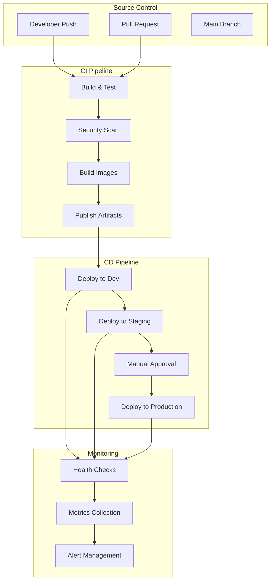

# Deployment Pipeline

This document provides comprehensive guidance on the deployment pipeline for the Tolstoy platform, covering continuous integration/continuous deployment (CI/CD), infrastructure as code, environment management, and release processes.

## Pipeline Overview

### Deployment Architecture

<CardGroup cols={2}>
  <Card title="Multi-Environment" icon="layer-group">
    Development, Staging, and Production environments with automated promotion
  </Card>
  <Card title="GitOps" icon="git-alt">
    Git-based deployment workflow with ArgoCD for automated synchronization
  </Card>
  <Card title="Infrastructure as Code" icon="code">
    Terraform for infrastructure provisioning and Helm for application deployment
  </Card>
  <Card title="Blue-Green Deployment" icon="toggle-on">
    Zero-downtime deployments with automatic rollback capabilities
  </Card>
</CardGroup>

### Pipeline Flow



## Infrastructure as Code

### Terraform Configuration

#### AWS Infrastructure Setup

```hcl
# infrastructure/terraform/main.tf
terraform {
  required_version = ">= 1.5"
  required_providers {
    aws = {
      source  = "hashicorp/aws"
      version = "~> 5.0"
    }
    kubernetes = {
      source  = "hashicorp/kubernetes"
      version = "~> 2.20"
    }
    helm = {
      source  = "hashicorp/helm"
      version = "~> 2.10"
    }
  }

  backend "s3" {
    bucket         = "tolstoy-terraform-state"
    key            = "infrastructure/terraform.tfstate"
    region         = "us-east-1"
    encrypt        = true
    dynamodb_table = "tolstoy-terraform-locks"
  }
}

# Provider configuration
provider "aws" {
  region = var.aws_region
  default_tags {
    tags = {
      Project     = "tolstoy"
      Environment = var.environment
      ManagedBy   = "terraform"
    }
  }
}

# Data sources
data "aws_availability_zones" "available" {
  state = "available"
}

data "aws_caller_identity" "current" {}

# VPC Configuration
module "vpc" {
  source = "terraform-aws-modules/vpc/aws"
  version = "~> 5.0"

  name = "tolstoy-${var.environment}"
  cidr = var.vpc_cidr

  azs             = data.aws_availability_zones.available.names
  private_subnets = var.private_subnet_cidrs
  public_subnets  = var.public_subnet_cidrs

  enable_nat_gateway     = true
  single_nat_gateway     = var.environment == "dev"
  enable_vpn_gateway     = false
  enable_dns_hostnames   = true
  enable_dns_support     = true

  tags = {
    "kubernetes.io/cluster/tolstoy-${var.environment}" = "shared"
  }

  public_subnet_tags = {
    "kubernetes.io/role/elb" = "1"
  }

  private_subnet_tags = {
    "kubernetes.io/role/internal-elb" = "1"
  }
}

# EKS Cluster
module "eks" {
  source = "terraform-aws-modules/eks/aws"
  version = "~> 19.0"

  cluster_name    = "tolstoy-${var.environment}"
  cluster_version = var.kubernetes_version

  vpc_id                   = module.vpc.vpc_id
  subnet_ids              = module.vpc.private_subnets
  control_plane_subnet_ids = module.vpc.private_subnets

  # Cluster access
  cluster_endpoint_public_access  = true
  cluster_endpoint_private_access = true
  cluster_endpoint_public_access_cidrs = var.cluster_endpoint_public_access_cidrs

  # Cluster logging
  cluster_enabled_log_types = ["api", "audit", "authenticator", "controllerManager", "scheduler"]
  cloudwatch_log_group_retention_in_days = 7

  # IRSA
  enable_irsa = true

  # Node groups
  eks_managed_node_groups = {
    main = {
      name           = "main"
      instance_types = var.node_instance_types
      
      min_size     = var.node_group_min_size
      max_size     = var.node_group_max_size
      desired_size = var.node_group_desired_size

      disk_size = 50
      
      labels = {
        Environment = var.environment
        NodeGroup   = "main"
      }

      taints = []

      tags = {
        Environment = var.environment
      }
    }

    # Spot instances for non-critical workloads
    spot = {
      name           = "spot"
      capacity_type  = "SPOT"
      instance_types = var.spot_instance_types

      min_size     = 0
      max_size     = var.spot_max_size
      desired_size = var.spot_desired_size

      labels = {
        Environment = var.environment
        NodeGroup   = "spot"
        NodeType    = "spot"
      }

      taints = [
        {
          key    = "spot"
          value  = "true"
          effect = "NO_SCHEDULE"
        }
      ]
    }
  }

  # AWS Load Balancer Controller IAM role
  node_security_group_additional_rules = {
    ingress_allow_access_from_control_plane = {
      type                          = "ingress"
      protocol                      = "tcp"
      from_port                     = 9443
      to_port                       = 9443
      source_cluster_security_group = true
      description                   = "Allow access from control plane to webhook port of AWS load balancer controller"
    }
  }
}

# RDS Instance
module "rds" {
  source = "terraform-aws-modules/rds/aws"
  version = "~> 6.0"

  identifier = "tolstoy-${var.environment}"

  engine               = "postgres"
  engine_version       = "15.4"
  family              = "postgres15"
  major_engine_version = "15"
  instance_class       = var.db_instance_class

  allocated_storage     = var.db_allocated_storage
  max_allocated_storage = var.db_max_allocated_storage
  storage_encrypted     = true

  db_name  = "tolstoy"
  username = var.db_username
  port     = 5432

  manage_master_user_password = true
  master_user_secret_kms_key_id = aws_kms_key.rds.arn

  multi_az               = var.environment != "dev"
  db_subnet_group_name   = module.vpc.database_subnet_group
  vpc_security_group_ids = [aws_security_group.rds.id]

  maintenance_window              = "Mon:00:00-Mon:03:00"
  backup_window                  = "03:00-06:00"
  enabled_cloudwatch_logs_exports = ["postgresql", "upgrade"]
  create_cloudwatch_log_group     = true

  backup_retention_period = var.environment == "prod" ? 30 : 7
  skip_final_snapshot     = var.environment == "dev"
  deletion_protection     = var.environment == "prod"

  performance_insights_enabled = true
  performance_insights_retention_period = 7

  tags = {
    Environment = var.environment
  }
}

# ElastiCache Redis
module "redis" {
  source = "terraform-aws-modules/elasticache/aws"
  version = "~> 1.0"

  cluster_id               = "tolstoy-${var.environment}"
  description              = "Redis cluster for Tolstoy ${var.environment}"
  node_type               = var.redis_node_type
  port                    = 6379
  parameter_group_name    = "default.redis7"

  num_cache_nodes         = var.redis_num_nodes
  az_mode                 = var.redis_num_nodes > 1 ? "cross-az" : "single-az"
  
  subnet_group_name       = module.vpc.elasticache_subnet_group_name
  security_group_ids      = [aws_security_group.redis.id]

  maintenance_window      = "sun:05:00-sun:09:00"
  notification_topic_arn  = aws_sns_topic.alerts.arn

  at_rest_encryption_enabled = true
  transit_encryption_enabled = true
  auth_token                = random_password.redis_auth.result

  tags = {
    Environment = var.environment
  }
}

# S3 Buckets
resource "aws_s3_bucket" "storage" {
  bucket = "tolstoy-storage-${var.environment}-${random_string.bucket_suffix.result}"

  tags = {
    Name        = "Tolstoy Storage"
    Environment = var.environment
  }
}

resource "aws_s3_bucket_versioning" "storage" {
  bucket = aws_s3_bucket.storage.id
  versioning_configuration {
    status = "Enabled"
  }
}

resource "aws_s3_bucket_encryption" "storage" {
  bucket = aws_s3_bucket.storage.id

  server_side_encryption_configuration {
    rule {
      apply_server_side_encryption_by_default {
        kms_master_key_id = aws_kms_key.s3.arn
        sse_algorithm     = "aws:kms"
      }
    }
  }
}

# Security Groups
resource "aws_security_group" "rds" {
  name_prefix = "tolstoy-rds-${var.environment}"
  vpc_id      = module.vpc.vpc_id

  ingress {
    from_port   = 5432
    to_port     = 5432
    protocol    = "tcp"
    cidr_blocks = [var.vpc_cidr]
  }

  egress {
    from_port   = 0
    to_port     = 0
    protocol    = "-1"
    cidr_blocks = ["0.0.0.0/0"]
  }

  tags = {
    Name = "tolstoy-rds-${var.environment}"
  }
}

resource "aws_security_group" "redis" {
  name_prefix = "tolstoy-redis-${var.environment}"
  vpc_id      = module.vpc.vpc_id

  ingress {
    from_port   = 6379
    to_port     = 6379
    protocol    = "tcp"
    cidr_blocks = [var.vpc_cidr]
  }

  tags = {
    Name = "tolstoy-redis-${var.environment}"
  }
}

# KMS Keys
resource "aws_kms_key" "rds" {
  description             = "KMS key for RDS encryption"
  deletion_window_in_days = 7
}

resource "aws_kms_key" "s3" {
  description             = "KMS key for S3 encryption"
  deletion_window_in_days = 7
}

# Random resources
resource "random_string" "bucket_suffix" {
  length  = 8
  special = false
  upper   = false
}

resource "random_password" "redis_auth" {
  length  = 32
  special = true
}

# SNS Topic for alerts
resource "aws_sns_topic" "alerts" {
  name = "tolstoy-${var.environment}-alerts"
}
```

#### Variables and Outputs

```hcl
# infrastructure/terraform/variables.tf
variable "environment" {
  description = "Environment name"
  type        = string
  validation {
    condition     = contains(["dev", "staging", "prod"], var.environment)
    error_message = "Environment must be dev, staging, or prod."
  }
}

variable "aws_region" {
  description = "AWS region"
  type        = string
  default     = "us-east-1"
}

variable "vpc_cidr" {
  description = "VPC CIDR block"
  type        = string
  default     = "10.0.0.0/16"
}

variable "private_subnet_cidrs" {
  description = "Private subnet CIDR blocks"
  type        = list(string)
  default     = ["10.0.1.0/24", "10.0.2.0/24", "10.0.3.0/24"]
}

variable "public_subnet_cidrs" {
  description = "Public subnet CIDR blocks"
  type        = list(string)
  default     = ["10.0.101.0/24", "10.0.102.0/24", "10.0.103.0/24"]
}

variable "kubernetes_version" {
  description = "Kubernetes version"
  type        = string
  default     = "1.27"
}

variable "node_instance_types" {
  description = "EKS node instance types"
  type        = list(string)
  default     = ["t3.large"]
}

variable "node_group_min_size" {
  description = "Minimum number of nodes"
  type        = number
  default     = 1
}

variable "node_group_max_size" {
  description = "Maximum number of nodes"
  type        = number
  default     = 10
}

variable "node_group_desired_size" {
  description = "Desired number of nodes"
  type        = number
  default     = 3
}

# outputs.tf
output "cluster_endpoint" {
  description = "Endpoint for EKS control plane"
  value       = module.eks.cluster_endpoint
}

output "cluster_name" {
  description = "EKS cluster name"
  value       = module.eks.cluster_name
}

output "rds_endpoint" {
  description = "RDS instance endpoint"
  value       = module.rds.db_instance_endpoint
  sensitive   = true
}

output "redis_endpoint" {
  description = "Redis cluster endpoint"
  value       = module.redis.cluster_cache_nodes[0].address
  sensitive   = true
}

output "s3_bucket_name" {
  description = "S3 bucket name"
  value       = aws_s3_bucket.storage.bucket
}
```

#### Environment-Specific Configurations

```hcl
# environments/dev.tfvars
environment = "dev"
aws_region  = "us-east-1"

# Smaller resources for development
node_instance_types     = ["t3.medium"]
node_group_min_size     = 1
node_group_max_size     = 3
node_group_desired_size = 1

db_instance_class      = "db.t3.micro"
db_allocated_storage   = 20
db_max_allocated_storage = 100

redis_node_type = "cache.t3.micro"
redis_num_nodes = 1

cluster_endpoint_public_access_cidrs = ["0.0.0.0/0"]

# environments/staging.tfvars
environment = "staging"
aws_region  = "us-east-1"

node_instance_types     = ["t3.large"]
node_group_min_size     = 2
node_group_max_size     = 6
node_group_desired_size = 2

db_instance_class      = "db.t3.small"
db_allocated_storage   = 100
db_max_allocated_storage = 500

redis_node_type = "cache.t3.small"
redis_num_nodes = 2

# environments/prod.tfvars
environment = "prod"
aws_region  = "us-east-1"

node_instance_types     = ["c5.xlarge"]
node_group_min_size     = 3
node_group_max_size     = 20
node_group_desired_size = 5

spot_instance_types = ["c5.large", "c5.xlarge", "m5.large", "m5.xlarge"]
spot_max_size      = 10
spot_desired_size  = 2

db_instance_class      = "db.r5.large"
db_allocated_storage   = 500
db_max_allocated_storage = 2000

redis_node_type = "cache.r5.large"
redis_num_nodes = 3

cluster_endpoint_public_access_cidrs = ["10.0.0.0/16"]
```

### Helm Charts

#### Application Deployment

```yaml
# charts/tolstoy-platform/Chart.yaml
apiVersion: v2
name: tolstoy-platform
description: Tolstoy Platform Microservices
type: application
version: 0.1.0
appVersion: "1.0.0"

dependencies:
  - name: postgresql
    version: "12.x.x"
    repository: "https://charts.bitnami.com/bitnami"
    condition: postgresql.enabled
  - name: redis
    version: "17.x.x"
    repository: "https://charts.bitnami.com/bitnami"
    condition: redis.enabled
  - name: prometheus
    version: "23.x.x"
    repository: "https://prometheus-community.github.io/helm-charts"
    condition: prometheus.enabled
```

```yaml
# charts/tolstoy-platform/values.yaml
global:
  imageRegistry: ghcr.io
  imagePullSecrets:
    - name: github-registry
  storageClass: gp2
  
environment: production
replicaCount: 3

image:
  repository: tolstoy/platform
  tag: latest
  pullPolicy: IfNotPresent

nameOverride: ""
fullnameOverride: ""

serviceAccount:
  create: true
  annotations: {}
  name: ""

podAnnotations:
  prometheus.io/scrape: "true"
  prometheus.io/port: "3000"
  prometheus.io/path: "/metrics"

podSecurityContext:
  fsGroup: 1001
  runAsNonRoot: true
  runAsUser: 1001

securityContext:
  allowPrivilegeEscalation: false
  capabilities:
    drop:
    - ALL
  readOnlyRootFilesystem: true
  runAsNonRoot: true
  runAsUser: 1001

resources:
  requests:
    memory: "256Mi"
    cpu: "100m"
  limits:
    memory: "1Gi"
    cpu: "500m"

autoscaling:
  enabled: true
  minReplicas: 3
  maxReplicas: 20
  targetCPUUtilizationPercentage: 70
  targetMemoryUtilizationPercentage: 80

nodeSelector: {}
tolerations: []
affinity: {}

# Service definitions
services:
  apiGateway:
    enabled: true
    replicaCount: 3
    image:
      repository: tolstoy/api-gateway
      tag: latest
    service:
      type: ClusterIP
      port: 80
      targetPort: 3000
    ingress:
      enabled: true
      className: nginx
      annotations:
        cert-manager.io/cluster-issuer: letsencrypt-prod
        nginx.ingress.kubernetes.io/rate-limit: "1000"
      hosts:
        - host: api.tolstoy.com
          paths:
            - path: /
              pathType: Prefix
      tls:
        - secretName: api-tolstoy-tls
          hosts:
            - api.tolstoy.com

  workflowService:
    enabled: true
    replicaCount: 3
    image:
      repository: tolstoy/workflow-service
      tag: latest
    service:
      type: ClusterIP
      port: 3001
      targetPort: 3000

  executionEngine:
    enabled: true
    replicaCount: 5
    image:
      repository: tolstoy/execution-engine
      tag: latest
    service:
      type: ClusterIP
      port: 3002
      targetPort: 3000
    resources:
      requests:
        memory: "512Mi"
        cpu: "200m"
      limits:
        memory: "2Gi"
        cpu: "1000m"

  integrationService:
    enabled: true
    replicaCount: 3
    image:
      repository: tolstoy/integration-service
      tag: latest
    service:
      type: ClusterIP
      port: 3003
      targetPort: 8000

# External services
postgresql:
  enabled: false # Using AWS RDS
  
redis:
  enabled: false # Using AWS ElastiCache

# Monitoring
prometheus:
  enabled: true
  server:
    persistentVolume:
      size: 50Gi
  alertmanager:
    enabled: true
    persistentVolume:
      size: 10Gi

grafana:
  enabled: true
  persistence:
    enabled: true
    size: 10Gi
  adminPassword: secretpassword

# Configuration
config:
  database:
    host: ""
    port: 5432
    name: tolstoy
    sslMode: require
  redis:
    host: ""
    port: 6379
    tls: true
  jwt:
    expiresIn: "1h"
  storage:
    provider: s3
    bucket: ""
    region: us-east-1
```

```yaml
# charts/tolstoy-platform/templates/deployment.yaml
{{- range $service, $config := .Values.services }}
{{- if $config.enabled }}
---
apiVersion: apps/v1
kind: Deployment
metadata:
  name: {{ include "tolstoy-platform.fullname" $ }}-{{ $service | kebabcase }}
  labels:
    {{- include "tolstoy-platform.labels" $ | nindent 4 }}
    app.kubernetes.io/component: {{ $service | kebabcase }}
spec:
  {{- if not $.Values.autoscaling.enabled }}
  replicas: {{ $config.replicaCount | default $.Values.replicaCount }}
  {{- end }}
  selector:
    matchLabels:
      {{- include "tolstoy-platform.selectorLabels" $ | nindent 6 }}
      app.kubernetes.io/component: {{ $service | kebabcase }}
  template:
    metadata:
      annotations:
        checksum/config: {{ include (print $.Template.BasePath "/configmap.yaml") $ | sha256sum }}
        {{- with $.Values.podAnnotations }}
        {{- toYaml . | nindent 8 }}
        {{- end }}
      labels:
        {{- include "tolstoy-platform.selectorLabels" $ | nindent 8 }}
        app.kubernetes.io/component: {{ $service | kebabcase }}
    spec:
      {{- with $.Values.global.imagePullSecrets }}
      imagePullSecrets:
        {{- toYaml . | nindent 8 }}
      {{- end }}
      serviceAccountName: {{ include "tolstoy-platform.serviceAccountName" $ }}
      securityContext:
        {{- toYaml $.Values.podSecurityContext | nindent 8 }}
      containers:
        - name: {{ $service | kebabcase }}
          securityContext:
            {{- toYaml $.Values.securityContext | nindent 12 }}
          image: "{{ $.Values.global.imageRegistry }}/{{ $config.image.repository }}:{{ $config.image.tag | default $.Chart.AppVersion }}"
          imagePullPolicy: {{ $config.image.pullPolicy | default $.Values.image.pullPolicy }}
          ports:
            - name: http
              containerPort: {{ $config.service.targetPort }}
              protocol: TCP
          env:
            - name: NODE_ENV
              value: {{ $.Values.environment }}
            - name: SERVICE_NAME
              value: {{ $service | kebabcase }}
            - name: PORT
              value: "{{ $config.service.targetPort }}"
            - name: DATABASE_URL
              valueFrom:
                secretKeyRef:
                  name: {{ include "tolstoy-platform.fullname" $ }}-secrets
                  key: database-url
            - name: REDIS_URL
              valueFrom:
                secretKeyRef:
                  name: {{ include "tolstoy-platform.fullname" $ }}-secrets
                  key: redis-url
            - name: JWT_SECRET
              valueFrom:
                secretKeyRef:
                  name: {{ include "tolstoy-platform.fullname" $ }}-secrets
                  key: jwt-secret
          livenessProbe:
            httpGet:
              path: /health
              port: http
            initialDelaySeconds: 30
            periodSeconds: 10
            timeoutSeconds: 5
            failureThreshold: 3
          readinessProbe:
            httpGet:
              path: /ready
              port: http
            initialDelaySeconds: 5
            periodSeconds: 5
            timeoutSeconds: 3
            failureThreshold: 3
          resources:
            {{- toYaml ($config.resources | default $.Values.resources) | nindent 12 }}
          volumeMounts:
            - name: tmp
              mountPath: /tmp
            - name: var-cache
              mountPath: /var/cache
      volumes:
        - name: tmp
          emptyDir: {}
        - name: var-cache
          emptyDir: {}
      {{- with $.Values.nodeSelector }}
      nodeSelector:
        {{- toYaml . | nindent 8 }}
      {{- end }}
      {{- with $.Values.affinity }}
      affinity:
        {{- toYaml . | nindent 8 }}
      {{- end }}
      {{- with $.Values.tolerations }}
      tolerations:
        {{- toYaml . | nindent 8 }}
      {{- end }}
{{- end }}
{{- end }}
```

## CI/CD Pipeline

### GitHub Actions Deployment

```yaml
# .github/workflows/deploy.yml
name: Deploy to Environment

on:
  push:
    branches: [main, develop]
  workflow_dispatch:
    inputs:
      environment:
        description: 'Environment to deploy to'
        required: true
        default: 'staging'
        type: choice
        options:
          - staging
          - production
      version:
        description: 'Version to deploy'
        required: false
        type: string

env:
  REGISTRY: ghcr.io
  IMAGE_NAME: ${{ github.repository }}

jobs:
  determine-environment:
    name: Determine Target Environment
    runs-on: ubuntu-latest
    outputs:
      environment: ${{ steps.env.outputs.environment }}
      should_deploy: ${{ steps.env.outputs.should_deploy }}
    steps:
      - id: env
        run: |
          if [[ "${{ github.event_name }}" == "workflow_dispatch" ]]; then
            echo "environment=${{ github.event.inputs.environment }}" >> $GITHUB_OUTPUT
            echo "should_deploy=true" >> $GITHUB_OUTPUT
          elif [[ "${{ github.ref }}" == "refs/heads/main" ]]; then
            echo "environment=production" >> $GITHUB_OUTPUT
            echo "should_deploy=true" >> $GITHUB_OUTPUT
          elif [[ "${{ github.ref }}" == "refs/heads/develop" ]]; then
            echo "environment=staging" >> $GITHUB_OUTPUT
            echo "should_deploy=true" >> $GITHUB_OUTPUT
          else
            echo "should_deploy=false" >> $GITHUB_OUTPUT
          fi

  build-and-push:
    name: Build and Push Images
    runs-on: ubuntu-latest
    needs: determine-environment
    if: needs.determine-environment.outputs.should_deploy == 'true'
    strategy:
      matrix:
        service: [api-gateway, workflow-service, execution-engine, integration-service]
    outputs:
      image-tag: ${{ steps.meta.outputs.tags }}
      image-digest: ${{ steps.build.outputs.digest }}
    steps:
      - name: Checkout
        uses: actions/checkout@v4

      - name: Set up Docker Buildx
        uses: docker/setup-buildx-action@v3

      - name: Log in to Container Registry
        uses: docker/login-action@v3
        with:
          registry: ${{ env.REGISTRY }}
          username: ${{ github.actor }}
          password: ${{ secrets.GITHUB_TOKEN }}

      - name: Extract metadata
        id: meta
        uses: docker/metadata-action@v5
        with:
          images: ${{ env.REGISTRY }}/${{ env.IMAGE_NAME }}/${{ matrix.service }}
          tags: |
            type=ref,event=branch
            type=ref,event=pr
            type=sha,prefix={{branch}}-
            type=raw,value=${{ github.event.inputs.version }},enable={{is_default_branch}}

      - name: Build and push
        id: build
        uses: docker/build-push-action@v5
        with:
          context: services/${{ matrix.service }}
          platforms: linux/amd64,linux/arm64
          push: true
          tags: ${{ steps.meta.outputs.tags }}
          labels: ${{ steps.meta.outputs.labels }}
          cache-from: type=gha
          cache-to: type=gha,mode=max
          provenance: true
          sbom: true

  deploy-infrastructure:
    name: Deploy Infrastructure
    runs-on: ubuntu-latest
    needs: [determine-environment]
    if: needs.determine-environment.outputs.should_deploy == 'true'
    environment: ${{ needs.determine-environment.outputs.environment }}
    steps:
      - name: Checkout
        uses: actions/checkout@v4

      - name: Configure AWS credentials
        uses: aws-actions/configure-aws-credentials@v4
        with:
          aws-access-key-id: ${{ secrets.AWS_ACCESS_KEY_ID }}
          aws-secret-access-key: ${{ secrets.AWS_SECRET_ACCESS_KEY }}
          aws-region: us-east-1

      - name: Setup Terraform
        uses: hashicorp/setup-terraform@v3
        with:
          terraform_version: 1.5.0

      - name: Terraform Init
        run: terraform init
        working-directory: infrastructure/terraform

      - name: Terraform Plan
        run: |
          terraform plan \
            -var-file="environments/${{ needs.determine-environment.outputs.environment }}.tfvars" \
            -out=tfplan
        working-directory: infrastructure/terraform

      - name: Terraform Apply
        if: github.ref == 'refs/heads/main' || github.ref == 'refs/heads/develop'
        run: terraform apply -auto-approve tfplan
        working-directory: infrastructure/terraform

  deploy-application:
    name: Deploy Application
    runs-on: ubuntu-latest
    needs: [determine-environment, build-and-push, deploy-infrastructure]
    environment: ${{ needs.determine-environment.outputs.environment }}
    steps:
      - name: Checkout
        uses: actions/checkout@v4

      - name: Configure AWS credentials
        uses: aws-actions/configure-aws-credentials@v4
        with:
          aws-access-key-id: ${{ secrets.AWS_ACCESS_KEY_ID }}
          aws-secret-access-key: ${{ secrets.AWS_SECRET_ACCESS_KEY }}
          aws-region: us-east-1

      - name: Update kubeconfig
        run: |
          aws eks update-kubeconfig \
            --region us-east-1 \
            --name tolstoy-${{ needs.determine-environment.outputs.environment }}

      - name: Install Helm
        uses: azure/setup-helm@v3
        with:
          version: '3.12.0'

      - name: Deploy with Helm
        run: |
          helm upgrade --install tolstoy-platform ./charts/tolstoy-platform \
            --namespace tolstoy-${{ needs.determine-environment.outputs.environment }} \
            --create-namespace \
            --values ./charts/tolstoy-platform/values-${{ needs.determine-environment.outputs.environment }}.yaml \
            --set global.imageTag=${{ github.sha }} \
            --set environment=${{ needs.determine-environment.outputs.environment }} \
            --wait --timeout 10m

      - name: Verify deployment
        run: |
          kubectl rollout status deployment/tolstoy-platform-api-gateway \
            -n tolstoy-${{ needs.determine-environment.outputs.environment }} \
            --timeout=600s
          
          kubectl rollout status deployment/tolstoy-platform-workflow-service \
            -n tolstoy-${{ needs.determine-environment.outputs.environment }} \
            --timeout=600s

  run-smoke-tests:
    name: Run Smoke Tests
    runs-on: ubuntu-latest
    needs: [determine-environment, deploy-application]
    steps:
      - name: Checkout
        uses: actions/checkout@v4

      - name: Setup Node.js
        uses: actions/setup-node@v4
        with:
          node-version: '18'
          cache: 'npm'

      - name: Install dependencies
        run: npm ci

      - name: Run smoke tests
        run: npm run test:smoke
        env:
          TARGET_ENVIRONMENT: ${{ needs.determine-environment.outputs.environment }}
          API_BASE_URL: ${{ vars.API_BASE_URL }}
          API_KEY: ${{ secrets.SMOKE_TEST_API_KEY }}

  notify-deployment:
    name: Notify Deployment Status
    runs-on: ubuntu-latest
    needs: [determine-environment, deploy-application, run-smoke-tests]
    if: always()
    steps:
      - name: Notify Slack
        uses: 8398a7/action-slack@v3
        with:
          status: ${{ job.status }}
          channel: '#deployments'
          webhook_url: ${{ secrets.SLACK_WEBHOOK }}
          fields: repo,commit,author,action,eventName,ref,workflow
        env:
          SLACK_WEBHOOK_URL: ${{ secrets.SLACK_WEBHOOK }}
```

### ArgoCD GitOps

#### Application Configuration

```yaml
# argocd/applications/tolstoy-staging.yaml
apiVersion: argoproj.io/v1alpha1
kind: Application
metadata:
  name: tolstoy-staging
  namespace: argocd
  finalizers:
    - resources-finalizer.argocd.argoproj.io
spec:
  project: tolstoy
  source:
    repoURL: https://github.com/tolstoy/platform
    targetRevision: develop
    path: charts/tolstoy-platform
    helm:
      valueFiles:
        - values-staging.yaml
      parameters:
        - name: global.imageTag
          value: develop-latest
        - name: environment
          value: staging
  destination:
    server: https://kubernetes.default.svc
    namespace: tolstoy-staging
  syncPolicy:
    automated:
      prune: true
      selfHeal: true
      allowEmpty: false
    syncOptions:
      - CreateNamespace=true
      - PrunePropagationPolicy=foreground
      - PruneLast=true
    retry:
      limit: 5
      backoff:
        duration: 5s
        factor: 2
        maxDuration: 3m0s
  revisionHistoryLimit: 3
```

```yaml
# argocd/applications/tolstoy-production.yaml
apiVersion: argoproj.io/v1alpha1
kind: Application
metadata:
  name: tolstoy-production
  namespace: argocd
  finalizers:
    - resources-finalizer.argocd.argoproj.io
spec:
  project: tolstoy
  source:
    repoURL: https://github.com/tolstoy/platform
    targetRevision: main
    path: charts/tolstoy-platform
    helm:
      valueFiles:
        - values-production.yaml
      parameters:
        - name: global.imageTag
          value: main-latest
        - name: environment
          value: production
  destination:
    server: https://kubernetes.default.svc
    namespace: tolstoy-production
  syncPolicy:
    automated:
      prune: false
      selfHeal: false
    syncOptions:
      - CreateNamespace=true
    retry:
      limit: 3
      backoff:
        duration: 5s
        factor: 2
        maxDuration: 1m0s
  revisionHistoryLimit: 10
```

## Deployment Strategies

### Blue-Green Deployment

```yaml
# scripts/blue-green-deploy.yaml
apiVersion: v1
kind: ConfigMap
metadata:
  name: blue-green-deploy-script
data:
  deploy.sh: |
    #!/bin/bash
    set -e

    NAMESPACE=${1:-tolstoy-production}
    NEW_VERSION=${2:-latest}
    CURRENT_COLOR=$(kubectl get service tolstoy-platform -n $NAMESPACE -o jsonpath='{.spec.selector.color}' || echo "blue")
    NEW_COLOR=$([ "$CURRENT_COLOR" = "blue" ] && echo "green" || echo "blue")

    echo "Current color: $CURRENT_COLOR"
    echo "New color: $NEW_COLOR"
    echo "Deploying version: $NEW_VERSION"

    # Deploy new version with new color
    helm upgrade --install tolstoy-platform-$NEW_COLOR ./charts/tolstoy-platform \
      --namespace $NAMESPACE \
      --set global.imageTag=$NEW_VERSION \
      --set color=$NEW_COLOR \
      --set nameOverride=tolstoy-platform-$NEW_COLOR \
      --wait --timeout 10m

    # Health check
    kubectl wait --for=condition=ready pod \
      -l app.kubernetes.io/name=tolstoy-platform,color=$NEW_COLOR \
      -n $NAMESPACE --timeout=300s

    # Run smoke tests against new deployment
    kubectl run smoke-test-$NEW_COLOR --rm -i --restart=Never \
      --image=tolstoy/smoke-tests:latest \
      --env="TARGET_URL=http://tolstoy-platform-$NEW_COLOR.$NAMESPACE.svc.cluster.local" \
      -- npm run test:smoke

    # Switch traffic to new version
    kubectl patch service tolstoy-platform -n $NAMESPACE \
      -p '{"spec":{"selector":{"color":"'$NEW_COLOR'"}}}'

    echo "Traffic switched to $NEW_COLOR"

    # Wait and monitor
    sleep 60

    # Check error rates
    ERROR_RATE=$(kubectl exec -n monitoring prometheus-0 -- \
      promtool query instant 'sum(rate(http_requests_total{status=~"5.."}[5m])) / sum(rate(http_requests_total[5m]))' | \
      grep -o '[0-9.]*' | head -1)

    if (( $(echo "$ERROR_RATE > 0.05" | bc -l) )); then
      echo "Error rate too high ($ERROR_RATE), rolling back"
      kubectl patch service tolstoy-platform -n $NAMESPACE \
        -p '{"spec":{"selector":{"color":"'$CURRENT_COLOR'"}}}'
      exit 1
    fi

    # Clean up old version
    helm uninstall tolstoy-platform-$CURRENT_COLOR -n $NAMESPACE || true

    echo "Deployment successful"
---
apiVersion: batch/v1
kind: Job
metadata:
  name: blue-green-deploy
spec:
  template:
    spec:
      serviceAccountName: deployment-manager
      containers:
      - name: deploy
        image: bitnami/kubectl:latest
        command: ["/bin/bash"]
        args: ["/scripts/deploy.sh"]
        volumeMounts:
        - name: deploy-script
          mountPath: /scripts
        - name: helm-charts
          mountPath: /charts
      volumes:
      - name: deploy-script
        configMap:
          name: blue-green-deploy-script
          defaultMode: 0755
      - name: helm-charts
        git:
          repository: https://github.com/tolstoy/platform
          revision: main
      restartPolicy: OnFailure
```

### Canary Deployment

```yaml
# scripts/canary-deploy.yaml
apiVersion: argoproj.io/v1alpha1
kind: Rollout
metadata:
  name: tolstoy-platform-rollout
spec:
  replicas: 10
  strategy:
    canary:
      maxSurge: 2
      maxUnavailable: 0
      steps:
      - setWeight: 10
      - pause: {duration: 2m}
      - setWeight: 20
      - pause: {duration: 2m}
      - analysis:
          templates:
          - templateName: error-rate-analysis
          args:
          - name: service-name
            value: tolstoy-platform
          - name: namespace
            valueFrom:
              fieldRef:
                fieldPath: metadata.namespace
      - setWeight: 50
      - pause: {duration: 5m}
      - setWeight: 80
      - pause: {duration: 2m}
      trafficRouting:
        nginx:
          stableIngress: tolstoy-platform-stable
          additionalIngressAnnotations:
            canary-by-header: X-Canary
            canary-by-header-value: "true"
      analysis:
        templates:
        - templateName: success-rate
        startingStep: 2
        args:
        - name: service-name
          value: tolstoy-platform
  selector:
    matchLabels:
      app: tolstoy-platform
  template:
    metadata:
      labels:
        app: tolstoy-platform
    spec:
      containers:
      - name: tolstoy-platform
        image: tolstoy/api-gateway:latest
        ports:
        - containerPort: 3000
        livenessProbe:
          httpGet:
            path: /health
            port: 3000
          initialDelaySeconds: 30
          periodSeconds: 10
        readinessProbe:
          httpGet:
            path: /ready
            port: 3000
          initialDelaySeconds: 5
          periodSeconds: 5

---
apiVersion: argoproj.io/v1alpha1
kind: AnalysisTemplate
metadata:
  name: error-rate-analysis
spec:
  args:
  - name: service-name
  - name: namespace
  metrics:
  - name: error-rate
    successCondition: result[0] < 0.05
    failureLimit: 3
    interval: 30s
    count: 5
    provider:
      prometheus:
        address: http://prometheus.monitoring.svc.cluster.local:9090
        query: |
          sum(rate(http_requests_total{service="{{args.service-name}}",namespace="{{args.namespace}}",status=~"5.."}[2m])) /
          sum(rate(http_requests_total{service="{{args.service-name}}",namespace="{{args.namespace}}"}[2m]))
  - name: response-time
    successCondition: result[0] < 2
    failureLimit: 3
    interval: 30s
    count: 5
    provider:
      prometheus:
        address: http://prometheus.monitoring.svc.cluster.local:9090
        query: |
          histogram_quantile(0.95,
            sum(rate(http_request_duration_seconds_bucket{service="{{args.service-name}}",namespace="{{args.namespace}}"}[2m])) by (le)
          )
```

## Monitoring and Alerting

### Deployment Health Checks

```typescript
// scripts/health-check.ts
import axios from 'axios';
import { logger } from '../src/utils/logger';

interface HealthCheckConfig {
  url: string;
  timeout: number;
  retries: number;
  retryDelay: number;
  expectedStatus: number;
  expectedResponse?: any;
}

class HealthChecker {
  async runHealthCheck(config: HealthCheckConfig): Promise<boolean> {
    for (let attempt = 1; attempt <= config.retries; attempt++) {
      try {
        logger.info(`Health check attempt ${attempt}/${config.retries}`, {
          url: config.url,
        });

        const response = await axios.get(config.url, {
          timeout: config.timeout,
          validateStatus: (status) => status === config.expectedStatus,
        });

        if (config.expectedResponse) {
          const matches = this.validateResponse(response.data, config.expectedResponse);
          if (!matches) {
            throw new Error('Response validation failed');
          }
        }

        logger.info('Health check passed', {
          url: config.url,
          attempt,
          status: response.status,
        });

        return true;
      } catch (error: any) {
        logger.error('Health check failed', {
          url: config.url,
          attempt,
          error: error.message,
        });

        if (attempt < config.retries) {
          await this.sleep(config.retryDelay);
        }
      }
    }

    return false;
  }

  async runComprehensiveHealthCheck(baseUrl: string): Promise<boolean> {
    const checks = [
      {
        name: 'API Gateway Health',
        url: `${baseUrl}/health`,
        timeout: 5000,
        retries: 3,
        retryDelay: 2000,
        expectedStatus: 200,
        expectedResponse: { status: 'healthy' },
      },
      {
        name: 'Workflow Service Health',
        url: `${baseUrl}/v1/workflows/health`,
        timeout: 5000,
        retries: 3,
        retryDelay: 2000,
        expectedStatus: 200,
      },
      {
        name: 'Database Connectivity',
        url: `${baseUrl}/health/database`,
        timeout: 10000,
        retries: 3,
        retryDelay: 3000,
        expectedStatus: 200,
      },
      {
        name: 'Redis Connectivity',
        url: `${baseUrl}/health/redis`,
        timeout: 5000,
        retries: 3,
        retryDelay: 2000,
        expectedStatus: 200,
      },
    ];

    const results = await Promise.allSettled(
      checks.map(async (check) => {
        const success = await this.runHealthCheck(check);
        return { name: check.name, success };
      })
    );

    const failedChecks = results
      .map((result, index) => ({
        name: checks[index].name,
        success: result.status === 'fulfilled' ? result.value.success : false,
      }))
      .filter((check) => !check.success);

    if (failedChecks.length > 0) {
      logger.error('Health checks failed', {
        failedChecks: failedChecks.map((c) => c.name),
      });
      return false;
    }

    logger.info('All health checks passed');
    return true;
  }

  private validateResponse(actual: any, expected: any): boolean {
    if (typeof expected === 'object') {
      for (const key in expected) {
        if (actual[key] !== expected[key]) {
          return false;
        }
      }
      return true;
    }
    return actual === expected;
  }

  private sleep(ms: number): Promise<void> {
    return new Promise((resolve) => setTimeout(resolve, ms));
  }
}

// CLI script
if (require.main === module) {
  const healthChecker = new HealthChecker();
  const baseUrl = process.argv[2] || 'http://localhost:3000';

  healthChecker
    .runComprehensiveHealthCheck(baseUrl)
    .then((success) => {
      process.exit(success ? 0 : 1);
    })
    .catch((error) => {
      console.error('Health check error:', error);
      process.exit(1);
    });
}

export { HealthChecker };
```

### Deployment Metrics

```yaml
# monitoring/deployment-dashboard.yaml
apiVersion: v1
kind: ConfigMap
metadata:
  name: deployment-dashboard
data:
  deployment-metrics.json: |
    {
      "dashboard": {
        "title": "Tolstoy Deployment Metrics",
        "tags": ["deployment", "tolstoy"],
        "timezone": "UTC",
        "panels": [
          {
            "title": "Deployment Frequency",
            "type": "stat",
            "targets": [
              {
                "expr": "increase(deployment_total{environment=\"production\"}[7d])",
                "legendFormat": "Deployments (7d)"
              }
            ]
          },
          {
            "title": "Lead Time",
            "type": "stat", 
            "targets": [
              {
                "expr": "avg(deployment_lead_time_seconds{environment=\"production\"})",
                "legendFormat": "Avg Lead Time"
              }
            ]
          },
          {
            "title": "Deployment Success Rate",
            "type": "stat",
            "targets": [
              {
                "expr": "sum(rate(deployment_total{status=\"success\",environment=\"production\"}[7d])) / sum(rate(deployment_total{environment=\"production\"}[7d])) * 100",
                "legendFormat": "Success Rate %"
              }
            ]
          },
          {
            "title": "Mean Time to Recovery",
            "type": "stat",
            "targets": [
              {
                "expr": "avg(incident_recovery_time_seconds{environment=\"production\"})",
                "legendFormat": "MTTR"
              }
            ]
          },
          {
            "title": "Change Failure Rate",
            "type": "stat",
            "targets": [
              {
                "expr": "sum(rate(deployment_total{status=\"failed\",environment=\"production\"}[30d])) / sum(rate(deployment_total{environment=\"production\"}[30d])) * 100",
                "legendFormat": "Failure Rate %"
              }
            ]
          }
        ]
      }
    }
```

This comprehensive deployment pipeline documentation provides the foundation for reliable, automated, and monitored deployments across all environments of the Tolstoy platform.