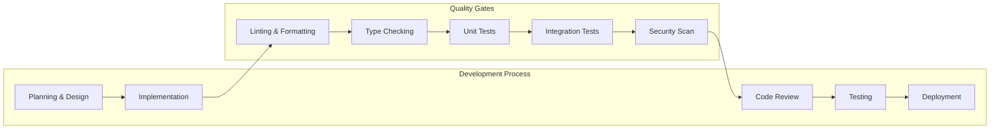

# Coding Standards & Best Practices

This document establishes the coding standards, architectural patterns, and development best practices for the Tolstoy engineering team to ensure code quality, maintainability, and consistency across the platform.

## General Principles

### Code Quality Philosophy

<CardGroup cols={2}>
  <Card title="Core Values" icon="heart">
    **Guiding Principles**
    - Code is written for humans, not machines
    - Simplicity over cleverness
    - Explicit is better than implicit
    - Consistency across the codebase
    - Performance with readability
    - Security by design
  </Card>
  
  <Card title="Quality Metrics" icon="chart-bar">
    **Standards We Maintain**
    - >90% test coverage on core logic
    - <10 cyclomatic complexity per function
    - <200 lines per file (with exceptions)
    - Zero critical security vulnerabilities
    - <5ms p95 response time for API endpoints
    - 100% type safety in TypeScript
  </Card>
</CardGroup>

### Development Workflow



## TypeScript Standards

### Type Safety Requirements

#### Strict Configuration

```typescript
// tsconfig.json - Required configuration
{
  "compilerOptions": {
    "strict": true,
    "noImplicitAny": true,
    "noImplicitReturns": true,
    "noImplicitThis": true,
    "noUnusedLocals": true,
    "noUnusedParameters": true,
    "exactOptionalPropertyTypes": true,
    "noUncheckedIndexedAccess": true
  },
  "rules": {
    // Custom rules for Tolstoy
    "@typescript-eslint/no-any": "error",
    "@typescript-eslint/prefer-readonly": "error",
    "@typescript-eslint/prefer-nullish-coalescing": "error"
  }
}
```

#### Type Definition Standards

<CodeGroup>
```typescript Domain Types (Preferred)
// ✅ GOOD: Well-defined domain types
interface FlowDefinition {
  readonly id: FlowId;
  readonly name: string;
  readonly description: string | null;
  readonly version: number;
  readonly status: FlowStatus;
  readonly inputs: readonly FlowInput[];
  readonly steps: readonly FlowStep[];
  readonly outputs: readonly FlowOutput[];
  readonly settings: FlowSettings;
  readonly metadata: FlowMetadata;
}

// Use branded types for IDs
type FlowId = string & { readonly __brand: 'FlowId' };
type UserId = string & { readonly __brand: 'UserId' };
type OrgId = string & { readonly __brand: 'OrgId' };

// Enum for status values
enum FlowStatus {
  DRAFT = 'draft',
  ACTIVE = 'active',
  INACTIVE = 'inactive',
  ARCHIVED = 'archived'
}
```

```typescript Anti-patterns (Avoid)
// ❌ BAD: Loose typing
interface BadFlowDefinition {
  id: string;
  name?: string;
  data: any; // Never use 'any'
  status: string; // Should be enum
  steps: object[]; // Too generic
  [key: string]: any; // Index signatures without constraints
}

// ❌ BAD: Mutable types
interface MutableFlow {
  id: string;
  steps: FlowStep[]; // Should be readonly
}

// ❌ BAD: Optional properties without reason
interface InconsistentFlow {
  id?: string; // ID should always be present
  name: string;
  version?: number; // Version should have default
}
```
</CodeGroup>

### Error Handling Patterns

#### Structured Error Types

```typescript
// Base error class for all Tolstoy errors
abstract class TolstoyError extends Error {
  abstract readonly code: string;
  abstract readonly statusCode: number;
  readonly timestamp: string;
  readonly context: Record<string, unknown>;

  constructor(
    message: string,
    context: Record<string, unknown> = {}
  ) {
    super(message);
    this.name = this.constructor.name;
    this.timestamp = new Date().toISOString();
    this.context = context;
  }
}

// Domain-specific error classes
class FlowExecutionError extends TolstoyError {
  readonly code = 'FLOW_EXECUTION_ERROR';
  readonly statusCode = 500;

  constructor(
    flowId: FlowId,
    step: string,
    cause: string,
    context: Record<string, unknown> = {}
  ) {
    super(`Flow execution failed at step '${step}': ${cause}`, {
      flowId,
      step,
      cause,
      ...context
    });
  }
}

class ValidationError extends TolstoyError {
  readonly code = 'VALIDATION_ERROR';
  readonly statusCode = 400;

  constructor(
    field: string,
    value: unknown,
    expectedType: string,
    context: Record<string, unknown> = {}
  ) {
    super(`Validation failed for field '${field}': expected ${expectedType}`, {
      field,
      value,
      expectedType,
      ...context
    });
  }
}
```

#### Result Pattern Implementation

```typescript
// Result pattern for better error handling
type Result<T, E = Error> = Success<T> | Failure<E>;

class Success<T> {
  readonly success = true;
  constructor(readonly data: T) {}
}

class Failure<E> {
  readonly success = false;
  constructor(readonly error: E) {}
}

// Usage in service methods
class FlowService {
  async getFlow(flowId: FlowId): Promise<Result<Flow, FlowNotFoundError>> {
    try {
      const flow = await this.flowRepository.findById(flowId);
      if (!flow) {
        return new Failure(new FlowNotFoundError(flowId));
      }
      return new Success(flow);
    } catch (error) {
      return new Failure(new FlowNotFoundError(flowId, error));
    }
  }

  async executeFlow(flowId: FlowId, inputs: FlowInputs): Promise<Result<FlowExecution, FlowExecutionError>> {
    const flowResult = await this.getFlow(flowId);
    if (!flowResult.success) {
      return new Failure(new FlowExecutionError(flowId, 'initialization', flowResult.error.message));
    }

    try {
      const execution = await this.flowEngine.execute(flowResult.data, inputs);
      return new Success(execution);
    } catch (error) {
      return new Failure(new FlowExecutionError(flowId, 'execution', error.message));
    }
  }
}
```

## NestJS Architecture Standards

### Module Organization

```typescript
// Recommended module structure
@Module({
  imports: [
    // External modules first
    ConfigModule,
    DatabaseModule,
    
    // Internal modules alphabetically
    ActionsModule,
    FlowsModule,
    ToolsModule,
    UsersModule
  ],
  controllers: [FlowsController], // Single responsibility
  providers: [
    // Services
    FlowsService,
    FlowExecutionService,
    FlowValidationService,
    
    // Repositories
    FlowRepository,
    
    // Factories
    FlowEngineFactory,
    
    // Custom providers
    {
      provide: 'FLOW_CONFIG',
      useFactory: (configService: ConfigService) => configService.get('flow'),
      inject: [ConfigService]
    }
  ],
  exports: [
    FlowsService,
    FlowRepository
  ]
})
export class FlowsModule {}
```

### Controller Standards

<CodeGroup>
```typescript Best Practices
@Controller('flows')
@ApiTags('flows')
export class FlowsController {
  constructor(
    private readonly flowsService: FlowsService,
    private readonly logger: Logger
  ) {}

  @Get()
  @ApiOperation({ 
    summary: 'List flows',
    description: 'Retrieve paginated list of flows for the organization'
  })
  @ApiResponse({ status: 200, type: FlowListResponse })
  @ApiResponse({ status: 400, type: ValidationErrorResponse })
  @UseGuards(AuthGuard, TenantGuard)
  async listFlows(
    @Query() query: ListFlowsQuery,
    @TenantContext() context: TenantContextDto
  ): Promise<FlowListResponse> {
    this.logger.log(`Listing flows for org: ${context.orgId}`, {
      query,
      userId: context.userId
    });

    const result = await this.flowsService.listFlows(
      context.orgId,
      query
    );

    if (!result.success) {
      throw new BadRequestException(result.error.message);
    }

    return {
      success: true,
      data: result.data,
      pagination: result.pagination
    };
  }

  @Post(':id/execute')
  @ApiOperation({ 
    summary: 'Execute flow',
    description: 'Start execution of a workflow with provided inputs'
  })
  @UseGuards(AuthGuard, TenantGuard, FlowAccessGuard)
  async executeFlow(
    @Param('id', ParseFlowIdPipe) flowId: FlowId,
    @Body() body: ExecuteFlowRequest,
    @TenantContext() context: TenantContextDto
  ): Promise<FlowExecutionResponse> {
    const result = await this.flowsService.executeFlow(
      flowId,
      body.inputs,
      {
        orgId: context.orgId,
        userId: context.userId,
        mode: body.mode || 'async'
      }
    );

    if (!result.success) {
      if (result.error instanceof FlowNotFoundError) {
        throw new NotFoundException(result.error.message);
      }
      throw new BadRequestException(result.error.message);
    }

    return {
      success: true,
      data: result.data
    };
  }
}
```

```typescript Anti-patterns (Avoid)
// ❌ BAD: Poor controller design
@Controller('flows')
export class BadFlowsController {
  // Missing dependency injection
  private flowsService = new FlowsService();

  @Get()
  async getFlows(@Query() query: any): Promise<any> {
    // No error handling
    const flows = await this.flowsService.getFlows(query);
    return flows;
  }

  @Post(':id/execute')
  async execute(@Param('id') id: string, @Body() body: any) {
    // No validation, no error handling, any types
    const result = await this.flowsService.execute(id, body);
    return result;
  }
}
```
</CodeGroup>

### Service Layer Patterns

```typescript
@Injectable()
export class FlowsService {
  constructor(
    private readonly flowRepository: FlowRepository,
    private readonly flowEngine: FlowEngine,
    private readonly logger: Logger,
    @Inject('FLOW_CONFIG') private readonly config: FlowConfig
  ) {}

  async createFlow(
    orgId: OrgId,
    userId: UserId,
    flowDefinition: CreateFlowDefinition
  ): Promise<Result<Flow, ValidationError>> {
    // 1. Validate input
    const validationResult = await this.validateFlowDefinition(flowDefinition);
    if (!validationResult.success) {
      return validationResult;
    }

    // 2. Check permissions
    const hasPermission = await this.checkCreatePermission(orgId, userId);
    if (!hasPermission) {
      return new Failure(new PermissionError('flow:create', userId));
    }

    // 3. Create flow
    try {
      const flow = await this.flowRepository.create({
        ...flowDefinition,
        orgId,
        createdBy: userId,
        version: 1,
        status: FlowStatus.DRAFT
      });

      this.logger.log('Flow created successfully', {
        flowId: flow.id,
        orgId,
        userId,
        name: flow.name
      });

      return new Success(flow);
    } catch (error) {
      this.logger.error('Failed to create flow', {
        error: error.message,
        stack: error.stack,
        orgId,
        userId,
        flowDefinition
      });

      return new Failure(new FlowCreationError(error.message, {
        orgId,
        userId,
        flowDefinition
      }));
    }
  }

  private async validateFlowDefinition(
    definition: CreateFlowDefinition
  ): Promise<Result<void, ValidationError>> {
    // Step validation logic
    if (!definition.name?.trim()) {
      return new Failure(new ValidationError('name', definition.name, 'non-empty string'));
    }

    if (!Array.isArray(definition.steps) || definition.steps.length === 0) {
      return new Failure(new ValidationError('steps', definition.steps, 'non-empty array'));
    }

    if (definition.steps.length > this.config.maxStepsPerFlow) {
      return new Failure(new ValidationError(
        'steps',
        definition.steps.length,
        `array with maximum ${this.config.maxStepsPerFlow} items`
      ));
    }

    return new Success(void 0);
  }
}
```

## Database & Repository Patterns

### Repository Implementation

```typescript
@Injectable()
export class FlowRepository {
  constructor(
    @InjectRepository(FlowEntity) 
    private readonly repository: Repository<FlowEntity>,
    private readonly logger: Logger
  ) {}

  async findById(id: FlowId): Promise<Flow | null> {
    try {
      const entity = await this.repository.findOne({
        where: { id },
        relations: ['createdBy', 'organization']
      });

      return entity ? this.entityToModel(entity) : null;
    } catch (error) {
      this.logger.error('Failed to find flow by ID', {
        id,
        error: error.message
      });
      throw new RepositoryError('findById', error);
    }
  }

  async findByOrganization(
    orgId: OrgId,
    options: FindFlowsOptions = {}
  ): Promise<{ flows: Flow[]; total: number }> {
    const query = this.repository
      .createQueryBuilder('flow')
      .leftJoinAndSelect('flow.createdBy', 'user')
      .where('flow.orgId = :orgId', { orgId });

    // Apply filters
    if (options.status) {
      query.andWhere('flow.status = :status', { status: options.status });
    }

    if (options.search) {
      query.andWhere(
        '(flow.name ILIKE :search OR flow.description ILIKE :search)',
        { search: `%${options.search}%` }
      );
    }

    if (options.tags?.length) {
      query.andWhere('flow.tags && :tags', { tags: options.tags });
    }

    // Apply sorting
    const sortField = options.sortBy || 'updatedAt';
    const sortOrder = options.sortOrder || 'DESC';
    query.orderBy(`flow.${sortField}`, sortOrder);

    // Apply pagination
    if (options.limit) {
      query.limit(options.limit);
      if (options.offset) {
        query.offset(options.offset);
      }
    }

    const [entities, total] = await query.getManyAndCount();
    const flows = entities.map(entity => this.entityToModel(entity));

    return { flows, total };
  }

  async create(flowData: CreateFlowData): Promise<Flow> {
    const entity = this.repository.create({
      id: generateFlowId(),
      ...flowData,
      createdAt: new Date(),
      updatedAt: new Date()
    });

    const saved = await this.repository.save(entity);
    return this.entityToModel(saved);
  }

  private entityToModel(entity: FlowEntity): Flow {
    return {
      id: entity.id as FlowId,
      name: entity.name,
      description: entity.description,
      version: entity.version,
      status: entity.status as FlowStatus,
      definition: entity.definition,
      tags: entity.tags,
      orgId: entity.orgId as OrgId,
      createdBy: entity.createdBy ? {
        id: entity.createdBy.id as UserId,
        name: entity.createdBy.name,
        email: entity.createdBy.email
      } : null,
      createdAt: entity.createdAt.toISOString(),
      updatedAt: entity.updatedAt.toISOString()
    };
  }
}
```

### Database Entity Standards

```typescript
@Entity('flows')
export class FlowEntity {
  @PrimaryGeneratedColumn('uuid')
  id: string;

  @Column({ name: 'org_id', type: 'uuid' })
  @Index()
  orgId: string;

  @Column({ type: 'varchar', length: 255 })
  name: string;

  @Column({ type: 'text', nullable: true })
  description: string | null;

  @Column({ type: 'jsonb' })
  definition: FlowDefinitionJson;

  @Column({ type: 'int', default: 1 })
  version: number;

  @Column({ 
    type: 'enum', 
    enum: FlowStatus, 
    default: FlowStatus.DRAFT 
  })
  @Index()
  status: FlowStatus;

  @Column({ type: 'text', array: true, default: [] })
  tags: string[];

  @Column({ name: 'created_by', type: 'uuid' })
  createdById: string;

  @ManyToOne(() => UserEntity, { eager: false })
  @JoinColumn({ name: 'created_by' })
  createdBy?: UserEntity;

  @ManyToOne(() => OrganizationEntity, { eager: false })
  @JoinColumn({ name: 'org_id' })
  organization?: OrganizationEntity;

  @CreateDateColumn({ name: 'created_at' })
  createdAt: Date;

  @UpdateDateColumn({ name: 'updated_at' })
  updatedAt: Date;

  // Soft delete support
  @DeleteDateColumn({ name: 'deleted_at', nullable: true })
  deletedAt?: Date;
}
```

## Testing Standards

### Unit Testing Patterns

<CodeGroup>
```typescript Service Unit Tests
describe('FlowsService', () => {
  let service: FlowsService;
  let repository: jest.Mocked<FlowRepository>;
  let flowEngine: jest.Mocked<FlowEngine>;

  beforeEach(async () => {
    const module = await Test.createTestingModule({
      providers: [
        FlowsService,
        {
          provide: FlowRepository,
          useValue: createMockRepository()
        },
        {
          provide: FlowEngine,
          useValue: createMockFlowEngine()
        },
        {
          provide: Logger,
          useValue: createMockLogger()
        },
        {
          provide: 'FLOW_CONFIG',
          useValue: { maxStepsPerFlow: 50 }
        }
      ]
    }).compile();

    service = module.get(FlowsService);
    repository = module.get(FlowRepository);
    flowEngine = module.get(FlowEngine);
  });

  describe('createFlow', () => {
    it('should create flow successfully with valid input', async () => {
      // Arrange
      const orgId = 'org_123' as OrgId;
      const userId = 'user_456' as UserId;
      const flowDefinition = createValidFlowDefinition();
      const expectedFlow = createMockFlow();

      repository.create.mockResolvedValue(expectedFlow);

      // Act
      const result = await service.createFlow(orgId, userId, flowDefinition);

      // Assert
      expect(result.success).toBe(true);
      if (result.success) {
        expect(result.data).toEqual(expectedFlow);
      }
      expect(repository.create).toHaveBeenCalledWith({
        ...flowDefinition,
        orgId,
        createdBy: userId,
        version: 1,
        status: FlowStatus.DRAFT
      });
    });

    it('should return validation error for invalid flow definition', async () => {
      // Arrange
      const orgId = 'org_123' as OrgId;
      const userId = 'user_456' as UserId;
      const invalidDefinition = { name: '', steps: [] }; // Invalid

      // Act
      const result = await service.createFlow(orgId, userId, invalidDefinition);

      // Assert
      expect(result.success).toBe(false);
      if (!result.success) {
        expect(result.error).toBeInstanceOf(ValidationError);
        expect(result.error.message).toContain('name');
      }
      expect(repository.create).not.toHaveBeenCalled();
    });
  });
});
```

```typescript Integration Tests
describe('FlowsController (Integration)', () => {
  let app: INestApplication;
  let repository: Repository<FlowEntity>;
  
  beforeEach(async () => {
    const module = await Test.createTestingModule({
      imports: [
        TestDatabaseModule,
        FlowsModule
      ]
    })
    .overrideProvider(FlowEngine)
    .useValue(createMockFlowEngine())
    .compile();

    app = module.createNestApplication();
    await app.init();

    repository = module.get(getRepositoryToken(FlowEntity));
  });

  afterEach(async () => {
    await repository.clear();
    await app.close();
  });

  describe('POST /flows', () => {
    it('should create flow and return 201', async () => {
      // Arrange
      const flowData = createValidFlowDefinition();

      // Act & Assert
      const response = await request(app.getHttpServer())
        .post('/flows')
        .set('x-org-id', 'org_123')
        .set('x-user-id', 'user_456')
        .send(flowData)
        .expect(201);

      expect(response.body.success).toBe(true);
      expect(response.body.data.name).toBe(flowData.name);

      // Verify database state
      const savedFlow = await repository.findOne({
        where: { name: flowData.name }
      });
      expect(savedFlow).toBeTruthy();
    });
  });
});
```
</CodeGroup>

### Test Utilities

```typescript
// test/utils/factories.ts
export function createValidFlowDefinition(): CreateFlowDefinition {
  return {
    name: 'Test Flow',
    description: 'A test flow for unit tests',
    steps: [
      {
        key: 'step1',
        name: 'First Step',
        action: 'test-action',
        inputs: { message: 'Hello World' }
      }
    ],
    inputs: [
      {
        name: 'input1',
        type: 'string',
        required: true,
        description: 'Test input'
      }
    ],
    tags: ['test', 'unit-test']
  };
}

export function createMockFlow(): Flow {
  return {
    id: 'flow_test_123' as FlowId,
    name: 'Test Flow',
    description: 'A test flow',
    version: 1,
    status: FlowStatus.DRAFT,
    definition: createValidFlowDefinition(),
    tags: ['test'],
    orgId: 'org_123' as OrgId,
    createdBy: {
      id: 'user_456' as UserId,
      name: 'Test User',
      email: 'test@example.com'
    },
    createdAt: '2024-01-20T10:00:00Z',
    updatedAt: '2024-01-20T10:00:00Z'
  };
}
```

## Security Standards

### Input Validation

```typescript
// Validation decorators
import { IsString, IsEmail, IsUUID, IsEnum, IsOptional, ValidateNested, IsArray, ArrayMinSize, MaxLength } from 'class-validator';
import { Type } from 'class-transformer';

export class CreateFlowRequest {
  @IsString()
  @MaxLength(255)
  name: string;

  @IsString()
  @IsOptional()
  @MaxLength(1000)
  description?: string;

  @IsArray()
  @ArrayMinSize(1)
  @ValidateNested({ each: true })
  @Type(() => FlowStepDto)
  steps: FlowStepDto[];

  @IsArray()
  @IsOptional()
  @ValidateNested({ each: true })
  @Type(() => FlowInputDto)
  inputs?: FlowInputDto[];

  @IsArray()
  @IsOptional()
  @IsString({ each: true })
  tags?: string[];
}

export class FlowStepDto {
  @IsString()
  @MaxLength(100)
  key: string;

  @IsString()
  @MaxLength(255)
  name: string;

  @IsString()
  action: string;

  @IsOptional()
  inputs?: Record<string, any>;

  @IsString()
  @IsOptional()
  executeIf?: string;
}
```

### Authentication & Authorization

```typescript
// Custom guards for security
@Injectable()
export class TenantGuard implements CanActivate {
  constructor(private readonly logger: Logger) {}

  canActivate(context: ExecutionContext): boolean {
    const request = context.switchToHttp().getRequest();
    const orgId = request.headers['x-org-id'];
    const userId = request.headers['x-user-id'];

    if (!orgId || !userId) {
      this.logger.warn('Missing tenant context in request', {
        url: request.url,
        method: request.method,
        headers: this.sanitizeHeaders(request.headers)
      });
      return false;
    }

    // Set tenant context for use in services
    request.tenantContext = {
      orgId: orgId as OrgId,
      userId: userId as UserId
    };

    return true;
  }

  private sanitizeHeaders(headers: any): any {
    const { authorization, ...safe } = headers;
    return safe;
  }
}
```

## Performance Standards

### Caching Strategies

```typescript
@Injectable()
export class CachingFlowService extends FlowsService {
  constructor(
    flowRepository: FlowRepository,
    flowEngine: FlowEngine,
    private readonly cacheManager: Cache,
    logger: Logger
  ) {
    super(flowRepository, flowEngine, logger);
  }

  async getFlow(flowId: FlowId): Promise<Result<Flow, FlowNotFoundError>> {
    const cacheKey = `flow:${flowId}`;
    
    // Try cache first
    const cached = await this.cacheManager.get<Flow>(cacheKey);
    if (cached) {
      return new Success(cached);
    }

    // Fallback to database
    const result = await super.getFlow(flowId);
    if (result.success) {
      await this.cacheManager.set(
        cacheKey, 
        result.data, 
        300_000 // 5 minutes TTL
      );
    }

    return result;
  }

  async invalidateFlowCache(flowId: FlowId): Promise<void> {
    await this.cacheManager.del(`flow:${flowId}`);
  }
}
```

### Query Optimization

```typescript
// Optimized repository queries
async findFlowsWithStats(
  orgId: OrgId,
  options: FindFlowsOptions
): Promise<{ flows: FlowWithStats[]; total: number }> {
  // Single query with joins to avoid N+1 problem
  const query = this.repository
    .createQueryBuilder('flow')
    .leftJoinAndSelect('flow.createdBy', 'user')
    .leftJoinAndSelect(
      subQuery => subQuery
        .select([
          'e.flowId',
          'COUNT(*) as totalExecutions',
          'AVG(CASE WHEN e.status = \'completed\' THEN 1.0 ELSE 0.0 END) as successRate',
          'AVG(e.durationMs) as avgDuration'
        ])
        .from(ExecutionEntity, 'e')
        .where('e.createdAt > :since', { since: subDate(30, 'days') })
        .groupBy('e.flowId'),
      'stats',
      'stats.flowId = flow.id'
    )
    .where('flow.orgId = :orgId', { orgId });

  const [entities, total] = await query.getManyAndCount();
  
  return {
    flows: entities.map(this.entityToModelWithStats),
    total
  };
}
```

This comprehensive coding standards document ensures consistent, maintainable, and secure code across the Tolstoy platform while promoting best practices for TypeScript, NestJS, and our specific domain requirements.

---

*These coding standards should be regularly reviewed and updated to reflect evolving best practices and lessons learned from production experience.*