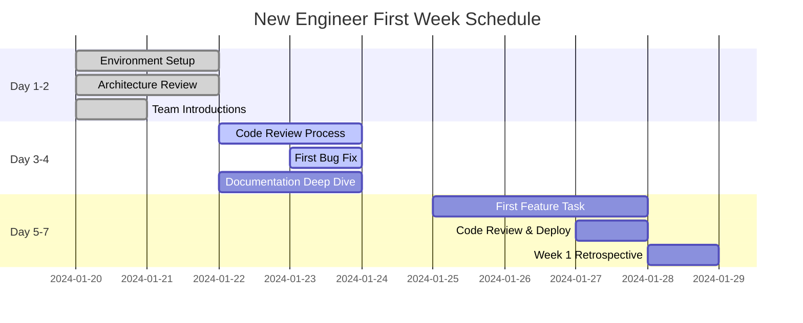
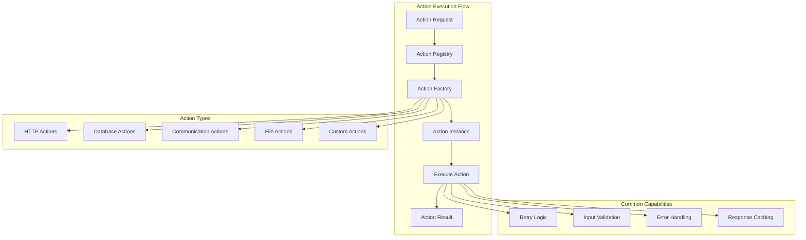
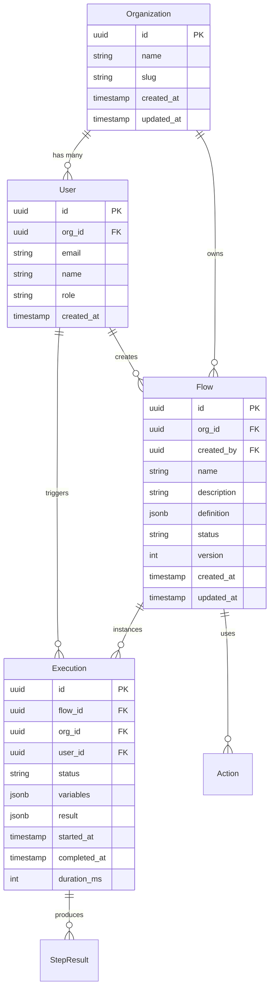

# Engineering Onboarding Guide

Welcome to the Tolstoy engineering team! This guide will help you get up to speed with our platform, development practices, and team culture.

## Getting Started - First Day

### Essential Accounts & Access

<CardGroup cols={2}>
  <Card title="Required Accounts" icon="user-plus">
    **Immediate Setup**
    - [ ] GitHub Organization Access
    - [ ] AWS Console Access (ReadOnly initially)
    - [ ] Slack Workspace Invitation
    - [ ] Linear/Jira Project Access
    - [ ] 1Password Team Account
    - [ ] Notion Workspace Access
    
    **Development Tools**
    - [ ] Docker Desktop
    - [ ] Node.js 18+ (via nvm)
    - [ ] VS Code + Extensions
    - [ ] Postman/Insomnia
  </Card>
  
  <Card title="First Day Checklist" icon="check-circle">
    **Setup Tasks**
    - [ ] Clone main repository
    - [ ] Run local development setup
    - [ ] Complete security training
    - [ ] Meet your mentor
    - [ ] Join team Slack channels
    - [ ] Review architecture docs
    
    **Team Introductions**
    - [ ] Engineering team standup
    - [ ] Product team sync
    - [ ] Customer success overview
    - [ ] Leadership coffee chat
  </Card>
</CardGroup>

### Development Environment Setup

#### 1. Repository Setup

<CodeGroup>
```bash Initial Clone & Setup
# Clone the main repository
git clone git@github.com:tolstoy/tolstoy.git
cd tolstoy

# Install dependencies
npm install

# Set up environment variables
cp .env.example .env.local
# Edit .env.local with your values (ask your mentor for secrets)

# Install global development tools
npm install -g @nestjs/cli
npm install -g tsx
npm install -g nodemon
```

```bash Database Setup (Local)
# Start local PostgreSQL with Docker
docker run --name tolstoy-postgres \
  -e POSTGRES_DB=tolstoy_dev \
  -e POSTGRES_USER=tolstoy \
  -e POSTGRES_PASSWORD=dev_password \
  -p 5432:5432 \
  -d postgres:14

# Start Redis for caching
docker run --name tolstoy-redis \
  -p 6379:6379 \
  -d redis:7

# Run database migrations
npm run migration:run

# Seed development data
npm run seed:dev
```

```bash Verify Setup
# Run tests to verify everything works
npm run test:unit

# Start development server
npm run start:dev

# Test API health endpoint
curl http://localhost:3000/health

# Expected response:
# {"status":"healthy","timestamp":"2024-01-20T10:00:00Z","environment":"development"}
```
</CodeGroup>

#### 2. IDE Configuration

**VS Code Extensions (Required):**
```json
{
  "recommendations": [
    "ms-vscode.vscode-typescript-next",
    "bradlc.vscode-tailwindcss",
    "ms-vscode.vscode-json",
    "esbenp.prettier-vscode",
    "dbaeumer.vscode-eslint",
    "ms-vscode-remote.remote-containers",
    "ms-vscode.vscode-jest",
    "formulahendry.auto-rename-tag",
    "christian-kohler.path-intellisense"
  ]
}
```

**Workspace Settings:**
```json
{
  "typescript.preferences.importModuleSpecifier": "relative",
  "editor.formatOnSave": true,
  "editor.codeActionsOnSave": {
    "source.fixAll.eslint": true,
    "source.organizeImports": true
  },
  "jest.autoEnable": true,
  "jest.showCoverageOnLoad": true
}
```

### Your First Week Goals



## Architecture Deep Dive

### System Overview

<CardGroup cols={2}>
  <Card title="Core Platform" icon="cog">
    **Primary Services**
    - **API Gateway**: NestJS application
    - **Flow Engine**: Workflow execution engine
    - **Action System**: Integration framework
    - **User Management**: Authentication & authorization
    
    **Data Layer**
    - PostgreSQL for primary data
    - Redis for caching & sessions
    - S3 for file storage
    - SQS for async processing
  </Card>
  
  <Card title="Infrastructure" icon="server">
    **AWS Services**
    - ECS Fargate for container orchestration
    - RDS PostgreSQL with read replicas
    - ElastiCache Redis cluster
    - Application Load Balancer
    - CloudWatch for monitoring
    
    **Development Stack**
    - TypeScript/Node.js backend
    - React/Next.js frontend
    - Docker for containerization
    - GitHub Actions for CI/CD
  </Card>
</CardGroup>

### Key Architectural Concepts

#### 1. Flow Execution Model

```typescript
// Understanding our flow execution architecture
interface FlowExecution {
  // Core execution data
  id: ExecutionId;
  flowId: FlowId;
  orgId: OrgId;
  userId: UserId;
  
  // Execution state
  status: 'pending' | 'running' | 'completed' | 'failed' | 'timeout';
  currentStep: number;
  variables: Record<string, any>;
  
  // Timing information
  startedAt: Date;
  completedAt?: Date;
  duration?: number;
  
  // Result data
  result?: ExecutionResult;
  error?: ExecutionError;
}

// Key concepts to understand:
// 1. Flows are definitions, Executions are instances
// 2. Each step can modify the execution context
// 3. Variables persist across steps within an execution
// 4. Executions can be paused and resumed (future feature)
```

#### 2. Action System Architecture



### Code Organization

```
src/
├── actions/              # Action system implementation
│   ├── registry/         # Action registry and factory
│   ├── types/           # Action type definitions
│   └── implementations/ # Built-in action implementations
├── flows/               # Flow management
│   ├── engine/          # Flow execution engine
│   ├── conditions/      # Condition evaluation
│   └── validators/      # Flow validation
├── users/               # User management
├── organizations/       # Multi-tenancy
├── auth/               # Authentication & authorization
├── common/             # Shared utilities
├── database/           # Database configuration
└── config/             # Application configuration
```

### Data Models

#### Core Entities Relationship



## Development Workflow

### Git Workflow

We follow a **modified GitFlow** with the following branches:

<CodeGroup>
```bash Branch Strategy
# Main branches
main              # Production-ready code
develop           # Integration branch for features

# Feature branches
feature/TICKET-123-add-action-validation
feature/TICKET-456-improve-error-handling

# Hotfix branches
hotfix/fix-critical-memory-leak
hotfix/patch-security-vulnerability

# Release branches (for major releases)
release/v2.1.0
```

```bash Typical Workflow
# 1. Create feature branch from develop
git checkout develop
git pull origin develop
git checkout -b feature/TICKET-123-add-action-validation

# 2. Make changes and commit
git add .
git commit -m "feat(actions): add input validation for HTTP actions

- Add JSON schema validation
- Improve error messages
- Add unit tests for validation logic

Closes TICKET-123"

# 3. Push and create PR
git push origin feature/TICKET-123-add-action-validation
# Create PR targeting 'develop' branch

# 4. After approval and merge, clean up
git checkout develop
git pull origin develop
git branch -d feature/TICKET-123-add-action-validation
```
</CodeGroup>

### Commit Message Convention

We use **Conventional Commits** for consistent commit messages:

```
<type>(<scope>): <description>

[optional body]

[optional footer(s)]
```

**Types:**
- `feat`: New feature
- `fix`: Bug fix
- `docs`: Documentation changes
- `style`: Code formatting (no logic changes)
- `refactor`: Code restructuring
- `test`: Adding or modifying tests
- `chore`: Build process or tool changes

**Examples:**
```bash
feat(flows): add conditional execution support
fix(auth): resolve token refresh race condition
docs(api): update authentication endpoint documentation
test(actions): add unit tests for HTTP action validation
refactor(database): optimize user queries for performance
```

### Code Review Process

#### Before Submitting a PR

<CardGroup cols={2}>
  <Card title="Code Quality" icon="code">
    **Automated Checks**
    - [ ] All tests pass locally
    - [ ] TypeScript compilation successful
    - [ ] ESLint shows no errors
    - [ ] Prettier formatting applied
    - [ ] No console.log statements
    - [ ] Security scan passes
  </Card>
  
  <Card title="Documentation" icon="book">
    **Required Updates**
    - [ ] Update relevant documentation
    - [ ] Add/update unit tests (>80% coverage)
    - [ ] Update API documentation if needed
    - [ ] Add inline code comments for complex logic
    - [ ] Update CHANGELOG.md for user-facing changes
  </Card>
</CardGroup>

#### PR Template

```markdown
## Description
Brief description of the changes and why they were made.

## Type of Change
- [ ] Bug fix (non-breaking change which fixes an issue)
- [ ] New feature (non-breaking change which adds functionality)
- [ ] Breaking change (fix or feature that would cause existing functionality to not work as expected)
- [ ] Documentation update

## Testing
- [ ] Unit tests added/updated
- [ ] Integration tests added/updated
- [ ] Manual testing completed
- [ ] Performance impact assessed

## Checklist
- [ ] Code follows the project's coding standards
- [ ] Self-review of code completed
- [ ] Documentation updated
- [ ] No new warnings or errors introduced
- [ ] Changes tested in development environment

## Additional Notes
Any additional information, context, or screenshots.
```

### Testing Strategy

<CodeGroup>
```typescript Unit Testing Example
// Example unit test for a service method
describe('FlowService', () => {
  let service: FlowService;
  let repository: jest.Mocked<FlowRepository>;

  beforeEach(async () => {
    const module = await Test.createTestingModule({
      providers: [
        FlowService,
        {
          provide: FlowRepository,
          useValue: createMockRepository()
        }
      ]
    }).compile();

    service = module.get(FlowService);
    repository = module.get(FlowRepository);
  });

  describe('createFlow', () => {
    it('should create a new flow successfully', async () => {
      // Arrange
      const orgId = 'org-123';
      const userId = 'user-456';
      const flowData = createMockFlowData();
      const expectedFlow = createMockFlow();

      repository.create.mockResolvedValue(expectedFlow);

      // Act
      const result = await service.createFlow(orgId, userId, flowData);

      // Assert
      expect(result.success).toBe(true);
      expect(result.data).toEqual(expectedFlow);
      expect(repository.create).toHaveBeenCalledWith({
        ...flowData,
        orgId,
        createdBy: userId
      });
    });
  });
});
```

```typescript Integration Testing Example
// Example integration test
describe('FlowsController (Integration)', () => {
  let app: INestApplication;
  
  beforeEach(async () => {
    const module = await Test.createTestingModule({
      imports: [TestDatabaseModule, FlowsModule]
    }).compile();

    app = module.createNestApplication();
    await app.init();
  });

  afterEach(async () => {
    await app.close();
  });

  describe('POST /flows', () => {
    it('should create a new flow', async () => {
      const flowData = {
        name: 'Test Flow',
        description: 'A test flow',
        steps: [
          {
            key: 'step1',
            name: 'First Step',
            action: 'http-request',
            inputs: { url: 'https://api.example.com' }
          }
        ]
      };

      const response = await request(app.getHttpServer())
        .post('/flows')
        .set('x-org-id', 'test-org')
        .set('x-user-id', 'test-user')
        .send(flowData)
        .expect(201);

      expect(response.body.success).toBe(true);
      expect(response.body.data.name).toBe(flowData.name);
    });
  });
});
```
</CodeGroup>

## Team Practices & Culture

### Communication Guidelines

<CardGroup cols={2}>
  <Card title="Slack Etiquette" icon="slack">
    **Key Channels**
    - `#engineering` - General engineering discussion
    - `#incidents` - Production incidents
    - `#deployments` - Deployment notifications
    - `#code-reviews` - PR review requests
    - `#random` - Casual conversation
    
    **Best Practices**
    - Use threads for discussions
    - @channel sparingly (only for urgent issues)
    - Update your status for deep work/meetings
    - Use emojis for quick acknowledgments
  </Card>
  
  <Card title="Meeting Culture" icon="calendar">
    **Regular Meetings**
    - Daily standup (15 min, async in Slack)
    - Sprint planning (bi-weekly, 2 hours)
    - Sprint retrospectives (bi-weekly, 1 hour)
    - Architecture reviews (monthly)
    - All-hands (monthly)
    
    **Meeting Guidelines**
    - Always have an agenda
    - Start/end on time
    - Action items with owners
    - Record important decisions
  </Card>
</CardGroup>

### Knowledge Sharing

#### Engineering Blog Posts
We encourage team members to write about their learnings:

**Suggested Topics:**
- Problem-solving approaches
- Performance optimizations
- New technology evaluations
- Architecture decisions
- Debugging techniques

#### Tech Talks
Monthly internal tech talks where team members share:
- New features they've built
- Interesting technical challenges
- Tools and techniques
- Industry trends and learnings

### Career Development

#### Skill Assessment Matrix

| Skill Area | Junior | Mid-Level | Senior | Staff+ |
|------------|--------|-----------|--------|--------|
| **Code Quality** | Follows standards | Writes clean, maintainable code | Establishes best practices | Influences org-wide standards |
| **System Design** | Understands existing systems | Designs components | Designs systems | Architect complex systems |
| **Debugging** | Debugs own code | Debugs team's code | Debugs production issues | Leads incident response |
| **Mentoring** | Learns from others | Helps junior developers | Mentors team members | Develops other mentors |
| **Communication** | Asks good questions | Explains technical concepts | Leads technical discussions | Influences decision-making |

#### Growth Opportunities

<CardGroup cols={3}>
  <Card title="Technical Growth" icon="cog">
    **Skill Development**
    - Code review participation
    - Architecture design sessions
    - Production support rotation
    - Cross-team collaboration
    - Open source contributions
  </Card>
  
  <Card title="Leadership Growth" icon="users">
    **Leadership Opportunities**
    - Mentoring new engineers
    - Leading project initiatives
    - Technical decision-making
    - Process improvements
    - Team retrospective facilitation
  </Card>
  
  <Card title="Domain Expertise" icon="brain">
    **Specialization Areas**
    - Platform architecture
    - DevOps & infrastructure
    - Security & compliance
    - Performance optimization
    - Developer tooling
  </Card>
</CardGroup>

## Your First Tasks

### Week 1: Foundation Building

1. **Environment Setup** (Day 1-2)
   - Complete development environment setup
   - Run all tests locally
   - Deploy a simple change to staging

2. **Code Exploration** (Day 3-4)
   - Fix your first bug (your mentor will assign)
   - Review recent PRs to understand patterns
   - Read through key architectural components

3. **First Feature** (Day 5-7)
   - Implement a small feature with guidance
   - Complete code review process
   - Deploy to production

### Month 1: Getting Productive

**Goals:**
- Understand the full development workflow
- Make meaningful contributions to the codebase
- Build relationships with team members
- Learn our core business domain

**Milestones:**
- Ship 3-5 features/bug fixes
- Complete security training
- Give a 5-minute tech talk on something you learned
- Participate in incident response (shadowing)

### Month 3: Full Team Member

**Goals:**
- Take ownership of features end-to-end
- Mentor newer team members
- Contribute to architectural decisions
- Understand customer impact of your work

**Milestones:**
- Lead a medium-sized feature from design to deployment
- Participate in on-call rotation
- Present at engineering all-hands
- Complete customer feedback session

## Resources & References

### Internal Documentation
- [Architecture Overview](/internal/architecture/system-diagrams)
- [API Documentation](/api)
- [Security Guidelines](/internal/security/security-architecture)
- [Deployment Guide](/internal/operations/deployment-guide)
- [Troubleshooting Guide](/internal/operations/troubleshooting-guide)

### External Resources
- [NestJS Documentation](https://docs.nestjs.com/)
- [TypeScript Handbook](https://www.typescriptlang.org/docs/)
- [PostgreSQL Documentation](https://www.postgresql.org/docs/)
- [AWS ECS Guide](https://docs.aws.amazon.com/ecs/)
- [Docker Best Practices](https://docs.docker.com/develop/dev-best-practices/)

### Learning Path
1. **Week 1-2**: Focus on setup and understanding the codebase
2. **Month 1**: Master the development workflow and basic features
3. **Month 2**: Dive deep into architecture and complex features
4. **Month 3**: Contribute to system design and mentor others

Welcome to the team! We're excited to have you aboard and can't wait to see what you'll build with us. 🚀

---

*This onboarding guide is regularly updated based on feedback from new team members. If you notice anything that could be improved, please create a PR or mention it in your feedback sessions.*