# Feature Matrix & Capabilities

This document provides a comprehensive overview of Tolstoy's feature set, technical capabilities, current limitations, and planned enhancements for internal engineering reference.

## Core Platform Features

### Flow Engine Capabilities

<CardGroup cols={2}>
  <Card title="✅ Supported Features" icon="check">
    **Execution Modes**
    - Synchronous execution (up to 10 minutes)
    - Asynchronous execution (unlimited duration)
    - Scheduled execution (cron-based)
    - Event-triggered execution (webhooks)
    
    **Flow Control**
    - Conditional logic (if/else/switch)
    - Loops (for-each, while, do-while)
    - Parallel step execution (up to 10 concurrent)
    - Error handling and retry policies
    - Dynamic variable resolution
    
    **Data Handling**
    - JSON data manipulation
    - Template variable substitution
    - Data validation and transformation
    - File upload/download (up to 100MB)
    - Binary data processing
  </Card>
  <Card title="⚠️ Current Limitations" icon="exclamation-triangle">
    **Performance Constraints**
    - Max 50 steps per flow
    - Max 10MB input/output size per step
    - Max 10 parallel steps per execution
    - Max 1000 concurrent executions per organization
    
    **Feature Gaps**
    - No visual flow builder (code-based only)
    - Limited debugging capabilities
    - No A/B testing for flows
    - No version rollback automation
    - No flow templates marketplace
    
    **Technical Debt**
    - Legacy condition evaluator (performance impact)
    - Missing distributed tracing
    - Inconsistent error message formats
  </Card>
</CardGroup>

### Action System Matrix

| Feature Category | Status | Capabilities | Limitations |
|------------------|---------|--------------|-------------|
| **Built-in Actions** | ✅ Production | 156 core actions across all categories | Limited customization options |
| **HTTP Actions** | ✅ Production | Full REST/GraphQL support, auth methods | 30s timeout limit, no streaming |
| **Database Actions** | ✅ Production | PostgreSQL, MySQL, MongoDB support | No real-time subscriptions |
| **Communication** | ✅ Production | Email, SMS, Slack, Teams, Discord | Rate limited by providers |
| **Data Processing** | ✅ Production | JSON/XML/CSV transformation, validation | No complex ML operations |
| **File Operations** | ✅ Production | Upload, download, format conversion | 100MB file size limit |
| **Custom Actions** | 🚧 Beta | JavaScript runtime, NPM package support | Limited debugging, no versioning |
| **AI/ML Actions** | 📋 Planned | OpenAI, Anthropic integration planned | Not yet available |
| **Blockchain** | 📋 Planned | Web3 actions planned for Q3 2024 | Not yet available |

### Integration Ecosystem

#### Supported Integrations

<CardGroup cols={3}>
  <Card title="Communication" icon="chat">
    **Production Ready**
    - Slack (API 2.1.0) ✅
    - Microsoft Teams ✅
    - Discord ✅
    - SendGrid ✅
    - AWS SES ✅
    - Twilio SMS ✅
    - WhatsApp Business ✅
    
    **Limitations**
    - Slack: 50 req/min rate limit
    - Teams: No adaptive cards
    - Discord: No voice features
  </Card>
  
  <Card title="CRM & Sales" icon="briefcase">
    **Production Ready**
    - Salesforce (v58.0) ✅
    - HubSpot (v3) ✅
    - Pipedrive ✅
    - Zoho CRM ✅
    - Microsoft Dynamics ✅
    
    **Beta Support**
    - Close.com 🚧
    - Copper CRM 🚧
    
    **Limitations**
    - Salesforce: No bulk operations
    - HubSpot: Limited custom properties
  </Card>
  
  <Card title="Development" icon="code">
    **Production Ready**
    - GitHub (v4 GraphQL) ✅
    - GitLab (v4) ✅
    - Jira (v3) ✅
    - Confluence ✅
    - Jenkins ✅
    - CircleCI ✅
    
    **Limitations**
    - GitHub: No enterprise features
    - Jira: Limited JQL support
    - Jenkins: No pipeline triggers
  </Card>
</CardGroup>

#### Integration Architecture


## Technical Specifications

### Performance Characteristics

| Metric | Current Performance | Target Performance | Bottlenecks |
|--------|-------------------|-------------------|-------------|
| **API Response Time** | | | |
| - Flow execution (async) | p95: 150ms | p95: 100ms | Database queries |
| - Flow execution (sync) | p95: 2.5s | p95: 2.0s | External API calls |
| - Flow listing | p95: 200ms | p95: 150ms | PostgreSQL pagination |
| - Action execution | p95: 800ms | p95: 500ms | Network latency |
| **Throughput** | | | |
| - Concurrent executions | 1,000 | 5,000 | Queue processing |
| - API requests/min | 50,000 | 100,000 | Rate limiting |
| - Database connections | 200 | 500 | Connection pooling |
| **Reliability** | | | |
| - System uptime | 99.5% | 99.9% | Deployment downtime |
| - Execution success rate | 97.8% | 99.0% | External API failures |
| - Data durability | 99.999% | 99.9999% | Multi-region backup |

### Scalability Limits

#### Current Architecture Limits

```typescript
// Current system constraints
const SYSTEM_LIMITS = {
  // Per Organization
  maxFlowsPerOrg: 1000,
  maxActionsPerOrg: 500,
  maxToolsPerOrg: 100,
  maxUsersPerOrg: 1000,
  maxExecutionsPerDay: 100000,
  
  // Per Flow
  maxStepsPerFlow: 50,
  maxInputSizeKB: 1024, // 1MB
  maxOutputSizeKB: 1024, // 1MB
  maxExecutionTimeMinutes: 600, // 10 hours
  maxRetryAttempts: 5,
  
  // Per Execution
  maxParallelSteps: 10,
  maxVariableMemoryMB: 100,
  maxFileUploadMB: 100,
  maxWebhookPayloadKB: 10240, // 10MB
  
  // Infrastructure
  maxDatabaseConnections: 200,
  maxCacheMemoryGB: 64,
  maxQueueDepth: 50000,
  maxConcurrentWorkers: 100
} as const;
```

#### Scaling Strategies

<CardGroup cols={2}>
  <Card title="Horizontal Scaling" icon="arrows-expand">
    **Current Approach**
    - ECS Fargate auto-scaling (2-50 tasks)
    - Read replica scaling (1-5 replicas)
    - Redis cluster scaling (3-9 nodes)
    - Queue worker scaling (10-100 workers)
    
    **Planned Improvements**
    - Multi-region deployment
    - Database sharding by org_id
    - CDN expansion (Edge locations)
    - Function-based microservices
  </Card>
  
  <Card title="Vertical Scaling" icon="arrow-up">
    **Current Resources**
    - API services: 2 vCPU, 4GB RAM
    - Worker services: 1 vCPU, 2GB RAM
    - Database: 16 vCPU, 64GB RAM
    - Cache: 8 vCPU, 32GB RAM
    
    **Scaling Headroom**
    - API: Can scale to 8 vCPU, 16GB
    - Workers: Can scale to 4 vCPU, 8GB  
    - Database: Can scale to 64 vCPU, 256GB
    - Cache: Can scale to 32 vCPU, 128GB
  </Card>
</CardGroup>

## Security & Compliance Features

### Security Implementation Status

| Security Feature | Implementation Status | Details |
|------------------|----------------------|---------|
| **Authentication** | ✅ Production | API Keys, JWT tokens, OAuth 2.0 |
| **Authorization** | ✅ Production | RBAC with org-level isolation |
| **Data Encryption** | ✅ Production | TLS 1.3, AES-256 at rest |
| **Secrets Management** | ✅ Production | AWS Secrets Manager integration |
| **Audit Logging** | ✅ Production | Complete action audit trail |
| **Rate Limiting** | ✅ Production | Per-user and per-org limits |
| **Input Validation** | ✅ Production | JSON schema validation |
| **CORS Protection** | ✅ Production | Configurable origin policies |
| **SQL Injection Prevention** | ✅ Production | Parameterized queries only |
| **XSS Protection** | ✅ Production | Content sanitization |
| **CSRF Protection** | 🚧 Partial | API-only, no session cookies |
| **WAF Integration** | 🚧 Partial | Basic DDoS protection |
| **Penetration Testing** | 📋 Planned | Quarterly security audits |
| **Bug Bounty Program** | 📋 Planned | Public disclosure program |

### Compliance Status

<CardGroup cols={2}>
  <Card title="Current Compliance" icon="shield-check">
    **Achieved Certifications**
    - SOC 2 Type I (2024) ✅
    - GDPR Compliance ✅
    - CCPA Compliance ✅
    - ISO 27001 (in progress) 🚧
    
    **Security Measures**
    - Data residency controls
    - Right to deletion (GDPR Article 17)
    - Data portability (GDPR Article 20)
    - Privacy by design implementation
  </Card>
  
  <Card title="Planned Compliance" icon="calendar">
    **Target Certifications**
    - SOC 2 Type II (Q2 2024) 📋
    - ISO 27001 (Q3 2024) 📋
    - HIPAA BAA (Q4 2024) 📋
    - FedRAMP Moderate (2025) 📋
    
    **Requirements**
    - Enhanced logging and monitoring
    - Multi-region data replication
    - Advanced threat detection
    - Incident response automation
  </Card>
</CardGroup>

## Platform Limitations & Technical Debt

### Known Technical Debt

#### High Priority Issues

```mermaid
graph TB
    subgraph "Performance Issues"
        CONDITION_ENGINE[Legacy Condition Engine<br/>⚠️ High Impact]
        QUERY_N_PLUS_1[N+1 Query Problems<br/>⚠️ Medium Impact]
        CACHE_INVALIDATION[Cache Invalidation Logic<br/>⚠️ Medium Impact]
    end
    
    subgraph "Architecture Issues"
        MONOLITHIC_ACTIONS[Monolithic Action Registry<br/>⚠️ High Impact]
        MISSING_OBSERVABILITY[Missing Distributed Tracing<br/>⚠️ High Impact]
        INCONSISTENT_ERRORS[Inconsistent Error Handling<br/>⚠️ Medium Impact]
    end
    
    subgraph "Developer Experience"
        LIMITED_DEBUGGING[Limited Flow Debugging<br/>⚠️ High Impact]
        NO_LOCAL_DEV[No Local Development Mode<br/>⚠️ Medium Impact]
        POOR_ERROR_MESSAGES[Poor Error Messages<br/>⚠️ Medium Impact]
    end
    
    subgraph "Operational Issues"
        MANUAL_DEPLOYMENT[Manual Deployment Process<br/>⚠️ Low Impact]
        LIMITED_MONITORING[Limited Business Metrics<br/>⚠️ Medium Impact]
        NO_CANARY_DEPLOYS[No Canary Deployments<br/>⚠️ Medium Impact]
    end
    
    %% Impact relationships
    CONDITION_ENGINE -.->|Affects| QUERY_N_PLUS_1
    MONOLITHIC_ACTIONS -.->|Causes| MISSING_OBSERVABILITY
    LIMITED_DEBUGGING -.->|Related to| POOR_ERROR_MESSAGES
    
    %% Styling
    classDef highImpact fill:#ffcdd2,color:#000
    classDef mediumImpact fill:#ffe0b2,color:#000
    classDef lowImpact fill:#dcedc8,color:#000
    
    class CONDITION_ENGINE,MONOLITHIC_ACTIONS,LIMITED_DEBUGGING,MISSING_OBSERVABILITY highImpact
    class QUERY_N_PLUS_1,CACHE_INVALIDATION,INCONSISTENT_ERRORS,NO_LOCAL_DEV,POOR_ERROR_MESSAGES,LIMITED_MONITORING,NO_CANARY_DEPLOYS mediumImpact
    class MANUAL_DEPLOYMENT lowImpact
```



#### Detailed Technical Debt Analysis

| Component | Issue | Impact | Effort | Priority |
|-----------|-------|---------|--------|----------|
| **Condition Engine** | Legacy synchronous evaluation | 30% performance hit | 2 sprints | P0 |
| **Action Registry** | Monolithic design limits scaling | Deployment complexity | 4 sprints | P0 |
| **Flow Debugger** | No step-by-step debugging | Poor developer experience | 3 sprints | P0 |
| **Error Handling** | Inconsistent error formats | API usability issues | 2 sprints | P1 |
| **Observability** | Missing distributed tracing | Hard to debug issues | 3 sprints | P1 |
| **Query Optimization** | N+1 queries in flow listing | Database performance | 1 sprint | P1 |
| **Cache Strategy** | Manual cache invalidation | Data consistency risk | 2 sprints | P2 |
| **Local Development** | No offline mode | Slow development cycle | 4 sprints | P2 |

### Feature Limitations

#### Flow Engine Limitations

<CodeGroup>
```yaml Current Constraints
# Maximum limits per flow execution
execution:
  max_steps: 50
  max_parallel_steps: 10
  max_execution_time: "10 hours"
  max_input_size: "1 MB"
  max_output_size: "1 MB"
  max_retry_attempts: 5

# Unsupported features
unsupported:
  - Visual flow builder
  - Real-time collaboration
  - Flow versioning with rollback
  - A/B testing
  - Performance profiling
  - Step breakpoints/debugging
  - Flow templates marketplace
  - Custom action marketplace

# Performance bottlenecks
bottlenecks:
  - Condition evaluation (synchronous)
  - Variable resolution (string-based)
  - Database queries (N+1 problems)
  - Action loading (cold starts)
  - Error serialization (JSON overhead)
```

```typescript Workarounds & Alternatives
// Current workarounds for common limitations

// 1. Large data processing (>1MB limit)
const processLargeData = async (dataUrl: string) => {
  // Split into chunks and process separately
  const chunks = await splitDataIntoChunks(dataUrl, 1024 * 1024); // 1MB chunks
  const results = [];
  
  for (const chunk of chunks) {
    const result = await executeFlowStep('process-chunk', { data: chunk });
    results.push(result);
  }
  
  return mergeResults(results);
};

// 2. Complex conditional logic (condition engine limitations)
const complexConditions = {
  // Instead of complex nested conditions
  // Use separate validation flows
  validateBusinessRules: 'business-rule-validator-flow',
  validateDataIntegrity: 'data-integrity-flow',
  validatePermissions: 'permission-check-flow'
};

// 3. Flow debugging (no built-in debugger)
const debugFlow = async (flowId: string, inputs: any) => {
  // Add logging steps throughout flow
  return await executeFlow(flowId, {
    ...inputs,
    debug_mode: true,
    log_level: 'verbose'
  });
};
```
</CodeGroup>

#### Integration Limitations

| Integration | Current Limitations | Planned Improvements |
|-------------|-------------------|---------------------|
| **Slack** | Rate limited to 50 req/min | Better rate limit handling |
| **Salesforce** | No bulk operations support | Bulk API integration |
| **GitHub** | Missing enterprise features | GitHub Enterprise support |
| **Database** | No real-time subscriptions | WebSocket-based subscriptions |
| **Email** | Limited template customization | Rich template editor |
| **File Processing** | 100MB size limit | Streaming file processing |
| **Webhooks** | No automatic retries | Configurable retry policies |
| **Custom Actions** | No package dependencies | Full NPM ecosystem support |

### Resource Constraints

#### Current Infrastructure Limits


## Planned Features & Roadmap

### Q2 2024 Planned Features

<CardGroup cols={2}>
  <Card title="Developer Experience" icon="code">
    **High Priority**
    - Visual flow builder (React-based) 📋
    - Local development mode 📋
    - Enhanced debugging tools 📋
    - Flow templates marketplace 📋
    
    **Medium Priority**
    - Step-by-step execution viewer 📋
    - Performance profiling tools 📋
    - A/B testing framework 📋
    - Custom action SDK 📋
  </Card>
  
  <Card title="Platform Capabilities" icon="cog">
    **High Priority**
    - Multi-region deployment 📋
    - Real-time flow collaboration 📋
    - Advanced error recovery 📋
    - Bulk operations API 📋
    
    **Medium Priority**
    - Machine learning actions 📋
    - Blockchain integrations 📋
    - Advanced scheduling (cron++) 📋
    - Flow version control 📋
  </Card>
</CardGroup>

### Long-term Architecture Goals

#### Microservices Migration Plan


## Monitoring & Observability Gaps

### Current Monitoring Stack

| Component | Tool | Coverage | Gaps |
|-----------|------|----------|------|
| **Application Metrics** | Prometheus + Grafana | 80% | Missing business metrics |
| **Infrastructure Metrics** | CloudWatch | 90% | Limited correlation |
| **Error Tracking** | DataDog | 70% | No user impact tracking |
| **Performance Monitoring** | DataDog APM | 60% | No distributed tracing |
| **Log Aggregation** | CloudWatch Logs | 85% | Poor searchability |
| **Alerting** | PagerDuty | 75% | Too many false positives |
| **Uptime Monitoring** | Pingdom | 95% | Limited geographic coverage |
| **Security Monitoring** | AWS GuardDuty | 50% | No application-level threats |

### Observability Improvement Plan

```mermaid
graph TB
    subgraph "Current State"
        METRICS_CURRENT[Basic Metrics<br/>Response Time, Error Rate]
        LOGS_CURRENT[Application Logs<br/>JSON format, CloudWatch]
        TRACES_CURRENT[No Distributed Tracing<br/>⚠️ Major Gap]
    end
    
    subgraph "Target State (Q3 2024)"
        METRICS_TARGET[Comprehensive Metrics<br/>Business + Technical]
        LOGS_TARGET[Structured Logging<br/>OpenTelemetry, Elastic Stack]
        TRACES_TARGET[Full Distributed Tracing<br/>OpenTelemetry, Jaeger]
    end
    
    subgraph "Implementation Plan"
        OTEL[OpenTelemetry Integration]
        JAEGER[Jaeger Deployment]
        ELASTIC[Elastic Stack Migration]
        DASHBOARDS[Business Dashboards]
    end
    
    METRICS_CURRENT --> METRICS_TARGET
    LOGS_CURRENT --> LOGS_TARGET
    TRACES_CURRENT --> TRACES_TARGET
    
    OTEL --> TRACES_TARGET
    JAEGER --> TRACES_TARGET
    ELASTIC --> LOGS_TARGET
    DASHBOARDS --> METRICS_TARGET
    
    %% Styling
    classDef current fill:#ffcdd2,color:#000
    classDef target fill:#e8f5e8,color:#000
    classDef plan fill:#e3f2fd,color:#000
    
    class METRICS_CURRENT,LOGS_CURRENT,TRACES_CURRENT current
    class METRICS_TARGET,LOGS_TARGET,TRACES_TARGET target
    class OTEL,JAEGER,ELASTIC,DASHBOARDS plan
```



This comprehensive feature matrix provides engineering teams with a clear understanding of Tolstoy's current capabilities, limitations, and technical debt, enabling informed decision-making for feature development and system improvements.

---

*This feature matrix serves as a living document that should be updated quarterly to reflect the current state of platform capabilities, limitations, and planned improvements.*