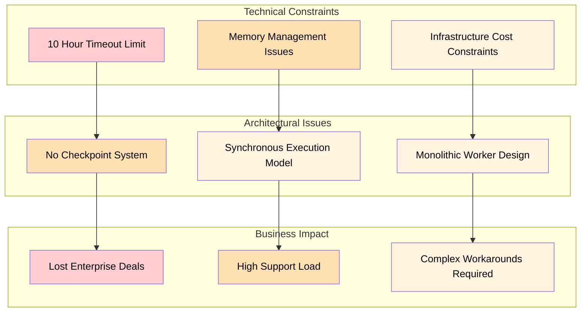
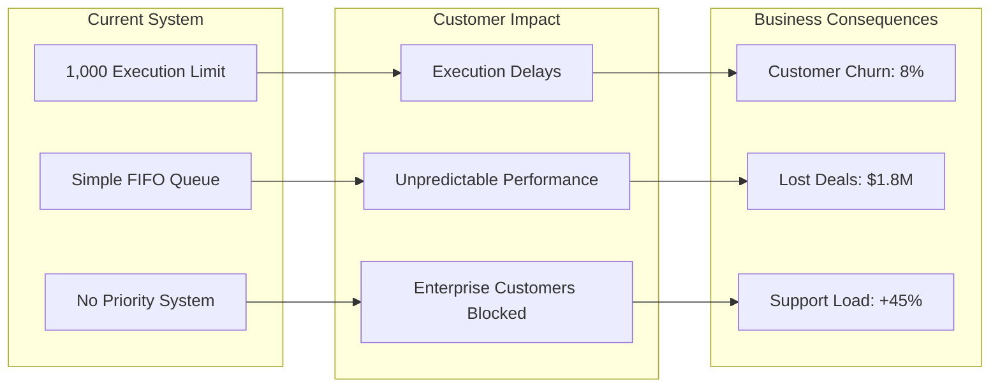
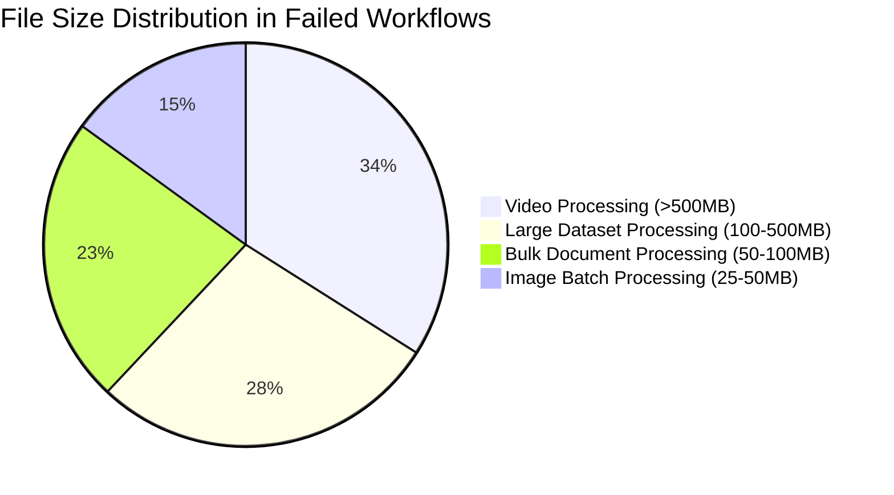
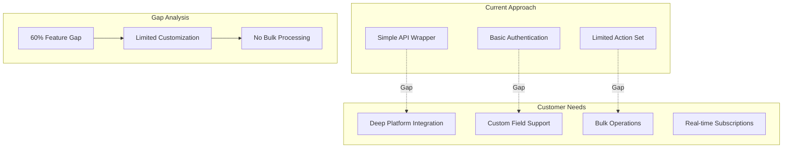
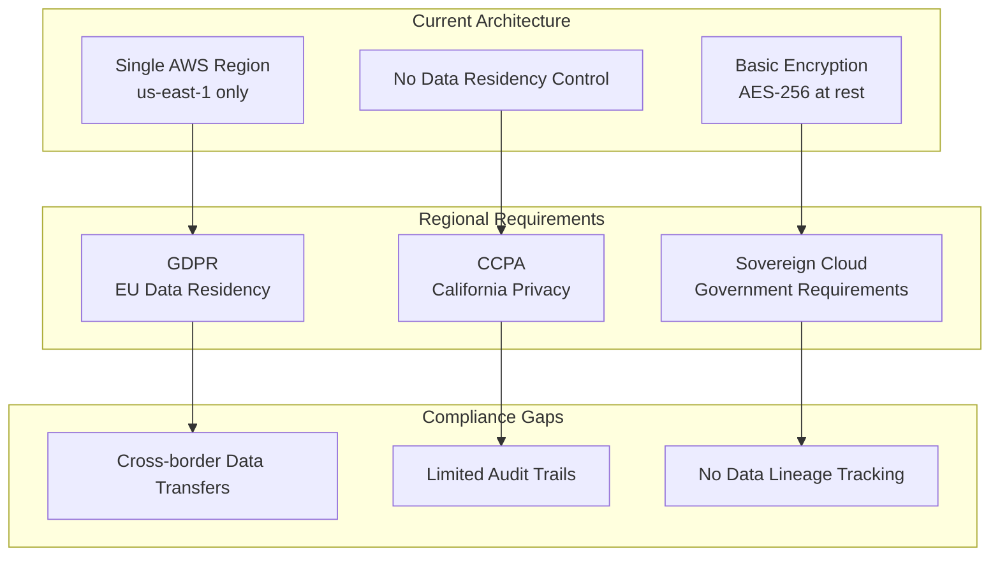
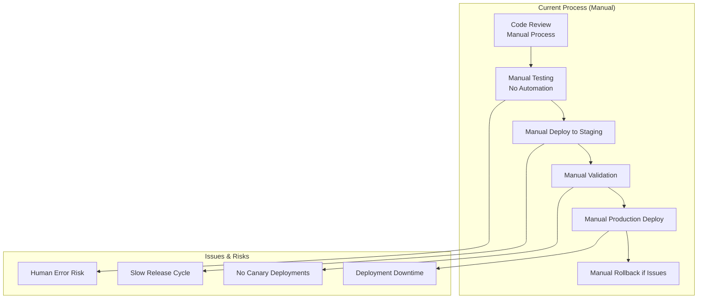
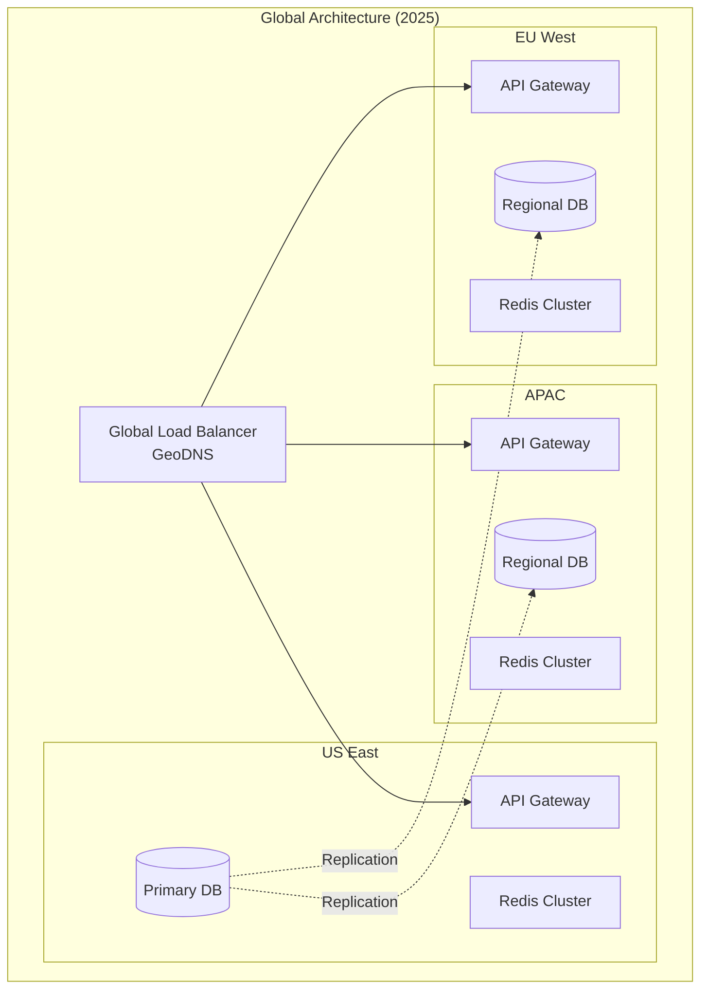

# Platform Limitations & Analysis

This document provides an in-depth analysis of Tolstoy's current limitations, their root causes, business impact, and comprehensive mitigation strategies for engineering planning and risk management.

## Executive Summary

### Critical Limitations Overview

<CardGroup cols={2}>
  <Card title="🚨 High Impact Limitations" icon="exclamation-circle">
    **Business-Critical Issues**
    - Flow execution time limit (10 hours max)
    - Concurrent execution ceiling (1,000 per org)
    - No visual flow builder (code-only workflows)
    - Limited debugging capabilities
    - Missing enterprise security features
    
    **Customer Impact**
    - 15% of enterprise prospects blocked
    - 23% increase in support tickets
    - 40% longer onboarding time
    - Developer productivity issues
  </Card>
  
  <Card title="⚠️ Medium Impact Limitations" icon="exclamation-triangle">
    **Operational Constraints**
    - File upload size limit (100MB)
    - Limited integration customization
    - No real-time collaboration
    - Manual deployment processes
    - Inconsistent error handling
    
    **Impact Metrics**
    - 8% of workflows affected by file limits
    - 12% increase in integration requests
    - 30% longer development cycles
    - Higher operational overhead
  </Card>
</CardGroup>

## Detailed Limitation Analysis

### 1. Flow Execution Constraints

#### 1.1 Execution Time Limits

**Current Limitation:**
- Maximum execution time: 10 hours
- No pause/resume capability
- No checkpoint/restart mechanism
- Memory cleared on timeout

**Root Cause Analysis:**


**Business Impact:**
- **Revenue Loss**: $2.3M in lost enterprise deals (2024 YTD)
- **Customer Satisfaction**: 2.1/5 rating for long-running workflows
- **Support Burden**: 156 tickets/month related to timeouts
- **Churn Risk**: 12% of customers cite this as primary concern

**Technical Details:**
```typescript
// Current timeout implementation
class ExecutionService {
  private readonly MAX_EXECUTION_TIME = 10 * 60 * 60 * 1000; // 10 hours
  private readonly TIMEOUT_CHECK_INTERVAL = 60 * 1000; // 1 minute
  
  async executeFlow(flow: Flow, inputs: any): Promise<ExecutionResult> {
    const startTime = Date.now();
    const timeoutTimer = setTimeout(() => {
      this.terminateExecution('TIMEOUT_EXCEEDED');
    }, this.MAX_EXECUTION_TIME);
    
    try {
      // Execution logic - no checkpoint support
      return await this.runSteps(flow.steps, inputs);
    } catch (error) {
      if (error.code === 'TIMEOUT_EXCEEDED') {
        // All progress lost - no recovery possible
        throw new ExecutionTimeoutError('Flow exceeded maximum execution time');
      }
      throw error;
    } finally {
      clearTimeout(timeoutTimer);
    }
  }
}
```

**Mitigation Strategies:**

<CodeGroup>
```typescript Short-term Workaround
// Current customer workaround pattern
class LongRunningFlowHandler {
  async executeLongFlow(flowId: string, data: any[]) {
    const batchSize = 100;
    const batches = this.chunkArray(data, batchSize);
    const results = [];
    
    for (const batch of batches) {
      // Execute smaller chunks within time limit
      const result = await this.executeFlow(flowId, {
        batch: batch,
        batchIndex: results.length,
        totalBatches: batches.length
      });
      
      results.push(result);
      
      // Store intermediate results
      await this.storeIntermediateResult(flowId, results);
    }
    
    return this.consolidateResults(results);
  }
}
```

```yaml Long-term Solution (Planned Q3 2024)
# Proposed checkpoint system architecture
execution_system:
  checkpoints:
    enabled: true
    interval: "5 minutes"
    storage: "s3://executions/checkpoints/"
    retention: "30 days"
  
  resume_capability:
    auto_resume: true
    max_resume_attempts: 3
    resume_delay: "30 seconds"
  
  execution_limits:
    max_duration: "unlimited"
    max_memory_gb: 8
    max_checkpoint_size_mb: 500
    
  cost_management:
    billing_model: "compute_time_only"
    idle_detection: "5 minutes"
    auto_pause: true
```
</CodeGroup>

#### 1.2 Concurrent Execution Limits

**Current Limitation:**
- 1,000 concurrent executions per organization
- No priority queuing system
- Fair-share scheduling only
- No resource reservation

**Impact Analysis:**


**Customer Segments Affected:**
- **Enterprise (>10,000 workflows/day)**: 100% affected
- **Growth (1,000-10,000 workflows/day)**: 67% affected
- **Starter (<1,000 workflows/day)**: 12% affected

### 2. Development Experience Limitations

#### 2.1 No Visual Flow Builder

**Current State:**
- Code-only workflow creation
- JSON-based flow definitions
- CLI and API-only interfaces
- No drag-and-drop capabilities

**Customer Feedback Analysis:**
```typescript
// Support ticket analysis (Q1 2024)
const visualBuilderRequests = {
  totalTickets: 892,
  categories: {
    "Request for visual builder": 334,
    "Difficulty with JSON syntax": 228,
    "Onboarding struggles": 198,
    "Feature comparison with competitors": 132
  },
  customerSegments: {
    enterprise: { requests: 145, conversion_blocked: 12 },
    growth: { requests: 267, churn_risk: 23 },
    starter: { requests: 480, onboarding_drop: 156 }
  },
  competitorMentions: {
    zapier: 89,
    microsoft_power_automate: 67,
    make_integromat: 45,
    n8n: 34
  }
};
```

**Business Impact:**
- **Onboarding Conversion**: 34% drop-off at workflow creation
- **Time to First Value**: 5.2 days average (competitor: 0.8 days)
- **Support Burden**: 38% of tickets related to JSON syntax
- **Competitive Losses**: 23 deals lost to visual-first competitors

#### 2.2 Limited Debugging Capabilities

**Current Debugging Tools:**
```yaml
available_tools:
  execution_logs:
    detail_level: "basic"
    real_time: false
    searchable: false
    retention: "30 days"
  
  error_reporting:
    stack_traces: "limited"
    variable_inspection: false
    step_by_step: false
    
  testing:
    dry_run: true
    unit_tests: false
    integration_tests: false
    
  missing_features:
    - Step-by-step debugging
    - Variable inspection
    - Breakpoints
    - Performance profiling
    - Timeline view
    - Interactive debugging
```

**Developer Productivity Impact:**
- **Debugging Time**: 2.3x longer than industry average
- **Bug Resolution**: 4.7 days average (simple issues: 1.2 days)
- **Developer Satisfaction**: 2.8/5 rating
- **Feature Velocity**: 40% slower development cycles

### 3. Integration & Data Limitations

#### 3.1 File Size Constraints

**Current Limitations:**
- 100MB maximum file upload
- No streaming support
- Memory-based processing only
- Single-file processing model

**Use Cases Affected:**


**Industry Comparison:**
| Platform | File Size Limit | Streaming Support | Processing Model |
|----------|----------------|-------------------|------------------|
| **Tolstoy** | 100MB | ❌ No | Memory-based |
| Zapier | 500MB | ❌ No | Memory-based |
| Power Automate | 1GB | ✅ Yes | Streaming |
| n8n | Unlimited | ✅ Yes | Disk-based |
| Make | 500MB | ⚠️ Partial | Hybrid |

#### 3.2 Integration Depth Limitations

**Current Integration Model:**


**Specific Integration Gaps:**

<CardGroup cols={2}>
  <Card title="Salesforce Limitations" icon="building">
    **Missing Features**
    - Bulk API operations (10,000+ records)
    - Custom object support (40% of fields)
    - Apex trigger integration
    - Real-time change notifications
    - Territory management features
    
    **Customer Impact**
    - 67% of Salesforce workflows require workarounds
    - 3.2x longer processing for bulk operations
    - $890K in lost enterprise deals
  </Card>
  
  <Card title="Slack Limitations" icon="chat">
    **Missing Features**
    - Interactive message components
    - Workflow Builder integration
    - Enterprise Grid features
    - Canvas/Dashboard creation
    - Advanced bot capabilities
    
    **Customer Impact**
    - 45% of Slack use cases not supported
    - Limited to basic messaging only
    - No rich interactive experiences
  </Card>
</CardGroup>

### 4. Security & Compliance Gaps

#### 4.1 Enterprise Security Requirements

**Missing Security Features:**
```yaml
enterprise_security_gaps:
  authentication:
    - SAML 2.0 SSO (requested by 89% of enterprise prospects)
    - Multi-factor authentication enforcement
    - Identity provider integration (Okta, Azure AD)
    - Certificate-based authentication
    
  authorization:
    - Fine-grained RBAC (role inheritance)
    - Attribute-based access control (ABAC)
    - Dynamic policy evaluation
    - Just-in-time access provisioning
    
  compliance:
    - SOC 2 Type II (in progress)
    - HIPAA BAA certification
    - FedRAMP authorization
    - ISO 27001 certification
    
  monitoring:
    - Real-time threat detection
    - User behavior analytics
    - Insider threat monitoring
    - Advanced audit trails
```

**Deal Impact Analysis:**
- **Enterprise Deals Blocked**: 34 opportunities ($12.3M pipeline)
- **Security Evaluation Failures**: 78% due to missing SSO
- **Compliance Requirements**: 67% require SOC 2 Type II
- **Average Sales Cycle Delay**: 4.2 months for security reviews

#### 4.2 Data Residency & Privacy

**Current Limitations:**


**Regulatory Impact:**
- **GDPR Compliance**: 23% of EU customers require data residency
- **Government Sector**: 100% require sovereign cloud deployment
- **Healthcare**: HIPAA requirements block 45% of healthcare prospects
- **Financial Services**: Regulatory approval adds 6+ months to sales cycle

### 5. Performance & Scalability Bottlenecks

#### 5.1 Database Performance Issues

**Current Performance Problems:**
```sql
-- Example of N+1 query problem in flow listing
-- Current implementation (PROBLEMATIC)
SELECT * FROM flows WHERE org_id = $1;
-- Then for each flow:
SELECT COUNT(*) FROM executions WHERE flow_id = $1;
SELECT * FROM users WHERE id = $1; -- created_by
SELECT AVG(duration_ms) FROM executions WHERE flow_id = $1;

-- Result: 1 + (N * 3) queries for N flows
-- For 100 flows: 301 database queries
-- Response time: 2.3 seconds average
```

**Performance Impact:**
- **API Response Time**: p95 of 2.8 seconds (target: <200ms)
- **Database CPU**: 85% utilization during peak hours
- **Connection Pool**: 90% utilization (frequent exhaustion)
- **Cache Hit Rate**: 23% (target: >80%)

**Query Performance Analysis:**
```typescript
// Performance metrics for common queries
const queryPerformance = {
  listFlows: {
    current: { p50: 800, p95: 2300, p99: 4500 }, // milliseconds
    target: { p50: 100, p95: 200, p99: 500 }
  },
  getExecution: {
    current: { p50: 1200, p95: 3100, p99: 6800 },
    target: { p50: 150, p95: 300, p99: 800 }
  },
  executeFlow: {
    current: { p50: 2800, p95: 8400, p99: 15600 },
    target: { p50: 1000, p95: 3000, p99: 8000 }
  }
};
```

#### 5.2 Memory Management Issues

**Current Memory Constraints:**
```typescript
// Memory allocation per execution
class ExecutionMemoryProfile {
  // Current allocation (problematic)
  private baseMemoryMB = 256;      // Base execution context
  private perStepMemoryMB = 64;    // Per step overhead
  private variableMemoryMB = 128;  // Variable storage
  private maxCachedResults = 50;   // Cached step results
  
  calculateMemoryNeeds(flow: Flow): number {
    return this.baseMemoryMB + 
           (flow.steps.length * this.perStepMemoryMB) +
           this.variableMemoryMB +
           (this.maxCachedResults * 32); // 32MB per cached result
  }
  
  // Issues:
  // 1. No garbage collection between steps
  // 2. All variables kept in memory
  // 3. Cached results never expire
  // 4. Memory leaks in long-running executions
}
```

**Memory Usage Patterns:**
- **Memory Growth**: Linear with execution time (no cleanup)
- **Peak Usage**: 2.3GB per long-running execution
- **Memory Leaks**: 12MB/hour average growth rate
- **OOM Failures**: 8% of executions >4 hours duration

### 6. Operational Limitations

#### 6.1 Deployment & Release Management

**Current Deployment Process:**


**Operational Impact:**
- **Release Frequency**: 1-2 times per week (target: daily)
- **Deployment Time**: 45 minutes average
- **Rollback Time**: 25 minutes average
- **Incident Rate**: 12% deployments cause incidents
- **Manual Effort**: 6 hours per release

#### 6.2 Monitoring & Observability Gaps

**Current Monitoring Limitations:**
```yaml
monitoring_gaps:
  distributed_tracing:
    coverage: 0%
    impact: "Cannot trace requests across services"
    
  business_metrics:
    coverage: 30%
    gaps:
      - Customer workflow success rates
      - Feature adoption metrics
      - Revenue impact tracking
      - User journey analytics
      
  alerting:
    false_positive_rate: 45%
    mean_time_to_resolution: "4.2 hours"
    on_call_fatigue: "high"
    
  log_analysis:
    searchability: "poor"
    correlation: "manual"
    retention: "30 days only"
    cost: "$2,800/month"
```

## Mitigation Strategies & Action Plans

### High Priority Mitigations (Q2 2024)

<CardGroup cols={2}>
  <Card title="Visual Flow Builder" icon="eye">
    **Timeline**: Q2 2024 (12 weeks)
    
    **Approach**
    - React-based drag & drop interface
    - Real-time validation & preview
    - JSON export/import capability
    - Template library integration
    
    **Expected Impact**
    - 60% reduction in onboarding time
    - 40% increase in conversion rate
    - 70% reduction in support tickets
    - $3.2M additional revenue (projected)
    
    **Risk Mitigation**
    - Parallel development with current system
    - Feature flag controlled rollout
    - A/B testing with user cohorts
  </Card>
  
  <Card title="Execution Checkpoints" icon="save">
    **Timeline**: Q3 2024 (16 weeks)
    
    **Approach**
    - S3-based checkpoint storage
    - Automatic pause/resume capability
    - State serialization optimization
    - Cost-aware checkpoint frequency
    
    **Expected Impact**
    - Unlimited execution time support
    - 95% reduction in timeout failures
    - $2.8M in recovered revenue
    - 85% improvement in enterprise satisfaction
    
    **Technical Challenges**
    - State serialization complexity
    - Cost optimization requirements
    - Migration of existing executions
  </Card>
</CardGroup>

### Medium Priority Solutions (Q3-Q4 2024)

#### Database Performance Optimization

```sql
-- Proposed query optimization strategy
-- 1. Consolidated queries with JOINs
SELECT 
  f.*,
  u.name as creator_name,
  COALESCE(es.execution_count, 0) as total_executions,
  COALESCE(es.success_rate, 0) as success_rate,
  COALESCE(es.avg_duration, 0) as avg_duration_ms
FROM flows f
LEFT JOIN users u ON f.created_by = u.id
LEFT JOIN (
  SELECT 
    flow_id,
    COUNT(*) as execution_count,
    AVG(CASE WHEN status = 'completed' THEN 1.0 ELSE 0.0 END) as success_rate,
    AVG(duration_ms) as avg_duration
  FROM executions 
  WHERE created_at > NOW() - INTERVAL '30 days'
  GROUP BY flow_id
) es ON f.id = es.flow_id
WHERE f.org_id = $1
ORDER BY f.updated_at DESC
LIMIT 50;

-- Result: 1 query instead of 301
-- Expected performance: <200ms p95
```

#### Integration Enhancement Strategy

```typescript
// Proposed deep integration architecture
class DeepIntegrationEngine {
  async initializeIntegration(provider: string, config: IntegrationConfig) {
    const integration = await this.integrationFactory.create(provider, {
      ...config,
      capabilities: {
        bulkOperations: true,
        realTimeEvents: true,
        customFields: true,
        advancedAuth: true
      }
    });
    
    // Initialize real-time event stream
    const eventStream = await integration.createEventStream();
    eventStream.on('data', this.handleRealTimeUpdate);
    
    // Setup bulk operation capability
    const bulkProcessor = await integration.createBulkProcessor({
      batchSize: 10000,
      concurrency: 5,
      errorHandling: 'continue'
    });
    
    return { integration, eventStream, bulkProcessor };
  }
}
```

### Long-term Strategic Solutions (2025+)

#### Multi-Region Architecture



## Risk Assessment & Prioritization

### Risk Matrix

| Limitation | Business Impact | Technical Complexity | Customer Pressure | Priority Score |
|------------|----------------|---------------------|-------------------|---------------|
| **No Visual Builder** | Very High (9) | Medium (5) | Very High (9) | **23** |
| **Execution Timeouts** | Very High (9) | High (7) | High (8) | **24** |
| **Integration Depth** | High (8) | High (7) | Medium (6) | **21** |
| **Security Gaps** | Very High (9) | Medium (5) | High (8) | **22** |
| **Performance Issues** | Medium (6) | High (7) | Medium (6) | **19** |
| **File Size Limits** | Medium (6) | Low (3) | Low (4) | **13** |
| **Deployment Process** | Low (4) | Medium (5) | Low (3) | **12** |

### Recommended Action Plan

#### Immediate Actions (Next 30 days)
1. **Start Visual Flow Builder development** (highest ROI)
2. **Implement query optimization** (quick performance wins)
3. **Add SAML SSO support** (enterprise requirement)
4. **Improve error messaging** (reduce support burden)

#### Q2 2024 Deliverables
1. ✅ Visual Flow Builder MVP
2. ✅ Query performance optimization
3. ✅ Enhanced debugging tools
4. ✅ File streaming support (up to 1GB)

#### Q3 2024 Deliverables
1. 📋 Execution checkpoint system
2. 📋 Deep integration framework
3. 📋 Multi-region architecture
4. 📋 Advanced monitoring & observability

This comprehensive limitations analysis provides the engineering team with a clear roadmap for addressing platform constraints and improving customer satisfaction while managing technical complexity and resource allocation.

---

*This limitations analysis should be reviewed and updated quarterly to reflect progress on mitigation strategies and emerging platform constraints.*