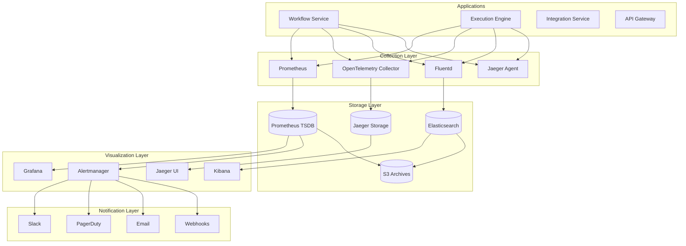

# Monitoring and Observability

This document provides comprehensive guidance on monitoring, observability, and operational excellence for the Tolstoy platform. It covers metrics collection, distributed tracing, logging strategies, alerting, and performance monitoring.

## Observability Stack Overview

### Core Components

<CardGroup cols={2}>
  <Card title="Metrics" icon="chart-line">
    Prometheus for metrics collection with Grafana for visualization
  </Card>
  <Card title="Logging" icon="file-text">
    ELK Stack (Elasticsearch, Logstash, Kibana) for centralized logging
  </Card>
  <Card title="Tracing" icon="route">
    Jaeger with OpenTelemetry for distributed request tracing
  </Card>
  <Card title="Alerting" icon="bell">
    Prometheus Alertmanager with PagerDuty and Slack integration
  </Card>
</CardGroup>

### Observability Architecture



## Metrics and Monitoring

### Application Metrics

#### Custom Metrics Implementation

```typescript
// metrics.ts - Application metrics collection
import { register, Counter, Histogram, Gauge, collectDefaultMetrics } from 'prom-client';

// Enable default Node.js metrics
collectDefaultMetrics({ register });

// Business Metrics
export const workflowsCreated = new Counter({
  name: 'tolstoy_workflows_created_total',
  help: 'Total number of workflows created',
  labelNames: ['organization_id', 'template_type'],
});

export const workflowExecutions = new Counter({
  name: 'tolstoy_workflow_executions_total',
  help: 'Total number of workflow executions',
  labelNames: ['organization_id', 'workflow_id', 'status', 'trigger_type'],
});

export const executionDuration = new Histogram({
  name: 'tolstoy_execution_duration_seconds',
  help: 'Workflow execution duration in seconds',
  labelNames: ['organization_id', 'workflow_id', 'status'],
  buckets: [0.1, 0.5, 1, 2, 5, 10, 30, 60, 300, 600],
});

export const activeExecutions = new Gauge({
  name: 'tolstoy_active_executions',
  help: 'Number of currently active executions',
  labelNames: ['organization_id'],
});

// API Metrics
export const httpRequests = new Counter({
  name: 'tolstoy_http_requests_total',
  help: 'Total HTTP requests',
  labelNames: ['method', 'route', 'status_code', 'service'],
});

export const httpDuration = new Histogram({
  name: 'tolstoy_http_request_duration_seconds',
  help: 'HTTP request duration in seconds',
  labelNames: ['method', 'route', 'service'],
  buckets: [0.005, 0.01, 0.025, 0.05, 0.1, 0.25, 0.5, 1, 2.5, 5, 10],
});

export const httpRequestSize = new Histogram({
  name: 'tolstoy_http_request_size_bytes',
  help: 'HTTP request size in bytes',
  labelNames: ['method', 'route'],
  buckets: [100, 1000, 10000, 100000, 1000000],
});

export const httpResponseSize = new Histogram({
  name: 'tolstoy_http_response_size_bytes',
  help: 'HTTP response size in bytes',
  labelNames: ['method', 'route'],
  buckets: [100, 1000, 10000, 100000, 1000000],
});

// Integration Metrics
export const integrationCalls = new Counter({
  name: 'tolstoy_integration_calls_total',
  help: 'Total integration API calls',
  labelNames: ['integration_id', 'provider', 'status'],
});

export const integrationDuration = new Histogram({
  name: 'tolstoy_integration_call_duration_seconds',
  help: 'Integration API call duration',
  labelNames: ['integration_id', 'provider'],
  buckets: [0.1, 0.5, 1, 2, 5, 10, 30],
});

export const integrationErrors = new Counter({
  name: 'tolstoy_integration_errors_total',
  help: 'Total integration errors',
  labelNames: ['integration_id', 'provider', 'error_type'],
});

// Database Metrics
export const dbConnections = new Gauge({
  name: 'tolstoy_db_connections',
  help: 'Number of database connections',
  labelNames: ['database', 'state'],
});

export const dbQueries = new Counter({
  name: 'tolstoy_db_queries_total',
  help: 'Total database queries',
  labelNames: ['database', 'operation', 'table'],
});

export const dbQueryDuration = new Histogram({
  name: 'tolstoy_db_query_duration_seconds',
  help: 'Database query duration',
  labelNames: ['database', 'operation', 'table'],
  buckets: [0.001, 0.005, 0.01, 0.05, 0.1, 0.5, 1, 5],
});

// Queue Metrics
export const queueMessages = new Counter({
  name: 'tolstoy_queue_messages_total',
  help: 'Total queue messages',
  labelNames: ['queue_name', 'status'],
});

export const queueDepth = new Gauge({
  name: 'tolstoy_queue_depth',
  help: 'Number of messages in queue',
  labelNames: ['queue_name'],
});

export const queueProcessingTime = new Histogram({
  name: 'tolstoy_queue_processing_duration_seconds',
  help: 'Queue message processing duration',
  labelNames: ['queue_name', 'message_type'],
  buckets: [0.1, 0.5, 1, 2, 5, 10, 30, 60],
});
```

#### Metrics Middleware

```typescript
// middleware/metrics.middleware.ts
import { Request, Response, NextFunction } from 'express';
import { httpRequests, httpDuration, httpRequestSize, httpResponseSize } from '../metrics';

export const metricsMiddleware = (serviceName: string) => {
  return (req: Request, res: Response, next: NextFunction) => {
    const start = Date.now();
    const route = req.route?.path || req.path;

    // Track request size
    const requestSize = parseInt(req.headers['content-length'] || '0', 10);
    if (requestSize > 0) {
      httpRequestSize
        .labels(req.method, route)
        .observe(requestSize);
    }

    // Capture original end method
    const originalEnd = res.end;
    
    res.end = function(chunk?: any, encoding?: any) {
      // Track response size
      const responseSize = parseInt(res.get('content-length') || '0', 10);
      if (responseSize > 0) {
        httpResponseSize
          .labels(req.method, route)
          .observe(responseSize);
      }

      // Track request count and duration
      const duration = (Date.now() - start) / 1000;
      
      httpRequests
        .labels(req.method, route, res.statusCode.toString(), serviceName)
        .inc();
      
      httpDuration
        .labels(req.method, route, serviceName)
        .observe(duration);

      // Call original end method
      originalEnd.call(this, chunk, encoding);
    };

    next();
  };
};
```

#### Business Metrics Collection

```typescript
// services/metrics.service.ts
import {
  workflowsCreated,
  workflowExecutions,
  executionDuration,
  activeExecutions,
  integrationCalls,
  integrationDuration,
  integrationErrors,
} from '../metrics';

export class MetricsService {
  // Workflow metrics
  recordWorkflowCreated(organizationId: string, templateType?: string): void {
    workflowsCreated
      .labels(organizationId, templateType || 'custom')
      .inc();
  }

  recordWorkflowExecution(
    organizationId: string,
    workflowId: string,
    status: string,
    triggerType: string,
    durationMs: number
  ): void {
    workflowExecutions
      .labels(organizationId, workflowId, status, triggerType)
      .inc();

    executionDuration
      .labels(organizationId, workflowId, status)
      .observe(durationMs / 1000);
  }

  updateActiveExecutions(organizationId: string, count: number): void {
    activeExecutions
      .labels(organizationId)
      .set(count);
  }

  // Integration metrics
  recordIntegrationCall(
    integrationId: string,
    provider: string,
    status: string,
    durationMs: number
  ): void {
    integrationCalls
      .labels(integrationId, provider, status)
      .inc();

    integrationDuration
      .labels(integrationId, provider)
      .observe(durationMs / 1000);
  }

  recordIntegrationError(
    integrationId: string,
    provider: string,
    errorType: string
  ): void {
    integrationErrors
      .labels(integrationId, provider, errorType)
      .inc();
  }

  // Database metrics
  recordDbQuery(
    database: string,
    operation: string,
    table: string,
    durationMs: number
  ): void {
    dbQueries
      .labels(database, operation, table)
      .inc();

    dbQueryDuration
      .labels(database, operation, table)
      .observe(durationMs / 1000);
  }
}

export const metricsService = new MetricsService();
```

### Infrastructure Metrics

#### Kubernetes Monitoring

```yaml
# prometheus-config.yaml
apiVersion: v1
kind: ConfigMap
metadata:
  name: prometheus-config
data:
  prometheus.yml: |
    global:
      scrape_interval: 15s
      evaluation_interval: 15s

    rule_files:
      - "/etc/prometheus/rules/*.yml"

    scrape_configs:
      # Kubernetes API Server
      - job_name: 'kubernetes-apiservers'
        kubernetes_sd_configs:
        - role: endpoints
        scheme: https
        tls_config:
          ca_file: /var/run/secrets/kubernetes.io/serviceaccount/ca.crt
        bearer_token_file: /var/run/secrets/kubernetes.io/serviceaccount/token
        relabel_configs:
        - source_labels: [__meta_kubernetes_namespace, __meta_kubernetes_service_name, __meta_kubernetes_endpoint_port_name]
          action: keep
          regex: default;kubernetes;https

      # Kubernetes Nodes
      - job_name: 'kubernetes-nodes'
        kubernetes_sd_configs:
        - role: node
        scheme: https
        tls_config:
          ca_file: /var/run/secrets/kubernetes.io/serviceaccount/ca.crt
        bearer_token_file: /var/run/secrets/kubernetes.io/serviceaccount/token
        relabel_configs:
        - action: labelmap
          regex: __meta_kubernetes_node_label_(.+)
        - target_label: __address__
          replacement: kubernetes.default.svc:443
        - source_labels: [__meta_kubernetes_node_name]
          regex: (.+)
          target_label: __metrics_path__
          replacement: /api/v1/nodes/${1}/proxy/metrics

      # Kubernetes Pods
      - job_name: 'kubernetes-pods'
        kubernetes_sd_configs:
        - role: pod
        relabel_configs:
        - source_labels: [__meta_kubernetes_pod_annotation_prometheus_io_scrape]
          action: keep
          regex: true
        - source_labels: [__meta_kubernetes_pod_annotation_prometheus_io_path]
          action: replace
          target_label: __metrics_path__
          regex: (.+)
        - source_labels: [__address__, __meta_kubernetes_pod_annotation_prometheus_io_port]
          action: replace
          regex: ([^:]+)(?::\d+)?;(\d+)
          replacement: $1:$2
          target_label: __address__
        - action: labelmap
          regex: __meta_kubernetes_pod_label_(.+)
        - source_labels: [__meta_kubernetes_namespace]
          action: replace
          target_label: kubernetes_namespace
        - source_labels: [__meta_kubernetes_pod_name]
          action: replace
          target_label: kubernetes_pod_name

      # Tolstoy Services
      - job_name: 'tolstoy-services'
        kubernetes_sd_configs:
        - role: pod
          namespaces:
            names: ['tolstoy']
        relabel_configs:
        - source_labels: [__meta_kubernetes_pod_annotation_prometheus_io_scrape]
          action: keep
          regex: true
        - source_labels: [__meta_kubernetes_pod_annotation_prometheus_io_path]
          action: replace
          target_label: __metrics_path__
          regex: (.+)
        - source_labels: [__address__, __meta_kubernetes_pod_annotation_prometheus_io_port]
          action: replace
          regex: ([^:]+)(?::\d+)?;(\d+)
          replacement: $1:$2
          target_label: __address__
        - source_labels: [__meta_kubernetes_pod_label_app]
          target_label: service
        - source_labels: [__meta_kubernetes_pod_label_version]
          target_label: version

      # PostgreSQL Exporter
      - job_name: 'postgres-exporter'
        static_configs:
        - targets: ['postgres-exporter:9187']
        scrape_interval: 30s

      # Redis Exporter
      - job_name: 'redis-exporter'
        static_configs:
        - targets: ['redis-exporter:9121']
        scrape_interval: 30s

      # Node Exporter
      - job_name: 'node-exporter'
        kubernetes_sd_configs:
        - role: pod
        relabel_configs:
        - source_labels: [__meta_kubernetes_pod_label_app]
          action: keep
          regex: node-exporter
```

#### Custom Exporters

```typescript
// exporters/database-exporter.ts
import { register, Gauge } from 'prom-client';
import { DatabaseService } from '../services/database.service';

export class DatabaseExporter {
  private connectionPoolGauge: Gauge<string>;
  private slowQueriesGauge: Gauge<string>;
  private tableStatsGauge: Gauge<string>;

  constructor(private databaseService: DatabaseService) {
    this.connectionPoolGauge = new Gauge({
      name: 'tolstoy_db_connection_pool',
      help: 'Database connection pool statistics',
      labelNames: ['database', 'metric'],
      registers: [register],
    });

    this.slowQueriesGauge = new Gauge({
      name: 'tolstoy_db_slow_queries',
      help: 'Number of slow queries',
      labelNames: ['database'],
      registers: [register],
    });

    this.tableStatsGauge = new Gauge({
      name: 'tolstoy_db_table_stats',
      help: 'Database table statistics',
      labelNames: ['database', 'table', 'metric'],
      registers: [register],
    });
  }

  async collectMetrics(): Promise<void> {
    try {
      // Connection pool stats
      const poolStats = await this.databaseService.getPoolStats();
      this.connectionPoolGauge.labels('primary', 'total').set(poolStats.total);
      this.connectionPoolGauge.labels('primary', 'idle').set(poolStats.idle);
      this.connectionPoolGauge.labels('primary', 'waiting').set(poolStats.waiting);

      // Slow queries
      const slowQueries = await this.databaseService.getSlowQueriesCount();
      this.slowQueriesGauge.labels('primary').set(slowQueries);

      // Table statistics
      const tableStats = await this.databaseService.getTableStats();
      for (const stat of tableStats) {
        this.tableStatsGauge
          .labels('primary', stat.table_name, 'rows')
          .set(stat.n_tup_ins + stat.n_tup_upd + stat.n_tup_del);
        
        this.tableStatsGauge
          .labels('primary', stat.table_name, 'size_bytes')
          .set(stat.table_size);
      }
    } catch (error) {
      console.error('Error collecting database metrics:', error);
    }
  }

  startCollection(intervalMs = 30000): void {
    setInterval(() => this.collectMetrics(), intervalMs);
  }
}
```

## Distributed Tracing

### OpenTelemetry Setup

#### Tracing Configuration

```typescript
// tracing.ts - OpenTelemetry setup
import { NodeSDK } from '@opentelemetry/auto-instrumentations-node';
import { Resource } from '@opentelemetry/resources';
import { SemanticResourceAttributes } from '@opentelemetry/semantic-conventions';
import { JaegerExporter } from '@opentelemetry/exporter-jaeger';
import { BatchSpanProcessor } from '@opentelemetry/sdk-trace-base';
import { NodeTracerProvider } from '@opentelemetry/sdk-trace-node';
import { registerInstrumentations } from '@opentelemetry/instrumentation';
import { HttpInstrumentation } from '@opentelemetry/instrumentation-http';
import { ExpressInstrumentation } from '@opentelemetry/instrumentation-express';
import { PgInstrumentation } from '@opentelemetry/instrumentation-pg';
import { RedisInstrumentation } from '@opentelemetry/instrumentation-redis';

const serviceName = process.env.SERVICE_NAME || 'tolstoy-service';
const serviceVersion = process.env.SERVICE_VERSION || '1.0.0';
const environment = process.env.NODE_ENV || 'development';

// Create tracer provider
const provider = new NodeTracerProvider({
  resource: new Resource({
    [SemanticResourceAttributes.SERVICE_NAME]: serviceName,
    [SemanticResourceAttributes.SERVICE_VERSION]: serviceVersion,
    [SemanticResourceAttributes.DEPLOYMENT_ENVIRONMENT]: environment,
    [SemanticResourceAttributes.SERVICE_NAMESPACE]: 'tolstoy',
  }),
});

// Configure Jaeger exporter
const jaegerExporter = new JaegerExporter({
  endpoint: process.env.JAEGER_ENDPOINT || 'http://jaeger-collector:14268/api/traces',
});

// Add span processor
provider.addSpanProcessor(new BatchSpanProcessor(jaegerExporter));

// Register the provider
provider.register();

// Register instrumentations
registerInstrumentations({
  instrumentations: [
    new HttpInstrumentation({
      requestHook: (span, request) => {
        span.setAttributes({
          'http.request.body.size': request.headers['content-length'] || 0,
          'user.id': request.headers['x-user-id'] || '',
          'organization.id': request.headers['x-organization-id'] || '',
        });
      },
      responseHook: (span, response) => {
        span.setAttributes({
          'http.response.body.size': response.headers['content-length'] || 0,
        });
      },
    }),
    new ExpressInstrumentation({
      requestHook: (span, info) => {
        span.setAttributes({
          'express.route': info.route || '',
          'express.method': info.request.method,
        });
      },
    }),
    new PgInstrumentation({
      enhancedDatabaseReporting: true,
    }),
    new RedisInstrumentation({
      dbStatementSerializer: (cmdName, cmdArgs) => {
        return `${cmdName} ${cmdArgs.slice(0, 2).join(' ')}`;
      },
    }),
  ],
});

export { provider };
```

#### Custom Span Creation

```typescript
// tracing/tracer.ts
import { trace, context, SpanStatusCode, SpanKind } from '@opentelemetry/api';
import { SemanticAttributes } from '@opentelemetry/semantic-conventions';

const tracer = trace.getTracer('tolstoy-tracer');

export class TracingService {
  // Create a new span with automatic context propagation
  static async withSpan<T>(
    name: string,
    operation: (span: any) => Promise<T>,
    spanKind: SpanKind = SpanKind.INTERNAL,
    attributes?: Record<string, string | number | boolean>
  ): Promise<T> {
    const span = tracer.startSpan(name, {
      kind: spanKind,
      attributes,
    });

    return context.with(trace.setSpan(context.active(), span), async () => {
      try {
        const result = await operation(span);
        span.setStatus({ code: SpanStatusCode.OK });
        return result;
      } catch (error: any) {
        span.recordException(error);
        span.setStatus({
          code: SpanStatusCode.ERROR,
          message: error.message,
        });
        throw error;
      } finally {
        span.end();
      }
    });
  }

  // Trace workflow execution
  static async traceWorkflowExecution<T>(
    workflowId: string,
    executionId: string,
    organizationId: string,
    operation: () => Promise<T>
  ): Promise<T> {
    return this.withSpan(
      'workflow.execution',
      async (span) => {
        span.setAttributes({
          'workflow.id': workflowId,
          'execution.id': executionId,
          'organization.id': organizationId,
        });
        return operation();
      },
      SpanKind.SERVER
    );
  }

  // Trace integration calls
  static async traceIntegrationCall<T>(
    integrationId: string,
    provider: string,
    action: string,
    operation: () => Promise<T>
  ): Promise<T> {
    return this.withSpan(
      'integration.call',
      async (span) => {
        span.setAttributes({
          'integration.id': integrationId,
          'integration.provider': provider,
          'integration.action': action,
        });
        return operation();
      },
      SpanKind.CLIENT
    );
  }

  // Trace database operations
  static async traceDatabaseOperation<T>(
    operation: string,
    table: string,
    dbOperation: () => Promise<T>
  ): Promise<T> {
    return this.withSpan(
      'db.query',
      async (span) => {
        span.setAttributes({
          [SemanticAttributes.DB_OPERATION]: operation,
          [SemanticAttributes.DB_SQL_TABLE]: table,
          [SemanticAttributes.DB_SYSTEM]: 'postgresql',
        });
        return dbOperation();
      },
      SpanKind.CLIENT
    );
  }

  // Add custom attributes to current span
  static addAttributes(attributes: Record<string, string | number | boolean>): void {
    const span = trace.getActiveSpan();
    if (span) {
      span.setAttributes(attributes);
    }
  }

  // Add event to current span
  static addEvent(name: string, attributes?: Record<string, string | number | boolean>): void {
    const span = trace.getActiveSpan();
    if (span) {
      span.addEvent(name, attributes);
    }
  }
}
```

### Trace Correlation

#### Request Correlation Middleware

```typescript
// middleware/correlation.middleware.ts
import { Request, Response, NextFunction } from 'express';
import { trace, context, propagation } from '@opentelemetry/api';
import { v4 as uuidv4 } from 'uuid';

declare global {
  namespace Express {
    interface Request {
      correlationId: string;
      traceId: string;
      spanId: string;
    }
  }
}

export const correlationMiddleware = (req: Request, res: Response, next: NextFunction) => {
  // Extract or generate correlation ID
  req.correlationId = req.headers['x-correlation-id'] as string || uuidv4();
  
  // Extract trace context from headers
  const activeContext = propagation.extract(context.active(), req.headers);
  
  context.with(activeContext, () => {
    const span = trace.getActiveSpan();
    if (span) {
      const spanContext = span.spanContext();
      req.traceId = spanContext.traceId;
      req.spanId = spanContext.spanId;
      
      // Add correlation attributes to span
      span.setAttributes({
        'correlation.id': req.correlationId,
        'http.request.correlation_id': req.correlationId,
      });
    }
    
    // Set response headers for trace correlation
    res.setHeader('x-correlation-id', req.correlationId);
    res.setHeader('x-trace-id', req.traceId || '');
    
    next();
  });
};
```

#### Service-to-Service Trace Propagation

```typescript
// utils/trace-propagation.ts
import { trace, context, propagation } from '@opentelemetry/api';
import axios, { AxiosRequestConfig } from 'axios';

export class TracePropagationUtils {
  // Inject trace context into HTTP headers
  static injectTraceHeaders(headers: Record<string, string> = {}): Record<string, string> {
    const carrier: Record<string, string> = { ...headers };
    propagation.inject(context.active(), carrier);
    return carrier;
  }

  // Create HTTP client with automatic trace propagation
  static createTracedHttpClient(baseURL: string) {
    const client = axios.create({ baseURL });

    // Request interceptor to inject trace headers
    client.interceptors.request.use((config) => {
      config.headers = this.injectTraceHeaders(config.headers as Record<string, string>);
      
      // Add current span context to request config for later use
      const span = trace.getActiveSpan();
      if (span) {
        config.metadata = {
          traceId: span.spanContext().traceId,
          spanId: span.spanContext().spanId,
        };
      }
      
      return config;
    });

    return client;
  }

  // Manual trace context extraction for message queues
  static extractTraceContext(headers: Record<string, any>): any {
    return propagation.extract(context.active(), headers);
  }

  // Manual trace context injection for message queues
  static injectTraceContext(headers: Record<string, any> = {}): Record<string, any> {
    const carrier = { ...headers };
    propagation.inject(context.active(), carrier);
    return carrier;
  }
}
```

## Logging Strategy

### Structured Logging

#### Logger Configuration

```typescript
// logger.ts - Structured logging setup
import winston from 'winston';
import { Format } from 'logform';
import { trace } from '@opentelemetry/api';

const { combine, timestamp, errors, json, printf } = winston.format;

// Custom format that includes trace information
const traceFormat: Format = printf((info) => {
  const span = trace.getActiveSpan();
  if (span) {
    const spanContext = span.spanContext();
    info.traceId = spanContext.traceId;
    info.spanId = spanContext.spanId;
  }
  
  return JSON.stringify(info);
});

// Create logger
export const logger = winston.createLogger({
  level: process.env.LOG_LEVEL || 'info',
  format: combine(
    timestamp(),
    errors({ stack: true }),
    json(),
    traceFormat
  ),
  defaultMeta: {
    service: process.env.SERVICE_NAME || 'tolstoy-service',
    version: process.env.SERVICE_VERSION || '1.0.0',
    environment: process.env.NODE_ENV || 'development',
  },
  transports: [
    // Console transport for development
    new winston.transports.Console({
      format: process.env.NODE_ENV === 'development' 
        ? combine(
            winston.format.colorize(),
            winston.format.simple()
          )
        : undefined,
    }),
    
    // File transport for production
    new winston.transports.File({
      filename: 'logs/error.log',
      level: 'error',
      maxsize: 5242880, // 5MB
      maxFiles: 5,
    }),
    
    new winston.transports.File({
      filename: 'logs/combined.log',
      maxsize: 5242880,
      maxFiles: 5,
    }),
  ],
  
  // Handle uncaught exceptions and rejections
  exceptionHandlers: [
    new winston.transports.File({ filename: 'logs/exceptions.log' })
  ],
  rejectionHandlers: [
    new winston.transports.File({ filename: 'logs/rejections.log' })
  ],
});

// Log sampling for high-volume logs
export const createSampledLogger = (sampleRate: number = 0.1) => {
  return logger.child({
    sampled: Math.random() < sampleRate,
  });
};
```

#### Application Logging

```typescript
// logging/application-logger.ts
import { logger } from './logger';
import { Request, Response } from 'express';

export class ApplicationLogger {
  // Workflow execution logging
  static logWorkflowExecution(
    executionId: string,
    workflowId: string,
    organizationId: string,
    status: string,
    metadata?: any
  ): void {
    logger.info('Workflow execution event', {
      event: 'workflow.execution',
      execution_id: executionId,
      workflow_id: workflowId,
      organization_id: organizationId,
      status,
      ...metadata,
    });
  }

  // Integration call logging
  static logIntegrationCall(
    integrationId: string,
    provider: string,
    action: string,
    status: string,
    durationMs: number,
    metadata?: any
  ): void {
    logger.info('Integration call', {
      event: 'integration.call',
      integration_id: integrationId,
      provider,
      action,
      status,
      duration_ms: durationMs,
      ...metadata,
    });
  }

  // Error logging with context
  static logError(
    error: Error,
    context: {
      operation?: string;
      user_id?: string;
      organization_id?: string;
      request_id?: string;
      [key: string]: any;
    }
  ): void {
    logger.error('Application error', {
      error: {
        name: error.name,
        message: error.message,
        stack: error.stack,
      },
      context,
    });
  }

  // Performance logging
  static logPerformance(
    operation: string,
    durationMs: number,
    metadata?: any
  ): void {
    if (durationMs > 1000) { // Log slow operations
      logger.warn('Slow operation detected', {
        event: 'performance.slow_operation',
        operation,
        duration_ms: durationMs,
        ...metadata,
      });
    } else {
      logger.debug('Operation completed', {
        event: 'performance.operation',
        operation,
        duration_ms: durationMs,
        ...metadata,
      });
    }
  }

  // Security logging
  static logSecurityEvent(
    event: string,
    level: 'info' | 'warn' | 'error',
    details: {
      user_id?: string;
      ip_address?: string;
      user_agent?: string;
      [key: string]: any;
    }
  ): void {
    logger[level]('Security event', {
      event: `security.${event}`,
      ...details,
    });
  }

  // Audit logging
  static logAuditEvent(
    action: string,
    resource: string,
    resourceId: string,
    userId: string,
    organizationId: string,
    metadata?: any
  ): void {
    logger.info('Audit event', {
      event: 'audit.action',
      action,
      resource,
      resource_id: resourceId,
      user_id: userId,
      organization_id: organizationId,
      timestamp: new Date().toISOString(),
      ...metadata,
    });
  }
}

// Request logging middleware
export const requestLoggingMiddleware = (req: Request, res: Response, next: Function) => {
  const start = Date.now();
  
  logger.info('Request started', {
    event: 'http.request.start',
    method: req.method,
    url: req.url,
    user_agent: req.get('User-Agent'),
    ip_address: req.ip,
    correlation_id: req.correlationId,
  });

  res.on('finish', () => {
    const duration = Date.now() - start;
    
    logger.info('Request completed', {
      event: 'http.request.complete',
      method: req.method,
      url: req.url,
      status_code: res.statusCode,
      duration_ms: duration,
      correlation_id: req.correlationId,
    });
  });

  next();
};
```

### Log Aggregation

#### Fluentd Configuration

```yaml
# fluentd-config.yaml
apiVersion: v1
kind: ConfigMap
metadata:
  name: fluentd-config
data:
  fluent.conf: |
    # Source - collect logs from containers
    <source>
      @type tail
      @id in_tail_container_logs
      path /var/log/containers/*.log
      pos_file /var/log/fluentd-containers.log.pos
      tag kubernetes.*
      read_from_head true
      <parse>
        @type json
        time_key time
        time_format %Y-%m-%dT%H:%M:%S.%NZ
      </parse>
    </source>

    # Filter - add Kubernetes metadata
    <filter kubernetes.**>
      @type kubernetes_metadata
      @id filter_kube_metadata
      kubernetes_url "#{ENV['FLUENT_FILTER_KUBERNETES_URL'] || 'https://' + ENV.fetch('KUBERNETES_SERVICE_HOST') + ':' + ENV.fetch('KUBERNETES_SERVICE_PORT') + '/api'}"
      verify_ssl "#{ENV['KUBERNETES_VERIFY_SSL'] || true}"
      ca_file "#{ENV['KUBERNETES_CA_FILE']}"
      skip_labels false
      skip_container_metadata false
      skip_master_url false
      skip_namespace_metadata false
    </filter>

    # Filter - parse application logs
    <filter kubernetes.var.log.containers.tolstoy-**>
      @type parser
      key_name log
      reserve_data true
      remove_key_name_field false
      <parse>
        @type json
        time_key timestamp
        keep_time_key true
      </parse>
    </filter>

    # Filter - add service information
    <filter kubernetes.var.log.containers.tolstoy-**>
      @type record_transformer
      <record>
        service_name ${record["kubernetes"]["labels"]["app"]}
        service_version ${record["kubernetes"]["labels"]["version"]}
        namespace ${record["kubernetes"]["namespace_name"]}
        pod_name ${record["kubernetes"]["pod_name"]}
        container_name ${record["kubernetes"]["container_name"]}
      </record>
    </filter>

    # Output - send to Elasticsearch
    <match kubernetes.var.log.containers.tolstoy-**>
      @type elasticsearch
      @id out_es_tolstoy
      hosts "#{ENV['FLUENT_ELASTICSEARCH_HOST'] || 'elasticsearch:9200'}"
      logstash_format true
      logstash_prefix tolstoy-logs
      include_timestamp true
      type_name _doc
      
      <buffer>
        flush_mode interval
        retry_type exponential_backoff
        flush_thread_count 2
        flush_interval 5s
        retry_forever
        retry_max_interval 30
        chunk_limit_size 2M
        queue_limit_length 8
        overflow_action block
      </buffer>
    </match>

    # Output - send error logs to separate index
    <match kubernetes.var.log.containers.tolstoy-** tag="error">
      @type elasticsearch
      hosts "#{ENV['FLUENT_ELASTICSEARCH_HOST'] || 'elasticsearch:9200'}"
      logstash_format true
      logstash_prefix tolstoy-errors
      include_timestamp true
      type_name _doc
    </match>
```

## Alerting and Notifications

### Prometheus Alerting Rules

```yaml
# prometheus-alerts.yaml
apiVersion: v1
kind: ConfigMap
metadata:
  name: prometheus-alerts
data:
  alerts.yml: |
    groups:
      - name: tolstoy.application
        rules:
          # High error rate
          - alert: HighErrorRate
            expr: |
              (
                sum(rate(tolstoy_http_requests_total{status_code=~"5.."}[5m])) by (service) /
                sum(rate(tolstoy_http_requests_total[5m])) by (service)
              ) > 0.05
            for: 2m
            labels:
              severity: warning
              team: platform
            annotations:
              summary: "High error rate detected for {{ $labels.service }}"
              description: "Error rate is {{ $value | humanizePercentage }} for service {{ $labels.service }}"
              runbook_url: "https://docs.tolstoy.com/runbooks/high-error-rate"

          # High response time
          - alert: HighResponseTime
            expr: |
              histogram_quantile(0.95, 
                sum(rate(tolstoy_http_request_duration_seconds_bucket[5m])) by (le, service)
              ) > 2
            for: 5m
            labels:
              severity: warning
              team: platform
            annotations:
              summary: "High response time for {{ $labels.service }}"
              description: "95th percentile response time is {{ $value }}s for {{ $labels.service }}"

          # Failed workflow executions
          - alert: HighWorkflowFailureRate
            expr: |
              (
                sum(rate(tolstoy_workflow_executions_total{status="failed"}[10m])) by (organization_id) /
                sum(rate(tolstoy_workflow_executions_total[10m])) by (organization_id)
              ) > 0.1
            for: 5m
            labels:
              severity: critical
              team: platform
            annotations:
              summary: "High workflow failure rate for organization {{ $labels.organization_id }}"
              description: "Workflow failure rate is {{ $value | humanizePercentage }}"

          # Database connection issues
          - alert: DatabaseConnectionHigh
            expr: tolstoy_db_connections{state="active"} > 80
            for: 2m
            labels:
              severity: warning
              team: platform
            annotations:
              summary: "High database connection usage"
              description: "Database has {{ $value }} active connections"

          # Queue depth too high
          - alert: QueueDepthHigh
            expr: tolstoy_queue_depth > 1000
            for: 5m
            labels:
              severity: warning
              team: platform
            annotations:
              summary: "Queue depth too high for {{ $labels.queue_name }}"
              description: "Queue {{ $labels.queue_name }} has {{ $value }} messages"

      - name: tolstoy.infrastructure
        rules:
          # Pod restarts
          - alert: PodRestartingFrequently
            expr: |
              increase(kube_pod_container_status_restarts_total{
                namespace="tolstoy"
              }[1h]) > 3
            for: 5m
            labels:
              severity: warning
              team: platform
            annotations:
              summary: "Pod {{ $labels.pod }} is restarting frequently"
              description: "Pod {{ $labels.pod }} has restarted {{ $value }} times in the last hour"

          # Memory usage high
          - alert: PodMemoryUsageHigh
            expr: |
              (
                container_memory_working_set_bytes{
                  namespace="tolstoy",
                  container!="POD",
                  container!=""
                } /
                container_spec_memory_limit_bytes{
                  namespace="tolstoy",
                  container!="POD",
                  container!=""
                }
              ) > 0.9
            for: 5m
            labels:
              severity: critical
              team: platform
            annotations:
              summary: "High memory usage for {{ $labels.pod }}"
              description: "Memory usage is {{ $value | humanizePercentage }}"

          # CPU usage high
          - alert: PodCPUUsageHigh
            expr: |
              (
                rate(container_cpu_usage_seconds_total{
                  namespace="tolstoy",
                  container!="POD",
                  container!=""
                }[5m]) /
                container_spec_cpu_quota{
                  namespace="tolstoy",
                  container!="POD",
                  container!=""
                } * container_spec_cpu_period{
                  namespace="tolstoy",
                  container!="POD",
                  container!=""
                }
              ) > 0.8
            for: 10m
            labels:
              severity: warning
              team: platform
            annotations:
              summary: "High CPU usage for {{ $labels.pod }}"
              description: "CPU usage is {{ $value | humanizePercentage }}"
```

### Alertmanager Configuration

```yaml
# alertmanager-config.yaml
apiVersion: v1
kind: ConfigMap
metadata:
  name: alertmanager-config
data:
  alertmanager.yml: |
    global:
      resolve_timeout: 5m
      slack_api_url: ${SLACK_API_URL}
      pagerduty_url: ${PAGERDUTY_API_URL}

    templates:
    - '/etc/alertmanager/templates/*.tmpl'

    route:
      group_by: ['alertname', 'severity', 'service']
      group_wait: 10s
      group_interval: 5m
      repeat_interval: 4h
      receiver: 'default'
      routes:
      # Critical alerts go to PagerDuty
      - match:
          severity: critical
        receiver: 'pagerduty-critical'
        continue: true
      
      # Platform team alerts
      - match:
          team: platform
        receiver: 'platform-team'
        continue: true
      
      # Business alerts go to business team
      - match:
          team: business
        receiver: 'business-team'

    receivers:
    - name: 'default'
      slack_configs:
      - channel: '#alerts-general'
        title: '{{ range .Alerts }}{{ .Annotations.summary }}{{ end }}'
        text: '{{ range .Alerts }}{{ .Annotations.description }}{{ end }}'
        color: '{{ if eq .Status "firing" }}danger{{ else }}good{{ end }}'

    - name: 'pagerduty-critical'
      pagerduty_configs:
      - routing_key: ${PAGERDUTY_ROUTING_KEY}
        description: '{{ range .Alerts }}{{ .Annotations.summary }}{{ end }}'
        details:
          service: '{{ .GroupLabels.service }}'
          severity: '{{ .GroupLabels.severity }}'
          description: '{{ range .Alerts }}{{ .Annotations.description }}{{ end }}'

    - name: 'platform-team'
      slack_configs:
      - channel: '#platform-alerts'
        title: '🚨 Platform Alert: {{ .GroupLabels.alertname }}'
        text: |
          {{ range .Alerts }}
          *Service:* {{ .Labels.service }}
          *Severity:* {{ .Labels.severity }}
          *Summary:* {{ .Annotations.summary }}
          *Description:* {{ .Annotations.description }}
          {{ if .Annotations.runbook_url }}*Runbook:* {{ .Annotations.runbook_url }}{{ end }}
          {{ end }}
        color: '{{ if eq .Status "firing" }}danger{{ else }}good{{ end }}'

    - name: 'business-team'
      slack_configs:
      - channel: '#business-alerts'
        title: 'Business Metric Alert: {{ .GroupLabels.alertname }}'
        text: '{{ range .Alerts }}{{ .Annotations.description }}{{ end }}'

    inhibit_rules:
    - source_match:
        severity: 'critical'
      target_match:
        severity: 'warning'
      equal: ['alertname', 'service']
```

### Custom Alert Handlers

```typescript
// alerting/alert-handler.ts
import { logger } from '../logger';
import { SlackService } from '../services/slack.service';
import { PagerDutyService } from '../services/pagerduty.service';
import { MetricsService } from '../services/metrics.service';

interface Alert {
  alertname: string;
  severity: 'critical' | 'warning' | 'info';
  service: string;
  description: string;
  labels: Record<string, string>;
  annotations: Record<string, string>;
}

export class AlertHandler {
  constructor(
    private slackService: SlackService,
    private pagerDutyService: PagerDutyService,
    private metricsService: MetricsService
  ) {}

  async handleAlert(alert: Alert): Promise<void> {
    logger.info('Processing alert', {
      event: 'alert.received',
      alertname: alert.alertname,
      severity: alert.severity,
      service: alert.service,
    });

    try {
      // Record alert metrics
      this.metricsService.recordAlert(alert.alertname, alert.severity, alert.service);

      // Route based on severity
      switch (alert.severity) {
        case 'critical':
          await this.handleCriticalAlert(alert);
          break;
        case 'warning':
          await this.handleWarningAlert(alert);
          break;
        case 'info':
          await this.handleInfoAlert(alert);
          break;
      }
    } catch (error) {
      logger.error('Error handling alert', {
        error: error,
        alert: alert.alertname,
      });
    }
  }

  private async handleCriticalAlert(alert: Alert): Promise<void> {
    // Send to PagerDuty
    await this.pagerDutyService.createIncident({
      incident_key: `${alert.alertname}-${alert.service}`,
      description: alert.annotations.summary || alert.description,
      details: {
        service: alert.service,
        severity: alert.severity,
        labels: alert.labels,
        annotations: alert.annotations,
      },
    });

    // Send to Slack
    await this.slackService.sendAlert({
      channel: '#critical-alerts',
      alertname: alert.alertname,
      severity: alert.severity,
      service: alert.service,
      description: alert.description,
      color: 'danger',
    });

    // Check if we need to trigger auto-scaling
    await this.checkAutoScaling(alert);
  }

  private async handleWarningAlert(alert: Alert): Promise<void> {
    await this.slackService.sendAlert({
      channel: '#platform-alerts',
      alertname: alert.alertname,
      severity: alert.severity,
      service: alert.service,
      description: alert.description,
      color: 'warning',
    });
  }

  private async handleInfoAlert(alert: Alert): Promise<void> {
    logger.info('Info alert processed', {
      alertname: alert.alertname,
      service: alert.service,
      description: alert.description,
    });
  }

  private async checkAutoScaling(alert: Alert): Promise<void> {
    // Implement auto-scaling logic based on alerts
    if (alert.alertname === 'HighCPUUsage' || alert.alertname === 'HighMemoryUsage') {
      // Trigger horizontal pod autoscaler
      logger.info('Triggering auto-scaling due to resource alert', {
        service: alert.service,
        alert: alert.alertname,
      });
    }
  }
}
```

This comprehensive observability documentation provides the foundation for monitoring, logging, tracing, and alerting across the Tolstoy platform, ensuring operational excellence and quick incident response.