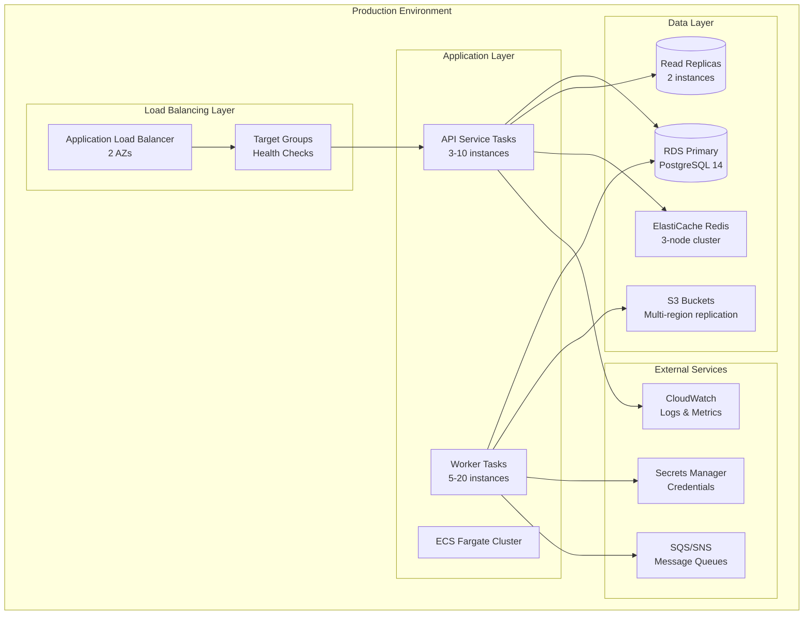
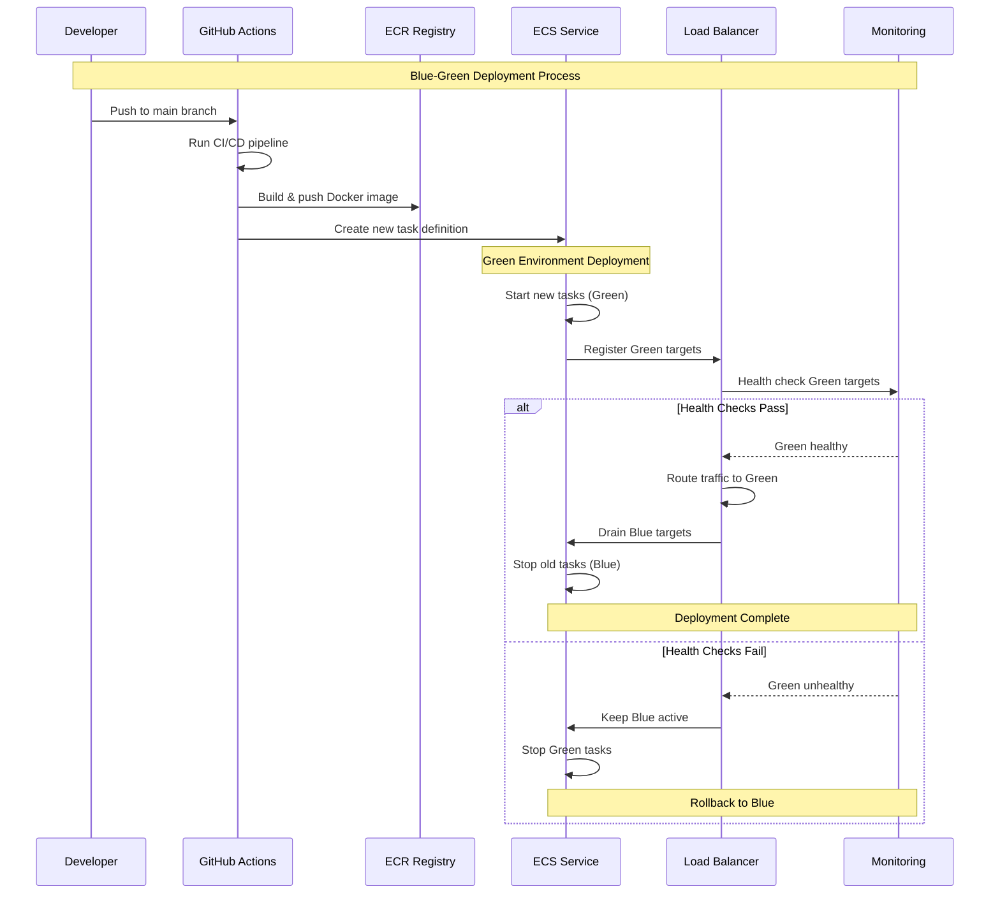
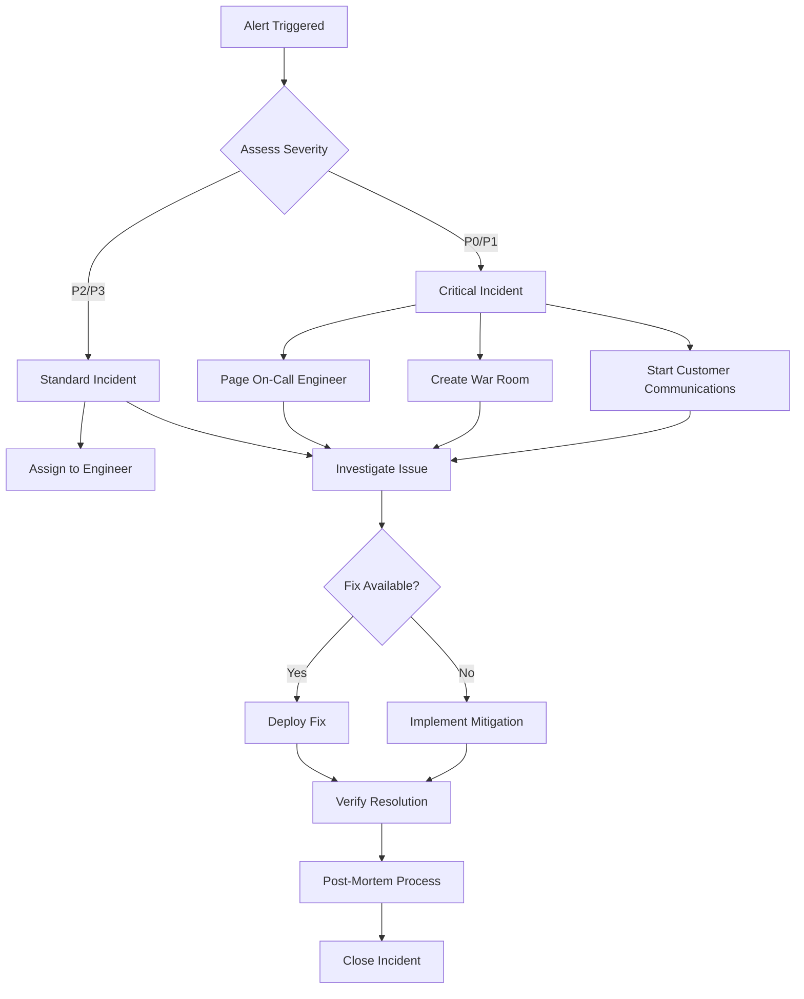

# Deployment & Operations Guide

This document provides comprehensive procedures for deploying, monitoring, and maintaining Tolstoy's production infrastructure, including emergency response protocols and operational best practices.

## Deployment Architecture Overview

### Infrastructure Components



### Environment Configuration

| Environment | Purpose | Infrastructure | Deployment Schedule |
|-------------|---------|----------------|-------------------|
| **Production** | Live customer traffic | Full HA setup, multi-AZ | Manual approval required |
| **Staging** | Pre-production testing | Production-like, single AZ | Auto-deploy from main |
| **Development** | Feature development | Minimal resources | Auto-deploy from feature branches |
| **Load Testing** | Performance testing | Scaled-up staging | On-demand provisioning |

## Deployment Procedures

### 1. Pre-Deployment Checklist

#### Code Quality Gates

<CardGroup cols={2}>
  <Card title="Automated Checks" icon="robot">
    **CI/CD Pipeline Must Pass**
    - ✅ All unit tests (>90% coverage)
    - ✅ Integration tests
    - ✅ TypeScript compilation
    - ✅ ESLint with zero errors
    - ✅ Security vulnerability scan
    - ✅ Docker image build success
  </Card>
  
  <Card title="Manual Review" icon="eye">
    **Required Approvals**
    - ✅ Code review by 2+ engineers
    - ✅ Security review (if touching auth/permissions)
    - ✅ Database migration review (if applicable)
    - ✅ Performance impact assessment
    - ✅ Rollback plan documented
  </Card>
</CardGroup>

#### Pre-deployment Verification

```bash
# Pre-deployment verification script
#!/bin/bash
set -e

echo "🔍 Pre-deployment verification starting..."

# 1. Check current system health
echo "Checking system health..."
curl -f https://api.tolstoy.com/health || exit 1

# 2. Verify database connectivity
echo "Checking database connectivity..."
npm run db:health-check || exit 1

# 3. Check dependencies
echo "Verifying external dependencies..."
npm run deps:health-check || exit 1

# 4. Validate configuration
echo "Validating configuration..."
npm run config:validate || exit 1

# 5. Check resource utilization
echo "Checking resource utilization..."
aws cloudwatch get-metric-statistics \
  --namespace "AWS/ECS" \
  --metric-name CPUUtilization \
  --dimensions Name=ServiceName,Value=tolstoy-api \
  --start-time $(date -u -d '5 minutes ago' '+%Y-%m-%dT%H:%M:%S') \
  --end-time $(date -u '+%Y-%m-%dT%H:%M:%S') \
  --period 300 \
  --statistics Average \
  --query 'Datapoints[0].Average' \
  --output text > cpu_usage.txt

CPU_USAGE=$(cat cpu_usage.txt)
if (( $(echo "$CPU_USAGE > 80" | bc -l) )); then
  echo "❌ CPU usage too high: ${CPU_USAGE}%. Aborting deployment."
  exit 1
fi

echo "✅ Pre-deployment verification completed successfully"
```

### 2. Blue-Green Deployment Process

#### Deployment Pipeline



#### Deployment Script

<CodeGroup>
```bash Production Deployment
#!/bin/bash
set -e

# Configuration
SERVICE_NAME="tolstoy-api"
CLUSTER_NAME="tolstoy-production"
REGION="us-east-1"
TIMEOUT="15m"

echo "🚀 Starting Blue-Green deployment for ${SERVICE_NAME}"

# Get current service configuration
CURRENT_TASK_DEF=$(aws ecs describe-services \
  --cluster $CLUSTER_NAME \
  --services $SERVICE_NAME \
  --query 'services[0].taskDefinition' \
  --output text)

echo "📋 Current task definition: $CURRENT_TASK_DEF"

# Create new task definition with new image
NEW_TASK_DEF=$(aws ecs register-task-definition \
  --cli-input-json file://task-definition.json \
  --query 'taskDefinition.taskDefinitionArn' \
  --output text)

echo "📋 New task definition: $NEW_TASK_DEF"

# Update service with new task definition
echo "🔄 Updating ECS service..."
aws ecs update-service \
  --cluster $CLUSTER_NAME \
  --service $SERVICE_NAME \
  --task-definition $NEW_TASK_DEF \
  --deployment-configuration minimumHealthyPercent=50,maximumPercent=200

# Wait for deployment to complete
echo "⏳ Waiting for deployment to complete..."
aws ecs wait services-stable \
  --cluster $CLUSTER_NAME \
  --services $SERVICE_NAME \
  --cli-read-timeout 900 \
  --cli-connect-timeout 60

# Verify deployment
echo "🔍 Verifying deployment health..."
sleep 30  # Allow time for health checks

RUNNING_COUNT=$(aws ecs describe-services \
  --cluster $CLUSTER_NAME \
  --services $SERVICE_NAME \
  --query 'services[0].runningCount' \
  --output text)

DESIRED_COUNT=$(aws ecs describe-services \
  --cluster $CLUSTER_NAME \
  --services $SERVICE_NAME \
  --query 'services[0].desiredCount' \
  --output text)

if [ "$RUNNING_COUNT" -eq "$DESIRED_COUNT" ]; then
  echo "✅ Deployment successful! $RUNNING_COUNT/$DESIRED_COUNT tasks running"
else
  echo "❌ Deployment failed! $RUNNING_COUNT/$DESIRED_COUNT tasks running"
  exit 1
fi

# Run post-deployment health checks
./scripts/post-deployment-checks.sh

echo "🎉 Blue-Green deployment completed successfully!"
```

```yaml GitHub Actions Workflow
name: Deploy to Production

on:
  push:
    branches: [main]

jobs:
  deploy:
    runs-on: ubuntu-latest
    environment: production
    
    steps:
    - name: Checkout code
      uses: actions/checkout@v3
      
    - name: Configure AWS credentials
      uses: aws-actions/configure-aws-credentials@v2
      with:
        aws-access-key-id: ${{ secrets.AWS_ACCESS_KEY_ID }}
        aws-secret-access-key: ${{ secrets.AWS_SECRET_ACCESS_KEY }}
        aws-region: us-east-1
        
    - name: Login to ECR
      id: login-ecr
      uses: aws-actions/amazon-ecr-login@v1
      
    - name: Build and push Docker image
      env:
        ECR_REGISTRY: ${{ steps.login-ecr.outputs.registry }}
        ECR_REPOSITORY: tolstoy-api
        IMAGE_TAG: ${{ github.sha }}
      run: |
        docker build -t $ECR_REGISTRY/$ECR_REPOSITORY:$IMAGE_TAG .
        docker push $ECR_REGISTRY/$ECR_REPOSITORY:$IMAGE_TAG
        
    - name: Deploy to ECS
      env:
        IMAGE_TAG: ${{ github.sha }}
      run: |
        # Update task definition with new image
        sed -i 's|IMAGE_TAG|'$IMAGE_TAG'|g' task-definition.json
        
        # Deploy using blue-green strategy
        ./scripts/blue-green-deploy.sh
        
    - name: Post-deployment tests
      run: |
        npm run test:integration:production
        npm run test:smoke:production
        
    - name: Notify deployment status
      if: always()
      uses: 8398a7/action-slack@v3
      with:
        status: ${{ job.status }}
        channel: '#deployments'
        webhook_url: ${{ secrets.SLACK_WEBHOOK }}
```
</CodeGroup>

### 3. Database Migration Procedures

#### Migration Safety Checks

```typescript
// Migration validation script
import { DataSource } from 'typeorm';
import { Logger } from '@nestjs/common';

export class MigrationValidator {
  private readonly logger = new Logger(MigrationValidator.name);

  async validateMigration(dataSource: DataSource, migrationName: string): Promise<boolean> {
    try {
      // 1. Check migration reversibility
      const migration = await this.getMigration(migrationName);
      if (!migration.down) {
        this.logger.error(`Migration ${migrationName} is not reversible`);
        return false;
      }

      // 2. Estimate migration time
      const estimatedTime = await this.estimateMigrationTime(migration);
      if (estimatedTime > 300000) { // 5 minutes
        this.logger.warn(`Migration ${migrationName} estimated to take ${estimatedTime/1000}s`);
      }

      // 3. Check for breaking changes
      const hasBreakingChanges = await this.checkForBreakingChanges(migration);
      if (hasBreakingChanges) {
        this.logger.error(`Migration ${migrationName} contains breaking changes`);
        return false;
      }

      // 4. Validate against staging data
      await this.validateAgainstStaging(migration);

      return true;
    } catch (error) {
      this.logger.error(`Migration validation failed: ${error.message}`);
      return false;
    }
  }

  private async estimateMigrationTime(migration: any): Promise<number> {
    // Estimate based on operation type and table size
    const tableRows = await this.getTableRowCount(migration.tableName);
    
    if (migration.type === 'ADD_COLUMN') {
      return tableRows * 0.001; // 1ms per row
    } else if (migration.type === 'ALTER_COLUMN') {
      return tableRows * 0.01; // 10ms per row
    } else if (migration.type === 'ADD_INDEX') {
      return tableRows * 0.1; // 100ms per row
    }
    
    return 1000; // Default 1 second
  }
}
```

#### Zero-Downtime Migration Strategy

```sql
-- Example: Adding a new non-nullable column with zero downtime

-- Step 1: Add column as nullable with default
ALTER TABLE flows 
ADD COLUMN new_feature_flag BOOLEAN DEFAULT false;

-- Step 2: Populate existing rows (can be done in batches)
UPDATE flows 
SET new_feature_flag = true 
WHERE status = 'active';

-- Step 3: Make column non-nullable (after app deployment)
ALTER TABLE flows 
ALTER COLUMN new_feature_flag SET NOT NULL;

-- Step 4: Remove default (optional, in next release)
ALTER TABLE flows 
ALTER COLUMN new_feature_flag DROP DEFAULT;
```

## Monitoring & Alerting

### 1. Health Check Endpoints

```typescript
@Controller('health')
export class HealthController {
  constructor(
    private readonly dataSource: DataSource,
    private readonly redis: Redis,
    private readonly configService: ConfigService
  ) {}

  @Get()
  async healthCheck(): Promise<HealthCheckResponse> {
    const checks = await Promise.allSettled([
      this.checkDatabase(),
      this.checkRedis(),
      this.checkExternalAPIs(),
      this.checkDiskSpace(),
      this.checkMemoryUsage()
    ]);

    const results = checks.map((check, index) => ({
      name: ['database', 'redis', 'external_apis', 'disk_space', 'memory'][index],
      status: check.status === 'fulfilled' ? 'healthy' : 'unhealthy',
      details: check.status === 'fulfilled' ? check.value : check.reason,
      timestamp: new Date().toISOString()
    }));

    const overallStatus = results.every(r => r.status === 'healthy') ? 'healthy' : 'unhealthy';

    return {
      status: overallStatus,
      timestamp: new Date().toISOString(),
      version: this.configService.get('APP_VERSION'),
      environment: this.configService.get('NODE_ENV'),
      checks: results
    };
  }

  private async checkDatabase(): Promise<HealthCheckResult> {
    const start = Date.now();
    await this.dataSource.query('SELECT 1');
    const duration = Date.now() - start;
    
    return {
      status: 'healthy',
      responseTime: `${duration}ms`,
      details: 'Database connection successful'
    };
  }

  private async checkRedis(): Promise<HealthCheckResult> {
    const start = Date.now();
    await this.redis.ping();
    const duration = Date.now() - start;
    
    return {
      status: 'healthy',
      responseTime: `${duration}ms`,
      details: 'Redis connection successful'
    };
  }
}
```

### 2. Application Metrics

```typescript
// Prometheus metrics collection
@Injectable()
export class MetricsService {
  private readonly httpRequestDuration = new prometheus.Histogram({
    name: 'tolstoy_http_request_duration_seconds',
    help: 'HTTP request duration in seconds',
    labelNames: ['method', 'route', 'status_code', 'org_id'],
    buckets: [0.01, 0.05, 0.1, 0.5, 1, 2, 5, 10]
  });

  private readonly flowExecutionDuration = new prometheus.Histogram({
    name: 'tolstoy_flow_execution_duration_seconds',
    help: 'Flow execution duration in seconds',
    labelNames: ['flow_id', 'status', 'org_id'],
    buckets: [1, 5, 10, 30, 60, 120, 300, 600, 1800, 3600]
  });

  private readonly activeExecutions = new prometheus.Gauge({
    name: 'tolstoy_active_executions_total',
    help: 'Number of currently active executions',
    labelNames: ['org_id', 'priority']
  });

  private readonly databaseConnections = new prometheus.Gauge({
    name: 'tolstoy_database_connections_active',
    help: 'Number of active database connections',
    labelNames: ['pool_name']
  });

  recordHttpRequest(
    method: string,
    route: string,
    statusCode: number,
    duration: number,
    orgId?: string
  ): void {
    this.httpRequestDuration
      .labels(method, route, statusCode.toString(), orgId || 'unknown')
      .observe(duration / 1000);
  }

  recordFlowExecution(
    flowId: string,
    status: string,
    duration: number,
    orgId: string
  ): void {
    this.flowExecutionDuration
      .labels(flowId, status, orgId)
      .observe(duration / 1000);
  }

  updateActiveExecutions(orgId: string, priority: string, count: number): void {
    this.activeExecutions.labels(orgId, priority).set(count);
  }

  updateDatabaseConnections(poolName: string, count: number): void {
    this.databaseConnections.labels(poolName).set(count);
  }
}
```

### 3. Alert Configuration

#### CloudWatch Alarms

```yaml
# cloudwatch-alarms.yaml
alerts:
  high_error_rate:
    metric_name: "ErrorRate"
    threshold: 5  # 5% error rate
    comparison: "GreaterThanThreshold"
    evaluation_periods: 2
    period: 300  # 5 minutes
    actions:
      - type: "sns"
        target: "arn:aws:sns:us-east-1:123456789:tolstoy-alerts"
      - type: "slack"
        channel: "#alerts"
        
  high_response_time:
    metric_name: "ResponseTime"
    statistic: "Average"
    threshold: 2000  # 2 seconds
    comparison: "GreaterThanThreshold"
    evaluation_periods: 3
    
  database_connection_errors:
    metric_name: "DatabaseErrors"
    threshold: 10
    comparison: "GreaterThanThreshold"
    evaluation_periods: 1
    
  memory_usage_high:
    metric_name: "MemoryUtilization"
    threshold: 85  # 85%
    comparison: "GreaterThanThreshold"
    evaluation_periods: 2
    
  execution_failures:
    metric_name: "ExecutionFailures"
    threshold: 50  # 50 failures per 5 minutes
    comparison: "GreaterThanThreshold"
    period: 300
```

#### PagerDuty Integration

```typescript
@Injectable()
export class AlertingService {
  private readonly pagerDuty: PagerDutyService;
  private readonly slack: SlackService;
  
  async sendCriticalAlert(
    title: string,
    description: string,
    severity: 'low' | 'medium' | 'high' | 'critical',
    context: Record<string, any> = {}
  ): Promise<void> {
    const alert = {
      incident_key: `tolstoy_${Date.now()}`,
      event_type: 'trigger',
      description: title,
      details: {
        description,
        context,
        timestamp: new Date().toISOString(),
        environment: process.env.NODE_ENV,
        service: 'tolstoy-api'
      }
    };

    // Send to PagerDuty for critical alerts
    if (severity === 'critical' || severity === 'high') {
      await this.pagerDuty.sendAlert(alert);
    }

    // Send to Slack for all alerts
    await this.slack.sendAlert({
      channel: severity === 'critical' ? '#critical-alerts' : '#alerts',
      title,
      description,
      severity,
      context
    });
  }

  async sendMetricAlert(
    metricName: string,
    currentValue: number,
    threshold: number,
    comparison: string
  ): Promise<void> {
    const severity = this.calculateSeverity(metricName, currentValue, threshold);
    
    await this.sendCriticalAlert(
      `Metric Alert: ${metricName}`,
      `${metricName} is ${currentValue} (threshold: ${threshold})`,
      severity,
      {
        metric: metricName,
        current_value: currentValue,
        threshold,
        comparison
      }
    );
  }
}
```

## Incident Response Procedures

### 1. Incident Classification

| Severity | Description | Response Time | Example Scenarios |
|----------|-------------|---------------|-------------------|
| **Critical (P0)** | Service completely down | 15 minutes | API returning 500s, database unavailable |
| **High (P1)** | Major feature broken | 1 hour | Flow execution failing, authentication issues |
| **Medium (P2)** | Minor feature impacted | 4 hours | UI bugs, performance degradation |
| **Low (P3)** | Cosmetic issues | Next business day | Documentation errors, minor UI issues |

### 2. Incident Response Workflow



### 3. Runbooks

#### High CPU Usage Runbook

<CodeGroup>
```bash Investigation Steps
#!/bin/bash
# High CPU Usage Investigation

echo "🔍 Investigating high CPU usage..."

# 1. Check current CPU utilization
aws cloudwatch get-metric-statistics \
  --namespace AWS/ECS \
  --metric-name CPUUtilization \
  --dimensions Name=ServiceName,Value=tolstoy-api \
  --start-time $(date -u -d '10 minutes ago' '+%Y-%m-%dT%H:%M:%S') \
  --end-time $(date -u '+%Y-%m-%dT%H:%M:%S') \
  --period 300 \
  --statistics Average,Maximum

# 2. Check active executions count
aws cloudwatch get-metric-statistics \
  --namespace Tolstoy/Executions \
  --metric-name ActiveExecutions \
  --start-time $(date -u -d '10 minutes ago' '+%Y-%m-%dT%H:%M:%S') \
  --end-time $(date -u '+%Y-%m-%dT%H:%M:%S') \
  --period 300 \
  --statistics Average,Maximum

# 3. Check for problematic flows
echo "Checking for resource-intensive flows..."
kubectl logs -l app=tolstoy-api --tail=100 | grep "SLOW_EXECUTION" || echo "No slow executions found"

# 4. Check database query performance
echo "Checking database performance..."
psql -h $DB_HOST -U $DB_USER -d $DB_NAME -c "
  SELECT query, calls, mean_exec_time, rows, 100.0 * shared_blks_hit / nullif(shared_blks_hit + shared_blks_read, 0) AS hit_percent
  FROM pg_stat_statements 
  ORDER BY mean_exec_time DESC 
  LIMIT 10;"
```

```yaml Mitigation Actions
# Immediate Actions (< 5 minutes)
immediate:
  - name: "Scale up ECS service"
    command: |
      aws ecs update-service \
        --cluster tolstoy-production \
        --service tolstoy-api \
        --desired-count 6
  
  - name: "Enable read replica routing"
    action: "Update ALB target group to include read replicas"
    
  - name: "Temporarily disable non-critical features"
    action: "Set feature flags: analytics=false, reporting=false"

# Medium-term Actions (< 30 minutes)  
medium_term:
  - name: "Identify and kill problematic executions"
    query: |
      SELECT id, flow_id, started_at 
      FROM executions 
      WHERE status = 'running' 
      AND started_at < NOW() - INTERVAL '10 minutes'
      ORDER BY started_at;
      
  - name: "Clear Redis cache if memory pressure"
    command: "redis-cli FLUSHDB"
    
  - name: "Restart application if memory leak suspected"
    action: "Rolling restart of ECS tasks"
```
</CodeGroup>

#### Database Connection Pool Exhaustion

```bash
#!/bin/bash
# Database Connection Pool Exhaustion Runbook

echo "🔍 Investigating database connection issues..."

# 1. Check current connection count
psql -h $DB_HOST -U $DB_USER -d $DB_NAME -c "
  SELECT 
    state,
    COUNT(*) as connections
  FROM pg_stat_activity 
  WHERE datname = current_database()
  GROUP BY state
  ORDER BY connections DESC;"

# 2. Check for long-running queries
psql -h $DB_HOST -U $DB_USER -d $DB_NAME -c "
  SELECT 
    pid,
    now() - pg_stat_activity.query_start AS duration,
    query,
    state
  FROM pg_stat_activity 
  WHERE (now() - pg_stat_activity.query_start) > interval '5 minutes'
  AND state != 'idle'
  ORDER BY duration DESC;"

# 3. Immediate mitigation
echo "Killing long-running queries..."
psql -h $DB_HOST -U $DB_USER -d $DB_NAME -c "
  SELECT pg_terminate_backend(pid)
  FROM pg_stat_activity
  WHERE (now() - pg_stat_activity.query_start) > interval '10 minutes'
  AND state != 'idle'
  AND pid != pg_backend_pid();"

# 4. Scale up connection pool
aws rds modify-db-instance \
  --db-instance-identifier tolstoy-production \
  --max-allocated-storage 1000 \
  --apply-immediately

echo "✅ Connection pool exhaustion mitigation completed"
```

## Rollback Procedures

### Automated Rollback

```bash
#!/bin/bash
# Automated rollback script

set -e

SERVICE_NAME="tolstoy-api"
CLUSTER_NAME="tolstoy-production"

echo "🔄 Starting automated rollback for ${SERVICE_NAME}"

# Get previous stable task definition
CURRENT_SERVICE=$(aws ecs describe-services \
  --cluster $CLUSTER_NAME \
  --services $SERVICE_NAME)

CURRENT_TASK_ARN=$(echo $CURRENT_SERVICE | jq -r '.services[0].taskDefinition')
CURRENT_REVISION=$(echo $CURRENT_TASK_ARN | grep -o '[0-9]*$')
PREVIOUS_REVISION=$((CURRENT_REVISION - 1))

PREVIOUS_TASK_ARN=$(echo $CURRENT_TASK_ARN | sed "s/:${CURRENT_REVISION}$/:${PREVIOUS_REVISION}/")

echo "📋 Rolling back from revision $CURRENT_REVISION to $PREVIOUS_REVISION"

# Update service to previous task definition
aws ecs update-service \
  --cluster $CLUSTER_NAME \
  --service $SERVICE_NAME \
  --task-definition $PREVIOUS_TASK_ARN

# Wait for rollback to complete
echo "⏳ Waiting for rollback to complete..."
aws ecs wait services-stable \
  --cluster $CLUSTER_NAME \
  --services $SERVICE_NAME

# Verify rollback success
RUNNING_COUNT=$(aws ecs describe-services \
  --cluster $CLUSTER_NAME \
  --services $SERVICE_NAME \
  --query 'services[0].runningCount' \
  --output text)

echo "✅ Rollback completed! $RUNNING_COUNT tasks running on revision $PREVIOUS_REVISION"

# Run health checks
./scripts/post-deployment-checks.sh

# Notify team
curl -X POST -H 'Content-type: application/json' \
  --data '{"text":"🔄 Automated rollback completed for tolstoy-api"}' \
  $SLACK_WEBHOOK_URL
```

## Performance Optimization

### Auto-Scaling Configuration

```typescript
// ECS Auto-scaling configuration
const autoScalingConfig = {
  service: 'tolstoy-api',
  cluster: 'tolstoy-production',
  minCapacity: 3,
  maxCapacity: 20,
  targetValue: 70.0, // Target CPU utilization
  
  policies: [
    {
      name: 'CPUUtilization',
      metricType: 'CPUUtilization',
      targetValue: 70.0,
      scaleOutCooldown: 300, // 5 minutes
      scaleInCooldown: 600,  // 10 minutes
    },
    {
      name: 'MemoryUtilization', 
      metricType: 'MemoryUtilization',
      targetValue: 80.0,
      scaleOutCooldown: 300,
      scaleInCooldown: 600,
    },
    {
      name: 'ActiveExecutions',
      metricType: 'Custom',
      metricName: 'tolstoy_active_executions_total',
      targetValue: 100.0,
      scaleOutCooldown: 180, // Faster scaling for execution load
      scaleInCooldown: 300,
    }
  ]
};
```

This comprehensive deployment and operations guide provides the engineering team with detailed procedures for maintaining production reliability, responding to incidents, and ensuring smooth deployments of the Tolstoy platform.

---

*This deployment guide should be regularly updated based on operational experience and infrastructure changes to ensure accuracy and effectiveness of procedures.*