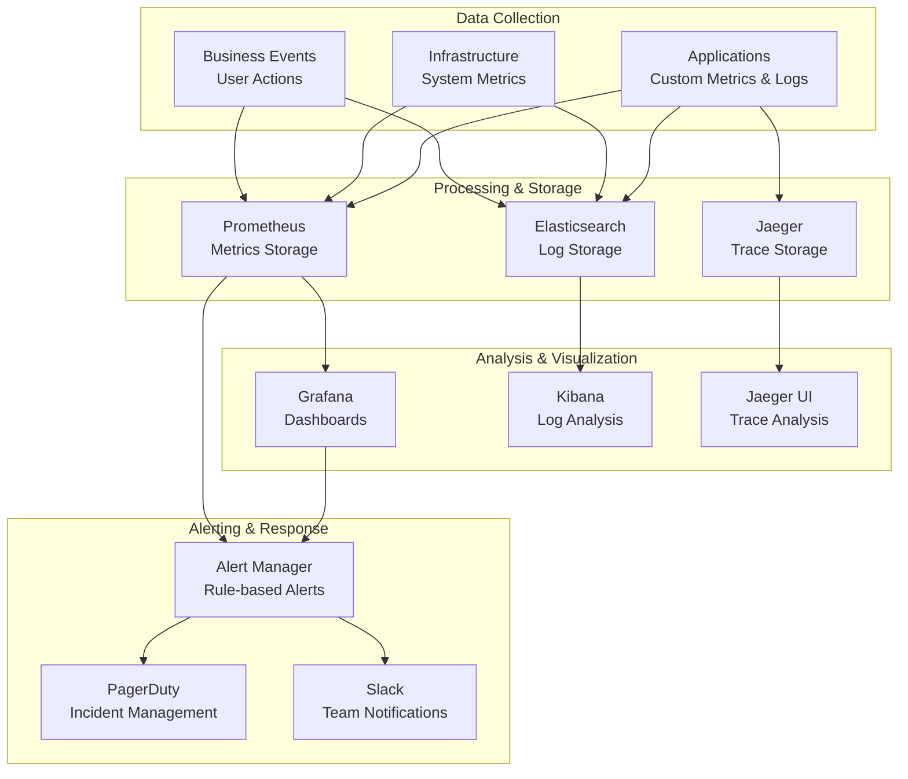

# Monitoring & Observability Guide

This document outlines Tolstoy's monitoring and observability strategy, providing engineering teams with comprehensive visibility into system health, performance, and business metrics.

## Observability Philosophy

### Three Pillars of Observability

<CardGroup cols={3}>
  <Card title="📊 Metrics" icon="chart-line">
    **Quantitative Measurements**
    - System performance indicators
    - Business metrics and KPIs
    - Resource utilization tracking
    - SLI/SLO monitoring
    - Custom application metrics
    
    **Tools**: Prometheus, CloudWatch, DataDog
  </Card>
  
  <Card title="📝 Logs" icon="file-text">
    **Event Records**
    - Structured application logs
    - Audit trails and security logs
    - Error tracking and debugging
    - Request/response logging
    - Business event logging
    
    **Tools**: CloudWatch Logs, ELK Stack, Fluentd
  </Card>
  
  <Card title="🔍 Traces" icon="search">
    **Request Journey Tracking**
    - End-to-end request tracing
    - Service dependency mapping
    - Performance bottleneck identification
    - Error propagation analysis
    - Latency breakdown
    
    **Tools**: OpenTelemetry, Jaeger, X-Ray
  </Card>
</CardGroup>

### Observability Strategy



## Metrics Collection & Monitoring

### Application Metrics

#### Core Performance Metrics

<CodeGroup>
```typescript Custom Metrics Service
import { Injectable } from '@nestjs/common';
import { register, Counter, Histogram, Gauge } from 'prom-client';

@Injectable()
export class MetricsService {
  // HTTP Request Metrics
  private readonly httpRequestDuration = new Histogram({
    name: 'tolstoy_http_request_duration_seconds',
    help: 'HTTP request duration in seconds',
    labelNames: ['method', 'route', 'status_code', 'org_id'],
    buckets: [0.01, 0.05, 0.1, 0.5, 1, 2, 5, 10],
    registers: [register]
  });

  private readonly httpRequestTotal = new Counter({
    name: 'tolstoy_http_requests_total',
    help: 'Total number of HTTP requests',
    labelNames: ['method', 'route', 'status_code', 'org_id'],
    registers: [register]
  });

  // Flow Execution Metrics
  private readonly flowExecutionDuration = new Histogram({
    name: 'tolstoy_flow_execution_duration_seconds',
    help: 'Flow execution duration in seconds',
    labelNames: ['flow_id', 'status', 'org_id', 'execution_mode'],
    buckets: [1, 5, 10, 30, 60, 300, 600, 1800, 3600, 7200],
    registers: [register]
  });

  private readonly flowExecutionTotal = new Counter({
    name: 'tolstoy_flow_executions_total',
    help: 'Total number of flow executions',
    labelNames: ['flow_id', 'status', 'org_id', 'trigger_type'],
    registers: [register]
  });

  private readonly activeExecutions = new Gauge({
    name: 'tolstoy_active_executions_total',
    help: 'Current number of active executions',
    labelNames: ['org_id', 'priority'],
    registers: [register]
  });

  // Action Metrics
  private readonly actionExecutionDuration = new Histogram({
    name: 'tolstoy_action_execution_duration_seconds',
    help: 'Action execution duration in seconds',
    labelNames: ['action_type', 'status', 'org_id'],
    buckets: [0.1, 0.5, 1, 2, 5, 10, 30, 60],
    registers: [register]
  });

  private readonly actionExecutionTotal = new Counter({
    name: 'tolstoy_action_executions_total',
    help: 'Total number of action executions',
    labelNames: ['action_type', 'status', 'org_id'],
    registers: [register]
  });

  // Database Metrics
  private readonly databaseQueryDuration = new Histogram({
    name: 'tolstoy_database_query_duration_seconds',
    help: 'Database query duration in seconds',
    labelNames: ['operation', 'table', 'status'],
    buckets: [0.01, 0.05, 0.1, 0.5, 1, 2, 5],
    registers: [register]
  });

  private readonly databaseConnectionsActive = new Gauge({
    name: 'tolstoy_database_connections_active',
    help: 'Number of active database connections',
    labelNames: ['pool_name'],
    registers: [register]
  });

  // Business Metrics
  private readonly userRegistrations = new Counter({
    name: 'tolstoy_user_registrations_total',
    help: 'Total number of user registrations',
    labelNames: ['org_id', 'plan_type'],
    registers: [register]
  });

  private readonly revenueGenerated = new Counter({
    name: 'tolstoy_revenue_generated_total',
    help: 'Total revenue generated in cents',
    labelNames: ['org_id', 'plan_type', 'currency'],
    registers: [register]
  });

  // Method implementations
  recordHttpRequest(method: string, route: string, statusCode: number, duration: number, orgId?: string): void {
    this.httpRequestDuration.labels(method, route, statusCode.toString(), orgId || 'unknown').observe(duration / 1000);
    this.httpRequestTotal.labels(method, route, statusCode.toString(), orgId || 'unknown').inc();
  }

  recordFlowExecution(flowId: string, status: string, duration: number, orgId: string, mode: string = 'async', triggerType: string = 'manual'): void {
    this.flowExecutionDuration.labels(flowId, status, orgId, mode).observe(duration / 1000);
    this.flowExecutionTotal.labels(flowId, status, orgId, triggerType).inc();
  }

  updateActiveExecutions(orgId: string, priority: string, count: number): void {
    this.activeExecutions.labels(orgId, priority).set(count);
  }

  recordActionExecution(actionType: string, status: string, duration: number, orgId: string): void {
    this.actionExecutionDuration.labels(actionType, status, orgId).observe(duration / 1000);
    this.actionExecutionTotal.labels(actionType, status, orgId).inc();
  }

  recordDatabaseQuery(operation: string, table: string, duration: number, status: string = 'success'): void {
    this.databaseQueryDuration.labels(operation, table, status).observe(duration / 1000);
  }

  updateDatabaseConnections(poolName: string, count: number): void {
    this.databaseConnectionsActive.labels(poolName).set(count);
  }

  recordUserRegistration(orgId: string, planType: string): void {
    this.userRegistrations.labels(orgId, planType).inc();
  }

  recordRevenue(orgId: string, planType: string, amount: number, currency: string = 'USD'): void {
    this.revenueGenerated.labels(orgId, planType, currency).inc(amount);
  }

  async getMetrics(): Promise<string> {
    return await register.metrics();
  }
}
```

```typescript Metrics Middleware
import { Injectable, NestMiddleware } from '@nestjs/common';
import { Request, Response, NextFunction } from 'express';
import { MetricsService } from './metrics.service';

@Injectable()
export class MetricsMiddleware implements NestMiddleware {
  constructor(private readonly metricsService: MetricsService) {}

  use(req: Request, res: Response, next: NextFunction) {
    const start = Date.now();
    const originalEnd = res.end;

    res.end = function(chunk: any, encoding?: string | (() => void), cb?: () => void) {
      const duration = Date.now() - start;
      const orgId = req.headers['x-org-id'] as string;
      
      // Record HTTP request metrics
      metricsService.recordHttpRequest(
        req.method,
        req.route?.path || req.url,
        res.statusCode,
        duration,
        orgId
      );

      return originalEnd.call(this, chunk, encoding as any, cb);
    };

    next();
  }
}
```
</CodeGroup>

#### Business Metrics Dashboard Configuration

```yaml
# Grafana Dashboard Configuration
apiVersion: 1
datasources:
  - name: Prometheus
    type: prometheus
    url: http://prometheus:9090
    isDefault: true

dashboards:
  business_metrics:
    title: "Tolstoy Business Metrics"
    panels:
      - title: "Daily Active Organizations"
        type: stat
        targets:
          - expr: count(increase(tolstoy_http_requests_total[24h]) > 10) by (org_id)
        fieldConfig:
          defaults:
            unit: short
            
      - title: "Flow Execution Success Rate"
        type: stat
        targets:
          - expr: |
              (
                sum(rate(tolstoy_flow_executions_total{status="completed"}[5m])) /
                sum(rate(tolstoy_flow_executions_total[5m]))
              ) * 100
        fieldConfig:
          defaults:
            unit: percent
            min: 0
            max: 100
            
      - title: "Revenue Trend (Last 30 Days)"
        type: graph
        targets:
          - expr: increase(tolstoy_revenue_generated_total[1d])
        fieldConfig:
          defaults:
            unit: currencyUSD
            
      - title: "Top Performing Flows"
        type: table
        targets:
          - expr: |
              topk(10,
                sum(rate(tolstoy_flow_executions_total{status="completed"}[24h])) by (flow_id)
              )
```

### Infrastructure Metrics

#### System-Level Monitoring

<CodeGroup>
```yaml CloudWatch Custom Metrics
# Custom CloudWatch metrics configuration
custom_metrics:
  ecs_service_metrics:
    - metric_name: "ServiceCPUUtilization"
      namespace: "Tolstoy/ECS"
      dimensions:
        - name: "ServiceName"
          value: "tolstoy-api"
        - name: "ClusterName"
          value: "tolstoy-production"
      statistic: "Average"
      threshold: 80
      comparison: "GreaterThanThreshold"
      
    - metric_name: "ServiceMemoryUtilization"
      namespace: "Tolstoy/ECS"
      dimensions:
        - name: "ServiceName"
          value: "tolstoy-api"
        - name: "ClusterName"
          value: "tolstoy-production"
      statistic: "Average"
      threshold: 85
      comparison: "GreaterThanThreshold"
      
  database_metrics:
    - metric_name: "DatabaseConnections"
      namespace: "Tolstoy/Database"
      threshold: 180
      comparison: "GreaterThanThreshold"
      
    - metric_name: "QueryDuration"
      namespace: "Tolstoy/Database"
      threshold: 5000
      comparison: "GreaterThanThreshold"
      unit: "Milliseconds"
      
  redis_metrics:
    - metric_name: "CacheHitRate"
      namespace: "Tolstoy/Cache"
      threshold: 80
      comparison: "LessThanThreshold"
      unit: "Percent"
```

```bash Infrastructure Monitoring Script
#!/bin/bash
# Infrastructure health check script

set -e

echo "🔍 Infrastructure Health Check - $(date)"
echo "========================================="

# Check ECS Service Health
echo "📊 ECS Service Status:"
aws ecs describe-services \
  --cluster tolstoy-production \
  --services tolstoy-api tolstoy-worker \
  --query 'services[*].{Name:serviceName,Status:status,Running:runningCount,Desired:desiredCount}' \
  --output table

# Check Database Performance
echo -e "\n🗄️  Database Performance:"
psql -h $DB_HOST -U $DB_USER -d tolstoy -c "
  SELECT 
    'Active Connections' as metric,
    count(*) as value
  FROM pg_stat_activity 
  WHERE state = 'active'
  UNION ALL
  SELECT 
    'Idle Connections' as metric,
    count(*) as value
  FROM pg_stat_activity 
  WHERE state = 'idle'
  UNION ALL
  SELECT 
    'Cache Hit Ratio' as metric,
    round(
      sum(blks_hit) * 100.0 / sum(blks_hit + blks_read), 2
    ) as value
  FROM pg_stat_database 
  WHERE datname = 'tolstoy';
"

# Check Redis Performance
echo -e "\n🔴 Redis Performance:"
redis-cli --raw INFO stats | grep -E "(keyspace_hits|keyspace_misses|total_commands_processed)"

# Check Load Balancer Health
echo -e "\n⚖️  Load Balancer Health:"
aws elbv2 describe-target-health \
  --target-group-arn $ALB_TARGET_GROUP_ARN \
  --query 'TargetHealthDescriptions[*].{Target:Target.Id,Health:TargetHealth.State,Reason:TargetHealth.Reason}' \
  --output table

# Check CloudWatch Alarms
echo -e "\n🚨 Active CloudWatch Alarms:"
aws cloudwatch describe-alarms \
  --state-value ALARM \
  --query 'MetricAlarms[*].{Name:AlarmName,State:StateValue,Reason:StateReason}' \
  --output table

echo -e "\n✅ Infrastructure health check completed"
```
</CodeGroup>

## Logging Strategy

### Structured Logging Implementation

<CodeGroup>
```typescript Logging Service
import { Injectable, LoggerService } from '@nestjs/common';
import * as winston from 'winston';
import { ElasticsearchTransport } from 'winston-elasticsearch';

@Injectable()
export class StructuredLogger implements LoggerService {
  private readonly logger: winston.Logger;

  constructor() {
    const transports = [
      new winston.transports.Console({
        format: winston.format.combine(
          winston.format.colorize(),
          winston.format.timestamp(),
          winston.format.printf(({ timestamp, level, message, context, trace, ...meta }) => {
            return `${timestamp} [${context || 'Application'}] ${level}: ${message} ${
              Object.keys(meta).length ? JSON.stringify(meta) : ''
            }`;
          })
        )
      })
    ];

    // Add Elasticsearch transport in production
    if (process.env.NODE_ENV === 'production') {
      transports.push(
        new ElasticsearchTransport({
          level: 'info',
          clientOpts: {
            node: process.env.ELASTICSEARCH_URL,
            auth: {
              username: process.env.ELASTICSEARCH_USERNAME,
              password: process.env.ELASTICSEARCH_PASSWORD
            }
          },
          index: 'tolstoy-logs'
        })
      );
    }

    this.logger = winston.createLogger({
      level: process.env.LOG_LEVEL || 'info',
      format: winston.format.combine(
        winston.format.timestamp(),
        winston.format.errors({ stack: true }),
        winston.format.json()
      ),
      transports
    });
  }

  log(message: string, context?: string, meta?: any) {
    this.logger.info(message, { context, ...meta });
  }

  error(message: string, trace?: string, context?: string, meta?: any) {
    this.logger.error(message, { context, trace, ...meta });
  }

  warn(message: string, context?: string, meta?: any) {
    this.logger.warn(message, { context, ...meta });
  }

  debug(message: string, context?: string, meta?: any) {
    this.logger.debug(message, { context, ...meta });
  }

  verbose(message: string, context?: string, meta?: any) {
    this.logger.verbose(message, { context, ...meta });
  }

  // Business event logging
  logBusinessEvent(event: string, data: any, context?: string) {
    this.logger.info('Business Event', {
      context: context || 'BusinessEvents',
      event_type: event,
      event_data: data,
      timestamp: new Date().toISOString(),
      environment: process.env.NODE_ENV
    });
  }

  // Security event logging
  logSecurityEvent(event: string, userId?: string, orgId?: string, details?: any) {
    this.logger.warn('Security Event', {
      context: 'Security',
      event_type: event,
      user_id: userId,
      org_id: orgId,
      event_details: details,
      timestamp: new Date().toISOString(),
      ip_address: details?.ip_address,
      user_agent: details?.user_agent
    });
  }

  // Performance logging
  logPerformanceEvent(operation: string, duration: number, metadata?: any) {
    this.logger.info('Performance Event', {
      context: 'Performance',
      operation,
      duration_ms: duration,
      metadata,
      timestamp: new Date().toISOString()
    });
  }

  // Audit logging
  logAuditEvent(action: string, resource: string, userId: string, orgId: string, changes?: any) {
    this.logger.info('Audit Event', {
      context: 'Audit',
      action,
      resource,
      user_id: userId,
      org_id: orgId,
      changes,
      timestamp: new Date().toISOString()
    });
  }
}
```

```typescript Request Logging Interceptor
import { Injectable, NestInterceptor, ExecutionContext, CallHandler } from '@nestjs/common';
import { Observable } from 'rxjs';
import { tap } from 'rxjs/operators';
import { StructuredLogger } from './structured-logger.service';

@Injectable()
export class RequestLoggingInterceptor implements NestInterceptor {
  constructor(private readonly logger: StructuredLogger) {}

  intercept(context: ExecutionContext, next: CallHandler): Observable<any> {
    const request = context.switchToHttp().getRequest();
    const response = context.switchToHttp().getResponse();
    const { method, url, headers } = request;
    const userAgent = headers['user-agent'];
    const orgId = headers['x-org-id'];
    const userId = headers['x-user-id'];
    const requestId = headers['x-request-id'] || this.generateRequestId();
    const startTime = Date.now();

    // Log request start
    this.logger.log('HTTP Request Started', 'RequestLogger', {
      request_id: requestId,
      method,
      url,
      org_id: orgId,
      user_id: userId,
      user_agent: userAgent,
      ip_address: this.getClientIp(request)
    });

    return next.handle().pipe(
      tap({
        next: (data) => {
          const duration = Date.now() - startTime;
          
          this.logger.log('HTTP Request Completed', 'RequestLogger', {
            request_id: requestId,
            method,
            url,
            status_code: response.statusCode,
            duration_ms: duration,
            org_id: orgId,
            user_id: userId,
            response_size: JSON.stringify(data || {}).length
          });
        },
        error: (error) => {
          const duration = Date.now() - startTime;
          
          this.logger.error('HTTP Request Failed', error.stack, 'RequestLogger', {
            request_id: requestId,
            method,
            url,
            status_code: response.statusCode || 500,
            duration_ms: duration,
            org_id: orgId,
            user_id: userId,
            error_message: error.message,
            error_type: error.constructor.name
          });
        }
      })
    );
  }

  private generateRequestId(): string {
    return Math.random().toString(36).substring(2, 15) + Math.random().toString(36).substring(2, 15);
  }

  private getClientIp(request: any): string {
    return request.headers['x-forwarded-for'] || 
           request.headers['x-real-ip'] || 
           request.connection.remoteAddress || 
           request.socket.remoteAddress || 
           (request.connection.socket ? request.connection.socket.remoteAddress : null);
  }
}
```
</CodeGroup>

### Log Aggregation & Analysis

#### ELK Stack Configuration

```yaml
# docker-compose.yml for ELK Stack
version: '3.7'
services:
  elasticsearch:
    image: docker.elastic.co/elasticsearch/elasticsearch:8.5.0
    environment:
      - discovery.type=single-node
      - xpack.security.enabled=false
      - "ES_JAVA_OPTS=-Xms2g -Xmx2g"
    ports:
      - "9200:9200"
    volumes:
      - elasticsearch_data:/usr/share/elasticsearch/data

  logstash:
    image: docker.elastic.co/logstash/logstash:8.5.0
    ports:
      - "5044:5044"
      - "5000:5000/tcp"
      - "5000:5000/udp"
      - "9600:9600"
    environment:
      LS_JAVA_OPTS: "-Xmx1g -Xms1g"
    volumes:
      - ./logstash/pipeline:/usr/share/logstash/pipeline:ro
      - ./logstash/config/logstash.yml:/usr/share/logstash/config/logstash.yml:ro
    depends_on:
      - elasticsearch

  kibana:
    image: docker.elastic.co/kibana/kibana:8.5.0
    ports:
      - "5601:5601"
    environment:
      ELASTICSEARCH_URL: http://elasticsearch:9200
      ELASTICSEARCH_HOSTS: '["http://elasticsearch:9200"]'
    depends_on:
      - elasticsearch

volumes:
  elasticsearch_data:
    driver: local
```

#### Log Analysis Queries

```ruby
# Logstash pipeline configuration
input {
  beats {
    port => 5044
  }
  http {
    port => 5000
    codec => json
  }
}

filter {
  if [context] == "RequestLogger" {
    mutate {
      add_tag => ["http_request"]
    }
    
    if [duration_ms] {
      ruby {
        code => "
          duration = event.get('duration_ms')
          if duration > 5000
            event.set('performance_concern', 'slow_request')
          end
        "
      }
    }
  }
  
  if [context] == "Security" {
    mutate {
      add_tag => ["security_event"]
    }
  }
  
  if [context] == "BusinessEvents" {
    mutate {
      add_tag => ["business_metric"]
    }
  }
  
  # Parse error stack traces
  if [trace] {
    mutate {
      split => { "trace" => "\n" }
    }
  }
  
  # Add geographical info based on IP
  if [ip_address] {
    geoip {
      source => "ip_address"
      target => "geoip"
    }
  }
  
  # Add timestamp parsing
  date {
    match => [ "timestamp", "ISO8601" ]
    target => "@timestamp"
  }
}

output {
  elasticsearch {
    hosts => ["elasticsearch:9200"]
    index => "tolstoy-logs-%{+YYYY.MM.dd}"
  }
  
  # Send alerts for critical errors
  if "error" in [level] and [context] != "RequestLogger" {
    http {
      url => "https://hooks.slack.com/services/YOUR/SLACK/WEBHOOK"
      http_method => "post"
      format => "json"
      mapping => {
        "text" => "Critical Error in %{context}: %{message}"
        "attachments" => [
          {
            "color" => "danger"
            "fields" => [
              {
                "title" => "Error Details"
                "value" => "%{trace}"
                "short" => false
              }
            ]
          }
        ]
      }
    }
  }
}
```

## Distributed Tracing

### OpenTelemetry Implementation

<CodeGroup>
```typescript Tracing Configuration
import { NodeTracerProvider } from '@opentelemetry/sdk-node';
import { getNodeAutoInstrumentations } from '@opentelemetry/auto-instrumentations-node';
import { JaegerExporter } from '@opentelemetry/exporter-jaeger';
import { Resource } from '@opentelemetry/resources';
import { SemanticResourceAttributes } from '@opentelemetry/semantic-conventions';

// Initialize tracing
const provider = new NodeTracerProvider({
  resource: new Resource({
    [SemanticResourceAttributes.SERVICE_NAME]: 'tolstoy-api',
    [SemanticResourceAttributes.SERVICE_VERSION]: process.env.APP_VERSION || '1.0.0',
    [SemanticResourceAttributes.DEPLOYMENT_ENVIRONMENT]: process.env.NODE_ENV || 'development'
  }),
  instrumentations: [
    getNodeAutoInstrumentations({
      // Disable instrumentations we don't need
      '@opentelemetry/instrumentation-fs': {
        enabled: false
      }
    })
  ]
});

// Configure Jaeger exporter
if (process.env.JAEGER_ENDPOINT) {
  const jaegerExporter = new JaegerExporter({
    endpoint: process.env.JAEGER_ENDPOINT
  });
  
  provider.addSpanProcessor(
    new BatchSpanProcessor(jaegerExporter, {
      maxQueueSize: 100,
      scheduledDelayMillis: 500,
      exportTimeoutMillis: 30000,
      maxExportBatchSize: 10
    })
  );
}

provider.register();

export { provider };
```

```typescript Custom Tracing Service
import { Injectable } from '@nestjs/common';
import { trace, Span, SpanStatusCode, context } from '@opentelemetry/api';

@Injectable()
export class TracingService {
  private readonly tracer = trace.getTracer('tolstoy-api');

  // Trace flow execution
  async traceFlowExecution<T>(
    flowId: string,
    orgId: string,
    operation: () => Promise<T>
  ): Promise<T> {
    return this.tracer.startActiveSpan(
      'flow.execution',
      {
        kind: 1, // SERVER
        attributes: {
          'flow.id': flowId,
          'organization.id': orgId,
          'operation.type': 'flow_execution'
        }
      },
      async (span: Span) => {
        try {
          const result = await operation();
          span.setStatus({ code: SpanStatusCode.OK });
          span.setAttributes({
            'flow.execution.success': true,
            'flow.execution.result_size': JSON.stringify(result).length
          });
          return result;
        } catch (error) {
          span.setStatus({
            code: SpanStatusCode.ERROR,
            message: error.message
          });
          span.setAttributes({
            'flow.execution.success': false,
            'flow.execution.error': error.message,
            'flow.execution.error_type': error.constructor.name
          });
          throw error;
        } finally {
          span.end();
        }
      }
    );
  }

  // Trace action execution
  async traceActionExecution<T>(
    actionType: string,
    actionId: string,
    operation: () => Promise<T>
  ): Promise<T> {
    return this.tracer.startActiveSpan(
      'action.execution',
      {
        kind: 1, // SERVER
        attributes: {
          'action.type': actionType,
          'action.id': actionId,
          'operation.type': 'action_execution'
        }
      },
      async (span: Span) => {
        try {
          const result = await operation();
          span.setStatus({ code: SpanStatusCode.OK });
          span.setAttributes({
            'action.execution.success': true,
            'action.execution.duration': span.endTime?.[0] - span.startTime[0] || 0
          });
          return result;
        } catch (error) {
          span.setStatus({
            code: SpanStatusCode.ERROR,
            message: error.message
          });
          span.setAttributes({
            'action.execution.success': false,
            'action.execution.error': error.message
          });
          throw error;
        } finally {
          span.end();
        }
      }
    );
  }

  // Trace database operations
  async traceDatabaseOperation<T>(
    operation: string,
    table: string,
    query: () => Promise<T>
  ): Promise<T> {
    return this.tracer.startActiveSpan(
      'database.query',
      {
        kind: 3, // CLIENT
        attributes: {
          'db.operation': operation,
          'db.sql.table': table,
          'db.system': 'postgresql'
        }
      },
      async (span: Span) => {
        try {
          const result = await query();
          span.setStatus({ code: SpanStatusCode.OK });
          return result;
        } catch (error) {
          span.setStatus({
            code: SpanStatusCode.ERROR,
            message: error.message
          });
          throw error;
        } finally {
          span.end();
        }
      }
    );
  }

  // Trace external API calls
  async traceExternalApiCall<T>(
    serviceName: string,
    endpoint: string,
    method: string,
    apiCall: () => Promise<T>
  ): Promise<T> {
    return this.tracer.startActiveSpan(
      'external.api.call',
      {
        kind: 3, // CLIENT
        attributes: {
          'http.method': method,
          'http.url': endpoint,
          'external.service.name': serviceName
        }
      },
      async (span: Span) => {
        try {
          const result = await apiCall();
          span.setStatus({ code: SpanStatusCode.OK });
          return result;
        } catch (error) {
          span.setStatus({
            code: SpanStatusCode.ERROR,
            message: error.message
          });
          span.setAttributes({
            'http.status_code': error.status || 0,
            'external.service.error': error.message
          });
          throw error;
        } finally {
          span.end();
        }
      }
    );
  }

  // Get current trace ID for correlation
  getCurrentTraceId(): string | undefined {
    const activeSpan = trace.getActiveSpan();
    return activeSpan?.spanContext()?.traceId;
  }

  // Add baggage to trace
  addBaggage(key: string, value: string): void {
    const baggage = context.active().getValue(key);
    context.with(context.active().setValue(key, value), () => {});
  }
}
```
</CodeGroup>

## Alerting & Incident Management

### Alert Rules Configuration

<CodeGroup>
```yaml Prometheus Alert Rules
groups:
  - name: tolstoy_application_alerts
    rules:
      - alert: HighErrorRate
        expr: (
          sum(rate(tolstoy_http_requests_total{status_code=~"5.."}[5m])) /
          sum(rate(tolstoy_http_requests_total[5m]))
        ) > 0.05
        for: 2m
        labels:
          severity: critical
          service: tolstoy-api
        annotations:
          summary: "High error rate detected"
          description: "Error rate is {{ $value | humanizePercentage }} for the last 5 minutes"

      - alert: HighResponseTime
        expr: histogram_quantile(0.95, sum(rate(tolstoy_http_request_duration_seconds_bucket[5m])) by (le)) > 2
        for: 5m
        labels:
          severity: warning
          service: tolstoy-api
        annotations:
          summary: "High response time detected"
          description: "95th percentile response time is {{ $value }}s"

      - alert: FlowExecutionFailures
        expr: (
          sum(rate(tolstoy_flow_executions_total{status="failed"}[5m])) /
          sum(rate(tolstoy_flow_executions_total[5m]))
        ) > 0.1
        for: 3m
        labels:
          severity: warning
          service: tolstoy-engine
        annotations:
          summary: "High flow execution failure rate"
          description: "Flow execution failure rate is {{ $value | humanizePercentage }}"

      - alert: DatabaseConnectionPoolHigh
        expr: tolstoy_database_connections_active > 180
        for: 2m
        labels:
          severity: critical
          service: database
        annotations:
          summary: "Database connection pool near exhaustion"
          description: "Active database connections: {{ $value }}/200"

      - alert: MemoryUsageHigh
        expr: (container_memory_usage_bytes{name="tolstoy-api"} / container_spec_memory_limit_bytes{name="tolstoy-api"}) > 0.85
        for: 5m
        labels:
          severity: warning
          service: tolstoy-api
        annotations:
          summary: "High memory usage"
          description: "Memory usage is {{ $value | humanizePercentage }}"

      - alert: ActiveExecutionsHigh
        expr: sum(tolstoy_active_executions_total) > 800
        for: 2m
        labels:
          severity: warning
          service: tolstoy-engine
        annotations:
          summary: "High number of active executions"
          description: "Currently {{ $value }} active executions"

  - name: tolstoy_business_alerts
    rules:
      - alert: UserRegistrationsDrop
        expr: (
          sum(increase(tolstoy_user_registrations_total[1h])) <
          avg_over_time(sum(increase(tolstoy_user_registrations_total[1h]))[24h:1h]) * 0.5
        )
        for: 2h
        labels:
          severity: warning
          team: growth
        annotations:
          summary: "Significant drop in user registrations"
          description: "User registrations are 50% below 24h average"

      - alert: RevenueAnomaly
        expr: (
          sum(increase(tolstoy_revenue_generated_total[1h])) <
          avg_over_time(sum(increase(tolstoy_revenue_generated_total[1h]))[168h:1h]) * 0.3
        )
        for: 3h
        labels:
          severity: critical
          team: business
        annotations:
          summary: "Revenue significantly below weekly average"
          description: "Revenue is 70% below weekly average"
```

```typescript PagerDuty Integration
import { Injectable } from '@nestjs/common';
import { HttpService } from '@nestjs/axios';

@Injectable()
export class AlertingService {
  private readonly pagerDutyIntegrationKey = process.env.PAGERDUTY_INTEGRATION_KEY;
  private readonly slackWebhookUrl = process.env.SLACK_WEBHOOK_URL;

  constructor(private readonly httpService: HttpService) {}

  async sendAlert(
    severity: 'critical' | 'warning' | 'info',
    title: string,
    description: string,
    context: any = {}
  ): Promise<void> {
    // Send to PagerDuty for critical alerts
    if (severity === 'critical' && this.pagerDutyIntegrationKey) {
      await this.sendToPagerDuty(title, description, context);
    }

    // Always send to Slack
    await this.sendToSlack(severity, title, description, context);
  }

  private async sendToPagerDuty(
    title: string,
    description: string,
    context: any
  ): Promise<void> {
    const payload = {
      routing_key: this.pagerDutyIntegrationKey,
      event_action: 'trigger',
      dedup_key: `tolstoy-${Date.now()}`,
      payload: {
        summary: title,
        source: 'tolstoy-monitoring',
        severity: 'critical',
        component: context.service || 'tolstoy-api',
        group: 'tolstoy-platform',
        class: context.alert_type || 'system_alert',
        custom_details: {
          description,
          context,
          timestamp: new Date().toISOString(),
          environment: process.env.NODE_ENV
        }
      },
      images: [{
        src: 'https://tolstoy.com/assets/logo.png',
        href: 'https://grafana.tolstoy.com',
        alt: 'Tolstoy Monitoring'
      }],
      links: [{
        href: 'https://grafana.tolstoy.com',
        text: 'View Grafana Dashboard'
      }]
    };

    try {
      await this.httpService.post('https://events.pagerduty.com/v2/enqueue', payload).toPromise();
    } catch (error) {
      console.error('Failed to send PagerDuty alert:', error);
    }
  }

  private async sendToSlack(
    severity: 'critical' | 'warning' | 'info',
    title: string,
    description: string,
    context: any
  ): Promise<void> {
    if (!this.slackWebhookUrl) return;

    const colors = {
      critical: '#FF0000',
      warning: '#FFA500',
      info: '#0080FF'
    };

    const payload = {
      text: `🚨 ${severity.toUpperCase()}: ${title}`,
      attachments: [{
        color: colors[severity],
        fields: [
          {
            title: 'Description',
            value: description,
            short: false
          },
          {
            title: 'Service',
            value: context.service || 'Unknown',
            short: true
          },
          {
            title: 'Environment',
            value: process.env.NODE_ENV || 'Unknown',
            short: true
          }
        ],
        footer: 'Tolstoy Monitoring',
        ts: Math.floor(Date.now() / 1000)
      }]
    };

    try {
      await this.httpService.post(this.slackWebhookUrl, payload).toPromise();
    } catch (error) {
      console.error('Failed to send Slack alert:', error);
    }
  }

  // Health check alerts
  async sendHealthAlert(service: string, status: 'healthy' | 'unhealthy', details?: any): Promise<void> {
    if (status === 'unhealthy') {
      await this.sendAlert(
        'critical',
        `Service Health Alert: ${service}`,
        `Service ${service} is reporting as unhealthy`,
        { service, health_details: details }
      );
    }
  }

  // Business metric alerts
  async sendBusinessAlert(metric: string, currentValue: number, threshold: number, context?: any): Promise<void> {
    await this.sendAlert(
      'warning',
      `Business Metric Alert: ${metric}`,
      `${metric} is ${currentValue}, threshold is ${threshold}`,
      { metric, current_value: currentValue, threshold, ...context }
    );
  }
}
```
</CodeGroup>

This comprehensive monitoring and observability guide provides engineering teams with the tools and practices needed to maintain high visibility into system health, performance, and business metrics while enabling rapid response to issues and continuous improvement of the platform.

---

*This monitoring guide should be regularly updated as new metrics, alerts, and observability tools are implemented to ensure it remains current and effective.*