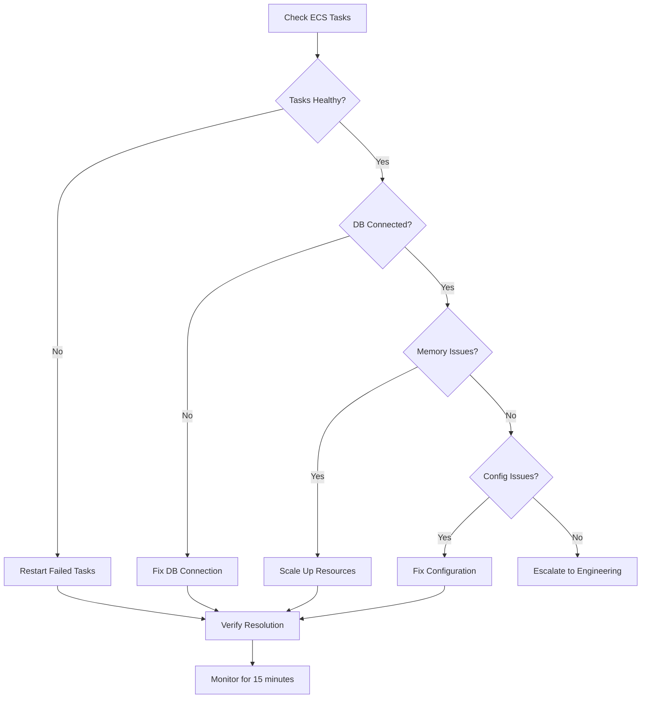
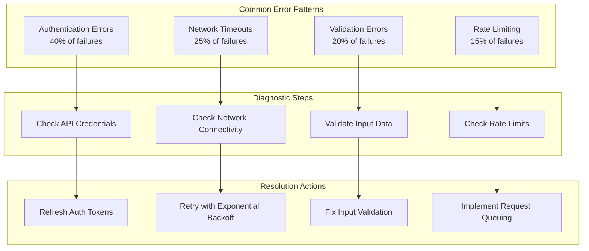
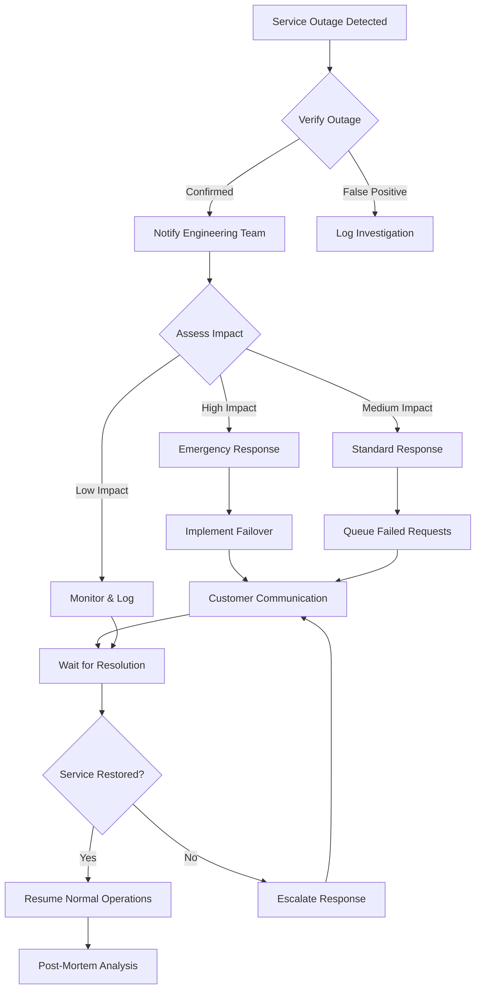
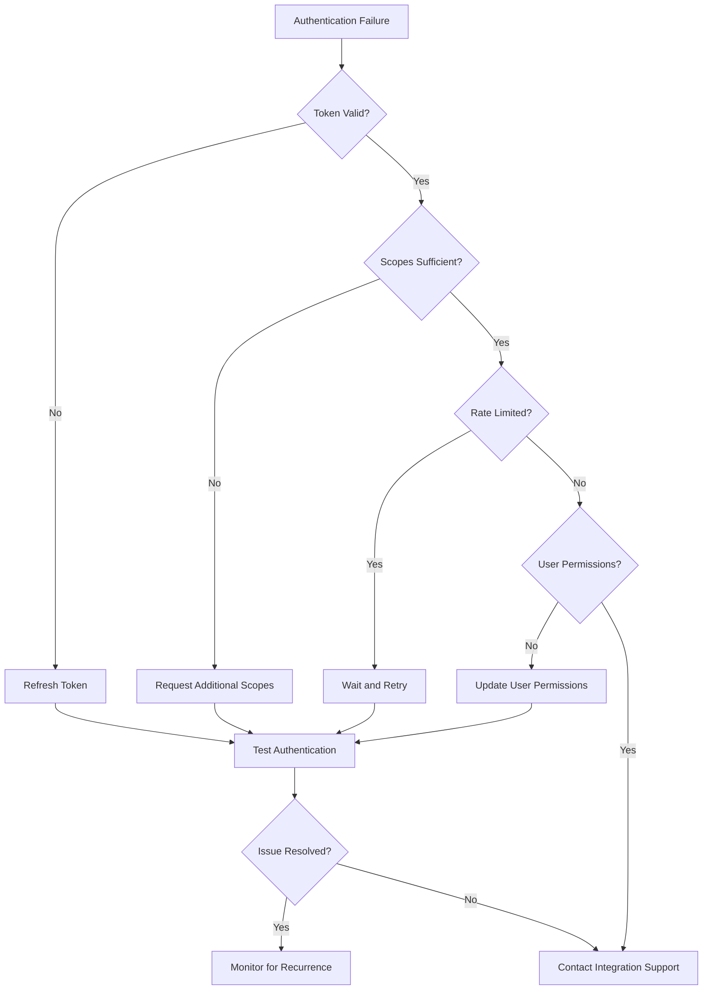

# Troubleshooting Guide & Runbooks

This guide provides systematic troubleshooting procedures for common issues encountered in the Tolstoy platform, organized by severity and frequency to enable rapid issue resolution.

## Quick Reference - Common Issues

### Emergency Response (P0 - Critical)

<CardGroup cols={2}>
  <Card title="🚨 Service Down" icon="exclamation-circle">
    **Immediate Actions (< 5 minutes)**
    1. Check service health endpoints
    2. Review CloudWatch alarms
    3. Verify database connectivity
    4. Check ECS task health
    5. Initiate incident response
    
    **Common Causes**
    - Database connection pool exhaustion
    - Memory leaks causing OOM kills
    - ECS task failures
    - Load balancer misconfiguration
  </Card>
  
  <Card title="🔥 High Error Rates" icon="chart-line">
    **Immediate Actions (< 10 minutes)**
    1. Check error rate dashboards
    2. Review recent deployments
    3. Analyze error logs for patterns
    4. Check external service status
    5. Consider rollback if needed
    
    **Common Causes**
    - External API failures
    - Database query timeouts
    - Configuration errors
    - Memory pressure
  </Card>
</CardGroup>

### High Impact Issues (P1)

<CardGroup cols={2}>
  <Card title="⚠️ Performance Degradation" icon="tachometer-alt">
    **Response Time Target: < 30 minutes**
    
    **Symptoms**
    - API response times > 2 seconds
    - Flow execution delays
    - Database query slowdowns
    - High CPU/memory usage
    
    **Investigation Order**
    1. Database performance metrics
    2. Application server resources
    3. External service latency
    4. Cache hit rates
  </Card>
  
  <Card title="🔄 Flow Execution Issues" icon="cogs">
    **Response Time Target: < 1 hour**
    
    **Symptoms**
    - Executions timing out
    - Steps failing with unclear errors
    - Variable resolution failures
    - Action connectivity issues
    
    **Investigation Order**
    1. Execution logs analysis
    2. Action service health
    3. Integration status
    4. Resource availability
  </Card>
</CardGroup>

## Detailed Troubleshooting Procedures

### 1. Service Health & Availability Issues

#### 1.1 API Service Unresponsive

**Symptoms:**
- Health check endpoints returning 500/503 errors
- Load balancer showing unhealthy targets
- High response times or timeouts

**Investigation Steps:**

<CodeGroup>
```bash Step 1: Check Service Status
#!/bin/bash
echo "🔍 Checking API service health..."

# Check ECS service status
aws ecs describe-services \
  --cluster tolstoy-production \
  --services tolstoy-api \
  --query 'services[0].{Status:status,Running:runningCount,Desired:desiredCount,Tasks:tasks}'

# Check load balancer target health
aws elbv2 describe-target-health \
  --target-group-arn arn:aws:elasticloadbalancing:us-east-1:123456789012:targetgroup/tolstoy-api/1234567890abcdef \
  --query 'TargetHealthDescriptions[*].{Target:Target.Id,Health:TargetHealth.State,Reason:TargetHealth.Reason}'

# Test health endpoint directly
curl -v https://api.tolstoy.com/health
```

```bash Step 2: Check Application Logs
# Get recent application logs
aws logs filter-log-events \
  --log-group-name /ecs/tolstoy-api \
  --start-time $(date -d '10 minutes ago' +%s)000 \
  --filter-pattern 'ERROR' \
  --query 'events[*].[timestamp,message]' \
  --output table

# Check for memory issues
aws logs filter-log-events \
  --log-group-name /ecs/tolstoy-api \
  --start-time $(date -d '30 minutes ago' +%s)000 \
  --filter-pattern '"out of memory"' \
  --query 'events[*].[timestamp,message]'
```

```bash Step 3: Check Infrastructure
# Check ECS task resource utilization
aws cloudwatch get-metric-statistics \
  --namespace AWS/ECS \
  --metric-name CPUUtilization \
  --dimensions Name=ServiceName,Value=tolstoy-api Name=ClusterName,Value=tolstoy-production \
  --start-time $(date -u -d '30 minutes ago' '+%Y-%m-%dT%H:%M:%S') \
  --end-time $(date -u '+%Y-%m-%dT%H:%M:%S') \
  --period 300 \
  --statistics Average,Maximum

# Check database connectivity
psql -h tolstoy-prod-db.cluster-xyz.us-east-1.rds.amazonaws.com -U tolstoy -d tolstoy -c "SELECT 1;"
```
</CodeGroup>

**Resolution Actions:**



#### 1.2 Database Connection Issues

**Symptoms:**
- Connection pool exhaustion errors
- Query timeouts
- "Too many connections" errors
- Slow database responses

**Diagnostic Commands:**

```sql
-- Check current database connections
SELECT 
  datname,
  usename,
  client_addr,
  state,
  COUNT(*) as connection_count
FROM pg_stat_activity 
WHERE datname = 'tolstoy'
GROUP BY datname, usename, client_addr, state
ORDER BY connection_count DESC;

-- Check for long-running queries
SELECT 
  pid,
  now() - pg_stat_activity.query_start AS duration,
  query,
  state,
  wait_event_type,
  wait_event
FROM pg_stat_activity 
WHERE (now() - pg_stat_activity.query_start) > interval '5 minutes'
AND state != 'idle'
ORDER BY duration DESC;

-- Check database locks
SELECT 
  blocked_locks.pid AS blocked_pid,
  blocked_activity.usename AS blocked_user,
  blocking_locks.pid AS blocking_pid,
  blocking_activity.usename AS blocking_user,
  blocked_activity.query AS blocked_statement,
  blocking_activity.query AS blocking_statement
FROM pg_catalog.pg_locks blocked_locks
JOIN pg_catalog.pg_stat_activity blocked_activity ON blocked_activity.pid = blocked_locks.pid
JOIN pg_catalog.pg_locks blocking_locks ON blocking_locks.locktype = blocked_locks.locktype
JOIN pg_catalog.pg_stat_activity blocking_activity ON blocking_activity.pid = blocking_locks.pid
WHERE NOT blocked_locks.granted;
```

**Resolution Steps:**

<CardGroup cols={2}>
  <Card title="Connection Pool Issues" icon="database">
    **Immediate Actions**
    ```bash
    # Restart application to reset pool
    aws ecs update-service \
      --cluster tolstoy-production \
      --service tolstoy-api \
      --force-new-deployment
    
    # Scale up if needed
    aws ecs update-service \
      --cluster tolstoy-production \
      --service tolstoy-api \
      --desired-count 5
    ```
    
    **Configuration Check**
    - Verify connection pool limits
    - Check for connection leaks
    - Review transaction boundaries
  </Card>
  
  <Card title="Query Performance" icon="chart-line">
    **Kill Long Queries**
    ```sql
    -- Kill problematic queries
    SELECT pg_terminate_backend(pid)
    FROM pg_stat_activity
    WHERE (now() - pg_stat_activity.query_start) > interval '10 minutes'
    AND state != 'idle'
    AND pid != pg_backend_pid();
    ```
    
    **Optimization**
    - Add missing indexes
    - Optimize slow queries
    - Consider read replicas
  </Card>
</CardGroup>

### 2. Flow Execution Problems

#### 2.1 Executions Timing Out

**Investigation Process:**

```typescript
// Flow execution diagnostic script
async function diagnoseExecutionTimeouts() {
  const timeoutAnalysis = {
    // Check recent timeouts
    recentTimeouts: await db.query(`
      SELECT 
        flow_id,
        COUNT(*) as timeout_count,
        AVG(duration_ms) as avg_duration,
        array_agg(error_message) as error_messages
      FROM executions 
      WHERE status = 'timeout' 
      AND created_at > NOW() - INTERVAL '1 hour'
      GROUP BY flow_id
      ORDER BY timeout_count DESC
    `),
    
    // Check resource usage during timeouts
    resourceUsage: await cloudWatch.getMetricStatistics({
      Namespace: 'Tolstoy/Executions',
      MetricName: 'MemoryUtilization',
      StartTime: new Date(Date.now() - 3600000),
      EndTime: new Date(),
      Period: 300,
      Statistics: ['Average', 'Maximum']
    }),
    
    // Check external service latency
    externalServiceLatency: await checkExternalServices()
  };
  
  console.log('Timeout Analysis:', timeoutAnalysis);
  return timeoutAnalysis;
}
```

**Common Timeout Causes & Solutions:**

| Cause | Symptoms | Solution |
|-------|----------|----------|
| **Memory Leaks** | Increasing memory usage over time | Restart workers, fix memory leaks |
| **External API Delays** | Timeouts in HTTP actions | Add timeouts, implement retries |
| **Database Lock Contention** | Queries waiting on locks | Optimize queries, reduce lock time |
| **Infinite Loops** | CPU pegged at 100% | Add loop iteration limits |
| **Large Data Processing** | Memory exhaustion errors | Stream processing, chunk data |

#### 2.2 Action Execution Failures

**Error Pattern Analysis:**



**Action-Specific Troubleshooting:**

<CodeGroup>
```javascript Slack Actions
// Common Slack action issues
const troubleshootSlackAction = {
  authenticationErrors: {
    symptoms: ['Invalid token', '401 Unauthorized'],
    checks: [
      'Verify bot token is valid',
      'Check token scopes',
      'Ensure app is installed in workspace'
    ],
    resolution: 'Regenerate bot token and update in secrets manager'
  },
  
  rateLimitErrors: {
    symptoms: ['Rate limited', '429 Too Many Requests'],
    checks: ['Check API call frequency', 'Review rate limit headers'],
    resolution: 'Implement exponential backoff and request queuing'
  },
  
  messagePostingErrors: {
    symptoms: ['Channel not found', 'User not in channel'],
    checks: ['Verify channel exists', 'Check bot permissions'],
    resolution: 'Update channel ID or grant necessary permissions'
  }
};
```

```javascript HTTP Actions
// HTTP action debugging
const troubleshootHTTPAction = {
  connectionTimeouts: {
    symptoms: ['ECONNRESET', 'ETIMEDOUT', 'ECONNREFUSED'],
    checks: [
      'Test endpoint connectivity',
      'Check DNS resolution',
      'Verify firewall rules'
    ],
    resolution: 'Increase timeout, check network connectivity'
  },
  
  sslErrors: {
    symptoms: ['CERT_UNTRUSTED', 'UNABLE_TO_VERIFY_LEAF_SIGNATURE'],
    checks: ['Verify SSL certificate', 'Check certificate chain'],
    resolution: 'Update certificate or disable SSL verification (dev only)'
  },
  
  responseParsingErrors: {
    symptoms: ['Unexpected token', 'Invalid JSON'],
    checks: ['Inspect raw response', 'Check content-type header'],
    resolution: 'Fix response parsing logic or handle different formats'
  }
};
```
</CodeGroup>

### 3. Performance Issues

#### 3.1 High API Response Times

**Performance Investigation Dashboard:**

```typescript
// Performance monitoring queries
const performanceChecklist = {
  // Database performance
  slowQueries: `
    SELECT 
      query,
      calls,
      total_time,
      mean_time,
      rows
    FROM pg_stat_statements 
    WHERE mean_time > 1000
    ORDER BY mean_time DESC
    LIMIT 10;
  `,
  
  // Cache hit rates
  cacheMetrics: await redis.info('stats'),
  
  // Memory usage patterns
  memoryProfile: await getMemoryUsage(),
  
  // External service latency
  externalLatency: await measureExternalServices()
};
```

**Step-by-Step Performance Optimization:**

1. **Identify Bottlenecks**
```bash
# Check top slow endpoints
aws logs insights start-query \
  --log-group-name '/ecs/tolstoy-api' \
  --start-time $(date -d '1 hour ago' +%s) \
  --end-time $(date +%s) \
  --query-string '
    fields @timestamp, @message
    | filter @message like /response_time/
    | stats avg(response_time) as avg_time by endpoint
    | sort avg_time desc
    | limit 10
  '
```

2. **Database Optimization**
```sql
-- Find missing indexes
SELECT 
  schemaname,
  tablename,
  attname,
  n_distinct,
  correlation
FROM pg_stats
WHERE schemaname = 'public'
AND n_distinct > 100
AND correlation < 0.1;

-- Check index usage
SELECT 
  schemaname,
  tablename,
  indexname,
  idx_scan,
  idx_tup_read,
  idx_tup_fetch
FROM pg_stat_user_indexes
WHERE idx_scan = 0;
```

3. **Application-Level Fixes**
```typescript
// Common N+1 query fixes
class OptimizedFlowService {
  async getFlowsWithStats(orgId: string): Promise<FlowWithStats[]> {
    // ❌ Bad: N+1 queries
    // const flows = await this.getFlows(orgId);
    // for (const flow of flows) {
    //   flow.stats = await this.getFlowStats(flow.id);
    // }
    
    // ✅ Good: Single query with JOIN
    return await this.repository
      .createQueryBuilder('flow')
      .leftJoinAndSelect(
        subQuery => subQuery
          .select(['flowId', 'COUNT(*) as executions', 'AVG(duration) as avgDuration'])
          .from(ExecutionEntity, 'e')
          .groupBy('flowId'),
        'stats',
        'stats.flowId = flow.id'
      )
      .where('flow.orgId = :orgId', { orgId })
      .getMany();
  }
}
```

#### 3.2 Memory Issues

**Memory Leak Detection:**

<CodeGroup>
```bash Memory Analysis Commands
# Monitor memory usage over time
watch -n 5 'ps aux | grep node | grep -v grep | awk "{print \$6}" | awk "{sum += \$1} END {print \"Total Memory: \" sum/1024 \"MB\"}"'

# Check Node.js heap usage
curl -s http://localhost:3000/metrics | grep nodejs_heap

# Find memory-intensive processes
ps aux --sort=-%mem | head -10

# Check for memory fragmentation
cat /proc/meminfo | grep -E "(MemTotal|MemFree|MemAvailable|Cached|Buffers)"
```

```typescript Memory Profiling Code
// Memory usage monitoring
class MemoryProfiler {
  private static readonly CHECK_INTERVAL = 30000; // 30 seconds
  
  static startMonitoring() {
    setInterval(() => {
      const usage = process.memoryUsage();
      const heapUsedMB = usage.heapUsed / 1024 / 1024;
      const heapTotalMB = usage.heapTotal / 1024 / 1024;
      const externalMB = usage.external / 1024 / 1024;
      
      console.log(`Memory Usage - Heap: ${heapUsedMB.toFixed(2)}MB/${heapTotalMB.toFixed(2)}MB, External: ${externalMB.toFixed(2)}MB`);
      
      // Alert if memory usage is high
      if (heapUsedMB > 1000) { // 1GB threshold
        console.warn('🚨 High memory usage detected!');
        this.generateHeapSnapshot();
      }
    }, this.CHECK_INTERVAL);
  }
  
  static generateHeapSnapshot() {
    const v8 = require('v8');
    const fs = require('fs');
    const filename = `heap-snapshot-${Date.now()}.heapsnapshot`;
    const snapshot = v8.writeHeapSnapshot(filename);
    console.log(`Heap snapshot written to ${filename}`);
  }
}
```
</CodeGroup>

**Memory Issue Resolution:**

| Issue Type | Symptoms | Investigation | Resolution |
|------------|----------|---------------|------------|
| **Memory Leaks** | Steadily increasing memory | Heap snapshots, profiling | Fix unreferenced objects |
| **Large Object Retention** | Sudden memory spikes | Object size analysis | Implement streaming |
| **Event Listener Leaks** | Memory growth with activity | Event listener audit | Remove listeners properly |
| **Cache Bloat** | Memory growth over time | Cache size monitoring | Implement TTL, LRU eviction |

### 4. Integration Issues

#### 4.1 Third-Party Service Outages

**Service Status Monitoring:**

```typescript
// External service health checker
class ServiceStatusMonitor {
  private readonly services = [
    { name: 'Slack', url: 'https://status.slack.com/api/current', parser: 'slack' },
    { name: 'GitHub', url: 'https://www.githubstatus.com/api/summary.json', parser: 'github' },
    { name: 'Salesforce', url: 'https://status.salesforce.com/api/summary.json', parser: 'salesforce' }
  ];
  
  async checkAllServices(): Promise<ServiceStatus[]> {
    const statusChecks = this.services.map(async service => {
      try {
        const response = await fetch(service.url, { timeout: 5000 });
        const data = await response.json();
        return {
          service: service.name,
          status: this.parseStatus(data, service.parser),
          lastChecked: new Date().toISOString()
        };
      } catch (error) {
        return {
          service: service.name,
          status: 'error',
          error: error.message,
          lastChecked: new Date().toISOString()
        };
      }
    });
    
    return Promise.all(statusChecks);
  }
  
  private parseStatus(data: any, parser: string): string {
    switch (parser) {
      case 'slack':
        return data.status === 'ok' ? 'operational' : 'degraded';
      case 'github':
        return data.status.description.toLowerCase();
      case 'salesforce':
        return data.status.description.toLowerCase();
      default:
        return 'unknown';
    }
  }
}
```

**Outage Response Procedures:**



#### 4.2 Authentication & Authorization Failures

**Auth Issue Diagnostic Tree:**



## Emergency Procedures

### Incident Response Checklist

#### Severity 1 (Critical) - Service Down

**First 5 Minutes:**
- [ ] Acknowledge the incident in PagerDuty
- [ ] Post initial update in #incidents Slack channel
- [ ] Check system health dashboard
- [ ] Identify blast radius (affected customers/features)
- [ ] Escalate to on-call engineering manager if needed

**First 15 Minutes:**
- [ ] Start incident war room
- [ ] Post customer-facing status update
- [ ] Implement immediate mitigation if available
- [ ] Begin root cause investigation
- [ ] Assign dedicated communication role

**First 30 Minutes:**
- [ ] Provide detailed status update
- [ ] Execute rollback plan if applicable
- [ ] Engage additional engineering resources
- [ ] Update customer support team
- [ ] Document timeline and actions taken

#### Rollback Procedures

<CodeGroup>
```bash Emergency Rollback
#!/bin/bash
# Emergency rollback script - USE WITH CAUTION

echo "🚨 EMERGENCY ROLLBACK INITIATED"
echo "Current time: $(date)"

# Confirm rollback intention
read -p "Are you sure you want to rollback to previous version? (yes/no): " confirm
if [ "$confirm" != "yes" ]; then
    echo "Rollback cancelled"
    exit 1
fi

# Get previous task definition
CURRENT_TASK_DEF=$(aws ecs describe-services \
    --cluster tolstoy-production \
    --services tolstoy-api \
    --query 'services[0].taskDefinition' \
    --output text)

REVISION_NUM=$(echo $CURRENT_TASK_DEF | grep -o '[0-9]*$')
PREVIOUS_REVISION=$((REVISION_NUM - 1))

echo "Rolling back from revision $REVISION_NUM to $PREVIOUS_REVISION"

# Execute rollback
aws ecs update-service \
    --cluster tolstoy-production \
    --service tolstoy-api \
    --task-definition tolstoy-api:$PREVIOUS_REVISION

# Wait for rollback to complete
aws ecs wait services-stable \
    --cluster tolstoy-production \
    --services tolstoy-api

echo "✅ Rollback completed"
```

```bash Database Rollback
#!/bin/bash
# Database migration rollback

echo "🗄️ DATABASE ROLLBACK"

# Create backup before rollback
pg_dump -h $DB_HOST -U $DB_USER -d tolstoy > "backup-before-rollback-$(date +%Y%m%d-%H%M%S).sql"

# Get last migration
LAST_MIGRATION=$(npm run migration:show | grep "Migration:" | tail -1 | awk '{print $2}')

echo "Rolling back migration: $LAST_MIGRATION"

# Execute rollback
npm run migration:revert

echo "✅ Database rollback completed"
```
</CodeGroup>

This comprehensive troubleshooting guide provides engineering teams with systematic approaches to diagnosing and resolving issues quickly, minimizing customer impact and system downtime.

---

*This troubleshooting guide should be regularly updated based on new issues encountered and lessons learned from incident responses to ensure it remains current and effective.*