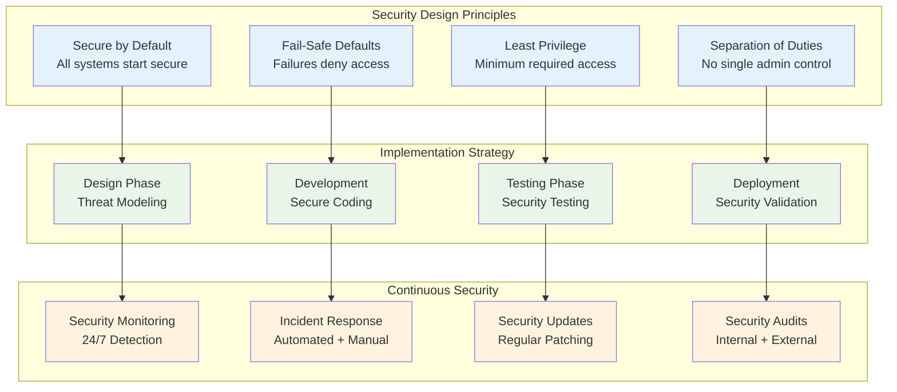
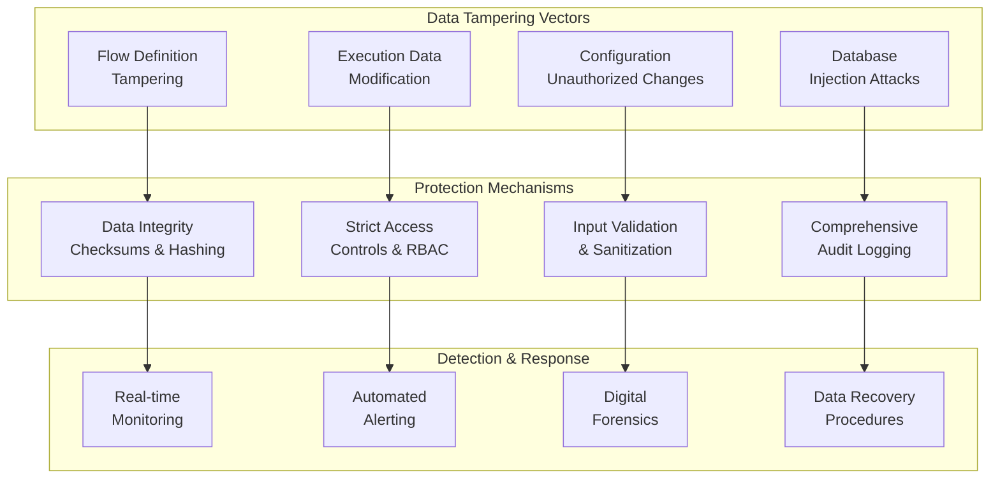
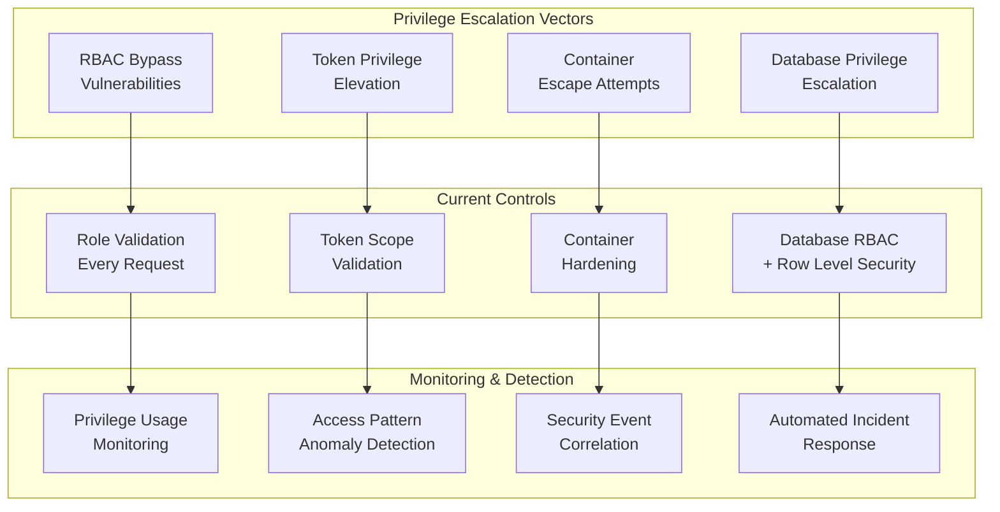
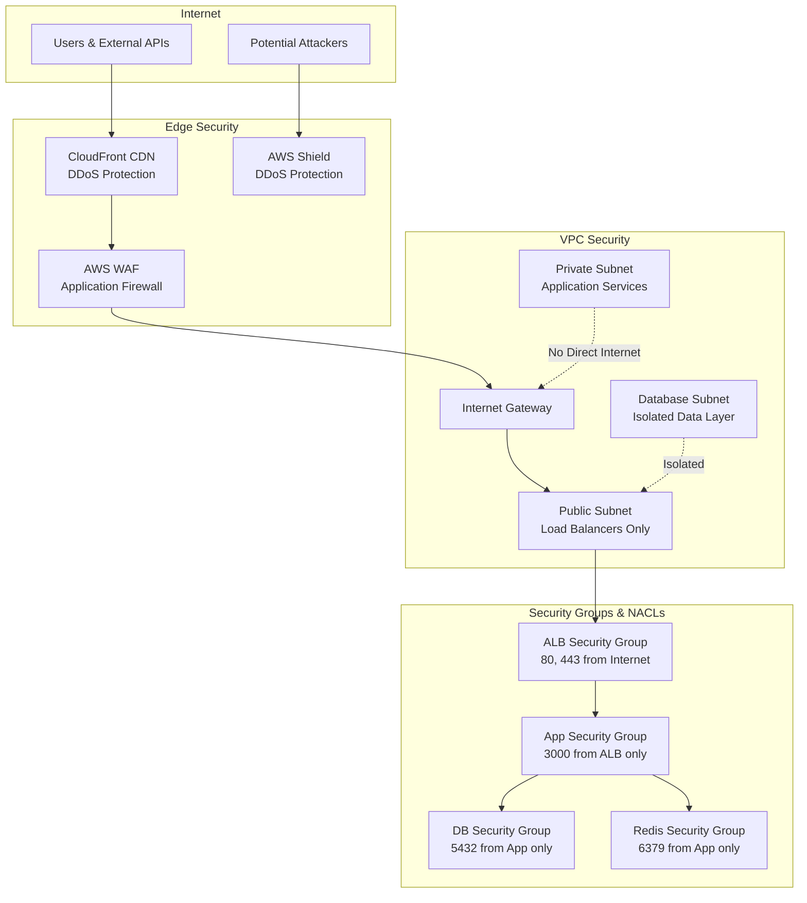
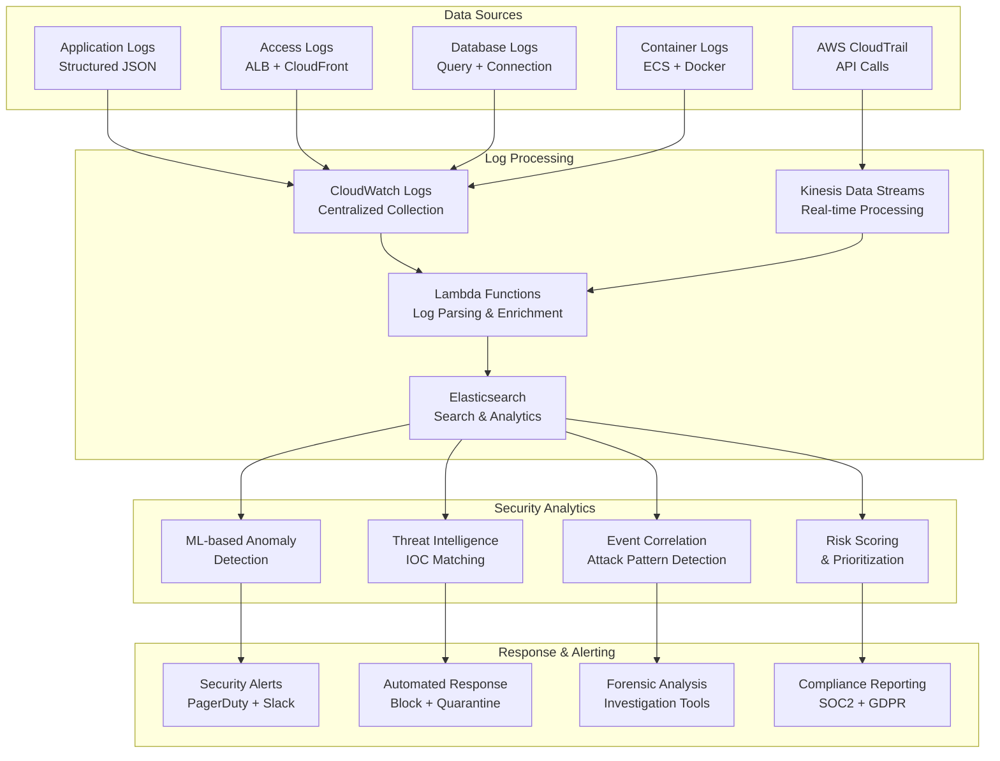

# Security Architecture & Threat Model

This document provides a comprehensive overview of Tolstoy's security architecture, threat model, security controls, and defense-in-depth strategies to protect customer data and platform integrity.

## Security Philosophy

### Core Security Principles

<CardGroup cols={2}>
  <Card title="Defense in Depth" icon="shield-alt">
    **Layered Security Approach**
    - Multiple security controls at each layer
    - No single point of failure
    - Redundant security measures
    - Fail-safe defaults throughout
    
    **Implementation**
    - Network security (WAF, VPC, Security Groups)
    - Application security (Authentication, Authorization)
    - Data security (Encryption, Access Controls)
    - Infrastructure security (Container isolation, IAM)
  </Card>
  
  <Card title="Zero Trust Architecture" icon="lock">
    **Never Trust, Always Verify**
    - Verify every request and user
    - Least privilege access model
    - Continuous authentication and authorization
    - Microsegmentation and isolation
    
    **Implementation**
    - Multi-factor authentication required
    - API key validation on every request
    - Service-to-service authentication
    - Regular permission audits and reviews
  </Card>
</CardGroup>

### Security by Design



## Threat Model Analysis

### STRIDE Threat Analysis

#### 1. Spoofing Threats

<CardGroup cols={2}>
  <Card title="Identity Spoofing" icon="user-secret">
    **Threat Scenarios**
    - API key theft and misuse
    - JWT token forging attempts
    - User impersonation attacks
    - Service account compromise
    
    **Risk Rating**: High
    **Likelihood**: Medium
    **Impact**: Critical
  </Card>
  
  <Card title="Mitigations Implemented" icon="shield-check">
    **Technical Controls**
    - Strong API key generation (256-bit entropy)
    - JWT signing with RS256 + short expiration
    - Multi-factor authentication for admin access
    - Regular key rotation (90 days)
    - Anomaly detection for unusual access patterns
    
    **Process Controls**
    - API key management procedures
    - Access review workflows
    - Security awareness training
  </Card>
</CardGroup>

#### 2. Tampering Threats



#### 3. Information Disclosure Threats

**High-Risk Data Categories:**
```typescript
// Sensitive data classification
const DataClassification = {
  CRITICAL: {
    description: 'Data that could cause severe harm if disclosed',
    examples: [
      'Customer API keys and secrets',
      'Database credentials',
      'Encryption keys',
      'Personal identification information'
    ],
    protection: 'End-to-end encryption + access logging + need-to-know'
  },
  
  SENSITIVE: {
    description: 'Data requiring special handling and protection',
    examples: [
      'Customer workflow definitions',
      'Execution logs with business data',
      'User email addresses',
      'Organization membership'
    ],
    protection: 'Encryption at rest + access controls + audit logging'
  },
  
  INTERNAL: {
    description: 'Internal business data not for public disclosure',
    examples: [
      'System performance metrics',
      'Error logs and debugging info',
      'Internal configuration settings'
    ],
    protection: 'Access controls + secure transmission'
  },
  
  PUBLIC: {
    description: 'Data safe for public disclosure',
    examples: [
      'Public API documentation',
      'Marketing materials',
      'Public pricing information'
    ],
    protection: 'Standard web security practices'
  }
} as const;
```

#### 4. Denial of Service Threats

| Attack Vector | Risk Level | Current Protection | Additional Measures Needed |
|---------------|------------|-------------------|---------------------------|
| **API Rate Limiting Bypass** | High | Redis-based rate limiting | Advanced bot detection |
| **Resource Exhaustion** | High | ECS auto-scaling + limits | Resource quotas per org |
| **Database Connection Flooding** | Medium | Connection pooling | Circuit breakers |
| **Large File Upload DoS** | Medium | 100MB file size limit | Streaming validation |
| **Complex Query DoS** | Medium | Query timeout limits | Query complexity analysis |
| **Distributed DoS** | High | AWS Shield Standard | AWS Shield Advanced + WAF rules |

#### 5. Elevation of Privilege Threats



## Security Architecture Layers

### 1. Network Security Layer

#### AWS Network Architecture



#### Network Security Controls

```yaml
# Security Group Rules (Infrastructure as Code)
security_groups:
  application_load_balancer:
    ingress:
      - protocol: TCP
        port: 443
        source: "0.0.0.0/0"
        description: "HTTPS from internet"
      - protocol: TCP
        port: 80
        source: "0.0.0.0/0" 
        description: "HTTP redirect to HTTPS"
    egress:
      - protocol: TCP
        port: 3000
        destination: !Ref ApplicationSecurityGroup
        description: "Forward to application"
        
  application_servers:
    ingress:
      - protocol: TCP
        port: 3000
        source: !Ref LoadBalancerSecurityGroup
        description: "HTTP from load balancer only"
    egress:
      - protocol: TCP
        port: 5432
        destination: !Ref DatabaseSecurityGroup
        description: "PostgreSQL database access"
      - protocol: TCP
        port: 6379
        destination: !Ref RedisSecurityGroup
        description: "Redis cache access"
      - protocol: TCP
        port: 443
        destination: "0.0.0.0/0"
        description: "HTTPS to external APIs"
        
  database:
    ingress:
      - protocol: TCP
        port: 5432
        source: !Ref ApplicationSecurityGroup
        description: "PostgreSQL from application only"
    egress: []  # No outbound access needed
```

### 2. Application Security Layer

#### Authentication Architecture

```typescript
// Multi-layered authentication system
@Injectable()
export class AuthenticationService {
  constructor(
    private readonly jwtService: JwtService,
    private readonly apiKeyService: ApiKeyService,
    private readonly mfaService: MfaService,
    private readonly auditLogger: AuditLogger
  ) {}

  async authenticateRequest(request: AuthRequest): Promise<AuthResult> {
    const startTime = Date.now();
    
    try {
      // 1. Primary authentication
      const primaryAuth = await this.performPrimaryAuth(request);
      if (!primaryAuth.success) {
        await this.logAuthFailure('primary_auth_failed', request, primaryAuth.error);
        return primaryAuth;
      }

      // 2. Multi-factor authentication (if required)
      if (primaryAuth.user.mfaRequired) {
        const mfaResult = await this.verifyMfa(request.mfaToken, primaryAuth.user);
        if (!mfaResult.success) {
          await this.logAuthFailure('mfa_failed', request, mfaResult.error);
          return mfaResult;
        }
      }

      // 3. Additional security checks
      const securityChecks = await this.performSecurityChecks(primaryAuth.user, request);
      if (!securityChecks.success) {
        await this.logAuthFailure('security_check_failed', request, securityChecks.error);
        return securityChecks;
      }

      // 4. Generate secure session
      const session = await this.createSecureSession(primaryAuth.user, request);

      await this.logAuthSuccess(primaryAuth.user, request, Date.now() - startTime);
      
      return {
        success: true,
        user: primaryAuth.user,
        session,
        permissions: await this.getUserPermissions(primaryAuth.user)
      };

    } catch (error) {
      await this.logAuthError('authentication_error', request, error);
      throw new AuthenticationError('Authentication failed', error);
    }
  }

  private async performPrimaryAuth(request: AuthRequest): Promise<AuthResult> {
    if (request.apiKey) {
      return await this.authenticateApiKey(request.apiKey, request);
    } else if (request.bearerToken) {
      return await this.authenticateJwtToken(request.bearerToken, request);
    } else {
      return { success: false, error: 'No valid authentication method provided' };
    }
  }

  private async authenticateApiKey(
    apiKey: string, 
    request: AuthRequest
  ): Promise<AuthResult> {
    // 1. Rate limit API key attempts
    const rateLimitResult = await this.checkApiKeyRateLimit(apiKey, request.ip);
    if (!rateLimitResult.allowed) {
      return { 
        success: false, 
        error: 'Rate limit exceeded',
        rateLimitInfo: rateLimitResult
      };
    }

    // 2. Validate API key format and extract metadata
    const keyValidation = this.validateApiKeyFormat(apiKey);
    if (!keyValidation.valid) {
      return { success: false, error: 'Invalid API key format' };
    }

    // 3. Lookup API key in database (using hash)
    const keyHash = await this.hashApiKey(apiKey);
    const apiKeyRecord = await this.apiKeyService.findByHash(keyHash);
    
    if (!apiKeyRecord || !apiKeyRecord.active) {
      return { success: false, error: 'Invalid or inactive API key' };
    }

    // 4. Check API key expiration
    if (apiKeyRecord.expiresAt && new Date() > apiKeyRecord.expiresAt) {
      await this.apiKeyService.markExpired(apiKeyRecord.id);
      return { success: false, error: 'API key expired' };
    }

    // 5. Update last used timestamp
    await this.apiKeyService.updateLastUsed(apiKeyRecord.id, request.ip);

    // 6. Load user and organization context
    const user = await this.loadUserContext(apiKeyRecord.userId, apiKeyRecord.orgId);
    
    return { success: true, user, authMethod: 'api_key' };
  }

  private async performSecurityChecks(
    user: User, 
    request: AuthRequest
  ): Promise<SecurityCheckResult> {
    const checks = await Promise.allSettled([
      this.checkGeolocationAnomaly(user, request.ip),
      this.checkDeviceFingerprint(user, request.userAgent),
      this.checkLoginFrequency(user.id),
      this.checkSuspiciousActivity(user.id, request.ip)
    ]);

    const failures = checks
      .map((check, index) => ({ check, index }))
      .filter(({ check }) => check.status === 'rejected')
      .map(({ check, index }) => ({
        checkName: ['geolocation', 'device', 'frequency', 'activity'][index],
        error: check.status === 'rejected' ? check.reason : null
      }));

    if (failures.length > 0) {
      // Log security check failures but don't always block
      await this.logSecurityCheckFailures(user, request, failures);
      
      // Only block if multiple high-risk failures
      const highRiskFailures = failures.filter(f => 
        ['geolocation', 'activity'].includes(f.checkName)
      );
      
      if (highRiskFailures.length >= 2) {
        return { 
          success: false, 
          error: 'Multiple security check failures',
          requiresReview: true
        };
      }
    }

    return { success: true };
  }
}
```

#### Authorization Framework

```typescript
// Role-Based Access Control (RBAC) with Attribute-Based extensions
@Injectable()
export class AuthorizationService {
  constructor(
    private readonly rbacEngine: RbacEngine,
    private readonly policyEngine: PolicyEngine,
    private readonly auditLogger: AuditLogger
  ) {}

  async authorizeRequest(
    user: User,
    resource: string,
    action: string,
    context: AuthzContext = {}
  ): Promise<AuthzResult> {
    try {
      // 1. Load user roles and permissions
      const userRoles = await this.rbacEngine.getUserRoles(user.id, user.orgId);
      const permissions = await this.rbacEngine.getPermissionsForRoles(userRoles);

      // 2. Check basic RBAC permissions
      const hasPermission = permissions.some(permission =>
        permission.resource === resource && permission.actions.includes(action)
      );

      if (!hasPermission) {
        await this.logAuthzFailure('rbac_permission_denied', user, resource, action);
        return { authorized: false, reason: 'Insufficient permissions' };
      }

      // 3. Evaluate dynamic policies (ABAC)
      const policyResult = await this.evaluatePolicies(user, resource, action, context);
      if (!policyResult.allowed) {
        await this.logAuthzFailure('policy_violation', user, resource, action, policyResult);
        return { authorized: false, reason: policyResult.reason };
      }

      // 4. Apply resource-specific constraints
      const constraintResult = await this.checkResourceConstraints(
        user, resource, action, context
      );
      
      if (!constraintResult.allowed) {
        await this.logAuthzFailure('constraint_violation', user, resource, action, constraintResult);
        return { authorized: false, reason: constraintResult.reason };
      }

      await this.logAuthzSuccess(user, resource, action, context);
      return { authorized: true };

    } catch (error) {
      await this.logAuthzError('authorization_error', user, resource, action, error);
      // Fail secure - deny access on error
      return { authorized: false, reason: 'Authorization system error' };
    }
  }

  private async evaluatePolicies(
    user: User,
    resource: string,
    action: string,
    context: AuthzContext
  ): Promise<PolicyResult> {
    const policies = await this.policyEngine.getPoliciesForResource(resource);
    
    for (const policy of policies) {
      const result = await this.policyEngine.evaluate(policy, {
        user,
        resource,
        action,
        context,
        time: new Date(),
        ip: context.ip,
        userAgent: context.userAgent
      });

      if (result.effect === 'DENY') {
        return { allowed: false, reason: result.reason };
      }
    }

    return { allowed: true };
  }

  // Example policy definitions
  private readonly organizationIsolationPolicy = {
    name: 'organization_isolation',
    description: 'Ensure users can only access resources within their organization',
    rules: [
      {
        effect: 'DENY',
        condition: 'resource.orgId != user.orgId',
        reason: 'Cross-organization access denied'
      }
    ]
  };

  private readonly workingHoursPolicy = {
    name: 'working_hours_restriction',
    description: 'Restrict sensitive operations to working hours',
    rules: [
      {
        effect: 'DENY',
        condition: 'action in ["delete", "modify_permissions"] && time.hour not in [9..17]',
        reason: 'Sensitive operations restricted to working hours'
      }
    ]
  };
}
```

### 3. Data Protection Layer

#### Encryption Strategy

```typescript
// Comprehensive encryption service
@Injectable()
export class EncryptionService {
  private readonly kmsClient: KMSClient;
  private readonly fieldEncryption: FieldEncryptionService;
  
  constructor() {
    this.kmsClient = new KMSClient({ region: 'us-east-1' });
    this.fieldEncryption = new FieldEncryptionService();
  }

  // Application-level encryption for sensitive fields
  async encryptSensitiveField(
    plaintext: string,
    context: EncryptionContext
  ): Promise<EncryptedField> {
    const keyId = this.getKeyIdForContext(context);
    
    // Generate data encryption key (DEK) using KMS
    const dekResult = await this.kmsClient.generateDataKey({
      KeyId: keyId,
      KeySpec: 'AES_256',
      EncryptionContext: {
        purpose: context.purpose,
        resourceType: context.resourceType,
        orgId: context.orgId
      }
    });

    // Encrypt data with DEK
    const cipher = crypto.createCipher('aes-256-gcm', dekResult.Plaintext);
    const encrypted = Buffer.concat([
      cipher.update(plaintext, 'utf8'),
      cipher.final()
    ]);

    const authTag = cipher.getAuthTag();

    // Return encrypted data with encrypted DEK
    return {
      encryptedData: encrypted.toString('base64'),
      encryptedKey: dekResult.CiphertextBlob.toString('base64'),
      authTag: authTag.toString('base64'),
      algorithm: 'AES-256-GCM',
      keyId: keyId,
      context: context
    };
  }

  async decryptSensitiveField(
    encryptedField: EncryptedField
  ): Promise<string> {
    // Decrypt the data encryption key using KMS
    const dekResult = await this.kmsClient.decrypt({
      CiphertextBlob: Buffer.from(encryptedField.encryptedKey, 'base64'),
      EncryptionContext: {
        purpose: encryptedField.context.purpose,
        resourceType: encryptedField.context.resourceType,
        orgId: encryptedField.context.orgId
      }
    });

    // Decrypt data using DEK
    const decipher = crypto.createDecipher('aes-256-gcm', dekResult.Plaintext);
    decipher.setAuthTag(Buffer.from(encryptedField.authTag, 'base64'));
    
    const decrypted = Buffer.concat([
      decipher.update(Buffer.from(encryptedField.encryptedData, 'base64')),
      decipher.final()
    ]);

    return decrypted.toString('utf8');
  }

  // Field-level encryption for database storage
  async encryptDatabaseField(
    tableName: string,
    fieldName: string,
    value: string,
    orgId: string
  ): Promise<string> {
    return await this.fieldEncryption.encrypt(value, {
      table: tableName,
      field: fieldName,
      orgId: orgId,
      algorithm: 'AES-256-GCM'
    });
  }

  // Secure key rotation
  async rotateEncryptionKeys(keyId: string): Promise<KeyRotationResult> {
    // 1. Create new key version
    const newKeyResult = await this.kmsClient.createKey({
      Description: `Rotated key for ${keyId}`,
      Usage: 'ENCRYPT_DECRYPT'
    });

    // 2. Update key alias to point to new key
    await this.kmsClient.updateAlias({
      AliasName: keyId,
      TargetKeyId: newKeyResult.KeyMetadata.KeyId
    });

    // 3. Schedule re-encryption of data (async process)
    await this.scheduleDataReEncryption(keyId, newKeyResult.KeyMetadata.KeyId);

    return {
      oldKeyId: keyId,
      newKeyId: newKeyResult.KeyMetadata.KeyId,
      rotationDate: new Date(),
      reEncryptionScheduled: true
    };
  }
}
```

#### Data Loss Prevention (DLP)

```typescript
// Data Loss Prevention service
@Injectable()
export class DataLossPreventionService {
  private readonly sensitiveDataPatterns = {
    creditCard: /\b\d{4}[\s\-]?\d{4}[\s\-]?\d{4}[\s\-]?\d{4}\b/g,
    socialSecurity: /\b\d{3}[\s\-]?\d{2}[\s\-]?\d{4}\b/g,
    email: /\b[A-Za-z0-9._%+-]+@[A-Za-z0-9.-]+\.[A-Z|a-z]{2,}\b/g,
    phoneNumber: /\b\d{3}[\s\-]?\d{3}[\s\-]?\d{4}\b/g,
    apiKey: /\b[A-Za-z0-9]{32,}\b/g
  };

  async scanForSensitiveData(
    content: string,
    context: ScanContext
  ): Promise<DLPScanResult> {
    const detections: SensitiveDataDetection[] = [];

    for (const [dataType, pattern] of Object.entries(this.sensitiveDataPatterns)) {
      const matches = content.match(pattern);
      if (matches) {
        detections.push({
          dataType,
          count: matches.length,
          positions: this.findMatchPositions(content, pattern),
          severity: this.getSeverityForDataType(dataType),
          samples: matches.slice(0, 3).map(this.maskSensitiveValue) // Only first 3, masked
        });
      }
    }

    // Check against custom organization rules
    const customDetections = await this.scanCustomPatterns(content, context.orgId);
    detections.push(...customDetections);

    const riskScore = this.calculateRiskScore(detections);
    const action = this.determineAction(riskScore, context);

    await this.logDLPScan(context, detections, riskScore, action);

    return {
      riskScore,
      detections,
      recommendedAction: action,
      requiresReview: riskScore >= 7, // High risk threshold
      timestamp: new Date().toISOString()
    };
  }

  async preventDataExfiltration(
    data: any,
    destination: ExfiltrationDestination,
    user: User
  ): Promise<ExfiltrationResult> {
    // 1. Scan data for sensitive content
    const scanResult = await this.scanForSensitiveData(
      JSON.stringify(data),
      { 
        orgId: user.orgId, 
        userId: user.id, 
        operation: 'export',
        destination: destination.type 
      }
    );

    // 2. Check organization data export policies
    const policyResult = await this.checkExportPolicies(
      user.orgId, 
      scanResult, 
      destination
    );

    if (!policyResult.allowed) {
      await this.logDataExfiltratio­nBlocked(user, destination, scanResult);
      return {
        allowed: false,
        reason: policyResult.reason,
        riskScore: scanResult.riskScore,
        sensitiveDataFound: scanResult.detections
      };
    }

    // 3. Apply data sanitization if required
    let sanitizedData = data;
    if (policyResult.requiresSanitization) {
      sanitizedData = await this.sanitizeSensitiveData(data, scanResult.detections);
    }

    await this.logDataExport(user, destination, scanResult);

    return {
      allowed: true,
      data: sanitizedData,
      riskScore: scanResult.riskScore,
      sanitizationApplied: policyResult.requiresSanitization
    };
  }

  private maskSensitiveValue(value: string): string {
    if (value.length <= 4) return '*'.repeat(value.length);
    return value.slice(0, 2) + '*'.repeat(value.length - 4) + value.slice(-2);
  }
}
```

## Security Monitoring & Incident Response

### Security Information and Event Management (SIEM)



### Automated Incident Response

```typescript
// Automated security incident response
@Injectable()
export class SecurityIncidentResponse {
  constructor(
    private readonly alertingService: AlertingService,
    private readonly forensicsService: ForensicsService,
    private readonly quarantineService: QuarantineService
  ) {}

  async handleSecurityEvent(event: SecurityEvent): Promise<ResponseResult> {
    const startTime = Date.now();
    
    try {
      // 1. Assess event severity and type
      const assessment = await this.assessThreat(event);
      
      // 2. Trigger immediate response based on severity
      const immediateResponse = await this.executeImmediateResponse(event, assessment);
      
      // 3. Collect forensic evidence
      const forensicData = await this.collectForensicEvidence(event);
      
      // 4. Notify security team
      await this.notifySecurityTeam(event, assessment, immediateResponse);
      
      // 5. Create incident record
      const incident = await this.createIncidentRecord(
        event, assessment, immediateResponse, forensicData
      );
      
      // 6. Schedule follow-up actions
      await this.scheduleFollowUpActions(incident);
      
      return {
        success: true,
        incidentId: incident.id,
        responseTime: Date.now() - startTime,
        actionseTaken: immediateResponse.actions
      };
      
    } catch (error) {
      await this.handleResponseFailure(event, error);
      throw error;
    }
  }

  private async executeImmediateResponse(
    event: SecurityEvent,
    assessment: ThreatAssessment
  ): Promise<ImmediateResponse> {
    const actions: string[] = [];

    switch (assessment.severity) {
      case 'CRITICAL':
        // Immediate containment for critical threats
        if (event.type === 'BRUTE_FORCE_ATTACK') {
          await this.blockIPAddress(event.sourceIP, '24h');
          actions.push('IP_BLOCKED');
        }
        
        if (event.type === 'PRIVILEGE_ESCALATION') {
          await this.suspendUserAccount(event.userId);
          actions.push('ACCOUNT_SUSPENDED');
        }
        
        if (event.type === 'DATA_EXFILTRATION') {
          await this.quarantineService.quarantineUser(event.userId);
          await this.blockDataExport(event.orgId);
          actions.push('USER_QUARANTINED', 'EXPORT_BLOCKED');
        }
        break;

      case 'HIGH':
        // Rate limiting and enhanced monitoring
        await this.enhanceMonitoring(event.sourceIP, event.userId);
        await this.applyStrictRateLimit(event.sourceIP);
        actions.push('MONITORING_ENHANCED', 'RATE_LIMITED');
        break;

      case 'MEDIUM':
        // Logging and monitoring
        await this.logSecurityEvent(event, assessment);
        actions.push('EVENT_LOGGED');
        break;
    }

    return {
      severity: assessment.severity,
      actions,
      timestamp: new Date().toISOString(),
      automated: true
    };
  }

  private async assessThreat(event: SecurityEvent): Promise<ThreatAssessment> {
    const factors = {
      eventType: this.getEventTypeSeverity(event.type),
      frequency: await this.calculateEventFrequency(event),
      userRisk: await this.getUserRiskScore(event.userId),
      geolocation: await this.assessGeolocationRisk(event.sourceIP),
      timeAnomaly: this.assessTimeAnomaly(event.timestamp),
      dataAccessed: await this.assessDataSensitivity(event.resourcesAccessed)
    };

    const severity = this.calculateOverallSeverity(factors);
    const confidence = this.calculateConfidence(factors);

    return {
      severity,
      confidence,
      factors,
      riskScore: this.calculateRiskScore(factors),
      recommendedActions: this.generateRecommendations(factors)
    };
  }

  // Security event patterns
  private readonly securityPatterns = {
    BRUTE_FORCE: {
      pattern: 'failed_login_attempts > 10 in 5 minutes',
      severity: 'HIGH',
      response: ['block_ip', 'alert_security_team']
    },
    
    PRIVILEGE_ESCALATION: {
      pattern: 'role_change + admin_action within 1 minute',
      severity: 'CRITICAL',
      response: ['suspend_account', 'forensic_analysis', 'immediate_alert']
    },
    
    DATA_EXFILTRATION: {
      pattern: 'large_data_export + unusual_time + unusual_location',
      severity: 'CRITICAL',
      response: ['quarantine_user', 'block_export', 'executive_alert']
    },
    
    ANOMALOUS_API_USAGE: {
      pattern: 'api_calls > normal_baseline * 10',
      severity: 'MEDIUM',
      response: ['rate_limit', 'enhanced_monitoring']
    }
  };
}
```

## Compliance & Audit

### Compliance Framework

| Compliance Standard | Current Status | Requirements Met | Gaps | Target Completion |
|-------------------|---------------|------------------|------|------------------|
| **SOC 2 Type I** | ✅ Certified | 95% | Minor documentation | Completed |
| **SOC 2 Type II** | 🚧 In Progress | 85% | 6-month operational evidence | Q2 2024 |
| **GDPR** | ✅ Compliant | 98% | Data retention automation | Completed |
| **CCPA** | ✅ Compliant | 96% | Consumer request automation | Completed |
| **ISO 27001** | 📋 Planned | 70% | ISMS documentation | Q4 2024 |
| **HIPAA** | 📋 Planned | 60% | BAA + enhanced controls | Q1 2025 |

### Audit Trail System

```typescript
// Comprehensive audit logging
@Injectable()
export class AuditService {
  constructor(
    private readonly auditRepository: AuditRepository,
    private readonly encryptionService: EncryptionService
  ) {}

  async logSecurityEvent(
    eventType: string,
    userId: string,
    orgId: string,
    details: AuditDetails,
    sensitivity: 'LOW' | 'MEDIUM' | 'HIGH' | 'CRITICAL' = 'MEDIUM'
  ): Promise<void> {
    const auditRecord: AuditRecord = {
      id: generateAuditId(),
      eventType,
      userId,
      orgId,
      timestamp: new Date().toISOString(),
      ipAddress: details.ipAddress,
      userAgent: details.userAgent,
      resource: details.resource,
      action: details.action,
      result: details.result,
      details: sensitivity === 'CRITICAL' 
        ? await this.encryptionService.encryptSensitiveField(
            JSON.stringify(details.metadata), 
            { purpose: 'audit', resourceType: 'audit_log', orgId }
          )
        : details.metadata,
      sensitivity,
      retentionPeriod: this.getRetentionPeriod(eventType, sensitivity)
    };

    await this.auditRepository.create(auditRecord);
    
    // Real-time security monitoring
    if (sensitivity === 'CRITICAL' || sensitivity === 'HIGH') {
      await this.sendSecurityAlert(auditRecord);
    }
  }

  async generateComplianceReport(
    orgId: string,
    standard: ComplianceStandard,
    dateRange: DateRange
  ): Promise<ComplianceReport> {
    const auditData = await this.auditRepository.findByDateRange(
      orgId, dateRange.start, dateRange.end
    );

    const report = {
      organizationId: orgId,
      standard,
      reportPeriod: dateRange,
      generatedAt: new Date().toISOString(),
      summary: {
        totalEvents: auditData.length,
        securityEvents: auditData.filter(a => a.sensitivity === 'HIGH' || a.sensitivity === 'CRITICAL').length,
        complianceScore: await this.calculateComplianceScore(auditData, standard),
        findings: await this.generateFindings(auditData, standard)
      },
      sections: await this.generateReportSections(auditData, standard)
    };

    // Store report for audit purposes
    await this.storeComplianceReport(report);
    
    return report;
  }

  private getRetentionPeriod(eventType: string, sensitivity: string): string {
    const retentionMap = {
      'authentication': { 'LOW': '1 year', 'MEDIUM': '3 years', 'HIGH': '7 years', 'CRITICAL': '7 years' },
      'data_access': { 'LOW': '2 years', 'MEDIUM': '5 years', 'HIGH': '7 years', 'CRITICAL': '10 years' },
      'administrative': { 'LOW': '3 years', 'MEDIUM': '5 years', 'HIGH': '7 years', 'CRITICAL': '10 years' },
      'security_incident': { 'LOW': '5 years', 'MEDIUM': '7 years', 'HIGH': '10 years', 'CRITICAL': '10 years' }
    };

    return retentionMap[eventType]?.[sensitivity] || '7 years';
  }
}
```

This comprehensive security architecture document provides the engineering team with detailed guidance on implementing and maintaining robust security controls throughout the Tolstoy platform, ensuring protection of customer data and compliance with industry standards.

---

*This security architecture should be reviewed quarterly and updated based on emerging threats, compliance requirements, and security assessment findings.*