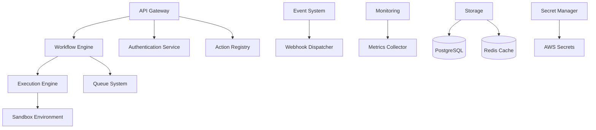

# Welcome to Tolstoy

Tolstoy is an enterprise-grade workflow automation platform designed to help teams build, deploy, and manage complex workflows with ease. Built with modern technologies and designed for scale, Tolstoy provides everything you need to automate your business processes.

## Why Tolstoy?

<CardGroup cols={2}>
  <Card title="Enterprise-Ready" icon="building">
    Multi-tenant architecture with advanced security, compliance, and scalability features designed for enterprise deployments.
  </Card>
  <Card title="Developer-First" icon="code">
    Comprehensive APIs, SDKs, and CLI tools built for developers who need programmatic control over their workflows.
  </Card>
  <Card title="Visual Workflow Builder" icon="diagram-project">
    Intuitive interface for building complex workflows with drag-and-drop simplicity and powerful conditional logic.
  </Card>
  <Card title="Monitoring & Observability" icon="chart-line">
    Real-time execution monitoring, comprehensive logging, and Prometheus metrics for complete visibility into your workflows.
  </Card>
</CardGroup>

## Key Features

### **Workflow Orchestration**
- **Visual Flow Builder** - Create complex workflows with an intuitive drag-and-drop interface
- **Action Library** - Extensive collection of pre-built integrations and actions
- **Conditional Logic** - Sophisticated branching and decision-making capabilities
- **Error Handling** - Robust retry policies and error management

### **Enterprise Security**
- **Multi-Tenant Architecture** - Complete data isolation between organizations
- **OAuth2 Integration** - Seamless authentication with major providers (GitHub, Google, Microsoft, Slack, and more)
- **Secrets Management** - Secure credential storage with AWS Secrets Manager integration
- **Role-Based Access Control** - Granular permissions and user management

### **Developer Experience**
- **REST API** - Complete API coverage for all platform functionality
- **TypeScript SDK** - Type-safe SDK with comprehensive documentation
- **CLI Tools** - Command-line interface for workflow management and deployment
- **Webhook System** - Real-time event notifications and integrations

### **Monitoring & Operations**
- **Execution Tracking** - Detailed logs and audit trails for every workflow execution
- **Prometheus Metrics** - Business and system metrics for monitoring and alerting
- **Health Checks** - Multi-level health monitoring for system reliability
- **Real-time Updates** - WebSocket-based real-time execution status updates

## Architecture Overview

Tolstoy is built on a modern, cloud-native architecture:

### **Core Components**

- **API Gateway** - Handles authentication, rate limiting, and request routing
- **Workflow Engine** - Executes workflows with fault tolerance and auto-scaling
- **Action Registry** - Manages available actions and their configurations
- **Event System** - Real-time event streaming and webhook notifications
- **Storage Layer** - PostgreSQL for persistent data, Redis for caching and sessions
- **Sandbox Environment** - Secure execution environment for custom code

## Use Cases

<Tabs>
  <Tab title="Data Processing">
    **ETL Pipelines** - Extract, transform, and load data between systems
    
    **Data Validation** - Automated data quality checks and validation workflows
    
    **Report Generation** - Automated report creation and distribution
    
    **Data Synchronization** - Keep data consistent across multiple platforms
  </Tab>
  
  <Tab title="Integration">
    **System Integration** - Connect disparate systems and synchronize data
    
    **API Orchestration** - Coordinate multiple API calls and handle complex workflows
    
    **Legacy System Modernization** - Bridge old systems with modern applications
    
    **Third-party Integrations** - Seamless connection with external services
  </Tab>
  
  <Tab title="DevOps">
    **CI/CD Pipelines** - Automated build, test, and deployment workflows
    
    **Infrastructure Management** - Automated provisioning and configuration
    
    **Incident Response** - Automated alerting and response procedures
    
    **Environment Management** - Automated environment setup and teardown
  </Tab>
  
  <Tab title="Business Process">
    **Approval Workflows** - Multi-step approval and review processes
    
    **Customer Onboarding** - Automated new customer setup and configuration
    
    **Compliance Automation** - Automated compliance checks and reporting
    
    **Notification Systems** - Intelligent alerting and communication workflows
  </Tab>
</Tabs>

## Getting Started

Ready to start automating your workflows? Follow our quickstart guide to get up and running in minutes.

<CardGroup cols={2}>
  <Card title="Quickstart Guide" icon="rocket" href="/quickstart">
    Get started with your first workflow in under 5 minutes
  </Card>
  <Card title="Installation" icon="download" href="/installation">
    Set up Tolstoy in your environment
  </Card>
  <Card title="Core Concepts" icon="book-open" href="/concepts/organizations">
    Learn about organizations, tools, actions, and flows
  </Card>
  <Card title="API Reference" icon="code" href="/api-reference">
    Explore our comprehensive API documentation
  </Card>
</CardGroup>

## Community & Support

Join our community and get help with Tolstoy:

- **GitHub** - [View source code and report issues](https://github.com/joosuhail12/tolstoy)
- **Documentation** - Comprehensive guides and API reference
- **Support** - Email us at [support@tolstoy.dev](mailto:support@tolstoy.dev)
- **Enterprise** - Contact [enterprise@tolstoy.dev](mailto:enterprise@tolstoy.dev) for enterprise solutions

<Card title="Need Help?" icon="question">
  Check out our [troubleshooting guide](/troubleshooting) or reach out to our support team. We're here to help you succeed with workflow automation.
</Card>