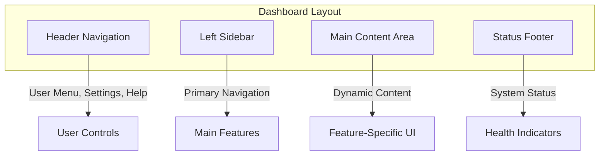
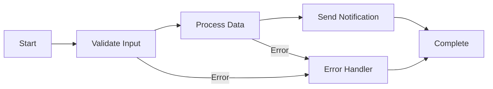

# Dashboard Tour

Welcome to the Tolstoy dashboard! This comprehensive tour will familiarize you with every section of the interface, helping you navigate efficiently and discover powerful features that will accelerate your workflow automation journey.

## Dashboard Layout

The Tolstoy dashboard is designed with productivity in mind, featuring a clean, intuitive interface organized into logical sections:



Let's explore each section in detail.

## Header Navigation

### Organization & User Context

The header provides essential context and quick actions:

<CardGroup cols={2}>
  <Card title="Organization Selector" icon="building">
    **Switch between organizations** you have access to
    - Current organization name displayed prominently
    - Quick switcher for multi-org users
    - Organization settings accessible via dropdown
  </Card>
  <Card title="User Menu" icon="user">
    **Personal account management** and preferences
    - Profile settings and preferences
    - API credentials management
    - Billing and subscription details
    - Sign out option
  </Card>
</CardGroup>

### Global Actions

Quick access to common actions across the platform:

- **🔍 Global Search** - Find workflows, actions, tools, or executions instantly
- **➕ Create New** - Quick-create workflows, actions, or tools
- **🔔 Notifications** - Real-time alerts and system updates
- **❓ Help & Support** - Documentation, tutorials, and support chat

## Left Sidebar Navigation

### Primary Sections

The sidebar organizes Tolstoy's features into logical groups:

#### **🔄 Workflows**
Your automation hub for creating and managing workflows:

- **All Flows** - Complete list of your workflows
- **Active Flows** - Currently running and enabled workflows
- **Draft Flows** - Workflows in development
- **Templates** - Pre-built workflow templates
- **Recent Executions** - Latest workflow runs with status

#### **🛠️ Building Blocks**
Components used to construct workflows:

- **Actions** - Reusable workflow steps and operations
- **Tools** - External service integrations (APIs, databases, etc.)
- **Secrets** - Secure credential and configuration management
- **Variables** - Global variables and environment configuration

#### **📊 Monitoring**
Visibility into your automation performance:

- **Execution History** - Complete log of workflow runs
- **Analytics** - Performance metrics and insights
- **Alerts** - System notifications and error monitoring
- **Logs** - Detailed execution and system logs

#### **⚙️ Settings**
Platform configuration and management:

- **Organization Settings** - Team, billing, and org-wide configuration
- **API Keys** - Authentication credentials for programmatic access
- **Webhooks** - Event subscriptions and external notifications
- **Integrations** - Third-party platform connections

### Navigation Features

**Smart Badges & Indicators**:
- **🔴 Error badges** on items with failures
- **🟢 Success indicators** for healthy resources
- **📈 Execution counts** on frequently-used workflows
- **🕐 Last activity timestamps** for recency awareness

**Quick Filters**:
- **Status filters** (Active, Inactive, Failed, etc.)
- **Date range selectors** for time-based filtering  
- **Tag-based filtering** for organization
- **Search within sections** for quick discovery

## Main Content Areas

### Workflows Dashboard

The central hub for workflow management:

#### **Overview Cards**
Quick metrics and status at a glance:

```typescript
interface DashboardMetrics {
  totalFlows: number;
  activeFlows: number;
  executionsToday: number;
  successRate: number;
  avgExecutionTime: string;
  recentFailures: number;
}
```

- **📊 Total Workflows** - Count of all workflows in your organization
- **▶️ Active Workflows** - Currently enabled and ready to execute  
- **🚀 Executions Today** - Number of workflow runs in the last 24 hours
- **✅ Success Rate** - Percentage of successful executions (last 7 days)
- **⏱️ Avg Execution Time** - Median workflow completion time
- **❌ Recent Failures** - Failed executions requiring attention

#### **Workflows List**
Comprehensive workflow management interface:

**List View Features**:
- **Sortable columns** (Name, Status, Last Run, Success Rate, etc.)
- **Bulk actions** (Enable/Disable, Tag, Delete multiple workflows)
- **Quick actions** (Execute, Edit, Duplicate, Share)
- **Status indicators** with color coding and tooltips
- **Search and filtering** with advanced query options

**Workflow Cards**:
Each workflow displays essential information:
- **Name and Description** with clear, descriptive titles
- **Status Badge** (Active, Inactive, Draft, Error)
- **Last Execution** timestamp and result
- **Success Rate** with visual progress indicator
- **Quick Actions** (Execute, Edit, View Logs, Settings)
- **Tags** for categorization and filtering

### Workflow Builder

The visual interface for creating and editing workflows:

#### **Canvas Interface**
Drag-and-drop workflow construction:



**Canvas Features**:
- **Visual flow representation** with connected steps
- **Drag-and-drop step creation** from action library
- **Connection management** with conditional logic support
- **Zoom and pan** for large, complex workflows
- **Mini-map navigation** for workflow overview
- **Step validation** with real-time error checking

#### **Properties Panel**
Detailed configuration for selected workflow elements:

**Workflow Properties**:
- **Basic Information** (Name, Description, Tags)
- **Input Schema** definition with validation rules
- **Output Mapping** configuration
- **Execution Settings** (Timeout, Retry Policy, Error Handling)
- **Permissions** and sharing settings

**Step Properties**:
- **Action Selection** from available action library
- **Input Mapping** with variable substitution
- **Conditional Execution** logic (executeIf conditions)
- **Error Handling** (retry, fallback, continue)
- **Output Configuration** and variable naming

#### **Action Library**
Searchable catalog of available actions:

- **Categories** (Communication, Data, Logic, Integrations, etc.)
- **Search and Filter** by name, description, or tags
- **Action Details** with input/output schemas
- **Usage Examples** and documentation links
- **Custom Actions** created by your organization

### Execution Monitoring

Real-time and historical execution tracking:

#### **Live Execution View**
Watch workflows execute in real-time:

- **Execution Timeline** showing step-by-step progress
- **Live Status Updates** with step completion indicators
- **Input/Output Inspection** for each step
- **Performance Metrics** (duration, resource usage)
- **Error Details** with stack traces and context
- **Execution Controls** (pause, cancel, retry)

#### **Execution History**
Comprehensive log of all workflow runs:

**History Table**:
- **Execution ID** with direct links to detailed views
- **Workflow Name** and version information
- **Start/End Times** with duration calculations
- **Status** with color-coded indicators
- **Trigger Source** (manual, API, webhook, schedule)
- **Input Summary** showing key parameters
- **Actions** (view details, retry, download logs)

**Filtering and Search**:
- **Date Range Selection** with preset options
- **Status Filtering** (Success, Failed, Running, Cancelled)
- **Workflow Filtering** by specific workflow or tag
- **Advanced Search** by execution ID, input values, or error messages

## Tool Management Interface

### Tool Configuration
Streamlined setup for external service integrations:

#### **Connection Setup**
Step-by-step tool integration:

1. **Tool Selection** from pre-built catalog or custom configuration
2. **Authentication Setup** with secure credential storage
3. **Connection Testing** to verify integration health
4. **Permission Configuration** and access control
5. **Usage Monitoring** and rate limit management

#### **Tool Library**
Extensive catalog of pre-built integrations:

<CardGroup cols={3}>
  <Card title="Communication" icon="chat">
    **Slack, Teams, Discord**
    Email providers, SMS gateways
  </Card>
  <Card title="Development" icon="code">
    **GitHub, GitLab, Jira**
    CI/CD platforms, monitoring tools
  </Card>
  <Card title="Business" icon="briefcase">
    **Salesforce, HubSpot, Notion**
    CRM, project management, databases
  </Card>
</CardGroup>

### Health Monitoring
Real-time tool health and performance tracking:

- **Connection Status** with last successful ping
- **Rate Limit Monitoring** showing current usage vs. limits
- **Error Rate Tracking** with trend analysis
- **Performance Metrics** (response time, availability)
- **Usage Analytics** showing which workflows use each tool

## Analytics & Reporting

### Performance Dashboard
Comprehensive metrics for workflow optimization:

#### **Execution Analytics**
Deep insights into workflow performance:

- **Volume Trends** - Execution counts over time with trend analysis
- **Success Rate Analysis** - Success/failure rates with root cause analysis
- **Performance Metrics** - Average, median, and percentile execution times
- **Resource Utilization** - CPU, memory, and network usage patterns
- **Cost Analysis** - Execution costs and resource optimization opportunities

#### **Business Metrics**
Workflow impact on business objectives:

- **SLA Compliance** - Meeting defined performance targets
- **User Adoption** - Workflow usage across teams and departments
- **ROI Analysis** - Time saved and efficiency gains
- **Error Impact** - Business impact of workflow failures
- **Capacity Planning** - Future scaling requirements

### Custom Reports
Build tailored reports for specific needs:

- **Report Builder** with drag-and-drop interface
- **Custom Metrics** definition and calculation
- **Scheduled Reports** with email delivery
- **Data Export** in multiple formats (CSV, JSON, PDF)
- **Dashboard Sharing** with team members and stakeholders

## User Experience Features

### Personalization
Customize the dashboard for your workflow:

#### **Layout Preferences**
- **Sidebar Collapse** for more screen real estate
- **Theme Selection** (Light, Dark, High Contrast)
- **Density Options** (Compact, Normal, Comfortable)
- **Default Views** for each section
- **Quick Access Toolbar** with your most-used features

#### **Notifications**
Stay informed with customizable alerts:

- **Real-time Notifications** for execution events
- **Email Digests** with workflow summaries
- **Slack/Teams Integration** for team notifications
- **Mobile Push Notifications** (when mobile app is available)
- **Custom Alert Rules** based on specific conditions

### Keyboard Shortcuts
Power-user features for efficiency:

| Shortcut | Action | Context |
|----------|--------|---------|
| `Cmd/Ctrl + K` | Global search | Anywhere |
| `Cmd/Ctrl + N` | Create new workflow | Workflows section |
| `Cmd/Ctrl + E` | Execute selected workflow | Workflow view |
| `Cmd/Ctrl + D` | Duplicate workflow | Workflow view |
| `Cmd/Ctrl + /` | Show keyboard shortcuts | Anywhere |
| `Space` | Quick preview | List views |
| `Enter` | Edit selected item | List views |
| `Esc` | Close modal/cancel action | Modal dialogs |

## Getting Help

### Built-in Guidance
Contextual help throughout the interface:

#### **Interactive Tours**
- **First-time User Onboarding** - Guided tour of key features
- **Feature Introductions** - Tooltips and overlays for new features  
- **Progressive Disclosure** - Advanced features revealed as needed
- **Contextual Help** - Relevant tips based on current activity

#### **Documentation Integration**
- **In-app Help Links** to relevant documentation
- **Video Tutorials** embedded in key locations
- **Example Templates** with step-by-step explanations
- **Best Practices** recommendations throughout the interface

### Support Channels
Multiple ways to get assistance:

<CardGroup cols={2}>
  <Card title="Live Chat" icon="chat">
    **Instant support** during business hours
    - Technical questions and troubleshooting
    - Feature guidance and best practices
    - Account and billing inquiries
  </Card>
  <Card title="Help Center" icon="question-circle">
    **Self-service resources** available 24/7
    - Comprehensive documentation
    - Video tutorial library
    - Community forums and discussions
  </Card>
</CardGroup>

## Mobile Experience

### Responsive Design
Full functionality across all device sizes:

- **Mobile-First Design** optimized for touch interaction
- **Progressive Enhancement** with additional features on larger screens
- **Offline Capabilities** for viewing workflows and execution history
- **Touch Gestures** for navigation and common actions

### Mobile-Specific Features
Optimized workflows for mobile users:

- **Quick Actions** accessible via swipe gestures
- **Push Notifications** for critical workflow events
- **Voice Commands** for common operations (where supported)
- **Simplified Navigation** with bottom tab bar on mobile

## Accessibility Features

### Inclusive Design
Ensuring usability for all users:

- **Keyboard Navigation** for all functionality
- **Screen Reader Support** with proper ARIA labels
- **High Contrast Mode** for visual accessibility
- **Font Size Scaling** respecting system preferences
- **Motion Preferences** respecting reduced motion settings

### Compliance
Meeting accessibility standards:

- **WCAG 2.1 AA Compliance** across all interfaces
- **Section 508 Compliance** for government users
- **Regular Accessibility Audits** and improvements
- **User Feedback Integration** for continuous improvement

## Power User Tips

### Advanced Workflows
Maximize your productivity:

1. **Keyboard-First Navigation** - Learn shortcuts for common actions
2. **Bulk Operations** - Use multi-select for batch actions
3. **Template Creation** - Save frequently-used patterns as templates
4. **Advanced Filtering** - Create custom views with complex filters
5. **API Integration** - Combine dashboard with programmatic access

### Optimization Strategies
Get the most from your workflows:

1. **Performance Monitoring** - Regularly review execution analytics
2. **Error Analysis** - Use error patterns to improve reliability
3. **Resource Planning** - Monitor usage to predict scaling needs
4. **Team Collaboration** - Use sharing and permissions effectively
5. **Documentation** - Document workflows for team knowledge sharing

## What's Next?

Now that you're familiar with the dashboard:

<CardGroup cols={2}>
  <Card title="Create Your First Workflow" icon="plus" href="/product/getting-started/first-workflow">
    Put your new knowledge to work by building an automation
  </Card>
  <Card title="Explore Use Cases" icon="lightbulb" href="/product/overview/use-cases">
    Discover what's possible with real-world examples
  </Card>
</CardGroup>

<CardGroup cols={2}>
  <Card title="Advanced Workflows" icon="cog" href="/product/workflows/workflow-patterns">
    Learn sophisticated patterns and techniques
  </Card>
  <Card title="Team Collaboration" icon="users" href="/product/workflows/best-practices">
    Best practices for team-based workflow development
  </Card>
</CardGroup>

---

*The Tolstoy dashboard is designed to grow with you - from your first workflow to enterprise-scale automation. Take time to explore each section and discover the features that will make you most productive.*