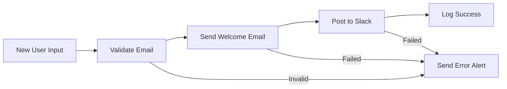

# Create Your First Workflow

Ready to see Tolstoy in action? This guide will walk you through creating, configuring, and executing your first workflow. You'll build a simple notification workflow that demonstrates the core concepts of workflow automation.

## What You'll Build

We're going to create a **"Welcome New User"** workflow that:
1. Receives user information as input
2. Validates the email address  
3. Sends a welcome email via an email service
4. Posts a notification to Slack
5. Logs the completion for tracking



This workflow introduces you to:
- **Input validation** and error handling
- **Sequential step execution**
- **Multiple tool integrations** (Email + Slack)
- **Conditional logic** for error scenarios

## Prerequisites

Before starting, make sure you have:

<CardGroup cols={2}>
  <Card title="Account Setup" icon="user-check">
    ✅ Tolstoy account created and verified  
    ✅ API credentials configured  
    ✅ Dashboard access confirmed
  </Card>
  <Card title="Integration Access" icon="plug">
    ✅ Email service API key (SendGrid, Mailgun, etc.)  
    ✅ Slack webhook URL or bot token  
    ✅ Test email address for validation
  </Card>
</CardGroup>

<Info>
**Don't have integrations ready?** No problem! You can follow along and use our built-in logging actions instead of external services.
</Info>

## Step 1: Set Up Your Tools

First, we'll configure the external services your workflow will use.

### Configure Email Service

1. **Navigate to Tools** in the Tolstoy dashboard
2. **Click "Add Tool"** and select "Email Service"
3. **Configure your email provider**:

<CodeGroup>
```json SendGrid
{
  "name": "SendGrid Email",
  "type": "sendgrid",
  "baseUrl": "https://api.sendgrid.com",
  "authType": "api_key",
  "credentials": {
    "api_key": "SG.your-sendgrid-api-key-here"
  },
  "settings": {
    "from_email": "welcome@yourcompany.com",
    "from_name": "Your Company Team"
  }
}
```

```json Mailgun
{
  "name": "Mailgun Email",
  "type": "mailgun", 
  "baseUrl": "https://api.mailgun.net",
  "authType": "api_key",
  "credentials": {
    "api_key": "key-your-mailgun-api-key-here",
    "domain": "mg.yourcompany.com"
  }
}
```

```json SMTP (Generic)
{
  "name": "SMTP Email",
  "type": "smtp",
  "baseUrl": "smtp://smtp.gmail.com:587",
  "authType": "basic",
  "credentials": {
    "username": "your-email@gmail.com",
    "password": "your-app-password"
  }
}
```
</CodeGroup>

4. **Test the connection** using the "Test" button
5. **Save the tool** once the test passes

### Configure Slack Integration

1. **Add another tool** for Slack notifications
2. **Configure Slack webhook**:

```json
{
  "name": "Team Slack",
  "type": "slack",
  "baseUrl": "https://hooks.slack.com",
  "authType": "webhook",
  "credentials": {
    "webhook_url": "https://hooks.slack.com/services/YOUR/SLACK/WEBHOOK"
  },
  "settings": {
    "default_channel": "#general",
    "username": "Tolstoy Bot"
  }
}
```

<details>
<summary>**How to get a Slack webhook URL**</summary>

1. Go to [https://api.slack.com/apps](https://api.slack.com/apps)
2. Click "Create New App" → "From scratch"
3. Name your app "Tolstoy Notifications" and select your workspace
4. Go to "Incoming Webhooks" and activate them
5. Click "Add New Webhook to Workspace"
6. Choose a channel and click "Allow"
7. Copy the webhook URL that starts with `https://hooks.slack.com/services/`
</details>

## Step 2: Create Actions

Actions are reusable components that define what each step of your workflow does. Let's create the actions we'll need.

### Email Validation Action

1. **Go to Actions** in the dashboard
2. **Click "Create Action"** and configure:

```json
{
  "key": "validate-email",
  "name": "Validate Email Address",
  "description": "Validates email format and checks for common issues",
  "inputSchema": [
    {
      "name": "email",
      "type": "string",
      "required": true,
      "description": "Email address to validate",
      "validation": {
        "pattern": "^[^@\\s]+@[^@\\s]+\\.[^@\\s]+$"
      }
    }
  ],
  "logic": {
    "type": "javascript",
    "code": `
      function validateEmail(email) {
        // Basic format validation
        const emailRegex = /^[^\\s@]+@[^\\s@]+\\.[^\\s@]+$/;
        if (!emailRegex.test(email)) {
          throw new Error('Invalid email format');
        }
        
        // Check for common typos
        const commonDomains = ['gmail.com', 'yahoo.com', 'hotmail.com', 'outlook.com'];
        const domain = email.split('@')[1].toLowerCase();
        
        return {
          email: email,
          domain: domain,
          valid: true,
          suggestions: []
        };
      }
      
      return validateEmail(inputs.email);
    `
  }
}
```

### Send Welcome Email Action  

1. **Create another action** for sending emails:

```json
{
  "key": "send-welcome-email",
  "name": "Send Welcome Email",
  "description": "Sends a personalized welcome email to new users",
  "toolId": "your-email-tool-id",
  "method": "POST",
  "endpoint": "/v3/mail/send",
  "inputSchema": [
    {
      "name": "email",
      "type": "string", 
      "required": true,
      "description": "Recipient email address"
    },
    {
      "name": "name",
      "type": "string",
      "required": false,
      "description": "Recipient name"
    },
    {
      "name": "company",
      "type": "string",
      "required": false,
      "description": "Company name"
    }
  ],
  "requestTemplate": {
    "personalizations": [
      {
        "to": [{"email": "{{email}}", "name": "{{name}}"}],
        "subject": "Welcome to {{company}}!"
      }
    ],
    "from": {"email": "welcome@yourcompany.com", "name": "Welcome Team"},
    "content": [
      {
        "type": "text/html",
        "value": "<h1>Welcome {{name}}!</h1><p>We're excited to have you join {{company}}. Let's get started on your automation journey!</p>"
      }
    ]
  }
}
```

### Slack Notification Action

1. **Create a Slack notification action**:

```json
{
  "key": "notify-slack",
  "name": "Send Slack Notification", 
  "description": "Posts a message to Slack channel",
  "toolId": "your-slack-tool-id",
  "method": "POST",
  "endpoint": "/services/YOUR/SLACK/WEBHOOK",
  "inputSchema": [
    {
      "name": "message",
      "type": "string",
      "required": true,
      "description": "Message to post"
    },
    {
      "name": "channel",
      "type": "string",
      "required": false,
      "description": "Channel to post to"
    }
  ],
  "requestTemplate": {
    "text": "{{message}}",
    "channel": "{{channel}}",
    "username": "Tolstoy Bot",
    "icon_emoji": ":robot_face:"
  }
}
```

## Step 3: Build Your Workflow

Now let's put it all together into a complete workflow.

### Create the Flow

1. **Navigate to Workflows** in the dashboard
2. **Click "Create Workflow"**
3. **Configure your workflow**:

```json
{
  "name": "Welcome New User",
  "description": "Automated welcome process for new user signups",
  "version": 1,
  "inputs": [
    {
      "name": "email",
      "type": "string",
      "required": true,
      "description": "User's email address"
    },
    {
      "name": "name", 
      "type": "string",
      "required": false,
      "description": "User's full name"
    },
    {
      "name": "company",
      "type": "string", 
      "required": false,
      "description": "User's company name"
    }
  ],
  "steps": [
    {
      "key": "validate-email-step",
      "name": "Validate Email Address",
      "action": "validate-email",
      "inputs": {
        "email": "{{workflow.inputs.email}}"
      },
      "onError": {
        "action": "notify-error",
        "inputs": {
          "error": "Email validation failed: {{error.message}}"
        }
      }
    },
    {
      "key": "send-welcome-step", 
      "name": "Send Welcome Email",
      "action": "send-welcome-email",
      "inputs": {
        "email": "{{steps.validate-email-step.output.email}}",
        "name": "{{workflow.inputs.name}}",
        "company": "{{workflow.inputs.company}}"
      },
      "executeIf": "{{steps.validate-email-step.output.valid}} == true",
      "onError": {
        "action": "notify-error",
        "inputs": {
          "error": "Failed to send welcome email: {{error.message}}"
        }
      }
    },
    {
      "key": "notify-team-step",
      "name": "Notify Team in Slack", 
      "action": "notify-slack",
      "inputs": {
        "message": "🎉 New user welcomed: {{workflow.inputs.name}} ({{workflow.inputs.email}}) from {{workflow.inputs.company}}",
        "channel": "#new-users"
      },
      "executeIf": "{{steps.send-welcome-step.status}} == 'completed'",
      "onError": {
        "action": "log-warning",
        "inputs": {
          "message": "Slack notification failed but welcome email sent successfully"
        }
      }
    },
    {
      "key": "log-completion-step",
      "name": "Log Successful Completion",
      "action": "log-info", 
      "inputs": {
        "message": "Welcome workflow completed successfully for {{workflow.inputs.email}}",
        "metadata": {
          "user_email": "{{workflow.inputs.email}}",
          "user_name": "{{workflow.inputs.name}}",
          "company": "{{workflow.inputs.company}}",
          "completed_at": "{{now}}"
        }
      }
    }
  ],
  "settings": {
    "timeout": 300000,
    "retryPolicy": {
      "maxRetries": 2,
      "retryDelay": 5000
    },
    "errorHandling": "continue"
  }
}
```

### Understanding the Workflow Structure

Let's break down the key concepts:

**🔄 Sequential Execution**: Steps execute in order, with each step potentially using outputs from previous steps.

**🔀 Conditional Logic**: The `executeIf` condition controls when steps run:
```yaml
executeIf: "{{steps.validate-email-step.output.valid}} == true"
```

**📝 Variable Substitution**: Use double braces to reference data:
- `{{workflow.inputs.email}}` - Input from workflow execution
- `{{steps.step-name.output.field}}` - Output from previous steps  
- `{{now}}` - Current timestamp

**⚠️ Error Handling**: Each step can define `onError` actions for graceful failure handling.

## Step 4: Test Your Workflow

Time to see your automation in action!

### Test Execution

1. **Click "Test Workflow"** in the workflow editor
2. **Provide test input**:

```json
{
  "email": "john.doe@example.com",
  "name": "John Doe", 
  "company": "Acme Corporation"
}
```

3. **Click "Execute"** and watch the magic happen!

### Monitor Execution

You'll see real-time progress as each step executes:

```
✅ validate-email-step: Completed (0.2s)
   └── Output: {"email": "john.doe@example.com", "valid": true, "domain": "example.com"}

✅ send-welcome-step: Completed (1.4s)  
   └── Output: {"messageId": "abc123", "status": "sent"}

✅ notify-team-step: Completed (0.8s)
   └── Output: {"ok": true, "channel": "#new-users"}

✅ log-completion-step: Completed (0.1s)
   └── Output: {"logged": true, "timestamp": "2024-01-15T10:30:00Z"}

🎉 Workflow completed successfully in 2.5 seconds
```

### Test Error Scenarios

Try these test cases to see error handling in action:

<CodeGroup>
```json Invalid Email
{
  "email": "not-an-email",
  "name": "Test User",
  "company": "Test Co"
}
```

```json Missing Required Field
{
  "name": "Test User",
  "company": "Test Co"
}
```
</CodeGroup>

## Step 5: Deploy to Production

Once your workflow is tested and working:

### Save and Activate

1. **Click "Save Workflow"** to persist your changes
2. **Click "Activate"** to enable production execution
3. **Note the workflow ID** for API integration

### API Integration

Your workflow can now be executed via API:

<CodeGroup>
```bash cURL
curl -X POST https://tolstoy.getpullse.com/flows/your-flow-id/execute \
  -H "x-org-id: your-org-id" \
  -H "x-user-id: your-user-id" \
  -H "Content-Type: application/json" \
  -d '{
    "email": "new.user@company.com",
    "name": "New User",
    "company": "Their Company Inc"
  }'
```

```typescript TypeScript
import { TolstoyClient } from '@joosuhail/tolstoy-sdk';

const client = new TolstoyClient({
  orgId: process.env.TOLSTOY_ORG_ID!,
  userId: process.env.TOLSTOY_USER_ID!
});

const execution = await client.flows.execute('your-flow-id', {
  email: 'new.user@company.com',
  name: 'New User', 
  company: 'Their Company Inc'
});

console.log('Execution started:', execution.id);
```

```python Python
import tolstoy

client = tolstoy.Client(
    org_id=os.environ['TOLSTOY_ORG_ID'],
    user_id=os.environ['TOLSTOY_USER_ID']
)

execution = client.flows.execute('your-flow-id', {
    'email': 'new.user@company.com',
    'name': 'New User',
    'company': 'Their Company Inc'
})

print(f'Execution started: {execution.id}')
```
</CodeGroup>

## Next Steps: Enhance Your Workflow

Now that you have a working workflow, try these enhancements:

### Add More Sophistication

<CardGroup cols={2}>
  <Card title="Email Templates" icon="envelope">
    Create dynamic email templates with personalization and branding
  </Card>
  <Card title="User Segmentation" icon="users">
    Add conditional logic to handle different user types differently  
  </Card>
</CardGroup>

<CardGroup cols={2}>
  <Card title="Multi-Channel Notifications" icon="broadcast-tower">
    Add SMS, push notifications, or other communication channels
  </Card>
  <Card title="CRM Integration" icon="database">
    Automatically create user records in Salesforce, HubSpot, etc.
  </Card>
</CardGroup>

### Learn Advanced Patterns

<CardGroup cols={2}>
  <Card title="Parallel Execution" icon="split" href="/product/workflows/workflow-patterns">
    Execute multiple steps simultaneously for better performance
  </Card>
  <Card title="Conditional Logic" icon="fork" href="/product/workflows/conditional-logic">
    Build complex decision trees and branching workflows
  </Card>
</CardGroup>

<CardGroup cols={2}>
  <Card title="Error Handling" icon="shield-check" href="/product/workflows/error-handling">
    Implement robust error recovery and retry strategies
  </Card>
  <Card title="Webhook Triggers" icon="webhook" href="/product/integrations/overview">
    Trigger workflows automatically from external events
  </Card>
</CardGroup>

## Troubleshooting

### Common Issues

<details>
<summary>**Workflow execution fails at email step**</summary>

**Check these items:**
1. Verify email service API key is correct
2. Ensure from_email is verified with your provider
3. Check rate limits on your email service
4. Validate email template syntax

**Quick fix:**
```bash
tolstoy tools test your-email-tool-id
```
</details>

<details>
<summary>**Slack notifications not appearing**</summary>

**Possible causes:**
1. Webhook URL is incorrect or expired
2. Channel doesn't exist or bot lacks permissions
3. Message format is invalid

**Debug steps:**
```bash
# Test Slack integration
tolstoy actions execute notify-slack '{"message": "test", "channel": "#general"}'
```
</details>

<details>
<summary>**Variables not substituting correctly**</summary>

**Common mistakes:**
- Wrong variable syntax: `{email}` instead of `{{email}}`
- Referencing non-existent step outputs
- Typos in variable names

**Use the variable inspector** in the workflow editor to see available variables.
</details>

## Congratulations! 🎉

You've successfully created, tested, and deployed your first Tolstoy workflow! You now understand:

- ✅ **Tool configuration** and authentication
- ✅ **Action creation** and reusability  
- ✅ **Workflow design** with conditional logic
- ✅ **Error handling** and monitoring
- ✅ **API integration** for production use

Your workflow is now ready to automatically welcome new users, demonstrating the power of workflow automation to eliminate manual tasks and ensure consistent experiences.

**What's Next?** Explore more complex workflows, integrate additional tools, and start automating more of your business processes!

<CardGroup cols={2}>
  <Card title="Advanced Workflows" icon="workflow" href="/product/workflows/workflow-patterns">
    Learn advanced patterns and techniques
  </Card>
  <Card title="Integration Library" icon="puzzle-piece" href="/product/integrations/overview">
    Explore all available tool integrations
  </Card>
</CardGroup>

---

*You've taken the first step into workflow automation. From here, the possibilities are endless!*