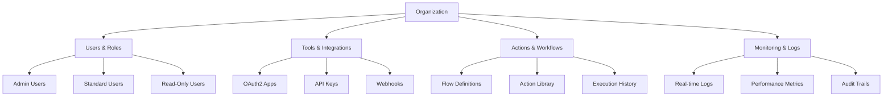

# Product Overview

Tolstoy is an enterprise-grade workflow automation platform that enables teams to design, build, and manage complex business processes with unprecedented ease and power. Whether you're automating simple data processing tasks or orchestrating sophisticated multi-system integrations, Tolstoy provides the tools and infrastructure you need.


## What Makes Tolstoy Different

<CardGroup cols={2}>
  <Card title="Visual-First Design" icon="palette">
    Create complex workflows using our intuitive drag-and-drop interface, with powerful underlying logic that scales with your needs.
  </Card>
  <Card title="Enterprise Security" icon="shield-halved">
    Multi-tenant architecture with complete data isolation, OAuth2 authentication, and comprehensive audit trails.
  </Card>
  <Card title="Real-Time Monitoring" icon="chart-line">
    Track every workflow execution with detailed logs, performance metrics, and real-time status updates.
  </Card>
  <Card title="Extensive Integrations" icon="plug">
    Pre-built connectors for 100+ popular tools and services, with the ability to create custom integrations.
  </Card>
</CardGroup>

## Core Platform Components

### Organizations & Multi-Tenancy

Tolstoy's multi-tenant architecture ensures complete data isolation and security:

- **Organization Scoping** - Every resource belongs to an organization with complete data separation
- **User Management** - Role-based access control with granular permissions
- **Resource Quotas** - Configurable limits and monitoring per organization
- **Custom Branding** - White-label options for enterprise customers



### Tools & Integrations

Connect with your existing technology stack through our comprehensive integration platform:

#### **Pre-Built Integrations**

<Tabs>
  <Tab title="Productivity">
    **Communication**
    - Slack - Send messages, create channels, manage users
    - Microsoft Teams - Post messages, create meetings, manage channels
    - Discord - Send notifications, manage servers
    - Email (SMTP/SendGrid/Mailgun) - Send transactional emails
    
    **Project Management**
    - Jira - Create tickets, update status, manage projects
    - Asana - Create tasks, assign users, track progress
    - Trello - Manage boards, cards, and lists
    - Monday.com - Update boards, create items, track workflows
  </Tab>
  
  <Tab title="Development">
    **Version Control**
    - GitHub - Manage repositories, pull requests, issues
    - GitLab - CI/CD pipelines, merge requests, deployments
    - Bitbucket - Repository management, build pipelines
    
    **CI/CD & Infrastructure**
    - Jenkins - Trigger builds, deploy applications
    - Docker - Build and push images, manage containers
    - Kubernetes - Deploy applications, manage pods
    - AWS - EC2, S3, Lambda, and 50+ other services
    - Google Cloud - Compute, Storage, BigQuery integrations
    - Azure - Virtual machines, storage, databases
  </Tab>
  
  <Tab title="Data & Analytics">
    **Databases**
    - PostgreSQL - Query, insert, update data
    - MySQL - Database operations and management
    - MongoDB - Document operations and aggregations
    - Redis - Cache operations and data structures
    
    **Analytics & BI**
    - Tableau - Create and refresh dashboards
    - Power BI - Generate reports and visualizations
    - Looker - Run queries and generate insights
    - Google Analytics - Track events and conversions
    
    **Data Processing**
    - Apache Kafka - Publish and consume messages
    - Apache Airflow - Trigger and monitor DAGs
    - Snowflake - Run queries and manage data warehouse
  </Tab>
  
  <Tab title="Business Systems">
    **CRM**
    - Salesforce - Manage leads, opportunities, accounts
    - HubSpot - Update contacts, create deals
    - Pipedrive - Manage sales pipeline
    
    **ERP & Finance**
    - SAP - Business process automation
    - QuickBooks - Invoice management, payments
    - Stripe - Payment processing, subscription management
    - PayPal - Payment handling and refunds
    
    **HR & Compliance**
    - BambooHR - Employee management, time tracking
    - Workday - HR processes, payroll integration
    - DocuSign - Document signing workflows
  </Tab>
</Tabs>

#### **Custom Integrations**

For unique requirements, create custom integrations using:

- **HTTP/REST APIs** - Connect to any web service with comprehensive HTTP support
- **GraphQL** - Query and mutate GraphQL APIs with type safety
- **SOAP/XML** - Legacy system integration with SOAP web services
- **FTP/SFTP** - File transfer and synchronization workflows
- **Database Connectors** - Direct database connections for any SQL/NoSQL database
- **Message Queues** - RabbitMQ, Apache Kafka, AWS SQS integration

### Actions & Workflow Building Blocks

Actions are the fundamental building blocks of workflows in Tolstoy. Each action represents a specific operation that can be performed within a workflow.

#### **Action Categories**

<CardGroup cols={3}>
  <Card title="Data Operations" icon="database">
    **Transform & Validate**
    - Data mapping and transformation
    - JSON/XML processing
    - Data validation and cleaning
    - Format conversion (CSV, JSON, XML)
    
    **Query & Analysis**
    - SQL query execution
    - Data aggregation and filtering
    - Statistical analysis
    - Report generation
  </Card>
  
  <Card title="Communication" icon="envelope">
    **Notifications**
    - Email campaigns and alerts
    - SMS messaging
    - Push notifications
    - In-app messaging
    
    **Collaboration**
    - Team notifications
    - Status updates
    - Approval workflows
    - Document sharing
  </Card>
  
  <Card title="Integration" icon="link">
    **API Operations**
    - REST API calls
    - GraphQL queries
    - Webhook handling
    - File uploads/downloads
    
    **System Integration**
    - Database operations
    - File system interactions
    - Message queue operations
    - External service calls
  </Card>
</CardGroup>

#### **Action Configuration**

Each action supports rich configuration options:

```json
{
  "action": "email",
  "name": "Send Welcome Email",
  "inputs": {
    "to": "{{user.email}}",
    "subject": "Welcome to {{organization.name}}!",
    "template": "welcome_template",
    "variables": {
      "user_name": "{{user.first_name}}",
      "login_url": "{{app.login_url}}"
    }
  },
  "conditions": {
    "when": "{{user.email_verified}} == true"
  },
  "retry_policy": {
    "attempts": 3,
    "delay": "30s",
    "backoff": "exponential"
  },
  "timeout": "5m"
}
```

**Configuration Features:**
- **Dynamic Variables** - Use template variables for dynamic content
- **Conditional Execution** - Execute actions based on conditions
- **Retry Policies** - Automatic retry with configurable strategies
- **Timeout Handling** - Set execution timeouts for reliability
- **Error Handling** - Custom error handling and fallback actions

### Flows & Workflow Orchestration

Flows are complete workflows that orchestrate multiple actions to accomplish complex business processes.

#### **Flow Types**

<Tabs>
  <Tab title="Sequential Flows">
    Execute actions in a specific order, with each step depending on the previous one.
    
    ```mermaid
    graph LR
        A[Start] --> B[Validate Data]
        B --> C[Process Payment]
        C --> D[Send Confirmation]
        D --> E[Update Database]
        E --> F[End]
    ```
    
    **Use Cases:**
    - Order processing workflows
    - User onboarding sequences
    - Data processing pipelines
    - Approval workflows
  </Tab>
  
  <Tab title="Parallel Flows">
    Execute multiple actions simultaneously for improved performance.
    
    ```mermaid
    graph TD
        A[Start] --> B[Split]
        B --> C[Send Email]
        B --> D[Update CRM]
        B --> E[Log Event]
        C --> F[Join]
        D --> F
        E --> F
        F --> G[End]
    ```
    
    **Use Cases:**
    - Multi-channel notifications
    - Parallel data processing
    - System synchronization
    - Concurrent API calls
  </Tab>
  
  <Tab title="Conditional Flows">
    Execute different paths based on conditions and decision logic.
    
    ```mermaid
    graph TD
        A[Start] --> B[Check User Type]
        B --> C{Premium User?}
        C -->|Yes| D[Premium Workflow]
        C -->|No| E[Standard Workflow]
        D --> F[End]
        E --> F
    ```
    
    **Use Cases:**
    - User segmentation workflows
    - Error handling and fallbacks
    - Business rule enforcement
    - Dynamic process routing
  </Tab>
  
  <Tab title="Event-Driven Flows">
    Trigger workflows based on external events and webhooks.
    
    ```mermaid
    graph TD
        A[External Event] --> B[Webhook Received]
        B --> C[Validate Payload]
        C --> D[Route to Handler]
        D --> E[Execute Workflow]
        E --> F[Send Response]
    ```
    
    **Use Cases:**
    - Real-time data processing
    - Event-driven architecture
    - Webhook handling
    - System integration
  </Tab>
</Tabs>

#### **Flow Features**

**Visual Flow Builder**
- Drag-and-drop interface for creating complex workflows
- Real-time validation and error checking
- Version control with rollback capabilities
- Collaborative editing with team members

**Advanced Logic**
- Conditional branching and loops
- Variable scoping and data passing
- Error handling and recovery
- Custom business rule engine

**Testing & Debugging**
- Step-by-step execution debugging
- Mock data and test scenarios
- Performance profiling and optimization
- Automated testing capabilities

### Monitoring & Observability

Complete visibility into your workflow executions with enterprise-grade monitoring:

#### **Real-Time Monitoring**

<CardGroup cols={2}>
  <Card title="Live Execution Dashboard" icon="gauge">
    Monitor workflows as they execute with real-time status updates, progress indicators, and performance metrics.
  </Card>
  <Card title="System Health Monitoring" icon="heart-pulse">
    Track system performance, resource utilization, and service availability across the entire platform.
  </Card>
</CardGroup>

#### **Execution Tracking**

Every workflow execution is comprehensively tracked:

```json
{
  "execution_id": "exec_123abc456def",
  "flow_id": "flow_789ghi012jkl",
  "status": "completed",
  "started_at": "2024-01-15T10:30:00Z",
  "completed_at": "2024-01-15T10:32:30Z",
  "duration": 150000,
  "steps_executed": 5,
  "steps_failed": 0,
  "variables": {
    "user_id": "user_456",
    "order_total": 99.99
  },
  "metrics": {
    "total_api_calls": 12,
    "data_processed": "1.2MB",
    "cost": 0.0045
  }
}
```

**Tracking Features:**
- **Step-by-Step Logs** - Detailed logs for each action execution
- **Variable State** - Track data flow through the workflow
- **Performance Metrics** - Execution time, resource usage, costs
- **Error Details** - Comprehensive error information and stack traces
- **Audit Trail** - Complete history of workflow changes and executions

#### **Analytics & Reporting**

<Tabs>
  <Tab title="Performance Analytics">
    **Execution Metrics**
    - Success/failure rates over time
    - Average execution duration trends
    - Resource utilization patterns
    - Cost analysis and optimization recommendations
    
    **System Performance**
    - API response times and throughput
    - Queue processing times
    - Database query performance
    - Memory and CPU utilization
    
    ```typescript
    // Sample metrics query
    const metrics = await client.analytics.query({
      metric: 'execution_duration',
      timeRange: '24h',
      groupBy: ['flow_id', 'status'],
      aggregation: 'avg'
    });
    ```
  </Tab>
  
  <Tab title="Business Intelligence">
    **Workflow Impact**
    - Business process efficiency gains
    - Cost savings through automation
    - Error reduction metrics
    - User adoption and engagement
    
    **Custom Reports**
    - Automated report generation
    - Scheduled delivery to stakeholders
    - Interactive dashboards
    - Data export capabilities
    
    **KPI Tracking**
    - SLA compliance monitoring
    - Process completion rates
    - Customer satisfaction impact
    - ROI analysis and reporting
  </Tab>
  
  <Tab title="Alerting & Notifications">
    **Intelligent Alerting**
    - Threshold-based alerts with configurable conditions
    - Anomaly detection using machine learning
    - Escalation policies for critical failures
    - Multi-channel notification delivery
    
    **Alert Configuration**
    ```json
    {
      "name": "High Failure Rate Alert",
      "condition": {
        "metric": "failure_rate",
        "threshold": 0.05,
        "window": "5m"
      },
      "channels": ["slack", "email", "pagerduty"],
      "escalation": {
        "levels": [
          {"wait": "5m", "notify": ["team-lead"]},
          {"wait": "15m", "notify": ["manager"]},
          {"wait": "30m", "notify": ["on-call"]}
        ]
      }
    }
    ```
  </Tab>
</Tabs>

### Webhooks & Event System

Enable real-time integrations and event-driven workflows with our comprehensive webhook system:

#### **Webhook Management**

**Outgoing Webhooks**
- Real-time event notifications to external systems
- Configurable payload formats and authentication
- Automatic retry with exponential backoff
- Delivery confirmation and failure tracking

```json
{
  "webhook_id": "hook_abc123def456",
  "name": "Order Completion Webhook",
  "url": "https://api.external-system.com/webhooks/orders",
  "events": ["flow.completed", "flow.failed"],
  "headers": {
    "Authorization": "Bearer {{env.EXTERNAL_API_KEY}}",
    "Content-Type": "application/json"
  },
  "retry_policy": {
    "attempts": 5,
    "delay": "30s",
    "backoff": "exponential"
  }
}
```

**Incoming Webhooks**
- Receive events from external systems
- Automatic signature verification for security
- Flexible payload parsing and validation
- Trigger workflows based on external events

#### **Event-Driven Architecture**

<CardGroup cols={2}>
  <Card title="Event Publishing" icon="broadcast-tower">
    Publish custom events throughout your workflows to trigger downstream processes and integrations.
  </Card>
  <Card title="Event Subscription" icon="rss">
    Subscribe to system and custom events to build reactive, event-driven applications and workflows.
  </Card>
</CardGroup>

**Event Types:**
- **System Events** - Flow executions, user actions, system health
- **Custom Events** - Business events defined by your workflows
- **Integration Events** - Events from connected third-party systems
- **Scheduled Events** - Time-based triggers and recurring schedules

```typescript
// Publishing custom events
await client.events.publish({
  type: 'order.created',
  data: {
    orderId: 'order_123',
    customerId: 'customer_456',
    amount: 99.99,
    items: [
      { sku: 'PROD_001', quantity: 2 }
    ]
  },
  timestamp: new Date().toISOString()
});

// Subscribing to events
client.events.subscribe('order.created', async (event) => {
  await client.flows.execute('welcome-flow', {
    customer_id: event.data.customerId,
    order_total: event.data.amount
  });
});
```

## User Roles & Permissions

Tolstoy implements a comprehensive role-based access control (RBAC) system:

### **Built-in Roles**

<Tabs>
  <Tab title="Organization Admin">
    **Full Administrative Access**
    - Manage all organization resources
    - User management and role assignment
    - Billing and subscription management
    - Security settings and audit logs
    - API key generation and management
    
    **Permissions:**
    - `org:*` - All organization permissions
    - `users:*` - All user management permissions
    - `flows:*` - All workflow permissions
    - `tools:*` - All integration permissions
    - `webhooks:*` - All webhook permissions
  </Tab>
  
  <Tab title="Flow Developer">
    **Workflow Development**
    - Create and edit workflows
    - Manage actions and integrations
    - Access execution logs and debugging
    - Configure webhooks and events
    
    **Permissions:**
    - `flows:create,read,update,delete`
    - `actions:create,read,update,delete`
    - `tools:read,configure`
    - `executions:read`
    - `webhooks:create,read,update,delete`
  </Tab>
  
  <Tab title="Flow Operator">
    **Workflow Operations**
    - Execute existing workflows
    - Monitor workflow performance
    - Access execution logs
    - Basic troubleshooting
    
    **Permissions:**
    - `flows:read,execute`
    - `actions:read`
    - `executions:read`
    - `tools:read`
  </Tab>
  
  <Tab title="Viewer">
    **Read-Only Access**
    - View workflows and executions
    - Access monitoring dashboards
    - Generate reports
    
    **Permissions:**
    - `flows:read`
    - `actions:read`
    - `executions:read`
    - `tools:read`
    - `webhooks:read`
  </Tab>
</Tabs>

### **Custom Roles**

Create custom roles with granular permissions:

```json
{
  "role_name": "Integration Specialist",
  "description": "Manages integrations and tools configuration",
  "permissions": [
    "tools:create,read,update,delete",
    "actions:create,read,update",
    "flows:read",
    "webhooks:create,read,update,delete",
    "executions:read"
  ],
  "resource_restrictions": {
    "tools": ["github", "slack", "email"],
    "max_webhooks": 10
  }
}
```

## Security & Compliance

### **Data Security**

<CardGroup cols={2}>
  <Card title="Encryption" icon="lock">
    **At Rest:** AES-256 encryption for all stored data
    **In Transit:** TLS 1.3 for all API communications
    **Application:** End-to-end encryption for sensitive data
  </Card>
  <Card title="Access Control" icon="key">
    **Multi-Factor Authentication** required for admin users
    **Role-Based Access Control** with granular permissions
    **API Key Management** with rotation and expiration
  </Card>
</CardGroup>

### **Compliance Standards**

Tolstoy meets industry compliance requirements:

- **SOC 2 Type II** - Security, availability, and confidentiality
- **GDPR Compliant** - Privacy rights and data protection
- **HIPAA Ready** - Healthcare data protection capabilities
- **PCI DSS** - Payment card industry security standards
- **ISO 27001** - Information security management

### **Audit & Logging**

Comprehensive audit capabilities for enterprise compliance:

```json
{
  "audit_log_id": "audit_789def012ghi",
  "timestamp": "2024-01-15T14:30:00Z",
  "user_id": "user_456abc789def",
  "action": "flow.update",
  "resource": "flow_123abc456def",
  "details": {
    "changes": [
      {
        "field": "steps[2].action",
        "old_value": "email",
        "new_value": "slack_message"
      }
    ],
    "ip_address": "192.168.1.100",
    "user_agent": "Mozilla/5.0...",
    "session_id": "session_abc123def456"
  },
  "result": "success"
}
```

**Audit Features:**
- **Complete Activity Logging** - All user and system actions
- **Data Change Tracking** - Before/after values for all modifications
- **Access Logging** - Login attempts, API access, permission changes
- **Export Capabilities** - Compliance reporting and external SIEM integration

## Enterprise Features

### **High Availability & Scalability**

<CardGroup cols={3}>
  <Card title="Auto-Scaling" icon="arrow-trend-up">
    Dynamic scaling based on workload with configurable scaling policies and resource limits.
  </Card>
  <Card title="Load Balancing" icon="scale-balanced">
    Intelligent load distribution across multiple availability zones with health checking.
  </Card>
  <Card title="Disaster Recovery" icon="shield-check">
    Automated backups with point-in-time recovery and multi-region deployment options.
  </Card>
</CardGroup>

### **Performance & Optimization**

**Execution Engine:**
- Multi-threaded workflow processing
- Intelligent resource allocation
- Performance-based routing
- Automatic optimization recommendations

**Caching & Performance:**
- Redis-based caching layer
- CDN integration for static assets
- Database query optimization
- Resource usage analytics

### **Integration & API**

**Enterprise API Features:**
- GraphQL and REST endpoints
- Webhook subscriptions with guaranteed delivery
- Bulk operations for large datasets
- Rate limiting with tier-based quotas

**SDK & Developer Tools:**
- Official SDKs for popular languages
- CLI tools for DevOps workflows
- Comprehensive OpenAPI documentation
- Postman collections and testing tools

## Getting Started Guide

### **1. Account Setup**

<Steps>
  <Step title="Create Organization">
    Sign up and create your organization with custom settings and branding options.
  </Step>
  <Step title="Configure Authentication">
    Set up OAuth2 providers and configure multi-factor authentication for your team.
  </Step>
  <Step title="Invite Team Members">
    Add team members with appropriate roles and permissions for your workflow needs.
  </Step>
  <Step title="Connect Tools">
    Connect your existing tools and services through our integration marketplace.
  </Step>
</Steps>

### **2. First Workflow**

Create your first workflow in minutes:

<CodeGroup>
```json Simple Email Workflow
{
  "name": "Welcome New User",
  "trigger": {
    "type": "webhook",
    "path": "/user-signup"
  },
  "steps": [
    {
      "key": "validate_user",
      "action": "data_validation",
      "inputs": {
        "data": "{{webhook.body}}",
        "schema": {
          "email": "required|email",
          "name": "required|string"
        }
      }
    },
    {
      "key": "send_welcome_email",
      "action": "email",
      "inputs": {
        "to": "{{validate_user.email}}",
        "subject": "Welcome to {{organization.name}}!",
        "template": "welcome_template",
        "variables": {
          "user_name": "{{validate_user.name}}"
        }
      }
    },
    {
      "key": "update_crm",
      "action": "salesforce_create_contact",
      "inputs": {
        "FirstName": "{{validate_user.name}}",
        "Email": "{{validate_user.email}}",
        "LeadSource": "Website"
      }
    }
  ]
}
```

```typescript TypeScript SDK
import { Client } from '@tolstoy/sdk';

const client = new Client({
  apiKey: process.env.TOLSTOY_API_KEY
});

// Create the workflow
const flow = await client.flows.create({
  name: 'Welcome New User',
  steps: [
    {
      key: 'validate_user',
      action: 'data_validation',
      inputs: {
        data: '{{webhook.body}}',
        schema: {
          email: 'required|email',
          name: 'required|string'
        }
      }
    },
    {
      key: 'send_welcome_email',
      action: 'email',
      inputs: {
        to: '{{validate_user.email}}',
        subject: 'Welcome to {{organization.name}}!',
        template: 'welcome_template',
        variables: {
          user_name: '{{validate_user.name}}'
        }
      }
    }
  ]
});

console.log('Flow created:', flow.id);
```
</CodeGroup>

### **3. Testing & Deployment**

<Tabs>
  <Tab title="Testing">
    **Test Your Workflows**
    - Use the built-in testing environment
    - Create test scenarios with mock data
    - Debug step-by-step execution
    - Validate integrations and data flow
    
    ```bash
    # Test with CLI
    tolstoy flows test welcome-user-flow \
      --input '{"email":"test@example.com","name":"Test User"}' \
      --environment test
    ```
  </Tab>
  
  <Tab title="Deployment">
    **Deploy to Production**
    - Version control with rollback capabilities
    - Staged deployment with approval workflows
    - Blue-green deployment for zero downtime
    - Automated testing in deployment pipeline
    
    ```bash
    # Deploy with CLI
    tolstoy flows deploy welcome-user-flow \
      --environment production \
      --approve
    ```
  </Tab>
  
  <Tab title="Monitoring">
    **Monitor Performance**
    - Real-time execution dashboards
    - Set up alerts for failures
    - Track performance metrics
    - Generate business intelligence reports
    
    ```typescript
    // Set up monitoring
    await client.monitoring.createAlert({
      name: 'High Failure Rate',
      condition: {
        metric: 'failure_rate',
        threshold: 0.05,
        window: '5m'
      },
      notifications: ['slack://team-alerts']
    });
    ```
  </Tab>
</Tabs>

## Use Cases & Industry Applications

### **E-commerce & Retail**

<CardGroup cols={2}>
  <Card title="Order Processing" icon="shopping-cart">
    **Automated Order Fulfillment**
    - Order validation and inventory checks
    - Payment processing and fraud detection
    - Shipping label generation and tracking
    - Customer notifications and updates
    
    **Customer Experience**
    - Abandoned cart recovery sequences
    - Personalized product recommendations
    - Review and feedback collection
    - Loyalty program management
  </Card>
  <Card title="Inventory Management" icon="warehouse">
    **Stock Management**
    - Automated reorder point calculations
    - Supplier integration and procurement
    - Multi-channel inventory synchronization
    - Demand forecasting and planning
    
    **Supply Chain Optimization**
    - Vendor performance monitoring
    - Cost optimization workflows
    - Quality control processes
    - Returns and exchanges automation
  </Card>
</CardGroup>

### **Financial Services**

<CardGroup cols={2}>
  <Card title="Risk Management" icon="scale-balanced">
    **Compliance Automation**
    - KYC/AML screening workflows
    - Regulatory reporting automation
    - Transaction monitoring systems
    - Audit trail generation
    
    **Fraud Detection**
    - Real-time transaction analysis
    - Pattern recognition and alerts
    - Customer verification workflows
    - Investigation process automation
  </Card>
  <Card title="Customer Onboarding" icon="user-plus">
    **Account Opening**
    - Digital document collection
    - Identity verification processes
    - Credit checks and underwriting
    - Account setup and configuration
    
    **Service Delivery**
    - Loan application processing
    - Insurance claim workflows
    - Investment advisory processes
    - Customer service automation
  </Card>
</CardGroup>

### **Healthcare & Life Sciences**

<CardGroup cols={2}>
  <Card title="Patient Care" icon="heart">
    **Clinical Workflows**
    - Patient appointment scheduling
    - Medical record management
    - Treatment protocol automation
    - Medication management systems
    
    **Care Coordination**
    - Provider communication workflows
    - Insurance authorization processes
    - Test result distribution
    - Patient follow-up automation
  </Card>
  <Card title="Research & Development" icon="microscope">
    **Clinical Trials**
    - Patient recruitment workflows
    - Data collection and validation
    - Regulatory compliance processes
    - Trial monitoring and reporting
    
    **Drug Development**
    - Research data management
    - Regulatory submission processes
    - Manufacturing workflows
    - Quality control systems
  </Card>
</CardGroup>

### **Technology & SaaS**

<CardGroup cols={2}>
  <Card title="DevOps & Operations" icon="gears">
    **Deployment Automation**
    - CI/CD pipeline orchestration
    - Infrastructure provisioning
    - Configuration management
    - Monitoring and alerting setup
    
    **Incident Response**
    - Automated incident detection
    - Escalation and notification workflows
    - Root cause analysis processes
    - Post-incident review automation
  </Card>
  <Card title="Customer Success" icon="users">
    **Onboarding Automation**
    - New customer setup workflows
    - Training and resource delivery
    - Success milestone tracking
    - Renewal and expansion processes
    
    **Support Operations**
    - Ticket routing and escalation
    - Knowledge base automation
    - Customer feedback collection
    - SLA monitoring and reporting
  </Card>
</CardGroup>

## Best Practices & Optimization

### **Workflow Design Principles**

<Tabs>
  <Tab title="Performance">
    **Optimization Strategies**
    - Use parallel processing where possible
    - Implement efficient error handling
    - Optimize data transformation steps
    - Cache frequently used data
    
    **Resource Management**
    ```json
    {
      "performance_config": {
        "max_concurrent_executions": 10,
        "execution_timeout": "30m",
        "memory_limit": "512MB",
        "retry_strategy": {
          "max_attempts": 3,
          "backoff": "exponential",
          "jitter": true
        }
      }
    }
    ```
  </Tab>
  
  <Tab title="Reliability">
    **Error Handling**
    - Implement comprehensive error handling
    - Use circuit breakers for external services
    - Design for eventual consistency
    - Plan for partial failures
    
    **Monitoring Best Practices**
    ```typescript
    // Set up comprehensive monitoring
    await client.flows.update(flowId, {
      monitoring: {
        alerts: [
          {
            condition: 'execution_time > 5m',
            action: 'notify_team'
          },
          {
            condition: 'failure_rate > 5%',
            action: 'escalate_oncall'
          }
        ],
        metrics: ['execution_time', 'success_rate', 'resource_usage']
      }
    });
    ```
  </Tab>
  
  <Tab title="Security">
    **Security Best Practices**
    - Use least privilege access principles
    - Implement proper secret management
    - Regular security audits and reviews
    - Monitor for anomalous activity
    
    **Data Protection**
    ```json
    {
      "security_config": {
        "data_encryption": {
          "at_rest": true,
          "in_transit": true,
          "key_rotation": "90d"
        },
        "access_control": {
          "require_mfa": true,
          "session_timeout": "8h",
          "ip_whitelist": ["10.0.0.0/8"]
        }
      }
    }
    ```
  </Tab>
</Tabs>

### **Scaling Considerations**

**Horizontal Scaling:**
- Design stateless workflows
- Use message queues for decoupling
- Implement proper load balancing
- Plan for multi-region deployment

**Performance Optimization:**
- Profile workflow execution regularly
- Optimize database queries and API calls
- Use caching strategically
- Monitor resource utilization patterns

## Support & Resources

### **Getting Help**

<CardGroup cols={3}>
  <Card title="Documentation" icon="book">
    Comprehensive guides, API references, and tutorials for every aspect of the platform.
  </Card>
  <Card title="Community" icon="users">
    Join our community forum to connect with other users and share best practices.
  </Card>
  <Card title="Professional Support" icon="headset">
    Premium support options with dedicated success managers and technical experts.
  </Card>
</CardGroup>

### **Training & Certification**

**Tolstoy Academy:**
- Self-paced online courses
- Hands-on workshops and labs
- Certification programs
- Best practices training

**Professional Services:**
- Implementation consulting
- Custom workflow development
- Migration assistance
- Performance optimization

### **Next Steps**

Ready to get started with Tolstoy? Choose your path:

<CardGroup cols={2}>
  <Card title="Quick Start Guide" icon="rocket" href="/quickstart">
    Get up and running with your first workflow in under 10 minutes
  </Card>
  <Card title="Enterprise Demo" icon="presentation-screen" href="/enterprise">
    Schedule a demo to see enterprise features and discuss your specific needs
  </Card>
  <Card title="API Documentation" icon="code" href="/api/overview">
    Dive into our comprehensive API documentation and start building
  </Card>
  <Card title="SDK & Tools" icon="hammer" href="/sdk/overview">
    Download our SDKs and CLI tools to accelerate your development
  </Card>
</CardGroup>

---

*Tolstoy - Empowering teams to automate complex workflows with enterprise-grade security, reliability, and scale.*