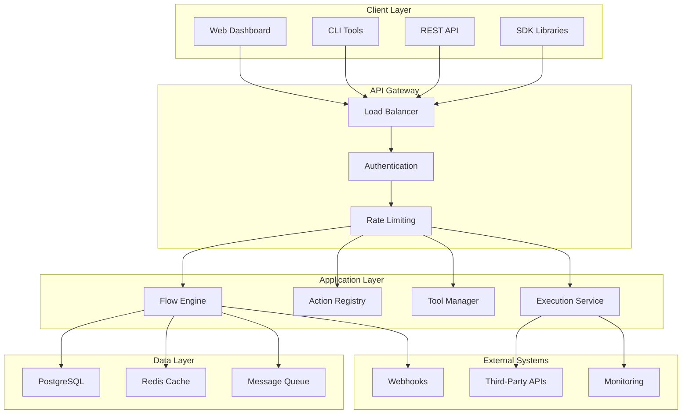

# Architecture Overview

Tolstoy is built with a modern, cloud-native architecture designed to handle enterprise-scale workloads while maintaining simplicity for developers and end users. This overview explains how the system works under the hood and why it's architected this way.

## High-Level Architecture



## Core Components

### 1. API Gateway Layer

The API Gateway serves as the single entry point for all client interactions, providing:

**Load Balancing**
- Intelligent traffic distribution across multiple application instances
- Health checks and automatic failover
- Session affinity for stateful operations

**Authentication & Authorization**
- Multi-tenant authentication with organization isolation
- Role-based access control (RBAC)
- API key management and rotation
- OAuth 2.0 and JWT token validation

**Rate Limiting & Throttling**
- Per-tenant and per-user rate limits
- Burst capacity handling
- Fair queuing to prevent resource starvation
- DDoS protection and abuse prevention

### 2. Application Layer

#### Flow Engine
The heart of Tolstoy's workflow execution system:

```typescript
// Flow Engine Architecture
class FlowEngine {
  async executeFlow(flowDefinition: Flow, context: ExecutionContext) {
    // Parse flow definition
    const steps = this.parseSteps(flowDefinition.steps);
    
    // Create execution instance
    const execution = await this.createExecution(flowDefinition.id, context);
    
    // Execute steps with parallelism and error handling
    for (const step of steps) {
      if (step.parallel) {
        await this.executeParallelSteps(step.actions, execution);
      } else {
        await this.executeStep(step, execution);
      }
    }
    
    return execution;
  }
}
```

**Key Features:**
- **Parallel Execution**: Automatically identify and execute independent steps concurrently
- **Conditional Logic**: Evaluate `executeIf` conditions using a secure expression engine
- **Error Handling**: Built-in retry mechanisms with exponential backoff
- **State Management**: Maintain execution state across long-running workflows

#### Action Registry
Manages all available actions and their execution:

```typescript
interface ActionDefinition {
  key: string;
  name: string;
  toolId: string;
  method: 'GET' | 'POST' | 'PUT' | 'DELETE';
  endpoint: string;
  inputSchema: InputSchema[];
  outputMapping: OutputMapping;
}

class ActionRegistry {
  private actions: Map<string, ActionDefinition> = new Map();
  
  async executeAction(actionKey: string, inputs: any, context: ExecutionContext) {
    const action = this.actions.get(actionKey);
    const tool = await this.toolManager.getTool(action.toolId);
    
    // Validate inputs
    this.validateInputs(action.inputSchema, inputs);
    
    // Execute HTTP request
    const response = await this.httpClient.request({
      method: action.method,
      url: `${tool.baseUrl}${action.endpoint}`,
      data: inputs,
      headers: await tool.getAuthHeaders(context)
    });
    
    // Apply output mapping
    return this.mapOutput(action.outputMapping, response.data);
  }
}
```

#### Tool Manager
Handles integrations with external services:

**Authentication Management**
- Support for multiple auth types (API key, OAuth, Bearer token)
- Secure credential storage and rotation
- Connection health monitoring

**Connection Pooling**
- Efficient HTTP connection reuse
- Circuit breaker patterns for failing services
- Automatic retries with backoff strategies

### 3. Data Layer

#### PostgreSQL Database
Primary data store with optimized schema design:

```sql
-- Core tables with proper indexing
CREATE TABLE organizations (
    id UUID PRIMARY KEY,
    name VARCHAR(255) NOT NULL,
    created_at TIMESTAMP DEFAULT NOW()
);

CREATE TABLE flows (
    id UUID PRIMARY KEY,
    org_id UUID REFERENCES organizations(id),
    name VARCHAR(255) NOT NULL,
    definition JSONB NOT NULL,
    version INTEGER DEFAULT 1,
    created_at TIMESTAMP DEFAULT NOW()
);

CREATE INDEX idx_flows_org_id ON flows(org_id);
CREATE INDEX idx_flows_definition ON flows USING GIN (definition);

CREATE TABLE executions (
    id UUID PRIMARY KEY,
    flow_id UUID REFERENCES flows(id),
    status execution_status NOT NULL,
    started_at TIMESTAMP DEFAULT NOW(),
    completed_at TIMESTAMP,
    result JSONB
);

CREATE INDEX idx_executions_flow_id ON executions(flow_id);
CREATE INDEX idx_executions_status ON executions(status);
```

**Schema Highlights:**
- **Multi-tenant isolation**: Organization-based data separation
- **JSONB columns**: Flexible storage for workflow definitions and results
- **Optimized indexes**: Fast queries for execution monitoring and reporting
- **Audit trails**: Complete history of all changes and executions

#### Redis Cache
High-performance caching layer for:

**Session Management**
- User authentication tokens
- API rate limiting counters
- Temporary execution state

**Performance Optimization**
- Frequently accessed workflow definitions
- Tool configuration caching
- Result caching for expensive operations

**Distributed Locking**
- Prevent duplicate executions
- Coordinate multi-instance operations
- Resource allocation management

#### Message Queue (Inngest)
Reliable async processing with:

**Job Scheduling**
- Cron-based workflow triggers
- Delayed execution support
- Priority-based job processing

**Durability & Reliability**
- At-least-once delivery guarantees
- Automatic retry with exponential backoff
- Dead letter queues for failed jobs

**Scalability**
- Horizontal scaling of worker processes
- Load balancing across multiple workers
- Queue-based throttling and rate limiting

## Security Architecture

### Multi-Tenant Isolation

```typescript
// Tenant isolation at the application layer
class TenantMiddleware {
  async extractTenant(request: Request): Promise<Tenant> {
    const orgId = request.headers['x-org-id'];
    const tenant = await this.tenantService.getTenant(orgId);
    
    // Ensure user belongs to organization
    if (!tenant.hasUser(request.user.id)) {
      throw new UnauthorizedError();
    }
    
    return tenant;
  }
}

// Database queries always include tenant isolation
class FlowService {
  async getFlows(tenantId: string) {
    return this.db.query(
      'SELECT * FROM flows WHERE org_id = $1',
      [tenantId]
    );
  }
}
```

### Secrets Management

**Encryption at Rest**
- All sensitive data encrypted using AES-256
- Separate encryption keys per organization
- Integration with AWS KMS for key management

**Encryption in Transit**
- TLS 1.3 for all API communications
- Certificate pinning for critical connections
- Perfect forward secrecy

**Access Controls**
- Role-based permissions at the API level
- Resource-level authorization checks
- Audit logging for all sensitive operations

## Scalability & Performance

### Horizontal Scaling

**Stateless Application Design**
- No server-side session state
- All context passed in requests or stored in Redis
- Easy horizontal scaling of API servers

**Database Scaling**
- Read replicas for reporting and analytics queries
- Connection pooling with pgBouncer
- Prepared statements for performance

**Background Job Processing**
- Multiple worker processes for parallel job execution
- Queue-based load balancing
- Auto-scaling based on queue depth

### Performance Optimizations

**Caching Strategy**
```typescript
// Multi-level caching
class WorkflowService {
  async getWorkflow(id: string) {
    // L1: In-memory cache
    let workflow = this.memoryCache.get(id);
    if (workflow) return workflow;
    
    // L2: Redis cache
    workflow = await this.redisCache.get(`workflow:${id}`);
    if (workflow) {
      this.memoryCache.set(id, workflow);
      return workflow;
    }
    
    // L3: Database
    workflow = await this.database.getWorkflow(id);
    await this.redisCache.set(`workflow:${id}`, workflow, 300);
    this.memoryCache.set(id, workflow);
    
    return workflow;
  }
}
```

**Async Processing**
- Non-blocking I/O for all external API calls
- Bulk operations for database writes
- Streaming for large data transfers

## Monitoring & Observability

### Metrics Collection

**Application Metrics**
- Request latency and throughput
- Error rates and types
- Resource utilization (CPU, memory, disk)
- Custom business metrics (workflow success rates, execution times)

**Infrastructure Metrics**
- Database performance and connection counts
- Queue depth and processing rates
- Cache hit rates and memory usage
- Network latency and bandwidth

### Logging Strategy

```typescript
// Structured logging with correlation IDs
class Logger {
  logWorkflowExecution(execution: Execution, step: Step, result: any) {
    this.log.info({
      event: 'step_completed',
      executionId: execution.id,
      flowId: execution.flowId,
      stepName: step.name,
      duration: result.duration,
      status: result.status,
      timestamp: new Date().toISOString()
    });
  }
}
```

**Log Aggregation**
- Centralized logging with structured JSON format
- Correlation IDs for tracing requests across services
- Automatic log retention and archival
- Real-time alerting on error patterns

### Health Checks

**Application Health**
- Database connectivity checks
- External service availability
- Queue processing status
- Memory and resource utilization

**Business Health**
- Workflow success rates
- Average execution times
- Error patterns and trends
- User activity metrics

## Deployment Architecture

### Container Orchestration

```yaml
# Kubernetes deployment example
apiVersion: apps/v1
kind: Deployment
metadata:
  name: tolstoy-api
spec:
  replicas: 3
  selector:
    matchLabels:
      app: tolstoy-api
  template:
    metadata:
      labels:
        app: tolstoy-api
    spec:
      containers:
      - name: api
        image: tolstoy/api:latest
        ports:
        - containerPort: 3000
        env:
        - name: DATABASE_URL
          valueFrom:
            secretKeyRef:
              name: database-credentials
              key: url
        resources:
          requests:
            memory: "256Mi"
            cpu: "250m"
          limits:
            memory: "512Mi"
            cpu: "500m"
```

### Infrastructure as Code

**Terraform Configuration**
- Complete infrastructure definition in code
- Multi-environment deployments (dev, staging, production)
- Automated resource provisioning and updates
- State management and version control

**CI/CD Pipeline**
- Automated testing and deployment
- Blue-green deployment strategies
- Automated rollback on failure
- Security scanning and compliance checks

## Why This Architecture?

### Reliability
- **Redundancy**: Multiple instances and automatic failover
- **Data Durability**: ACID transactions and backup strategies
- **Error Recovery**: Comprehensive retry and fallback mechanisms

### Scalability
- **Horizontal Scaling**: Add capacity by adding more instances
- **Efficient Resource Use**: Optimized algorithms and caching
- **Queue-Based Processing**: Handle traffic spikes gracefully

### Security
- **Defense in Depth**: Multiple security layers and controls
- **Encryption Everywhere**: Data protection at rest and in transit
- **Audit Trail**: Complete visibility into all operations

### Maintainability
- **Clean Architecture**: Clear separation of concerns
- **Comprehensive Testing**: Unit, integration, and end-to-end tests
- **Monitoring & Alerting**: Proactive issue detection and resolution

---

This architecture ensures that Tolstoy can handle enterprise workloads while remaining simple for developers to use and maintain. The design principles of reliability, scalability, and security are baked into every layer of the system.