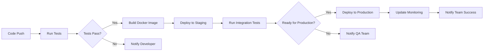
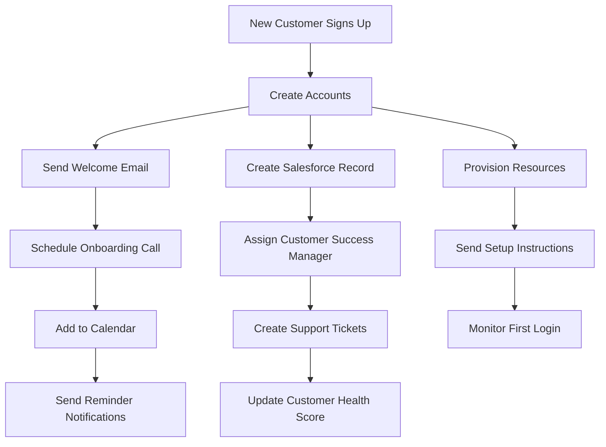
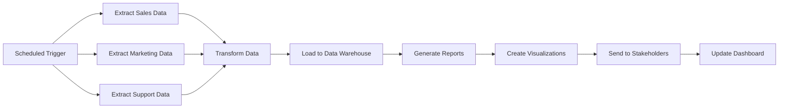
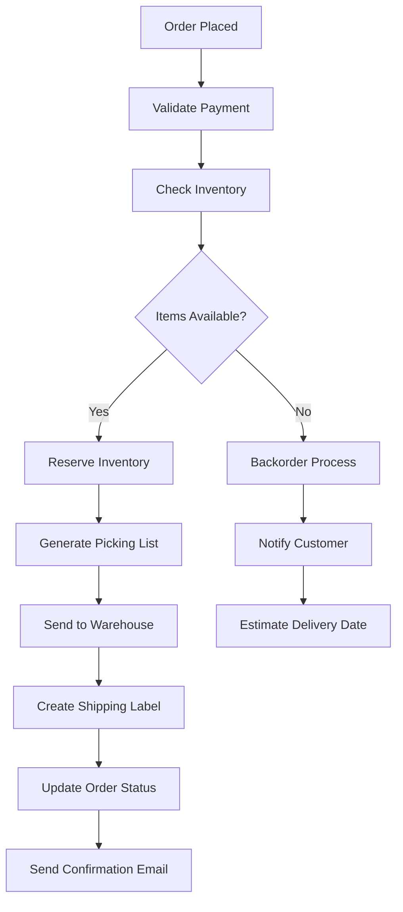
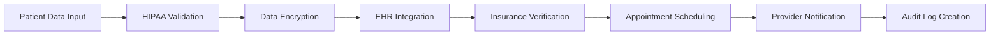

# Use Cases

Tolstoy's flexible architecture makes it perfect for automating workflows across different industries, team sizes, and use cases. Here are some of the most popular ways teams use Tolstoy to streamline their operations.

## 🚀 Development & Engineering

### CI/CD Pipeline Automation

**Problem**: Manual deployment processes are error-prone and time-consuming. Developers spend too much time on operational tasks instead of writing code.

**Solution**: Automate the entire development lifecycle from code commit to production deployment.



**Key Actions:**
- **GitHub Integration**: Listen for pull requests and code pushes
- **Test Execution**: Run unit tests, integration tests, and security scans
- **Docker Build**: Create and push container images to registry
- **Kubernetes Deployment**: Deploy applications to staging and production
- **Slack Notifications**: Keep teams informed of deployment status

**Results:**
- **80% faster deployments**: Reduce deployment time from hours to minutes
- **95% fewer deployment errors**: Eliminate human mistakes in the process
- **Improved developer experience**: Focus on code, not operations

---

### Incident Response Automation

**Problem**: When production incidents occur, response time is critical, but manual processes slow down resolution.

**Solution**: Automate incident detection, team notification, and initial response procedures.

```yaml
# Incident Response Workflow
name: "Critical Alert Response"
trigger: "monitoring-webhook"
steps:
  - name: "Parse Alert"
    action: "extract-alert-details"
    
  - name: "Create Incident"
    action: "create-pagerduty-incident"
    inputs:
      severity: "{{alert.severity}}"
      description: "{{alert.message}}"
      
  - name: "Notify On-Call Team"
    action: "send-slack-alert"
    inputs:
      channel: "#incidents"
      message: "🚨 Critical alert: {{alert.service}} is down"
      
  - name: "Start War Room"
    action: "create-zoom-meeting"
    executeIf: "alert.severity == 'critical'"
    
  - name: "Gather Context"
    parallel:
      - action: "fetch-recent-logs"
      - action: "check-system-metrics"
      - action: "query-error-tracking"
```

**Benefits:**
- **Mean Time to Response (MTTR)**: Reduce from 15 minutes to 2 minutes
- **Consistent Process**: Ensure the same response procedure every time
- **Context Gathering**: Automatically collect relevant information for faster debugging

---

## 💼 Business Operations

### Customer Onboarding Automation

**Problem**: Manual customer onboarding is inconsistent, slow, and requires coordination across multiple teams and systems.

**Solution**: Create a unified onboarding workflow that handles everything from account setup to first-value delivery.



**Automated Steps:**
1. **Account Provisioning**: Create user accounts in all necessary systems
2. **CRM Integration**: Update Salesforce with customer information and status
3. **Communication**: Send personalized welcome emails and setup guides
4. **Team Coordination**: Assign customer success managers and support contacts
5. **Resource Allocation**: Provision cloud resources and configure environments
6. **Follow-up**: Schedule calls, send reminders, and track progress

**Impact:**
- **Onboarding time reduced by 60%**: From 2 weeks to 3 days
- **Customer satisfaction increased by 40%**: Consistent, professional experience
- **Team efficiency improved**: Sales and CS teams focus on high-value activities

---

### Lead Qualification & Routing

**Problem**: Marketing generates hundreds of leads, but sales teams waste time on unqualified prospects.

**Solution**: Automatically score, qualify, and route leads to the right sales representatives.

```yaml
name: "Lead Processing Pipeline"
trigger: "form-submission"
steps:
  - name: "Enrich Lead Data"
    action: "clearbit-enrichment"
    inputs:
      email: "{{form.email}}"
      
  - name: "Calculate Lead Score"
    action: "evaluate-lead-score"
    inputs:
      company_size: "{{enriched.employee_count}}"
      industry: "{{enriched.industry}}"
      role: "{{form.job_title}}"
      budget: "{{form.budget}}"
      
  - name: "Qualify Lead"
    action: "determine-qualification"
    inputs:
      score: "{{lead_score}}"
      
  - name: "Route Qualified Leads"
    action: "assign-to-sales-rep"
    executeIf: "qualification == 'qualified'"
    inputs:
      territory: "{{enriched.location}}"
      industry: "{{enriched.industry}}"
      
  - name: "Send to Nurture Campaign"
    action: "add-to-marketo-campaign"
    executeIf: "qualification == 'nurture'"
    
  - name: "Notify Sales Rep"
    action: "send-slack-notification"
    executeIf: "qualification == 'qualified'"
    inputs:
      user: "{{assigned_rep}}"
      message: "New qualified lead: {{form.company}}"
```

**Results:**
- **Lead response time**: Reduced from 4 hours to 5 minutes
- **Qualification accuracy**: Improved by 75% with data enrichment
- **Sales productivity**: 50% more time spent on qualified prospects

---

## 📊 Data & Analytics

### Automated Reporting Pipeline

**Problem**: Creating weekly and monthly reports requires manual data gathering from multiple sources, taking hours of analyst time.

**Solution**: Automate data collection, processing, and report generation across all business systems.



**Data Sources:**
- **Salesforce**: Sales performance, pipeline data, closed deals
- **Google Analytics**: Website traffic, conversion rates, user behavior  
- **Zendesk**: Support ticket volume, resolution times, satisfaction scores
- **Stripe**: Revenue data, subscription metrics, churn rates
- **Google Ads**: Campaign performance, cost per acquisition, ROAS

**Automated Reports:**
- **Weekly Business Review**: Key metrics and trends
- **Monthly Executive Dashboard**: High-level performance indicators
- **Quarterly Board Reports**: Comprehensive business analysis
- **Daily Operations Reports**: Real-time operational metrics

**Benefits:**
- **Time savings**: 20 hours of manual work automated per week
- **Data accuracy**: Eliminate manual transcription errors
- **Real-time insights**: Fresh data available immediately
- **Stakeholder satisfaction**: Consistent, professional reporting

---

### Data Quality Monitoring

**Problem**: Data quality issues in the warehouse cause downstream problems in analytics and reporting.

**Solution**: Continuous monitoring of data quality with automated alerts and remediation.

```yaml
name: "Data Quality Monitor"
schedule: "0 */4 * * *"  # Every 4 hours
steps:
  - name: "Check Row Counts"
    action: "validate-table-counts"
    inputs:
      tables: ["users", "orders", "products"]
      threshold_pct: 10  # Alert if >10% change
      
  - name: "Validate Schema"
    action: "check-schema-changes"
    inputs:
      critical_tables: ["users", "orders"]
      
  - name: "Check Null Values"
    action: "validate-required-fields"
    inputs:
      validations:
        - table: "users"
          required_fields: ["email", "created_at"]
        - table: "orders" 
          required_fields: ["user_id", "total_amount"]
          
  - name: "Alert Data Team"
    action: "send-slack-alert"
    executeIf: "any_checks_failed == true"
    inputs:
      channel: "#data-team"
      message: "Data quality issues detected: {{failed_checks}}"
      
  - name: "Create Data Incident"
    action: "create-jira-ticket"
    executeIf: "critical_failure == true"
    inputs:
      project: "DATA"
      issue_type: "Incident"
      summary: "Critical data quality failure"
```

---

## 🛒 E-commerce & Retail

### Order Processing Automation

**Problem**: Manual order processing creates delays, errors, and poor customer experience.

**Solution**: End-to-end order automation from placement to delivery tracking.



**Integration Points:**
- **Payment Gateway**: Stripe, PayPal payment validation
- **Inventory Management**: Real-time stock level checking
- **Warehouse Management**: Automatic pick list generation
- **Shipping Carriers**: Label creation and tracking integration
- **Customer Communication**: Email and SMS notifications
- **ERP System**: Financial record updates

---

### Customer Support Automation

**Problem**: High volume of repetitive customer inquiries overwhelm support teams.

**Solution**: Intelligent ticket routing and automated resolution for common issues.

```yaml
name: "Support Ticket Processing"
trigger: "zendesk-webhook"
steps:
  - name: "Analyze Inquiry"
    action: "classify-support-request"
    inputs:
      subject: "{{ticket.subject}}"
      description: "{{ticket.description}}"
      
  - name: "Auto-Resolve Simple Issues"
    action: "send-help-article"
    executeIf: "classification.confidence > 0.9 && classification.type == 'password_reset'"
    
  - name: "Route to Specialist"
    action: "assign-to-agent"
    executeIf: "classification.type == 'billing'"
    inputs:
      queue: "billing-specialists"
      
  - name: "Escalate Complex Issues"
    action: "create-high-priority-ticket"
    executeIf: "classification.sentiment == 'angry' && customer.tier == 'enterprise'"
    
  - name: "Update Customer"
    action: "send-acknowledgment-email"
    inputs:
      template: "{{classification.type}}_acknowledgment"
      estimated_response: "{{queue.sla}}"
```

---

## 🏥 Healthcare & Compliance

### Patient Data Processing

**Problem**: Healthcare providers need to process patient data across multiple systems while maintaining HIPAA compliance.

**Solution**: Secure, compliant workflows for patient data management and care coordination.



**Compliance Features:**
- **Data Encryption**: All PHI encrypted in transit and at rest
- **Access Controls**: Role-based access with audit trails
- **Audit Logging**: Complete compliance audit trail
- **Data Retention**: Automated data lifecycle management
- **Secure Communication**: HIPAA-compliant messaging between systems

---

## 🎓 Education

### Student Enrollment Automation

**Problem**: Manual student enrollment processes are slow and error-prone, creating poor first impressions.

**Solution**: Streamlined enrollment from application to first day of class.

```yaml
name: "Student Enrollment Process"
trigger: "application-submitted"
steps:
  - name: "Review Application"
    action: "evaluate-eligibility"
    inputs:
      transcripts: "{{application.transcripts}}"
      test_scores: "{{application.test_scores}}"
      
  - name: "Send Acceptance Letter"
    action: "generate-acceptance-letter"
    executeIf: "eligibility.status == 'accepted'"
    
  - name: "Create Student Account"
    action: "provision-student-systems"
    inputs:
      student_id: "{{application.id}}"
      programs: "{{application.programs}}"
      
  - name: "Schedule Orientation"
    action: "add-to-orientation-calendar"
    
  - name: "Financial Aid Processing"
    action: "initiate-financial-aid"
    executeIf: "application.financial_aid == true"
    
  - name: "Welcome Package"
    action: "send-welcome-materials"
    inputs:
      delivery_method: "{{student.preference}}"
```

---

## Getting Started with Your Use Case

<CardGroup cols={2}>
  <Card title="Browse Templates" icon="template" href="/product/tutorials/github-slack-workflow">
    Start with pre-built templates for common use cases
  </Card>
  <Card title="Build From Scratch" icon="wrench" href="/product/getting-started/first-workflow">
    Create a custom workflow for your specific needs
  </Card>
</CardGroup>

<CardGroup cols={2}>
  <Card title="Integration Library" icon="puzzle-piece" href="/product/integrations/overview">
    Explore available integrations and connectors
  </Card>
  <Card title="Best Practices" icon="star" href="/product/workflows/best-practices">
    Learn how to design effective, maintainable workflows
  </Card>
</CardGroup>

## Need Help Identifying Your Use Case?

If you're not sure how Tolstoy can help your specific situation, consider these questions:

1. **What repetitive tasks does your team perform daily?**
2. **Which processes require coordination across multiple tools or teams?**
3. **Where do manual errors most commonly occur in your workflows?**
4. **What reports or notifications do you create manually on a regular basis?**
5. **Which integrations between systems are currently missing or problematic?**

The answers to these questions often reveal excellent automation opportunities. Start with one small workflow and expand from there as you see the benefits.

---

*These use cases represent just a small sample of what's possible with Tolstoy. The flexible architecture means you can automate virtually any process that involves multiple systems, data transformation, or conditional logic.*