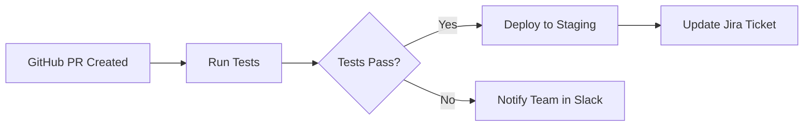
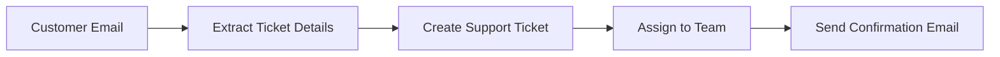

# What is Tolstoy?

Tolstoy is a powerful workflow automation platform designed to help teams and organizations streamline their business processes by connecting different tools, services, and systems. Whether you're automating simple tasks or orchestrating complex multi-step workflows, Tolstoy provides the infrastructure and tools you need to build reliable, scalable automation solutions.

## Core Concept

At its heart, Tolstoy transforms manual, repetitive tasks into automated workflows. Instead of jumping between different applications, copying data, and performing routine operations manually, Tolstoy allows you to define these processes once and execute them automatically whenever needed.

<CardGroup cols={3}>
  <Card title="Connect" icon="link" iconType="duotone">
    Connect any API, service, or system using our flexible tool integration system
  </Card>
  <Card title="Automate" icon="robot" iconType="duotone">
    Build sophisticated workflows with conditional logic, error handling, and parallel execution
  </Card>
  <Card title="Scale" icon="chart-line-up" iconType="duotone">
    Handle everything from simple notifications to complex enterprise processes at scale
  </Card>
</CardGroup>

## How It Works

Tolstoy operates on three fundamental building blocks:

### 1. Tools
**Tools** represent external services, APIs, or systems that your workflows interact with. This could be:
- Communication platforms (Slack, Microsoft Teams)
- Development tools (GitHub, GitLab, Jira)
- CRM systems (Salesforce, HubSpot)
- Databases and data warehouses
- Custom APIs and internal services

### 2. Actions
**Actions** are reusable components that define specific operations within your tools. For example:
- Send a Slack message
- Create a GitHub issue
- Query a database
- Call a REST API endpoint
- Execute custom code

### 3. Flows
**Flows** are the workflows themselves - sequences of actions that execute in a defined order. Flows can include:
- Sequential steps
- Parallel execution branches  
- Conditional logic (if/then/else)
- Error handling and retry mechanisms
- Input validation and data transformation

## Real-World Examples

### Development Team Automation

### Customer Support Workflow

### Data Pipeline

## Key Benefits

### Increased Efficiency
Eliminate manual tasks and reduce time spent on repetitive operations. Teams can focus on high-value work while Tolstoy handles routine processes.

### Improved Reliability
Automated workflows reduce human error and ensure consistent execution. Built-in retry mechanisms and error handling make your processes more resilient.

### Better Integration
Connect disparate systems and tools that don't natively work together. Create seamless data flow across your entire technology stack.

### Scalable Operations
Handle increasing workloads without proportionally increasing manual effort. Tolstoy scales with your business needs.

### Enhanced Visibility
Monitor all your automated processes in one place. Track performance, identify bottlenecks, and optimize your workflows over time.

## Who Uses Tolstoy?

### Development Teams
- Automate CI/CD pipelines
- Sync code repositories with project management tools
- Automate testing and deployment workflows
- Manage infrastructure and monitoring

### Operations Teams
- Automate incident response procedures
- Streamline onboarding and offboarding processes
- Manage compliance and audit workflows
- Integrate monitoring and alerting systems

### Business Teams
- Automate customer communication workflows
- Sync data between CRM and marketing tools
- Generate and distribute reports
- Manage approval processes

### Data Teams
- Build automated data pipelines
- Schedule and manage data processing jobs
- Automate data quality checks
- Integrate multiple data sources

## Getting Started

Ready to start automating? Here are your next steps:

<CardGroup cols={2}>
  <Card title="Quick Start Guide" icon="rocket" href="/product/getting-started/first-workflow">
    Build your first workflow in under 10 minutes
  </Card>
  <Card title="Explore Use Cases" icon="lightbulb" href="/product/overview/use-cases">
    See what's possible with real-world examples
  </Card>
</CardGroup>

<CardGroup cols={2}>
  <Card title="Key Features" icon="star" href="/product/overview/key-features">
    Explore all the powerful features Tolstoy offers
  </Card>
  <Card title="Architecture Overview" icon="building" href="/product/overview/architecture">
    Understand how Tolstoy works under the hood
  </Card>
</CardGroup>

## Need Help?

- **[Getting Started Guide](/product/getting-started/account-setup)** - Set up your account and build your first workflow
- **[Tutorials](/product/tutorials/github-slack-workflow)** - Step-by-step guides for common use cases
- **[CLI Documentation](/cli/getting-started/installation)** - Command-line tools for developers
- **[API Reference](/api/overview/introduction)** - Complete REST API documentation

---

*Tolstoy empowers teams to build powerful automation without the complexity. Start automating today and transform how your team works.*