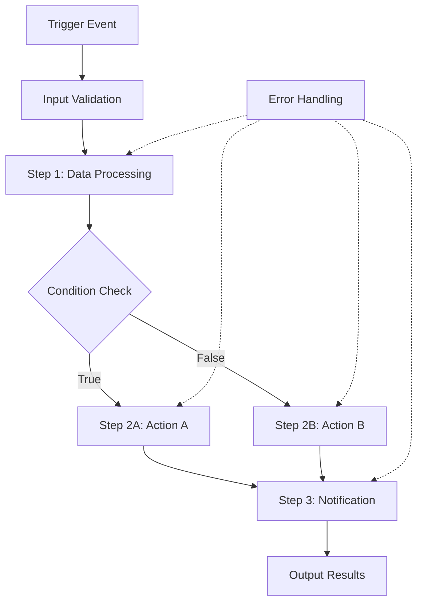

# Workflows Guide

Workflows are the heart of Tolstoy's automation platform. They define the sequence of actions, conditions, and integrations that power your business processes. This comprehensive guide covers everything from basic workflow concepts to advanced enterprise patterns.

## 📚 What You'll Learn

<CardGroup cols={2}>
  <Card title="Workflow Fundamentals" icon="book">
    **Core Concepts**
    - Understanding flows, steps, and actions
    - Input/output data handling
    - Variable substitution and templating
    - Basic conditional logic
  </Card>
  <Card title="Advanced Techniques" icon="brain">
    **Complex Patterns**
    - Parallel execution and optimization
    - Error handling and retry strategies
    - Loop constructs and data iteration
    - State management and persistence
  </Card>
</CardGroup>

<CardGroup cols={2}>
  <Card title="Best Practices" icon="star">
    **Production-Ready Workflows**
    - Design principles and patterns
    - Performance optimization
    - Security considerations
    - Testing and validation
  </Card>
  <Card title="Troubleshooting" icon="tools">
    **Debug and Optimize**
    - Common issues and solutions
    - Monitoring and observability
    - Performance profiling
    - Maintenance strategies
  </Card>
</CardGroup>

---

## 🏗️ Workflow Architecture

Understanding how workflows operate at a fundamental level helps you build more effective automations.

### Anatomy of a Workflow



### Core Components

<Accordion title="Triggers - How Workflows Start">
**Trigger Types:**
- **Webhook Triggers** - HTTP requests from external systems
- **Scheduled Triggers** - Time-based execution with cron expressions
- **Event Triggers** - Internal system events and notifications
- **Manual Triggers** - User-initiated workflow execution
- **API Triggers** - Direct API calls to execute workflows

**Example Webhook Trigger:**
```json
{
  "trigger": {
    "type": "webhook",
    "path": "/webhooks/customer-signup",
    "method": "POST",
    "authentication": "api_key"
  }
}
```
</Accordion>

<Accordion title="Steps - Building Blocks of Logic">
**Step Properties:**
- **Unique Key** - Identifier for referencing step outputs
- **Action Reference** - Which action to execute
- **Input Mapping** - How to pass data to the action
- **Conditional Execution** - When to run this step
- **Error Handling** - What to do if step fails

**Example Step Definition:**
```yaml
- key: "process-order"
  name: "Process Customer Order"
  action: "validate-payment"
  inputs:
    amount: "{{workflow.inputs.order_total}}"
    customer_id: "{{workflow.inputs.customer_id}}"
    payment_method: "{{workflow.inputs.payment_token}}"
  executeIf: "{{workflow.inputs.order_total}} > 0"
  onError:
    action: "send-error-notification"
    inputs:
      message: "Payment validation failed: {{error.message}}"
```
</Accordion>

<Accordion title="Variables - Data Flow Management">
**Variable Sources:**
- **Workflow Inputs** - Data provided when workflow starts
- **Step Outputs** - Results from previous step executions
- **Environment Variables** - System and configuration values
- **Secrets** - Encrypted credentials and sensitive data
- **System Variables** - Current time, execution ID, etc.

**Variable Syntax:**
```yaml
# Workflow input variables
customer_email: "{{workflow.inputs.email}}"

# Step output variables  
order_id: "{{steps.create-order.output.id}}"

# System variables
execution_time: "{{now}}"
workflow_id: "{{workflow.id}}"

# Environment variables
api_base_url: "{{env.API_BASE_URL}}"

# Secret variables
api_key: "{{secrets.payment_gateway_key}}"
```
</Accordion>

<Accordion title="Conditions - Decision Making Logic">
**Condition Types:**
- **Value Comparisons** - Equal, not equal, greater than, less than
- **Pattern Matching** - Regular expressions and string contains
- **Type Checking** - Null checks, type validation
- **Complex Logic** - AND, OR, NOT combinations

**Example Conditions:**
```yaml
# Simple equality
executeIf: "{{steps.validate-email.output.valid}} == true"

# Numeric comparisons
executeIf: "{{workflow.inputs.order_total}} >= 100"

# String matching
executeIf: "{{workflow.inputs.customer_tier}} in ['gold', 'platinum']"

# Complex conditions
executeIf: "{{steps.check-inventory.output.available}} == true && {{workflow.inputs.rush_order}} != true"

# Pattern matching
executeIf: "{{workflow.inputs.email}} matches '^[^@]+@company\\.com$'"
```
</Accordion>

---

## ⚡ Execution Modes

Tolstoy supports multiple execution modes to handle different workflow requirements.

### Synchronous Execution

**Best For:**
- Real-time API responses
- User-facing interactions
- Simple, fast workflows
- Immediate result requirements

**Characteristics:**
- Blocks until completion
- Returns results immediately
- 30-second timeout limit
- Direct error propagation

```typescript
// Synchronous execution example
const result = await client.flows.execute('flow_123', {
  inputs: { customer_id: 'cust_456' },
  mode: 'sync'
});

console.log('Order processed:', result.outputs.order_id);
```

### Asynchronous Execution

**Best For:**
- Long-running processes
- Multi-step integrations
- Batch operations
- Background processing

**Characteristics:**
- Returns execution ID immediately
- Runs in background
- Progress tracking available
- Webhook notifications on completion

```typescript
// Asynchronous execution example
const execution = await client.flows.execute('flow_123', {
  inputs: { batch_size: 1000 },
  mode: 'async',
  webhook_url: 'https://myapp.com/webhooks/completion'
});

console.log('Execution started:', execution.id);

// Check status later
const status = await client.executions.get(execution.id);
console.log('Progress:', status.progress.percentage);
```

### Durable Execution

**Best For:**
- Mission-critical workflows
- Multi-day processes
- Event-driven workflows
- High reliability requirements

**Characteristics:**
- Survives system restarts
- Automatic state recovery
- Event-based triggers
- Built-in retry logic

```yaml
name: "Customer Onboarding Journey"
execution_mode: "durable"
settings:
  durability:
    persist_state: true
    checkpoint_frequency: "every_step"
    max_execution_time: "72h"
    
steps:
  - key: "send-welcome-email"
    action: "email-send"
    retry_policy:
      max_attempts: 3
      backoff: "exponential"
      
  - key: "wait-for-email-confirmation"
    action: "wait-for-event"
    timeout: "24h"
    event_filter: "email_confirmed"
    
  - key: "schedule-onboarding-call"
    action: "calendar-schedule"
    executeIf: "{{steps.wait-for-email-confirmation.output.confirmed}} == true"
```

---

## 🔄 Advanced Workflow Patterns

Learn sophisticated patterns for complex business logic.

### Parallel Processing

Execute multiple steps simultaneously for better performance.

```yaml
name: "Parallel Data Processing"
steps:
  - key: "fetch-user-data"
    action: "database-query"
    
  - key: "parallel-processing"
    type: "parallel"
    branches:
      - name: "process-orders"
        steps:
          - action: "fetch-orders"
            inputs:
              user_id: "{{steps.fetch-user-data.output.id}}"
          - action: "calculate-order-metrics"
            
      - name: "process-preferences"
        steps:
          - action: "fetch-preferences"
            inputs:
              user_id: "{{steps.fetch-user-data.output.id}}"
          - action: "apply-personalization"
          
      - name: "process-analytics"
        steps:
          - action: "fetch-analytics"
          - action: "generate-insights"
    
  - key: "combine-results"
    action: "merge-data"
    inputs:
      orders: "{{steps.parallel-processing.branches.process-orders.output}}"
      preferences: "{{steps.parallel-processing.branches.process-preferences.output}}"
      analytics: "{{steps.parallel-processing.branches.process-analytics.output}}"
```

### Error Recovery Patterns

Handle failures gracefully with multiple recovery strategies.

```yaml
name: "Resilient Payment Processing"
steps:
  - key: "primary-payment"
    action: "charge-primary-card"
    inputs:
      amount: "{{workflow.inputs.amount}}"
      card_token: "{{workflow.inputs.primary_card}}"
    onError:
      strategy: "continue"  # Don't fail the workflow
      
  - key: "backup-payment"
    action: "charge-backup-card"
    inputs:
      amount: "{{workflow.inputs.amount}}"
      card_token: "{{workflow.inputs.backup_card}}"
    executeIf: "{{steps.primary-payment.status}} == 'failed'"
    retry_policy:
      max_attempts: 2
      delay: "5s"
      
  - key: "manual-review"
    action: "create-manual-review-task"
    inputs:
      customer_id: "{{workflow.inputs.customer_id}}"
      amount: "{{workflow.inputs.amount}}"
      primary_error: "{{steps.primary-payment.error.message}}"
      backup_error: "{{steps.backup-payment.error.message}}"
    executeIf: "{{steps.primary-payment.status}} == 'failed' && {{steps.backup-payment.status}} == 'failed'"
    
  - key: "send-confirmation"
    action: "send-payment-confirmation"
    executeIf: "{{steps.primary-payment.status}} == 'completed' || {{steps.backup-payment.status}} == 'completed'"
```

### Loop and Iteration Patterns

Process collections of data efficiently.

```yaml
name: "Batch Processing with Loops"
steps:
  - key: "fetch-pending-orders"
    action: "database-query"
    inputs:
      query: "SELECT * FROM orders WHERE status = 'pending' LIMIT 100"
      
  - key: "process-orders-batch"
    type: "forEach"
    items: "{{steps.fetch-pending-orders.output.rows}}"
    item_variable: "order"
    steps:
      - key: "validate-order"
        action: "validate-order-data"
        inputs:
          order_id: "{{order.id}}"
          
      - key: "process-payment"
        action: "charge-customer"
        inputs:
          amount: "{{order.total}}"
          customer_id: "{{order.customer_id}}"
        executeIf: "{{steps.validate-order.output.valid}} == true"
        
      - key: "fulfill-order"
        action: "send-to-warehouse"
        inputs:
          order_id: "{{order.id}}"
          items: "{{order.line_items}}"
        executeIf: "{{steps.process-payment.output.success}} == true"
        
      - key: "update-status"
        action: "database-update"
        inputs:
          table: "orders"
          where: "id = {{order.id}}"
          set:
            status: "{{steps.process-payment.output.success ? 'processed' : 'payment_failed'}}"
            updated_at: "{{now}}"
            
    batch_settings:
      max_parallel: 10
      continue_on_error: true
      collect_errors: true
      
  - key: "send-batch-summary"
    action: "send-email-report"
    inputs:
      to: "operations@company.com"
      subject: "Batch Processing Complete"
      template: "batch_summary"
      data:
        total_processed: "{{steps.process-orders-batch.summary.total}}"
        successful: "{{steps.process-orders-batch.summary.successful}}"
        failed: "{{steps.process-orders-batch.summary.failed}}"
        errors: "{{steps.process-orders-batch.summary.errors}}"
```

### State Machine Pattern

Model complex business processes with state transitions.

```yaml
name: "Order Fulfillment State Machine"
initial_state: "pending"
states:
  pending:
    actions:
      - key: "validate-order"
        action: "validate-order-details"
    transitions:
      - condition: "{{steps.validate-order.output.valid}} == true"
        to_state: "payment_processing"
      - condition: "{{steps.validate-order.output.valid}} == false"
        to_state: "validation_failed"
        
  payment_processing:
    actions:
      - key: "charge-payment"
        action: "process-payment"
        retry_policy:
          max_attempts: 3
    transitions:
      - condition: "{{steps.charge-payment.output.success}} == true"
        to_state: "fulfillment"
      - condition: "{{steps.charge-payment.output.decline_reason}} == 'insufficient_funds'"
        to_state: "payment_declined"
      - condition: "{{steps.charge-payment.status}} == 'failed'"
        to_state: "payment_error"
        
  fulfillment:
    actions:
      - key: "allocate-inventory"
        action: "reserve-items"
      - key: "generate-pick-list"
        action: "create-warehouse-task"
      - key: "notify-warehouse"
        action: "send-notification"
    transitions:
      - condition: "all_actions_completed == true"
        to_state: "shipped"
        
  shipped:
    actions:
      - key: "generate-tracking"
        action: "create-tracking-number"
      - key: "send-confirmation"
        action: "email-customer"
      - key: "update-crm"
        action: "sync-order-status"
    final_state: true
    
  validation_failed:
    actions:
      - key: "create-review-task"
        action: "manual-review"
    final_state: true
    
  payment_declined:
    actions:
      - key: "notify-customer"
        action: "send-decline-email"
    final_state: true
    
  payment_error:
    actions:
      - key: "alert-finance-team"
        action: "send-alert"
    transitions:
      - condition: "manual_retry_requested == true"
        to_state: "payment_processing"
    timeout: "24h"
    timeout_transition: "validation_failed"
```

---

## 🎯 Best Practices

### Design Principles

<CardGroup cols={2}>
  <Card title="Single Responsibility" icon="focus">
    Each workflow should have one clear purpose. Break complex processes into multiple focused workflows that can be composed together.
  </Card>
  <Card title="Idempotency" icon="shield-check">
    Design steps to be safely repeatable. The same input should always produce the same output without harmful side effects.
  </Card>
</CardGroup>

<CardGroup cols={2}>
  <Card title="Fail Fast" icon="zap">
    Validate inputs early and fail quickly on invalid data. Don't waste resources on processing that will ultimately fail.
  </Card>
  <Card title="Graceful Degradation" icon="life-ring">
    Handle partial failures elegantly. Provide meaningful error messages and alternative execution paths.
  </Card>
</CardGroup>

### Performance Optimization

<Accordion title="Minimize Network Calls">
**Strategies:**
- Batch API requests when possible
- Cache frequently accessed data
- Use parallel execution for independent operations
- Implement request deduplication

**Example:**
```yaml
# Instead of multiple individual API calls
- key: "batch-user-lookup"
  action: "bulk-user-query"
  inputs:
    user_ids: ["{{user1}}", "{{user2}}", "{{user3}}"]
    
# Instead of sequential processing
- key: "parallel-validation"
  type: "parallel"
  branches:
    - action: "validate-email"
    - action: "validate-phone"
    - action: "validate-address"
```
</Accordion>

<Accordion title="Optimize Data Transfer">
**Techniques:**
- Only transfer necessary data between steps
- Use data transformation to reduce payload size
- Implement streaming for large datasets
- Compress data when appropriate

**Example:**
```yaml
- key: "extract-essentials"
  action: "transform-data"
  inputs:
    source: "{{steps.fetch-customer.output}}"
    extract:
      - "id"
      - "email" 
      - "tier"
    # Don't pass full customer object to next step
```
</Accordion>

<Accordion title="Resource Management">
**Best Practices:**
- Set appropriate timeouts for each step
- Implement circuit breakers for external services
- Use connection pooling for database operations
- Clean up temporary resources

**Example:**
```yaml
steps:
  - key: "api-call-with-timeout"
    action: "external-api-call"
    timeout: "30s"  # Don't wait forever
    circuit_breaker:
      failure_threshold: 5
      recovery_timeout: "60s"
      
  - key: "cleanup-temp-files"
    action: "delete-temp-data"
    inputs:
      file_paths: "{{steps.process-data.output.temp_files}}"
    always_execute: true  # Run even if previous steps fail
```
</Accordion>

### Security Considerations

<Accordion title="Data Protection">
**Critical Practices:**
- Never log sensitive data (passwords, API keys, PII)
- Use secrets management for credentials
- Encrypt data in transit and at rest
- Implement data retention policies

**Example:**
```yaml
- key: "secure-api-call"
  action: "external-api"
  inputs:
    url: "{{env.API_BASE_URL}}/secure-endpoint"
    headers:
      Authorization: "Bearer {{secrets.api_token}}"
    # Don't log request/response for sensitive endpoints
    log_level: "info"
    log_request: false
    log_response: false
```
</Accordion>

<Accordion title="Input Validation">
**Validation Strategies:**
- Validate all external inputs
- Sanitize data before processing
- Check data types and ranges
- Implement rate limiting

**Example:**
```yaml
- key: "validate-inputs"
  action: "input-validator"
  inputs:
    schema:
      email:
        type: "string"
        format: "email"
        required: true
      age:
        type: "integer"
        minimum: 0
        maximum: 150
      preferences:
        type: "array"
        items:
          type: "string"
          enum: ["email", "sms", "push"]
```
</Accordion>

---

## 📊 Monitoring and Debugging

### Execution Monitoring

Track workflow performance and health with comprehensive monitoring.

```yaml
name: "Monitored Workflow"
settings:
  monitoring:
    enable_metrics: true
    track_performance: true
    alert_on_failure: true
    
  alerting:
    slack_webhook: "{{secrets.monitoring_slack_webhook}}"
    email_recipients: ["ops@company.com"]
    alert_conditions:
      - condition: "execution_time > 300000"  # 5 minutes
        message: "Workflow execution time exceeded threshold"
      - condition: "error_rate > 0.05"  # 5% error rate
        message: "High error rate detected"
        
steps:
  - key: "track-start-time"
    action: "log-metric"
    inputs:
      metric: "workflow_started"
      labels:
        workflow_id: "{{workflow.id}}"
        version: "{{workflow.version}}"
        
  - key: "main-processing"
    action: "process-data"
    monitoring:
      track_duration: true
      alert_on_timeout: true
      
  - key: "track-completion"
    action: "log-metric"
    inputs:
      metric: "workflow_completed"
      duration: "{{execution.duration_ms}}"
      success: "{{execution.success}}"
```

### Debugging Techniques

<Accordion title="Structured Logging">
Implement consistent, searchable logging throughout your workflows.

```yaml
- key: "debug-logging-example"
  action: "process-order"
  inputs:
    order_data: "{{workflow.inputs.order}}"
  debug:
    log_inputs: true
    log_outputs: true
    custom_logs:
      - level: "info"
        message: "Processing order {{workflow.inputs.order.id}} for customer {{workflow.inputs.order.customer_id}}"
      - level: "debug"
        message: "Order items: {{workflow.inputs.order.items | length}}"
```
</Accordion>

<Accordion title="Error Context Collection">
Gather rich context when errors occur to aid in debugging.

```yaml
- key: "payment-processing"
  action: "charge-customer"
  onError:
    action: "collect-error-context"
    inputs:
      error_details: "{{error}}"
      context:
        customer_id: "{{workflow.inputs.customer_id}}"
        order_total: "{{workflow.inputs.amount}}"
        payment_method: "{{workflow.inputs.payment_method}}"
        execution_id: "{{execution.id}}"
        timestamp: "{{now}}"
        user_agent: "{{headers.user_agent}}"
        ip_address: "{{headers.x_forwarded_for}}"
```
</Accordion>

<Accordion title="Tracing and Observability">
Implement distributed tracing for complex workflows.

```yaml
name: "Traced Workflow"
settings:
  tracing:
    enable: true
    service_name: "order-processing"
    
steps:
  - key: "create-span"
    action: "start-trace-span"
    inputs:
      operation: "validate-order"
      tags:
        order_id: "{{workflow.inputs.order_id}}"
        customer_tier: "{{workflow.inputs.customer_tier}}"
        
  - key: "validate-order"
    action: "order-validator"
    trace_span: "{{steps.create-span.output.span_id}}"
    
  - key: "finish-span"
    action: "finish-trace-span"
    inputs:
      span_id: "{{steps.create-span.output.span_id}}"
      success: "{{steps.validate-order.output.valid}}"
```
</Accordion>

---

## 🚀 Getting Started

Ready to build your first advanced workflow? Start with these resources:

<CardGroup cols={2}>
  <Card title="Quick Start Tutorial" icon="play" href="/product/getting-started/first-workflow">
    Build your first workflow in under 10 minutes
  </Card>
  <Card title="GitHub-Slack Integration" icon="github" href="/product/tutorials/github-slack-workflow">
    Complete tutorial building a real-world integration
  </Card>
</CardGroup>

<CardGroup cols={2}>
  <Card title="Workflow Templates" icon="template" href="/product/templates/overview">
    Pre-built workflows for common use cases
  </Card>
  <Card title="API Reference" icon="code" href="/api/flows/post-flows">
    Complete API documentation for workflow management
  </Card>
</CardGroup>

---

<Info>
**Need Help?** Join our community Discord or check out the troubleshooting guide for common workflow issues and solutions.
</Info>