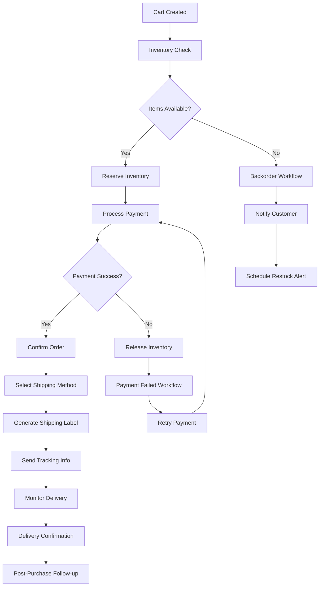

# E-commerce Order Automation

Build a comprehensive e-commerce automation system that handles the entire order lifecycle from cart creation to delivery confirmation, with real-time inventory management and customer communications.

## Overview

This example demonstrates:
- **End-to-end order processing** from cart to delivery
- **Real-time inventory management** with automated restocking
- **Multi-channel customer communications** (email, SMS, push notifications)  
- **Payment processing integration** with multiple providers
- **Shipping automation** with carrier selection and tracking
- **Return and refund workflows** with automated approvals
- **Customer analytics and insights** for business optimization

## Architecture



## Implementation

### 1. Core Order Processing Service

```typescript
import { TolstoyClient } from '@joosuhail/tolstoy-sdk';
import { EventEmitter } from 'events';

interface Product {
  id: string;
  sku: string;
  name: string;
  price: number;
  weight: number;
  dimensions: {
    length: number;
    width: number;
    height: number;
  };
  category: string;
  tags: string[];
}

interface OrderItem {
  productId: string;
  sku: string;
  quantity: number;
  unitPrice: number;
  totalPrice: number;
  customizations?: Record<string, any>;
}

interface ShippingAddress {
  firstName: string;
  lastName: string;
  company?: string;
  addressLine1: string;
  addressLine2?: string;
  city: string;
  state: string;
  postalCode: string;
  country: string;
  phone?: string;
}

interface Order {
  id: string;
  customerId: string;
  customerEmail: string;
  items: OrderItem[];
  shippingAddress: ShippingAddress;
  billingAddress: ShippingAddress;
  paymentMethod: {
    type: 'credit_card' | 'paypal' | 'apple_pay' | 'stripe';
    token: string;
    last4?: string;
  };
  shippingMethod: {
    carrier: string;
    service: string;
    cost: number;
    estimatedDays: number;
  };
  totals: {
    subtotal: number;
    tax: number;
    shipping: number;
    discount: number;
    total: number;
  };
  metadata: {
    source: string;
    campaignId?: string;
    couponCode?: string;
    notes?: string;
  };
}

interface OrderProcessingConfig {
  paymentProviders: {
    stripe: { apiKey: string; webhookSecret: string };
    paypal: { clientId: string; clientSecret: string };
  };
  shippingCarriers: {
    ups: { apiKey: string; accountNumber: string };
    fedex: { apiKey: string; meterNumber: string };
    usps: { apiKey: string };
  };
  notifications: {
    email: { provider: 'sendgrid' | 'mailgun'; apiKey: string };
    sms: { provider: 'twilio'; accountSid: string; authToken: string };
  };
  inventory: {
    warehouse: { defaultLocation: string };
    lowStockThreshold: number;
    autoReorderEnabled: boolean;
  };
}

class EcommerceOrderService extends EventEmitter {
  private client: TolstoyClient;
  private config: OrderProcessingConfig;
  private activeOrders = new Map<string, OrderProcessingSession>();
  
  constructor(client: TolstoyClient, config: OrderProcessingConfig) {
    super();
    this.client = client;
    this.config = config;
    
    // Set up webhook monitoring for order events
    this.setupOrderWebhooks();
  }
  
  async processOrder(order: Order): Promise<OrderProcessingResult> {
    const sessionId = this.generateSessionId(order.id);
    console.log(`🛒 Processing order ${order.id} (${sessionId})`);
    
    try {
      // Create order processing session
      const session = new OrderProcessingSession(sessionId, order);
      this.activeOrders.set(sessionId, session);
      
      // Emit order processing started event
      this.emit('order:processing_started', { sessionId, order });
      
      // Validate order data
      await this.validateOrder(order);
      
      // Execute comprehensive order processing workflow
      const execution = await this.executeOrderWorkflow(order, sessionId);
      
      // Set up order tracking and monitoring
      await this.setupOrderMonitoring(sessionId, execution.executionId, order);
      
      // Update session
      session.executionId = execution.executionId;
      session.status = 'processing';
      session.startedAt = new Date();
      
      console.log(`✅ Order processing initiated: ${execution.executionId}`);
      
      return {
        success: true,
        sessionId,
        executionId: execution.executionId,
        estimatedProcessingTime: this.estimateProcessingTime(order),
        trackingUrl: this.generateTrackingUrl(sessionId),
        nextSteps: this.getOrderNextSteps(order)
      };
      
    } catch (error) {
      console.error(`❌ Order processing failed for ${order.id}:`, error.message);
      
      // Clean up failed session
      this.activeOrders.delete(sessionId);
      
      // Emit failure event
      this.emit('order:processing_failed', { sessionId, order, error: error.message });
      
      // Handle inventory cleanup if needed
      await this.handleProcessingFailure(order, error);
      
      return {
        success: false,
        error: error.message,
        sessionId,
        retryable: this.isRetryableError(error)
      };
    }
  }
  
  private async executeOrderWorkflow(order: Order, sessionId: string) {
    // Prepare comprehensive workflow inputs
    const workflowInputs = {
      order: {
        id: order.id,
        customerId: order.customerId,
        customerEmail: order.customerEmail,
        items: order.items.map(item => ({
          ...item,
          product: this.enrichProductData(item.productId)
        })),
        shipping: {
          address: order.shippingAddress,
          method: order.shippingMethod
        },
        billing: {
          address: order.billingAddress,
          paymentMethod: {
            type: order.paymentMethod.type,
            token: order.paymentMethod.token,
            // Don't include sensitive data in workflow
            masked: order.paymentMethod.last4 ? `****${order.paymentMethod.last4}` : 'hidden'
          }
        },
        totals: order.totals,
        metadata: order.metadata
      },
      
      processing: {
        sessionId,
        timestamp: new Date().toISOString(),
        priority: this.calculateOrderPriority(order),
        warehouse: await this.selectOptimalWarehouse(order),
        flags: {
          requiresManualReview: this.requiresManualReview(order),
          isGift: this.isGiftOrder(order),
          isInternational: this.isInternationalOrder(order),
          hasCustomizations: this.hasCustomItems(order)
        }
      },
      
      inventory: {
        reservationStrategy: 'immediate',
        lowStockHandling: 'backorder',
        substitutionAllowed: false
      },
      
      payment: {
        provider: this.selectPaymentProvider(order.paymentMethod.type),
        retryAttempts: 3,
        fraudCheckEnabled: true,
        threeDSecureRequired: this.requiresThreeDSecure(order)
      },
      
      shipping: {
        carrierPreference: this.getCarrierPreference(order),
        insuranceRequired: order.totals.total > 100,
        signatureRequired: order.totals.total > 500,
        packingStrategy: this.getPackingStrategy(order.items)
      },
      
      communications: {
        email: {
          enabled: true,
          templates: this.getEmailTemplates(order),
          language: this.detectCustomerLanguage(order.customerEmail)
        },
        sms: {
          enabled: this.shouldSendSMS(order),
          phone: order.shippingAddress.phone
        },
        push: {
          enabled: this.hasCustomerApp(order.customerId),
          customerId: order.customerId
        }
      },
      
      analytics: {
        customerSegment: await this.getCustomerSegment(order.customerId),
        purchaseContext: {
          source: order.metadata.source,
          campaign: order.metadata.campaignId,
          discount: order.metadata.couponCode
        },
        trackingEvents: [
          'order_placed',
          'inventory_reserved',
          'payment_processed',
          'order_confirmed',
          'fulfillment_started',
          'shipped',
          'delivered'
        ]
      }
    };
    
    // Execute the main order processing workflow
    return await this.client.runFlow('ecommerce_order_processing_v3', workflowInputs);
  }
  
  async getOrderStatus(sessionId: string): Promise<OrderStatus> {
    const session = this.activeOrders.get(sessionId);
    
    if (!session) {
      throw new Error(`Order session not found: ${sessionId}`);
    }
    
    if (!session.executionId) {
      return {
        sessionId,
        orderId: session.order.id,
        status: session.status,
        stage: 'initializing',
        progress: 0
      };
    }
    
    try {
      // Get detailed execution status from Tolstoy
      const execution = await this.client.getFlowExecution(
        'ecommerce_order_processing_v3',
        session.executionId
      );
      
      const statusData = this.parseOrderExecutionStatus(execution.data);
      
      // Update session with latest information
      session.lastChecked = new Date();
      session.currentStage = statusData.stage;
      session.progress = statusData.progress;
      
      // Enrich with business logic
      const enrichedStatus: OrderStatus = {
        sessionId,
        orderId: session.order.id,
        status: statusData.status,
        stage: statusData.stage,
        progress: statusData.progress,
        currentStep: statusData.currentStep,
        completedSteps: statusData.completedSteps,
        estimatedDelivery: statusData.estimatedDelivery,
        trackingNumber: statusData.trackingNumber,
        paymentStatus: statusData.paymentStatus,
        fulfillmentStatus: statusData.fulfillmentStatus,
        lastUpdated: new Date().toISOString(),
        timeline: this.generateOrderTimeline(statusData),
        customerActions: this.getCustomerActions(statusData)
      };
      
      return enrichedStatus;
      
    } catch (error) {
      console.error(`Error getting order status for ${sessionId}:`, error.message);
      
      return {
        sessionId,
        orderId: session.order.id,
        status: 'error',
        stage: 'unknown',
        progress: session.progress || 0,
        error: error.message,
        lastUpdated: new Date().toISOString()
      };
    }
  }
  
  private parseOrderExecutionStatus(executionData: any): OrderExecutionStatus {
    // Map workflow execution status to business order status
    const stageMapping = {
      'inventory_check': { progress: 10, stage: 'inventory_validation' },
      'inventory_reserved': { progress: 20, stage: 'inventory_reserved' },
      'payment_processing': { progress: 30, stage: 'payment_processing' },
      'payment_completed': { progress: 40, stage: 'payment_confirmed' },
      'order_confirmed': { progress: 50, stage: 'order_confirmed' },
      'fulfillment_started': { progress: 60, stage: 'preparing_shipment' },
      'shipping_label_created': { progress: 70, stage: 'ready_to_ship' },
      'shipped': { progress: 80, stage: 'in_transit' },
      'out_for_delivery': { progress: 90, stage: 'out_for_delivery' },
      'delivered': { progress: 100, stage: 'delivered' }
    };
    
    const currentStep = executionData.currentStep || 'inventory_check';
    const mapping = stageMapping[currentStep] || { progress: 0, stage: 'processing' };
    
    return {
      status: executionData.status,
      stage: mapping.stage,
      progress: mapping.progress,
      currentStep,
      completedSteps: Object.keys(executionData.steps || {}).filter(
        step => executionData.steps[step] === 'completed'
      ),
      estimatedDelivery: this.calculateEstimatedDelivery(executionData),
      trackingNumber: executionData.trackingNumber,
      paymentStatus: executionData.paymentStatus || 'pending',
      fulfillmentStatus: executionData.fulfillmentStatus || 'pending'
    };
  }
  
  // Inventory Management Methods
  async checkInventoryAvailability(items: OrderItem[]): Promise<InventoryCheckResult> {
    const inventoryResults = await Promise.all(
      items.map(async item => {
        try {
          // Execute inventory check workflow for each item
          const result = await this.client.runFlow('inventory_check', {
            sku: item.sku,
            quantity: item.quantity,
            warehouseLocation: this.config.inventory.warehouse.defaultLocation
          });
          
          return {
            sku: item.sku,
            available: result.data.available,
            currentStock: result.data.currentStock,
            reservedStock: result.data.reservedStock,
            incomingStock: result.data.incomingStock,
            nextRestockDate: result.data.nextRestockDate
          };
        } catch (error) {
          return {
            sku: item.sku,
            available: false,
            error: error.message
          };
        }
      })
    );
    
    const unavailableItems = inventoryResults.filter(result => !result.available);
    const partiallyAvailable = inventoryResults.filter(result => 
      result.available && result.currentStock < items.find(i => i.sku === result.sku)?.quantity
    );
    
    return {
      allItemsAvailable: unavailableItems.length === 0,
      partiallyAvailable: partiallyAvailable.length > 0,
      unavailableItems,
      inventoryDetails: inventoryResults,
      suggestedAlternatives: await this.findAlternativeProducts(unavailableItems)
    };
  }
  
  async triggerInventoryRestock(sku: string, reason: string): Promise<void> {
    console.log(`📦 Triggering restock for ${sku}: ${reason}`);
    
    await this.client.runFlow('inventory_restock', {
      sku,
      reason,
      priority: reason.includes('stockout') ? 'high' : 'normal',
      triggeredBy: 'order_processing',
      timestamp: new Date().toISOString()
    });
  }
  
  // Payment Processing Methods  
  async processPayment(order: Order): Promise<PaymentResult> {
    const paymentProvider = this.selectPaymentProvider(order.paymentMethod.type);
    
    try {
      const paymentExecution = await this.client.runFlow('payment_processing', {
        provider: paymentProvider,
        amount: order.totals.total,
        currency: 'USD',
        paymentMethod: {
          type: order.paymentMethod.type,
          token: order.paymentMethod.token
        },
        billing: order.billingAddress,
        order: {
          id: order.id,
          description: this.generateOrderDescription(order)
        },
        fraud: {
          checkEnabled: true,
          riskScore: await this.calculateRiskScore(order),
          customerHistory: await this.getCustomerPaymentHistory(order.customerId)
        }
      });
      
      return {
        success: true,
        transactionId: paymentExecution.data.transactionId,
        amount: order.totals.total,
        provider: paymentProvider,
        status: 'completed'
      };
      
    } catch (error) {
      console.error(`Payment failed for order ${order.id}:`, error.message);
      
      // Handle different types of payment failures
      if (error.message.includes('declined')) {
        await this.handleDeclinedPayment(order, error);
      } else if (error.message.includes('fraud')) {
        await this.handleSuspiciousPayment(order, error);
      }
      
      return {
        success: false,
        error: error.message,
        provider: paymentProvider,
        status: 'failed',
        retryable: this.isPaymentRetryable(error)
      };
    }
  }
  
  // Shipping and Fulfillment Methods
  async selectShippingCarrier(order: Order): Promise<ShippingSelection> {
    const shippingOptions = await this.client.runFlow('shipping_rate_comparison', {
      origin: {
        address: this.config.inventory.warehouse.defaultLocation,
        country: 'US'
      },
      destination: order.shippingAddress,
      packages: await this.calculatePackages(order.items),
      serviceTypes: ['ground', 'express', 'overnight'],
      carriers: ['ups', 'fedex', 'usps']
    });
    
    // Select best carrier based on cost, speed, and reliability
    const selectedOption = this.selectOptimalShipping(
      shippingOptions.data.rates, 
      order.shippingMethod,
      order.totals.total
    );
    
    return {
      carrier: selectedOption.carrier,
      service: selectedOption.service,
      cost: selectedOption.cost,
      estimatedDelivery: selectedOption.estimatedDelivery,
      trackingAvailable: selectedOption.trackingAvailable
    };
  }
  
  async createShippingLabel(order: Order, carrier: string): Promise<ShippingLabel> {
    const labelExecution = await this.client.runFlow('create_shipping_label', {
      carrier,
      service: order.shippingMethod.service,
      from: {
        address: this.config.inventory.warehouse.defaultLocation,
        name: 'Your Company Warehouse'
      },
      to: {
        address: order.shippingAddress,
        name: `${order.shippingAddress.firstName} ${order.shippingAddress.lastName}`
      },
      packages: await this.calculatePackages(order.items),
      insurance: {
        enabled: order.totals.total > 100,
        amount: order.totals.total
      },
      signature: {
        required: order.totals.total > 500
      },
      reference: order.id
    });
    
    return {
      trackingNumber: labelExecution.data.trackingNumber,
      labelUrl: labelExecution.data.labelUrl,
      carrier,
      service: order.shippingMethod.service,
      estimatedDelivery: labelExecution.data.estimatedDelivery,
      cost: labelExecution.data.cost
    };
  }
  
  // Customer Communication Methods
  async sendOrderConfirmation(order: Order, trackingNumber?: string): Promise<void> {
    await this.client.runFlow('order_confirmation_email', {
      customer: {
        email: order.customerEmail,
        name: `${order.shippingAddress.firstName} ${order.shippingAddress.lastName}`
      },
      order: {
        id: order.id,
        items: order.items,
        totals: order.totals,
        shippingAddress: order.shippingAddress,
        estimatedDelivery: this.calculateEstimatedDelivery({ trackingNumber })
      },
      tracking: trackingNumber ? {
        number: trackingNumber,
        url: this.generateTrackingUrl(trackingNumber)
      } : null,
      template: 'order_confirmation_v2',
      personalization: await this.getCustomerPersonalization(order.customerId)
    });
    
    // Send SMS if enabled
    if (this.shouldSendSMS(order) && order.shippingAddress.phone) {
      await this.sendOrderSMS(order, 'confirmation', trackingNumber);
    }
  }
  
  async sendShippingNotification(order: Order, shippingLabel: ShippingLabel): Promise<void> {
    await this.client.runFlow('shipping_notification', {
      customer: {
        email: order.customerEmail,
        name: `${order.shippingAddress.firstName} ${order.shippingAddress.lastName}`
      },
      order: {
        id: order.id,
        items: order.items.map(item => ({
          name: item.sku, // You'd want to get the actual product name
          quantity: item.quantity
        }))
      },
      shipping: {
        carrier: shippingLabel.carrier,
        service: shippingLabel.service,
        trackingNumber: shippingLabel.trackingNumber,
        trackingUrl: this.generateTrackingUrl(shippingLabel.trackingNumber),
        estimatedDelivery: shippingLabel.estimatedDelivery
      },
      template: 'shipping_confirmation',
      channels: ['email', 'sms', 'push'].filter(channel => 
        this.isChannelEnabledForCustomer(order.customerId, channel)
      )
    });
  }
  
  // Event Handling Methods
  async handleWebhookEvent(event: OrderWebhookEvent): Promise<void> {
    const { sessionId, type, data } = event;
    const session = this.activeOrders.get(sessionId);
    
    if (!session) {
      console.warn(`Received webhook for unknown order session: ${sessionId}`);
      return;
    }
    
    console.log(`📨 Order webhook event for ${sessionId}: ${type}`);
    
    switch (type) {
      case 'inventory_reserved':
        await this.handleInventoryReserved(session, data);
        break;
        
      case 'payment_completed':
        await this.handlePaymentCompleted(session, data);
        break;
        
      case 'payment_failed':
        await this.handlePaymentFailed(session, data);
        break;
        
      case 'order_confirmed':
        await this.handleOrderConfirmed(session, data);
        break;
        
      case 'fulfillment_started':
        await this.handleFulfillmentStarted(session, data);
        break;
        
      case 'shipped':
        await this.handleOrderShipped(session, data);
        break;
        
      case 'delivered':
        await this.handleOrderDelivered(session, data);
        break;
        
      case 'delivery_failed':
        await this.handleDeliveryFailed(session, data);
        break;
        
      case 'return_requested':
        await this.handleReturnRequested(session, data);
        break;
    }
    
    // Emit event for external listeners
    this.emit(`order:${type}`, { sessionId, session, data });
  }
  
  private async handleOrderDelivered(session: OrderProcessingSession, data: any): Promise<void> {
    console.log(`📦 Order ${session.order.id} delivered successfully`);
    
    // Update session status
    session.status = 'delivered';
    session.deliveredAt = new Date();
    session.progress = 100;
    
    // Send delivery confirmation
    await this.sendDeliveryConfirmation(session.order, data);
    
    // Start post-purchase follow-up sequence
    await this.startPostPurchaseSequence(session.order);
    
    // Update customer analytics
    await this.updateCustomerAnalytics(session.order, 'delivered');
    
    // Clean up session after delay
    setTimeout(() => {
      this.activeOrders.delete(session.id);
    }, 86400000); // Keep for 24 hours
  }
  
  private async startPostPurchaseSequence(order: Order): Promise<void> {
    await this.client.runFlow('post_purchase_sequence', {
      customer: {
        id: order.customerId,
        email: order.customerEmail
      },
      order: {
        id: order.id,
        items: order.items,
        total: order.totals.total,
        deliveredAt: new Date().toISOString()
      },
      sequence: {
        reviewRequest: {
          enabled: true,
          delayDays: 3
        },
        crossSell: {
          enabled: order.totals.total < 200, // Only for smaller orders
          recommendations: await this.getRecommendations(order)
        },
        loyaltyProgram: {
          enabled: true,
          pointsEarned: Math.floor(order.totals.total)
        }
      }
    });
  }
  
  // Returns and Refunds
  async processReturn(returnRequest: ReturnRequest): Promise<ReturnProcessingResult> {
    console.log(`🔄 Processing return request for order ${returnRequest.orderId}`);
    
    try {
      const returnExecution = await this.client.runFlow('return_processing', {
        returnRequest: {
          id: returnRequest.id,
          orderId: returnRequest.orderId,
          items: returnRequest.items,
          reason: returnRequest.reason,
          condition: returnRequest.condition,
          customerId: returnRequest.customerId
        },
        policy: {
          autoApprovalThreshold: 100, // Auto-approve returns under $100
          requiresPhotos: returnRequest.reason === 'damaged',
          refundMethod: 'original_payment',
          restockingFee: this.calculateRestockingFee(returnRequest)
        },
        processing: {
          priority: returnRequest.reason === 'damaged' ? 'high' : 'normal',
          requiresInspection: returnRequest.reason !== 'wrong_size'
        }
      });
      
      return {
        success: true,
        returnId: returnExecution.data.returnId,
        status: returnExecution.data.status,
        refundAmount: returnExecution.data.refundAmount,
        returnShippingLabel: returnExecution.data.returnShippingLabel,
        estimatedProcessingTime: returnExecution.data.estimatedProcessingTime
      };
      
    } catch (error) {
      console.error(`Return processing failed:`, error.message);
      
      return {
        success: false,
        error: error.message,
        retryable: this.isRetryableError(error)
      };
    }
  }
  
  // Utility and Helper Methods
  private generateSessionId(orderId: string): string {
    return `order_${orderId}_${Date.now()}_${Math.random().toString(36).substr(2, 9)}`;
  }
  
  private calculateOrderPriority(order: Order): 'low' | 'normal' | 'high' | 'urgent' {
    if (order.totals.total > 1000) return 'high';
    if (order.metadata.source === 'vip_customer') return 'high';
    if (this.isExpressShipping(order.shippingMethod)) return 'urgent';
    return 'normal';
  }
  
  private async selectOptimalWarehouse(order: Order): Promise<string> {
    // Select warehouse based on shipping address, inventory levels, and processing capacity
    const warehouseExecution = await this.client.runFlow('warehouse_selection', {
      destination: order.shippingAddress,
      items: order.items,
      shippingMethod: order.shippingMethod,
      criteria: ['distance', 'inventory_availability', 'processing_capacity']
    });
    
    return warehouseExecution.data.selectedWarehouse || this.config.inventory.warehouse.defaultLocation;
  }
  
  private estimateProcessingTime(order: Order): number {
    // Base processing time in minutes
    let baseTime = 30;
    
    // Adjust based on order complexity
    if (order.items.length > 5) baseTime += 15;
    if (this.hasCustomItems(order)) baseTime += 60;
    if (this.isInternationalOrder(order)) baseTime += 30;
    if (this.requiresManualReview(order)) baseTime += 120;
    
    // Adjust based on priority
    const priority = this.calculateOrderPriority(order);
    if (priority === 'urgent') baseTime *= 0.5;
    else if (priority === 'high') baseTime *= 0.75;
    
    return baseTime;
  }
  
  private async setupOrderWebhooks(): Promise<void> {
    // Set up webhooks for order processing events
    const webhookEvents = [
      'inventory.reserved',
      'inventory.released',
      'payment.completed',
      'payment.failed',
      'order.confirmed',
      'fulfillment.started',
      'shipment.created',
      'shipment.delivered',
      'return.requested'
    ];
    
    try {
      const webhook = await this.client.createWebhook({
        name: 'E-commerce Order Events',
        url: `${process.env.APP_URL}/api/orders/webhooks/events`,
        events: webhookEvents,
        active: true,
        metadata: {
          service: 'ecommerce-order-processing',
          version: '3.0'
        }
      });
      
      console.log(`📡 Order webhooks configured: ${webhook.data.id}`);
    } catch (error) {
      console.error('Failed to set up order webhooks:', error.message);
    }
  }
  
  // Additional helper methods (abbreviated for space)
  private validateOrder(order: Order): Promise<void> { return Promise.resolve(); }
  private enrichProductData(productId: string): any { return {}; }
  private requiresManualReview(order: Order): boolean { return false; }
  private isGiftOrder(order: Order): boolean { return false; }
  private isInternationalOrder(order: Order): boolean { return order.shippingAddress.country !== 'US'; }
  private hasCustomItems(order: Order): boolean { return order.items.some(item => item.customizations); }
  private selectPaymentProvider(type: string): string { return 'stripe'; }
  private requiresThreeDSecure(order: Order): boolean { return order.totals.total > 100; }
  private getCarrierPreference(order: Order): string { return 'ups'; }
  private getPackingStrategy(items: OrderItem[]): string { return 'standard'; }
  private getEmailTemplates(order: Order): any { return {}; }
  private detectCustomerLanguage(email: string): string { return 'en'; }
  private shouldSendSMS(order: Order): boolean { return !!order.shippingAddress.phone; }
  private hasCustomerApp(customerId: string): boolean { return false; }
  private getCustomerSegment(customerId: string): Promise<string> { return Promise.resolve('regular'); }
  private generateTrackingUrl(identifier: string): string { return `https://track.example.com/${identifier}`; }
  private generateOrderNextSteps(order: Order): string[] { return []; }
  private handleProcessingFailure(order: Order, error: any): Promise<void> { return Promise.resolve(); }
  private isRetryableError(error: any): boolean { return error.response?.status >= 500; }
  private calculateEstimatedDelivery(data: any): Date | null { return null; }
  private generateOrderTimeline(statusData: any): any[] { return []; }
  private getCustomerActions(statusData: any): any[] { return []; }
  private findAlternativeProducts(items: any[]): Promise<any[]> { return Promise.resolve([]); }
  private generateOrderDescription(order: Order): string { return `Order ${order.id}`; }
  private calculateRiskScore(order: Order): Promise<number> { return Promise.resolve(0); }
  private getCustomerPaymentHistory(customerId: string): Promise<any> { return Promise.resolve({}); }
  private handleDeclinedPayment(order: Order, error: any): Promise<void> { return Promise.resolve(); }
  private handleSuspiciousPayment(order: Order, error: any): Promise<void> { return Promise.resolve(); }
  private isPaymentRetryable(error: any): boolean { return !error.message.includes('declined'); }
  private calculatePackages(items: OrderItem[]): Promise<any[]> { return Promise.resolve([]); }
  private selectOptimalShipping(rates: any[], method: any, total: number): any { return rates[0]; }
  private getCustomerPersonalization(customerId: string): Promise<any> { return Promise.resolve({}); }
  private sendOrderSMS(order: Order, type: string, trackingNumber?: string): Promise<void> { return Promise.resolve(); }
  private isChannelEnabledForCustomer(customerId: string, channel: string): boolean { return true; }
  private sendDeliveryConfirmation(order: Order, data: any): Promise<void> { return Promise.resolve(); }
  private updateCustomerAnalytics(order: Order, event: string): Promise<void> { return Promise.resolve(); }
  private getRecommendations(order: Order): Promise<any[]> { return Promise.resolve([]); }
  private calculateRestockingFee(returnRequest: any): number { return 0; }
  private isExpressShipping(method: any): boolean { return method.service.includes('express'); }
}

// Supporting Classes and Interfaces
class OrderProcessingSession {
  public id: string;
  public order: Order;
  public executionId?: string;
  public status: 'pending' | 'processing' | 'confirmed' | 'shipped' | 'delivered' | 'failed' = 'pending';
  public currentStage: string = 'initializing';
  public progress: number = 0;
  public startedAt?: Date;
  public deliveredAt?: Date;
  public lastChecked?: Date;
  
  constructor(id: string, order: Order) {
    this.id = id;
    this.order = order;
  }
}

interface OrderProcessingResult {
  success: boolean;
  sessionId: string;
  executionId?: string;
  estimatedProcessingTime?: number;
  trackingUrl?: string;
  nextSteps?: string[];
  error?: string;
  retryable?: boolean;
}

interface OrderStatus {
  sessionId: string;
  orderId: string;
  status: string;
  stage: string;
  progress: number;
  currentStep?: string;
  completedSteps?: string[];
  estimatedDelivery?: Date;
  trackingNumber?: string;
  paymentStatus?: string;
  fulfillmentStatus?: string;
  lastUpdated: string;
  timeline?: any[];
  customerActions?: any[];
  error?: string;
}

interface OrderExecutionStatus {
  status: string;
  stage: string;
  progress: number;
  currentStep: string;
  completedSteps: string[];
  estimatedDelivery?: Date;
  trackingNumber?: string;
  paymentStatus: string;
  fulfillmentStatus: string;
}

interface InventoryCheckResult {
  allItemsAvailable: boolean;
  partiallyAvailable: boolean;
  unavailableItems: any[];
  inventoryDetails: any[];
  suggestedAlternatives: any[];
}

interface PaymentResult {
  success: boolean;
  transactionId?: string;
  amount: number;
  provider: string;
  status: string;
  error?: string;
  retryable?: boolean;
}

interface ShippingSelection {
  carrier: string;
  service: string;
  cost: number;
  estimatedDelivery: Date;
  trackingAvailable: boolean;
}

interface ShippingLabel {
  trackingNumber: string;
  labelUrl: string;
  carrier: string;
  service: string;
  estimatedDelivery: Date;
  cost: number;
}

interface ReturnRequest {
  id: string;
  orderId: string;
  customerId: string;
  items: any[];
  reason: string;
  condition: string;
}

interface ReturnProcessingResult {
  success: boolean;
  returnId?: string;
  status?: string;
  refundAmount?: number;
  returnShippingLabel?: string;
  estimatedProcessingTime?: number;
  error?: string;
  retryable?: boolean;
}

interface OrderWebhookEvent {
  sessionId: string;
  type: string;
  data: any;
}
```

### 2. Express.js API Implementation

```typescript
import express from 'express';
import { EcommerceOrderService } from './ecommerce-service';
import { TolstoyClient } from '@joosuhail/tolstoy-sdk';

const app = express();
app.use(express.json());

// Initialize services
const tolstoyClient = new TolstoyClient(
  process.env.TOLSTOY_API_URL!,
  process.env.TOLSTOY_ORG_ID!,
  process.env.TOLSTOY_USER_ID!,
  process.env.TOLSTOY_API_KEY!
);

const orderConfig = {
  paymentProviders: {
    stripe: { 
      apiKey: process.env.STRIPE_API_KEY!,
      webhookSecret: process.env.STRIPE_WEBHOOK_SECRET!
    },
    paypal: {
      clientId: process.env.PAYPAL_CLIENT_ID!,
      clientSecret: process.env.PAYPAL_CLIENT_SECRET!
    }
  },
  shippingCarriers: {
    ups: {
      apiKey: process.env.UPS_API_KEY!,
      accountNumber: process.env.UPS_ACCOUNT_NUMBER!
    },
    fedex: {
      apiKey: process.env.FEDEX_API_KEY!,
      meterNumber: process.env.FEDEX_METER_NUMBER!
    },
    usps: {
      apiKey: process.env.USPS_API_KEY!
    }
  },
  notifications: {
    email: { 
      provider: 'sendgrid' as const, 
      apiKey: process.env.SENDGRID_API_KEY! 
    },
    sms: { 
      provider: 'twilio' as const,
      accountSid: process.env.TWILIO_ACCOUNT_SID!,
      authToken: process.env.TWILIO_AUTH_TOKEN!
    }
  },
  inventory: {
    warehouse: { defaultLocation: 'US-WEST' },
    lowStockThreshold: 10,
    autoReorderEnabled: true
  }
};

const orderService = new EcommerceOrderService(tolstoyClient, orderConfig);

// Order Processing Endpoints
app.post('/api/orders/process', async (req, res) => {
  try {
    const order = req.body.order;
    
    // Validate order data
    if (!order || !order.id || !order.items || order.items.length === 0) {
      return res.status(400).json({
        error: 'Invalid order data: missing required fields'
      });
    }
    
    const result = await orderService.processOrder(order);
    
    if (result.success) {
      res.json({
        success: true,
        sessionId: result.sessionId,
        executionId: result.executionId,
        estimatedProcessingTime: result.estimatedProcessingTime,
        trackingUrl: result.trackingUrl,
        nextSteps: result.nextSteps
      });
    } else {
      res.status(500).json({
        success: false,
        error: result.error,
        retryable: result.retryable
      });
    }
  } catch (error) {
    res.status(500).json({
      success: false,
      error: error.message
    });
  }
});

app.get('/api/orders/status/:sessionId', async (req, res) => {
  try {
    const { sessionId } = req.params;
    const status = await orderService.getOrderStatus(sessionId);
    
    res.json(status);
  } catch (error) {
    res.status(404).json({
      error: error.message
    });
  }
});

// Inventory Management Endpoints
app.post('/api/inventory/check', async (req, res) => {
  try {
    const { items } = req.body;
    const inventoryStatus = await orderService.checkInventoryAvailability(items);
    
    res.json(inventoryStatus);
  } catch (error) {
    res.status(500).json({
      error: error.message
    });
  }
});

app.post('/api/inventory/restock/:sku', async (req, res) => {
  try {
    const { sku } = req.params;
    const { reason } = req.body;
    
    await orderService.triggerInventoryRestock(sku, reason);
    
    res.json({ success: true, message: `Restock triggered for ${sku}` });
  } catch (error) {
    res.status(500).json({
      error: error.message
    });
  }
});

// Returns and Refunds Endpoints
app.post('/api/returns/process', async (req, res) => {
  try {
    const returnRequest = req.body.returnRequest;
    const result = await orderService.processReturn(returnRequest);
    
    res.json(result);
  } catch (error) {
    res.status(500).json({
      error: error.message
    });
  }
});

// Webhook Endpoints
app.post('/api/orders/webhooks/events', async (req, res) => {
  try {
    const event = req.body;
    
    // Extract session ID from event metadata or URL params
    const sessionId = event.metadata?.sessionId || req.query.sessionId as string;
    
    if (!sessionId) {
      return res.status(400).json({ error: 'Missing session ID' });
    }
    
    await orderService.handleWebhookEvent({
      sessionId,
      type: event.type || 'generic_event',
      data: event
    });
    
    res.json({ received: true });
  } catch (error) {
    console.error('Order webhook processing failed:', error);
    res.status(500).json({ error: error.message });
  }
});

// Real-time Order Tracking (Server-Sent Events)
app.get('/api/orders/track/:sessionId', async (req, res) => {
  const { sessionId } = req.params;
  
  // Set up SSE headers
  res.writeHead(200, {
    'Content-Type': 'text/event-stream',
    'Cache-Control': 'no-cache',
    'Connection': 'keep-alive',
    'Access-Control-Allow-Origin': '*'
  });
  
  // Send initial status
  try {
    const status = await orderService.getOrderStatus(sessionId);
    res.write(`data: ${JSON.stringify(status)}\n\n`);
  } catch (error) {
    res.write(`data: ${JSON.stringify({ error: error.message })}\n\n`);
  }
  
  // Set up status updates
  const trackingInterval = setInterval(async () => {
    try {
      const status = await orderService.getOrderStatus(sessionId);
      res.write(`data: ${JSON.stringify(status)}\n\n`);
      
      if (status.status === 'delivered' || status.status === 'failed') {
        clearInterval(trackingInterval);
        res.end();
      }
    } catch (error) {
      res.write(`data: ${JSON.stringify({ error: error.message })}\n\n`);
    }
  }, 10000); // Update every 10 seconds
  
  // Clean up on disconnect
  req.on('close', () => {
    clearInterval(trackingInterval);
    res.end();
  });
});

// Event listeners for analytics and monitoring
orderService.on('order:processing_started', (data) => {
  console.log(`📊 Order processing started: ${data.order.id}`);
  // Send to analytics service
});

orderService.on('order:delivered', (data) => {
  console.log(`📦 Order delivered: ${data.session.order.id}`);
  // Send completion metrics to analytics
});

orderService.on('order:processing_failed', (data) => {
  console.log(`🚨 Order processing failed: ${data.order.id} - ${data.error}`);
  // Send alert to monitoring service
});

app.listen(3000, () => {
  console.log('🛒 E-commerce order service running on port 3000');
});
```

### 3. Frontend Components (React)

```typescript
// hooks/useOrderTracking.ts
import { useState, useEffect } from 'react';

interface UseOrderTrackingResult {
  processOrder: (order: Order) => Promise<void>;
  orderStatus: OrderStatus | null;
  isProcessing: boolean;
  error: string | null;
  sessionId: string | null;
}

export function useOrderTracking(): UseOrderTrackingResult {
  const [orderStatus, setOrderStatus] = useState<OrderStatus | null>(null);
  const [isProcessing, setIsProcessing] = useState(false);
  const [error, setError] = useState<string | null>(null);
  const [sessionId, setSessionId] = useState<string | null>(null);
  const [eventSource, setEventSource] = useState<EventSource | null>(null);
  
  const processOrder = async (order: Order) => {
    setIsProcessing(true);
    setError(null);
    
    try {
      const response = await fetch('/api/orders/process', {
        method: 'POST',
        headers: { 'Content-Type': 'application/json' },
        body: JSON.stringify({ order })
      });
      
      const result = await response.json();
      
      if (result.success) {
        setSessionId(result.sessionId);
        
        // Set up real-time tracking
        const es = new EventSource(`/api/orders/track/${result.sessionId}`);
        
        es.onmessage = (event) => {
          const statusData = JSON.parse(event.data);
          setOrderStatus(statusData);
          
          if (statusData.status === 'delivered' || statusData.status === 'failed') {
            es.close();
            setEventSource(null);
            setIsProcessing(false);
          }
        };
        
        es.onerror = (error) => {
          console.error('Order tracking error:', error);
          es.close();
          setEventSource(null);
          setIsProcessing(false);
        };
        
        setEventSource(es);
      } else {
        setError(result.error);
        setIsProcessing(false);
      }
    } catch (err) {
      setError(err.message);
      setIsProcessing(false);
    }
  };
  
  useEffect(() => {
    return () => {
      if (eventSource) {
        eventSource.close();
      }
    };
  }, [eventSource]);
  
  return {
    processOrder,
    orderStatus,
    isProcessing,
    error,
    sessionId
  };
}

// components/OrderTracking.tsx
import React from 'react';
import { useOrderTracking } from '../hooks/useOrderTracking';

interface Props {
  order: Order;
  onOrderComplete?: () => void;
}

export function OrderTracking({ order, onOrderComplete }: Props) {
  const { processOrder, orderStatus, isProcessing, error, sessionId } = useOrderTracking();
  
  React.useEffect(() => {
    if (order && !sessionId) {
      processOrder(order);
    }
  }, [order, sessionId, processOrder]);
  
  React.useEffect(() => {
    if (orderStatus?.status === 'delivered' && onOrderComplete) {
      onOrderComplete();
    }
  }, [orderStatus?.status, onOrderComplete]);
  
  if (error) {
    return (
      <div className="bg-red-50 border border-red-200 rounded-lg p-6">
        <h3 className="text-lg font-semibold text-red-800 mb-2">
          Order Processing Error
        </h3>
        <p className="text-red-600 mb-4">{error}</p>
        <button 
          onClick={() => processOrder(order)}
          className="bg-red-600 text-white px-4 py-2 rounded hover:bg-red-700"
        >
          Retry Order
        </button>
      </div>
    );
  }
  
  if (!orderStatus) {
    return (
      <div className="text-center py-8">
        <div className="animate-spin rounded-full h-8 w-8 border-b-2 border-blue-600 mx-auto mb-4"></div>
        <p className="text-gray-600">Initializing order processing...</p>
      </div>
    );
  }
  
  return (
    <div className="max-w-4xl mx-auto">
      {/* Order Header */}
      <div className="bg-white border rounded-lg p-6 mb-6">
        <div className="flex justify-between items-start mb-4">
          <div>
            <h2 className="text-2xl font-bold">Order #{orderStatus.orderId}</h2>
            <p className="text-gray-600">Status: {orderStatus.stage.replace('_', ' ')}</p>
          </div>
          <div className="text-right">
            <span className="text-sm text-gray-500">{orderStatus.progress}% Complete</span>
            <div className="w-32 bg-gray-200 rounded-full h-2 mt-1">
              <div 
                className="bg-green-600 h-2 rounded-full transition-all duration-500"
                style={{ width: `${orderStatus.progress}%` }}
              />
            </div>
          </div>
        </div>
        
        {orderStatus.trackingNumber && (
          <div className="bg-blue-50 border border-blue-200 rounded p-4">
            <p className="text-blue-800 font-medium">
              Tracking Number: {orderStatus.trackingNumber}
            </p>
            {orderStatus.estimatedDelivery && (
              <p className="text-blue-600 text-sm">
                Estimated Delivery: {new Date(orderStatus.estimatedDelivery).toLocaleDateString()}
              </p>
            )}
          </div>
        )}
      </div>
      
      {/* Order Timeline */}
      <div className="bg-white border rounded-lg p-6">
        <h3 className="text-lg font-semibold mb-4">Order Timeline</h3>
        
        <div className="space-y-4">
          {getOrderStages().map((stage, index) => {
            const isCompleted = orderStatus.completedSteps?.includes(stage.key) || false;
            const isCurrent = orderStatus.currentStep === stage.key;
            
            return (
              <div key={stage.key} className="flex items-start">
                <div className={`flex-shrink-0 w-8 h-8 rounded-full flex items-center justify-center text-sm font-medium ${
                  isCompleted 
                    ? 'bg-green-100 text-green-800' 
                    : isCurrent 
                    ? 'bg-blue-100 text-blue-800'
                    : 'bg-gray-100 text-gray-400'
                }`}>
                  {isCompleted ? '✓' : index + 1}
                </div>
                
                <div className="ml-4">
                  <h4 className={`font-medium ${
                    isCompleted ? 'text-green-800' : isCurrent ? 'text-blue-800' : 'text-gray-400'
                  }`}>
                    {stage.title}
                  </h4>
                  <p className="text-sm text-gray-600">{stage.description}</p>
                  
                  {isCurrent && isProcessing && (
                    <div className="flex items-center mt-2 text-blue-600">
                      <div className="animate-spin rounded-full h-3 w-3 border-b-2 border-blue-600 mr-2"></div>
                      <span className="text-sm">Processing...</span>
                    </div>
                  )}
                </div>
              </div>
            );
          })}
        </div>
      </div>
      
      {/* Order Items */}
      <div className="bg-white border rounded-lg p-6 mt-6">
        <h3 className="text-lg font-semibold mb-4">Order Items</h3>
        
        <div className="space-y-4">
          {order.items.map((item, index) => (
            <div key={index} className="flex items-center justify-between py-3 border-b border-gray-100 last:border-b-0">
              <div className="flex items-center">
                <div className="w-12 h-12 bg-gray-200 rounded flex items-center justify-center">
                  📦
                </div>
                <div className="ml-3">
                  <p className="font-medium">{item.sku}</p>
                  <p className="text-sm text-gray-600">Quantity: {item.quantity}</p>
                </div>
              </div>
              <div className="text-right">
                <p className="font-medium">${item.totalPrice.toFixed(2)}</p>
                <p className="text-sm text-gray-600">${item.unitPrice.toFixed(2)} each</p>
              </div>
            </div>
          ))}
        </div>
        
        <div className="border-t border-gray-200 pt-4 mt-4">
          <div className="flex justify-between font-semibold text-lg">
            <span>Total:</span>
            <span>${order.totals.total.toFixed(2)}</span>
          </div>
        </div>
      </div>
    </div>
  );
}

function getOrderStages() {
  return [
    {
      key: 'inventory_check',
      title: 'Inventory Check',
      description: 'Verifying product availability'
    },
    {
      key: 'payment_processing',
      title: 'Payment Processing',
      description: 'Processing your payment'
    },
    {
      key: 'order_confirmed',
      title: 'Order Confirmed',
      description: 'Your order has been confirmed'
    },
    {
      key: 'fulfillment_started',
      title: 'Preparing for Shipment',
      description: 'Picking and packing your items'
    },
    {
      key: 'shipped',
      title: 'Shipped',
      description: 'Your order is on its way'
    },
    {
      key: 'delivered',
      title: 'Delivered',
      description: 'Your order has been delivered'
    }
  ];
}
```

## Key Features Demonstrated

✅ **Complete order lifecycle automation** from cart to delivery
✅ **Real-time inventory management** with automated restocking
✅ **Multi-provider payment processing** with fraud detection
✅ **Intelligent shipping optimization** with carrier selection
✅ **Comprehensive customer communications** across multiple channels
✅ **Returns and refunds automation** with automated approvals
✅ **Real-time order tracking** with live status updates
✅ **Analytics and business intelligence** integration
✅ **Production-ready error handling** and monitoring

This comprehensive e-commerce automation example shows how to leverage the Tolstoy SDK to build a sophisticated order processing system that handles complex business logic while maintaining real-time visibility and customer communication throughout the entire order lifecycle.

---

*🛒 This implementation provides a complete foundation for e-commerce automation that can scale with your business growth and adapt to complex fulfillment requirements.*