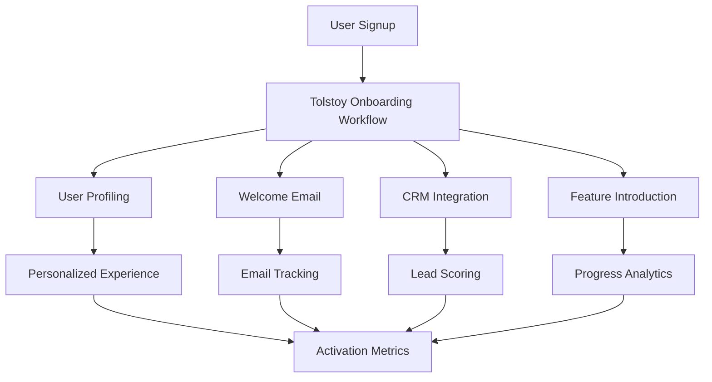

# User Onboarding Automation

Build a complete user onboarding system that automates the entire new user journey from signup to activation, with personalized workflows and comprehensive tracking.

## Overview

This example demonstrates:
- **Multi-step onboarding flows** with conditional logic
- **Real-time progress tracking** and user notifications
- **Integration with external services** (email, CRM, analytics)
- **Personalization based on user attributes**
- **A/B testing and conversion optimization**
- **Comprehensive error handling and recovery**

## Architecture



## Implementation

### 1. Core Onboarding Service

```typescript
import { TolstoyClient } from '@joosuhail/tolstoy-sdk';
import { EventEmitter } from 'events';

interface User {
  id: string;
  email: string;
  name: string;
  company?: string;
  role?: string;
  plan: 'free' | 'pro' | 'enterprise';
  signupSource: string;
  referralCode?: string;
}

interface OnboardingConfig {
  emailTemplates: {
    welcome: string;
    tutorial: string;
    activation: string;
  };
  features: {
    [plan: string]: string[];
  };
  webhookEndpoints: {
    progress: string;
    completion: string;
    failure: string;
  };
}

class UserOnboardingService extends EventEmitter {
  private client: TolstoyClient;
  private config: OnboardingConfig;
  private activeOnboardings = new Map<string, OnboardingSession>();
  
  constructor(client: TolstoyClient, config: OnboardingConfig) {
    super();
    this.client = client;
    this.config = config;
    
    // Set up webhook monitoring
    this.setupWebhookMonitoring();
  }
  
  async startOnboarding(user: User): Promise<OnboardingResult> {
    const sessionId = this.generateSessionId(user.id);
    console.log(`🚀 Starting onboarding for ${user.email} (${sessionId})`);
    
    try {
      // Create onboarding session
      const session = new OnboardingSession(sessionId, user);
      this.activeOnboardings.set(sessionId, session);
      
      // Emit onboarding started event
      this.emit('onboarding:started', { sessionId, user });
      
      // Execute onboarding workflow
      const execution = await this.executeOnboardingWorkflow(user, sessionId);
      
      // Set up progress monitoring
      await this.setupProgressMonitoring(sessionId, execution.executionId);
      
      // Update session
      session.executionId = execution.executionId;
      session.status = 'in_progress';
      session.startedAt = new Date();
      
      return {
        success: true,
        sessionId,
        executionId: execution.executionId,
        estimatedDuration: this.estimateOnboardingDuration(user),
        nextSteps: this.getNextSteps(user)
      };
      
    } catch (error) {
      console.error(`❌ Onboarding failed for ${user.email}:`, error.message);
      
      // Clean up failed session
      this.activeOnboardings.delete(sessionId);
      
      // Emit failure event
      this.emit('onboarding:failed', { sessionId, user, error: error.message });
      
      // Send failure notification
      await this.sendFailureNotification(user, error);
      
      return {
        success: false,
        error: error.message,
        sessionId,
        retryable: this.isRetryableError(error)
      };
    }
  }
  
  private async executeOnboardingWorkflow(user: User, sessionId: string) {
    // Prepare workflow inputs with user context
    const workflowInputs = {
      user: {
        id: user.id,
        email: user.email,
        name: user.name,
        company: user.company,
        role: user.role,
        plan: user.plan,
        signupSource: user.signupSource,
        referralCode: user.referralCode
      },
      session: {
        id: sessionId,
        timestamp: new Date().toISOString(),
        version: '2.1.0'
      },
      configuration: {
        emailTemplates: this.config.emailTemplates,
        features: this.config.features[user.plan] || this.config.features.free,
        personalization: this.getPersonalizationSettings(user),
        abTestVariant: this.getABTestVariant(user)
      },
      integrations: {
        crm: {
          enabled: true,
          updateContact: true,
          addToSequence: true
        },
        analytics: {
          enabled: true,
          trackEvents: true,
          customProperties: this.getAnalyticsProperties(user)
        },
        email: {
          enabled: true,
          provider: 'sendgrid',
          templateSet: this.getEmailTemplateSet(user)
        }
      }
    };
    
    // Execute the main onboarding workflow
    return await this.client.runFlow('user_onboarding_v2', workflowInputs);
  }
  
  private async setupProgressMonitoring(sessionId: string, executionId: string) {
    // Create webhook for progress tracking
    const progressWebhook = await this.client.createWebhook({
      name: `Onboarding Progress - ${sessionId}`,
      url: `${this.config.webhookEndpoints.progress}?sessionId=${sessionId}`,
      events: [
        'flow.step_completed',
        'flow.step_failed', 
        'flow.progress_updated',
        'flow.completed',
        'flow.failed'
      ],
      active: true,
      metadata: {
        sessionId,
        executionId,
        type: 'onboarding_progress'
      }
    });
    
    console.log(`📡 Progress monitoring set up: ${progressWebhook.data.id}`);
    return progressWebhook.data.id;
  }
  
  async getOnboardingProgress(sessionId: string): Promise<OnboardingProgress> {
    const session = this.activeOnboardings.get(sessionId);
    
    if (!session) {
      throw new Error(`Onboarding session not found: ${sessionId}`);
    }
    
    if (!session.executionId) {
      return {
        sessionId,
        status: session.status,
        progress: 0,
        currentStep: 'initializing'
      };
    }
    
    try {
      // Get execution status from Tolstoy
      const execution = await this.client.getFlowExecution(
        'user_onboarding_v2',
        session.executionId
      );
      
      const progress = this.calculateProgress(execution.data);
      
      // Update session
      session.lastChecked = new Date();
      session.progress = progress.percentage;
      session.currentStep = progress.currentStep;
      
      return {
        sessionId,
        status: execution.data.status,
        progress: progress.percentage,
        currentStep: progress.currentStep,
        completedSteps: progress.completedSteps,
        totalSteps: progress.totalSteps,
        estimatedTimeRemaining: progress.estimatedTimeRemaining,
        lastUpdated: new Date().toISOString()
      };
      
    } catch (error) {
      console.error(`Error getting progress for ${sessionId}:`, error.message);
      
      return {
        sessionId,
        status: 'error',
        progress: session.progress || 0,
        currentStep: session.currentStep || 'unknown',
        error: error.message
      };
    }
  }
  
  private calculateProgress(executionData: any): ProgressCalculation {
    // Define onboarding steps and their weights
    const steps = [
      { name: 'profile_setup', weight: 10, duration: 30 },
      { name: 'welcome_email', weight: 5, duration: 10 },
      { name: 'feature_introduction', weight: 30, duration: 120 },
      { name: 'tutorial_completion', weight: 25, duration: 180 },
      { name: 'first_action', weight: 20, duration: 60 },
      { name: 'activation_confirmation', weight: 10, duration: 30 }
    ];
    
    let completedWeight = 0;
    const totalWeight = steps.reduce((sum, step) => sum + step.weight, 0);
    let currentStep = steps[0].name;
    let estimatedTimeRemaining = 0;
    
    // Parse execution progress
    const completedSteps: string[] = [];
    
    if (executionData.progress?.steps) {
      for (const stepName of Object.keys(executionData.progress.steps)) {
        const stepStatus = executionData.progress.steps[stepName];
        const step = steps.find(s => s.name === stepName);
        
        if (step && stepStatus === 'completed') {
          completedWeight += step.weight;
          completedSteps.push(stepName);
        } else if (step && stepStatus === 'in_progress') {
          currentStep = stepName;
          completedWeight += step.weight * 0.5; // Partial credit
        }
      }
      
      // Calculate remaining time
      const remainingSteps = steps.filter(s => !completedSteps.includes(s.name));
      estimatedTimeRemaining = remainingSteps.reduce((sum, step) => sum + step.duration, 0);
    }
    
    return {
      percentage: Math.round((completedWeight / totalWeight) * 100),
      currentStep,
      completedSteps,
      totalSteps: steps.length,
      estimatedTimeRemaining
    };
  }
  
  async handleWebhookEvent(event: OnboardingWebhookEvent) {
    const { sessionId, type, data } = event;
    const session = this.activeOnboardings.get(sessionId);
    
    if (!session) {
      console.warn(`Received webhook for unknown session: ${sessionId}`);
      return;
    }
    
    console.log(`📨 Webhook event for ${sessionId}: ${type}`);
    
    switch (type) {
      case 'step_completed':
        await this.handleStepCompleted(session, data);
        break;
        
      case 'step_failed':
        await this.handleStepFailed(session, data);
        break;
        
      case 'progress_updated':
        await this.handleProgressUpdate(session, data);
        break;
        
      case 'onboarding_completed':
        await this.handleOnboardingCompleted(session, data);
        break;
        
      case 'onboarding_failed':
        await this.handleOnboardingFailed(session, data);
        break;
    }
    
    // Emit event for external listeners
    this.emit(`onboarding:${type}`, { sessionId, session, data });
  }
  
  private async handleStepCompleted(session: OnboardingSession, data: any) {
    console.log(`✅ Step completed: ${data.stepName} for ${session.user.email}`);
    
    // Update session progress
    session.completedSteps.push(data.stepName);
    session.lastActivity = new Date();
    
    // Send step completion notification
    await this.sendStepNotification(session, data.stepName, 'completed');
    
    // Trigger any follow-up actions
    await this.triggerStepFollowUp(session, data.stepName);
  }
  
  private async handleOnboardingCompleted(session: OnboardingSession, data: any) {
    console.log(`🎉 Onboarding completed for ${session.user.email}`);
    
    // Update session
    session.status = 'completed';
    session.completedAt = new Date();
    session.progress = 100;
    
    // Calculate metrics
    const duration = session.completedAt.getTime() - session.startedAt!.getTime();
    const metrics = {
      duration: Math.round(duration / 1000), // seconds
      stepsCompleted: session.completedSteps.length,
      conversionEvents: data.conversionEvents || [],
      activationScore: data.activationScore || 0
    };
    
    // Send completion notifications
    await this.sendCompletionNotification(session, metrics);
    
    // Update external systems
    await this.updateExternalSystems(session, 'completed', metrics);
    
    // Clean up session
    setTimeout(() => {
      this.activeOnboardings.delete(session.id);
    }, 300000); // Keep for 5 minutes for final queries
    
    // Emit completion event
    this.emit('onboarding:completed', { session, metrics });
  }
  
  private async sendStepNotification(
    session: OnboardingSession, 
    stepName: string, 
    status: string
  ) {
    // Send real-time notification to user
    const notification = {
      userId: session.user.id,
      type: 'onboarding_progress',
      title: this.getStepTitle(stepName),
      message: this.getStepMessage(stepName, status),
      timestamp: new Date().toISOString(),
      metadata: {
        sessionId: session.id,
        stepName,
        status,
        progress: session.progress
      }
    };
    
    // Send via WebSocket, push notification, or email
    await this.sendNotification(notification);
  }
  
  private async triggerStepFollowUp(session: OnboardingSession, stepName: string) {
    // Define follow-up actions for each step
    const followUpActions = {
      profile_setup: () => this.sendPersonalizedWelcome(session),
      welcome_email: () => this.trackEmailEngagement(session),
      feature_introduction: () => this.scheduleFeatureTutorial(session),
      tutorial_completion: () => this.enableAdvancedFeatures(session),
      first_action: () => this.sendSuccessEncouragement(session),
      activation_confirmation: () => this.setupOngoingEngagement(session)
    };
    
    const followUpAction = followUpActions[stepName as keyof typeof followUpActions];
    if (followUpAction) {
      try {
        await followUpAction();
      } catch (error) {
        console.error(`Follow-up action failed for ${stepName}:`, error.message);
      }
    }
  }
  
  // Personalization methods
  private getPersonalizationSettings(user: User) {
    return {
      industry: this.detectIndustry(user.company),
      experienceLevel: this.detectExperienceLevel(user),
      primaryUseCase: this.detectPrimaryUseCase(user),
      communicationPreference: this.detectCommunicationPreference(user)
    };
  }
  
  private getABTestVariant(user: User): string {
    // Simple A/B test based on user ID hash
    const hash = this.hashString(user.id);
    const variants = ['control', 'variant_a', 'variant_b'];
    return variants[hash % variants.length];
  }
  
  private getEmailTemplateSet(user: User): string {
    // Return template set based on user attributes
    if (user.plan === 'enterprise') return 'enterprise';
    if (user.company) return 'business';
    return 'individual';
  }
  
  private getAnalyticsProperties(user: User) {
    return {
      user_plan: user.plan,
      signup_source: user.signupSource,
      has_referral: !!user.referralCode,
      company_size: this.estimateCompanySize(user.company),
      industry: this.detectIndustry(user.company)
    };
  }
  
  // Utility methods
  private generateSessionId(userId: string): string {
    return `onboarding_${userId}_${Date.now()}_${Math.random().toString(36).substr(2, 9)}`;
  }
  
  private estimateOnboardingDuration(user: User): number {
    // Estimate based on plan and user attributes
    const baseDuration = 600; // 10 minutes
    const planMultiplier = { free: 1, pro: 1.2, enterprise: 1.5 };
    return baseDuration * (planMultiplier[user.plan] || 1);
  }
  
  private getNextSteps(user: User): string[] {
    const baseSteps = [
      'Complete your profile',
      'Verify your email address',
      'Take the product tour'
    ];
    
    if (user.plan === 'enterprise') {
      baseSteps.push('Schedule onboarding call');
    }
    
    return baseSteps;
  }
  
  private hashString(str: string): number {
    let hash = 0;
    for (let i = 0; i < str.length; i++) {
      const char = str.charCodeAt(i);
      hash = ((hash << 5) - hash) + char;
      hash = hash & hash; // Convert to 32-bit integer
    }
    return Math.abs(hash);
  }
  
  private async setupWebhookMonitoring() {
    // Set up webhook endpoints for monitoring
    // Implementation depends on your web framework (Express, Fastify, etc.)
  }
  
  private isRetryableError(error: any): boolean {
    // Determine if error is retryable
    return error.response?.status >= 500 || error.code === 'NETWORK_ERROR';
  }
  
  // Additional helper methods...
  private detectIndustry(company?: string): string { return 'unknown'; }
  private detectExperienceLevel(user: User): string { return 'beginner'; }
  private detectPrimaryUseCase(user: User): string { return 'general'; }
  private detectCommunicationPreference(user: User): string { return 'email'; }
  private estimateCompanySize(company?: string): string { return 'unknown'; }
  private getStepTitle(stepName: string): string { return stepName.replace('_', ' '); }
  private getStepMessage(stepName: string, status: string): string { return `${stepName} ${status}`; }
  private async sendNotification(notification: any): Promise<void> { }
  private async sendPersonalizedWelcome(session: OnboardingSession): Promise<void> { }
  private async trackEmailEngagement(session: OnboardingSession): Promise<void> { }
  private async scheduleFeatureTutorial(session: OnboardingSession): Promise<void> { }
  private async enableAdvancedFeatures(session: OnboardingSession): Promise<void> { }
  private async sendSuccessEncouragement(session: OnboardingSession): Promise<void> { }
  private async setupOngoingEngagement(session: OnboardingSession): Promise<void> { }
  private async sendFailureNotification(user: User, error: any): Promise<void> { }
  private async sendCompletionNotification(session: OnboardingSession, metrics: any): Promise<void> { }
  private async updateExternalSystems(session: OnboardingSession, status: string, metrics?: any): Promise<void> { }
}

// Supporting interfaces
interface OnboardingSession {
  id: string;
  user: User;
  executionId?: string;
  status: 'pending' | 'in_progress' | 'completed' | 'failed';
  progress: number;
  currentStep: string;
  completedSteps: string[];
  startedAt?: Date;
  completedAt?: Date;
  lastActivity?: Date;
  lastChecked?: Date;
}

interface OnboardingResult {
  success: boolean;
  sessionId: string;
  executionId?: string;
  estimatedDuration?: number;
  nextSteps?: string[];
  error?: string;
  retryable?: boolean;
}

interface OnboardingProgress {
  sessionId: string;
  status: string;
  progress: number;
  currentStep: string;
  completedSteps?: string[];
  totalSteps?: number;
  estimatedTimeRemaining?: number;
  lastUpdated?: string;
  error?: string;
}

interface ProgressCalculation {
  percentage: number;
  currentStep: string;
  completedSteps: string[];
  totalSteps: number;
  estimatedTimeRemaining: number;
}

interface OnboardingWebhookEvent {
  sessionId: string;
  type: string;
  data: any;
}

class OnboardingSession {
  public id: string;
  public user: User;
  public executionId?: string;
  public status: 'pending' | 'in_progress' | 'completed' | 'failed' = 'pending';
  public progress: number = 0;
  public currentStep: string = 'initializing';
  public completedSteps: string[] = [];
  public startedAt?: Date;
  public completedAt?: Date;
  public lastActivity?: Date;
  public lastChecked?: Date;
  
  constructor(id: string, user: User) {
    this.id = id;
    this.user = user;
  }
}
```

### 2. Express.js Integration

```typescript
import express from 'express';
import { UserOnboardingService } from './onboarding-service';
import { TolstoyClient } from '@joosuhail/tolstoy-sdk';

const app = express();
app.use(express.json());

// Initialize services
const tolstoyClient = new TolstoyClient(
  process.env.TOLSTOY_API_URL!,
  process.env.TOLSTOY_ORG_ID!,
  process.env.TOLSTOY_USER_ID!,
  process.env.TOLSTOY_API_KEY!
);

const onboardingConfig = {
  emailTemplates: {
    welcome: 'welcome-v2',
    tutorial: 'tutorial-series',
    activation: 'activation-success'
  },
  features: {
    free: ['basic_dashboard', 'community_support'],
    pro: ['advanced_analytics', 'email_support', 'api_access'],
    enterprise: ['custom_integrations', 'dedicated_support', 'sso']
  },
  webhookEndpoints: {
    progress: `${process.env.APP_URL}/api/onboarding/webhook/progress`,
    completion: `${process.env.APP_URL}/api/onboarding/webhook/completion`,
    failure: `${process.env.APP_URL}/api/onboarding/webhook/failure`
  }
};

const onboardingService = new UserOnboardingService(tolstoyClient, onboardingConfig);

// API Endpoints
app.post('/api/onboarding/start', async (req, res) => {
  try {
    const user = req.body.user;
    
    // Validate user data
    if (!user.email || !user.id) {
      return res.status(400).json({ 
        error: 'Missing required user fields: email, id' 
      });
    }
    
    const result = await onboardingService.startOnboarding(user);
    
    if (result.success) {
      res.json({
        success: true,
        sessionId: result.sessionId,
        executionId: result.executionId,
        estimatedDuration: result.estimatedDuration,
        nextSteps: result.nextSteps
      });
    } else {
      res.status(500).json({
        success: false,
        error: result.error,
        retryable: result.retryable
      });
    }
  } catch (error) {
    res.status(500).json({
      success: false,
      error: error.message
    });
  }
});

app.get('/api/onboarding/progress/:sessionId', async (req, res) => {
  try {
    const { sessionId } = req.params;
    const progress = await onboardingService.getOnboardingProgress(sessionId);
    
    res.json(progress);
  } catch (error) {
    res.status(404).json({
      error: error.message
    });
  }
});

// Webhook endpoints
app.post('/api/onboarding/webhook/progress', async (req, res) => {
  try {
    const event = req.body;
    await onboardingService.handleWebhookEvent({
      sessionId: req.query.sessionId as string,
      type: event.type || 'progress_updated',
      data: event
    });
    
    res.json({ received: true });
  } catch (error) {
    console.error('Webhook processing failed:', error);
    res.status(500).json({ error: error.message });
  }
});

// Real-time progress endpoint (Server-Sent Events)
app.get('/api/onboarding/stream/:sessionId', async (req, res) => {
  const { sessionId } = req.params;
  
  // Set up SSE headers
  res.writeHead(200, {
    'Content-Type': 'text/event-stream',
    'Cache-Control': 'no-cache',
    'Connection': 'keep-alive',
    'Access-Control-Allow-Origin': '*'
  });
  
  // Send initial progress
  try {
    const progress = await onboardingService.getOnboardingProgress(sessionId);
    res.write(`data: ${JSON.stringify(progress)}\n\n`);
  } catch (error) {
    res.write(`data: ${JSON.stringify({ error: error.message })}\n\n`);
  }
  
  // Set up progress updates
  const progressInterval = setInterval(async () => {
    try {
      const progress = await onboardingService.getOnboardingProgress(sessionId);
      res.write(`data: ${JSON.stringify(progress)}\n\n`);
      
      if (progress.status === 'completed' || progress.status === 'failed') {
        clearInterval(progressInterval);
        res.end();
      }
    } catch (error) {
      res.write(`data: ${JSON.stringify({ error: error.message })}\n\n`);
    }
  }, 5000); // Update every 5 seconds
  
  // Clean up on client disconnect
  req.on('close', () => {
    clearInterval(progressInterval);
    res.end();
  });
});

// Event listeners for onboarding service
onboardingService.on('onboarding:started', (data) => {
  console.log(`📊 Analytics: Onboarding started for ${data.user.email}`);
  // Send to analytics service
});

onboardingService.on('onboarding:completed', (data) => {
  console.log(`📊 Analytics: Onboarding completed for ${data.session.user.email}`);
  console.log(`📈 Metrics:`, data.metrics);
  // Send conversion event to analytics
});

onboardingService.on('onboarding:failed', (data) => {
  console.log(`🚨 Alert: Onboarding failed for ${data.user.email}: ${data.error}`);
  // Send alert to monitoring service
});

app.listen(3000, () => {
  console.log('🚀 Onboarding service running on port 3000');
});
```

### 3. Frontend Integration (React)

```typescript
// hooks/useOnboarding.ts
import { useState, useEffect, useCallback } from 'react';

interface UseOnboardingResult {
  startOnboarding: (user: User) => Promise<void>;
  progress: OnboardingProgress | null;
  isLoading: boolean;
  error: string | null;
  sessionId: string | null;
}

export function useOnboarding(): UseOnboardingResult {
  const [progress, setProgress] = useState<OnboardingProgress | null>(null);
  const [isLoading, setIsLoading] = useState(false);
  const [error, setError] = useState<string | null>(null);
  const [sessionId, setSessionId] = useState<string | null>(null);
  const [eventSource, setEventSource] = useState<EventSource | null>(null);
  
  const startOnboarding = useCallback(async (user: User) => {
    setIsLoading(true);
    setError(null);
    
    try {
      const response = await fetch('/api/onboarding/start', {
        method: 'POST',
        headers: { 'Content-Type': 'application/json' },
        body: JSON.stringify({ user })
      });
      
      const result = await response.json();
      
      if (result.success) {
        setSessionId(result.sessionId);
        
        // Set up real-time progress monitoring
        const es = new EventSource(`/api/onboarding/stream/${result.sessionId}`);
        
        es.onmessage = (event) => {
          const progressData = JSON.parse(event.data);
          setProgress(progressData);
          
          if (progressData.status === 'completed' || progressData.status === 'failed') {
            es.close();
            setEventSource(null);
          }
        };
        
        es.onerror = (error) => {
          console.error('SSE Error:', error);
          es.close();
          setEventSource(null);
        };
        
        setEventSource(es);
      } else {
        setError(result.error);
      }
    } catch (err) {
      setError(err.message);
    } finally {
      setIsLoading(false);
    }
  }, []);
  
  // Cleanup on unmount
  useEffect(() => {
    return () => {
      if (eventSource) {
        eventSource.close();
      }
    };
  }, [eventSource]);
  
  return {
    startOnboarding,
    progress,
    isLoading,
    error,
    sessionId
  };
}

// components/OnboardingFlow.tsx
import React from 'react';
import { useOnboarding } from '../hooks/useOnboarding';

interface Props {
  user: User;
  onComplete: () => void;
}

export function OnboardingFlow({ user, onComplete }: Props) {
  const { startOnboarding, progress, isLoading, error, sessionId } = useOnboarding();
  
  const handleStart = () => {
    startOnboarding(user);
  };
  
  React.useEffect(() => {
    if (progress?.status === 'completed') {
      onComplete();
    }
  }, [progress?.status, onComplete]);
  
  if (error) {
    return (
      <div className="bg-red-50 border border-red-200 rounded-lg p-6">
        <h3 className="text-lg font-semibold text-red-800 mb-2">
          Onboarding Error
        </h3>
        <p className="text-red-600 mb-4">{error}</p>
        <button 
          onClick={handleStart}
          className="bg-red-600 text-white px-4 py-2 rounded hover:bg-red-700"
        >
          Try Again
        </button>
      </div>
    );
  }
  
  if (!sessionId) {
    return (
      <div className="text-center">
        <h2 className="text-2xl font-bold mb-4">Welcome to Our Platform!</h2>
        <p className="text-gray-600 mb-6">
          Let's get you set up with a quick onboarding process.
        </p>
        <button 
          onClick={handleStart}
          disabled={isLoading}
          className="bg-blue-600 text-white px-6 py-3 rounded-lg hover:bg-blue-700 disabled:opacity-50"
        >
          {isLoading ? 'Starting...' : 'Start Onboarding'}
        </button>
      </div>
    );
  }
  
  return (
    <div className="max-w-2xl mx-auto">
      <div className="mb-6">
        <div className="flex justify-between items-center mb-2">
          <h3 className="text-lg font-semibold">Getting You Started</h3>
          <span className="text-sm text-gray-500">
            {progress?.progress || 0}% Complete
          </span>
        </div>
        
        {/* Progress bar */}
        <div className="w-full bg-gray-200 rounded-full h-2">
          <div 
            className="bg-blue-600 h-2 rounded-full transition-all duration-300"
            style={{ width: `${progress?.progress || 0}%` }}
          />
        </div>
        
        {progress?.currentStep && (
          <p className="text-sm text-gray-600 mt-2">
            Current step: {progress.currentStep.replace('_', ' ')}
          </p>
        )}
        
        {progress?.estimatedTimeRemaining && (
          <p className="text-sm text-gray-500">
            Estimated time remaining: {Math.ceil(progress.estimatedTimeRemaining / 60)} minutes
          </p>
        )}
      </div>
      
      {/* Step details */}
      <div className="bg-white border rounded-lg p-6">
        <h4 className="font-medium mb-2">
          {getStepTitle(progress?.currentStep || 'initializing')}
        </h4>
        <p className="text-gray-600 mb-4">
          {getStepDescription(progress?.currentStep || 'initializing')}
        </p>
        
        {progress?.status === 'in_progress' && (
          <div className="flex items-center text-blue-600">
            <div className="animate-spin rounded-full h-4 w-4 border-b-2 border-blue-600 mr-2"></div>
            <span className="text-sm">Processing...</span>
          </div>
        )}
        
        {progress?.status === 'completed' && (
          <div className="text-green-600">
            <span className="text-sm">✅ All done! Welcome aboard!</span>
          </div>
        )}
        
        {progress?.status === 'failed' && (
          <div className="text-red-600">
            <span className="text-sm">❌ Something went wrong. Please try again.</span>
          </div>
        )}
      </div>
      
      {/* Completed steps */}
      {progress?.completedSteps && progress.completedSteps.length > 0 && (
        <div className="mt-6">
          <h4 className="font-medium mb-3">Completed Steps</h4>
          <div className="space-y-2">
            {progress.completedSteps.map((step, index) => (
              <div key={index} className="flex items-center text-green-600">
                <span className="mr-2">✅</span>
                <span className="text-sm">{step.replace('_', ' ')}</span>
              </div>
            ))}
          </div>
        </div>
      )}
    </div>
  );
}

function getStepTitle(step: string): string {
  const titles = {
    initializing: 'Setting Things Up',
    profile_setup: 'Creating Your Profile',
    welcome_email: 'Sending Welcome Email',
    feature_introduction: 'Introducing Key Features',
    tutorial_completion: 'Completing Tutorial',
    first_action: 'First Action',
    activation_confirmation: 'Finalizing Setup'
  };
  return titles[step as keyof typeof titles] || step.replace('_', ' ');
}

function getStepDescription(step: string): string {
  const descriptions = {
    initializing: 'We\'re preparing your personalized onboarding experience...',
    profile_setup: 'Setting up your profile with the information you provided...',
    welcome_email: 'Sending you a personalized welcome email with next steps...',
    feature_introduction: 'Introducing you to the features available in your plan...',
    tutorial_completion: 'Walking you through our interactive tutorial...',
    first_action: 'Setting up your first workflow or action...',
    activation_confirmation: 'Finalizing your account setup and sending confirmation...'
  };
  return descriptions[step as keyof typeof descriptions] || 'Processing your onboarding step...';
}
```

### 4. Analytics and Monitoring

```typescript
// analytics/onboarding-analytics.ts
class OnboardingAnalytics {
  private analyticsClient: any; // Your analytics service client
  
  constructor(analyticsClient: any) {
    this.analyticsClient = analyticsClient;
  }
  
  trackOnboardingStarted(user: User, sessionId: string) {
    this.analyticsClient.track('Onboarding Started', {
      userId: user.id,
      sessionId,
      plan: user.plan,
      signupSource: user.signupSource,
      hasReferral: !!user.referralCode,
      timestamp: new Date().toISOString()
    });
  }
  
  trackStepCompleted(user: User, sessionId: string, step: string, duration: number) {
    this.analyticsClient.track('Onboarding Step Completed', {
      userId: user.id,
      sessionId,
      step,
      duration,
      timestamp: new Date().toISOString()
    });
  }
  
  trackOnboardingCompleted(user: User, sessionId: string, metrics: any) {
    this.analyticsClient.track('Onboarding Completed', {
      userId: user.id,
      sessionId,
      totalDuration: metrics.duration,
      stepsCompleted: metrics.stepsCompleted,
      activationScore: metrics.activationScore,
      plan: user.plan,
      timestamp: new Date().toISOString()
    });
    
    // Identify user for better tracking
    this.analyticsClient.identify(user.id, {
      email: user.email,
      name: user.name,
      plan: user.plan,
      onboardingCompleted: true,
      onboardingCompletedAt: new Date().toISOString(),
      activationScore: metrics.activationScore
    });
  }
  
  trackOnboardingAbandoned(user: User, sessionId: string, step: string, duration: number) {
    this.analyticsClient.track('Onboarding Abandoned', {
      userId: user.id,
      sessionId,
      abandonedAtStep: step,
      timeSpent: duration,
      plan: user.plan,
      timestamp: new Date().toISOString()
    });
  }
}

// monitoring/onboarding-monitoring.ts
class OnboardingMonitoring {
  private metrics = new Map<string, number>();
  
  incrementCounter(metric: string, value: number = 1) {
    this.metrics.set(metric, (this.metrics.get(metric) || 0) + value);
  }
  
  trackOnboardingMetrics(event: string, data: any) {
    switch (event) {
      case 'started':
        this.incrementCounter('onboarding_started_total');
        this.incrementCounter(`onboarding_started_${data.user.plan}`);
        break;
        
      case 'completed':
        this.incrementCounter('onboarding_completed_total');
        this.incrementCounter(`onboarding_completed_${data.session.user.plan}`);
        
        // Track completion time buckets
        const duration = data.metrics.duration;
        if (duration < 300) this.incrementCounter('onboarding_completed_under_5min');
        else if (duration < 600) this.incrementCounter('onboarding_completed_5_10min');
        else if (duration < 1200) this.incrementCounter('onboarding_completed_10_20min');
        else this.incrementCounter('onboarding_completed_over_20min');
        break;
        
      case 'failed':
        this.incrementCounter('onboarding_failed_total');
        this.incrementCounter(`onboarding_failed_${data.user.plan}`);
        break;
        
      case 'abandoned':
        this.incrementCounter('onboarding_abandoned_total');
        this.incrementCounter(`onboarding_abandoned_${data.user.plan}`);
        this.incrementCounter(`onboarding_abandoned_at_${data.step}`);
        break;
    }
  }
  
  getMetrics() {
    return Object.fromEntries(this.metrics.entries());
  }
  
  calculateConversionRate() {
    const started = this.metrics.get('onboarding_started_total') || 0;
    const completed = this.metrics.get('onboarding_completed_total') || 0;
    
    return started > 0 ? (completed / started) * 100 : 0;
  }
}
```

## Testing

### Unit Tests

```typescript
import { UserOnboardingService } from '../onboarding-service';
import { TolstoyClient } from '@joosuhail/tolstoy-sdk';

jest.mock('@joosuhail/tolstoy-sdk');

describe('UserOnboardingService', () => {
  let service: UserOnboardingService;
  let mockClient: jest.Mocked<TolstoyClient>;
  
  beforeEach(() => {
    mockClient = {
      runFlow: jest.fn(),
      createWebhook: jest.fn(),
      getFlowExecution: jest.fn()
    } as any;
    
    const config = {
      emailTemplates: { welcome: 'test', tutorial: 'test', activation: 'test' },
      features: { free: ['basic'] },
      webhookEndpoints: { progress: 'test', completion: 'test', failure: 'test' }
    };
    
    service = new UserOnboardingService(mockClient, config);
  });
  
  describe('startOnboarding', () => {
    it('should start onboarding successfully', async () => {
      const user = {
        id: 'user123',
        email: 'test@example.com',
        name: 'Test User',
        plan: 'free' as const,
        signupSource: 'web'
      };
      
      mockClient.runFlow.mockResolvedValue({
        data: { executionId: 'exec123', status: 'running' }
      });
      
      mockClient.createWebhook.mockResolvedValue({
        data: { id: 'webhook123' }
      });
      
      const result = await service.startOnboarding(user);
      
      expect(result.success).toBe(true);
      expect(result.sessionId).toBeDefined();
      expect(result.executionId).toBe('exec123');
      expect(mockClient.runFlow).toHaveBeenCalledWith('user_onboarding_v2', expect.any(Object));
    });
  });
});
```

## Key Features Demonstrated

✅ **Complete workflow automation** with user context and personalization
✅ **Real-time progress tracking** using webhooks and Server-Sent Events
✅ **Multi-step onboarding** with conditional logic based on user attributes
✅ **Integration patterns** for email, CRM, and analytics services
✅ **Error handling and recovery** with retry mechanisms
✅ **A/B testing support** for conversion optimization
✅ **Comprehensive monitoring** and analytics tracking
✅ **Production-ready patterns** with proper error boundaries

This example shows how to build a sophisticated user onboarding system that leverages the full power of the Tolstoy SDK for workflow automation, real-time monitoring, and seamless integration with external services.

---

*🚀 This implementation provides a complete foundation for automated user onboarding that can be customized for any SaaS application or platform.*